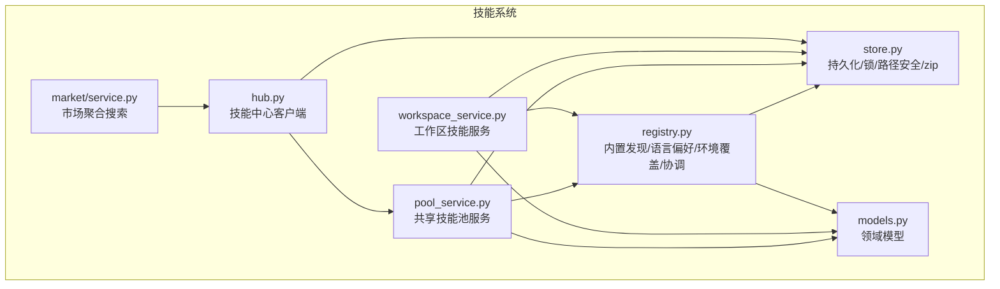
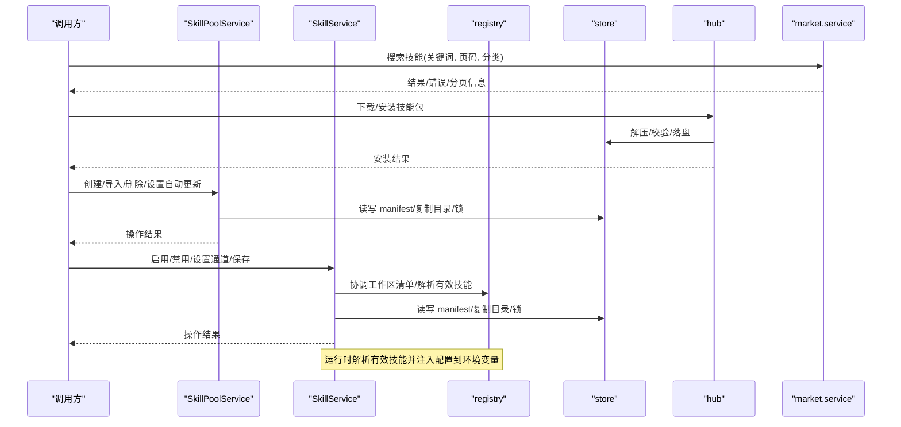
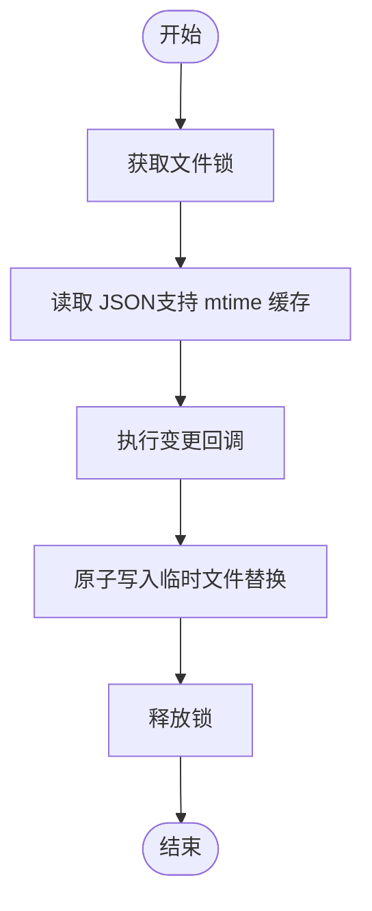
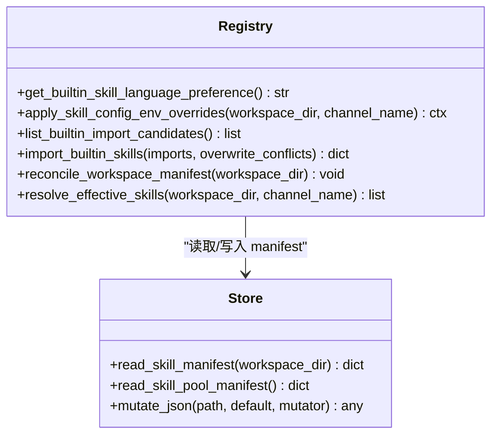
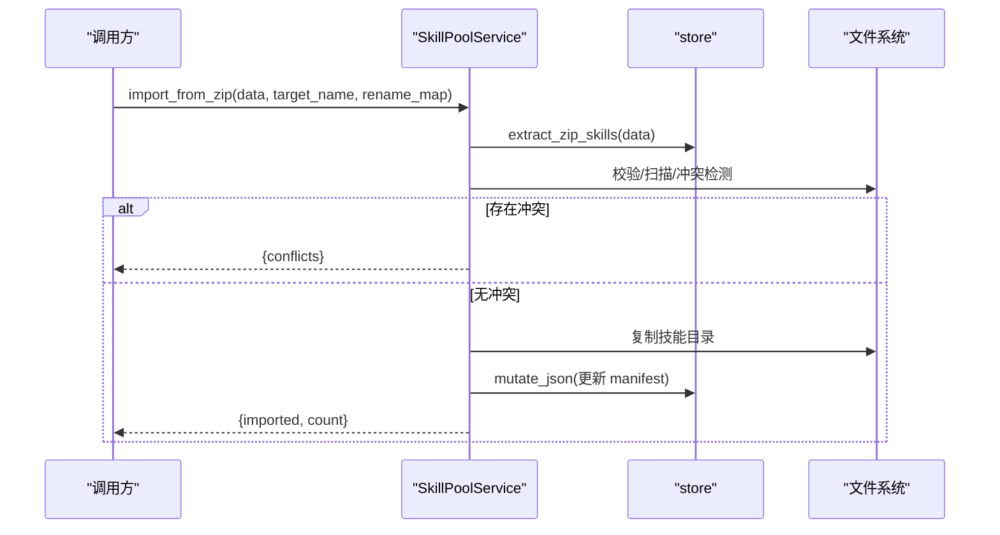
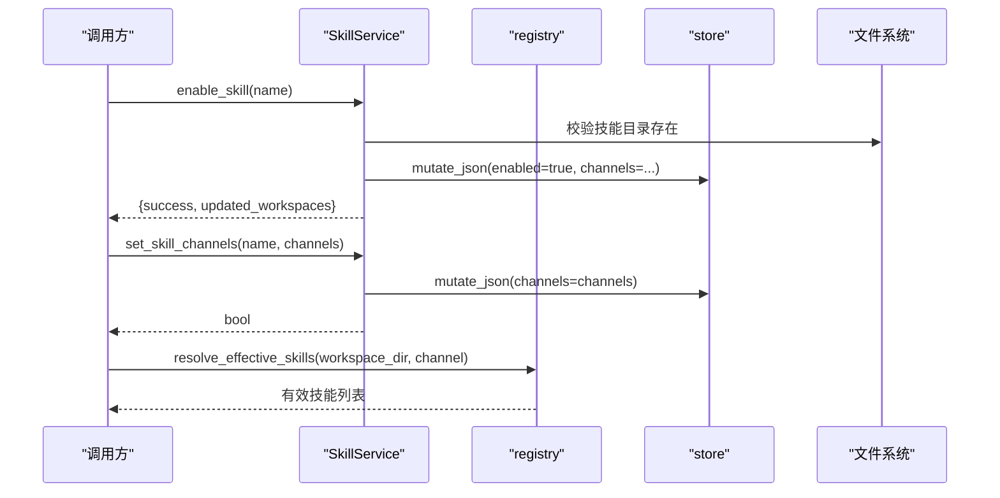
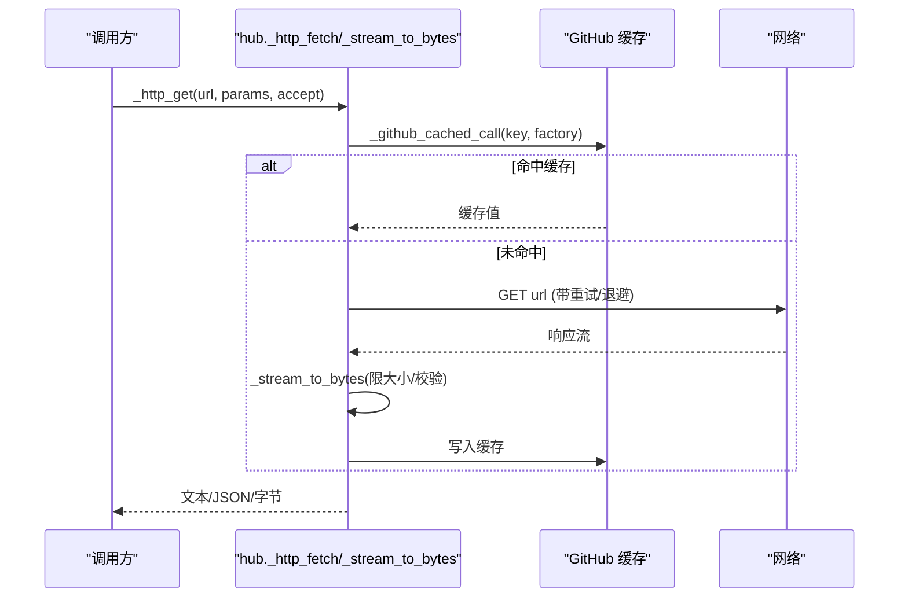
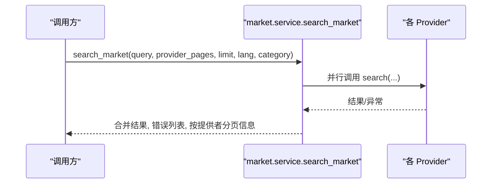
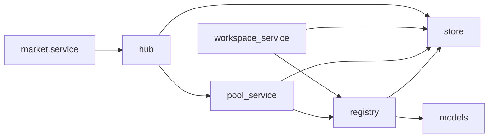

# 技能系统

<cite>
**本文引用的文件**   
- [__init__.py](file://src/qwenpaw/agents/skill_system/__init__.py)
- [models.py](file://src/qwenpaw/agents/skill_system/models.py)
- [registry.py](file://src/qwenpaw/agents/skill_system/registry.py)
- [store.py](file://src/qwenpaw/agents/skill_system/store.py)
- [pool_service.py](file://src/qwenpaw/agents/skill_system/pool_service.py)
- [workspace_service.py](file://src/qwenpaw/agents/skill_system/workspace_service.py)
- [hub.py](file://src/qwenpaw/agents/skill_system/hub.py)
- [constant.py](file://src/qwenpaw/constant.py)
- [market/__init__.py](file://src/qwenpaw/market/__init__.py)
- [market/service.py](file://src/qwenpaw/market/service.py)
</cite>

## 目录
1. [简介](#简介)
2. [项目结构](#项目结构)
3. [核心组件](#核心组件)
4. [架构总览](#架构总览)
5. [详细组件分析](#详细组件分析)
6. [依赖关系分析](#依赖关系分析)
7. [性能与并发特性](#性能与并发特性)
8. [常见问题与排障](#常见问题与排障)
9. [结论](#结论)
10. [附录：配置与环境变量](#附录配置与环境变量)

## 简介
本文件系统性阐述 QwenPaw 的技能系统，覆盖技能发现机制、注册表管理、池服务与工作区服务、内置技能导入与语言偏好、环境注入、市场搜索与安装流程等。文档面向初学者提供循序渐进的说明，同时为有经验的开发者提供代码级细节、调用关系、接口契约与领域模型。

## 项目结构
技能系统位于 agents/skill_system 下，围绕“共享技能池”和“工作区技能”两大概念组织：
- models：领域模型（SkillInfo、BuiltinSkillIdentity/Variant、SkillRequirements）
- store：持久化与文件系统工具（manifest、原子写入、锁、路径安全、zip 处理）
- registry：内置技能发现、语言偏好、环境覆盖、工作区清单协调、有效技能解析
- pool_service：共享技能池生命周期（创建、导入、删除、自动更新、重命名迁移）
- workspace_service：工作区技能生命周期（创建、保存、启用/禁用、通道路由、文件访问）
- hub：技能中心客户端（HTTP 重试、缓存、取消检查、包下载与校验）
- market：技能市场聚合层（多提供者并行搜索、分类路由）

图表来源
- [registry.py:1-120](file://src/qwenpaw/agents/skill_system/registry.py#L1-L120)
- [store.py:1-120](file://src/qwenpaw/agents/skill_system/store.py#L1-L120)
- [pool_service.py:1-120](file://src/qwenpaw/agents/skill_system/pool_service.py#L1-L120)
- [workspace_service.py:1-120](file://src/qwenpaw/agents/skill_system/workspace_service.py#L1-L120)
- [hub.py:1-120](file://src/qwenpaw/agents/skill_system/hub.py#L1-L120)
- [market/service.py:1-80](file://src/qwenpaw/market/service.py#L1-L80)
- [models.py:1-81](file://src/qwenpaw/agents/skill_system/models.py#L1-L81)

章节来源
- [__init__.py:1-46](file://src/qwenpaw/agents/skill_system/__init__.py#L1-L46)

## 核心组件
- 领域模型
  - SkillInfo：对外返回的技能详情（名称、描述、版本、内容、来源、引用、脚本、表情等）
  - BuiltinSkillIdentity/BuiltinSkillVariant：内置技能的标识与语言变体
  - SkillRequirements：声明式系统要求（二进制、环境变量）
- 存储与持久化
  - 跨进程 JSON 锁 + 原子写入；mtime 缓存读取；zip 解压与安全校验；路径安全与冲突名建议
- 注册表与协调
  - 内置技能扫描与语言偏好选择；工作区清单协调；有效技能解析；按渠道的环境注入
- 共享技能池服务
  - 创建/导入/删除/标签/自动更新/重命名并迁移到工作区
- 工作区技能服务
  - 创建/保存/启用/禁用/通道范围/标签/删除/文件读取
- 技能中心客户端
  - HTTP 重试/退避/超时/取消检查；GitHub 响应缓存；包流式下载与大小限制
- 市场聚合
  - 多提供者并行搜索、错误汇总、分页与类别路由

章节来源
- [models.py:1-81](file://src/qwenpaw/agents/skill_system/models.py#L1-L81)
- [store.py:320-395](file://src/qwenpaw/agents/skill_system/store.py#L320-L395)
- [registry.py:62-117](file://src/qwenpaw/agents/skill_system/registry.py#L62-L117)
- [pool_service.py:121-236](file://src/qwenpaw/agents/skill_system/pool_service.py#L121-L236)
- [workspace_service.py:88-227](file://src/qwenpaw/agents/skill_system/workspace_service.py#L88-L227)
- [hub.py:375-604](file://src/qwenpaw/agents/skill_system/hub.py#L375-L604)
- [market/service.py:38-76](file://src/qwenpaw/market/service.py#L38-L76)

## 架构总览
技能系统以“共享技能池 + 工作区技能”双源为核心，通过注册表进行统一发现与协调，运行时根据工作区清单与渠道上下文解析出“有效技能集”，并在一次 Agent 回合中注入配置到环境变量。

图表来源
- [market/service.py:38-76](file://src/qwenpaw/market/service.py#L38-L76)
- [hub.py:472-604](file://src/qwenpaw/agents/skill_system/hub.py#L472-L604)
- [pool_service.py:121-236](file://src/qwenpaw/agents/skill_system/pool_service.py#L121-L236)
- [workspace_service.py:145-227](file://src/qwenpaw/agents/skill_system/workspace_service.py#L145-L227)
- [registry.py:347-392](file://src/qwenpaw/agents/skill_system/registry.py#L347-L392)
- [store.py:384-395](file://src/qwenpaw/agents/skill_system/store.py#L384-L395)

## 详细组件分析

### 领域模型与常量
- SkillInfo：用于 API 返回的统一技能视图，包含 name/description/version_text/content/source/references/scripts/emoji
- BuiltinSkillIdentity/BuiltinSkillVariant：内置技能的语言变体元数据
- SkillRequirements：声明 require_bins / require_envs，供运行时校验或提示

章节来源
- [models.py:29-81](file://src/qwenpaw/agents/skill_system/models.py#L29-L81)

### 存储与持久化（store）
- 关键能力
  - 跨进程 JSON 锁（fcntl/msvcrt）+ 原子写入（临时文件替换）
  - mtime 缓存读取，避免频繁 IO
  - zip 解压安全检查（路径穿越、软链接、大小限制）
  - 路径安全与冲突名建议（时间戳后缀）
  - 默认 manifest 结构与字段规范化
- 典型函数
  - mutate_json/read_json/write_json_atomic
  - extract_zip_skills/import_skill_dir/copy_skill_dir
  - safe_skill_dir/normalize_skill_dir_name/suggest_conflict_name
  - read_skill_manifest/read_skill_pool_manifest

图表来源
- [store.py:324-395](file://src/qwenpaw/agents/skill_system/store.py#L324-L395)

章节来源
- [store.py:320-395](file://src/qwenpaw/agents/skill_system/store.py#L320-L395)
- [store.py:482-503](file://src/qwenpaw/agents/skill_system/store.py#L482-L503)
- [store.py:526-556](file://src/qwenpaw/agents/skill_system/store.py#L526-L556)
- [store.py:671-692](file://src/qwenpaw/agents/skill_system/store.py#L671-L692)
- [store.py:778-789](file://src/qwenpaw/agents/skill_system/store.py#L778-L789)

### 注册表与协调（registry）
- 内置技能发现与语言偏好
  - 从打包目录扫描内置技能，按 name-language 变体组织
  - 语言偏好优先读取 settings.json 的 builtin_skill_language，否则回退 UI 语言
- 环境覆盖注入
  - 在单次 Agent 回合内，将工作区清单中的 skill config 映射为环境变量
  - 每个技能额外注入完整 JSON 配置到 QWENPAW_SKILL_CONFIG_<SKILL_NAME>
- 内置导入候选与冲突检测
  - 对比本地池状态与打包内置版本，生成导入候选与冲突信息
- 工作区清单协调与有效技能解析
  - reconcile_workspace_manifest：同步工作区清单与池/内置状态
  - resolve_effective_skills：基于工作区清单与渠道上下文计算最终可用技能列表

图表来源
- [registry.py:80-117](file://src/qwenpaw/agents/skill_system/registry.py#L80-L117)
- [registry.py:347-392](file://src/qwenpaw/agents/skill_system/registry.py#L347-L392)
- [registry.py:559-579](file://src/qwenpaw/agents/skill_system/registry.py#L559-L579)
- [registry.py:662-800](file://src/qwenpaw/agents/skill_system/registry.py#L662-L800)
- [store.py:384-395](file://src/qwenpaw/agents/skill_system/store.py#L384-L395)

章节来源
- [registry.py:62-117](file://src/qwenpaw/agents/skill_system/registry.py#L62-L117)
- [registry.py:347-392](file://src/qwenpaw/agents/skill_system/registry.py#L347-L392)
- [registry.py:559-579](file://src/qwenpaw/agents/skill_system/registry.py#L559-L579)
- [registry.py:662-800](file://src/qwenpaw/agents/skill_system/registry.py#L662-L800)

### 共享技能池服务（pool_service）
- 职责
  - 管理 WORKING_DIR/skill_pool 下的可复用技能
  - 支持创建、ZIP 导入、删除、标签、自动更新、重命名并迁移到工作区
- 关键方法
  - create_skill/import_from_zip/delete_skill/set_pool_skill_tags/set_skill_auto_update/save_pool_skill/get_edit_target_name/rename_in_workspaces/upload_from_workspace
- 事务性与一致性
  - 使用 mutate_json 保证 manifest 原子更新；失败时尝试清理已创建的文件

图表来源
- [pool_service.py:237-351](file://src/qwenpaw/agents/skill_system/pool_service.py#L237-L351)
- [store.py:384-395](file://src/qwenpaw/agents/skill_system/store.py#L384-L395)

章节来源
- [pool_service.py:121-236](file://src/qwenpaw/agents/skill_system/pool_service.py#L121-L236)
- [pool_service.py:237-351](file://src/qwenpaw/agents/skill_system/pool_service.py#L237-L351)
- [pool_service.py:417-458](file://src/qwenpaw/agents/skill_system/pool_service.py#L417-L458)
- [pool_service.py:504-682](file://src/qwenpaw/agents/skill_system/pool_service.py#L504-L682)
- [pool_service.py:684-789](file://src/qwenpaw/agents/skill_system/pool_service.py#L684-L789)

### 工作区技能服务（workspace_service）
- 职责
  - 管理 <workspace>/skills 目录与 <workspace>/skill.json 清单
  - 提供创建、保存（原地编辑/重命名）、启用/禁用、通道范围、标签、删除、文件读取
- 关键方法
  - create_skill/save_skill/import_from_zip/enable_skill/disable_skill/set_skill_channels/set_skill_tags/delete_skill/load_skill_file/list_all_skills/list_available_skills
- 与注册表的协作
  - 使用 reconcile_workspace_manifest 与 resolve_effective_skills 确保运行时可见性

图表来源
- [workspace_service.py:554-625](file://src/qwenpaw/agents/skill_system/workspace_service.py#L554-L625)
- [workspace_service.py:654-679](file://src/qwenpaw/agents/skill_system/workspace_service.py#L654-L679)
- [registry.py:347-392](file://src/qwenpaw/agents/skill_system/registry.py#L347-L392)

章节来源
- [workspace_service.py:88-227](file://src/qwenpaw/agents/skill_system/workspace_service.py#L88-L227)
- [workspace_service.py:229-442](file://src/qwenpaw/agents/skill_system/workspace_service.py#L229-L442)
- [workspace_service.py:444-552](file://src/qwenpaw/agents/skill_system/workspace_service.py#L444-L552)
- [workspace_service.py:554-625](file://src/qwenpaw/agents/skill_system/workspace_service.py#L554-L625)
- [workspace_service.py:654-679](file://src/qwenpaw/agents/skill_system/workspace_service.py#L654-L679)
- [workspace_service.py:751-782](file://src/qwenpaw/agents/skill_system/workspace_service.py#L751-L782)

### 技能中心客户端（hub）
- 网络与可靠性
  - 统一的 httpx.AsyncClient 单例，带连接/读/写/池超时
  - 指数退避重试、可配置最大字节、取消检查钩子
  - GitHub 响应缓存（按 key 加锁），避免重复请求导致限流
- 包处理
  - 流式下载、分块累积、长度校验、Content-Encoding/Transfer-Encoding 兼容
- 安装流程
  - 搜索/拉取/解压/校验/落盘/注册到池或工作区

图表来源
- [hub.py:375-604](file://src/qwenpaw/agents/skill_system/hub.py#L375-L604)
- [hub.py:290-311](file://src/qwenpaw/agents/skill_system/hub.py#L290-L311)
- [hub.py:428-465](file://src/qwenpaw/agents/skill_system/hub.py#L428-L465)

章节来源
- [hub.py:142-188](file://src/qwenpaw/agents/skill_system/hub.py#L142-L188)
- [hub.py:316-373](file://src/qwenpaw/agents/skill_system/hub.py#L316-L373)
- [hub.py:375-604](file://src/qwenpaw/agents/skill_system/hub.py#L375-L604)
- [hub.py:670-681](file://src/qwenpaw/agents/skill_system/hub.py#L670-L681)

### 市场聚合（market）
- 功能
  - 列出可用提供者、并行搜索多个提供者、合并结果与错误、分页统计
- 类别路由
  - 根据 provider 与语言将逻辑分类映射为原生过滤参数或搜索词

图表来源
- [market/service.py:38-76](file://src/qwenpaw/market/service.py#L38-L76)

章节来源
- [market/__init__.py:1-21](file://src/qwenpaw/market/__init__.py#L1-L21)
- [market/service.py:38-76](file://src/qwenpaw/market/service.py#L38-L76)
- [market/service.py:79-116](file://src/qwenpaw/market/service.py#L79-L116)

## 依赖关系分析
- 模块耦合
  - registry 强依赖 store（manifest 读写）与 models（领域模型）
  - pool_service 与 workspace_service 均依赖 store 与 registry（协调与解析）
  - hub 依赖 store（解压/落盘）与 pool_service（注册到池）
  - market 仅依赖 hub 的通用 HTTP 工具与自身 providers
- 外部依赖
  - httpx（异步 HTTP 客户端）
  - frontmatter/yaml（frontmatter 解析）
  - fcntl/msvcrt（跨平台文件锁）
  - zipfile（解压）
- 潜在循环依赖
  - 当前设计通过分层避免循环：service 层调用 store/registry，registry 不反向依赖 service

图表来源
- [registry.py:1-120](file://src/qwenpaw/agents/skill_system/registry.py#L1-L120)
- [pool_service.py:1-120](file://src/qwenpaw/agents/skill_system/pool_service.py#L1-L120)
- [workspace_service.py:1-120](file://src/qwenpaw/agents/skill_system/workspace_service.py#L1-L120)
- [hub.py:1-120](file://src/qwenpaw/agents/skill_system/hub.py#L1-L120)
- [market/service.py:1-80](file://src/qwenpaw/market/service.py#L1-L80)
- [models.py:1-81](file://src/qwenpaw/agents/skill_system/models.py#L1-L81)

章节来源
- [registry.py:1-120](file://src/qwenpaw/agents/skill_system/registry.py#L1-L120)
- [pool_service.py:1-120](file://src/qwenpaw/agents/skill_system/pool_service.py#L1-L120)
- [workspace_service.py:1-120](file://src/qwenpaw/agents/skill_system/workspace_service.py#L1-L120)
- [hub.py:1-120](file://src/qwenpaw/agents/skill_system/hub.py#L1-L120)
- [market/service.py:1-80](file://src/qwenpaw/market/service.py#L1-L80)

## 性能与并发特性
- 并发与锁
  - 跨进程 JSON 锁保障 manifest 一致性
  - GitHub 缓存按 key 加锁，避免并发重复请求
- I/O 优化
  - mtime 缓存减少重复读取
  - 流式下载与分块累积，控制内存占用
- 资源限制
  - ZIP 解压上限 200MB
  - 响应体大小限制与 Content-Length 校验
- 重试与退避
  - 指数退避、可配置次数与上限，降低瞬时抖动影响

[本节为通用性能讨论，无需特定文件来源]

## 常见问题与排障
- 导入冲突
  - 现象：同名技能已存在或目标名冲突
  - 解决：使用 suggest_conflict_name 建议新名称，或在 API 中指定 overwrite
  - 参考：冲突构建与建议
- 权限与锁
  - 现象：manifest 写入失败或锁竞争
  - 解决：确认文件锁实现可用（fcntl/msvcrt），检查磁盘权限
- 网络问题
  - 现象：429/5xx/超时
  - 解决：设置 GITHUB_TOKEN 提升限流配额；调整 QWENPAW_SKILLS_HUB_HTTP_* 相关环境变量
- 环境注入缺失
  - 现象：技能无法读取所需环境变量
  - 解决：在工作区清单中为该技能配置 config，并确保其 require_envs 匹配
- 自动更新未生效
  - 现象：开启 auto_update 后未同步
  - 解决：检查 targets 列表与 run_pool_auto_update_sync 触发时机

章节来源
- [store.py:671-692](file://src/qwenpaw/agents/skill_system/store.py#L671-L692)
- [store.py:482-503](file://src/qwenpaw/agents/skill_system/store.py#L482-L503)
- [hub.py:534-604](file://src/qwenpaw/agents/skill_system/hub.py#L534-L604)
- [registry.py:347-392](file://src/qwenpaw/agents/skill_system/registry.py#L347-L392)
- [pool_service.py:417-458](file://src/qwenpaw/agents/skill_system/pool_service.py#L417-L458)

## 结论
QwenPaw 技能系统通过清晰的层次划分与严格的持久化策略，实现了跨进程一致的技能管理与运行期动态解析。共享技能池与工作区技能的双源模型配合注册表协调，使得内置技能、用户自定义技能与市场技能能够统一纳入发现与使用流程。结合健壮的网络层与完善的错误处理，系统在易用性与稳定性之间取得良好平衡。

[本节为总结性内容，无需特定文件来源]

## 附录：配置与环境变量
- 工作区与基础路径
  - QWENPAW_WORKING_DIR：工作目录（优先级最高）
  - SECRET_DIR：密钥目录（默认 WORKING_DIR/.secret）
- 技能中心与网络
  - QWENPAW_GITHUB_CACHE_TTL：GitHub 缓存 TTL（秒）
  - QWENPAW_SKILLS_HUB_BASE_URL：技能中心基础 URL
  - QWENPAW_SKILLS_HUB_SEARCH_PATH / VERSION_PATH / DETAIL_PATH / FILE_PATH：API 路径模板
  - QWENPAW_SKILLS_HUB_HTTP_TIMEOUT / RETRIES / BACKOFF_BASE / BACKOFF_CAP：HTTP 超时、重试与退避
- 技能配置注入
  - QWENPAW_SKILL_CONFIG_<SKILL_NAME>：每个技能的全量 JSON 配置（由 apply_skill_config_env_overrides 注入）
- 其他
  - OPENAPI_DOCS、CORS_ORIGINS、上传大小限制、LLM 并发与速率限制等（与技能系统间接相关）

章节来源
- [constant.py:89-111](file://src/qwenpaw/constant.py#L89-L111)
- [hub.py:142-188](file://src/qwenpaw/agents/skill_system/hub.py#L142-L188)
- [registry.py:347-392](file://src/qwenpaw/agents/skill_system/registry.py#L347-L392)