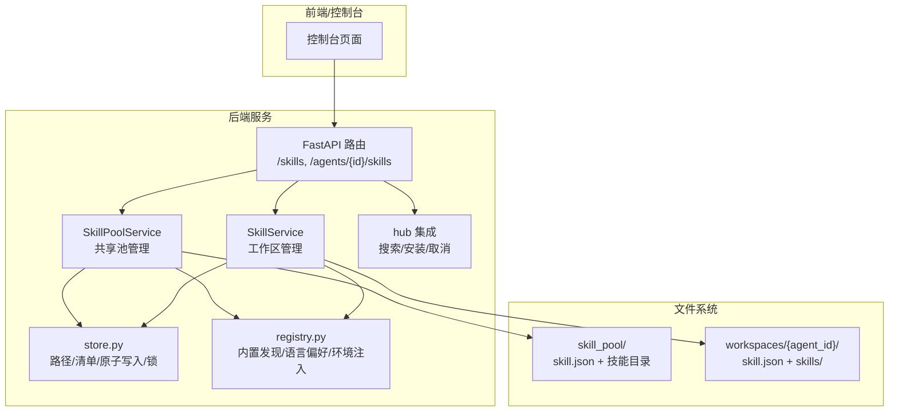
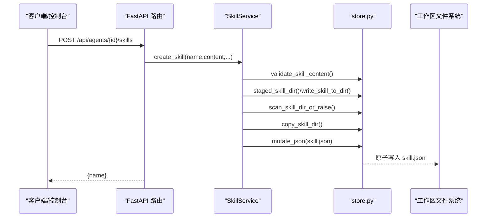
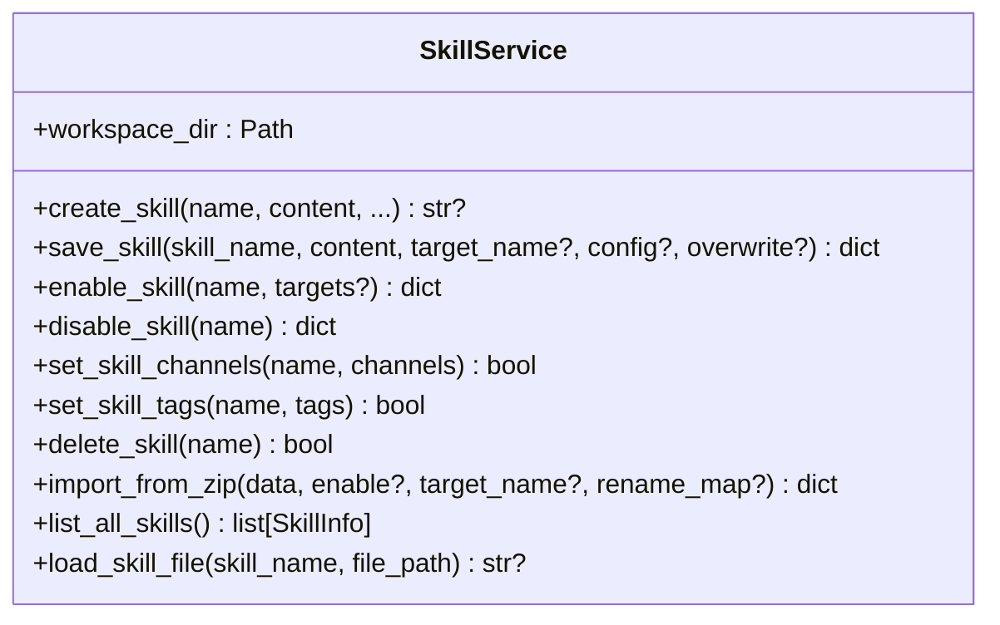
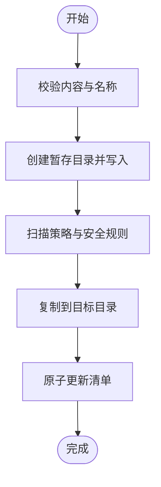
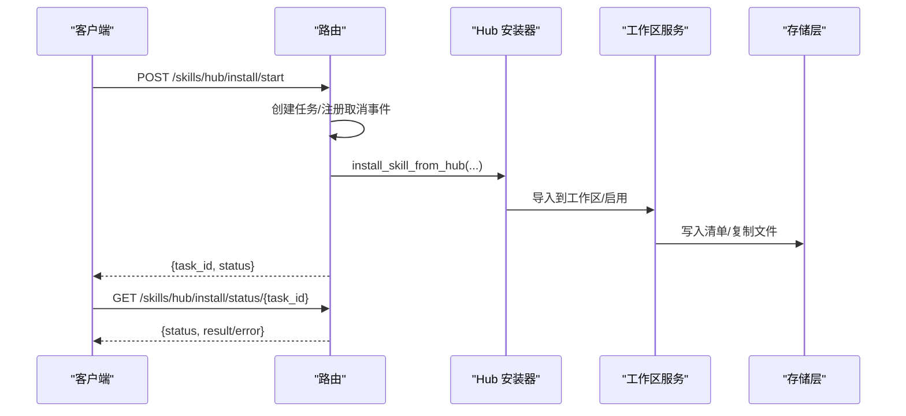
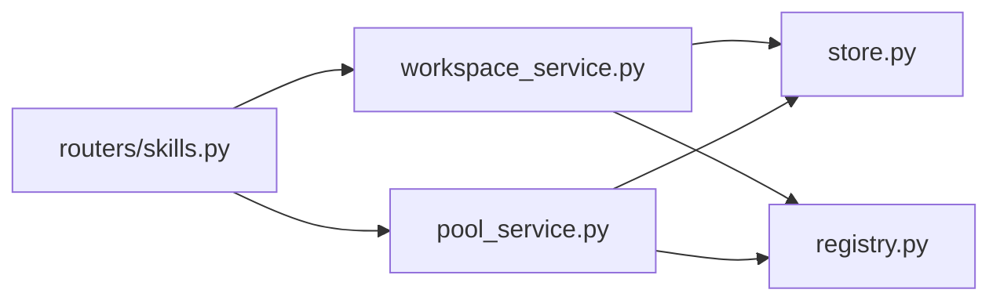

# 技能开发流程

<cite>
**本文引用的文件**   
- [src/qwenpaw/agents/skill_system/__init__.py](file://src/qwenpaw/agents/skill_system/__init__.py)
- [src/qwenpaw/agents/skill_system/models.py](file://src/qwenpaw/agents/skill_system/models.py)
- [src/qwenpaw/agents/skill_system/store.py](file://src/qwenpaw/agents/skill_system/store.py)
- [src/qwenpaw/agents/skill_system/registry.py](file://src/qwenpaw/agents/skill_system/registry.py)
- [src/qwenpaw/agents/skill_system/pool_service.py](file://src/qwenpaw/agents/skill_system/pool_service.py)
- [src/qwenpaw/agents/skill_system/workspace_service.py](file://src/qwenpaw/agents/skill_system/workspace_service.py)
- [src/qwenpaw/app/routers/skills.py](file://src/qwenpaw/app/routers/skills.py)
- [src/qwenpaw/cli/skills_cmd.py](file://src/qwenpaw/cli/skills_cmd.py)
- [tests/integration/test_skills_agent_scoped.py](file://tests/integration/test_skills_agent_scoped.py)
- [website/public/docs/skills.zh.md](file://website/public/docs/skills.zh.md)
</cite>

## 目录
1. [简介](#简介)
2. [项目结构](#项目结构)
3. [核心组件](#核心组件)
4. [架构总览](#架构总览)
5. [详细组件分析](#详细组件分析)
6. [依赖关系分析](#依赖关系分析)
7. [性能与并发](#性能与并发)
8. [常见问题与排障](#常见问题与排障)
9. [结论](#结论)
10. [附录：API 参考](#附录api-参考)

## 简介
本文件面向 QwenPaw 的“技能（Skill）”开发者，系统化梳理从创建、编辑、测试、调试到发布的全链路开发流程。内容覆盖：
- 技能结构与存储模型（工作区 vs 共享池）
- 服务层能力（工作区 SkillService、共享池 SkillPoolService）
- API 路由与调用链（FastAPI 路由）
- CLI 工具与交互配置
- 安全扫描、冲突检测、自动更新与同步
- 错误处理与性能优化建议
- 端到端示例与接口说明

## 项目结构
QwenPaw 的技能系统由“共享技能池 + 工作区副本”两层构成，并通过 REST API 和 CLI 暴露管理能力。

图示来源
- [src/qwenpaw/app/routers/skills.py:1-200](file://src/qwenpaw/app/routers/skills.py#L1-L200)
- [src/qwenpaw/agents/skill_system/pool_service.py:120-200](file://src/qwenpaw/agents/skill_system/pool_service.py#L120-L200)
- [src/qwenpaw/agents/skill_system/workspace_service.py:88-140](file://src/qwenpaw/agents/skill_system/workspace_service.py#L88-L140)
- [src/qwenpaw/agents/skill_system/store.py:384-395](file://src/qwenpaw/agents/skill_system/store.py#L384-L395)
- [src/qwenpaw/agents/skill_system/registry.py:347-392](file://src/qwenpaw/agents/skill_system/registry.py#L347-L392)

章节来源
- [website/public/docs/skills.zh.md:1-118](file://website/public/docs/skills.zh.md#L1-L118)

## 核心组件
- 数据模型
  - SkillInfo：对外返回的技能信息（名称、描述、版本、内容、来源等）
  - BuiltinSkillIdentity/BuiltinSkillVariant：内置技能标识与多语言变体
  - ALL_SKILL_ROUTING_CHANNELS：支持的路由频道集合
- 存储与清单
  - store.py：路径解析、清单读写、原子写入、跨进程锁、ZIP 解压校验、冲突名建议、元数据构建
- 注册与运行时
  - registry.py：内置技能发现、语言偏好、配置→环境变量注入、有效技能解析
- 服务层
  - SkillPoolService：共享池生命周期（创建、导入 ZIP、删除、标签、自动更新、重命名迁移、上传/下载）
  - SkillService：工作区生命周期（创建、保存/重命名、启用/禁用、频道范围、标签、ZIP 导入、加载引用文件）
- API 路由
  - FastAPI 路由提供工作区与共享池的统一接口，包括 Hub 异步安装任务、自动更新通知等
- CLI
  - qwenpaw skills list/config/install/uninstall/test 等命令

章节来源
- [src/qwenpaw/agents/skill_system/models.py:1-81](file://src/qwenpaw/agents/skill_system/models.py#L1-L81)
- [src/qwenpaw/agents/skill_system/store.py:384-395](file://src/qwenpaw/agents/skill_system/store.py#L384-L395)
- [src/qwenpaw/agents/skill_system/registry.py:347-392](file://src/qwenpaw/agents/skill_system/registry.py#L347-L392)
- [src/qwenpaw/agents/skill_system/pool_service.py:120-200](file://src/qwenpaw/agents/skill_system/pool_service.py#L120-L200)
- [src/qwenpaw/agents/skill_system/workspace_service.py:88-140](file://src/qwenpaw/agents/skill_system/workspace_service.py#L88-L140)
- [src/qwenpaw/app/routers/skills.py:1-200](file://src/qwenpaw/app/routers/skills.py#L1-L200)
- [src/qwenpaw/cli/skills_cmd.py:312-374](file://src/qwenpaw/cli/skills_cmd.py#L312-L374)

## 架构总览
下图展示一次“创建工作区技能”的完整调用链：前端 → API 路由 → 工作区服务 → 存储层 → 清单与文件系统。

图示来源
- [src/qwenpaw/app/routers/skills.py:706-718](file://src/qwenpaw/app/routers/skills.py#L706-L718)
- [src/qwenpaw/agents/skill_system/workspace_service.py:145-227](file://src/qwenpaw/agents/skill_system/workspace_service.py#L145-L227)
- [src/qwenpaw/agents/skill_system/store.py:384-395](file://src/qwenpaw/agents/skill_system/store.py#L384-L395)

章节来源
- [src/qwenpaw/app/routers/skills.py:706-718](file://src/qwenpaw/app/routers/skills.py#L706-L718)
- [src/qwenpaw/agents/skill_system/workspace_service.py:145-227](file://src/qwenpaw/agents/skill_system/workspace_service.py#L145-L227)

## 详细组件分析

### 组件一：工作区技能服务（SkillService）
职责
- 在工作区目录下维护可编辑技能副本（内容源），以及运行态状态（enabled/channels/tags/config）。
- 提供创建、保存（原地或重命名）、启用/禁用、频道范围、标签、ZIP 导入、加载 references/scripts 文件等能力。

关键行为
- 创建：校验 SKILL.md frontmatter → 临时目录写入 → 扫描策略 → 复制到目标目录 → 原子更新 manifest
- 保存：原地编辑或重命名；若重命名存在冲突则给出建议名；必要时回滚
- 启用：先重新扫描当前目录，再更新 enabled 标志
- 频道范围：仅更新 channels 字段
- 加载文件：限制只能读取 references/ 与 scripts/ 下的相对路径，防止越权访问

图示来源
- [src/qwenpaw/agents/skill_system/workspace_service.py:88-140](file://src/qwenpaw/agents/skill_system/workspace_service.py#L88-L140)
- [src/qwenpaw/agents/skill_system/workspace_service.py:145-227](file://src/qwenpaw/agents/skill_system/workspace_service.py#L145-L227)
- [src/qwenpaw/agents/skill_system/workspace_service.py:229-284](file://src/qwenpaw/agents/skill_system/workspace_service.py#L229-L284)
- [src/qwenpaw/agents/skill_system/workspace_service.py:554-625](file://src/qwenpaw/agents/skill_system/workspace_service.py#L554-L625)
- [src/qwenpaw/agents/skill_system/workspace_service.py:654-679](file://src/qwenpaw/agents/skill_system/workspace_service.py#L654-L679)
- [src/qwenpaw/agents/skill_system/workspace_service.py:681-707](file://src/qwenpaw/agents/skill_system/workspace_service.py#L681-L707)
- [src/qwenpaw/agents/skill_system/workspace_service.py:709-749](file://src/qwenpaw/agents/skill_system/workspace_service.py#L709-L749)
- [src/qwenpaw/agents/skill_system/workspace_service.py:444-552](file://src/qwenpaw/agents/skill_system/workspace_service.py#L444-L552)
- [src/qwenpaw/agents/skill_system/workspace_service.py:751-782](file://src/qwenpaw/agents/skill_system/workspace_service.py#L751-L782)

章节来源
- [src/qwenpaw/agents/skill_system/workspace_service.py:88-140](file://src/qwenpaw/agents/skill_system/workspace_service.py#L88-L140)
- [src/qwenpaw/agents/skill_system/workspace_service.py:145-227](file://src/qwenpaw/agents/skill_system/workspace_service.py#L145-L227)
- [src/qwenpaw/agents/skill_system/workspace_service.py:229-284](file://src/qwenpaw/agents/skill_system/workspace_service.py#L229-L284)
- [src/qwenpaw/agents/skill_system/workspace_service.py:554-625](file://src/qwenpaw/agents/skill_system/workspace_service.py#L554-L625)
- [src/qwenpaw/agents/skill_system/workspace_service.py:654-679](file://src/qwenpaw/agents/skill_system/workspace_service.py#L654-L679)
- [src/qwenpaw/agents/skill_system/workspace_service.py:681-707](file://src/qwenpaw/agents/skill_system/workspace_service.py#L681-L707)
- [src/qwenpaw/agents/skill_system/workspace_service.py:709-749](file://src/qwenpaw/agents/skill_system/workspace_service.py#L709-L749)
- [src/qwenpaw/agents/skill_system/workspace_service.py:444-552](file://src/qwenpaw/agents/skill_system/workspace_service.py#L444-L552)
- [src/qwenpaw/agents/skill_system/workspace_service.py:751-782](file://src/qwenpaw/agents/skill_system/workspace_service.py#L751-L782)

### 组件二：共享技能池服务（SkillPoolService）
职责
- 管理共享池（WORKING_DIR/skill_pool）中的可复用技能，支持创建、ZIP 导入、删除、标签、自动更新开关、重命名并迁移至工作区、上传/下载等。

关键行为
- 创建：校验 → 暂存目录 → 扫描 → 复制 → 原子更新 pool manifest
- ZIP 导入：大小/软链接/路径安全检查 → 冲突检测 → 批量导入 → 更新清单
- 自动更新：开启后触发立即同步，记录已同步 hash，避免重复传播
- 重命名：在池内重命名并迁移所有受 auto_update_targets 影响的工作区副本

图示来源
- [src/qwenpaw/agents/skill_system/pool_service.py:162-235](file://src/qwenpaw/agents/skill_system/pool_service.py#L162-L235)
- [src/qwenpaw/agents/skill_system/pool_service.py:237-351](file://src/qwenpaw/agents/skill_system/pool_service.py#L237-L351)
- [src/qwenpaw/agents/skill_system/pool_service.py:417-458](file://src/qwenpaw/agents/skill_system/pool_service.py#L417-L458)
- [src/qwenpaw/agents/skill_system/pool_service.py:617-682](file://src/qwenpaw/agents/skill_system/pool_service.py#L617-L682)

章节来源
- [src/qwenpaw/agents/skill_system/pool_service.py:162-235](file://src/qwenpaw/agents/skill_system/pool_service.py#L162-L235)
- [src/qwenpaw/agents/skill_system/pool_service.py:237-351](file://src/qwenpaw/agents/skill_system/pool_service.py#L237-L351)
- [src/qwenpaw/agents/skill_system/pool_service.py:417-458](file://src/qwenpaw/agents/skill_system/pool_service.py#L417-L458)
- [src/qwenpaw/agents/skill_system/pool_service.py:617-682](file://src/qwenpaw/agents/skill_system/pool_service.py#L617-L682)

### 组件三：存储与清单（store.py）
职责
- 统一路径解析、清单默认值、原子写入、跨进程锁、ZIP 解压校验、冲突名建议、SKILL.md frontmatter 解析、元数据构建等。

重点机制
- 原子写入与锁：mutate_json 使用文件锁序列化写操作，避免并发损坏
- ZIP 安全：限制最大解压体积、拒绝符号链接、校验路径不越界
- 冲突名建议：基于时间戳后缀生成唯一候选名
- 元数据构建：从 SKILL.md 提取 name/description/version_text/requirements 等

章节来源
- [src/qwenpaw/agents/skill_system/store.py:384-395](file://src/qwenpaw/agents/skill_system/store.py#L384-L395)
- [src/qwenpaw/agents/skill_system/store.py:482-503](file://src/qwenpaw/agents/skill_system/store.py#L482-L503)
- [src/qwenpaw/agents/skill_system/store.py:671-692](file://src/qwenpaw/agents/skill_system/store.py#L671-L692)
- [src/qwenpaw/agents/skill_system/store.py:636-660](file://src/qwenpaw/agents/skill_system/store.py#L636-L660)

### 组件四：注册与运行时（registry.py）
职责
- 内置技能发现与语言偏好选择
- 将工作区技能的 config 映射为环境变量（按 require_envs 白名单）
- 解析有效技能列表（结合工作区与池）

重点机制
- 语言偏好：优先 settings.json 显式设置，否则根据 UI 语言推断
- 环境变量注入：apply_skill_config_env_overrides 在 agent turn 期间注入，结束后释放
- 内置变体选择：根据语言偏好与打包版本选择最佳变体

章节来源
- [src/qwenpaw/agents/skill_system/registry.py:80-117](file://src/qwenpaw/agents/skill_system/registry.py#L80-L117)
- [src/qwenpaw/agents/skill_system/registry.py:347-392](file://src/qwenpaw/agents/skill_system/registry.py#L347-L392)
- [src/qwenpaw/agents/skill_system/registry.py:198-214](file://src/qwenpaw/agents/skill_system/registry.py#L198-L214)

### 组件五：API 路由（FastAPI）
职责
- 暴露工作区与共享池的统一接口，包括：
  - 工作区技能 CRUD、刷新、Hub 搜索/安装（异步任务）、自动更新通知
  - 共享池技能列表、内置导入/更新、自动更新开关、重命名迁移
  - 工作区汇总视图（列出各工作区技能）

典型调用链（Hub 安装）

图示来源
- [src/qwenpaw/app/routers/skills.py:757-783](file://src/qwenpaw/app/routers/skills.py#L757-L783)
- [src/qwenpaw/app/routers/skills.py:786-791](file://src/qwenpaw/app/routers/skills.py#L786-L791)
- [src/qwenpaw/app/routers/skills.py:507-589](file://src/qwenpaw/app/routers/skills.py#L507-L589)

章节来源
- [src/qwenpaw/app/routers/skills.py:706-718](file://src/qwenpaw/app/routers/skills.py#L706-L718)
- [src/qwenpaw/app/routers/skills.py:757-783](file://src/qwenpaw/app/routers/skills.py#L757-L783)
- [src/qwenpaw/app/routers/skills.py:786-791](file://src/qwenpaw/app/routers/skills.py#L786-L791)
- [src/qwenpaw/app/routers/skills.py:507-589](file://src/qwenpaw/app/routers/skills.py#L507-L589)

### 组件六：CLI 工具
常用命令
- qwenpaw skills list --agent-id <id>：列出工作区技能及启用状态
- qwenpaw skills config --agent-id <id>：交互式选择启用/安装/禁用
- qwenpaw skills install <url> [--agent-id <id>]：从 URL 安装到池或指定工作区
- qwenpaw skills uninstall <name> [--agent-id <id>]：卸载
- qwenpaw skills test <skill|dir> [--agent-id <id>]：本地验证与安全扫描

章节来源
- [src/qwenpaw/cli/skills_cmd.py:312-374](file://src/qwenpaw/cli/skills_cmd.py#L312-L374)
- [src/qwenpaw/cli/skills_cmd.py:417-480](file://src/qwenpaw/cli/skills_cmd.py#L417-L480)
- [src/qwenpaw/cli/skills_cmd.py:482-557](file://src/qwenpaw/cli/skills_cmd.py#L482-L557)
- [src/qwenpaw/cli/skills_cmd.py:559-572](file://src/qwenpaw/cli/skills_cmd.py#L559-L572)

## 依赖关系分析
- 路由层依赖服务层（SkillService/SkillPoolService），服务层依赖存储层（store.py）与注册层（registry.py）
- 存储层提供跨进程锁与原子写入，确保清单一致性
- 注册层负责内置发现、语言偏好与环境变量注入
- 安全扫描在多处被调用（创建/导入/启用/安装）

图示来源
- [src/qwenpaw/app/routers/skills.py:1-200](file://src/qwenpaw/app/routers/skills.py#L1-L200)
- [src/qwenpaw/agents/skill_system/workspace_service.py:1-40](file://src/qwenpaw/agents/skill_system/workspace_service.py#L1-L40)
- [src/qwenpaw/agents/skill_system/pool_service.py:1-49](file://src/qwenpaw/agents/skill_system/pool_service.py#L1-L49)
- [src/qwenpaw/agents/skill_system/store.py:1-46](file://src/qwenpaw/agents/skill_system/store.py#L1-L46)
- [src/qwenpaw/agents/skill_system/registry.py:1-48](file://src/qwenpaw/agents/skill_system/registry.py#L1-L48)

章节来源
- [src/qwenpaw/app/routers/skills.py:1-200](file://src/qwenpaw/app/routers/skills.py#L1-L200)
- [src/qwenpaw/agents/skill_system/workspace_service.py:1-40](file://src/qwenpaw/agents/skill_system/workspace_service.py#L1-L40)
- [src/qwenpaw/agents/skill_system/pool_service.py:1-49](file://src/qwenpaw/agents/skill_system/pool_service.py#L1-L49)
- [src/qwenpaw/agents/skill_system/store.py:1-46](file://src/qwenpaw/agents/skill_system/store.py#L1-L46)
- [src/qwenpaw/agents/skill_system/registry.py:1-48](file://src/qwenpaw/agents/skill_system/registry.py#L1-L48)

## 性能与并发
- 清单读写采用原子写入与文件锁，避免并发竞争导致的数据损坏
- 读取清单时按 mtime 缓存，减少频繁 IO
- ZIP 导入前进行体积与路径安全检查，避免大文件或恶意包拖慢系统
- 自动更新通过哈希门控，仅在内容变化时传播，降低不必要同步开销
- 环境变量注入采用计数式获取/释放，避免重复设置与泄漏

章节来源
- [src/qwenpaw/agents/skill_system/store.py:384-395](file://src/qwenpaw/agents/skill_system/store.py#L384-L395)
- [src/qwenpaw/agents/skill_system/store.py:760-776](file://src/qwenpaw/agents/skill_system/store.py#L760-L776)
- [src/qwenpaw/agents/skill_system/store.py:482-503](file://src/qwenpaw/agents/skill_system/store.py#L482-L503)
- [src/qwenpaw/agents/skill_system/pool_service.py:417-458](file://src/qwenpaw/agents/skill_system/pool_service.py#L417-L458)
- [src/qwenpaw/agents/skill_system/registry.py:308-345](file://src/qwenpaw/agents/skill_system/registry.py#L308-L345)

## 常见问题与排障
- 安全扫描失败（422）
  - 现象：创建/导入/启用时返回结构化扫描结果（包含严重级别与发现项）
  - 排查：查看 findings 列表，修复提示中的问题（如硬编码密钥、危险命令等）
- 冲突名
  - 现象：重命名或导入时提示冲突并给出建议名
  - 解决：采纳建议名或手动调整目标名
- 自动更新未生效
  - 现象：开启自动更新后工作区未同步
  - 排查：检查是否实际变更了 SKILL.md 内容；确认 auto_update_targets 是否包含目标工作区
- 环境变量未注入
  - 现象：技能无法读取期望的环境变量
  - 排查：确认 SKILL.md metadata.requires.env 中声明了所需键，且工作区 config 提供了对应值

章节来源
- [src/qwenpaw/app/routers/skills.py:150-190](file://src/qwenpaw/app/routers/skills.py#L150-L190)
- [src/qwenpaw/agents/skill_system/store.py:671-692](file://src/qwenpaw/agents/skill_system/store.py#L671-L692)
- [src/qwenpaw/agents/skill_system/pool_service.py:417-458](file://src/qwenpaw/agents/skill_system/pool_service.py#L417-L458)
- [src/qwenpaw/agents/skill_system/registry.py:264-305](file://src/qwenpaw/agents/skill_system/registry.py#L264-L305)

## 结论
QwenPaw 的技能体系以“共享池 + 工作区副本”为核心，配合严格的清单管理与安全扫描，提供稳定可靠的技能生命周期管理能力。通过 API 与 CLI 双通道，开发者可以便捷地完成从创建、编辑、测试到发布的全流程。建议在开发中遵循以下实践：
- 始终通过 API/CLI 操作，避免直接修改清单文件
- 利用安全扫描与冲突检测提前发现问题
- 合理使用自动更新与频道范围控制，提升可维护性
- 关注性能与并发特性，避免不必要的同步与 IO

## 附录：API 参考
以下为与工作区相关的常用接口（基于集成测试与路由定义归纳）：
- 工作区技能
  - POST /api/agents/{agentId}/skills：创建工作区技能
  - GET /api/agents/{agentId}/skills：列出工作区技能
  - PUT /api/agents/{agentId}/skills/save：保存（原地或重命名）
  - PUT /api/agents/{agentId}/skills/{skillName}/channels：设置频道范围
  - PUT /api/agents/{agentId}/skills/{skillName}/config：设置配置
  - PUT /api/agents/{agentId}/skills/{skillName}/tags：设置标签
  - GET /api/agents/{agentId}/skills/{skillName}/config：读取配置
  - POST /api/agents/{agentId}/skills/batch-delete：批量删除
  - POST /api/agents/{agentId}/skills/batch-enable：批量启用
  - POST /api/agents/{agentId}/skills/batch-disable：批量禁用
- 共享池
  - GET /skills：列出共享池技能
  - POST /skills/hub/search：搜索 Hub 技能
  - POST /skills/hub/install/start：启动异步安装任务
  - GET /skills/hub/install/status/{taskId}：查询安装任务状态
  - POST /skills/hub/install/cancel/{taskId}：取消安装任务
- 其他
  - POST /skills/refresh：强制刷新工作区清单并返回列表

章节来源
- [tests/integration/test_skills_agent_scoped.py:28-124](file://tests/integration/test_skills_agent_scoped.py#L28-L124)
- [tests/integration/test_skills_agent_scoped.py:429-467](file://tests/integration/test_skills_agent_scoped.py#L429-L467)
- [src/qwenpaw/app/routers/skills.py:706-718](file://src/qwenpaw/app/routers/skills.py#L706-L718)
- [src/qwenpaw/app/routers/skills.py:720-737](file://src/qwenpaw/app/routers/skills.py#L720-L737)
- [src/qwenpaw/app/routers/skills.py:757-783](file://src/qwenpaw/app/routers/skills.py#L757-L783)
- [src/qwenpaw/app/routers/skills.py:786-791](file://src/qwenpaw/app/routers/skills.py#L786-L791)
- [src/qwenpaw/app/routers/skills.py:794-800](file://src/qwenpaw/app/routers/skills.py#L794-L800)