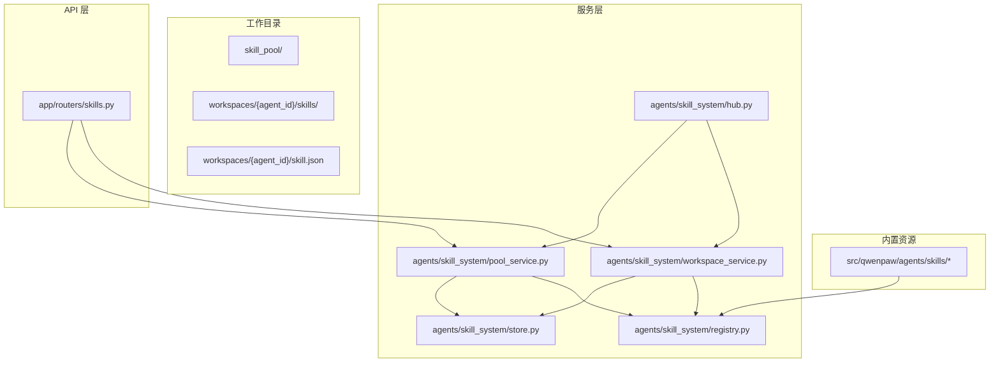
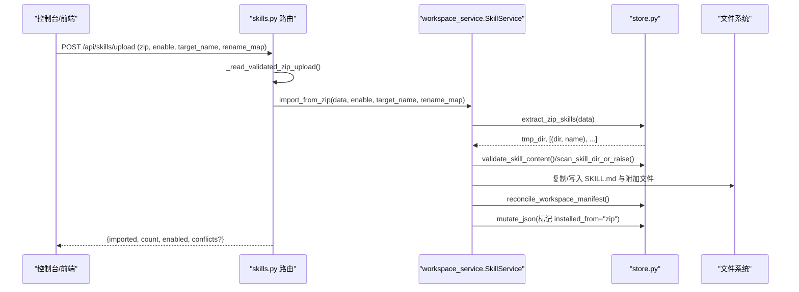
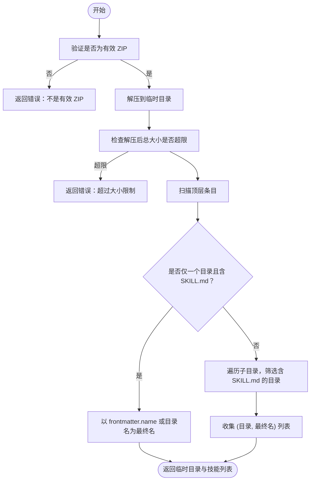
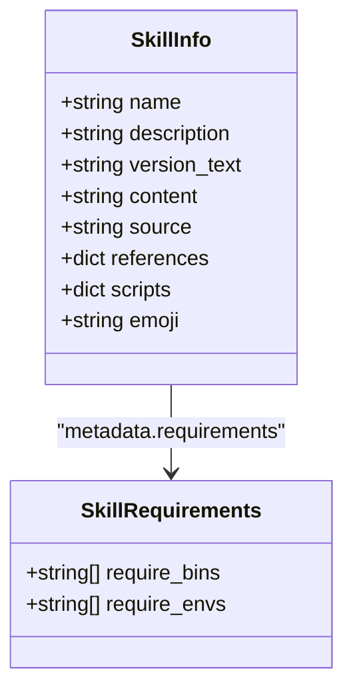
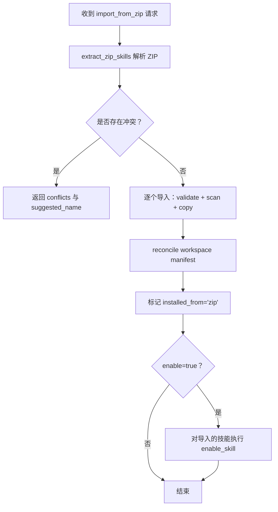
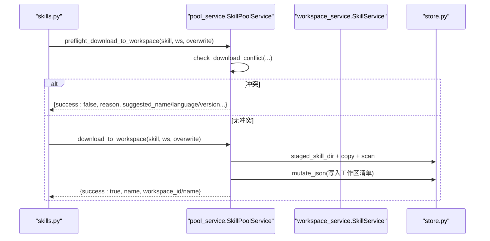
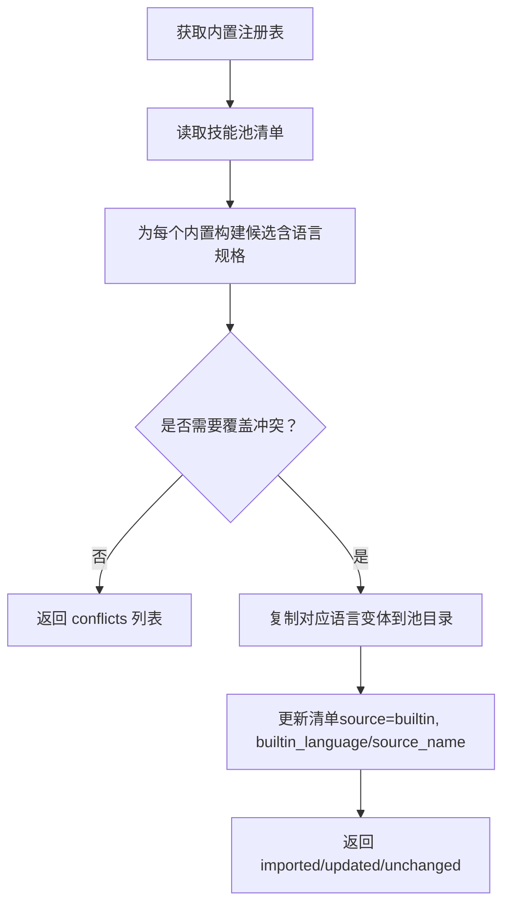
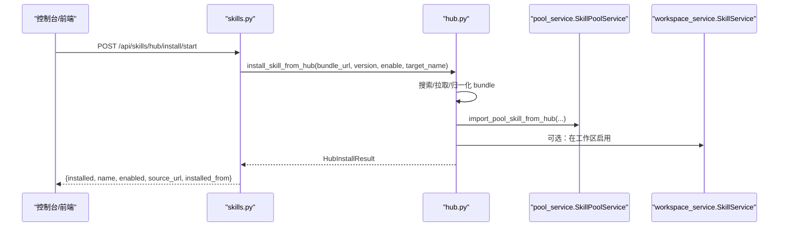
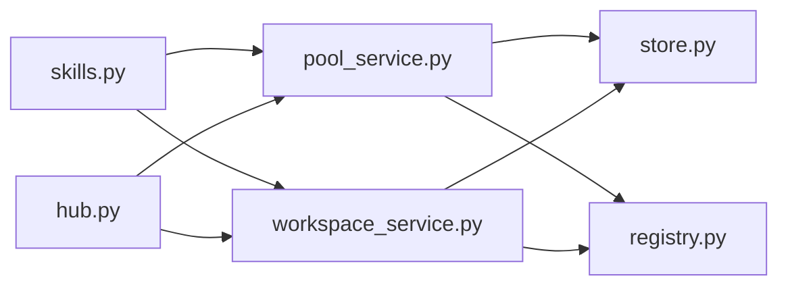

# 技能打包与分发

<cite>
**本文引用的文件**   
- [store.py](file://src/qwenpaw/agents/skill_system/store.py)
- [pool_service.py](file://src/qwenpaw/agents/skill_system/pool_service.py)
- [workspace_service.py](file://src/qwenpaw/agents/skill_system/workspace_service.py)
- [registry.py](file://src/qwenpaw/agents/skill_system/registry.py)
- [hub.py](file://src/qwenpaw/agents/skill_system/hub.py)
- [skills.py](file://src/qwenpaw/app/routers/skills.py)
- [models.py](file://src/qwenpaw/agents/skill_system/models.py)
</cite>

## 目录
1. [简介](#简介)
2. [项目结构](#项目结构)
3. [核心组件](#核心组件)
4. [架构总览](#架构总览)
5. [详细组件分析](#详细组件分析)
6. [依赖关系分析](#依赖关系分析)
7. [性能考虑](#性能考虑)
8. [故障排查指南](#故障排查指南)
9. [结论](#结论)
10. [附录](#附录)

## 简介
本文件面向 QwenPaw 的“技能打包与分发”主题，系统性说明：
- 技能包格式（ZIP）结构与命名规则
- 版本管理、依赖声明与冲突处理
- 发布流程与安装路径（工作区 vs 技能池）
- API 接口、调用关系与开发模式
- 常见问题及解决方案

目标是让初学者快速上手，同时为有经验的开发者提供足够的实现细节。

## 项目结构
QwenPaw 的技能系统围绕“共享技能池 + 工作区副本”的双层模型组织：
- 共享技能池：位于工作目录下的 skill_pool，作为可复用的来源
- 工作区副本：每个工作区的 skills 目录，是 Agent 实际加载的本地副本

图表来源
- [skills.py:1-200](file://src/qwenpaw/app/routers/skills.py#L1-L200)
- [pool_service.py:1-120](file://src/qwenpaw/agents/skill_system/pool_service.py#L1-L120)
- [workspace_service.py:1-120](file://src/qwenpaw/agents/skill_system/workspace_service.py#L1-L120)
- [registry.py:1-120](file://src/qwenpaw/agents/skill_system/registry.py#L1-L120)
- [store.py:1-120](file://src/qwenpaw/agents/skill_system/store.py#L1-L120)
- [hub.py:1-120](file://src/qwenpaw/agents/skill_system/hub.py#L1-L120)

章节来源
- [store.py:58-134](file://src/qwenpaw/agents/skill_system/store.py#L58-L134)
- [registry.py:238-241](file://src/qwenpaw/agents/skill_system/registry.py#L238-L241)

## 核心组件
- 存储与清单（store.py）
  - ZIP 解压与安全校验、SKILL.md frontmatter 解析、清单读写与原子写入、冲突名建议等
- 技能池服务（pool_service.py）
  - 创建/保存/上传到池、从池下载至工作区、自动更新传播、语言切换与内置升级检测
- 工作区服务（workspace_service.py）
  - 工作区内技能的创建、编辑、重命名、启用/禁用、标签与通道配置、ZIP 导入
- 注册表与内置能力（registry.py）
  - 内置技能发现、语言偏好、导入候选构建、环境覆盖注入
- Hub 客户端（hub.py）
  - 搜索、拉取、安装远程技能包，支持取消、重试、限流与大小限制
- API 路由（skills.py）
  - 暴露工作区与技能池操作、Hub 安装任务、批量操作与自动更新通知

章节来源
- [store.py:482-503](file://src/qwenpaw/agents/skill_system/store.py#L482-L503)
- [pool_service.py:980-1080](file://src/qwenpaw/agents/skill_system/pool_service.py#L980-L1080)
- [workspace_service.py:444-553](file://src/qwenpaw/agents/skill_system/workspace_service.py#L444-L553)
- [registry.py:662-800](file://src/qwenpaw/agents/skill_system/registry.py#L662-L800)
- [hub.py:785-800](file://src/qwenpaw/agents/skill_system/hub.py#L785-L800)
- [skills.py:897-941](file://src/qwenpaw/app/routers/skills.py#L897-L941)

## 架构总览
下图展示一次“通过 ZIP 上传并安装到工作区”的典型调用链：

图表来源
- [skills.py:897-941](file://src/qwenpaw/app/routers/skills.py#L897-L941)
- [workspace_service.py:444-553](file://src/qwenpaw/agents/skill_system/workspace_service.py#L444-L553)
- [store.py:923-966](file://src/qwenpaw/agents/skill_system/store.py#L923-L966)

## 详细组件分析

### 技能包格式（ZIP）与结构
- 基本结构
  - 单技能 ZIP：根目录包含一个技能目录，该目录下必须有 SKILL.md
  - 多技能 ZIP：根目录包含多个技能目录，每个目录含 SKILL.md
- 名称解析
  - 优先使用 SKILL.md frontmatter 中的 name；若未提供则回退到目录名
- 安全校验
  - 禁止符号链接、拒绝越界路径、限制解压后总大小
- 附加目录
  - references/ 与 scripts/ 会被识别并纳入元数据树形结构

图表来源
- [store.py:923-966](file://src/qwenpaw/agents/skill_system/store.py#L923-L966)
- [store.py:482-503](file://src/qwenpaw/agents/skill_system/store.py#L482-L503)
- [store.py:579-592](file://src/qwenpaw/agents/skill_system/store.py#L579-L592)

章节来源
- [store.py:923-966](file://src/qwenpaw/agents/skill_system/store.py#L923-L966)
- [store.py:482-503](file://src/qwenpaw/agents/skill_system/store.py#L482-L503)
- [store.py:579-592](file://src/qwenpaw/agents/skill_system/store.py#L579-L592)

### 版本管理与依赖声明
- 版本来源
  - 从 SKILL.md frontmatter 的 metadata.version 或 version 字段提取
- 依赖声明
  - 支持在 metadata.requires 或 top-level requires 中声明 require_bins 与 require_envs
- 运行时注入
  - 将匹配的 config 键值注入为环境变量，并提供完整 JSON 的环境变量入口

图表来源
- [models.py:47-81](file://src/qwenpaw/agents/skill_system/models.py#L47-L81)
- [store.py:594-634](file://src/qwenpaw/agents/skill_system/store.py#L594-L634)
- [store.py:636-661](file://src/qwenpaw/agents/skill_system/store.py#L636-L661)

章节来源
- [store.py:267-279](file://src/qwenpaw/agents/skill_system/store.py#L267-L279)
- [store.py:594-634](file://src/qwenpaw/agents/skill_system/store.py#L594-L634)
- [store.py:636-661](file://src/qwenpaw/agents/skill_system/store.py#L636-L661)
- [registry.py:264-306](file://src/qwenpaw/agents/skill_system/registry.py#L264-L306)

### 安装与冲突处理（工作区）
- 工作区 ZIP 导入
  - 支持 target_name（仅限单技能 ZIP）、rename_map（批量重映射）
  - 冲突时返回 suggested_name，前端可引导用户选择新名
- 保存/重命名
  - 就地编辑或另存为（重命名），保留 tags/config/channels 等状态
- 启用/禁用与通道控制
  - 启用前会重新扫描，确保当前磁盘内容符合策略

图表来源
- [workspace_service.py:444-553](file://src/qwenpaw/agents/skill_system/workspace_service.py#L444-L553)
- [workspace_service.py:554-626](file://src/qwenpaw/agents/skill_system/workspace_service.py#L554-L626)
- [store.py:732-744](file://src/qwenpaw/agents/skill_system/store.py#L732-L744)

章节来源
- [workspace_service.py:444-553](file://src/qwenpaw/agents/skill_system/workspace_service.py#L444-L553)
- [workspace_service.py:554-626](file://src/qwenpaw/agents/skill_system/workspace_service.py#L554-L626)
- [store.py:732-744](file://src/qwenpaw/agents/skill_system/store.py#L732-L744)

### 从技能池分发到工作区（含内置升级与语言切换）
- 预检冲突
  - 内置升级：当池内版本高于工作区版本时提示
  - 语言切换：当池内语言与工作区不一致时提示
  - 普通冲突：同名自定义技能冲突，建议新名
- 执行下载
  - 按目标工作区逐一下载，失败时回滚已变更的工作区快照
- 自动更新
  - 根据 auto_update_targets 或“已在该工作区存在”的规则推送变更

图表来源
- [pool_service.py:980-1080](file://src/qwenpaw/agents/skill_system/pool_service.py#L980-L1080)
- [pool_service.py:863-960](file://src/qwenpaw/agents/skill_system/pool_service.py#L863-L960)
- [skills.py:1086-1145](file://src/qwenpaw/app/routers/skills.py#L1086-L1145)

章节来源
- [pool_service.py:863-960](file://src/qwenpaw/agents/skill_system/pool_service.py#L863-L960)
- [pool_service.py:980-1080](file://src/qwenpaw/agents/skill_system/pool_service.py#L980-L1080)
- [skills.py:1086-1145](file://src/qwenpaw/app/routers/skills.py#L1086-L1145)

### 内置技能导入与语言偏好
- 内置发现
  - 基于 src/qwenpaw/agents/skills/<name>-<lang> 目录结构
- 语言偏好
  - 读取 settings.json 的 builtin_skill_language 或 UI language 推断
- 导入流程
  - 生成候选列表，对比现有池状态，必要时提示冲突（语言切换/版本差异）

图表来源
- [registry.py:155-236](file://src/qwenpaw/agents/skill_system/registry.py#L155-L236)
- [registry.py:662-800](file://src/qwenpaw/agents/skill_system/registry.py#L662-L800)

章节来源
- [registry.py:155-236](file://src/qwenpaw/agents/skill_system/registry.py#L155-L236)
- [registry.py:662-800](file://src/qwenpaw/agents/skill_system/registry.py#L662-L800)

### Hub 安装（远程技能包）
- 搜索与详情
  - 通过环境变量配置基础 URL 与路径模板
- 安装任务
  - 异步任务、可取消、带状态查询
- 网络健壮性
  - 指数退避重试、速率限制提示、最大响应体限制

图表来源
- [skills.py:757-814](file://src/qwenpaw/app/routers/skills.py#L757-L814)
- [hub.py:785-800](file://src/qwenpaw/agents/skill_system/hub.py#L785-L800)
- [pool_service.py:840-861](file://src/qwenpaw/agents/skill_system/pool_service.py#L840-L861)

章节来源
- [skills.py:757-814](file://src/qwenpaw/app/routers/skills.py#L757-L814)
- [hub.py:785-800](file://src/qwenpaw/agents/skill_system/hub.py#L785-L800)
- [pool_service.py:840-861](file://src/qwenpaw/agents/skill_system/pool_service.py#L840-L861)

## 依赖关系分析
- 模块耦合
  - API 路由依赖服务层（pool/workspace），服务层依赖 store 与 registry
  - hub 客户端可同时作用于 pool 与 workspace
- 外部依赖
  - httpx 用于 Hub 通信；frontmatter/yaml 用于 SKILL.md 解析；zipfile 用于打包/解压

图表来源
- [skills.py:1-120](file://src/qwenpaw/app/routers/skills.py#L1-L120)
- [pool_service.py:1-120](file://src/qwenpaw/agents/skill_system/pool_service.py#L1-L120)
- [workspace_service.py:1-120](file://src/qwenpaw/agents/skill_system/workspace_service.py#L1-L120)
- [registry.py:1-120](file://src/qwenpaw/agents/skill_system/registry.py#L1-L120)
- [hub.py:1-120](file://src/qwenpaw/agents/skill_system/hub.py#L1-L120)

章节来源
- [skills.py:1-120](file://src/qwenpaw/app/routers/skills.py#L1-L120)
- [pool_service.py:1-120](file://src/qwenpaw/agents/skill_system/pool_service.py#L1-L120)
- [workspace_service.py:1-120](file://src/qwenpaw/agents/skill_system/workspace_service.py#L1-L120)
- [registry.py:1-120](file://src/qwenpaw/agents/skill_system/registry.py#L1-L120)
- [hub.py:1-120](file://src/qwenpaw/agents/skill_system/hub.py#L1-L120)

## 性能考虑
- 清单缓存
  - 基于 mtime 的 JSON 缓存，减少频繁 IO
- 原子写入
  - 写清单采用临时文件 + replace，避免并发损坏
- 跨进程锁
  - 使用 fcntl/msvcrt 序列化清单修改
- 网络优化
  - Hub 客户端连接复用、指数退避重试、按 key 加锁的 GitHub 缓存

章节来源
- [store.py:751-776](file://src/qwenpaw/agents/skill_system/store.py#L751-L776)
- [store.py:359-395](file://src/qwenpaw/agents/skill_system/store.py#L359-L395)
- [store.py:324-342](file://src/qwenpaw/agents/skill_system/store.py#L324-L342)
- [hub.py:290-311](file://src/qwenpaw/agents/skill_system/hub.py#L290-L311)
- [hub.py:378-401](file://src/qwenpaw/agents/skill_system/hub.py#L378-L401)

## 故障排查指南
- ZIP 无效或过大
  - 现象：上传失败，提示非 ZIP 或超出大小限制
  - 处理：确认打包工具输出为标准 ZIP，压缩率合理，总大小不超过限制
- 安全扫描失败
  - 现象：422 响应，包含 findings 列表
  - 处理：依据 severity 与 rule_id 修复问题文件或逻辑
- 冲突与重命名
  - 现象：409 响应，附带 suggested_name
  - 处理：在前端弹出重命名对话框，用户确认后重试
- 内置升级/语言切换
  - 现象：预检返回 reason 为 builtin_upgrade 或 language_switch
  - 处理：向用户展示差异信息，确认后再执行覆盖
- Hub 安装失败
  - 现象：任务状态 FAILED，可能因 429/超时/截断
  - 处理：设置 GITHUB_TOKEN、调整超时/重试参数、检查网络

章节来源
- [store.py:482-503](file://src/qwenpaw/agents/skill_system/store.py#L482-L503)
- [skills.py:150-191](file://src/qwenpaw/app/routers/skills.py#L150-L191)
- [pool_service.py:863-960](file://src/qwenpaw/agents/skill_system/pool_service.py#L863-L960)
- [hub.py:472-604](file://src/qwenpaw/agents/skill_system/hub.py#L472-L604)

## 结论
QwenPaw 的技能打包与分发体系以“双层目录 + 清单驱动”为核心，结合严格的 ZIP 安全校验、版本与依赖声明、以及完善的冲突提示与回滚机制，提供了稳定可靠的技能生命周期管理能力。通过 API 与服务层的清晰分层，既便于前端集成，也利于扩展新的来源与分发策略。

## 附录

### API 参考（节选）
- 工作区技能
  - GET /api/skills：列出当前工作区技能
  - POST /api/skills：创建工作区技能
  - PUT /api/skills/save：保存/重命名工作区技能
  - POST /api/skills/upload：上传 ZIP 到工作区
  - POST /api/skills/refresh：强制刷新工作区清单
- 技能池
  - GET /api/skills/pool：列出技能池
  - POST /api/skills/pool/refresh：刷新并触发自动更新
  - POST /api/skills/pool/create：创建池技能
  - PUT /api/skills/pool/save：保存池技能
  - POST /api/skills/pool/upload-zip：上传 ZIP 到池
  - POST /api/skills/pool/import：从 Hub 导入到池
  - POST /api/skills/pool/upload：从工作区上传到池
  - POST /api/skills/download-from-pool：从池下载到工作区（支持批量与预检）
- Hub 安装
  - POST /api/skills/hub/install/start：启动安装任务
  - GET /api/skills/hub/install/status/{task_id}：查询任务状态
  - POST /api/skills/hub/install/cancel/{task_id}：取消任务

章节来源
- [skills.py:706-718](file://src/qwenpaw/app/routers/skills.py#L706-L718)
- [skills.py:897-941](file://src/qwenpaw/app/routers/skills.py#L897-L941)
- [skills.py:943-994](file://src/qwenpaw/app/routers/skills.py#L943-L994)
- [skills.py:996-1060](file://src/qwenpaw/app/routers/skills.py#L996-L1060)
- [skills.py:1062-1145](file://src/qwenpaw/app/routers/skills.py#L1062-L1145)
- [skills.py:757-814](file://src/qwenpaw/app/routers/skills.py#L757-L814)