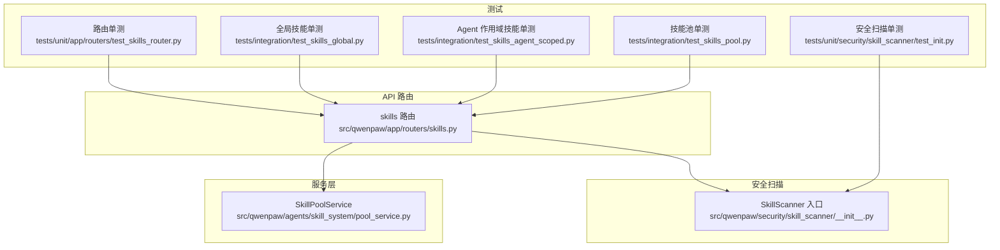
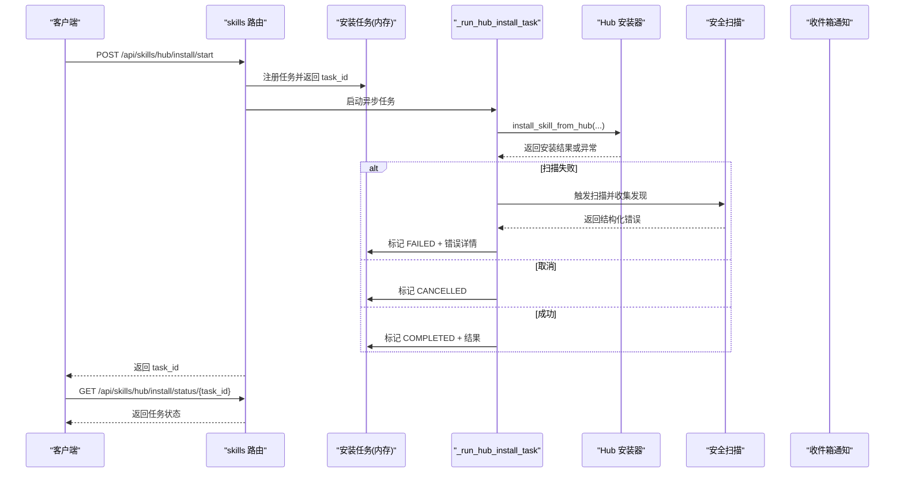
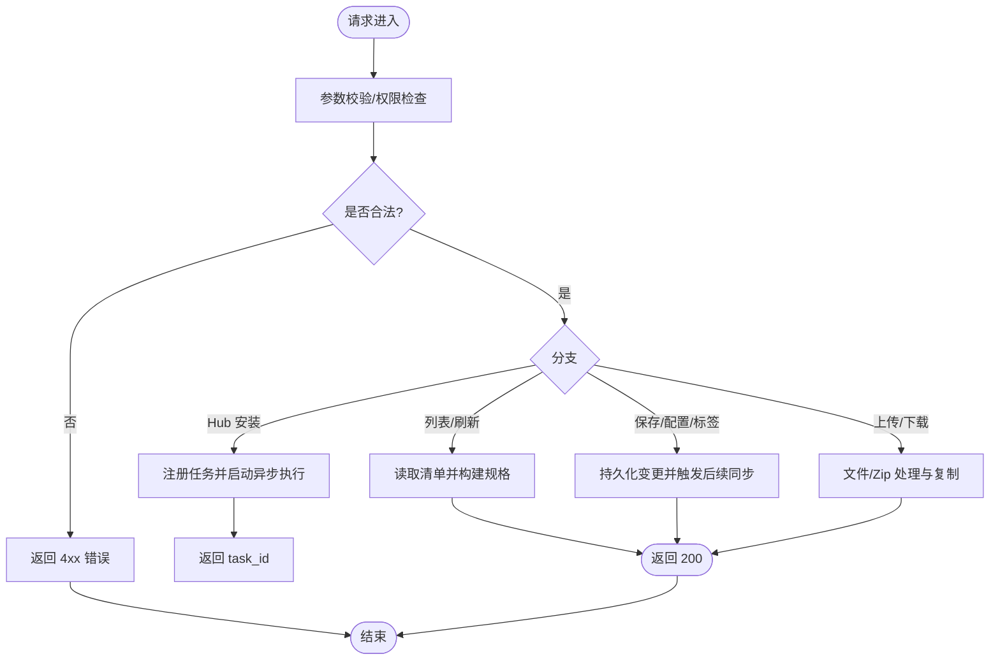
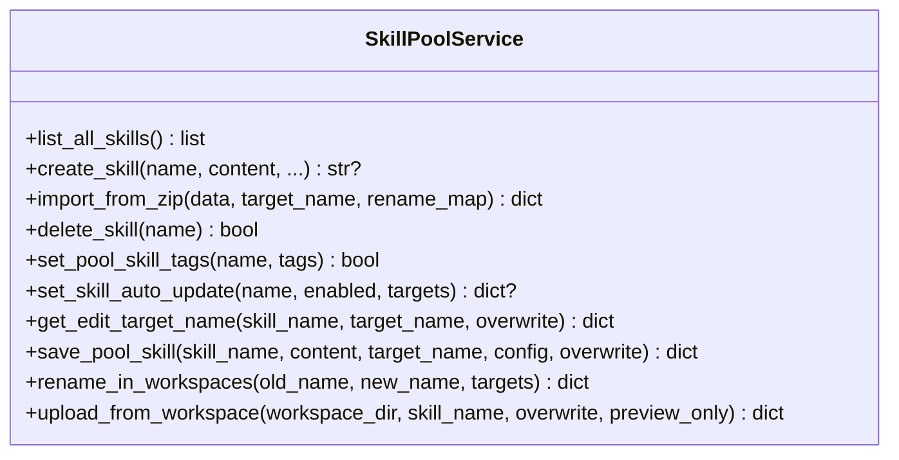
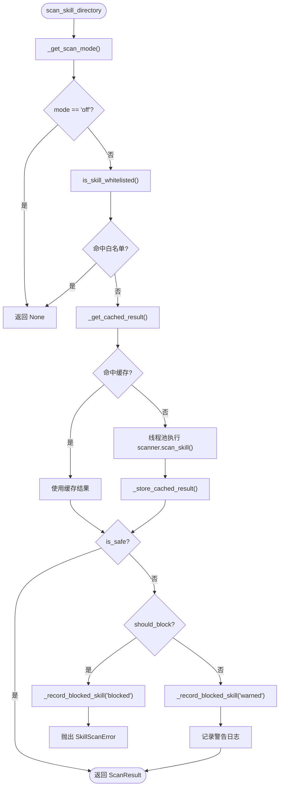
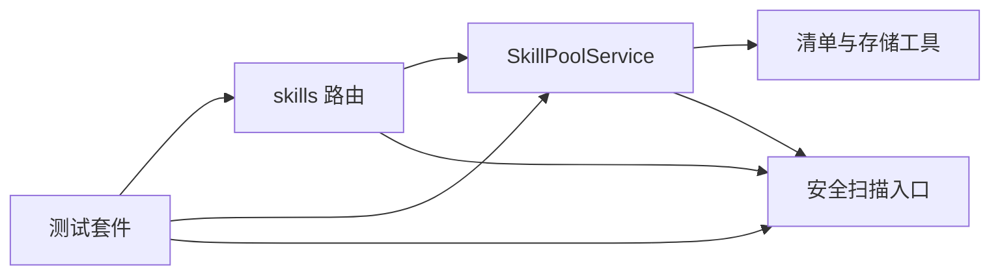

# 技能测试与调试

<cite>
**本文引用的文件**   
- [src/qwenpaw/app/routers/skills.py](file://src/qwenpaw/app/routers/skills.py)
- [src/qwenpaw/agents/skill_system/pool_service.py](file://src/qwenpaw/agents/skill_system/pool_service.py)
- [src/qwenpaw/security/skill_scanner/__init__.py](file://src/qwenpaw/security/skill_scanner/__init__.py)
- [tests/integration/test_skills_agent_scoped.py](file://tests/integration/test_skills_agent_scoped.py)
- [tests/integration/test_skills_global.py](file://tests/integration/test_skills_global.py)
- [tests/integration/test_skills_pool.py](file://tests/integration/test_skills_pool.py)
- [tests/unit/app/routers/test_skills_router.py](file://tests/unit/app/routers/test_skills_router.py)
- [tests/unit/security/skill_scanner/test_init.py](file://tests/unit/security/skill_scanner/test_init.py)
- [src/qwenpaw/config/config.py](file://src/qwenpaw/config/config.py)
</cite>

## 目录
1. [简介](#简介)
2. [项目结构](#项目结构)
3. [核心组件](#核心组件)
4. [架构总览](#架构总览)
5. [详细组件分析](#详细组件分析)
6. [依赖关系分析](#依赖关系分析)
7. [性能考量](#性能考量)
8. [故障排除指南](#故障排除指南)
9. [结论](#结论)
10. [附录](#附录)

## 简介
本文件面向 QwenPaw 的“技能（Skill）”模块，聚焦于测试与调试实践。内容覆盖：
- 单元测试、集成测试与端到端测试策略
- 关键接口与调用链路的实现细节
- 安全扫描与白名单配置
- 常见问题定位与排障方法
- 性能分析与优化建议

目标读者包括初学者与有经验的开发者，既提供入门指引，也给出深入的技术细节与可操作示例路径。

## 项目结构
围绕“技能”的核心代码与测试主要分布在以下位置：
- API 路由层：skills 路由定义工作区与技能池相关接口
- 服务层：技能池生命周期管理、工作区技能清单构建等
- 安全扫描：对技能目录进行静态安全检查，支持模式、超时、白名单
- 测试套件：单元、集成与 e2e 用例，覆盖 CRUD、批量操作、Hub 安装流程、安全扫描等

图表来源
- [src/qwenpaw/app/routers/skills.py:1-120](file://src/qwenpaw/app/routers/skills.py#L1-L120)
- [src/qwenpaw/agents/skill_system/pool_service.py:121-145](file://src/qwenpaw/agents/skill_system/pool_service.py#L121-L145)
- [src/qwenpaw/security/skill_scanner/__init__.py:1-56](file://src/qwenpaw/security/skill_scanner/__init__.py#L1-L56)
- [tests/unit/app/routers/test_skills_router.py:1-40](file://tests/unit/app/routers/test_skills_router.py#L1-L40)
- [tests/integration/test_skills_global.py:1-40](file://tests/integration/test_skills_global.py#L1-L40)
- [tests/integration/test_skills_agent_scoped.py:1-40](file://tests/integration/test_skills_agent_scoped.py#L1-L40)
- [tests/integration/test_skills_pool.py:1-40](file://tests/integration/test_skills_pool.py#L1-L40)
- [tests/unit/security/skill_scanner/test_init.py:1-58](file://tests/unit/security/skill_scanner/test_init.py#L1-L58)

章节来源
- [src/qwenpaw/app/routers/skills.py:1-120](file://src/qwenpaw/app/routers/skills.py#L1-L120)
- [src/qwenpaw/agents/skill_system/pool_service.py:121-145](file://src/qwenpaw/agents/skill_system/pool_service.py#L121-L145)
- [src/qwenpaw/security/skill_scanner/__init__.py:1-56](file://src/qwenpaw/security/skill_scanner/__init__.py#L1-L56)
- [tests/unit/app/routers/test_skills_router.py:1-40](file://tests/unit/app/routers/test_skills_router.py#L1-L40)
- [tests/integration/test_skills_global.py:1-40](file://tests/integration/test_skills_global.py#L1-L40)
- [tests/integration/test_skills_agent_scoped.py:1-40](file://tests/integration/test_skills_agent_scoped.py#L1-L40)
- [tests/integration/test_skills_pool.py:1-40](file://tests/integration/test_skills_pool.py#L1-L40)
- [tests/unit/security/skill_scanner/test_init.py:1-58](file://tests/unit/security/skill_scanner/test_init.py#L1-L58)

## 核心组件
- 路由层（skills 路由）
  - 负责暴露工作区与技能池的 HTTP 接口，包括列表、刷新、Hub 搜索、安装任务生命周期、上传/下载、保存、标签与配置管理等。
  - 关键模型：SkillSpec、PoolSkillSpec、HubInstallTask 等，用于统一请求/响应结构。
- 服务层（SkillPoolService）
  - 管理共享技能池的生命周期：创建、导入 zip、删除、标签、自动更新、重命名迁移、从工作区上传、下载到工作区等。
  - 保证幂等性、冲突检测、回滚与一致性。
- 安全扫描（SkillScanner 入口）
  - 提供扫描入口、缓存、白名单、阻塞/告警模式、历史记录持久化。
  - 在导入/启用前执行扫描，必要时抛出结构化错误以便上层处理。
- 测试套件
  - 单元：路由装配、Hub 安装任务状态机、安全扫描数据类与缓存行为。
  - 集成：工作区技能 CRUD、批量操作、保存/配置/标签、上传 zip、池子上传/下载、Hub 安装 start→status→cancel 流程。

章节来源
- [src/qwenpaw/app/routers/skills.py:193-366](file://src/qwenpaw/app/routers/skills.py#L193-L366)
- [src/qwenpaw/agents/skill_system/pool_service.py:121-145](file://src/qwenpaw/agents/skill_system/pool_service.py#L121-L145)
- [src/qwenpaw/security/skill_scanner/__init__.py:397-487](file://src/qwenpaw/security/skill_scanner/__init__.py#L397-L487)
- [tests/unit/app/routers/test_skills_router.py:1-40](file://tests/unit/app/routers/test_skills_router.py#L1-L40)
- [tests/integration/test_skills_pool.py:96-142](file://tests/integration/test_skills_pool.py#L96-L142)

## 架构总览
下图展示一次“从 Hub 安装技能”的典型调用序列，涵盖路由、异步任务、安全扫描与结果上报。

图表来源
- [src/qwenpaw/app/routers/skills.py:757-800](file://src/qwenpaw/app/routers/skills.py#L757-L800)
- [src/qwenpaw/app/routers/skills.py:507-589](file://src/qwenpaw/app/routers/skills.py#L507-L589)
- [src/qwenpaw/security/skill_scanner/__init__.py:397-487](file://src/qwenpaw/security/skill_scanner/__init__.py#L397-L487)

章节来源
- [src/qwenpaw/app/routers/skills.py:757-800](file://src/qwenpaw/app/routers/skills.py#L757-L800)
- [src/qwenpaw/app/routers/skills.py:507-589](file://src/qwenpaw/app/routers/skills.py#L507-L589)
- [src/qwenpaw/security/skill_scanner/__init__.py:397-487](file://src/qwenpaw/security/skill_scanner/__init__.py#L397-L487)

## 详细组件分析

### 路由层（skills 路由）
- 职责
  - 暴露工作区技能列表、刷新、Hub 搜索、安装任务生命周期、上传/下载、保存、标签与配置管理。
  - 将安全扫描异常转换为稳定的 JSON 响应体，便于前端与自动化测试消费。
- 关键接口（节选）
  - GET /api/skills — 列出当前 Agent 工作区的技能
  - POST /api/skills/refresh — 强制重建清单并返回
  - GET /api/skills/hub/search?q=&limit= — 搜索 Hub
  - POST /api/skills/hub/install/start — 开始安装任务
  - GET /api/skills/hub/install/status/{task_id} — 查询任务状态
  - POST /api/skills/hub/install/cancel/{task_id} — 取消任务
  - PUT /api/skills/save — 保存工作区技能（含重命名/覆盖）
  - PUT /api/skills/{name}/config — 设置配置
  - DELETE /api/skills/{name}/config — 清空配置
  - PUT /api/skills/{name}/tags — 设置标签
  - POST /api/skills/upload — 上传 zip 到工作区
  - GET /api/skills/pool — 列出技能池
  - POST /api/skills/pool/create — 创建池技能
  - POST /api/skills/pool/batch-delete — 批量删除
  - POST /api/skills/pool/download — 从池下载到工作区
- 错误处理
  - 安全扫描失败返回 422，包含类型、最大严重级别、发现项等结构化字段。
  - 冲突返回 409，detail.reason 为 conflict，并提供 suggested_name。
  - 缺失资源返回 404。

图表来源
- [src/qwenpaw/app/routers/skills.py:706-718](file://src/qwenpaw/app/routers/skills.py#L706-L718)
- [src/qwenpaw/app/routers/skills.py:757-800](file://src/qwenpaw/app/routers/skills.py#L757-L800)
- [src/qwenpaw/app/routers/skills.py:150-191](file://src/qwenpaw/app/routers/skills.py#L150-L191)

章节来源
- [src/qwenpaw/app/routers/skills.py:706-718](file://src/qwenpaw/app/routers/skills.py#L706-L718)
- [src/qwenpaw/app/routers/skills.py:757-800](file://src/qwenpaw/app/routers/skills.py#L757-L800)
- [src/qwenpaw/app/routers/skills.py:150-191](file://src/qwenpaw/app/routers/skills.py#L150-L191)

### 服务层（SkillPoolService）
- 职责
  - 维护共享技能池的增删改查、zip 导入、从工作区上传、下载到工作区、标签与自动更新、重命名迁移等。
- 关键能力
  - create_skill/import_from_zip/delete_skill/set_pool_skill_tags/set_skill_auto_update/get_edit_target_name/save_pool_skill/rename_in_workspaces/upload_from_workspace/download_to_workspace 等。
- 一致性与回滚
  - 使用暂存目录与 staged_skill_dir，确保原子写入；失败时清理临时文件与回滚清单。

图表来源
- [src/qwenpaw/agents/skill_system/pool_service.py:121-145](file://src/qwenpaw/agents/skill_system/pool_service.py#L121-L145)
- [src/qwenpaw/agents/skill_system/pool_service.py:162-236](file://src/qwenpaw/agents/skill_system/pool_service.py#L162-L236)
- [src/qwenpaw/agents/skill_system/pool_service.py:237-352](file://src/qwenpaw/agents/skill_system/pool_service.py#L237-L352)
- [src/qwenpaw/agents/skill_system/pool_service.py:353-391](file://src/qwenpaw/agents/skill_system/pool_service.py#L353-L391)
- [src/qwenpaw/agents/skill_system/pool_service.py:392-459](file://src/qwenpaw/agents/skill_system/pool_service.py#L392-L459)
- [src/qwenpaw/agents/skill_system/pool_service.py:504-682](file://src/qwenpaw/agents/skill_system/pool_service.py#L504-L682)
- [src/qwenpaw/agents/skill_system/pool_service.py:684-789](file://src/qwenpaw/agents/skill_system/pool_service.py#L684-L789)
- [src/qwenpaw/agents/skill_system/pool_service.py:791-800](file://src/qwenpaw/agents/skill_system/pool_service.py#L791-L800)

章节来源
- [src/qwenpaw/agents/skill_system/pool_service.py:121-145](file://src/qwenpaw/agents/skill_system/pool_service.py#L121-L145)
- [src/qwenpaw/agents/skill_system/pool_service.py:162-236](file://src/qwenpaw/agents/skill_system/pool_service.py#L162-L236)
- [src/qwenpaw/agents/skill_system/pool_service.py:237-352](file://src/qwenpaw/agents/skill_system/pool_service.py#L237-L352)
- [src/qwenpaw/agents/skill_system/pool_service.py:353-391](file://src/qwenpaw/agents/skill_system/pool_service.py#L353-L391)
- [src/qwenpaw/agents/skill_system/pool_service.py:392-459](file://src/qwenpaw/agents/skill_system/pool_service.py#L392-L459)
- [src/qwenpaw/agents/skill_system/pool_service.py:504-682](file://src/qwenpaw/agents/skill_system/pool_service.py#L504-L682)
- [src/qwenpaw/agents/skill_system/pool_service.py:684-789](file://src/qwenpaw/agents/skill_system/pool_service.py#L684-L789)
- [src/qwenpaw/agents/skill_system/pool_service.py:791-800](file://src/qwenpaw/agents/skill_system/pool_service.py#L791-L800)

### 安全扫描（SkillScanner 入口）
- 职责
  - 提供扫描入口、缓存、白名单、阻塞/告警模式、历史记录持久化。
  - 在导入/启用前执行扫描，必要时抛出结构化错误。
- 配置项
  - mode: block/warn/off
  - timeout: 秒数
  - whitelist: 白名单条目（skill_name + content_hash）
- 行为
  - off：跳过扫描
  - warn：记录警告但不阻断
  - block：阻断并记录 blocked 历史
  - 支持 mtime 缓存与 LRU 限制

图表来源
- [src/qwenpaw/security/skill_scanner/__init__.py:397-487](file://src/qwenpaw/security/skill_scanner/__init__.py#L397-L487)
- [src/qwenpaw/security/skill_scanner/__init__.py:87-116](file://src/qwenpaw/security/skill_scanner/__init__.py#L87-L116)
- [src/qwenpaw/security/skill_scanner/__init__.py:143-170](file://src/qwenpaw/security/skill_scanner/__init__.py#L143-L170)
- [src/qwenpaw/security/skill_scanner/__init__.py:357-390](file://src/qwenpaw/security/skill_scanner/__init__.py#L357-L390)

章节来源
- [src/qwenpaw/security/skill_scanner/__init__.py:397-487](file://src/qwenpaw/security/skill_scanner/__init__.py#L397-L487)
- [src/qwenpaw/security/skill_scanner/__init__.py:87-116](file://src/qwenpaw/security/skill_scanner/__init__.py#L87-L116)
- [src/qwenpaw/security/skill_scanner/__init__.py:143-170](file://src/qwenpaw/security/skill_scanner/__init__.py#L143-L170)
- [src/qwenpaw/security/skill_scanner/__init__.py:357-390](file://src/qwenpaw/security/skill_scanner/__init__.py#L357-L390)

### 测试策略与示例路径
- 单元测试
  - 路由装配与 Hub 安装任务状态机：见 [tests/unit/app/routers/test_skills_router.py:1-40](file://tests/unit/app/routers/test_skills_router.py#L1-L40)
  - 安全扫描数据类与默认值：见 [tests/unit/security/skill_scanner/test_init.py:199-240](file://tests/unit/security/skill_scanner/test_init.py#L199-L240)
- 集成测试
  - 全局技能 CRUD、批量操作、重复名拒绝、无效 frontmatter 拒绝：见 [tests/integration/test_skills_global.py:19-98](file://tests/integration/test_skills_global.py#L19-L98)
  - Agent 作用域技能 CRUD、保存/配置/标签、上传 zip、workspace→pool 往返：见 [tests/integration/test_skills_agent_scoped.py:26-102](file://tests/integration/test_skills_agent_scoped.py#L26-L102)
  - 技能池生命周期、批量删除、上传 zip、从工作区上传、下载、内置导入与更新、Hub 安装 start→poll→complete：见 [tests/integration/test_skills_pool.py:96-142](file://tests/integration/test_skills_pool.py#L96-L142)
- 端到端测试
  - 浏览器/控制台交互流程（如需要）可在 e2e 目录下扩展，复用 app_server 夹具与页面对象。

章节来源
- [tests/unit/app/routers/test_skills_router.py:1-40](file://tests/unit/app/routers/test_skills_router.py#L1-L40)
- [tests/unit/security/skill_scanner/test_init.py:199-240](file://tests/unit/security/skill_scanner/test_init.py#L199-L240)
- [tests/integration/test_skills_global.py:19-98](file://tests/integration/test_skills_global.py#L19-L98)
- [tests/integration/test_skills_agent_scoped.py:26-102](file://tests/integration/test_skills_agent_scoped.py#L26-L102)
- [tests/integration/test_skills_pool.py:96-142](file://tests/integration/test_skills_pool.py#L96-L142)

## 依赖关系分析
- 路由层依赖服务层与安全扫描
- 服务层依赖存储与清单工具（store/registry），以及安全扫描（在导入/保存时）
- 测试通过 FastAPI TestClient 或直接 HTTP 调用验证路由与服务行为

图表来源
- [src/qwenpaw/app/routers/skills.py:1-120](file://src/qwenpaw/app/routers/skills.py#L1-L120)
- [src/qwenpaw/agents/skill_system/pool_service.py:121-145](file://src/qwenpaw/agents/skill_system/pool_service.py#L121-L145)
- [src/qwenpaw/security/skill_scanner/__init__.py:1-56](file://src/qwenpaw/security/skill_scanner/__init__.py#L1-L56)

章节来源
- [src/qwenpaw/app/routers/skills.py:1-120](file://src/qwenpaw/app/routers/skills.py#L1-L120)
- [src/qwenpaw/agents/skill_system/pool_service.py:121-145](file://src/qwenpaw/agents/skill_system/pool_service.py#L121-L145)
- [src/qwenpaw/security/skill_scanner/__init__.py:1-56](file://src/qwenpaw/security/skill_scanner/__init__.py#L1-L56)

## 性能考量
- 安全扫描缓存
  - 基于目录 mtime 的缓存，LRU 上限控制，避免重复扫描。
  - 参考：[src/qwenpaw/security/skill_scanner/__init__.py:357-390](file://src/qwenpaw/security/skill_scanner/__init__.py#L357-L390)
- 并发与超时
  - 扫描在独立线程池中执行，支持超时保护，防止长时间阻塞。
  - 参考：[src/qwenpaw/security/skill_scanner/__init__.py:453-468](file://src/qwenpaw/security/skill_scanner/__init__.py#L453-L468)
- 批量操作
  - 批量 enable/disable/delete 返回 per-skill 结果，便于快速定位失败项，减少重试成本。
  - 参考：[tests/integration/test_skills_global.py:442-520](file://tests/integration/test_skills_global.py#L442-L520)

章节来源
- [src/qwenpaw/security/skill_scanner/__init__.py:357-390](file://src/qwenpaw/security/skill_scanner/__init__.py#L357-L390)
- [src/qwenpaw/security/skill_scanner/__init__.py:453-468](file://src/qwenpaw/security/skill_scanner/__init__.py#L453-L468)
- [tests/integration/test_skills_global.py:442-520](file://tests/integration/test_skills_global.py#L442-L520)

## 故障排除指南
- 常见错误码与定位
  - 404：资源不存在（例如技能名不存在、agent 工作区不存在）。参考：[tests/integration/test_skills_agent_scoped.py:705-738](file://tests/integration/test_skills_agent_scoped.py#L705-L738)
  - 409：冲突（重复名、不可删除等）。参考：[tests/integration/test_skills_global.py:298-369](file://tests/integration/test_skills_global.py#L298-L369)
  - 422：安全扫描失败，返回结构化 findings。参考：[src/qwenpaw/app/routers/skills.py:150-191](file://src/qwenpaw/app/routers/skills.py#L150-L191)
  - 400：参数不合法（如 zip 类型不正确、空 targets）。参考：[tests/integration/test_skills_pool.py:574-594](file://tests/integration/test_skills_pool.py#L574-L594)
- 调试技巧
  - 查看安装任务状态：GET /api/skills/hub/install/status/{task_id}，确认 status 与 error/result。参考：[src/qwenpaw/app/routers/skills.py:786-791](file://src/qwenpaw/app/routers/skills.py#L786-L791)
  - 检查安全扫描历史：读取本地 blocked 历史文件（由扫描器写入），定位被阻断的技能与发现项。参考：[src/qwenpaw/security/skill_scanner/__init__.py:272-312](file://src/qwenpaw/security/skill_scanner/__init__.py#L272-L312)
  - 使用白名单绕过特定版本扫描：在配置中增加白名单条目（skill_name + content_hash）。参考：[src/qwenpaw/config/config.py:2030-2071](file://src/qwenpaw/config/config.py#L2030-L2071)
- 典型问题与解决
  - 安装任务卡住：检查 cancel 接口与运行时任务清理逻辑。参考：[src/qwenpaw/app/routers/skills.py:794-800](file://src/qwenpaw/app/routers/skills.py#L794-L800)
  - 批量操作部分失败：根据 results 中的 reason 定位具体技能，单独重试或修正输入。参考：[tests/integration/test_skills_global.py:442-520](file://tests/integration/test_skills_global.py#L442-L520)
  - 上传 zip 失败：确认 content-type 与大小限制。参考：[src/qwenpaw/app/routers/skills.py:477-489](file://src/qwenpaw/app/routers/skills.py#L477-L489)

章节来源
- [tests/integration/test_skills_agent_scoped.py:705-738](file://tests/integration/test_skills_agent_scoped.py#L705-L738)
- [tests/integration/test_skills_global.py:298-369](file://tests/integration/test_skills_global.py#L298-L369)
- [src/qwenpaw/app/routers/skills.py:150-191](file://src/qwenpaw/app/routers/skills.py#L150-L191)
- [tests/integration/test_skills_pool.py:574-594](file://tests/integration/test_skills_pool.py#L574-L594)
- [src/qwenpaw/app/routers/skills.py:786-791](file://src/qwenpaw/app/routers/skills.py#L786-L791)
- [src/qwenpaw/security/skill_scanner/__init__.py:272-312](file://src/qwenpaw/security/skill_scanner/__init__.py#L272-L312)
- [src/qwenpaw/config/config.py:2030-2071](file://src/qwenpaw/config/config.py#L2030-L2071)
- [src/qwenpaw/app/routers/skills.py:794-800](file://src/qwenpaw/app/routers/skills.py#L794-L800)
- [src/qwenpaw/app/routers/skills.py:477-489](file://src/qwenpaw/app/routers/skills.py#L477-L489)

## 结论
QwenPaw 的技能体系通过清晰的路由-服务分层、完善的安全扫描与丰富的测试覆盖，提供了稳定可靠的技能管理能力。借助本文提供的测试策略、调试技巧与故障排除方法，开发者可以快速定位问题、提升质量与效率。建议在持续集成中运行单元与集成测试，结合安全扫描与白名单策略，保障上线质量。

## 附录
- 配置选项（安全扫描）
  - security.skill_scanner.mode: block/warn/off
  - security.skill_scanner.timeout: 秒数
  - security.skill_scanner.whitelist: 白名单条目（skill_name + content_hash）
  - 参考：[src/qwenpaw/config/config.py:2030-2071](file://src/qwenpaw/config/config.py#L2030-L2071)

章节来源
- [src/qwenpaw/config/config.py:2030-2071](file://src/qwenpaw/config/config.py#L2030-L2071)