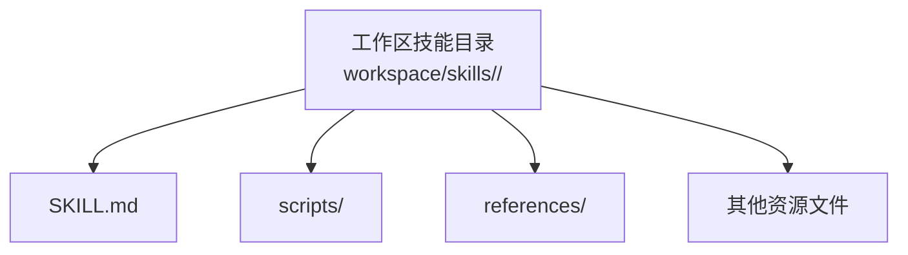
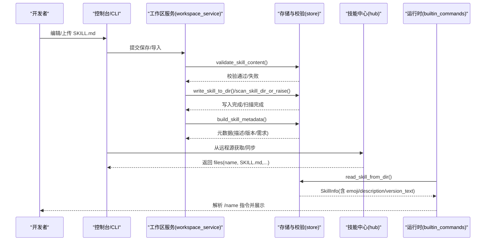
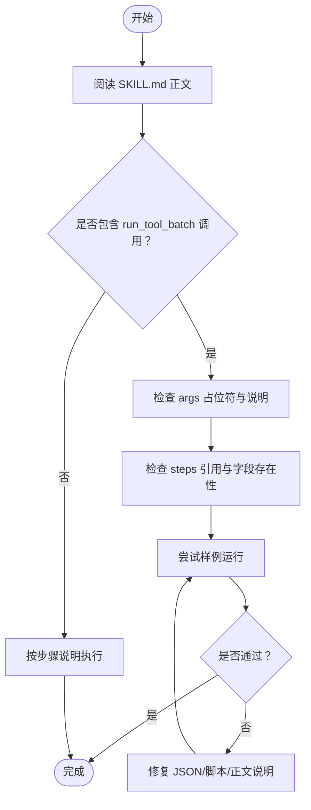
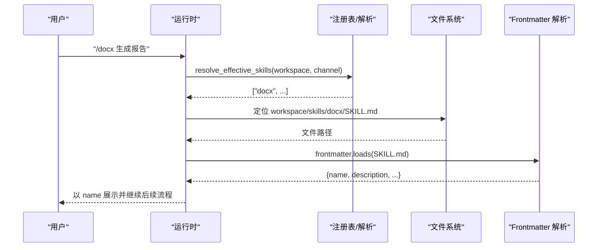
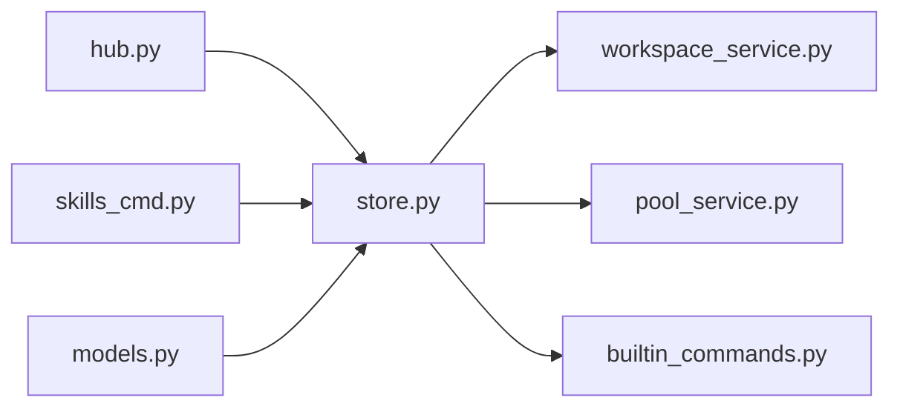

# SKILL.md 文件格式规范

<cite>
**本文引用的文件**   
- [store.py](file://src/qwenpaw/agents/skill_system/store.py)
- [models.py](file://src/qwenpaw/agents/skill_system/models.py)
- [workspace_service.py](file://src/qwenpaw/agents/skill_system/workspace_service.py)
- [pool_service.py](file://src/qwenpaw/agents/skill_system/pool_service.py)
- [hub.py](file://src/qwenpaw/agents/skill_system/hub.py)
- [builtin_commands.py](file://src/qwenpaw/runtime/builtin_commands.py)
- [skills_cmd.py](file://src/qwenpaw/cli/skills_cmd.py)
- [docx-en/SKILL.md](file://src/qwenpaw/agents/skills/docx-en/SKILL.md)
- [pdf-en/SKILL.md](file://src/qwenpaw/agents/skills/pdf-en/SKILL.md)
- [make-skill-en/SKILL.md](file://src/qwenpaw/agents/skills/make-skill-en/SKILL.md)
</cite>

## 目录
1. [简介](#简介)
2. [项目结构](#项目结构)
3. [核心组件](#核心组件)
4. [架构总览](#架构总览)
5. [详细组件分析](#详细组件分析)
6. [依赖关系分析](#依赖关系分析)
7. [性能与可扩展性](#性能与可扩展性)
8. [故障排查指南](#故障排查指南)
9. [结论](#结论)
10. [附录：字段与示例](#附录字段与示例)

## 简介
本规范定义 QwenPaw 技能系统使用的 SKILL.md 文件格式，涵盖 frontmatter 元数据、正文编写约定、脚本引用语法、参数传递机制、配置选项、校验规则与错误处理，以及与技能执行引擎的交互（指令解析、上下文注入、结果返回）。文档同时提供来自仓库内真实技能的示例路径，帮助初学者快速上手，并为有经验的开发者提供深入的技术细节。

## 项目结构
SKILL.md 位于每个技能目录的根目录下，作为技能的“入口声明 + 使用说明”。技能目录通常包含：
- SKILL.md：frontmatter 元数据与正文说明
- scripts/：可选，存放批处理 JSON 或辅助脚本
- references/：可选，存放参考文档
- 其他资源文件（如 LICENSE.txt）

[本节为概念性结构说明，无需来源]

## 核心组件
- 前端与 CLI 校验：通过 frontmatter 解析并校验 name/description 等必填字段。
- 存储与清单：读取 frontmatter、构建元数据、维护 manifest 与版本信息。
- 导入与同步：从 zip/GitHub/平台包源拉取并安装技能，校验与冲突处理。
- 运行时路由：将 /name 指令映射到对应技能目录，读取 frontmatter 展示名称。
- 模型与常量：SkillInfo、SkillRequirements 等数据结构定义。

**章节来源**
- [store.py:853-874](file://src/qwenpaw/agents/skill_system/store.py#L853-L874)
- [store.py:636-660](file://src/qwenpaw/agents/skill_system/store.py#L636-L660)
- [store.py:807-851](file://src/qwenpaw/agents/skill_system/store.py#L807-L851)
- [models.py:47-80](file://src/qwenpaw/agents/skill_system/models.py#L47-L80)
- [builtin_commands.py:493-579](file://src/qwenpaw/runtime/builtin_commands.py#L493-L579)
- [skills_cmd.py:112-126](file://src/qwenpaw/cli/skills_cmd.py#L112-L126)

## 架构总览
下图展示了 SKILL.md 在技能生命周期中的关键位置：创建/更新、校验、持久化、索引、运行时路由与显示。

**图表来源**
- [workspace_service.py:301-339](file://src/qwenpaw/agents/skill_system/workspace_service.py#L301-L339)
- [store.py:853-874](file://src/qwenpaw/agents/skill_system/store.py#L853-L874)
- [store.py:902-921](file://src/qwenpaw/agents/skill_system/store.py#L902-L921)
- [store.py:636-660](file://src/qwenpaw/agents/skill_system/store.py#L636-L660)
- [hub.py:1450-1472](file://src/qwenpaw/agents/skill_system/hub.py#L1450-L1472)
- [builtin_commands.py:534-579](file://src/qwenpaw/runtime/builtin_commands.py#L534-L579)

## 详细组件分析

### Frontmatter 字段定义与约束
- 必填字段
  - name：字符串，非空；用于标识技能名称（目录名稳定，frontmatter name 可漂移但需存在且非空）。
  - description：字符串，非空；用于提示触发条件与用途。
- 可选字段
  - version：字符串；若未提供，会从 metadata.version 或 metadata.builtin_skill_version 回退提取。
  - license：字符串；版权与许可说明。
  - metadata：对象；支持以下子键
    - builtin_skill_version：内置技能版本号
    - qwenpaw：QwenPaw 扩展命名空间
      - emoji：表情符号，用于 UI 展示
      - requires：依赖声明（见后文“依赖与要求”）
- 类型约束
  - metadata 必须为对象（dict），否则校验失败。

上述约束由统一校验函数实现，并在多处调用点生效（工作区保存、池更新、CLI 校验等）。

**章节来源**
- [store.py:853-874](file://src/qwenpaw/agents/skill_system/store.py#L853-L874)
- [store.py:267-278](file://src/qwenpaw/agents/skill_system/store.py#L267-L278)
- [store.py:797-804](file://src/qwenpaw/agents/skill_system/store.py#L797-L804)
- [store.py:807-851](file://src/qwenpaw/agents/skill_system/store.py#L807-L851)

### 正文内容编写规范
- 语言风格：使用祈使句，解释“为什么”，避免过度强调“必须”。
- 长度控制：正文建议控制在合理范围内，必要时拆分为多个小节。
- 结构建议：
  - 前置条件（Prerequisites）
  - 概览（Overview）
  - 快速开始（Quick Start）
  - 步骤说明（Step-by-step）
  - 批处理优先（Batch-first）：当流程可由脚本串联时，优先给出 run_tool_batch 的调用方式与参数说明
  - 失败处理与回退（Failure handling & fallback）
  - 参考与注意事项（Notes/References）
- 多语言支持：同一功能可提供不同语言的 SKILL.md（例如 -en/-zh 后缀目录），运行时根据渠道选择有效技能集合。

**章节来源**
- [make-skill-en/SKILL.md:209-222](file://src/qwenpaw/agents/skills/make-skill-en/SKILL.md#L209-L222)
- [pdf-en/SKILL.md:1-26](file://src/qwenpaw/agents/skills/pdf-en/SKILL.md#L1-L26)
- [docx-en/SKILL.md:1-12](file://src/qwenpaw/agents/skills/docx-en/SKILL.md#L1-L12)

### 脚本引用语法与参数传递机制
- 批处理优先：复杂工作流应封装为 run_tool_batch 的 JSON 文件，放在 scripts/ 下。
- 绝对路径：run_tool_batch 的 file_path 必须为绝对路径，正文中需明确如何构造该路径（基于当前 SKILL.md 所在目录）。
- 参数占位符
  - ${args.<name>}：传入参数，必须在正文“批处理参数”部分逐一说明含义、默认值与示例。
  - ${steps.<index>.<path>}：引用前序步骤输出，需在 materialize_skill 响应中核对字段是否存在。
- 验证与测试：
  - 在创建流程中，需对 ${steps} 引用进行一致性检查，并通过一次样例运行验证端到端链路。
  - 若环境限制无法测试，应在正文中注明。

**图表来源**
- [make-skill-en/SKILL.md:365-448](file://src/qwenpaw/agents/skills/make-skill-en/SKILL.md#L365-L448)
- [make-skill-en/SKILL.md:586-656](file://src/qwenpaw/agents/skills/make-skill-en/SKILL.md#L586-L656)

### 配置选项与依赖声明
- 依赖声明（requires）
  - 支持两种形式：
    - 列表：require_bins
    - 对象：{ bins: [...], env: [...] }
  - 解析优先级：metadata.qwenpaw.requires → metadata.openclaw/clawdbot.requires → metadata.requires → post.requires
- 版本信息
  - 优先使用 post.version，其次 metadata.version，最后 metadata.builtin_skill_version
- 图标与展示
  - metadata.qwenpaw.emoji 会被提取并放入 SkillInfo.emoji 供 UI 展示

**章节来源**
- [store.py:594-633](file://src/qwenpaw/agents/skill_system/store.py#L594-L633)
- [store.py:267-278](file://src/qwenpaw/agents/skill_system/store.py#L267-L278)
- [store.py:797-804](file://src/qwenpaw/agents/skill_system/store.py#L797-L804)
- [models.py:66-71](file://src/qwenpaw/agents/skill_system/models.py#L66-L71)

### 与技能执行引擎的关系
- 指令解析
  - 运行时解析 /name 或 /[name with spaces] 指令，匹配工作区有效技能集合。
- 上下文注入
  - 通过 resolve_effective_skills 结合 channel 选择语言变体（如 -en/-zh）。
- 结果返回
  - 读取 SKILL.md 的 frontmatter.name 作为显示名称；若缺失则回退到目录名。

**图表来源**
- [builtin_commands.py:493-579](file://src/qwenpaw/runtime/builtin_commands.py#L493-L579)

### 错误处理与校验规则
- YAML/frontmatter 非法：抛出 SkillsError，提示具体原因。
- 必填字段为空：提示 name 与 description 不能为空。
- metadata 类型错误：提示必须为对象。
- 安全扫描：写入前对目录进行安全扫描，拒绝不安全内容。
- 路径安全：zip 解压与相对路径解析均做越界防护。
- 冲突检测：导入时检测同名冲突并提供建议重命名。

**章节来源**
- [store.py:853-874](file://src/qwenpaw/agents/skill_system/store.py#L853-L874)
- [store.py:968-969](file://src/qwenpaw/agents/skill_system/store.py#L968-L969)
- [store.py:482-502](file://src/qwenpaw/agents/skill_system/store.py#L482-L502)
- [store.py:505-523](file://src/qwenpaw/agents/skill_system/store.py#L505-L523)
- [workspace_service.py:478-515](file://src/qwenpaw/agents/skill_system/workspace_service.py#L478-L515)

## 依赖关系分析
- 模块耦合
  - store.py 提供通用能力：frontmatter 读写、校验、元数据构建、目录操作、zip 导入、安全扫描。
  - workspace_service.py 与 pool_service.py 分别负责工作区与共享池的技能生命周期，复用 store 能力。
  - hub.py 负责从 GitHub/平台源拉取技能包，解析 SKILL.md 与树形文件。
  - builtin_commands.py 负责运行时指令分发与 frontmatter 展示。
  - skills_cmd.py 提供 CLI 校验入口。
  - models.py 定义对外暴露的数据结构与常量。

**图表来源**
- [store.py:1-55](file://src/qwenpaw/agents/skill_system/store.py#L1-L55)
- [workspace_service.py:1-38](file://src/qwenpaw/agents/skill_system/workspace_service.py#L1-L38)
- [pool_service.py:1-50](file://src/qwenpaw/agents/skill_system/pool_service.py#L1-L50)
- [hub.py:1450-1472](file://src/qwenpaw/agents/skill_system/hub.py#L1450-L1472)
- [builtin_commands.py:493-579](file://src/qwenpaw/runtime/builtin_commands.py#L493-L579)
- [skills_cmd.py:112-126](file://src/qwenpaw/cli/skills_cmd.py#L112-L126)
- [models.py:47-80](file://src/qwenpaw/agents/skill_system/models.py#L47-L80)

**章节来源**
- [store.py:1-55](file://src/qwenpaw/agents/skill_system/store.py#L1-L55)
- [workspace_service.py:1-38](file://src/qwenpaw/agents/skill_system/workspace_service.py#L1-L38)
- [pool_service.py:1-50](file://src/qwenpaw/agents/skill_system/pool_service.py#L1-L50)
- [hub.py:1450-1472](file://src/qwenpaw/agents/skill_system/hub.py#L1450-L1472)
- [builtin_commands.py:493-579](file://src/qwenpaw/runtime/builtin_commands.py#L493-L579)
- [skills_cmd.py:112-126](file://src/qwenpaw/cli/skills_cmd.py#L112-L126)
- [models.py:47-80](file://src/qwenpaw/agents/skill_system/models.py#L47-L80)

## 性能与可扩展性
- 缓存策略：manifest 读取基于 mtime 缓存，减少重复 IO。
- 原子写入：JSON manifest 采用临时文件 + replace 保证一致性。
- 并发安全：跨进程写锁（fcntl/msvcrt）序列化清单变更。
- 可扩展点：
  - 额外只读 skill 根目录（skill_paths）
  - 多语言变体（-en/-zh）
  - 自定义 requirements 命名空间（openclaw/qwenpaw/clawdbot）

[本节为通用指导，无需来源]

## 故障排查指南
- 常见错误
  - frontmatter 不是合法 YAML：检查 --- 分隔与缩进，确保 name/description 非空。
  - metadata 类型错误：确保 metadata 为对象。
  - 缺少 SKILL.md：确认目录结构正确。
  - 安全扫描拒绝：移除被标记的模式。
  - 路径越界/zip 异常：检查相对路径与压缩包内容。
- 定位方法
  - CLI 校验：使用 skills 命令触发 _validate_skill_frontmatter。
  - 运行时日志：查看 store 层警告与错误日志。
  - 冲突解决：根据建议重命名或删除旧技能。

**章节来源**
- [skills_cmd.py:112-126](file://src/qwenpaw/cli/skills_cmd.py#L112-L126)
- [store.py:853-874](file://src/qwenpaw/agents/skill_system/store.py#L853-L874)
- [store.py:482-502](file://src/qwenpaw/agents/skill_system/store.py#L482-L502)
- [workspace_service.py:478-515](file://src/qwenpaw/agents/skill_system/workspace_service.py#L478-L515)

## 结论
SKILL.md 是 QwenPaw 技能系统的核心契约：通过严格的 frontmatter 校验与丰富的正文约定，配合批处理优先的执行范式，既保证了安全性与可维护性，又提供了强大的自动化能力。遵循本规范，可以高效地开发、发布与维护高质量技能。

[本节为总结性内容，无需来源]

## 附录：字段与示例

### 字段速查表
- 必填
  - name：字符串，非空
  - description：字符串，非空
- 可选
  - version：字符串
  - license：字符串
  - metadata：对象
    - builtin_skill_version：字符串
    - qwenpaw：对象
      - emoji：字符串
      - requires：列表或对象（bins/env）

**章节来源**
- [store.py:853-874](file://src/qwenpaw/agents/skill_system/store.py#L853-L874)
- [store.py:267-278](file://src/qwenpaw/agents/skill_system/store.py#L267-L278)
- [store.py:797-804](file://src/qwenpaw/agents/skill_system/store.py#L797-L804)

### 实际示例路径
- 简单示例（PDF 处理）
  - [pdf-en/SKILL.md](file://src/qwenpaw/agents/skills/pdf-en/SKILL.md)
- 复杂示例（DOCX 处理）
  - [docx-en/SKILL.md](file://src/qwenpaw/agents/skills/docx-en/SKILL.md)
- 技能创建器（引导生成 SKILL.md）
  - [make-skill-en/SKILL.md](file://src/qwenpaw/agents/skills/make-skill-en/SKILL.md)

**章节来源**
- [pdf-en/SKILL.md:1-26](file://src/qwenpaw/agents/skills/pdf-en/SKILL.md#L1-L26)
- [docx-en/SKILL.md:1-12](file://src/qwenpaw/agents/skills/docx-en/SKILL.md#L1-L12)
- [make-skill-en/SKILL.md:1-9](file://src/qwenpaw/agents/skills/make-skill-en/SKILL.md#L1-L9)