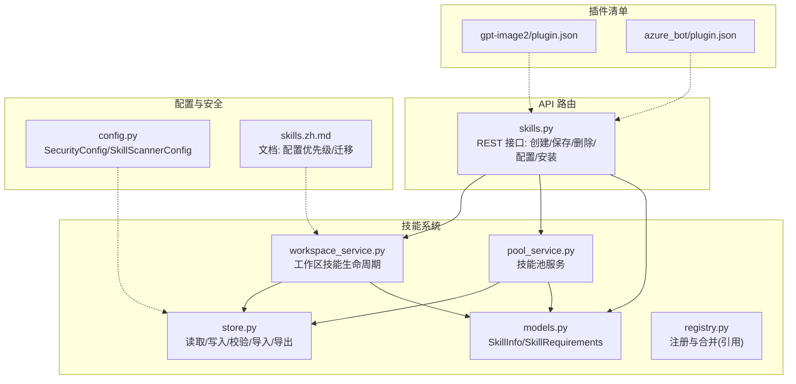
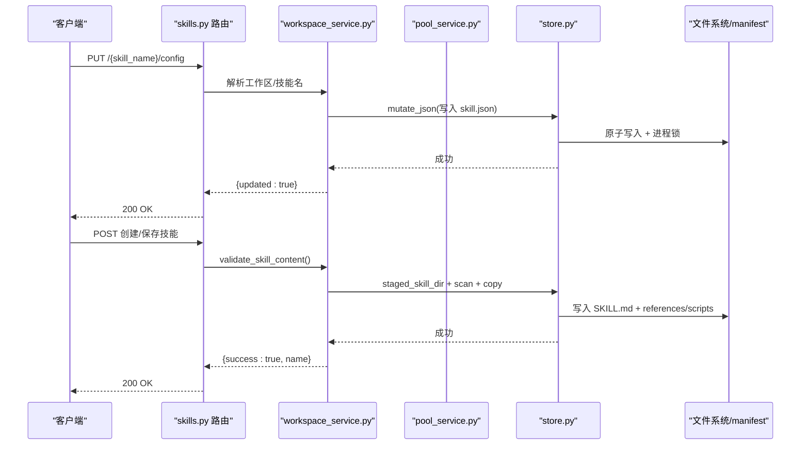
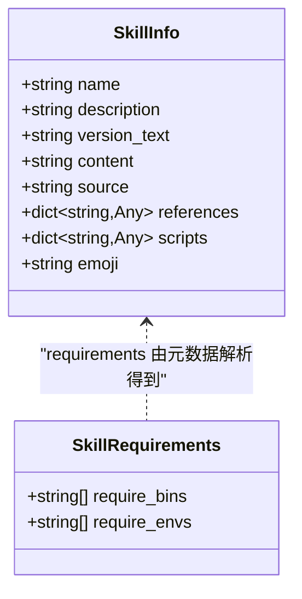
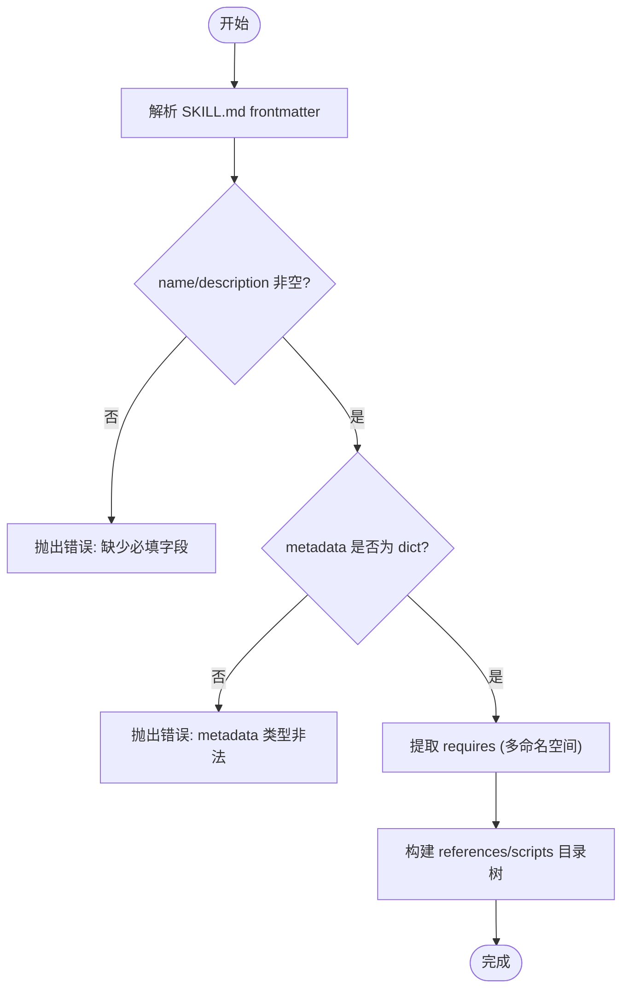
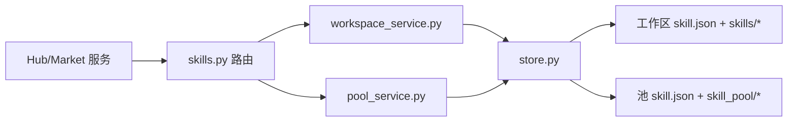
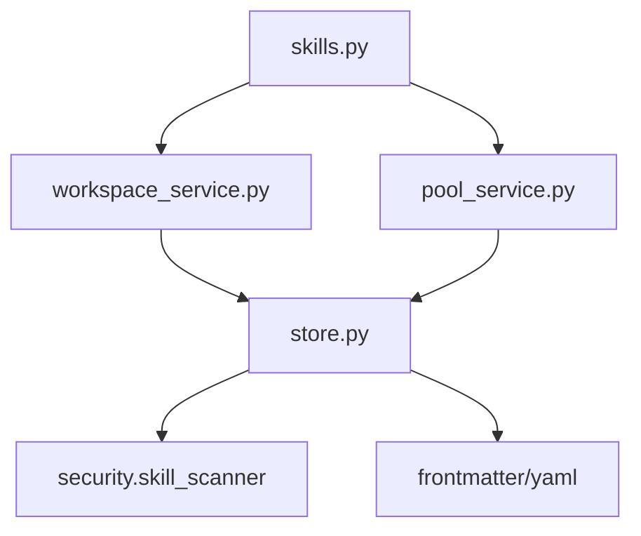

# 元数据与配置管理

<cite>
**本文引用的文件列表**
- [models.py](file://src/qwenpaw/agents/skill_system/models.py)
- [store.py](file://src/qwenpaw/agents/skill_system/store.py)
- [workspace_service.py](file://src/qwenpaw/agents/skill_system/workspace_service.py)
- [pool_service.py](file://src/qwenpaw/agents/skill_system/pool_service.py)
- [skills.py](file://src/qwenpaw/app/routers/skills.py)
- [plugin.json（工具示例）](file://plugins/tool/gpt-image2/plugin.json)
- [plugin.json（频道示例）](file://plugins/channel/azure_bot/plugin.json)
- [config.py](file://src/qwenpaw/config/config.py)
- [skills.zh.md](file://website/public/docs/skills.zh.md)
</cite>

## 目录
1. [简介](#简介)
2. [项目结构](#项目结构)
3. [核心组件](#核心组件)
4. [架构总览](#架构总览)
5. [详细组件分析](#详细组件分析)
6. [依赖关系分析](#依赖关系分析)
7. [性能考虑](#性能考虑)
8. [故障排查指南](#故障排查指南)
9. [结论](#结论)
10. [附录](#附录)

## 简介
本文件聚焦 QwenPaw 技能系统的“元数据与配置管理”，围绕以下目标展开：
- 深入解释 SkillInfo 模型定义、字段含义与验证规则
- 记录 plugin.json 配置文件结构与依赖声明、版本管理与发布信息
- 展示来自实际代码库的完整元数据定义路径
- 说明配置选项的作用域、优先级与继承机制
- 解释与技能注册表、工作空间存储、市场系统的集成关系
- 处理常见问题及解决方案，如配置冲突、版本不兼容、依赖解析失败等
- 重点介绍配置验证、热重载与迁移策略

## 项目结构
与“元数据与配置”直接相关的后端模块主要位于 agents/skill_system 与 app/routers，插件清单位于 plugins 目录，安全扫描与全局配置在 config 与 security 子系统中。

图表来源
- [models.py:47-81](file://src/qwenpaw/agents/skill_system/models.py#L47-L81)
- [store.py:636-661](file://src/qwenpaw/agents/skill_system/store.py#L636-L661)
- [workspace_service.py:145-185](file://src/qwenpaw/agents/skill_system/workspace_service.py#L145-L185)
- [pool_service.py:133-160](file://src/qwenpaw/agents/skill_system/pool_service.py#L133-L160)
- [skills.py:1653-1701](file://src/qwenpaw/app/routers/skills.py#L1653-L1701)
- [plugin.json（工具示例）:1-96](file://plugins/tool/gpt-image2/plugin.json#L1-L96)
- [plugin.json（频道示例）:1-25](file://plugins/channel/azure_bot/plugin.json#L1-L25)
- [config.py:2030-2071](file://src/qwenpaw/config/config.py#L2030-L2071)
- [skills.zh.md:408-497](file://website/public/docs/skills.zh.md#L408-L497)

章节来源
- [models.py:47-81](file://src/qwenpaw/agents/skill_system/models.py#L47-L81)
- [store.py:636-661](file://src/qwenpaw/agents/skill_system/store.py#L636-L661)
- [workspace_service.py:145-185](file://src/qwenpaw/agents/skill_system/workspace_service.py#L145-L185)
- [pool_service.py:133-160](file://src/qwenpaw/agents/skill_system/pool_service.py#L133-L160)
- [skills.py:1653-1701](file://src/qwenpaw/app/routers/skills.py#L1653-L1701)
- [plugin.json（工具示例）:1-96](file://plugins/tool/gpt-image2/plugin.json#L1-L96)
- [plugin.json（频道示例）:1-25](file://plugins/channel/azure_bot/plugin.json#L1-L25)
- [config.py:2030-2071](file://src/qwenpaw/config/config.py#L2030-L2071)
- [skills.zh.md:408-497](file://website/public/docs/skills.zh.md#L408-L497)

## 核心组件
- SkillInfo 模型：描述一个技能的运行时元数据与内容摘要，作为 API 返回与工作区/池条目中的统一表示。
- 存储与校验层 store.py：负责 SKILL.md frontmatter 解析、requirements 提取、目录树构建、冲突检测、zip 导入、原子写与并发锁。
- 工作区服务 workspace_service.py：提供工作区内技能的创建、保存、重命名、启用/禁用、批量导入、配置更新等。
- 技能池服务 pool_service.py：提供共享池的技能上传、下载、同步、自动更新目标解析等。
- API 路由 skills.py：暴露 REST 接口，串联上述服务，完成从前端到持久化的调用链。
- 插件清单 plugin.json：描述插件（工具/频道等）的元信息、依赖、QwenPaw 版本约束与工具配置字段。
- 配置与安全 config.py：提供安全扫描器配置、白名单等，影响技能加载与运行时的安全策略。

章节来源
- [models.py:47-81](file://src/qwenpaw/agents/skill_system/models.py#L47-L81)
- [store.py:853-875](file://src/qwenpaw/agents/skill_system/store.py#L853-L875)
- [workspace_service.py:145-185](file://src/qwenpaw/agents/skill_system/workspace_service.py#L145-L185)
- [pool_service.py:133-160](file://src/qwenpaw/agents/skill_system/pool_service.py#L133-L160)
- [skills.py:1653-1701](file://src/qwenpaw/app/routers/skills.py#L1653-L1701)
- [plugin.json（工具示例）:1-96](file://plugins/tool/gpt-image2/plugin.json#L1-L96)
- [plugin.json（频道示例）:1-25](file://plugins/channel/azure_bot/plugin.json#L1-L25)
- [config.py:2030-2071](file://src/qwenpaw/config/config.py#L2030-L2071)

## 架构总览
下图展示了“元数据与配置”的关键交互：API 路由接收请求，调用工作区/池服务；这些服务通过存储层读写 SKILL.md 与 manifest，并执行校验、冲突检测与原子写入；插件清单由插件系统消费，用于工具/频道能力与依赖声明。

图表来源
- [skills.py:1653-1701](file://src/qwenpaw/app/routers/skills.py#L1653-L1701)
- [workspace_service.py:145-185](file://src/qwenpaw/agents/skill_system/workspace_service.py#L145-L185)
- [store.py:384-395](file://src/qwenpaw/agents/skill_system/store.py#L384-L395)
- [store.py:902-921](file://src/qwenpaw/agents/skill_system/store.py#L902-L921)

## 详细组件分析

### SkillInfo 模型与元数据字段
- 字段说明
  - name：稳定标识符，对应目录名或 manifest 键，不应随 frontmatter 漂移而变化。
  - description：人类可读的描述。
  - version_text：从 frontmatter 中提取的版本文本，支持多个来源。
  - content：SKILL.md 原始内容，便于 UI 展示与编辑。
  - source：来源标记（如 builtin/customized/url 等）。
  - references/scripts：references 与 scripts 目录的树形结构，供 UI 浏览。
  - emoji：从 metadata.qwenpaw.emoji 提取的图标表情。
- 复杂度与性能
  - 读取时仅解析 frontmatter 与目录树，避免全量 IO；目录树为轻量级字典结构。
- 依赖关系
  - 被 workspace_service、pool_service、router 共同消费，作为统一的技能详情返回体。

图表来源
- [models.py:47-81](file://src/qwenpaw/agents/skill_system/models.py#L47-L81)
- [store.py:594-634](file://src/qwenpaw/agents/skill_system/store.py#L594-L634)

章节来源
- [models.py:47-81](file://src/qwenpaw/agents/skill_system/models.py#L47-L81)
- [store.py:807-851](file://src/qwenpaw/agents/skill_system/store.py#L807-L851)
- [store.py:594-634](file://src/qwenpaw/agents/skill_system/store.py#L594-L634)

### 元数据解析与验证规则
- frontmatter 解析
  - 使用 frontmatter 库解析 SKILL.md 头部，支持容错回退。
  - 版本提取顺序：post.version → post.metadata.version → post.metadata.builtin_skill_version。
- requirements 解析
  - 按命名空间顺序检查：metadata.openclaw.requires → metadata.qwenpaw.requires → metadata.requires → post.requires。
  - 支持 list 或 dict 两种形式，分别映射为 require_bins 与 require_envs。
- 内容校验
  - 必须包含非空的 name 与 description。
  - metadata 若存在则必须是 dict。
- 目录树与脚本/参考
  - references 与 scripts 目录会被递归遍历生成树结构，便于前端展示。

图表来源
- [store.py:853-875](file://src/qwenpaw/agents/skill_system/store.py#L853-L875)
- [store.py:267-279](file://src/qwenpaw/agents/skill_system/store.py#L267-L279)
- [store.py:594-634](file://src/qwenpaw/agents/skill_system/store.py#L594-L634)
- [store.py:252-265](file://src/qwenpaw/agents/skill_system/store.py#L252-L265)

章节来源
- [store.py:853-875](file://src/qwenpaw/agents/skill_system/store.py#L853-L875)
- [store.py:267-279](file://src/qwenpaw/agents/skill_system/store.py#L267-L279)
- [store.py:594-634](file://src/qwenpaw/agents/skill_system/store.py#L594-L634)
- [store.py:252-265](file://src/qwenpaw/agents/skill_system/store.py#L252-L265)

### plugin.json 配置结构、依赖与版本管理
- 通用字段
  - id/name/version/type/description/description_i18n/author：插件基础信息。
  - entry.backend：后端入口文件。
  - dependencies：Python 依赖声明（pip 风格）。
  - qwenpaw_version.min/max：与宿主版本的兼容性范围。
- 工具类插件扩展
  - meta.tools[]：每个工具的元信息，包括名称、描述、图标、是否需要配置、配置字段定义（名称、标签、类型、是否必填、占位符、帮助文本、数值范围等）。
  - meta.api_key_url/api_key_hint/model_url：辅助链接与提示。
- 发布与安装
  - 依赖由插件系统在安装阶段解析与校验。
  - 版本约束用于阻止不兼容的插件在宿主上运行。

章节来源
- [plugin.json（工具示例）:1-96](file://plugins/tool/gpt-image2/plugin.json#L1-L96)
- [plugin.json（频道示例）:1-25](file://plugins/channel/azure_bot/plugin.json#L1-L25)

### 配置作用域、优先级与继承机制
- 作用域
  - 宿主环境变量：机器级别，不会被覆盖。
  - 工作区配置：工作区 manifest（skill.json）中每个技能的 config 对象，控制台针对 Agent 编辑的配置。
  - 池配置：从池下载到工作区时，池的 config 会作为初始工作区配置复制过来，之后工作区的编辑优先。
- 继承与覆盖
  - 工作区 config 覆盖池 config；宿主环境变量始终最高优先级。
- 运行时注入
  - 对于 requires.env 中声明的键，会以环境变量形式注入；同时提供完整 JSON 的环境变量（含技能名），供运行时按需读取。

章节来源
- [skills.zh.md:408-471](file://website/public/docs/skills.zh.md#L408-L471)

### 与技能注册表、工作空间存储、市场系统的集成
- 注册表与清单
  - 工作区 manifest：workspaces/{agentId}/skill.json，维护已安装技能及其 enabled/channels/tags/config/metadata 等。
  - 池 manifest：skill_pool/skill.json，维护共享池技能与内置槽位状态。
- 工作空间存储
  - 工作区技能源码位于 workspaces/{agentId}/skills/{skillName}/SKILL.md，以及可选 references/scripts 目录。
  - 变更通过 mutate_json 原子写入，并使用跨进程锁保证一致性。
- 市场系统
  - 市场搜索与安装通过 hub 服务与 router 协作，最终落盘到工作区或池，并更新 manifest。
  - 安装来源（installed_from）用于追踪来源（如 clawhub/modelscope/aliyun/zip/url 等）。

图表来源
- [skills.py:26-75](file://src/qwenpaw/app/routers/skills.py#L26-L75)
- [workspace_service.py:145-185](file://src/qwenpaw/agents/skill_system/workspace_service.py#L145-L185)
- [pool_service.py:133-160](file://src/qwenpaw/agents/skill_system/pool_service.py#L133-L160)
- [store.py:402-416](file://src/qwenpaw/agents/skill_system/store.py#L402-L416)

章节来源
- [skills.py:26-75](file://src/qwenpaw/app/routers/skills.py#L26-L75)
- [workspace_service.py:145-185](file://src/qwenpaw/agents/skill_system/workspace_service.py#L145-L185)
- [pool_service.py:133-160](file://src/qwenpaw/agents/skill_system/pool_service.py#L133-L160)
- [store.py:402-416](file://src/qwenpaw/agents/skill_system/store.py#L402-L416)

### 配置验证、热重载与迁移策略
- 配置验证
  - 创建/保存前进行 SKILL.md frontmatter 校验与安全检查（scan_skill_directory）。
  - 冲突检测：同名技能建议带时间戳后缀的重命名方案。
- 热重载
  - 工作区 manifest 采用 mtime 缓存读取，当文件变化后下一次读取即生效；保存流程使用原子写入，避免中间态。
  - 安全扫描器支持 reload，重新加载白名单与敏感文件列表。
- 迁移策略
  - 首次启动自动将旧的 active_skills/ 与 customized_skills/ 迁移至统一的工作区 skills/ 布局。
  - 迁移为复制而非移动，旧目录保留；同名但内容不同的技能会添加后缀区分。

章节来源
- [store.py:384-395](file://src/qwenpaw/agents/skill_system/store.py#L384-L395)
- [store.py:751-776](file://src/qwenpaw/agents/skill_system/store.py#L751-L776)
- [config.py:2030-2071](file://src/qwenpaw/config/config.py#L2030-L2071)
- [skills.zh.md:473-497](file://website/public/docs/skills.zh.md#L473-L497)

## 依赖关系分析
- 组件耦合
  - router 与服务层解耦，通过函数式调用传递工作区路径与参数。
  - 服务层对 store 的依赖集中在 I/O、校验与冲突处理，职责清晰。
- 外部依赖
  - frontmatter/yaml：frontmatter 解析。
  - 平台文件锁：fcntl/msvcrt 实现跨进程互斥。
  - 安全扫描器：在导入/保存时对技能目录进行扫描。
- 潜在循环依赖
  - 当前模块间以单向依赖为主，未见明显循环。

图表来源
- [skills.py:26-75](file://src/qwenpaw/app/routers/skills.py#L26-L75)
- [workspace_service.py:145-185](file://src/qwenpaw/agents/skill_system/workspace_service.py#L145-L185)
- [pool_service.py:133-160](file://src/qwenpaw/agents/skill_system/pool_service.py#L133-L160)
- [store.py:968-970](file://src/qwenpaw/agents/skill_system/store.py#L968-L970)

章节来源
- [skills.py:26-75](file://src/qwenpaw/app/routers/skills.py#L26-L75)
- [workspace_service.py:145-185](file://src/qwenpaw/agents/skill_system/workspace_service.py#L145-L185)
- [pool_service.py:133-160](file://src/qwenpaw/agents/skill_system/pool_service.py#L133-L160)
- [store.py:968-970](file://src/qwenpaw/agents/skill_system/store.py#L968-L970)

## 性能考虑
- 原子写入与并发控制
  - 使用临时文件 + replace 实现原子写入，配合 fcntl/msvcrt 文件锁避免并发竞争。
- 缓存策略
  - 基于 mtime 的 JSON 读取缓存，减少重复 IO。
- 目录树构建
  - 仅遍历 references/scripts 目录，避免全量扫描。
- 建议
  - 大 zip 导入需限制解压大小与路径安全性，防止资源耗尽与路径穿越。

章节来源
- [store.py:359-395](file://src/qwenpaw/agents/skill_system/store.py#L359-L395)
- [store.py:751-776](file://src/qwenpaw/agents/skill_system/store.py#L751-L776)
- [store.py:482-503](file://src/qwenpaw/agents/skill_system/store.py#L482-L503)

## 故障排查指南
- 配置冲突
  - 现象：同名技能冲突，返回 conflict 并附带建议的新名称。
  - 解决：接受建议名称或手动重命名后重试。
- 版本不兼容
  - 现象：插件 qwenpaw_version 超出宿主范围导致无法安装/启用。
  - 解决：升级宿主或选择兼容版本的插件。
- 依赖解析失败
  - 现象：dependencies 无法满足，安装失败。
  - 解决：检查网络与镜像源，确认依赖版本可用。
- 配置未生效
  - 现象：修改 config 后未立即生效。
  - 解决：确认保存成功；manifest 采用 mtime 缓存，下次读取即生效；必要时重启相关服务。
- 安全扫描阻断
  - 现象：技能被安全扫描器拦截。
  - 解决：调整 scanner.mode 或将技能加入白名单（需提供 content_hash）。

章节来源
- [store.py:671-692](file://src/qwenpaw/agents/skill_system/store.py#L671-L692)
- [plugin.json（工具示例）:16-19](file://plugins/tool/gpt-image2/plugin.json#L16-L19)
- [plugin.json（频道示例）:20-23](file://plugins/channel/azure_bot/plugin.json#L20-L23)
- [skills.zh.md:408-471](file://website/public/docs/skills.zh.md#L408-L471)
- [config.py:2030-2071](file://src/qwenpaw/config/config.py#L2030-L2071)

## 结论
QwenPaw 的技能元数据与配置管理以 SkillInfo 为核心，结合 store 层的健壮 I/O 与校验、工作区/池服务的分层治理，以及插件清单的标准化描述，形成了可插拔、可迁移、可审计的能力体系。通过明确的配置优先级与作用域、严格的冲突与版本约束、以及安全的扫描与白名单机制，系统在易用性与安全性之间取得平衡。

## 附录
- 关键 API 路径（节选）
  - PUT /api/agents/{agentId}/skills/{skill_name}/config：更新工作区技能配置
  - DELETE /api/agents/{agentId}/skills/{skill_name}/config：清空工作区技能配置
  - POST /api/agents/{agentId}/skills：创建工作区技能
  - GET /api/agents/{agentId}/skills：列出工作区技能
  - 市场安装：通过 hub 服务与路由协作，最终落盘到工作区或池

章节来源
- [skills.py:1653-1701](file://src/qwenpaw/app/routers/skills.py#L1653-L1701)