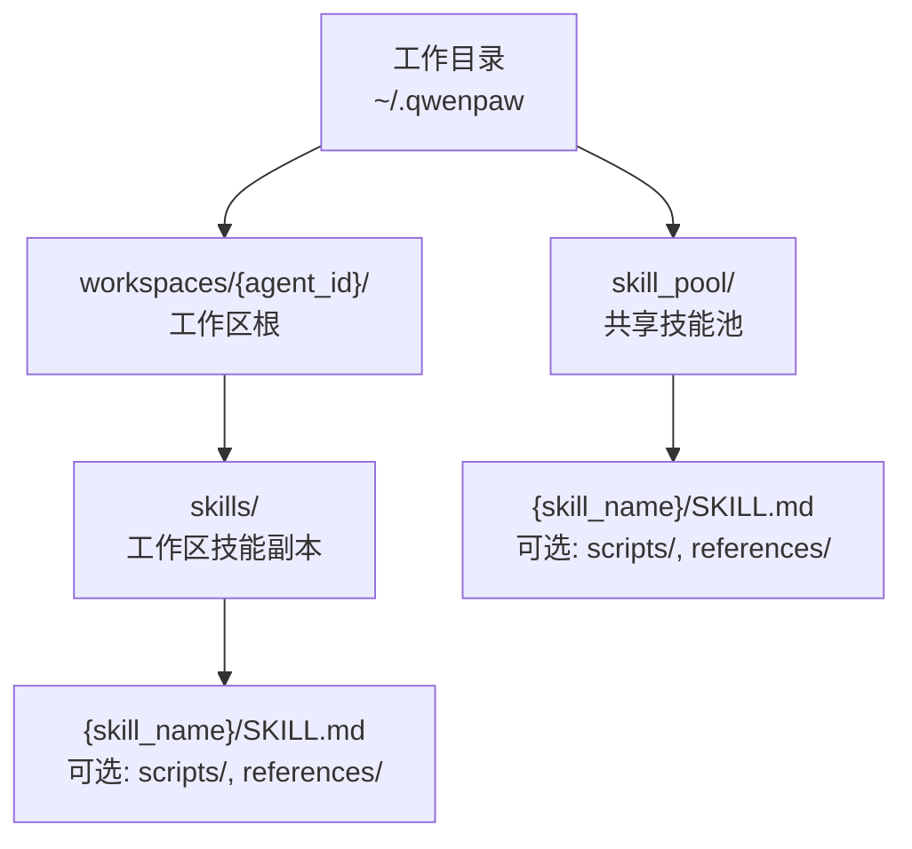
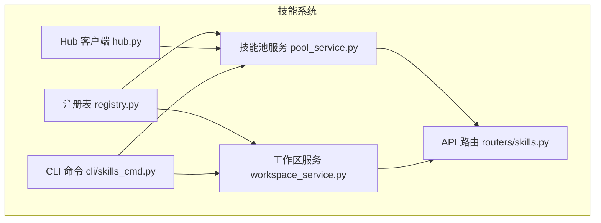
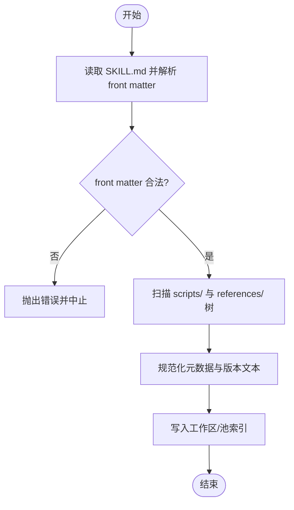
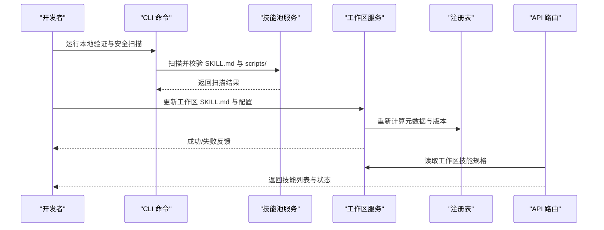
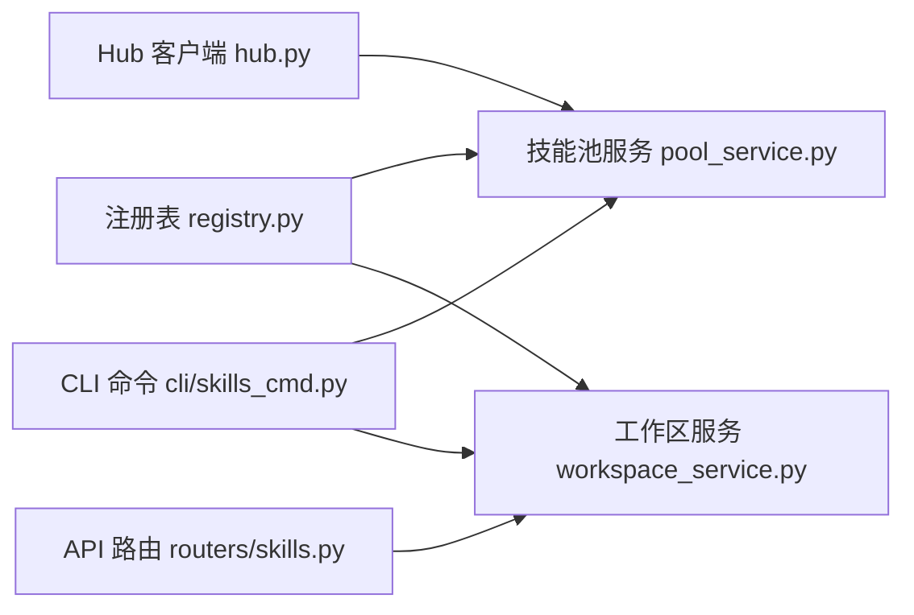

# 技能目录结构规范

<cite>
**本文引用的文件列表**
- [src/qwenpaw/agents/skill_system/hub.py](file://src/qwenpaw/agents/skill_system/hub.py)
- [src/qwenpaw/agents/skill_system/registry.py](file://src/qwenpaw/agents/skill_system/registry.py)
- [src/qwenpaw/agents/skill_system/pool_service.py](file://src/qwenpaw/agents/skill_system/pool_service.py)
- [src/qwenpaw/agents/skill_system/workspace_service.py](file://src/qwenpaw/agents/skill_system/workspace_service.py)
- [src/qwenpaw/app/routers/skills.py](file://src/qwenpaw/app/routers/skills.py)
- [src/qwenpaw/cli/skills_cmd.py](file://src/qwenpaw/cli/skills_cmd.py)
- [website/public/docs/skills.zh.md](file://website/public/docs/skills.zh.md)
- [website/public/docs/config.en.md](file://website/public/docs/config.en.md)
- [plugins/tool/gpt-image2/plugin.json](file://plugins/tool/gpt-image2/plugin.json)
- [plugins/tool/qwen-image/plugin.json](file://plugins/tool/qwen-image/plugin.json)
- [plugins/tool/wan27/plugin.json](file://plugins/tool/wan27/plugin.json)
</cite>

## 目录
1. [简介](#简介)
2. [项目结构](#项目结构)
3. [核心组件](#核心组件)
4. [架构总览](#架构总览)
5. [详细组件分析](#详细组件分析)
6. [依赖关系分析](#依赖关系分析)
7. [性能与兼容性](#性能与兼容性)
8. [故障排查指南](#故障排查指南)
9. [结论](#结论)
10. [附录](#附录)

## 简介
本规范面向 QwenPaw 的“技能（Skill）”体系，系统化说明技能的目录组织、必需与可选文件、命名约定、权限与版本兼容规则，以及与技能加载器、工作区管理器的交互方式。文档同时给出来自仓库的真实示例路径，帮助初学者快速上手，并为有经验的开发者提供深入的技术细节。

## 项目结构
QwenPaw 的技能分为两层：
- 共享技能池：位于工作目录下的 skill_pool，用于集中管理与分发。
- 工作区技能副本：每个工作区拥有独立的 skills 目录，作为运行时实际使用的本地副本。

图示来源
- [website/public/docs/skills.zh.md:29-47](file://website/public/docs/skills.zh.md#L29-L47)
- [website/public/docs/config.en.md:16-43](file://website/public/docs/config.en.md#L16-L43)

章节来源
- [website/public/docs/skills.zh.md:19-47](file://website/public/docs/skills.zh.md#L19-L47)
- [website/public/docs/config.en.md:16-43](file://website/public/docs/config.en.md#L16-L43)

## 核心组件
- 技能清单与元数据
  - SKILL.md：每个技能目录必须包含，使用 YAML front matter 声明 name、description 等元信息。
  - 工作区 manifest：工作区根目录下存在 skill.json，记录启用状态、配置、渠道绑定等。
- 脚本与资源
  - scripts/：可选，存放可执行脚本或工具，SKILL.md 中应明确相对路径约定。
  - references/：可选，存放参考文档或素材。
- 依赖声明
  - 对于插件型工具（非 Skill），通过 plugin.json 声明 dependencies 与 qwenpaw_version 范围；Skill 自身不强制要求 requirements.txt，但可在 README 或 SKILL.md 中说明外部依赖。

章节来源
- [website/public/docs/config.en.md:650-669](file://website/public/docs/config.en.md#L650-L669)
- [src/qwenpaw/agents/skill_system/registry.py:155-177](file://src/qwenpaw/agents/skill_system/registry.py#L155-L177)
- [src/qwenpaw/agents/skill_system/workspace_service.py:301-339](file://src/qwenpaw/agents/skill_system/workspace_service.py#L301-L339)
- [plugins/tool/gpt-image2/plugin.json:1-96](file://plugins/tool/gpt-image2/plugin.json#L1-L96)
- [plugins/tool/qwen-image/plugin.json:1-136](file://plugins/tool/qwen-image/plugin.json#L1-L136)
- [plugins/tool/wan27/plugin.json:1-129](file://plugins/tool/wan27/plugin.json#L1-L129)

## 架构总览
技能系统由以下关键模块协作完成：
- 注册表与内置发现：扫描打包的内置技能，按语言偏好选择变体，生成导入候选。
- 技能池服务：校验、扫描、冲突检测、索引重建。
- 工作区服务：在工作区维度读写 SKILL.md、更新元数据、应用配置到环境变量。
- Hub 客户端：从远程源（GitHub、Hub 等）拉取并规范化 bundle，提取 SKILL.md 与 files。
- API 路由：将工作区技能规格暴露给控制台与 CLI。
- CLI 命令：提供本地验证与安全扫描入口。

图示来源
- [src/qwenpaw/agents/skill_system/registry.py:155-177](file://src/qwenpaw/agents/skill_system/registry.py#L155-L177)
- [src/qwenpaw/agents/skill_system/pool_service.py:272-306](file://src/qwenpaw/agents/skill_system/pool_service.py#L272-L306)
- [src/qwenpaw/agents/skill_system/workspace_service.py:301-339](file://src/qwenpaw/agents/skill_system/workspace_service.py#L301-L339)
- [src/qwenpaw/agents/skill_system/hub.py:1450-1472](file://src/qwenpaw/agents/skill_system/hub.py#L1450-L1472)
- [src/qwenpaw/app/routers/skills.py:591-629](file://src/qwenpaw/app/routers/skills.py#L591-L629)
- [src/qwenpaw/cli/skills_cmd.py:129-160](file://src/qwenpaw/cli/skills_cmd.py#L129-L160)

## 详细组件分析

### 技能目录结构与命名约定
- 目录层级
  - 共享池：$QWENPAW_WORKING_DIR/skill_pool/{skill_name}
  - 工作区：$QWENPAW_WORKING_DIR/workspaces/{agent_id}/skills/{skill_name}
- 必需文件
  - {skill_name}/SKILL.md：必须存在，包含 YAML front matter（至少 name、description）。
- 可选目录
  - scripts/：存放脚本，SKILL.md 中需注明以技能目录为工作目录运行。
  - references/：存放参考材料。
- 命名约定
  - 内置技能目录采用 {name}-{language} 形式（如 docx-en），语言后缀 en/zh。
  - 自定义技能建议使用小写英文字母、数字与连字符，避免特殊字符。

章节来源
- [website/public/docs/skills.zh.md:29-47](file://website/public/docs/skills.zh.md#L29-L47)
- [website/public/docs/config.en.md:650-669](file://website/public/docs/config.en.md#L650-L669)
- [src/qwenpaw/agents/skill_system/registry.py:50-54](file://src/qwenpaw/agents/skill_system/registry.py#L50-L54)
- [src/qwenpaw/agents/skill_system/registry.py:155-177](file://src/qwenpaw/agents/skill_system/registry.py#L155-L177)

### SKILL.md 规范与解析流程
- Front matter 字段
  - name：技能标识名，必须唯一。
  - description：简要描述，用于展示与检索。
  - metadata：可选，包含 version、builtin_skill_version、requires.env 等扩展信息。
- 解析与校验
  - 注册表在扫描内置技能时读取 SKILL.md 的 front matter，提取 name、description、version_text。
  - 工作区服务在保存 SKILL.md 前进行内容变更对比与扫描校验。
  - 技能池服务对每个发现的技能目录调用 validate_skill_content 与 scan_skill_dir_or_raise。

图示来源
- [src/qwenpaw/agents/skill_system/registry.py:155-177](file://src/qwenpaw/agents/skill_system/registry.py#L155-L177)
- [src/qwenpaw/agents/skill_system/workspace_service.py:301-339](file://src/qwenpaw/agents/skill_system/workspace_service.py#L301-L339)
- [src/qwenpaw/agents/skill_system/pool_service.py:272-306](file://src/qwenpaw/agents/skill_system/pool_service.py#L272-L306)

章节来源
- [src/qwenpaw/agents/skill_system/registry.py:155-177](file://src/qwenpaw/agents/skill_system/registry.py#L155-L177)
- [src/qwenpaw/agents/skill_system/workspace_service.py:301-339](file://src/qwenpaw/agents/skill_system/workspace_service.py#L301-L339)
- [src/qwenpaw/agents/skill_system/pool_service.py:272-306](file://src/qwenpaw/agents/skill_system/pool_service.py#L272-L306)

### scripts 目录组织与执行约定
- 位置与相对路径
  - scripts/ 位于技能目录内，所有路径相对于该技能目录。
  - 建议在 SKILL.md 顶部明确“以技能目录为当前工作目录运行”。
- 典型用法
  - 通过 python scripts/... 或直接调用已安装的外部工具（如 pandoc、soffice）。
- 安全与扫描
  - 导入/更新时会扫描 scripts/ 树，检查潜在风险项。

章节来源
- [src/qwenpaw/agents/skills/docx-en/SKILL.md:9-12](file://src/qwenpaw/agents/skills/docx-en/SKILL.md#L9-L12)
- [src/qwenpaw/agents/skills/docx-en/scripts/office/unpack.py:1-14](file://src/qwenpaw/agents/skills/docx-en/scripts/office/unpack.py#L1-L14)
- [src/qwenpaw/agents/skill_system/pool_service.py:272-306](file://src/qwenpaw/agents/skill_system/pool_service.py#L272-L306)

### references 资源管理
- 用途
  - 存放参考文档、模板、样例等静态资源，便于使用者查阅。
- 规范化
  - Hub 客户端在解析 bundle 时会将 references/ 下文件纳入树形结构，便于后续展示与下载。

章节来源
- [src/qwenpaw/agents/skill_system/hub.py:713-728](file://src/qwenpaw/agents/skill_system/hub.py#L713-L728)

### 依赖声明与版本兼容
- 插件型工具（Tool Plugin）
  - 通过 plugin.json 声明 dependencies（Python 包约束）与 qwenpaw_version（最小/最大兼容版本）。
  - 示例：gpt-image2、qwen-image、wan27 三个插件均包含 dependencies 与 qwenpaw_version 字段。
- 技能（Skill）
  - 无强制 requirements.txt；若涉及外部工具，应在 SKILL.md 或 README 中说明安装步骤与环境要求。

章节来源
- [plugins/tool/gpt-image2/plugin.json:15-19](file://plugins/tool/gpt-image2/plugin.json#L15-L19)
- [plugins/tool/qwen-image/plugin.json:14-18](file://plugins/tool/qwen-image/plugin.json#L14-L18)
- [plugins/tool/wan27/plugin.json:14-18](file://plugins/tool/wan27/plugin.json#L14-L18)

### 与其他组件的交互
- 与技能加载器（注册表）
  - 注册表负责发现内置技能变体、语言偏好选择、构建导入候选，并将结果同步至技能池与工作区。
- 与工作区管理器
  - 工作区服务负责在工作区维度读写 SKILL.md、更新元数据、应用配置到环境变量（基于 requires.env）。
- 与 Hub 客户端
  - Hub 客户端支持从 GitHub/Hub 等源拉取 bundle，提取 SKILL.md 与 files，并进行规范化处理。
- 与 API 路由
  - API 路由读取工作区 manifest 与技能目录，构建 SkillSpec 供前端展示与管理。
- 与 CLI
  - CLI 提供本地验证与安全扫描入口，辅助开发者在提交前自检。

图示来源
- [src/qwenpaw/cli/skills_cmd.py:129-160](file://src/qwenpaw/cli/skills_cmd.py#L129-L160)
- [src/qwenpaw/agents/skill_system/pool_service.py:272-306](file://src/qwenpaw/agents/skill_system/pool_service.py#L272-L306)
- [src/qwenpaw/agents/skill_system/workspace_service.py:301-339](file://src/qwenpaw/agents/skill_system/workspace_service.py#L301-L339)
- [src/qwenpaw/agents/skill_system/registry.py:155-177](file://src/qwenpaw/agents/skill_system/registry.py#L155-L177)
- [src/qwenpaw/app/routers/skills.py:591-629](file://src/qwenpaw/app/routers/skills.py#L591-L629)

## 依赖关系分析
- 组件耦合
  - 注册表与技能池/工作区服务紧密耦合，负责元数据与语言变体选择。
  - Hub 客户端独立于文件系统，专注于网络获取与规范化。
  - API 路由仅消费工作区服务产出的规格，保持低耦合。
- 外部依赖
  - 插件通过 plugin.json 声明 Python 依赖与 QwenPaw 版本范围。
  - 技能可能依赖外部工具（如 pandoc、LibreOffice），需在文档中说明。

图示来源
- [src/qwenpaw/agents/skill_system/registry.py:155-177](file://src/qwenpaw/agents/skill_system/registry.py#L155-L177)
- [src/qwenpaw/agents/skill_system/pool_service.py:272-306](file://src/qwenpaw/agents/skill_system/pool_service.py#L272-L306)
- [src/qwenpaw/agents/skill_system/workspace_service.py:301-339](file://src/qwenpaw/agents/skill_system/workspace_service.py#L301-L339)
- [src/qwenpaw/agents/skill_system/hub.py:1450-1472](file://src/qwenpaw/agents/skill_system/hub.py#L1450-L1472)
- [src/qwenpaw/app/routers/skills.py:591-629](file://src/qwenpaw/app/routers/skills.py#L591-L629)
- [src/qwenpaw/cli/skills_cmd.py:129-160](file://src/qwenpaw/cli/skills_cmd.py#L129-L160)

章节来源
- [src/qwenpaw/agents/skill_system/registry.py:155-177](file://src/qwenpaw/agents/skill_system/registry.py#L155-L177)
- [src/qwenpaw/agents/skill_system/pool_service.py:272-306](file://src/qwenpaw/agents/skill_system/pool_service.py#L272-L306)
- [src/qwenpaw/agents/skill_system/workspace_service.py:301-339](file://src/qwenpaw/agents/skill_system/workspace_service.py#L301-L339)
- [src/qwenpaw/agents/skill_system/hub.py:1450-1472](file://src/qwenpaw/agents/skill_system/hub.py#L1450-L1472)
- [src/qwenpaw/app/routers/skills.py:591-629](file://src/qwenpaw/app/routers/skills.py#L591-L629)
- [src/qwenpaw/cli/skills_cmd.py:129-160](file://src/qwenpaw/cli/skills_cmd.py#L129-L160)

## 性能与兼容性
- 性能
  - 注册表对内置技能进行缓存，减少重复扫描开销。
  - Hub 客户端具备请求重试、退避与并发限制，避免频繁网络抖动影响。
- 兼容性
  - 插件通过 qwenpaw_version 指定最小/最大兼容版本，确保升级平滑。
  - 内置技能语言变体根据 UI 语言或显式设置自动选择，提升多语言体验。

章节来源
- [src/qwenpaw/agents/skill_system/registry.py:80-106](file://src/qwenpaw/agents/skill_system/registry.py#L80-L106)
- [plugins/tool/gpt-image2/plugin.json:16-19](file://plugins/tool/gpt-image2/plugin.json#L16-L19)
- [plugins/tool/qwen-image/plugin.json:15-18](file://plugins/tool/qwen-image/plugin.json#L15-L18)
- [plugins/tool/wan27/plugin.json:15-18](file://plugins/tool/wan27/plugin.json#L15-L18)

## 故障排查指南
- 常见问题
  - 找不到 SKILL.md：确认 URL 指向包含 SKILL.md 的目录，或本地目录结构正确。
  - 依赖缺失：插件需满足 plugin.json 中的 dependencies；技能依赖的外部工具需安装并在 PATH 中可用。
  - 版本不兼容：检查 qwenpaw_version 范围是否覆盖当前版本。
  - 路径解析错误：scripts/ 路径需相对于技能目录；确保以技能目录为工作目录执行。
- 解决方案
  - 使用 CLI 进行本地验证与安全扫描，定位问题。
  - 检查工作区 manifest 与技能目录一致性，必要时重建索引。
  - 调整环境变量或配置，确保 requires.env 被注入。

章节来源
- [src/qwenpaw/agents/skill_system/hub.py:1450-1472](file://src/qwenpaw/agents/skill_system/hub.py#L1450-L1472)
- [src/qwenpaw/cli/skills_cmd.py:129-160](file://src/qwenpaw/cli/skills_cmd.py#L129-L160)
- [src/qwenpaw/agents/skill_system/workspace_service.py:301-339](file://src/qwenpaw/agents/skill_system/workspace_service.py#L301-L339)

## 结论
本规范明确了 QwenPaw 技能目录的组织方式、必需与可选文件、命名约定、依赖与版本兼容规则，以及各组件间的交互流程。遵循本规范可显著提升技能的可维护性与可移植性，降低集成与排障成本。

## 附录

### 真实示例：插件目录结构
- gpt-image2 插件
  - 目录：plugins/tool/gpt-image2
  - 关键文件：plugin.json、gpt_image2.py、requirements.txt（如有）
  - 依赖与版本：dependencies、qwenpaw_version
- qwen-image 插件
  - 目录：plugins/tool/qwen-image
  - 关键文件：plugin.json、qwen_image.py、requirements.txt（如有）
  - 依赖与版本：dependencies、qwenpaw_version
- wan27 插件
  - 目录：plugins/tool/wan27
  - 关键文件：plugin.json、wan27.py、requirements.txt（如有）
  - 依赖与版本：dependencies、qwenpaw_version

章节来源
- [plugins/tool/gpt-image2/plugin.json:1-96](file://plugins/tool/gpt-image2/plugin.json#L1-L96)
- [plugins/tool/qwen-image/plugin.json:1-136](file://plugins/tool/qwen-image/plugin.json#L1-L136)
- [plugins/tool/wan27/plugin.json:1-129](file://plugins/tool/wan27/plugin.json#L1-L129)

### 真实示例：内置技能目录结构
- docx-en 技能
  - 目录：src/qwenpaw/agents/skills/docx-en
  - 关键文件：SKILL.md、scripts/office/unpack.py 等
  - 脚本约定：以技能目录为工作目录运行 python scripts/...

章节来源
- [src/qwenpaw/agents/skills/docx-en/SKILL.md:9-12](file://src/qwenpaw/agents/skills/docx-en/SKILL.md#L9-L12)
- [src/qwenpaw/agents/skills/docx-en/scripts/office/unpack.py:1-14](file://src/qwenpaw/agents/skills/docx-en/scripts/office/unpack.py#L1-L14)