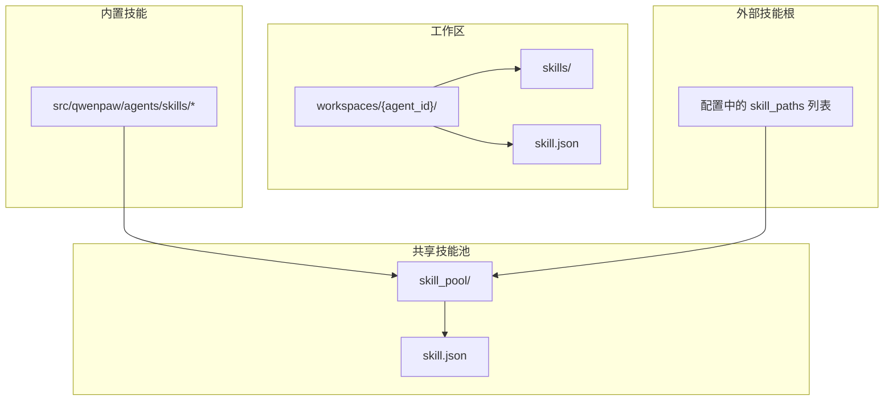
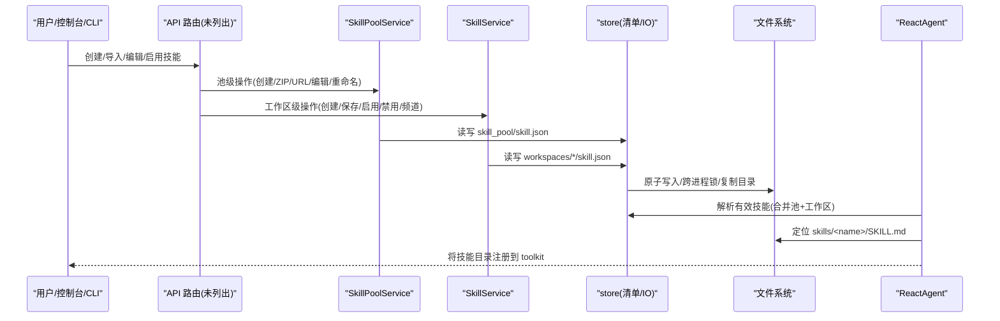
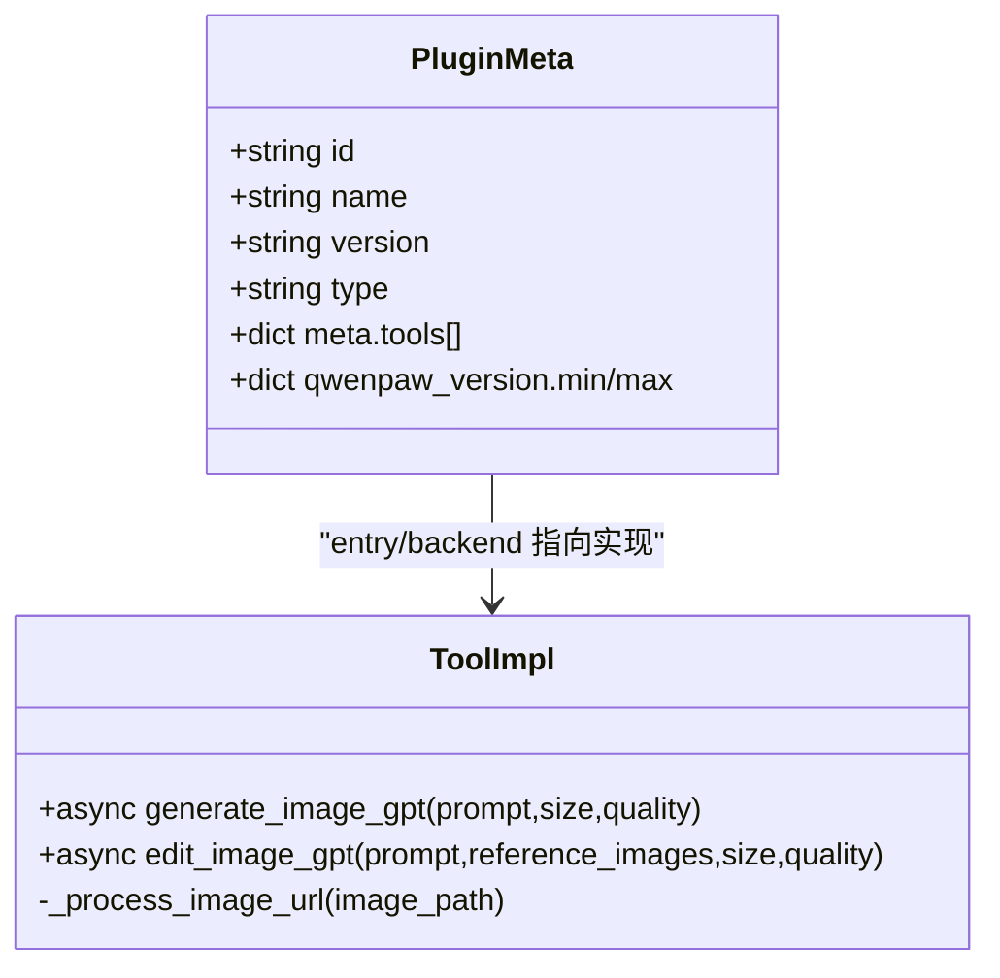
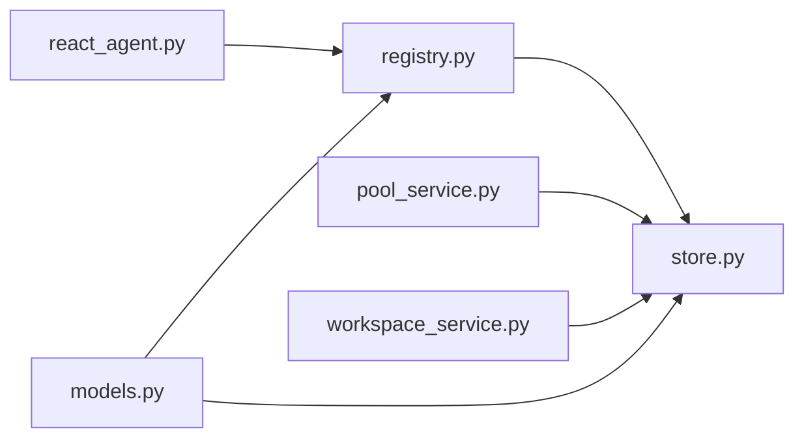

# 技能规范与结构

<cite>
**本文引用的文件**   
- [src/qwenpaw/agents/skill_system/__init__.py](file://src/qwenpaw/agents/skill_system/__init__.py)
- [src/qwenpaw/agents/skill_system/models.py](file://src/qwenpaw/agents/skill_system/models.py)
- [src/qwenpaw/agents/skill_system/registry.py](file://src/qwenpaw/agents/skill_system/registry.py)
- [src/qwenpaw/agents/skill_system/store.py](file://src/qwenpaw/agents/skill_system/store.py)
- [src/qwenpaw/agents/skill_system/pool_service.py](file://src/qwenpaw/agents/skill_system/pool_service.py)
- [src/qwenpaw/agents/skill_system/workspace_service.py](file://src/qwenpaw/agents/skill_system/workspace_service.py)
- [src/qwenpaw/agents/react_agent.py](file://src/qwenpaw/agents/react_agent.py)
- [plugins/tool/gpt-image2/plugin.json](file://plugins/tool/gpt-image2/plugin.json)
- [plugins/tool/gpt-image2/gpt_image2_tool.py](file://plugins/tool/gpt-image2/gpt_image2_tool.py)
- [website/public/docs/skills.zh.md](file://website/public/docs/skills.zh.md)
- [tests/integration/test_skills_agent_scoped.py](file://tests/integration/test_skills_agent_scoped.py)
</cite>

## 目录
1. [简介](#简介)
2. [项目结构](#项目结构)
3. [核心组件](#核心组件)
4. [架构总览](#架构总览)
5. [详细组件分析](#详细组件分析)
6. [依赖关系分析](#依赖关系分析)
7. [性能考量](#性能考量)
8. [故障排查指南](#故障排查指南)
9. [结论](#结论)
10. [附录](#附录)

## 简介
本文件系统化阐述 QwenPaw 的“技能（Skill）”规范与结构，覆盖技能目录组织、SKILL.md 语法与元数据定义、配置注入与优先级、脚本与资源管理、版本兼容与内置语言选择、以及与其他组件的集成方式。文档同时给出实际代码路径示例，帮助初学者快速上手，并为有经验的开发者提供足够的实现细节与调用关系说明。

## 项目结构
QwenPaw 的技能系统由“共享技能池”和“工作区本地副本”两层构成：
- 共享技能池：位于 WORKING_DIR/skill_pool，集中管理可复用的技能，支持导入内置、ZIP/URL 安装、市场同步等。
- 工作区技能副本：位于 WORKING_DIR/workspaces/{agent_id}/skills，是 Agent 运行时真正加载的本地副本，受工作区清单 skill.json 控制启用状态、频道路由与配置。

图示来源
- [src/qwenpaw/agents/skill_system/store.py:58-134](file://src/qwenpaw/agents/skill_system/store.py#L58-L134)
- [website/public/docs/skills.zh.md:19-47](file://website/public/docs/skills.zh.md#L19-L47)

章节来源
- [website/public/docs/skills.zh.md:19-154](file://website/public/docs/skills.zh.md#L19-L154)
- [src/qwenpaw/agents/skill_system/store.py:58-134](file://src/qwenpaw/agents/skill_system/store.py#L58-L134)

## 核心组件
- 模型与常量：定义 SkillInfo、BuiltinSkillIdentity、BuiltinSkillVariant、ALL_SKILL_ROUTING_CHANNELS 等。
- 注册表与解析：负责内置技能发现、语言偏好、环境覆盖、有效技能解析。
- 存储与清单：读写 skill_pool 与工作区 manifest，原子写入、跨进程锁、冲突检测、安全扫描。
- 服务层：
  - SkillPoolService：共享池生命周期（创建、导入 ZIP/URL、编辑、重命名、自动更新、广播到工作区）。
  - SkillService：工作区技能生命周期（创建、保存、启用/禁用、频道路由、标签、删除、文件读取）。
- 运行期集成：react_agent 将有效技能目录注册到 toolkit，供后续工具链使用。

章节来源
- [src/qwenpaw/agents/skill_system/models.py:29-81](file://src/qwenpaw/agents/skill_system/models.py#L29-L81)
- [src/qwenpaw/agents/skill_system/registry.py:1-120](file://src/qwenpaw/agents/skill_system/registry.py#L1-L120)
- [src/qwenpaw/agents/skill_system/store.py:316-395](file://src/qwenpaw/agents/skill_system/store.py#L316-L395)
- [src/qwenpaw/agents/skill_system/pool_service.py:121-145](file://src/qwenpaw/agents/skill_system/pool_service.py#L121-L145)
- [src/qwenpaw/agents/skill_system/workspace_service.py:88-106](file://src/qwenpaw/agents/skill_system/workspace_service.py#L88-L106)
- [src/qwenpaw/agents/react_agent.py:350-365](file://src/qwenpaw/agents/react_agent.py#L350-L365)

## 架构总览
下图展示从“用户操作/控制台/CLI”到“服务层→存储层→文件系统”的调用链路，以及运行期如何把有效技能注入到工具集。

图示来源
- [src/qwenpaw/agents/skill_system/pool_service.py:121-145](file://src/qwenpaw/agents/skill_system/pool_service.py#L121-L145)
- [src/qwenpaw/agents/skill_system/workspace_service.py:88-106](file://src/qwenpaw/agents/skill_system/workspace_service.py#L88-L106)
- [src/qwenpaw/agents/skill_system/store.py:316-395](file://src/qwenpaw/agents/skill_system/store.py#L316-L395)
- [src/qwenpaw/agents/react_agent.py:350-365](file://src/qwenpaw/agents/react_agent.py#L350-L365)

## 详细组件分析

### SKILL.md 语法与元数据
- 必填字段：name、description（YAML front matter）。
- 可选字段：metadata.requires（支持 openclaw/qwenpaw/clawdbot 命名空间），包含 bins/env；也支持 metadata.version/builtin_skill_version 等。
- 版本提取顺序：post.version → metadata.version → metadata.builtin_skill_version。
- 要求透传：require_bins、require_envs 会被写入 manifest 的 requirements 中，便于 UI 提示与校验，但不会自动禁用技能。

章节来源
- [website/public/docs/skills.zh.md:264-289](file://website/public/docs/skills.zh.md#L264-L289)
- [src/qwenpaw/agents/skill_system/store.py:267-278](file://src/qwenpaw/agents/skill_system/store.py#L267-L278)
- [src/qwenpaw/agents/skill_system/store.py:594-633](file://src/qwenpaw/agents/skill_system/store.py#L594-L633)

### 配置注入与优先级
- 当 SKILL.md 声明 metadata.requires.env 时，工作区或池条目 config 中与这些 key 匹配的项会注入为同名环境变量。
- 始终存在完整 JSON 变量：QWENPAW_SKILL_CONFIG_<SKILL_NAME>。
- 优先级（高优先覆盖低优先）：宿主环境变量 > 工作区配置 > 池配置。
- requires 解析顺序：metadata.openclaw.requires → metadata.qwenpaw.requires → metadata.requires。

章节来源
- [src/qwenpaw/agents/skill_system/registry.py:264-305](file://src/qwenpaw/agents/skill_system/registry.py#L264-L305)
- [src/qwenpaw/agents/skill_system/registry.py:347-392](file://src/qwenpaw/agents/skill_system/registry.py#L347-L392)
- [website/public/docs/skills.zh.md:408-464](file://website/public/docs/skills.zh.md#L408-L464)

### 脚本引用与资源管理
- 通过 extra_files 打包 scripts/references 等资源，在 materialize_skill 时写入 skill 目录对应位置。
- run_tool_batch 的 file_path 必须为绝对路径，正文需指引 future agent 用当前 SKILL.md 所在目录拼接。
- 支持 ${args.<name>} 参数化与 ${steps.<index>.<path>} 步骤间引用，materialize_skill 会分析并返回需要验证的引用关系。

章节来源
- [src/qwenpaw/agents/skills/make-skill-zh/SKILL.md:484-514](file://src/qwenpaw/agents/skills/make-skill-zh/SKILL.md#L484-L514)
- [src/qwenpaw/agents/skills/make-skill-zh/SKILL.md:515-578](file://src/qwenpaw/agents/skills/make-skill-zh/SKILL.md#L515-L578)

### 版本兼容与内置语言选择
- 内置技能按 name-language 目录名识别，如 pdf-en/pdf-zh。
- 语言偏好来自 settings.json 的 builtin_skill_language 或 UI language，默认 en。
- 导入内置时若存在冲突或语言不一致，会返回 conflicts 供确认；支持 overwrite_conflicts 强制覆盖。

章节来源
- [src/qwenpaw/agents/skill_system/registry.py:50-117](file://src/qwenpaw/agents/skill_system/registry.py#L50-L117)
- [src/qwenpaw/agents/skill_system/registry.py:198-214](file://src/qwenpaw/agents/skill_system/registry.py#L198-L214)
- [src/qwenpaw/agents/skill_system/registry.py:662-733](file://src/qwenpaw/agents/skill_system/registry.py#L662-L733)

### 工作区与池的清单与原子写入
- 清单格式：schema_version、version、skills 字典。
- 原子写入：临时文件 + replace，配合跨进程锁（fcntl/msvcrt）保证并发安全。
- 冲突建议：suggest_conflict_name 基于时间戳后缀避免重复。

章节来源
- [src/qwenpaw/agents/skill_system/store.py:402-416](file://src/qwenpaw/agents/skill_system/store.py#L402-L416)
- [src/qwenpaw/agents/skill_system/store.py:316-395](file://src/qwenpaw/agents/skill_system/store.py#L316-L395)
- [src/qwenpaw/agents/skill_system/store.py:671-692](file://src/qwenpaw/agents/skill_system/store.py#L671-L692)

### 运行期集成：有效技能解析与注册
- resolve_effective_skills 合并池与工作区清单，按频道路由过滤得到 effective_skills。
- react_agent 遍历有效技能，将其目录注册到 toolkit._qp_skills，供后续工具访问。

章节来源
- [src/qwenpaw/agents/skill_system/registry.py:1-120](file://src/qwenpaw/agents/skill_system/registry.py#L1-L120)
- [src/qwenpaw/agents/react_agent.py:350-365](file://src/qwenpaw/agents/react_agent.py#L350-L365)

### 插件示例：gpt-image2 工具
- plugin.json 描述工具元信息、依赖、qwenpaw 版本范围、工具配置字段。
- gpt_image2_tool.py 实现两个工具函数：generate_image_gpt、edit_image_gpt，均通过 get_tool_config 读取 api_key/endpoint/timeout，调用 OpenAI GPT Image 2 接口，结果以 DataBlock 形式返回。

图示来源
- [plugins/tool/gpt-image2/plugin.json:1-96](file://plugins/tool/gpt-image2/plugin.json#L1-L96)
- [plugins/tool/gpt-image2/gpt_image2_tool.py:22-256](file://plugins/tool/gpt-image2/gpt_image2_tool.py#L22-L256)
- [plugins/tool/gpt-image2/gpt_image2_tool.py:259-554](file://plugins/tool/gpt-image2/gpt_image2_tool.py#L259-L554)

章节来源
- [plugins/tool/gpt-image2/plugin.json:1-96](file://plugins/tool/gpt-image2/plugin.json#L1-L96)
- [plugins/tool/gpt-image2/gpt_image2_tool.py:22-256](file://plugins/tool/gpt-image2/gpt_image2_tool.py#L22-L256)
- [plugins/tool/gpt-image2/gpt_image2_tool.py:259-554](file://plugins/tool/gpt-image2/gpt_image2_tool.py#L259-L554)

### 工作区 API 行为（集成测试参考）
- 通过 /api/agents/{id}/skills 进行工作区技能的创建、列举、批量删除等操作。
- 构造 zip 时每个技能一个目录，内含 SKILL.md。

章节来源
- [tests/integration/test_skills_agent_scoped.py:1-393](file://tests/integration/test_skills_agent_scoped.py#L1-L393)

## 依赖关系分析
- 服务层依赖 store 提供的清单读写、目录复制、安全扫描、冲突建议等能力。
- registry 负责内置技能发现、语言偏好、环境覆盖与有效技能解析。
- react_agent 消费 registry 的结果，完成运行期注册。
- pool_service 与 workspace_service 分别面向共享池与工作区的 CRUD 与同步。

图示来源
- [src/qwenpaw/agents/skill_system/registry.py:1-120](file://src/qwenpaw/agents/skill_system/registry.py#L1-L120)
- [src/qwenpaw/agents/skill_system/store.py:316-395](file://src/qwenpaw/agents/skill_system/store.py#L316-L395)
- [src/qwenpaw/agents/skill_system/pool_service.py:121-145](file://src/qwenpaw/agents/skill_system/pool_service.py#L121-L145)
- [src/qwenpaw/agents/skill_system/workspace_service.py:88-106](file://src/qwenpaw/agents/skill_system/workspace_service.py#L88-L106)
- [src/qwenpaw/agents/react_agent.py:350-365](file://src/qwenpaw/agents/react_agent.py#L350-L365)
- [src/qwenpaw/agents/skill_system/models.py:29-81](file://src/qwenpaw/agents/skill_system/models.py#L29-L81)

## 性能考量
- 清单缓存：read_skill_manifest/read_skill_pool_manifest 基于 mtime 缓存，减少频繁 IO。
- 原子写入与锁：write_json_atomic + _file_write_lock 保障并发安全，避免竞态。
- 内置语言缓存：get_builtin_skill_language_preference 与 _builtin_cache 降低设置读取开销。
- ZIP 限制：最大解压大小与条目数限制，防止恶意包导致资源耗尽。

章节来源
- [src/qwenpaw/agents/skill_system/store.py:751-776](file://src/qwenpaw/agents/skill_system/store.py#L751-L776)
- [src/qwenpaw/agents/skill_system/store.py:316-395](file://src/qwenpaw/agents/skill_system/store.py#L316-L395)
- [src/qwenpaw/agents/skill_system/registry.py:80-117](file://src/qwenpaw/agents/skill_system/registry.py#L80-L117)
- [src/qwenpaw/agents/skill_system/store.py:482-503](file://src/qwenpaw/agents/skill_system/store.py#L482-L503)

## 故障排查指南
- 清单损坏：JSON 解码失败会回退到默认清单并记录警告，下次写入修复。
- 安全扫描拒绝：新增/保存技能时会执行安全扫描，被标记的模式需移除后重试。
- 配置缺失：requires.env 未提供会在构建环境覆盖时发出警告日志。
- 冲突处理：导入/保存时出现同名冲突，建议使用 suggest_conflict_name 生成的新名称。
- 运行期未生效：检查 resolve_effective_skills 是否包含目标技能，确认 enabled/channels 配置。

章节来源
- [src/qwenpaw/agents/skill_system/store.py:344-356](file://src/qwenpaw/agents/skill_system/store.py#L344-L356)
- [src/qwenpaw/agents/skill_system/registry.py:292-300](file://src/qwenpaw/agents/skill_system/registry.py#L292-L300)
- [src/qwenpaw/agents/skill_system/store.py:671-692](file://src/qwenpaw/agents/skill_system/store.py#L671-L692)
- [src/qwenpaw/agents/react_agent.py:350-365](file://src/qwenpaw/agents/react_agent.py#L350-L365)

## 结论
QwenPaw 的技能体系以“共享池 + 工作区副本”的双层结构为核心，结合 SKILL.md front matter 的元数据驱动、严格的清单管理与原子写入、以及运行期的有效技能解析与环境注入，实现了灵活、安全且可维护的技能生态。通过 make-skill 工作流与批处理脚本机制，开发者可以快速沉淀高质量、可复用的自动化流程。

## 附录

### SKILL.md 关键元数据速查
- name/description：必填。
- metadata.requires：支持 openclaw/qwenpaw/clawdbot 命名空间，含 bins/env。
- metadata.version/builtin_skill_version：用于版本显示与比较。
- 配置注入：匹配 requires.env 的键注入为环境变量；完整 JSON 变量 QWENPAW_SKILL_CONFIG_<NAME> 始终可用。

章节来源
- [website/public/docs/skills.zh.md:264-289](file://website/public/docs/skills.zh.md#L264-L289)
- [src/qwenpaw/agents/skill_system/store.py:594-633](file://src/qwenpaw/agents/skill_system/store.py#L594-L633)
- [src/qwenpaw/agents/skill_system/registry.py:264-305](file://src/qwenpaw/agents/skill_system/registry.py#L264-L305)