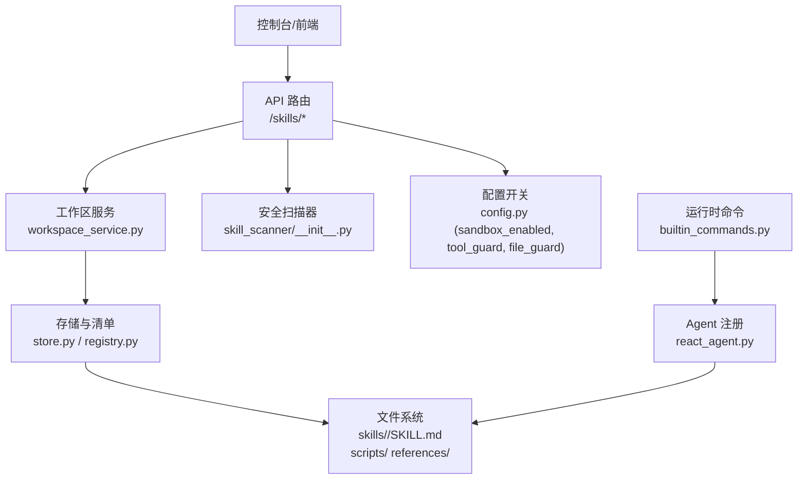
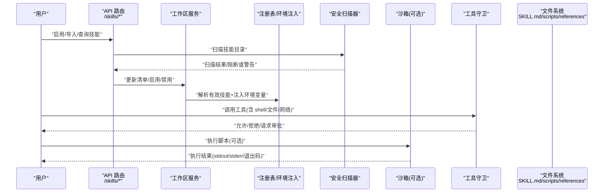
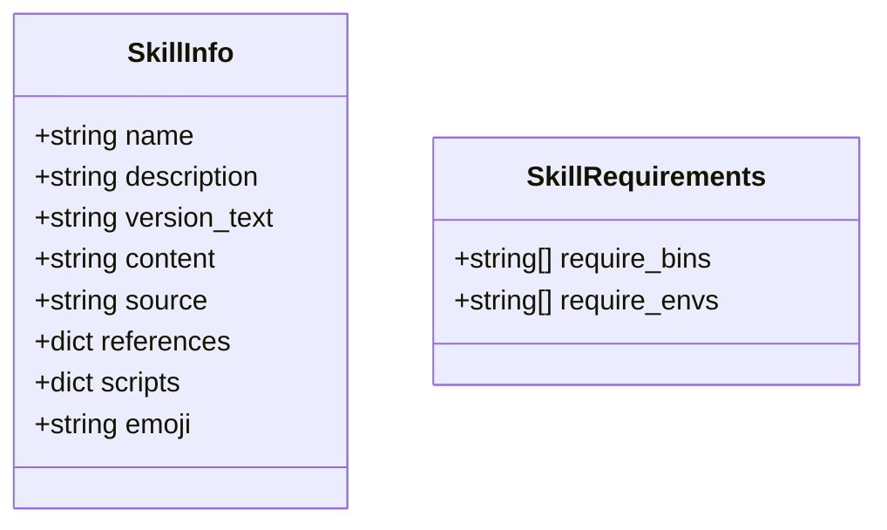
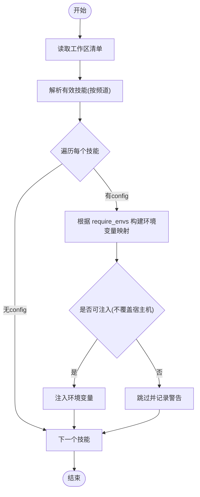
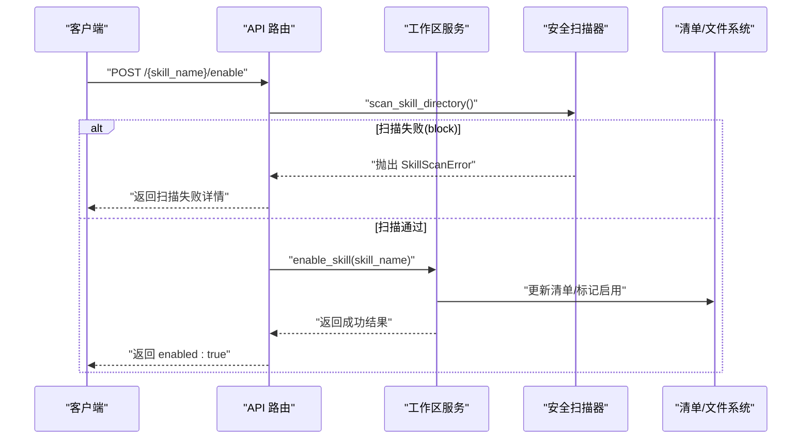
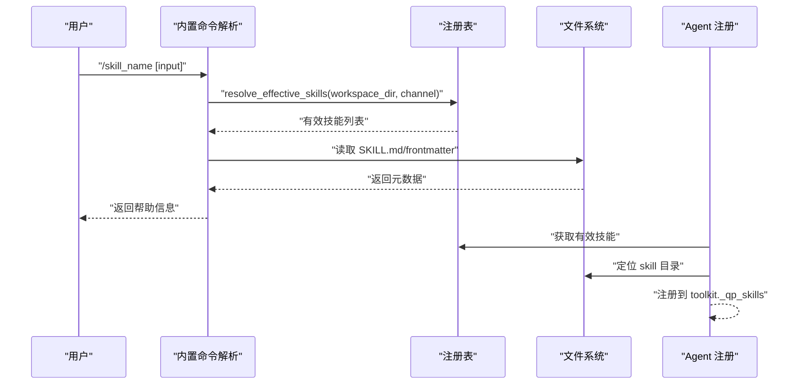
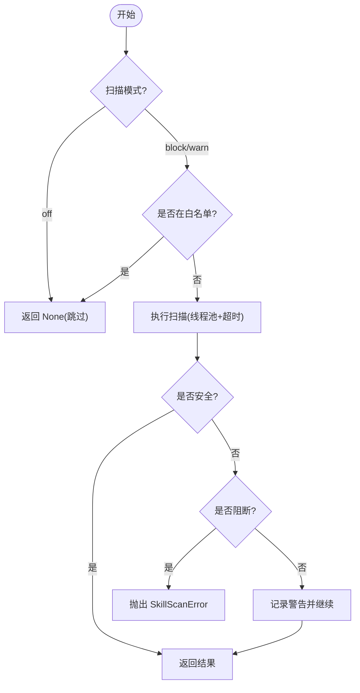
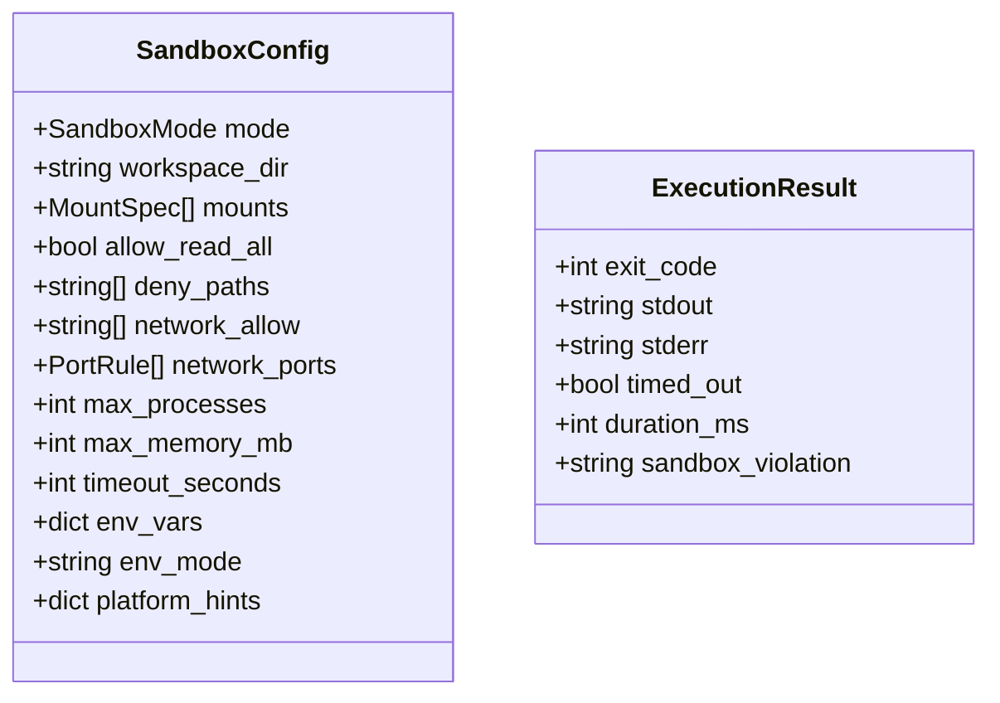
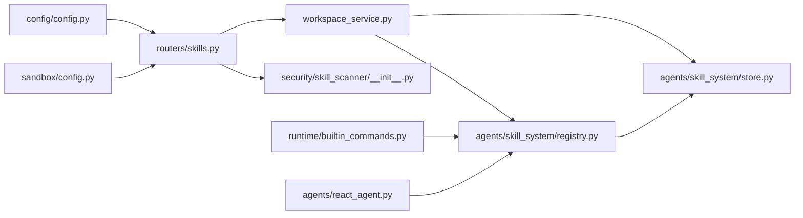

# 脚本文件规范

<cite>
**本文引用的文件**
- [src/qwenpaw/agents/skill_system/models.py](file://src/qwenpaw/agents/skill_system/models.py)
- [src/qwenpaw/agents/skill_system/registry.py](file://src/qwenpaw/agents/skill_system/registry.py)
- [src/qwenpaw/agents/skill_system/store.py](file://src/qwenpaw/agents/skill_system/store.py)
- [src/qwenpaw/agents/skill_system/workspace_service.py](file://src/qwenpaw/agents/skill_system/workspace_service.py)
- [src/qwenpaw/agents/react_agent.py](file://src/qwenpaw/agents/react_agent.py)
- [src/qwenpaw/runtime/builtin_commands.py](file://src/qwenpaw/runtime/builtin_commands.py)
- [src/qwenpaw/app/routers/skills.py](file://src/qwenpaw/app/routers/skills.py)
- [src/qwenpaw/security/skill_scanner/__init__.py](file://src/qwenpaw/security/skill_scanner/__init__.py)
- [src/qwenpaw/sandbox/config.py](file://src/qwenpaw/sandbox/config.py)
- [src/qwenpaw/config/config.py](file://src/qwenpaw/config/config.py)
- [website/public/docs/skills.zh.md](file://website/public/docs/skills.zh.md)
- [website/public/docs/security.en.md](file://website/public/docs/security.en.md)
- [src/qwenpaw/agents/skills/make-skill-zh/SKILL.md](file://src/qwenpaw/agents/skills/make-skill-zh/SKILL.md)
- [src/qwenpaw/agents/skills/file_reader-zh/SKILL.md](file://src/qwenpaw/agents/skills/file_reader-zh/SKILL.md)
- [src/qwenpaw/agents/skills/docx-zh/SKILL.md](file://src/qwenpaw/agents/skills/docx-zh/SKILL.md)
</cite>

## 目录
1. [简介](#简介)
2. [项目结构](#项目结构)
3. [核心组件](#核心组件)
4. [架构总览](#架构总览)
5. [详细组件分析](#详细组件分析)
6. [依赖关系分析](#依赖关系分析)
7. [性能与资源限制](#性能与资源限制)
8. [故障排查指南](#故障排查指南)
9. [结论](#结论)
10. [附录：示例与最佳实践](#附录示例与最佳实践)

## 简介
本规范面向 QwenPaw 技能（Skill）脚本文件的编写、集成与运行，覆盖以下关键主题：
- 支持的脚本类型与执行环境：Python、Shell、Node.js 等通过工具链在沙箱或宿主环境中执行。
- 安全与沙箱机制：工具守卫、文件守卫、技能扫描器、平台级沙箱（bubblewrap/Landlock/Seatbelt/AppContainer）。
- 接口定义与参数传递：SKILL.md frontmatter、环境变量注入、完整配置 JSON 注入、references/scripts 目录约定。
- 返回值格式与错误处理模式：统一异常、扫描结果、启用/禁用流程的响应结构。
- 与工具守卫系统、权限控制系统的集成：策略评估、访问控制、审批流。
- 常见问题与解决方案：权限拒绝、超时、内存限制、网络隔离现状等。
- 调试技巧、性能优化与最佳实践：批处理（run_tool_batch）、引用校验、最小化交互、可观测性。

## 项目结构
QwenPaw 的技能体系围绕“工作区 + 池 + 内置”三层组织，运行时按频道解析生效技能，并通过注册表与环境注入将配置暴露给脚本。

图表来源
- [src/qwenpaw/app/routers/skills.py:26-75](file://src/qwenpaw/app/routers/skills.py#L26-L75)
- [src/qwenpaw/agents/skill_system/workspace_service.py:1-552](file://src/qwenpaw/agents/skill_system/workspace_service.py#L1-L552)
- [src/qwenpaw/agents/skill_system/store.py:829-850](file://src/qwenpaw/agents/skill_system/store.py#L829-L850)
- [src/qwenpaw/agents/skill_system/registry.py:1-800](file://src/qwenpaw/agents/skill_system/registry.py#L1-L800)
- [src/qwenpaw/security/skill_scanner/__init__.py:397-487](file://src/qwenpaw/security/skill_scanner/__init__.py#L397-L487)
- [src/qwenpaw/config/config.py:2073-2106](file://src/qwenpaw/config/config.py#L2073-L2106)
- [src/qwenpaw/runtime/builtin_commands.py:493-598](file://src/qwenpaw/runtime/builtin_commands.py#L493-L598)
- [src/qwenpaw/agents/react_agent.py:350-377](file://src/qwenpaw/agents/react_agent.py#L350-L377)

章节来源
- [src/qwenpaw/app/routers/skills.py:26-75](file://src/qwenpaw/app/routers/skills.py#L26-L75)
- [src/qwenpaw/agents/skill_system/workspace_service.py:1-552](file://src/qwenpaw/agents/skill_system/workspace_service.py#L1-L552)
- [src/qwenpaw/agents/skill_system/store.py:829-850](file://src/qwenpaw/agents/skill_system/store.py#L829-L850)
- [src/qwenpaw/agents/skill_system/registry.py:1-800](file://src/qwenpaw/agents/skill_system/registry.py#L1-L800)
- [src/qwenpaw/security/skill_scanner/__init__.py:397-487](file://src/qwenpaw/security/skill_scanner/__init__.py#L397-L487)
- [src/qwenpaw/config/config.py:2073-2106](file://src/qwenpaw/config/config.py#L2073-L2106)
- [src/qwenpaw/runtime/builtin_commands.py:493-598](file://src/qwenpaw/runtime/builtin_commands.py#L493-L598)
- [src/qwenpaw/agents/react_agent.py:350-377](file://src/qwenpaw/agents/react_agent.py#L350-L377)

## 核心组件
- 模型与元数据
  - SkillInfo：描述技能的名称、版本、内容、source、references、scripts、emoji 等。
  - SkillRequirements：声明 require_bins、require_envs 等系统需求。
- 注册表与环境注入
  - 解析有效技能列表（按频道），构建并注入环境变量（匹配 requires.env），并提供完整配置 JSON 变量。
- 工作区服务
  - 提供导入、启用/禁用、批量操作、冲突检测、清单同步等能力。
- 安全扫描器
  - 基于规则的模式扫描，支持 block/warn/off 模式、白名单、超时、历史记录。
- 沙箱配置与探测
  - 跨平台能力探测（bubblewrap/Landlock/Seatbelt/AppContainer），默认 deny-list 模型，网络与资源限制字段存在但部分未强制。
- 运行时入口
  - 内置命令解析 /skill_name，从工作区直接解析 SKILL.md 并返回帮助信息；Agent 启动时注册工作区技能。

章节来源
- [src/qwenpaw/agents/skill_system/models.py:1-81](file://src/qwenpaw/agents/skill_system/models.py#L1-L81)
- [src/qwenpaw/agents/skill_system/registry.py:244-392](file://src/qwenpaw/agents/skill_system/registry.py#L244-L392)
- [src/qwenpaw/agents/skill_system/workspace_service.py:512-552](file://src/qwenpaw/agents/skill_system/workspace_service.py#L512-L552)
- [src/qwenpaw/security/skill_scanner/__init__.py:84-116](file://src/qwenpaw/security/skill_scanner/__init__.py#L84-L116)
- [src/qwenpaw/sandbox/config.py:40-130](file://src/qwenpaw/sandbox/config.py#L40-L130)
- [src/qwenpaw/runtime/builtin_commands.py:493-598](file://src/qwenpaw/runtime/builtin_commands.py#L493-L598)
- [src/qwenpaw/agents/react_agent.py:350-377](file://src/qwenpaw/agents/react_agent.py#L350-L377)

## 架构总览
下图展示了从用户触发到脚本执行的端到端路径，包括安全扫描、沙箱执行、环境变量注入与工具守卫。

图表来源
- [src/qwenpaw/app/routers/skills.py:1470-1534](file://src/qwenpaw/app/routers/skills.py#L1470-L1534)
- [src/qwenpaw/security/skill_scanner/__init__.py:397-487](file://src/qwenpaw/security/skill_scanner/__init__.py#L397-L487)
- [src/qwenpaw/agents/skill_system/registry.py:348-392](file://src/qwenpaw/agents/skill_system/registry.py#L348-L392)
- [src/qwenpaw/sandbox/config.py:424-460](file://src/qwenpaw/sandbox/config.py#L424-L460)
- [website/public/docs/security.en.md:33-723](file://website/public/docs/security.en.md#L33-L723)

## 详细组件分析

### 技能模型与清单
- SkillInfo 包含 name/description/version_text/content/source/references/scripts/emoji 等字段，作为对外返回的统一结构。
- SkillRequirements 用于声明 require_bins 与 require_envs，驱动环境变量注入与依赖检查。
- 清单与目录树：references/ 与 scripts/ 目录会被扫描并纳入 SkillInfo，便于后续加载与验证。

图表来源
- [src/qwenpaw/agents/skill_system/models.py:47-81](file://src/qwenpaw/agents/skill_system/models.py#L47-L81)
- [src/qwenpaw/agents/skill_system/store.py:829-850](file://src/qwenpaw/agents/skill_system/store.py#L829-L850)

章节来源
- [src/qwenpaw/agents/skill_system/models.py:1-81](file://src/qwenpaw/agents/skill_system/models.py#L1-L81)
- [src/qwenpaw/agents/skill_system/store.py:829-850](file://src/qwenpaw/agents/skill_system/store.py#L829-L850)

### 注册表与环境变量注入
- 按频道解析有效技能列表，读取工作区 manifest 中每个技能的 config。
- 将 config 中与 metadata.requires.env 匹配的键注入为环境变量；同时注入完整配置的 JSON 字符串变量 QWENPAW_SKILL_CONFIG_<SKILL_NAME>。
- 对缺失必需 env 的记录警告日志；已存在的宿主机同名环境变量不会被覆盖。

图表来源
- [src/qwenpaw/agents/skill_system/registry.py:244-392](file://src/qwenpaw/agents/skill_system/registry.py#L244-L392)
- [website/public/docs/skills.zh.md:388-464](file://website/public/docs/skills.zh.md#L388-L464)

章节来源
- [src/qwenpaw/agents/skill_system/registry.py:244-392](file://src/qwenpaw/agents/skill_system/registry.py#L244-L392)
- [website/public/docs/skills.zh.md:388-464](file://website/public/docs/skills.zh.md#L388-L464)

### 工作区服务与 API 路由
- 工作区服务负责导入、启用/禁用、批量操作、冲突检测、清单同步等。
- API 路由提供 /skills/* 端点，支持创建、列出、启用/禁用、批量删除等，并在启用前进行安全扫描。

图表来源
- [src/qwenpaw/app/routers/skills.py:1514-1534](file://src/qwenpaw/app/routers/skills.py#L1514-L1534)
- [src/qwenpaw/security/skill_scanner/__init__.py:397-487](file://src/qwenpaw/security/skill_scanner/__init__.py#L397-L487)
- [src/qwenpaw/agents/skill_system/workspace_service.py:512-552](file://src/qwenpaw/agents/skill_system/workspace_service.py#L512-L552)

章节来源
- [src/qwenpaw/app/routers/skills.py:1470-1534](file://src/qwenpaw/app/routers/skills.py#L1470-L1534)
- [src/qwenpaw/agents/skill_system/workspace_service.py:512-552](file://src/qwenpaw/agents/skill_system/workspace_service.py#L512-L552)

### 运行时入口与 Agent 注册
- 内置命令解析 /skill_name，直接从工作区 skills 目录查找 SKILL.md，返回帮助信息（名称、描述、路径等）。
- Agent 启动时将工作区中的有效技能注册到 toolkit，供后续调用。

图表来源
- [src/qwenpaw/runtime/builtin_commands.py:493-598](file://src/qwenpaw/runtime/builtin_commands.py#L493-L598)
- [src/qwenpaw/agents/react_agent.py:350-377](file://src/qwenpaw/agents/react_agent.py#L350-L377)

章节来源
- [src/qwenpaw/runtime/builtin_commands.py:493-598](file://src/qwenpaw/runtime/builtin_commands.py#L493-L598)
- [src/qwenpaw/agents/react_agent.py:350-377](file://src/qwenpaw/agents/react_agent.py#L350-L377)

### 安全扫描器与工作区文件访问限制
- 扫描器支持 block/warn/off 模式，具备白名单、超时、历史记录持久化。
- 工作区服务在加载脚本/参考文件时进行路径规范化与相对路径校验，仅允许 references/ 与 scripts/ 子目录下的文件，防止越权访问。

图表来源
- [src/qwenpaw/security/skill_scanner/__init__.py:84-116](file://src/qwenpaw/security/skill_scanner/__init__.py#L84-L116)
- [src/qwenpaw/security/skill_scanner/__init__.py:397-487](file://src/qwenpaw/security/skill_scanner/__init__.py#L397-L487)
- [src/qwenpaw/agents/skill_system/workspace_service.py:751-781](file://src/qwenpaw/agents/skill_system/workspace_service.py#L751-L781)

章节来源
- [src/qwenpaw/security/skill_scanner/__init__.py:397-487](file://src/qwenpaw/security/skill_scanner/__init__.py#L397-L487)
- [src/qwenpaw/agents/skill_system/workspace_service.py:751-781](file://src/qwenpaw/agents/skill_system/workspace_service.py#L751-L781)

### 沙箱与执行环境
- 平台能力探测：Linux 优先 bubblewrap，其次 Landlock；macOS 使用 Seatbelt；Windows 使用 AppContainer；不支持则回退 none。
- 约束模型：deny-default 白名单，敏感路径 deny_paths，只读/可写 mounts，网络 allow 列表（当前未实现网络隔离），资源限制字段存在但未强制。
- 全局开关 sandbox_enabled 控制无匹配规则的 shell 工具是否进入沙箱。

图表来源
- [src/qwenpaw/sandbox/config.py:80-141](file://src/qwenpaw/sandbox/config.py#L80-L141)
- [src/qwenpaw/sandbox/config.py:424-460](file://src/qwenpaw/sandbox/config.py#L424-L460)
- [src/qwenpaw/config/config.py:2073-2106](file://src/qwenpaw/config/config.py#L2073-L2106)
- [website/public/docs/security.en.md:397-456](file://website/public/docs/security.en.md#L397-L456)

章节来源
- [src/qwenpaw/sandbox/config.py:40-130](file://src/qwenpaw/sandbox/config.py#L40-L130)
- [src/qwenpaw/sandbox/config.py:424-460](file://src/qwenpaw/sandbox/config.py#L424-L460)
- [src/qwenpaw/config/config.py:2073-2106](file://src/qwenpaw/config/config.py#L2073-L2106)
- [website/public/docs/security.en.md:397-456](file://website/public/docs/security.en.md#L397-L456)

### 工具守卫与权限控制
- 工具守卫在工具调用前进行参数扫描，检测危险模式（命令注入、路径穿越、提权、反向 Shell 等），支持内置规则与自定义规则。
- 访问策略可对每次能力调用进行 allow/deny/ask 决策，支持客户端级别与工具级别粒度，以及来源与身份感知。

章节来源
- [website/public/docs/security.en.md:33-723](file://website/public/docs/security.en.md#L33-L723)
- [website/public/docs/security.en.md:190-253](file://website/public/docs/security.en.md#L190-L253)

## 依赖关系分析
- 路由层依赖工作区服务与安全扫描器，工作区服务依赖存储与注册表。
- 注册表依赖清单读写与文件处理工具，负责环境变量注入。
- 运行时命令解析依赖注册表与工作区目录，Agent 启动时注册工作区技能。
- 沙箱配置与探测独立于业务逻辑，由上层决定是否启用。

图表来源
- [src/qwenpaw/app/routers/skills.py:26-75](file://src/qwenpaw/app/routers/skills.py#L26-L75)
- [src/qwenpaw/agents/skill_system/workspace_service.py:1-552](file://src/qwenpaw/agents/skill_system/workspace_service.py#L1-L552)
- [src/qwenpaw/agents/skill_system/store.py:829-850](file://src/qwenpaw/agents/skill_system/store.py#L829-L850)
- [src/qwenpaw/agents/skill_system/registry.py:1-800](file://src/qwenpaw/agents/skill_system/registry.py#L1-L800)
- [src/qwenpaw/runtime/builtin_commands.py:493-598](file://src/qwenpaw/runtime/builtin_commands.py#L493-L598)
- [src/qwenpaw/agents/react_agent.py:350-377](file://src/qwenpaw/agents/react_agent.py#L350-L377)
- [src/qwenpaw/config/config.py:2073-2106](file://src/qwenpaw/config/config.py#L2073-L2106)
- [src/qwenpaw/sandbox/config.py:424-460](file://src/qwenpaw/sandbox/config.py#L424-L460)

章节来源
- [src/qwenpaw/app/routers/skills.py:26-75](file://src/qwenpaw/app/routers/skills.py#L26-L75)
- [src/qwenpaw/agents/skill_system/workspace_service.py:1-552](file://src/qwenpaw/agents/skill_system/workspace_service.py#L1-L552)
- [src/qwenpaw/agents/skill_system/store.py:829-850](file://src/qwenpaw/agents/skill_system/store.py#L829-L850)
- [src/qwenpaw/agents/skill_system/registry.py:1-800](file://src/qwenpaw/agents/skill_system/registry.py#L1-L800)
- [src/qwenpaw/runtime/builtin_commands.py:493-598](file://src/qwenpaw/runtime/builtin_commands.py#L493-L598)
- [src/qwenpaw/agents/react_agent.py:350-377](file://src/qwenpaw/agents/react_agent.py#L350-L377)
- [src/qwenpaw/config/config.py:2073-2106](file://src/qwenpaw/config/config.py#L2073-L2106)
- [src/qwenpaw/sandbox/config.py:424-460](file://src/qwenpaw/sandbox/config.py#L424-L460)

## 性能与资源限制
- 扫描缓存：基于 mtime 的扫描结果缓存，避免重复扫描。
- 并发与超时：扫描器使用线程池与超时保护，防止长时间阻塞。
- 资源限制字段：max_processes、max_memory_mb 存在于沙箱配置，但当前未强制实施。
- 网络隔离：当前未实现网络命名空间隔离，所有沙箱进程具有全量网络访问。

章节来源
- [src/qwenpaw/security/skill_scanner/__init__.py:337-390](file://src/qwenpaw/security/skill_scanner/__init__.py#L337-L390)
- [src/qwenpaw/security/skill_scanner/__init__.py:445-468](file://src/qwenpaw/security/skill_scanner/__init__.py#L445-L468)
- [website/public/docs/security.en.md:449-456](file://website/public/docs/security.en.md#L449-L456)

## 故障排查指南
- 权限拒绝
  - 沙箱 deny_paths 导致文件或目录不可见/拒绝访问；确认 mounts 与 allow_read_all 设置。
  - 工作区文件访问限制：仅允许 references/ 与 scripts/ 下相对路径，需修正路径。
- 超时处理
  - 扫描器超时：调整 scan_timeout 或优化规则集；必要时将技能加入白名单。
  - 沙箱执行超时：配置 timeout_seconds，确保脚本及时返回。
- 内存与进程限制
  - 当前未强制实施，需在外部容器或系统层面进行限制。
- 网络问题
  - 当前未实现网络隔离，如需限制应通过代理或防火墙策略配合。

章节来源
- [src/qwenpaw/agents/skill_system/workspace_service.py:751-781](file://src/qwenpaw/agents/skill_system/workspace_service.py#L751-L781)
- [src/qwenpaw/security/skill_scanner/__init__.py:445-468](file://src/qwenpaw/security/skill_scanner/__init__.py#L445-L468)
- [website/public/docs/security.en.md:449-456](file://website/public/docs/security.en.md#L449-L456)

## 结论
QwenPaw 的技能脚本体系以 SKILL.md 为核心，结合工作区清单、注册表与环境注入，提供了灵活的脚本编排能力。安全方面通过工具守卫、文件守卫、技能扫描器与平台沙箱形成多层防护。尽管网络隔离与资源限制尚未完全落地，现有机制已能保障大多数场景的安全与稳定。建议开发者遵循批处理优先、最小权限、显式参数化的最佳实践，并结合可观测性与调试手段提升可靠性。

## 附录：示例与最佳实践
- 脚本类型支持
  - Python：通过 execute_shell_command 调用 python3 解释器执行 .py 脚本。
  - Shell：通过 execute_shell_command 执行 .sh 脚本。
  - Node.js：通过 npm 安装依赖后执行 node 脚本。
  - 其他语言：只要宿主或沙箱中存在对应解释器即可执行。
- 环境变量注入
  - 在 SKILL.md frontmatter 的 metadata.requires.env 中声明所需环境变量名。
  - 运行时会将匹配的配置项注入为环境变量，并始终注入完整配置的 JSON 变量 QWENPAW_SKILL_CONFIG_<SKILL_NAME>。
- 文件访问限制
  - 仅允许读取 references/ 与 scripts/ 下的相对路径文件，禁止路径穿越与绝对路径。
- 网络请求控制
  - 当前未实现网络隔离，建议在外部网络层进行控制。
- 批处理与引用校验
  - 使用 run_tool_batch 将多步工具调用串联成 JSON 文件，减少交互次数。
  - materialize_skill 会分析 ${steps.<index>.<path>} 引用，需逐条验证被引用工具的返回值字段。
- 调试技巧
  - 先小范围试跑 batch，逐步扩大自动化范围。
  - 利用内置命令 /skill_name 快速查看技能元数据与路径。
  - 关注扫描器历史与告警，及时调整规则或白名单。
- 最佳实践
  - 明确参数说明与示例值，避免空 args。
  - 将复杂逻辑下沉到独立脚本，保持 SKILL.md 简洁。
  - 使用最小权限原则，合理配置沙箱 mounts 与 deny_paths。

章节来源
- [src/qwenpaw/agents/skills/make-skill-zh/SKILL.md:207-426](file://src/qwenpaw/agents/skills/make-skill-zh/SKILL.md#L207-L426)
- [src/qwenpaw/agents/skills/file_reader-zh/SKILL.md:1-59](file://src/qwenpaw/agents/skills/file_reader-zh/SKILL.md#L1-L59)
- [src/qwenpaw/agents/skills/docx-zh/SKILL.md:1-488](file://src/qwenpaw/agents/skills/docx-zh/SKILL.md#L1-L488)
- [website/public/docs/skills.zh.md:388-464](file://website/public/docs/skills.zh.md#L388-L464)
- [src/qwenpaw/agents/skill_system/workspace_service.py:751-781](file://src/qwenpaw/agents/skill_system/workspace_service.py#L751-L781)