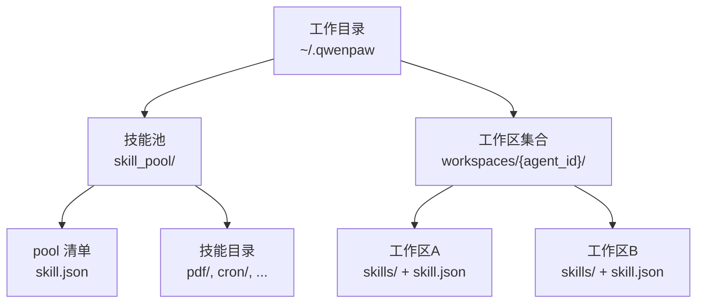
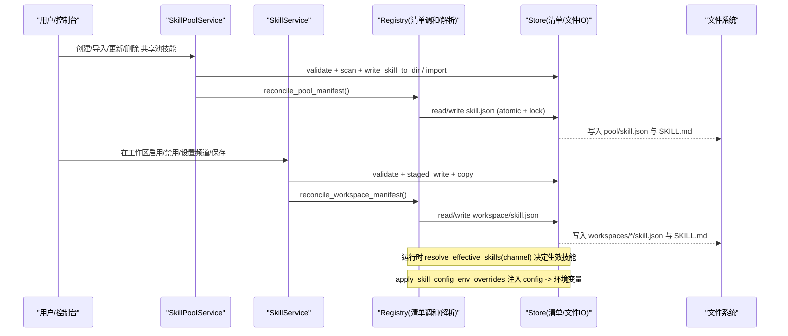
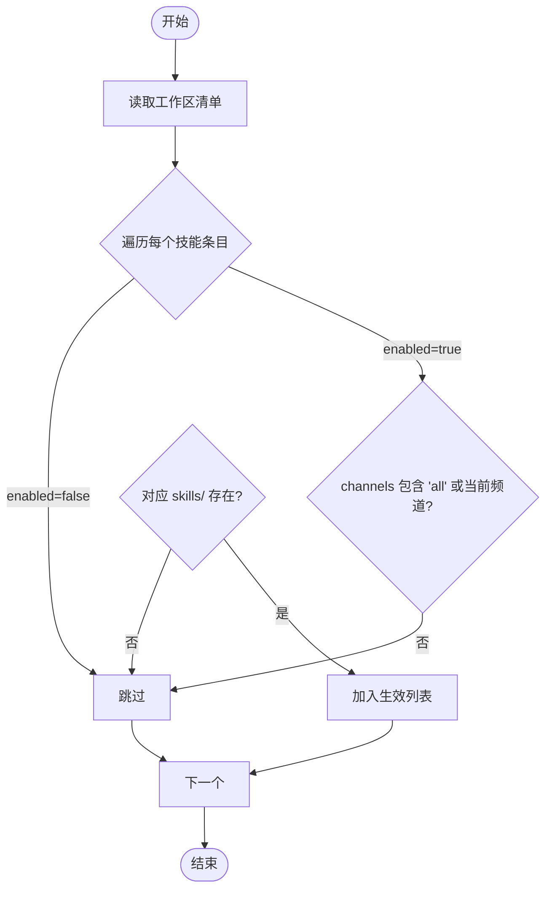
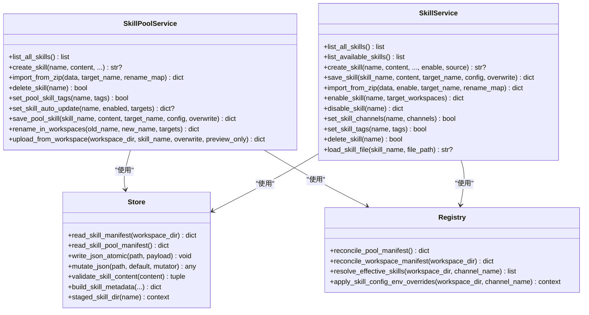

# 自定义技能开发

<cite>
**本文引用的文件**   
- [src/qwenpaw/agents/skill_system/__init__.py](file://src/qwenpaw/agents/skill_system/__init__.py)
- [src/qwenpaw/agents/skill_system/models.py](file://src/qwenpaw/agents/skill_system/models.py)
- [src/qwenpaw/agents/skill_system/store.py](file://src/qwenpaw/agents/skill_system/store.py)
- [src/qwenpaw/agents/skill_system/registry.py](file://src/qwenpaw/agents/skill_system/registry.py)
- [src/qwenpaw/agents/skill_system/pool_service.py](file://src/qwenpaw/agents/skill_system/pool_service.py)
- [src/qwenpaw/agents/skill_system/workspace_service.py](file://src/qwenpaw/agents/skill_system/workspace_service.py)
- [website/public/docs/skills.zh.md](file://website/public/docs/skills.zh.md)
</cite>

## 目录
1. [简介](#简介)
2. [项目结构](#项目结构)
3. [核心组件](#核心组件)
4. [架构总览](#架构总览)
5. [详细组件分析](#详细组件分析)
6. [依赖关系分析](#依赖关系分析)
7. [性能与并发特性](#性能与并发特性)
8. [常见问题与排障](#常见问题与排障)
9. [结论](#结论)
10. [附录：清单格式与示例路径](#附录清单格式与示例路径)

## 简介
本指南面向希望为 QwenPaw 编写“自定义技能”的开发者，系统阐述技能规范、文件结构、元数据定义、运行时注入、清单（manifest）格式、脚本与资源管理、调试技巧以及与系统其他组件的关系。内容既适合初学者快速上手，也为有经验的开发者提供足够的实现细节与调用关系说明。

## 项目结构
QwenPaw 的技能体系由两层构成：
- 共享技能池：位于工作目录下的 skill_pool，用于跨工作区复用与版本管理。
- 工作区技能副本：每个工作区的 skills 目录是 Agent 实际加载的本地副本。

图表来源
- [src/qwenpaw/agents/skill_system/store.py:58-134](file://src/qwenpaw/agents/skill_system/store.py#L58-L134)
- [website/public/docs/skills.zh.md:19-47](file://website/public/docs/skills.zh.md#L19-L47)

章节来源
- [website/public/docs/skills.zh.md:19-47](file://website/public/docs/skills.zh.md#L19-L47)
- [src/qwenpaw/agents/skill_system/store.py:58-134](file://src/qwenpaw/agents/skill_system/store.py#L58-L134)

## 核心组件
- 模型与常量：SkillInfo、SkillRequirements、内置语言偏好等
- 存储与清单：读写 skill.json、SKILL.md front matter、安全校验、原子写入、锁
- 注册与解析：内置技能发现、语言选择、清单调和、运行时有效技能解析、环境变量注入
- 服务层：
  - SkillPoolService：共享池生命周期（创建、导入、删除、标签、自动同步、重命名迁移等）
  - SkillService：工作区技能生命周期（创建、导入、启用/禁用、频道路由、配置持久化、读取文件等）

章节来源
- [src/qwenpaw/agents/skill_system/models.py:47-81](file://src/qwenpaw/agents/skill_system/models.py#L47-L81)
- [src/qwenpaw/agents/skill_system/store.py:397-466](file://src/qwenpaw/agents/skill_system/store.py#L397-L466)
- [src/qwenpaw/agents/skill_system/registry.py:1186-1207](file://src/qwenpaw/agents/skill_system/registry.py#L1186-L1207)
- [src/qwenpaw/agents/skill_system/pool_service.py:121-145](file://src/qwenpaw/agents/skill_system/pool_service.py#L121-L145)
- [src/qwenpaw/agents/skill_system/workspace_service.py:88-105](file://src/qwenpaw/agents/skill_system/workspace_service.py#L88-L105)

## 架构总览
下图展示了从用户操作到文件系统与清单变更的关键流程，以及运行时环境变量的注入点。

图表来源
- [src/qwenpaw/agents/skill_system/pool_service.py:162-236](file://src/qwenpaw/agents/skill_system/pool_service.py#L162-L236)
- [src/qwenpaw/agents/skill_system/workspace_service.py:145-227](file://src/qwenpaw/agents/skill_system/workspace_service.py#L145-L227)
- [src/qwenpaw/agents/skill_system/registry.py:968-1033](file://src/qwenpaw/agents/skill_system/registry.py#L968-L1033)
- [src/qwenpaw/agents/skill_system/registry.py:1036-1143](file://src/qwenpaw/agents/skill_system/registry.py#L1036-L1143)
- [src/qwenpaw/agents/skill_system/registry.py:1186-1207](file://src/qwenpaw/agents/skill_system/registry.py#L1186-L1207)
- [src/qwenpaw/agents/skill_system/registry.py:347-392](file://src/qwenpaw/agents/skill_system/registry.py#L347-L392)
- [src/qwenpaw/agents/skill_system/store.py:359-395](file://src/qwenpaw/agents/skill_system/store.py#L359-L395)

## 详细组件分析

### 模型与数据结构
- SkillInfo：对外返回的技能详情（名称、描述、版本文本、完整内容、来源、references/scripts树、emoji）。
- SkillRequirements：声明的外部依赖（二进制与环境变量名），用于提示与校验。
- 内置语言偏好与变体：支持 en/zh 多语言内置技能，按用户界面语言或显式设置选择。

章节来源
- [src/qwenpaw/agents/skill_system/models.py:47-81](file://src/qwenpaw/agents/skill_system/models.py#L47-L81)
- [src/qwenpaw/agents/skill_system/registry.py:67-117](file://src/qwenpaw/agents/skill_system/registry.py#L67-L117)

### 清单与文件系统（store）
- 清单默认结构：
  - 池清单：schema_version、version、skills、builtin_skill_names
  - 工作区清单：schema_version、version、skills
- 关键能力：
  - 安全校验：zip 大小限制、路径穿越防护、禁止符号链接
  - 原子写入与跨进程锁：避免并发写损坏
  - 元数据构建：从 SKILL.md front matter 提取 name/description/version_text/requirements
  - 冲突建议：基于时间戳的重命名建议
  - 目录树扫描：references/scripts 目录结构展示
  - 内容验证：front matter 必填字段与类型检查

章节来源
- [src/qwenpaw/agents/skill_system/store.py:402-417](file://src/qwenpaw/agents/skill_system/store.py#L402-L417)
- [src/qwenpaw/agents/skill_system/store.py:482-503](file://src/qwenpaw/agents/skill_system/store.py#L482-L503)
- [src/qwenpaw/agents/skill_system/store.py:359-395](file://src/qwenpaw/agents/skill_system/store.py#L359-L395)
- [src/qwenpaw/agents/skill_system/store.py:636-661](file://src/qwenpaw/agents/skill_system/store.py#L636-L661)
- [src/qwenpaw/agents/skill_system/store.py:671-692](file://src/qwenpaw/agents/skill_system/store.py#L671-L692)
- [src/qwenpaw/agents/skill_system/store.py:807-851](file://src/qwenpaw/agents/skill_system/store.py#L807-L851)
- [src/qwenpaw/agents/skill_system/store.py:853-875](file://src/qwenpaw/agents/skill_system/store.py#L853-L875)

### 注册与运行时解析（registry）
- 内置技能发现与语言选择：根据打包目录名匹配语言变体，优先使用 UI 语言或显式设置。
- 清单调和：
  - 池清单调和：扫描所有池根（主池+外部只读根），重建 entries，保留用户配置与标签。
  - 工作区清单调和：扫描工作区 skills 目录，合并 enabled/channels/config/tags 等状态。
- 运行时解析：
  - resolve_effective_skills(workspace_dir, channel_name)：按 enabled 与 channels 过滤出当前频道生效的技能。
  - apply_skill_config_env_overrides：将匹配的 config 键注入为环境变量，并始终注入完整 JSON 变量。

图表来源
- [src/qwenpaw/agents/skill_system/registry.py:1186-1207](file://src/qwenpaw/agents/skill_system/registry.py#L1186-L1207)

章节来源
- [src/qwenpaw/agents/skill_system/registry.py:968-1033](file://src/qwenpaw/agents/skill_system/registry.py#L968-L1033)
- [src/qwenpaw/agents/skill_system/registry.py:1036-1143](file://src/qwenpaw/agents/skill_system/registry.py#L1036-L1143)
- [src/qwenpaw/agents/skill_system/registry.py:347-392](file://src/qwenpaw/agents/skill_system/registry.py#L347-L392)

### 共享池服务（SkillPoolService）
- 主要职责：
  - 创建/导入/删除共享池技能
  - 设置标签、自动更新开关与目标工作区
  - 编辑/重命名（含跨工作区迁移）
  - 上传工作区技能至池、下载池技能到工作区
- 关键行为：
  - 通过 staged_skill_dir 进行暂存写入，再原子替换，失败时回滚
  - 重命名时自动迁移已开启自动更新的副本到新名称
  - 维护 installed_from、config、tags、auto_update_* 等元信息

章节来源
- [src/qwenpaw/agents/skill_system/pool_service.py:121-145](file://src/qwenpaw/agents/skill_system/pool_service.py#L121-L145)
- [src/qwenpaw/agents/skill_system/pool_service.py:162-236](file://src/qwenpaw/agents/skill_system/pool_service.py#L162-L236)
- [src/qwenpaw/agents/skill_system/pool_service.py:237-352](file://src/qwenpaw/agents/skill_system/pool_service.py#L237-L352)
- [src/qwenpaw/agents/skill_system/pool_service.py:417-459](file://src/qwenpaw/agents/skill_system/pool_service.py#L417-L459)
- [src/qwenpaw/agents/skill_system/pool_service.py:504-682](file://src/qwenpaw/agents/skill_system/pool_service.py#L504-L682)
- [src/qwenpaw/agents/skill_system/pool_service.py:684-789](file://src/qwenpaw/agents/skill_system/pool_service.py#L684-L789)

### 工作区服务（SkillService）
- 主要职责：
  - 创建/导入/删除工作区技能
  - 启用/禁用、设置频道范围、设置标签
  - 保存/重命名（含冲突检测与建议）
  - 读取 references/scripts 中的文件（受路径白名单保护）
- 关键行为：
  - 导入 zip 后执行清单调和，标记 installed_from
  - enable_skill 前会重新扫描以确保当前磁盘内容合法
  - save_skill 支持就地编辑与重命名两种模式

章节来源
- [src/qwenpaw/agents/skill_system/workspace_service.py:88-105](file://src/qwenpaw/agents/skill_system/workspace_service.py#L88-L105)
- [src/qwenpaw/agents/skill_system/workspace_service.py:145-227](file://src/qwenpaw/agents/skill_system/workspace_service.py#L145-L227)
- [src/qwenpaw/agents/skill_system/workspace_service.py:229-284](file://src/qwenpaw/agents/skill_system/workspace_service.py#L229-L284)
- [src/qwenpaw/agents/skill_system/workspace_service.py:444-553](file://src/qwenpaw/agents/skill_system/workspace_service.py#L444-L553)
- [src/qwenpaw/agents/skill_system/workspace_service.py:554-625](file://src/qwenpaw/agents/skill_system/workspace_service.py#L554-L625)
- [src/qwenpaw/agents/skill_system/workspace_service.py:751-782](file://src/qwenpaw/agents/skill_system/workspace_service.py#L751-L782)

### 类图（代码级）

图表来源
- [src/qwenpaw/agents/skill_system/pool_service.py:121-145](file://src/qwenpaw/agents/skill_system/pool_service.py#L121-L145)
- [src/qwenpaw/agents/skill_system/workspace_service.py:88-105](file://src/qwenpaw/agents/skill_system/workspace_service.py#L88-L105)
- [src/qwenpaw/agents/skill_system/store.py:359-395](file://src/qwenpaw/agents/skill_system/store.py#L359-L395)
- [src/qwenpaw/agents/skill_system/registry.py:968-1033](file://src/qwenpaw/agents/skill_system/registry.py#L968-L1033)
- [src/qwenpaw/agents/skill_system/registry.py:1036-1143](file://src/qwenpaw/agents/skill_system/registry.py#L1036-L1143)
- [src/qwenpaw/agents/skill_system/registry.py:1186-1207](file://src/qwenpaw/agents/skill_system/registry.py#L1186-L1207)
- [src/qwenpaw/agents/skill_system/registry.py:347-392](file://src/qwenpaw/agents/skill_system/registry.py#L347-L392)

## 依赖关系分析
- 模块内聚与耦合：
  - store.py 负责底层 IO、清单与校验，被 registry 与两个 service 共同依赖，内聚度高。
  - registry.py 聚焦于清单调和、运行时解析与环境注入，对 store 的依赖清晰。
  - pool_service.py 与 workspace_service.py 作为上层编排，组合 store 与 registry 的能力。
- 外部依赖：
  - frontmatter/yaml 解析 SKILL.md front matter
  - 平台文件锁（fcntl/msvcrt）保障并发安全
  - 安全扫描器（security.skill_scanner）在导入/保存前进行目录扫描

章节来源
- [src/qwenpaw/agents/skill_system/store.py:23-30](file://src/qwenpaw/agents/skill_system/store.py#L23-L30)
- [src/qwenpaw/agents/skill_system/store.py:31-45](file://src/qwenpaw/agents/skill_system/store.py#L31-L45)
- [src/qwenpaw/agents/skill_system/store.py:27](file://src/qwenpaw/agents/skill_system/store.py#L27-L27)

## 性能与并发特性
- 并发安全：
  - 清单写入采用临时文件 + replace 的原子策略，配合跨进程文件锁，避免并发写导致的数据损坏。
- 缓存与优化：
  - 清单读取基于 mtime 的 LRU 缓存，减少重复 I/O。
  - 内置技能语言偏好与注册表内存缓存，降低重复计算。
- 批量导入：
  - zip 导入支持多技能，内部去重与冲突检测，提升导入效率与稳定性。

章节来源
- [src/qwenpaw/agents/skill_system/store.py:359-395](file://src/qwenpaw/agents/skill_system/store.py#L359-L395)
- [src/qwenpaw/agents/skill_system/store.py:751-776](file://src/qwenpaw/agents/skill_system/store.py#L751-L776)
- [src/qwenpaw/agents/skill_system/registry.py:82-117](file://src/qwenpaw/agents/skill_system/registry.py#L82-L117)

## 常见问题与排障
- 导入失败（zip）
  - 可能原因：非 zip 格式、解压后无有效 SKILL.md、路径穿越或符号链接被拒绝、压缩包过大。
  - 排查要点：确认 zip 结构与大小；查看错误消息中是否包含“Unsafe path”“Symlink not allowed”等。
- 清单异常
  - 现象：malformed JSON 会被重置为默认清单；重复或无效条目会被警告并重建。
  - 处理：检查 skill.json 语法；必要时触发一次 reconcile。
- 运行时未生效
  - 现象：技能未出现在某频道下。
  - 排查：确认 enabled 为 true；channels 包含当前频道或 "all"；对应 skills/<name> 目录存在。
- 环境变量未注入
  - 现象：技能无法读取所需环境变量。
  - 排查：确认 metadata.requires.env 声明与 config 中 key 一致；宿主已有同名环境变量不会被覆盖；可通过完整 JSON 变量读取。
- 冲突与重命名
  - 现象：同名技能冲突。
  - 处理：使用建议的新名称；或在保存时选择覆盖（谨慎）。

章节来源
- [src/qwenpaw/agents/skill_system/store.py:482-503](file://src/qwenpaw/agents/skill_system/store.py#L482-L503)
- [src/qwenpaw/agents/skill_system/store.py:344-357](file://src/qwenpaw/agents/skill_system/store.py#L344-L357)
- [src/qwenpaw/agents/skill_system/registry.py:1186-1207](file://src/qwenpaw/agents/skill_system/registry.py#L1186-L1207)
- [src/qwenpaw/agents/skill_system/registry.py:347-392](file://src/qwenpaw/agents/skill_system/registry.py#L347-L392)
- [src/qwenpaw/agents/skill_system/workspace_service.py:229-284](file://src/qwenpaw/agents/skill_system/workspace_service.py#L229-L284)

## 结论
QwenPaw 的技能体系以“共享池 + 工作区副本”的双层设计为核心，结合严格的清单调和与安全校验，提供了稳定、可移植且易于扩展的技能开发与运行体验。通过标准化的 SKILL.md front matter、清晰的清单字段与运行时环境变量注入机制，开发者可以专注于业务逻辑，而无需关心复杂的部署与并发问题。

## 附录：清单格式与示例路径
- 清单字段（节选）
  - schema_version：清单版本标识
  - version：清单版本号
  - skills：技能条目字典，键为技能名
  - builtin_skill_names：内置技能名称列表（仅池清单）
- 技能条目关键字段（节选）
  - enabled：是否启用
  - channels：生效频道列表（默认 ["all"]）
  - source：来源（builtin/customized/agent 等）
  - installed_from：安装来源（zip/url/market 等）
  - config：运行时配置对象（与 requires.env 匹配的环境变量注入）
  - metadata：元数据（description/version_text/updated_at 等）
  - requirements：外部依赖（require_bins/require_envs）
- 参考文档与示例路径
  - 技能结构与创建方式、频道路由、运行时注入、升级迁移等详见官方文档页面。

章节来源
- [website/public/docs/skills.zh.md:19-47](file://website/public/docs/skills.zh.md#L19-L47)
- [website/public/docs/skills.zh.md:372-465](file://website/public/docs/skills.zh.md#L372-L465)
- [website/public/docs/skills.zh.md:468-486](file://website/public/docs/skills.zh.md#L468-L486)
- [src/qwenpaw/agents/skill_system/store.py:402-417](file://src/qwenpaw/agents/skill_system/store.py#L402-L417)
- [src/qwenpaw/agents/skill_system/store.py:636-661](file://src/qwenpaw/agents/skill_system/store.py#L636-L661)