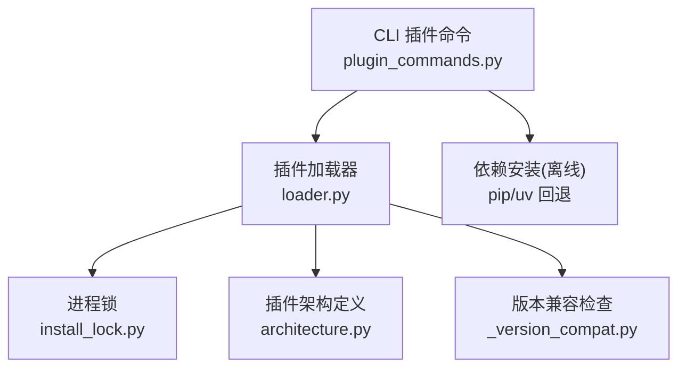
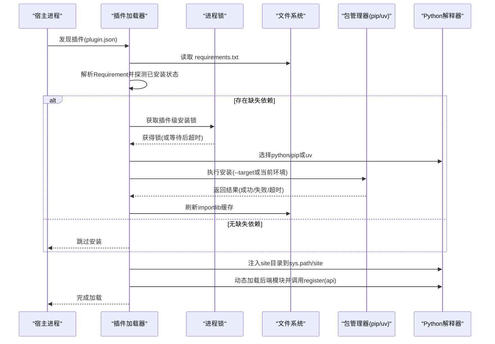
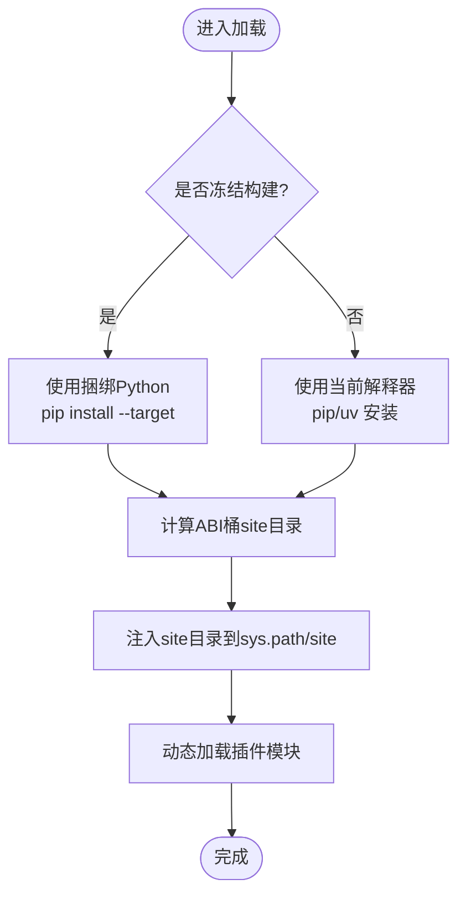
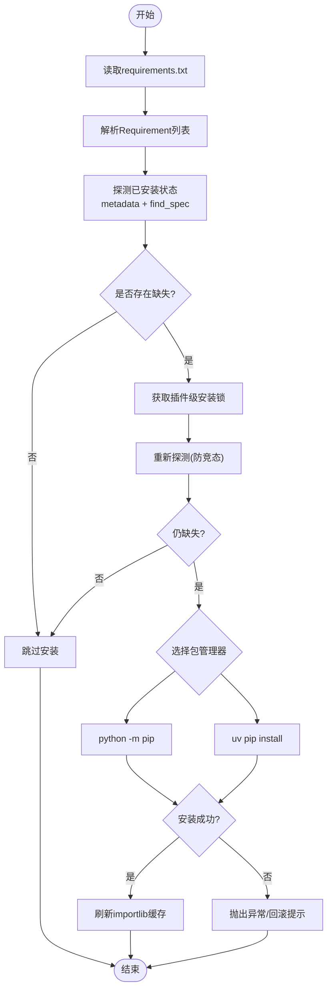
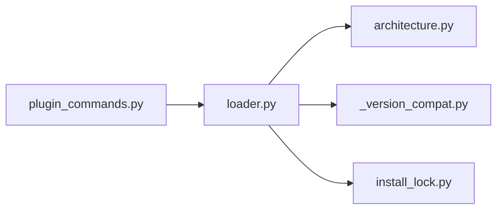

# 依赖管理与隔离

<cite>
**本文引用的文件**   
- [loader.py](file://src/qwenpaw/plugins/loader.py)
- [install_lock.py](file://src/qwenpaw/plugins/install_lock.py)
- [architecture.py](file://src/qwenpaw/plugins/architecture.py)
- [_version_compat.py](file://src/qwenpaw/_version_compat.py)
- [plugin_commands.py](file://src/qwenpaw/cli/plugin_commands.py)
</cite>

## 目录
1. [简介](#简介)
2. [项目结构](#项目结构)
3. [核心组件](#核心组件)
4. [架构总览](#架构总览)
5. [详细组件分析](#详细组件分析)
6. [依赖关系分析](#依赖关系分析)
7. [性能考虑](#性能考虑)
8. [故障排除指南](#故障排除指南)
9. [结论](#结论)
10. [附录](#附录)

## 简介
本章节面向 QwenPaw 插件系统的“依赖管理与隔离”能力，系统性阐述以下主题：
- 运行时环境隔离：Python 环境分离、site-packages 管理、sys.path 动态配置
- 依赖发现与安装：requirements.txt 解析、pip/uv 工具链集成、冻结桌面构建下的特殊处理
- 冲突检测与版本锁定：依赖满足性判定、QwenPaw 版本兼容区间、缓存策略
- 跨平台兼容性：不同操作系统与 CPU 架构的适配
- 错误恢复与重试：超时控制、失败回滚、并发安全
- 插件间依赖共享与隔离：命名空间隔离、卸载清理
- 高级配置与排障：CLI 辅助、日志定位、常见问题诊断

## 项目结构
与依赖管理和隔离直接相关的代码集中在 plugins 子模块与 CLI 命令中：
- 插件加载器负责依赖探测、安装与导入隔离
- 进程级锁保证同一插件依赖安装的串行化
- 架构定义描述插件清单与类型
- 版本兼容检查确保插件与宿主版本匹配
- CLI 提供离线安装与依赖安装（pip/uv）辅助

图表来源
- [loader.py:119-173](file://src/qwenpaw/plugins/loader.py#L119-L173)
- [install_lock.py:82-155](file://src/qwenpaw/plugins/install_lock.py#L82-L155)
- [architecture.py:114-210](file://src/qwenpaw/plugins/architecture.py#L114-L210)
- [_version_compat.py:33-67](file://src/qwenpaw/_version_compat.py#L33-L67)
- [plugin_commands.py:221-306](file://src/qwenpaw/cli/plugin_commands.py#L221-L306)

章节来源
- [loader.py:119-173](file://src/qwenpaw/plugins/loader.py#L119-L173)
- [install_lock.py:82-155](file://src/qwenpaw/plugins/install_lock.py#L82-L155)
- [architecture.py:114-210](file://src/qwenpaw/plugins/architecture.py#L114-L210)
- [_version_compat.py:33-67](file://src/qwenpaw/_version_compat.py#L33-L67)
- [plugin_commands.py:221-306](file://src/qwenpaw/cli/plugin_commands.py#L221-L306)

## 核心组件
- 插件加载器（PluginLoader）
  - 负责插件发现、清单校验、依赖探测与安装、模块动态加载与注册、卸载清理
  - 关键职责：
    - 扫描插件目录并解析 plugin.json
    - 读取 requirements.txt 并判断缺失依赖
    - 在进程锁保护下执行 pip/uv 安装
    - 将插件 site 目录注入 sys.path/site 机制，实现导入隔离
    - 动态加载后端模块并调用 register(api)
    - 卸载时清理 sys.modules、sys.path、注册表与工具导出
- 进程锁（plugin_install_lock）
  - 基于 OS 级别文件锁，按插件 ID 粒度串行化安装，避免并发写入 .dist-info 导致损坏或重复安装风暴
- 插件架构（PluginManifest/PluginRecord）
  - 描述插件元数据、入口点、依赖声明、QwenPaw 版本约束等
- 版本兼容检查（check_plugin_version_compat）
  - 使用左闭右开区间 >=min, <max 判定插件与宿主版本是否兼容
- CLI 插件命令（plugin install/list/info/uninstall）
  - 在线热插拔与离线安装路径；离线路径支持 pip/uv 自动回退安装依赖

章节来源
- [loader.py:119-173](file://src/qwenpaw/plugins/loader.py#L119-L173)
- [loader.py:208-268](file://src/qwenpaw/plugins/loader.py#L208-L268)
- [loader.py:306-334](file://src/qwenpaw/plugins/loader.py#L306-L334)
- [loader.py:721-834](file://src/qwenpaw/plugins/loader.py#L721-L834)
- [loader.py:836-893](file://src/qwenpaw/plugins/loader.py#L836-L893)
- [loader.py:975-1096](file://src/qwenpaw/plugins/loader.py#L975-L1096)
- [install_lock.py:82-155](file://src/qwenpaw/plugins/install_lock.py#L82-L155)
- [architecture.py:114-210](file://src/qwenpaw/plugins/architecture.py#L114-L210)
- [_version_compat.py:33-67](file://src/qwenpaw/_version_compat.py#L33-L67)
- [plugin_commands.py:221-306](file://src/qwenpaw/cli/plugin_commands.py#L221-L306)

## 架构总览
下图展示了插件依赖管理的端到端流程：从发现到安装再到加载与隔离。

图表来源
- [loader.py:132-173](file://src/qwenpaw/plugins/loader.py#L132-L173)
- [loader.py:248-304](file://src/qwenpaw/plugins/loader.py#L248-L304)
- [loader.py:306-334](file://src/qwenpaw/plugins/loader.py#L306-L334)
- [loader.py:721-834](file://src/qwenpaw/plugins/loader.py#L721-L834)
- [loader.py:836-893](file://src/qwenpaw/plugins/loader.py#L836-L893)
- [loader.py:93-117](file://src/qwenpaw/plugins/loader.py#L93-L117)

## 详细组件分析

### 运行时环境隔离机制
- Python 环境分离
  - 非冻结环境：依赖安装到当前解释器的环境中
  - 冻结桌面构建：通过环境变量注入的独立 CPython 运行 pip install --target 到用户可写目录，避免误调后端二进制
- site-packages 管理
  - 为每个 Python 主副版本 + 操作系统 + 架构生成 bucketed site 目录，确保 ABI 隔离
  - 将 site 目录通过 site.addsitedir 和 sys.path.insert 暴露给当前进程及子进程
- sys.path 动态配置
  - 插件加载时将插件源码目录临时加入 sys.path，以便相对导入
  - 卸载时严格移除对应目录，防止命名空间污染

图表来源
- [loader.py:40-66](file://src/qwenpaw/plugins/loader.py#L40-L66)
- [loader.py:93-117](file://src/qwenpaw/plugins/loader.py#L93-L117)
- [loader.py:836-893](file://src/qwenpaw/plugins/loader.py#L836-L893)

章节来源
- [loader.py:40-66](file://src/qwenpaw/plugins/loader.py#L40-L66)
- [loader.py:93-117](file://src/qwenpaw/plugins/loader.py#L93-L117)
- [loader.py:836-893](file://src/qwenpaw/plugins/loader.py#L836-L893)

### 依赖包发现、解析与安装流程
- 依赖发现
  - 扫描插件目录中的 requirements.txt，逐行解析 Requirement
  - 对每条依赖进行满足性检测：优先使用 importlib.metadata 的版本信息，其次用 importlib.util.find_spec 兜底（覆盖冻结构建中缺少 .dist-info 的情况）
- 安装策略
  - 首选 python -m pip install -r requirements.txt
  - 若检测到 pip 不可用，则回退到 uv pip install --python <当前解释器> -r requirements.txt
  - 冻结构建下使用捆绑 Python 执行 pip install --target <ABI桶site目录>
- 并发与幂等
  - 使用 per-plugin 的进程级文件锁，避免多进程并发安装导致 .dist-info 损坏
  - 获取锁后再次探测依赖，若已被其他进程安装则跳过，避免重复安装风暴

图表来源
- [loader.py:248-304](file://src/qwenpaw/plugins/loader.py#L248-L304)
- [loader.py:306-334](file://src/qwenpaw/plugins/loader.py#L306-L334)
- [loader.py:721-834](file://src/qwenpaw/plugins/loader.py#L721-L834)
- [loader.py:836-893](file://src/qwenpaw/plugins/loader.py#L836-L893)

章节来源
- [loader.py:248-304](file://src/qwenpaw/plugins/loader.py#L248-L304)
- [loader.py:306-334](file://src/qwenpaw/plugins/loader.py#L306-L334)
- [loader.py:721-834](file://src/qwenpaw/plugins/loader.py#L721-L834)
- [loader.py:836-893](file://src/qwenpaw/plugins/loader.py#L836-L893)

### 依赖冲突检测、版本锁定与缓存策略
- 冲突检测
  - 通过 Requirement.specifier.contains(installed_version) 精确比对版本范围
  - 当 metadata 不可用时，以 find_spec 作为兜底，避免误报缺失
- 版本锁定
  - 插件清单支持 qwenpaw_version 或 min/max_version 字段，采用左闭右开区间判定兼容性
  - 不兼容的插件会被标记为禁用并记录诊断信息
- 缓存策略
  - 安装完成后调用 importlib.invalidate_caches()，确保后续 import 能感知新安装的包
  - 进程锁内先刷新缓存再二次探测，避免重复安装

章节来源
- [loader.py:208-247](file://src/qwenpaw/plugins/loader.py#L208-L247)
- [loader.py:887-893](file://src/qwenpaw/plugins/loader.py#L887-L893)
- [architecture.py:114-210](file://src/qwenpaw/plugins/architecture.py#L114-L210)
- [_version_compat.py:33-67](file://src/qwenpaw/_version_compat.py#L33-L67)

### 跨平台兼容性处理
- 操作系统与架构适配
  - site 目录按 pyX.Y-{os}-{arch} 分桶，确保二进制包 ABI 正确
  - 冻结构建下通过环境变量注入的独立 Python 解释器路径，避免调用后端二进制
- 进程锁跨平台
  - Windows 使用 msvcrt.locking，类 Unix 使用 fcntl.flock，均具备非阻塞尝试与优雅释放
- CLI 查找 uv
  - 同时搜索 PATH 与常见安装位置（含 Windows 专用路径），提高可用性

章节来源
- [loader.py:58-66](file://src/qwenpaw/plugins/loader.py#L58-L66)
- [loader.py:44-49](file://src/qwenpaw/plugins/loader.py#L44-L49)
- [install_lock.py:36-80](file://src/qwenpaw/plugins/install_lock.py#L36-L80)
- [plugin_commands.py:188-218](file://src/qwenpaw/cli/plugin_commands.py#L188-L218)

### 错误恢复、超时与重试机制
- 超时控制
  - 安装命令统一设置超时（默认 300 秒），超时后终止子进程并抛出异常
- 失败回滚
  - CLI 离线安装失败会清理目标目录，避免半安装残留
  - 插件加载失败时清理 sys.modules、sys.path 与注册表，保证可重试
- 重试建议
  - 当前实现未内置指数退避重试；建议在外部封装层对网络相关错误进行重试（例如下载/索引阶段）

章节来源
- [loader.py:672-719](file://src/qwenpaw/plugins/loader.py#L672-L719)
- [loader.py:721-834](file://src/qwenpaw/plugins/loader.py#L721-L834)
- [plugin_commands.py:221-306](file://src/qwenpaw/cli/plugin_commands.py#L221-L306)
- [loader.py:460-513](file://src/qwenpaw/plugins/loader.py#L460-L513)

### 插件间依赖共享与隔离策略
- 共享
  - 非冻结环境下，所有插件共享宿主环境的 site-packages，便于复用公共依赖
  - 冻结构建下，各 ABI 桶的 site 目录彼此隔离，避免 ABI 冲突
- 隔离
  - 插件模块以 plugin_<id> 命名空间加载，卸载时批量清理该命名空间及其子模块
  - 卸载时同步移除 sys.path 中插件目录，避免后续导入污染
  - 卸载时清理 agents.tools 中由插件导出的工具符号

章节来源
- [loader.py:93-117](file://src/qwenpaw/plugins/loader.py#L93-L117)
- [loader.py:975-1096](file://src/qwenpaw/plugins/loader.py#L975-L1096)
- [loader.py:1098-1146](file://src/qwenpaw/plugins/loader.py#L1098-L1146)

### 高级配置选项与最佳实践
- 冻结构建环境变量
  - QWENPAW_DESKTOP_PY_RUNTIME：指定捆绑 Python 解释器路径，用于 --target 安装
- requirements.txt 编写建议
  - 明确版本范围，避免过于宽泛导致冲突
  - 仅声明必要依赖，减少安装体积与冲突面
- 安装顺序与并发
  - 尽量在同一时间只安装一个插件，避免锁竞争导致的额外等待
- 卸载与重装
  - 使用 force 模式或先卸载再安装，确保干净的 sys.modules 与 sys.path

章节来源
- [loader.py:44-49](file://src/qwenpaw/plugins/loader.py#L44-L49)
- [loader.py:894-973](file://src/qwenpaw/plugins/loader.py#L894-L973)

## 依赖关系分析
- 组件耦合
  - loader.py 强依赖 architecture.py（清单模型）、_version_compat.py（版本兼容）、install_lock.py（并发安全）
  - plugin_commands.py 复用类似的 pip/uv 回退逻辑，但主要用于离线安装场景
- 外部依赖
  - packaging.requirements 用于解析 requirements.txt
  - importlib.metadata / importlib.util 用于依赖满足性探测
  - subprocess 用于调用 pip/uv

图表来源
- [loader.py:1-26](file://src/qwenpaw/plugins/loader.py#L1-L26)
- [plugin_commands.py:1-26](file://src/qwenpaw/cli/plugin_commands.py#L1-L26)

章节来源
- [loader.py:1-26](file://src/qwenpaw/plugins/loader.py#L1-L26)
- [plugin_commands.py:1-26](file://src/qwenpaw/cli/plugin_commands.py#L1-L26)

## 性能考虑
- 避免重复安装
  - 双探针（metadata + find_spec）+ 锁内二次探测，显著降低重复安装概率
- 非阻塞安装
  - 安装过程在后台线程执行，避免阻塞事件循环
- 缓存刷新
  - 安装完成后刷新 importlib 缓存，减少后续导入开销
- 并发限制
  - 通过进程锁串行化同一插件的安装，避免 I/O 争用与内存峰值

[本节为通用指导，无需列出具体文件来源]

## 故障排除指南
- 安装超时
  - 现象：安装命令超过 300 秒被终止
  - 排查：检查网络与镜像源；必要时手动执行安装命令
- pip 不可用且未找到 uv
  - 现象：提示 pip 不可用且找不到 uv
  - 排查：安装 uv 或将 uv 所在目录加入 PATH；或手动执行 pip install -r requirements.txt
- 冻结构建无法安装
  - 现象：提示未找到捆绑 Python 解释器
  - 排查：设置 QWENPAW_DESKTOP_PY_RUNTIME 指向正确的 Python 可执行文件
- 依赖安装成功后仍报错
  - 现象：ImportError 或版本不匹配
  - 排查：确认 ABI 桶 site 目录是否正确注入；重启进程以刷新缓存
- 卸载后仍有残留
  - 现象：再次安装出现旧模块引用
  - 排查：确认卸载流程是否完整清理 sys.modules 与 sys.path；必要时重启进程

章节来源
- [loader.py:672-719](file://src/qwenpaw/plugins/loader.py#L672-L719)
- [loader.py:721-834](file://src/qwenpaw/plugins/loader.py#L721-L834)
- [loader.py:836-893](file://src/qwenpaw/plugins/loader.py#L836-L893)
- [loader.py:975-1096](file://src/qwenpaw/plugins/loader.py#L975-L1096)

## 结论
QwenPaw 的插件依赖管理与隔离体系通过“ABI 桶化的 site 目录 + sys.path 动态注入 + 进程级文件锁 + 双探针满足性检测 + pip/uv 回退”的组合，实现了：
- 安全的依赖安装与幂等性
- 良好的跨平台与冻结构建兼容性
- 清晰的插件命名空间隔离与卸载清理
- 完善的错误恢复与可观测性

对于初学者，建议从 requirements.txt 的最小依赖集入手，逐步完善版本约束；对于资深开发者，可结合 ABI 桶与冻结构建特性，优化大型插件的部署与升级体验。

[本节为总结性内容，无需列出具体文件来源]

## 附录
- 术语
  - ABI：应用二进制接口，决定二进制包的兼容性
  - 冻结构建：将 Python 解释器与应用打包成单一可执行文件的发布形态
  - 进程锁：跨进程的互斥机制，用于协调资源访问

[本节为概念说明，无需列出具体文件来源]