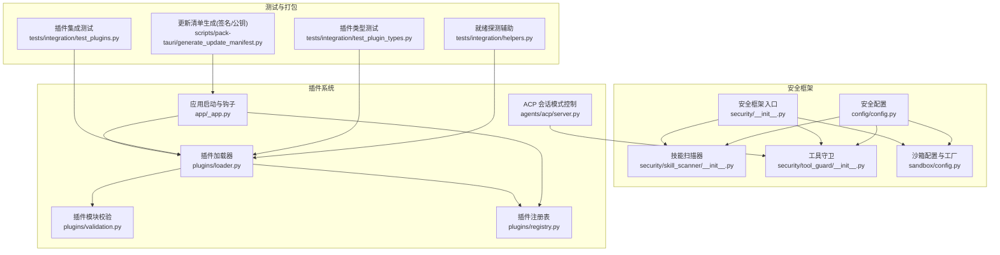
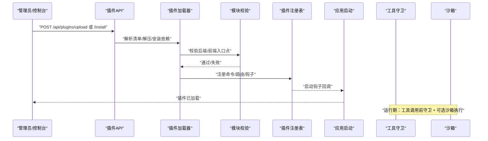
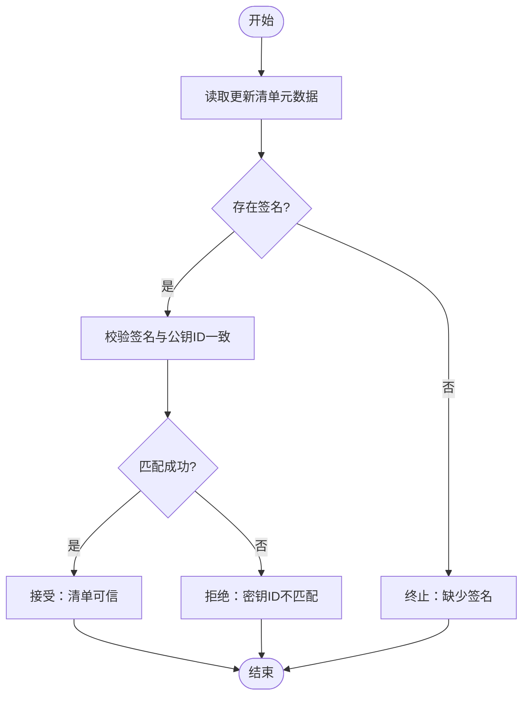
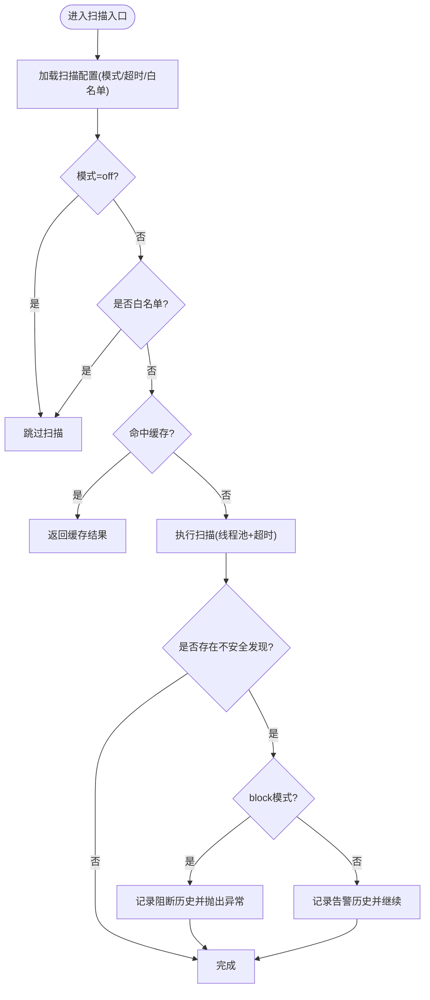
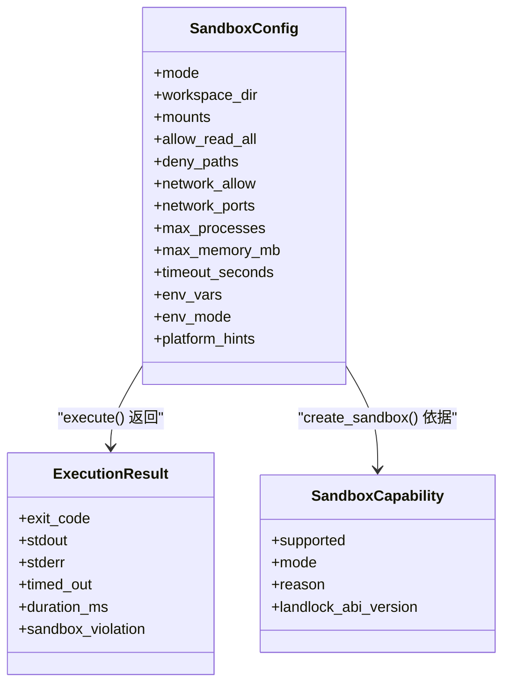
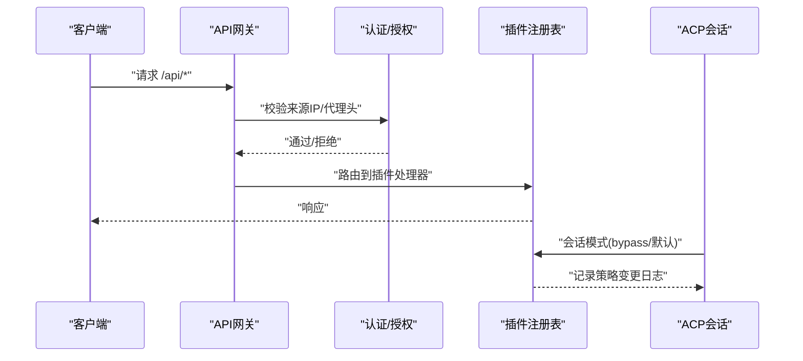
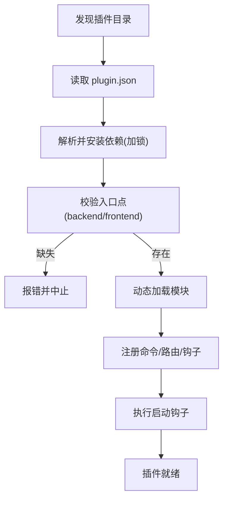
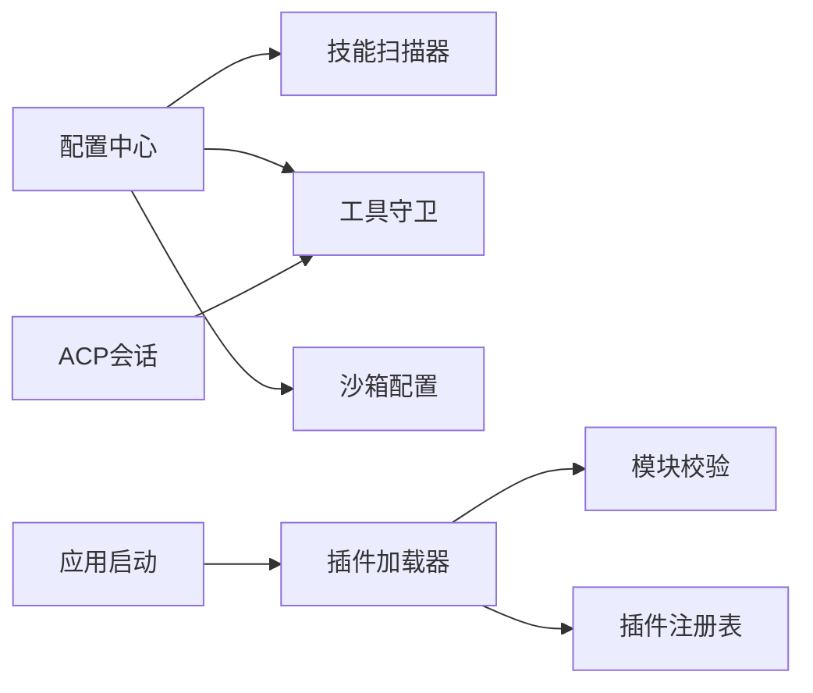

# 安全验证与信任链

<cite>
**本文引用的文件**   
- [README.md](file://README.md)
- [security/__init__.py](file://src/qwenpaw/security/__init__.py)
- [skill_scanner/__init__.py](file://src/qwenpaw/security/skill_scanner/__init__.py)
- [tool_guard/__init__.py](file://src/qwenpaw/security/tool_guard/__init__.py)
- [sandbox/config.py](file://src/qwenpaw/sandbox/config.py)
- [config/config.py](file://src/qwenpaw/config/config.py)
- [plugins/loader.py](file://src/qwenpaw/plugins/loader.py)
- [plugins/validation.py](file://src/qwenpaw/plugins/validation.py)
- [plugins/registry.py](file://src/qwenpaw/plugins/registry.py)
- [app/_app.py](file://src/qwenpaw/app/_app.py)
- [agents/acp/server.py](file://src/qwenpaw/agents/acp/server.py)
- [test_plugins.py](file://tests/integration/test_plugins.py)
- [test_plugin_types.py](file://tests/integration/test_plugin_types.py)
- [helpers.py](file://tests/integration/helpers.py)
- [generate_update_manifest.py](file://scripts/pack-tauri/generate_update_manifest.py)
</cite>

## 目录
1. [简介](#简介)
2. [项目结构](#项目结构)
3. [核心组件](#核心组件)
4. [架构总览](#架构总览)
5. [详细组件分析](#详细组件分析)
6. [依赖关系分析](#依赖关系分析)
7. [性能与安全特性](#性能与安全特性)
8. [故障排查指南](#故障排查指南)
9. [结论](#结论)
10. [附录](#附录)

## 简介
本文件聚焦 QwenPaw 的“插件安全验证与信任链”体系，围绕以下主题展开：
- 插件签名验证机制、数字证书管理与信任链建立过程（桌面端更新与分发）
- 插件代码扫描、恶意行为检测与风险评估流程（技能扫描器、工具调用守卫）
- 沙箱隔离机制、资源限制与执行环境约束
- 权限模型、最小权限原则与细粒度访问控制
- 安全漏洞扫描、威胁检测与告警机制
- 安全审计日志、合规性检查与报告生成
- 企业级安全部署方案（私有仓库、白名单、审批流程）

为便于不同层次读者理解，文档采用由浅入深的结构，并辅以架构图、时序图与流程图。

## 项目结构
QwenPaw 的安全能力以模块化方式组织在多个子系统中：
- 安全框架入口：统一描述各子系统职责与边界
- 技能安全扫描器：安装/激活前对技能进行静态扫描
- 工具调用守卫：在执行前对参数进行规则匹配与风险判定
- 沙箱系统：跨平台执行隔离与资源限制
- 配置中心：集中管理安全策略开关与阈值
- 插件加载与注册：发现、校验、热加载与生命周期管理
- ACP 会话模式：运行时可切换安全策略（如绕过）
- 集成测试：覆盖插件生命周期、类型与就绪探测等关键路径
- 桌面端更新清单生成：签名与公钥校验，构建可信更新链

图表来源
- [security/__init__.py:1-21](file://src/qwenpaw/security/__init__.py#L1-L21)
- [skill_scanner/__init__.py:1-78](file://src/qwenpaw/security/skill_scanner/__init__.py#L1-L78)
- [tool_guard/__init__.py:1-59](file://src/qwenpaw/security/tool_guard/__init__.py#L1-L59)
- [sandbox/config.py:1-130](file://src/qwenpaw/sandbox/config.py#L1-L130)
- [config/config.py:2073-2129](file://src/qwenpaw/config/config.py#L2073-L2129)
- [plugins/loader.py:1-160](file://src/qwenpaw/plugins/loader.py#L1-L160)
- [plugins/validation.py:1-78](file://src/qwenpaw/plugins/validation.py#L1-L78)
- [plugins/registry.py:81-142](file://src/qwenpaw/plugins/registry.py#L81-L142)
- [app/_app.py:587-616](file://src/qwenpaw/app/_app.py#L587-L616)
- [agents/acp/server.py:761-793](file://src/qwenpaw/agents/acp/server.py#L761-L793)
- [test_plugins.py:1-39](file://tests/integration/test_plugins.py#L1-L39)
- [test_plugin_types.py:1-1062](file://tests/integration/test_plugin_types.py#L1-L1062)
- [helpers.py:111-151](file://tests/integration/helpers.py#L111-L151)
- [generate_update_manifest.py:66-172](file://scripts/pack-tauri/generate_update_manifest.py#L66-L172)

章节来源
- [README.md:384-393](file://README.md#L384-L393)

## 核心组件
- 安全框架入口：定义 Tool Guard、Skill Scanner、Secret Store 的职责边界与懒加载策略，确保导入开销接近零。
- 技能安全扫描器：提供白名单、超时、缓存与阻断历史持久化；支持 block/warn/off 三种模式。
- 工具调用守卫：基于规则的预执行检测，返回结构化发现项，供上层策略决定放行或拒绝。
- 沙箱系统：跨平台能力探测与工厂创建，支持 Seatbelt/Bubblewrap/Landlock/AppContainer/None 多种模式，并提供进程/内存/网络/环境变量等约束。
- 配置中心：集中暴露 tool_guard/file_guard/skill_scanner/sandbox_enabled/allow_no_auth_hosts/trusted_proxies 等开关与校验。
- 插件加载与注册：发现、依赖解析、入口点校验、动态加载与启动钩子执行。
- ACP 会话模式：允许在会话级别切换安全策略（例如 bypass），并记录警告日志。
- 集成测试：覆盖插件安装/上传/卸载、类型注册、就绪探测等关键路径。
- 桌面端更新清单生成：包含签名与公钥 ID 校验，用于构建可信更新链。

章节来源
- [security/__init__.py:1-21](file://src/qwenpaw/security/__init__.py#L1-L21)
- [skill_scanner/__init__.py:84-116](file://src/qwenpaw/security/skill_scanner/__init__.py#L84-L116)
- [tool_guard/__init__.py:1-59](file://src/qwenpaw/security/tool_guard/__init__.py#L1-L59)
- [sandbox/config.py:40-130](file://src/qwenpaw/sandbox/config.py#L40-L130)
- [config/config.py:2073-2129](file://src/qwenpaw/config/config.py#L2073-L2129)
- [plugins/loader.py:119-160](file://src/qwenpaw/plugins/loader.py#L119-L160)
- [plugins/validation.py:15-78](file://src/qwenpaw/plugins/validation.py#L15-L78)
- [plugins/registry.py:129-142](file://src/qwenpaw/plugins/registry.py#L129-L142)
- [app/_app.py:587-616](file://src/qwenpaw/app/_app.py#L587-L616)
- [agents/acp/server.py:761-793](file://src/qwenpaw/agents/acp/server.py#L761-L793)
- [test_plugins.py:1-39](file://tests/integration/test_plugins.py#L1-L39)
- [test_plugin_types.py:1-1062](file://tests/integration/test_plugin_types.py#L1-L1062)
- [helpers.py:111-151](file://tests/integration/helpers.py#L111-L151)
- [generate_update_manifest.py:66-172](file://scripts/pack-tauri/generate_update_manifest.py#L66-L172)

## 架构总览
下图展示了从插件安装到运行期防护的整体链路：安装/上传 → 依赖安装 → 入口点校验 → 动态加载 → 注册回调 → 启动钩子 → 运行期工具守卫/技能扫描/沙箱策略生效。

图表来源
- [test_plugins.py:1-39](file://tests/integration/test_plugins.py#L1-L39)
- [test_plugin_types.py:1-1062](file://tests/integration/test_plugin_types.py#L1-L1062)
- [helpers.py:111-151](file://tests/integration/helpers.py#L111-L151)
- [plugins/loader.py:119-160](file://src/qwenpaw/plugins/loader.py#L119-L160)
- [plugins/validation.py:15-78](file://src/qwenpaw/plugins/validation.py#L15-L78)
- [plugins/registry.py:129-142](file://src/qwenpaw/plugins/registry.py#L129-L142)
- [app/_app.py:587-616](file://src/qwenpaw/app/_app.py#L587-L616)

## 详细组件分析

### 插件签名验证与信任链（桌面端更新）
- 目标：确保桌面端更新包与清单的来源可信，防止中间人篡改。
- 关键点：
  - 更新清单中包含 artifact 与 signature 字段，并在生成阶段校验签名与公钥 ID 一致性。
  - 若签名密钥 ID 与配置的公钥不匹配，则拒绝继续生成/使用清单。
- 建议实践：
  - 将公钥纳入企业密钥管理系统，定期轮换。
  - 在 CI 中强制校验签名与公钥 ID，禁止本地手动跳过。

图表来源
- [generate_update_manifest.py:66-172](file://scripts/pack-tauri/generate_update_manifest.py#L66-L172)

章节来源
- [generate_update_manifest.py:66-172](file://scripts/pack-tauri/generate_update_manifest.py#L66-L172)

### 插件代码扫描、恶意行为检测与风险评估
- 技能安全扫描器：
  - 支持 block/warn/off 模式，默认阻塞高危发现。
  - 提供白名单（可按内容哈希精确匹配）、扫描超时、结果缓存与阻断历史持久化。
  - 对外暴露 scan_skill_directory 作为统一入口。
- 工具调用守卫：
  - 在工具执行前对参数进行规则匹配，输出结构化发现项（含严重等级、类别、修复建议）。
  - 可与上层策略联动，实现自动放行、提示人工审批或直接拒绝。

图表来源
- [skill_scanner/__init__.py:84-116](file://src/qwenpaw/security/skill_scanner/__init__.py#L84-L116)
- [skill_scanner/__init__.py:397-487](file://src/qwenpaw/security/skill_scanner/__init__.py#L397-L487)
- [tool_guard/__init__.py:1-59](file://src/qwenpaw/security/tool_guard/__init__.py#L1-L59)

章节来源
- [skill_scanner/__init__.py:84-116](file://src/qwenpaw/security/skill_scanner/__init__.py#L84-L116)
- [skill_scanner/__init__.py:397-487](file://src/qwenpaw/security/skill_scanner/__init__.py#L397-L487)
- [tool_guard/__init__.py:1-59](file://src/qwenpaw/security/tool_guard/__init__.py#L1-L59)

### 沙箱隔离机制、资源限制与执行环境约束
- 能力探测：
  - Linux：优先 bubblewrap，其次 Landlock；macOS：Seatbelt；Windows：AppContainer；不支持时回退至 none。
- 配置要点：
  - 工作区目录、挂载点读写/可执行权限、敏感路径黑名单、网络域名/端口策略、进程数/内存上限、超时与环境变量注入策略。
- 工厂创建：根据 mode 选择具体后端实例。

图表来源
- [sandbox/config.py:80-142](file://src/qwenpaw/sandbox/config.py#L80-L142)
- [sandbox/config.py:424-499](file://src/qwenpaw/sandbox/config.py#L424-L499)

章节来源
- [sandbox/config.py:40-130](file://src/qwenpaw/sandbox/config.py#L40-L130)
- [sandbox/config.py:424-499](file://src/qwenpaw/sandbox/config.py#L424-L499)

### 插件权限模型、最小权限原则与细粒度访问控制
- 插件注册：
  - 支持命令、HTTP 路由、启动钩子等扩展点，均通过注册表统一管理。
- 访问控制：
  - 全局配置 allow_no_auth_hosts 限定无需认证的客户端 IP。
  - trusted_proxies 严格校验反向代理来源，拒绝过于宽泛网段。
- 会话级策略：
  - ACP 会话可在运行时切换模式（如 bypass），但会记录警告日志，便于审计。

图表来源
- [plugins/registry.py:129-142](file://src/qwenpaw/plugins/registry.py#L129-L142)
- [config/config.py:2089-2129](file://src/qwenpaw/config/config.py#L2089-L2129)
- [agents/acp/server.py:761-793](file://src/qwenpaw/agents/acp/server.py#L761-L793)

章节来源
- [plugins/registry.py:129-142](file://src/qwenpaw/plugins/registry.py#L129-L142)
- [config/config.py:2089-2129](file://src/qwenpaw/config/config.py#L2089-L2129)
- [agents/acp/server.py:761-793](file://src/qwenpaw/agents/acp/server.py#L761-L793)

### 插件加载与入口点校验
- 加载流程：
  - 发现插件目录与清单 → 解析依赖 → 安装依赖（并发锁避免重复安装）→ 校验入口点（backend/frontend）→ 动态加载 → 注册回调 → 执行启动钩子。
- 模块校验：
  - 模拟真实加载语义：规范化模块名、注册 sys.modules、设置 __path__、执行后清理临时模块。

图表来源
- [plugins/loader.py:119-160](file://src/qwenpaw/plugins/loader.py#L119-L160)
- [plugins/loader.py:322-354](file://src/qwenpaw/plugins/loader.py#L322-L354)
- [plugins/validation.py:15-78](file://src/qwenpaw/plugins/validation.py#L15-L78)
- [app/_app.py:587-616](file://src/qwenpaw/app/_app.py#L587-L616)

章节来源
- [plugins/loader.py:119-160](file://src/qwenpaw/plugins/loader.py#L119-L160)
- [plugins/loader.py:322-354](file://src/qwenpaw/plugins/loader.py#L322-L354)
- [plugins/validation.py:15-78](file://src/qwenpaw/plugins/validation.py#L15-L78)
- [app/_app.py:587-616](file://src/qwenpaw/app/_app.py#L587-L616)

### 安全策略配置示例与自定义规则
- 工具守卫自定义规则：
  - 可通过配置文件添加规则，指定工具、参数、正则模式、严重等级与修复建议，实现企业内特定威胁的拦截与提示。
- 技能扫描器模式：
  - 通过环境变量或配置文件设置 mode（block/warn/off）、timeout 与 whitelist。
- 沙箱策略：
  - 通过 SandboxConfig 声明 mounts/deny_paths/network_allow/network_ports 等，结合 create_sandbox 工厂启用对应后端。

章节来源
- [website/public/docs/security.en.md:128-163](file://website/public/docs/security.en.md#L128-L163)
- [website/public/docs/security.en.md:690-704](file://website/public/docs/security.en.md#L690-L704)
- [sandbox/config.py:80-130](file://src/qwenpaw/sandbox/config.py#L80-L130)

### 安全漏洞扫描、威胁检测与告警机制
- 技能扫描器：
  - 阻断历史持久化，支持按索引删除与清空，便于审计与复盘。
- 工具守卫：
  - 结构化发现项包含严重等级、威胁类别、定位信息，便于对接告警系统。
- 审计日志：
  - ACP 会话模式切换（如 bypass）会记录警告日志，便于追踪策略变更。

章节来源
- [skill_scanner/__init__.py:176-313](file://src/qwenpaw/security/skill_scanner/__init__.py#L176-L313)
- [tool_guard/__init__.py:1-59](file://src/qwenpaw/security/tool_guard/__init__.py#L1-L59)
- [agents/acp/server.py:761-793](file://src/qwenpaw/agents/acp/server.py#L761-L793)

### 企业级安全部署方案
- 私有仓库与白名单：
  - 技能扫描器支持白名单（可按名称与内容哈希精确匹配），减少误报与提升吞吐。
- 审批流程：
  - 工具守卫与访问策略可配合“ask”效果，要求人工审批后再执行高风险操作。
- 可信更新链：
  - 桌面端更新清单需通过签名与公钥 ID 校验，确保更新源可信。

章节来源
- [skill_scanner/__init__.py:143-170](file://src/qwenpaw/security/skill_scanner/__init__.py#L143-L170)
- [website/public/docs/security.en.md:799-846](file://website/public/docs/security.en.md#L799-L846)
- [generate_update_manifest.py:66-172](file://scripts/pack-tauri/generate_update_manifest.py#L66-L172)

## 依赖关系分析
- 组件耦合：
  - 安全框架入口仅做职责说明与懒加载，降低耦合度。
  - 插件加载器依赖注册表与校验模块，应用启动时执行插件钩子。
  - 沙箱配置独立于具体后端，通过工厂方法解耦。
- 外部依赖：
  - 平台能力探测依赖系统工具（bwrap、icacls、sandbox-exec）与内核特性（Landlock）。
  - 配置中心提供安全开关与校验逻辑，贯穿各子系统。

图表来源
- [config/config.py:2073-2129](file://src/qwenpaw/config/config.py#L2073-L2129)
- [plugins/loader.py:119-160](file://src/qwenpaw/plugins/loader.py#L119-L160)
- [plugins/validation.py:15-78](file://src/qwenpaw/plugins/validation.py#L15-L78)
- [plugins/registry.py:129-142](file://src/qwenpaw/plugins/registry.py#L129-L142)
- [app/_app.py:587-616](file://src/qwenpaw/app/_app.py#L587-L616)
- [agents/acp/server.py:761-793](file://src/qwenpaw/agents/acp/server.py#L761-L793)

章节来源
- [config/config.py:2073-2129](file://src/qwenpaw/config/config.py#L2073-L2129)
- [plugins/loader.py:119-160](file://src/qwenpaw/plugins/loader.py#L119-L160)
- [plugins/validation.py:15-78](file://src/qwenpaw/plugins/validation.py#L15-L78)
- [plugins/registry.py:129-142](file://src/qwenpaw/plugins/registry.py#L129-L142)
- [app/_app.py:587-616](file://src/qwenpaw/app/_app.py#L587-L616)
- [agents/acp/server.py:761-793](file://src/qwenpaw/agents/acp/server.py#L761-L793)

## 性能与安全特性
- 性能优化：
  - 技能扫描器使用线程池与 mtime 缓存，避免重复扫描。
  - 插件依赖安装使用分布式锁，避免并发重复安装。
- 安全加固：
  - trusted_proxies 校验拒绝过宽网段，防止伪造来源。
  - 会话模式切换记录警告日志，便于审计与回溯。

章节来源
- [skill_scanner/__init__.py:337-390](file://src/qwenpaw/security/skill_scanner/__init__.py#L337-L390)
- [plugins/loader.py:322-354](file://src/qwenpaw/plugins/loader.py#L322-L354)
- [config/config.py:2108-2129](file://src/qwenpaw/config/config.py#L2108-L2129)
- [agents/acp/server.py:761-793](file://src/qwenpaw/agents/acp/server.py#L761-L793)

## 故障排查指南
- 插件未就绪：
  - 使用就绪探测接口尝试安装一个无效路径，期望返回 400 且 detail 包含“Path not found”，表明插件加载器已准备就绪。
- 插件类型注册失败：
  - 检查插件清单是否声明 entry.backend/entry.frontend，缺失将导致 400 错误。
- 插件生命周期：
  - 通过 /api/plugins/{id}/status 确认 loaded 与 version；卸载后应不再出现在列表。

章节来源
- [helpers.py:111-151](file://tests/integration/helpers.py#L111-L151)
- [test_plugin_types.py:1039-1062](file://tests/integration/test_plugin_types.py#L1039-L1062)
- [test_plugins.py:429-446](file://tests/integration/test_plugins.py#L429-L446)

## 结论
QwenPaw 的插件安全与信任链体系以“可插拔、可配置、可审计”为核心设计原则：
- 通过签名与公钥校验构建可信更新链；
- 通过技能扫描器与工具守卫实现“事前检测、事中控制、事后审计”；
- 通过沙箱与访问策略落实最小权限与细粒度控制；
- 通过集成测试保障关键路径稳定可靠。

在企业环境中，建议结合私有仓库、白名单与审批流程，形成闭环治理，确保安全与效率并重。

## 附录
- 参考文档：
  - 安全功能概览与快速入门参见 README 中的“Security Features”。

章节来源
- [README.md:384-393](file://README.md#L384-L393)