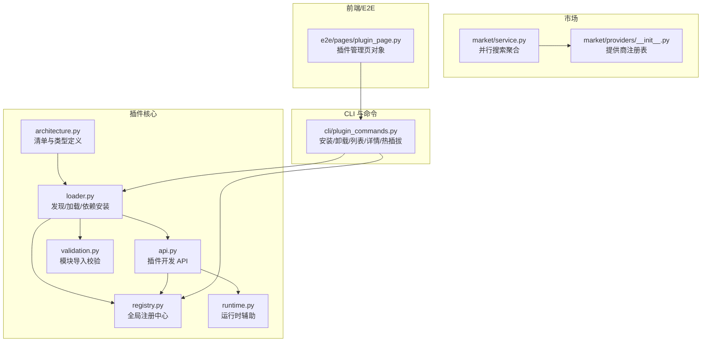
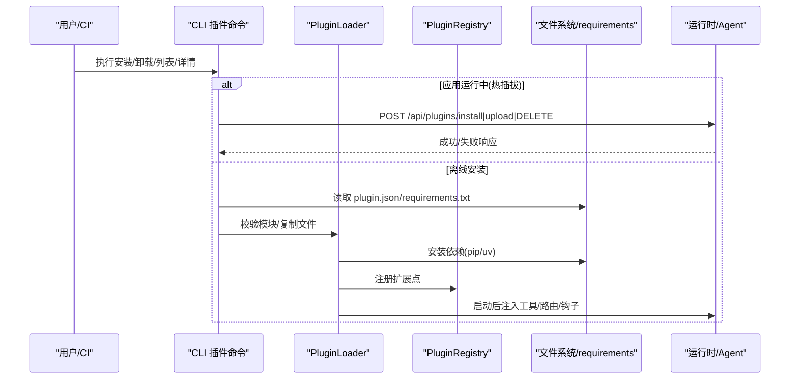
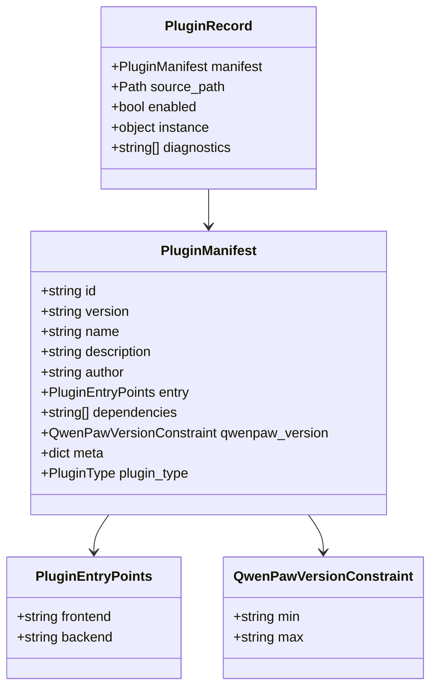
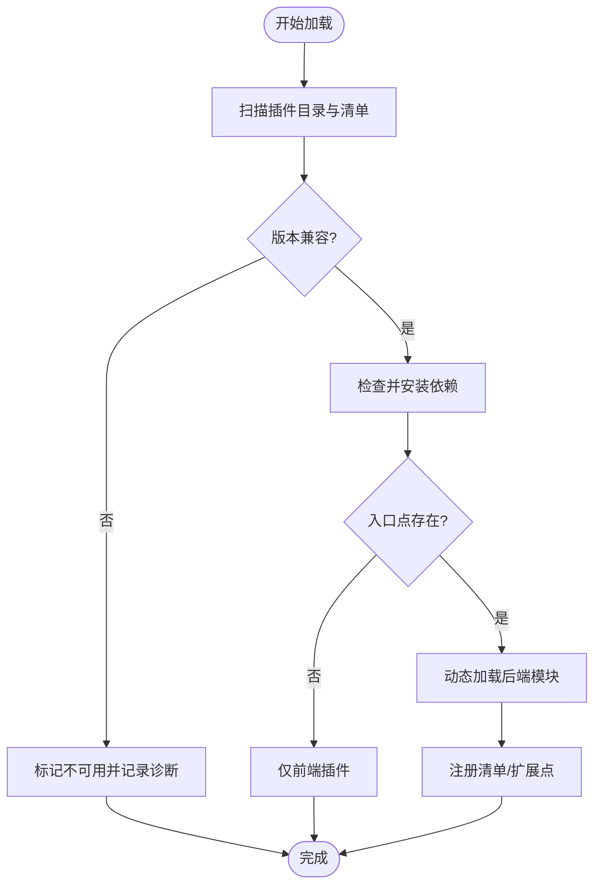
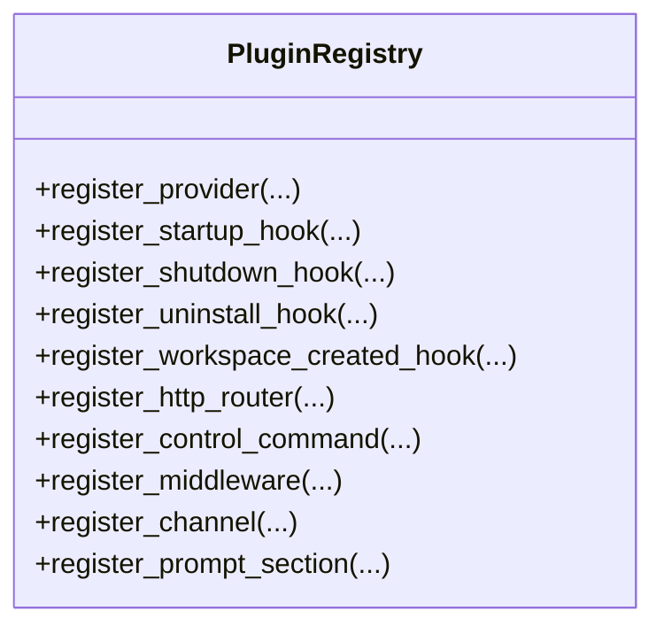
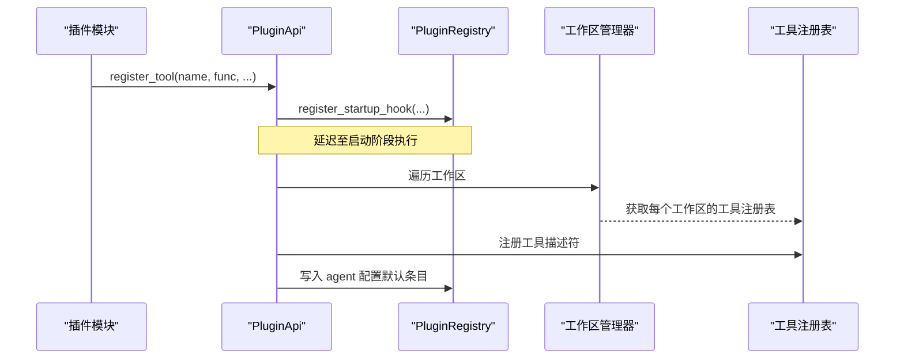
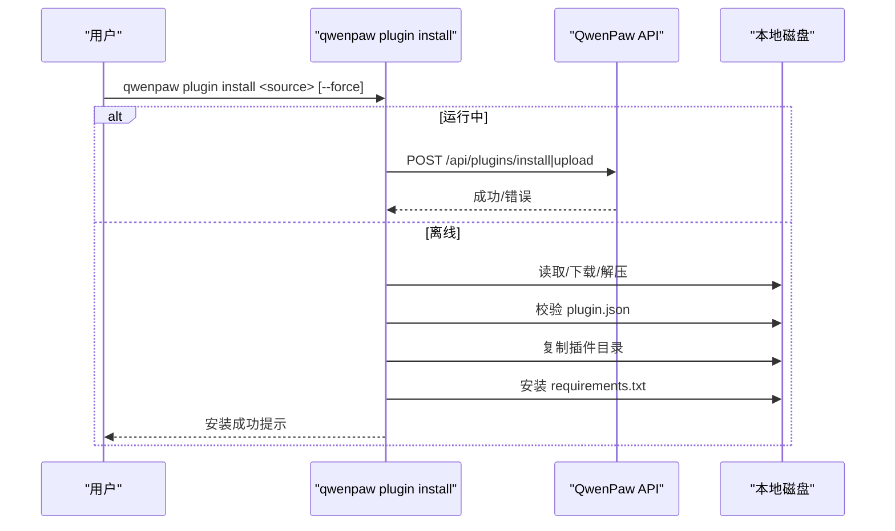
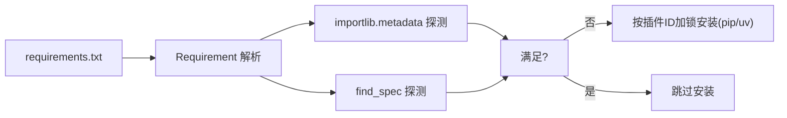

# 插件发布和管理

<cite>
**本文引用的文件**
- [src/qwenpaw/plugins/__init__.py](file://src/qwenpaw/plugins/__init__.py)
- [src/qwenpaw/plugins/architecture.py](file://src/qwenpaw/plugins/architecture.py)
- [src/qwenpaw/plugins/loader.py](file://src/qwenpaw/plugins/loader.py)
- [src/qwenpaw/plugins/registry.py](file://src/qwenpaw/plugins/registry.py)
- [src/qwenpaw/plugins/api.py](file://src/qwenpaw/plugins/api.py)
- [src/qwenpaw/plugins/validation.py](file://src/qwenpaw/plugins/validation.py)
- [src/qwenpaw/plugins/runtime.py](file://src/qwenpaw/plugins/runtime.py)
- [src/qwenpaw/cli/plugin_commands.py](file://src/qwenpaw/cli/plugin_commands.py)
- [src/qwenpaw/market/service.py](file://src/qwenpaw/market/service.py)
- [src/qwenpaw/market/providers/__init__.py](file://src/qwenpaw/market/providers/__init__.py)
- [e2e/pages/plugin_page.py](file://e2e/pages/plugin_page.py)
</cite>

## 目录
1. [简介](#简介)
2. [项目结构](#项目结构)
3. [核心组件](#核心组件)
4. [架构总览](#架构总览)
5. [详细组件分析](#详细组件分析)
6. [依赖关系分析](#依赖关系分析)
7. [性能与缓存策略](#性能与缓存策略)
8. [安全与信任链](#安全与信任链)
9. [故障恢复与回滚](#故障恢复与回滚)
10. [监控与告警](#监控与告警)
11. [命令行操作示例](#命令行操作示例)
12. [分发与部署方案](#分发与部署方案)
13. [常见问题排查](#常见问题排查)
14. [结论](#结论)

## 简介
本文件面向 QwenPaw 的插件生态，系统性阐述插件的安装、更新、卸载与版本管理；覆盖插件市场集成、依赖解析、冲突解决与安全校验流程；提供 CLI 使用示例；解释插件元数据生成、签名验证与信任链管理（现状与建议）；记录运行时环境隔离、依赖包管理与缓存策略；并给出故障恢复、回滚机制、监控告警以及社区共享与企业私有市场的部署方案。内容兼顾初学者友好与开发者深度。

## 项目结构
QwenPaw 插件系统由“清单模型 + 加载器 + 注册中心 + API + 验证 + 运行时辅助”构成，CLI 负责安装/卸载/列表/详情等生命周期操作，市场服务提供多源搜索能力，前端页面对象用于 E2E 测试插件管理界面。

图表来源
- [src/qwenpaw/plugins/architecture.py:1-221](file://src/qwenpaw/plugins/architecture.py#L1-L221)
- [src/qwenpaw/plugins/loader.py:120-640](file://src/qwenpaw/plugins/loader.py#L120-L640)
- [src/qwenpaw/plugins/registry.py:129-320](file://src/qwenpaw/plugins/registry.py#L129-L320)
- [src/qwenpaw/plugins/api.py:172-424](file://src/qwenpaw/plugins/api.py#L172-L424)
- [src/qwenpaw/plugins/validation.py:15-78](file://src/qwenpaw/plugins/validation.py#L15-L78)
- [src/qwenpaw/plugins/runtime.py:10-68](file://src/qwenpaw/plugins/runtime.py#L10-L68)
- [src/qwenpaw/cli/plugin_commands.py:499-800](file://src/qwenpaw/cli/plugin_commands.py#L499-L800)
- [src/qwenpaw/market/service.py:38-130](file://src/qwenpaw/market/service.py#L38-L130)
- [src/qwenpaw/market/providers/__init__.py:17-22](file://src/qwenpaw/market/providers/__init__.py#L17-L22)
- [e2e/pages/plugin_page.py:29-68](file://e2e/pages/plugin_page.py#L29-L68)

章节来源
- [src/qwenpaw/plugins/__init__.py:1-17](file://src/qwenpaw/plugins/__init__.py#L1-L17)

## 核心组件
- 清单与类型：PluginManifest、PluginType、PluginEntryPoints、QwenPawVersionConstraint、PluginRecord，统一描述插件元数据、入口点、兼容范围与运行记录。
- 加载器：发现插件目录、解析清单、校验入口点、检查并安装依赖、动态加载后端模块、维护已加载实例。
- 注册中心：集中管理 Provider、Hook、HTTP 路由、Channel、控制命令、中间件、提示词片段等扩展点。
- 插件 API：为插件开发者暴露 register_tool/register_channel/register_http_router/register_provider 等能力。
- 验证工具：在离线安装前以与运行时一致的语义尝试导入模块，提前暴露问题。
- 运行时辅助：提供日志、Provider 查询等运行时能力。
- CLI：支持在线热插拔与离线安装，自动处理 requirements.txt 依赖安装与工具同步。
- 市场服务：并行调用多个市场提供商，聚合结果并返回分页信息。

章节来源
- [src/qwenpaw/plugins/architecture.py:100-221](file://src/qwenpaw/plugins/architecture.py#L100-L221)
- [src/qwenpaw/plugins/loader.py:120-640](file://src/qwenpaw/plugins/loader.py#L120-L640)
- [src/qwenpaw/plugins/registry.py:129-320](file://src/qwenpaw/plugins/registry.py#L129-L320)
- [src/qwenpaw/plugins/api.py:172-424](file://src/qwenpaw/plugins/api.py#L172-L424)
- [src/qwenpaw/plugins/validation.py:15-78](file://src/qwenpaw/plugins/validation.py#L15-L78)
- [src/qwenpaw/plugins/runtime.py:10-68](file://src/qwenpaw/plugins/runtime.py#L10-L68)
- [src/qwenpaw/cli/plugin_commands.py:499-800](file://src/qwenpaw/cli/plugin_commands.py#L499-L800)
- [src/qwenpaw/market/service.py:38-130](file://src/qwenpaw/market/service.py#L38-L130)

## 架构总览
插件从“清单 → 校验 → 依赖 → 加载 → 注册 → 运行”的全链路如下：

图表来源
- [src/qwenpaw/cli/plugin_commands.py:499-800](file://src/qwenpaw/cli/plugin_commands.py#L499-L800)
- [src/qwenpaw/plugins/loader.py:514-640](file://src/qwenpaw/plugins/loader.py#L514-L640)
- [src/qwenpaw/plugins/registry.py:220-320](file://src/qwenpaw/plugins/registry.py#L220-L320)

## 详细组件分析

### 清单与类型（PluginManifest/PluginType/PluginRecord）
- 字段与约束：id、version、name/description/author、entry(frontend/backend)、dependencies、qwenpaw_version(min/max)、meta、plugin_type。
- 兼容性：支持 qwenpaw_version 左闭右开区间；缺失时回退到 min_version/max_version。
- 类型推断：当未显式声明 type 时，根据 meta 与 entry 推断最佳类型（tool/provider/hook/command/channel/frontend/general）。
- 记录：PluginRecord 保存已加载插件的清单、路径、启用状态、实例与诊断信息。

图表来源
- [src/qwenpaw/plugins/architecture.py:100-221](file://src/qwenpaw/plugins/architecture.py#L100-L221)

章节来源
- [src/qwenpaw/plugins/architecture.py:100-221](file://src/qwenpaw/plugins/architecture.py#L100-L221)

### 加载器（PluginLoader）
- 发现：遍历插件目录，跳过隐藏或 .disabled 后缀目录，解析 plugin.json。
- 兼容性检查：基于清单中的 qwenpaw_version 或 min/max 判断是否可加载。
- 依赖安装：
  - 检测 requirements.txt 中缺失或不满足版本的依赖。
  - 优先 pip，缺失则回退 uv；冻结桌面构建下通过打包的 Python 运行时安装。
  - 按插件粒度加锁，避免并发重复安装导致内存耗尽。
- 动态加载：
  - 将插件目录加入 sys.path，创建命名空间模块，执行模块并期望导出 plugin 对象。
  - 失败时清理 sys.modules、sys.path 与注册中心，保证无残留状态。
- 注册：
  - 将清单摘要写入注册中心，供 UI/API 展示。
  - 若存在后端入口，调用 register(api) 完成扩展点注册。

图表来源
- [src/qwenpaw/plugins/loader.py:132-173](file://src/qwenpaw/plugins/loader.py#L132-L173)
- [src/qwenpaw/plugins/loader.py:192-207](file://src/qwenpaw/plugins/loader.py#L192-L207)
- [src/qwenpaw/plugins/loader.py:270-335](file://src/qwenpaw/plugins/loader.py#L270-L335)
- [src/qwenpaw/plugins/loader.py:376-458](file://src/qwenpaw/plugins/loader.py#L376-L458)
- [src/qwenpaw/plugins/loader.py:460-513](file://src/qwenpaw/plugins/loader.py#L460-L513)
- [src/qwenpaw/plugins/loader.py:514-608](file://src/qwenpaw/plugins/loader.py#L514-L608)

章节来源
- [src/qwenpaw/plugins/loader.py:120-640](file://src/qwenpaw/plugins/loader.py#L120-L640)

### 注册中心（PluginRegistry）
- 扩展点：Provider、Hook（启动/关闭/卸载/工作区创建）、HTTP 路由、Channel、控制命令、中间件、提示词片段。
- HTTP 路由挂载：在控制台 SPA 捕获路由之前插入，确保插件 API 优先匹配；支持 OpenAPI 标签与去重校验。
- 工具注入：通过运行时助手将工具函数注入各工作区的 ToolRegistry，并在 agent 配置中持久化默认条目。
- 钩子优先级：所有钩子均支持 priority，数值越小越先执行。

图表来源
- [src/qwenpaw/plugins/registry.py:129-320](file://src/qwenpaw/plugins/registry.py#L129-L320)
- [src/qwenpaw/plugins/registry.py:328-387](file://src/qwenpaw/plugins/registry.py#L328-L387)
- [src/qwenpaw/plugins/registry.py:472-588](file://src/qwenpaw/plugins/registry.py#L472-L588)
- [src/qwenpaw/plugins/registry.py:749-800](file://src/qwenpaw/plugins/registry.py#L749-L800)

章节来源
- [src/qwenpaw/plugins/registry.py:129-320](file://src/qwenpaw/plugins/registry.py#L129-L320)

### 插件 API（PluginApi）
- 注册工具：自动附加 ToolDescriptor、注入工作区工具注册表、在 agent 配置中写入默认条目。
- 注册路由/频道/提供者/钩子/中间件/模式/斜杠命令等，均委托注册中心。
- 运行时访问：通过 registry.runtime 获取运行时辅助对象。

图表来源
- [src/qwenpaw/plugins/api.py:614-698](file://src/qwenpaw/plugins/api.py#L614-L698)
- [src/qwenpaw/plugins/api.py:394-424](file://src/qwenpaw/plugins/api.py#L394-L424)
- [src/qwenpaw/plugins/api.py:483-570](file://src/qwenpaw/plugins/api.py#L483-L570)
- [src/qwenpaw/plugins/api.py:205-250](file://src/qwenpaw/plugins/api.py#L205-L250)

章节来源
- [src/qwenpaw/plugins/api.py:172-424](file://src/qwenpaw/plugins/api.py#L172-L424)
- [src/qwenpaw/plugins/api.py:614-698](file://src/qwenpaw/plugins/api.py#L614-L698)

### 验证（validation）
- 离线安装前以与运行时一致的语义尝试导入模块，要求导出 plugin 对象，否则报错。
- 清理临时模块，避免污染进程。

章节来源
- [src/qwenpaw/plugins/validation.py:15-78](file://src/qwenpaw/plugins/validation.py#L15-L78)

### 运行时辅助（RuntimeHelpers）
- 提供 provider 查询、日志输出等基础能力。

章节来源
- [src/qwenpaw/plugins/runtime.py:10-68](file://src/qwenpaw/plugins/runtime.py#L10-L68)

### CLI 插件命令（plugin_commands）
- 热插拔：当检测到 QwenPaw 运行中，直接调用 /api/plugins/install、/api/plugins/upload、/api/plugins/{id} 接口。
- 离线安装：下载/解压 ZIP、校验 plugin.json、复制文件、安装依赖、可选同步工具到所有 Agent。
- 列表/详情：读取已安装插件清单并格式化输出。
- 卸载：支持 ID 或目录路径，运行中走热卸载，停止时仅删除文件。

图表来源
- [src/qwenpaw/cli/plugin_commands.py:499-800](file://src/qwenpaw/cli/plugin_commands.py#L499-L800)
- [src/qwenpaw/cli/plugin_commands.py:320-339](file://src/qwenpaw/cli/plugin_commands.py#L320-L339)
- [src/qwenpaw/cli/plugin_commands.py:460-497](file://src/qwenpaw/cli/plugin_commands.py#L460-L497)

章节来源
- [src/qwenpaw/cli/plugin_commands.py:499-800](file://src/qwenpaw/cli/plugin_commands.py#L499-L800)

### 市场服务（Market Service）
- 并行搜索：对选定的提供商并行发起搜索请求，合并结果并统计每源的 has_more/total。
- 分类映射：根据语言与提供商将通用分类映射为原生 code 或等价检索词。
- 容错：单个提供商异常不影响其他结果，返回 MarketSearchError 列表。

章节来源
- [src/qwenpaw/market/service.py:38-130](file://src/qwenpaw/market/service.py#L38-L130)
- [src/qwenpaw/market/providers/__init__.py:17-22](file://src/qwenpaw/market/providers/__init__.py#L17-L22)

### 前端插件管理页（E2E）
- 提供插件管理页面的定位器与断言，覆盖“已安装/官方”标签与安装按钮等关键元素。

章节来源
- [e2e/pages/plugin_page.py:29-68](file://e2e/pages/plugin_page.py#L29-L68)

## 依赖关系分析
- 插件依赖解析：
  - 通过 packaging.requirements.Requirement 解析 requirements.txt 行。
  - 双重探测：importlib.metadata（权威，含版本规范）+ importlib.util.find_spec（覆盖冻结构建中缺 dist-info 的包）。
  - 常见分布名→导入名映射（pillow/PIL、beautifulsoup4/bs4 等），避免误判缺失。
- 并发与锁定：
  - 按插件 ID 生成锁文件，跨进程串行化同一插件的安装过程，避免重复安装风暴。
- 平台差异：
  - 冻结桌面构建下使用打包的 Python 运行时安装依赖，并通过环境变量向子进程暴露 site-dir。

图表来源
- [src/qwenpaw/plugins/loader.py:209-268](file://src/qwenpaw/plugins/loader.py#L209-L268)
- [src/qwenpaw/plugins/loader.py:270-335](file://src/qwenpaw/plugins/loader.py#L270-L335)
- [src/qwenpaw/plugins/loader.py:69-78](file://src/qwenpaw/plugins/loader.py#L69-L78)
- [src/qwenpaw/plugins/loader.py:93-117](file://src/qwenpaw/plugins/loader.py#L93-L117)

章节来源
- [src/qwenpaw/plugins/loader.py:209-335](file://src/qwenpaw/plugins/loader.py#L209-L335)

## 性能与缓存策略
- 依赖安装：
  - 超时保护（默认 300 秒），失败清理目标目录，避免脏状态。
  - 双通道回退：pip → uv，提升在无 pip 环境下的成功率。
- 导入缓存：
  - 安装前后刷新 importlib 缓存，避免旧缓存导致误判。
- 路由与 OpenAPI：
  - 插件路由挂载后清空 FastAPI openapi_schema 缓存，确保后续 /openapi.json 反映最新路由。

章节来源
- [src/qwenpaw/plugins/loader.py:721-800](file://src/qwenpaw/plugins/loader.py#L721-L800)
- [src/qwenpaw/plugins/registry.py:29-52](file://src/qwenpaw/plugins/registry.py#L29-L52)

## 安全与信任链
- 当前实现要点：
  - ZIP 解压防 Zip Slip：校验成员路径不得跳出目标目录。
  - 模块加载命名空间隔离：以 plugin_<id> 命名空间加载，失败时清理 sys.modules 与 sys.path。
  - 插件 HTTP 路由前缀唯一性校验，防止冲突。
- 签名与信任链：
  - 仓库未发现插件签名验证与证书链校验逻辑。建议引入：
    - 插件制品签名（如 Sigstore/Cosign）与公钥白名单。
    - 安装前校验签名与发布者身份，拒绝未签名或签名失效的制品。
    - 企业私有市场强制签名与审计日志。

章节来源
- [src/qwenpaw/cli/plugin_commands.py:320-339](file://src/qwenpaw/cli/plugin_commands.py#L320-L339)
- [src/qwenpaw/plugins/loader.py:460-513](file://src/qwenpaw/plugins/loader.py#L460-L513)
- [src/qwenpaw/plugins/registry.py:249-265](file://src/qwenpaw/plugins/registry.py#L249-L265)

## 故障恢复与回滚
- 加载失败回滚：
  - 清理注册中心、sys.modules（按命名空间与 __file__ 路径）、sys.path，确保重试或卸载不受影响。
- 卸载钩子：
  - 支持 unregister/uninstall hooks，用于一次性清理（如移除技能、撤销 monkey-patch）。
- 热插拔一致性：
  - 运行中通过 API 卸载会触发对应清理逻辑，保持进程稳定。

章节来源
- [src/qwenpaw/plugins/loader.py:460-513](file://src/qwenpaw/plugins/loader.py#L460-L513)
- [src/qwenpaw/plugins/registry.py:546-588](file://src/qwenpaw/plugins/registry.py#L546-L588)
- [src/qwenpaw/cli/plugin_commands.py:773-800](file://src/qwenpaw/cli/plugin_commands.py#L773-L800)

## 监控与告警
- 日志：
  - 依赖安装实时流式输出到 debug 日志，便于定位网络/编译问题。
  - 插件加载/注册/卸载均有结构化日志。
- 指标建议：
  - 插件安装耗时、失败率、依赖安装失败原因分布。
  - 插件路由注册数量、钩子执行耗时。
  - 市场搜索失败率与超时统计。

章节来源
- [src/qwenpaw/plugins/loader.py:672-719](file://src/qwenpaw/plugins/loader.py#L672-L719)
- [src/qwenpaw/plugins/registry.py:288-293](file://src/qwenpaw/plugins/registry.py#L288-L293)

## 命令行操作示例
以下为常用 CLI 用法（请替换实际路径/URL/ID）：
- 安装（运行中热插拔）
  - qwenpaw plugin install https://example.com/my-plugin.zip
  - qwenpaw plugin install ./path/to/plugin --force
- 安装（离线）
  - qwenpaw plugin install ./path/to/plugin
- 列出已安装插件
  - qwenpaw plugin list
- 查看插件详情
  - qwenpaw plugin info <plugin_id>
- 卸载插件
  - qwenpaw plugin uninstall <plugin_id>
  - qwenpaw plugin uninstall ./plugins/tool/<plugin_id>

说明：
- 运行中会自动通过 API 热插拔；未运行则进行离线安装并安装依赖。
- 工具类插件安装后可自动同步到所有 Agent 的配置中。

章节来源
- [src/qwenpaw/cli/plugin_commands.py:504-651](file://src/qwenpaw/cli/plugin_commands.py#L504-L651)
- [src/qwenpaw/cli/plugin_commands.py:653-741](file://src/qwenpaw/cli/plugin_commands.py#L653-L741)
- [src/qwenpaw/cli/plugin_commands.py:773-800](file://src/qwenpaw/cli/plugin_commands.py#L773-L800)

## 分发与部署方案
- 社区公开市场
  - 使用内置市场服务并行搜索多个提供商（QwenPaw、ClawHub、ModelScope、Aliyun），适合个人与开源生态。
- 企业私有市场
  - 自建私有制品库与索引，结合签名校验与访问控制，限定可安装来源。
  - 通过 CI/CD 流水线产出带签名的插件制品，安装前强制校验签名与发布者。
- 内网离线分发
  - 预置插件 ZIP 与 requirements.txt，使用离线安装模式；必要时预装依赖镜像或本地 PyPI。

章节来源
- [src/qwenpaw/market/service.py:38-130](file://src/qwenpaw/market/service.py#L38-L130)
- [src/qwenpaw/market/providers/__init__.py:17-22](file://src/qwenpaw/market/providers/__init__.py#L17-L22)

## 常见问题排查
- 依赖安装失败
  - 现象：pip 不可用或网络超时。
  - 处理：确认 pip/uv 可用；检查网络代理；查看安装日志；必要时手动安装依赖。
- 插件加载失败
  - 现象：缺少 plugin 对象或入口文件不存在。
  - 处理：核对 plugin.json 与 entry.backend；确保模块导出 plugin；检查相对导入路径。
- 路由冲突
  - 现象：插件 HTTP 前缀重复。
  - 处理：修改插件路由前缀，避免与其他插件冲突。
- 热插拔无效
  - 现象：安装后未生效。
  - 处理：确认 QwenPaw 运行中且 API 可达；检查 API 返回的错误详情。

章节来源
- [src/qwenpaw/plugins/loader.py:336-375](file://src/qwenpaw/plugins/loader.py#L336-L375)
- [src/qwenpaw/plugins/registry.py:249-265](file://src/qwenpaw/plugins/registry.py#L249-L265)
- [src/qwenpaw/cli/plugin_commands.py:47-89](file://src/qwenpaw/cli/plugin_commands.py#L47-L89)

## 结论
QwenPaw 插件体系以清晰的清单模型与严格的加载/注册流程为核心，配合 CLI 的热插拔与离线安装能力，实现了可扩展、可观测、可治理的插件生态。依赖解析与并发锁保障了稳定性，注册中心提供了丰富的扩展点。建议在现有基础上引入签名与信任链机制，完善企业级安全与合规需求，并结合监控指标持续优化体验。