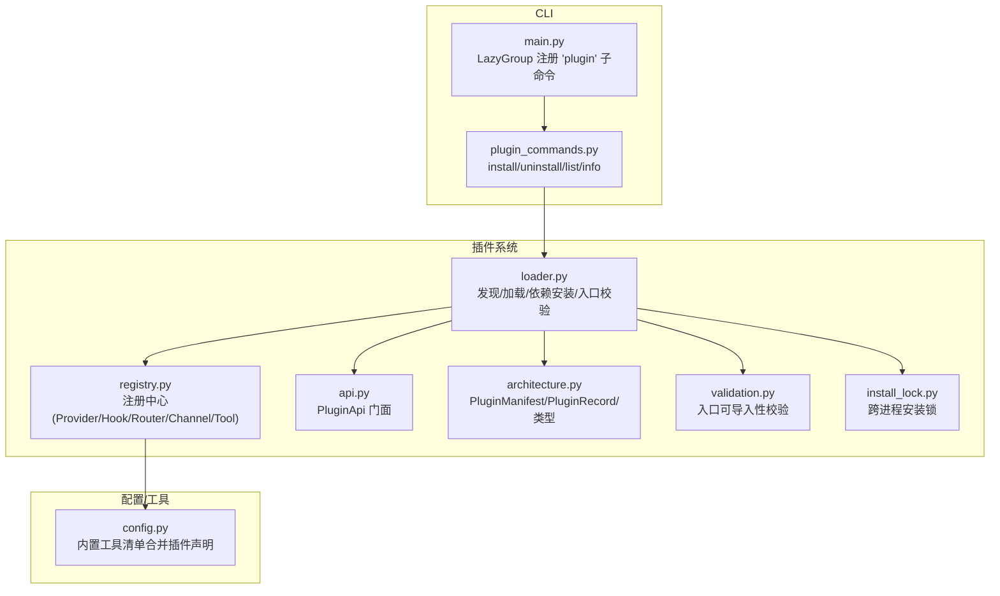
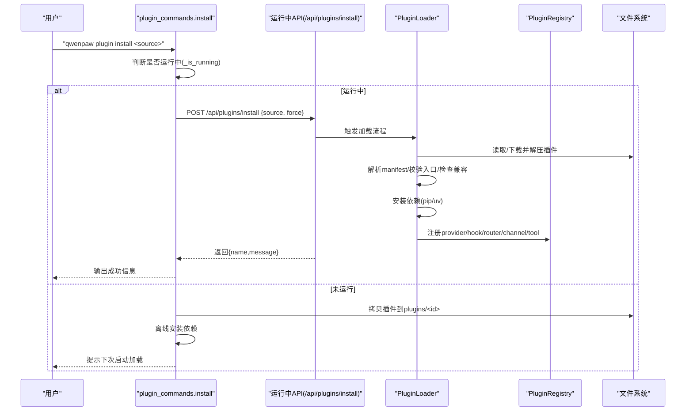
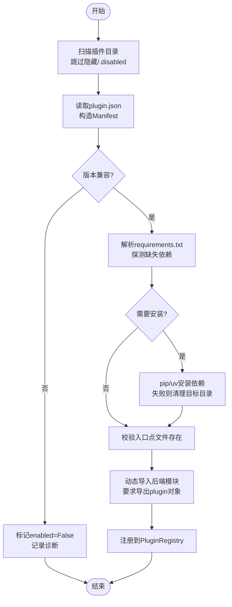
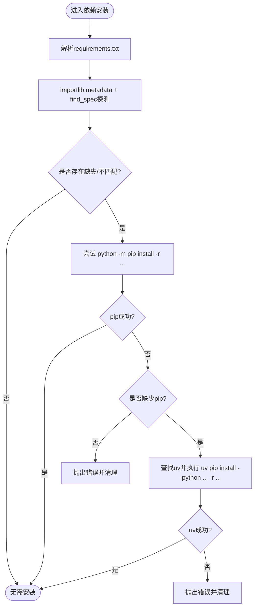
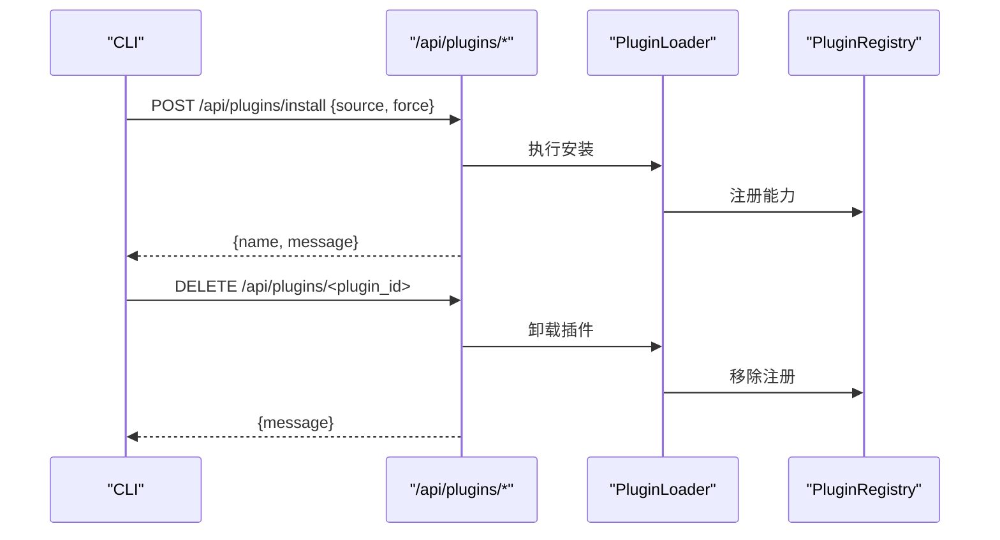
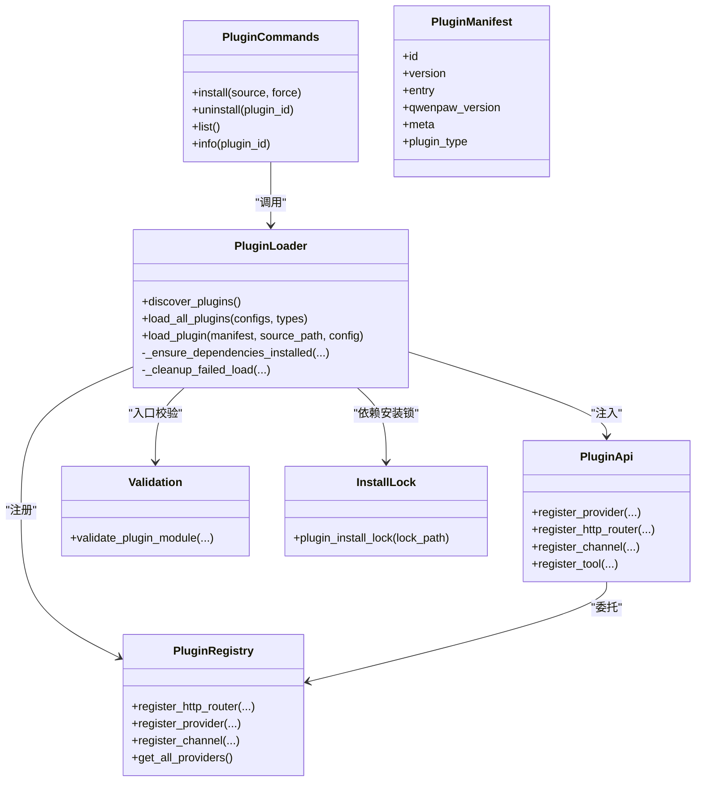

# 插件安装与卸载

<cite>
**本文引用的文件**   
- [src/qwenpaw/cli/main.py](file://src/qwenpaw/cli/main.py)
- [src/qwenpaw/cli/plugin_commands.py](file://src/qwenpaw/cli/plugin_commands.py)
- [src/qwenpaw/plugins/loader.py](file://src/qwenpaw/plugins/loader.py)
- [src/qwenpaw/plugins/registry.py](file://src/qwenpaw/plugins/registry.py)
- [src/qwenpaw/plugins/api.py](file://src/qwenpaw/plugins/api.py)
- [src/qwenpaw/plugins/architecture.py](file://src/qwenpaw/plugins/architecture.py)
- [src/qwenpaw/plugins/validation.py](file://src/qwenpaw/plugins/validation.py)
- [src/qwenpaw/plugins/install_lock.py](file://src/qwenpaw/plugins/install_lock.py)
- [src/qwenpaw/config/config.py](file://src/qwenpaw/config/config.py)
</cite>

## 目录
1. [简介](#简介)
2. [项目结构](#项目结构)
3. [核心组件](#核心组件)
4. [架构总览](#架构总览)
5. [详细组件分析](#详细组件分析)
6. [依赖关系分析](#依赖关系分析)
7. [性能考虑](#性能考虑)
8. [故障排查指南](#故障排查指南)
9. [结论](#结论)
10. [附录](#附录)

## 简介
本章节面向 QwenPaw 的插件安装与卸载能力，系统性说明插件发现机制、依赖解析与安装流程，覆盖从本地目录、远程 ZIP 包以及通过运行中 API 热加载的安装方式；记录命令行操作示例（install/uninstall/list/info），解释插件目录结构与 plugin.json 元数据格式、入口点验证；详述依赖包安装过程（requirements.txt 解析、pip/uv 工具链选择与错误处理）、冲突检测、版本兼容性与回滚策略；并提供禁用、启用与清理的完整操作流程。内容兼顾初学者友好与开发者深度。

## 项目结构
QwenPaw 插件系统由 CLI 命令层、运行时加载器、注册表、API 门面、架构模型与校验模块组成：
- CLI 命令层：提供 qwenpaw plugin install/uninstall/list/info 等子命令，支持在线热加载与离线安装。
- 运行时加载器：负责扫描插件目录、解析 manifest、检查兼容性、安装依赖、动态导入后端模块并注册到注册表。
- 注册表：集中管理插件提供的 Provider、Hook、HTTP 路由、Channel、工具等能力。
- API 门面：为插件开发者暴露 register_* 系列接口。
- 架构模型：定义 PluginManifest、PluginRecord、PluginType 等数据结构。
- 校验模块：在 CLI 安装前对后端入口进行“可导入性”预检，避免无效插件污染环境。
- 并发锁：跨进程互斥保护同一插件的依赖安装，避免重复安装导致 OOM 或 .dist-info 损坏。

图表来源
- [src/qwenpaw/cli/main.py:119-174](file://src/qwenpaw/cli/main.py#L119-L174)
- [src/qwenpaw/cli/plugin_commands.py:499-551](file://src/qwenpaw/cli/plugin_commands.py#L499-L551)
- [src/qwenpaw/plugins/loader.py:132-172](file://src/qwenpaw/plugins/loader.py#L132-L172)
- [src/qwenpaw/plugins/registry.py:129-169](file://src/qwenpaw/plugins/registry.py#L129-L169)
- [src/qwenpaw/plugins/api.py:172-204](file://src/qwenpaw/plugins/api.py#L172-L204)
- [src/qwenpaw/plugins/architecture.py:114-144](file://src/qwenpaw/plugins/architecture.py#L114-L144)
- [src/qwenpaw/plugins/validation.py:15-78](file://src/qwenpaw/plugins/validation.py#L15-L78)
- [src/qwenpaw/plugins/install_lock.py:82-155](file://src/qwenpaw/plugins/install_lock.py#L82-L155)
- [src/qwenpaw/config/config.py:1855-1895](file://src/qwenpaw/config/config.py#L1855-L1895)

章节来源
- [src/qwenpaw/cli/main.py:119-174](file://src/qwenpaw/cli/main.py#L119-L174)
- [src/qwenpaw/cli/plugin_commands.py:499-551](file://src/qwenpaw/cli/plugin_commands.py#L499-L551)
- [src/qwenpaw/plugins/loader.py:132-172](file://src/qwenpaw/plugins/loader.py#L132-L172)
- [src/qwenpaw/plugins/registry.py:129-169](file://src/qwenpaw/plugins/registry.py#L129-L169)
- [src/qwenpaw/plugins/api.py:172-204](file://src/qwenpaw/plugins/api.py#L172-L204)
- [src/qwenpaw/plugins/architecture.py:114-144](file://src/qwenpaw/plugins/architecture.py#L114-L144)
- [src/qwenpaw/plugins/validation.py:15-78](file://src/qwenpaw/plugins/validation.py#L15-L78)
- [src/qwenpaw/plugins/install_lock.py:82-155](file://src/qwenpaw/plugins/install_lock.py#L82-L155)
- [src/qwenpaw/config/config.py:1855-1895](file://src/qwenpaw/config/config.py#L1855-L1895)

## 核心组件
- CLI 插件命令
  - install：支持本地目录、ZIP 包、URL 三种来源；当 QwenPaw 运行时走 API 热加载，否则离线拷贝+依赖安装。
  - uninstall：支持按 ID 或路径卸载；运行时走 API 热卸载，否则仅删除磁盘文件。
  - list/info：列出已安装插件及详细信息。
- 插件加载器
  - discover_plugins：遍历插件目录，跳过隐藏与 .disabled 后缀目录，读取 plugin.json 并构造 Manifest。
  - load_plugin：版本兼容检查→依赖安装→入口点校验→动态导入后端模块→注册到 Registry。
  - _ensure_dependencies_installed：基于 requirements.txt 探测缺失依赖，使用 pip/uv 安装，带超时与失败清理。
  - _cleanup_failed_load：失败时回滚 sys.modules、sys.path 与注册表，保证无残留状态。
- 注册表
  - 统一管理 Provider、Hook、HTTP Router、Channel、控制命令、中间件、提示词片段等。
  - 提供 HTTP 路由插入与 OpenAPI 缓存失效逻辑，确保插件路由优先于控制台 SPA 捕获路由。
- API 门面
  - 提供 register_provider/register_startup_hook/register_shutdown_hook/register_uninstall_hook/register_http_router/register_channel/register_tool/register_slash_command/register_mode 等接口。
- 架构模型
  - PluginManifest：描述插件 id/version/name/description/author/entry/dependencies/min_version/max_version/qwenpaw_version/meta/type 等字段，支持国际化文本与旧版 entry_point 兼容。
  - PluginRecord：运行时记录，包含 manifest、source_path、enabled、instance、diagnostics。
- 校验模块
  - validate_plugin_module：在安装前以与运行时一致的语义尝试导入后端入口，要求导出 plugin 对象。
- 并发锁
  - plugin_install_lock：基于 OS 级文件锁，防止多进程同时安装同一插件依赖导致竞争与内存爆炸。

章节来源
- [src/qwenpaw/cli/plugin_commands.py:504-651](file://src/qwenpaw/cli/plugin_commands.py#L504-L651)
- [src/qwenpaw/cli/plugin_commands.py:773-800](file://src/qwenpaw/cli/plugin_commands.py#L773-L800)
- [src/qwenpaw/plugins/loader.py:132-172](file://src/qwenpaw/plugins/loader.py#L132-L172)
- [src/qwenpaw/plugins/loader.py:514-607](file://src/qwenpaw/plugins/loader.py#L514-L607)
- [src/qwenpaw/plugins/loader.py:270-334](file://src/qwenpaw/plugins/loader.py#L270-L334)
- [src/qwenpaw/plugins/loader.py:460-513](file://src/qwenpaw/plugins/loader.py#L460-L513)
- [src/qwenpaw/plugins/registry.py:209-296](file://src/qwenpaw/plugins/registry.py#L209-L296)
- [src/qwenpaw/plugins/api.py:172-204](file://src/qwenpaw/plugins/api.py#L172-L204)
- [src/qwenpaw/plugins/architecture.py:114-144](file://src/qwenpaw/plugins/architecture.py#L114-L144)
- [src/qwenpaw/plugins/validation.py:15-78](file://src/qwenpaw/plugins/validation.py#L15-L78)
- [src/qwenpaw/plugins/install_lock.py:82-155](file://src/qwenpaw/plugins/install_lock.py#L82-L155)

## 架构总览
下图展示一次“在线热安装”的端到端调用序列：CLI 检测到服务运行后，将安装请求转发至 /api/plugins/install，服务端完成依赖安装、模块加载与注册，随后返回结果。

图表来源
- [src/qwenpaw/cli/plugin_commands.py:504-651](file://src/qwenpaw/cli/plugin_commands.py#L504-L651)
- [src/qwenpaw/plugins/loader.py:514-607](file://src/qwenpaw/plugins/loader.py#L514-L607)
- [src/qwenpaw/plugins/registry.py:209-296](file://src/qwenpaw/plugins/registry.py#L209-L296)

## 详细组件分析

### 插件发现与加载流程
- 发现阶段
  - 遍历所有插件目录，忽略隐藏目录与 .disabled 后缀目录。
  - 读取每个子目录下的 plugin.json，构建 PluginManifest。
- 加载阶段
  - 版本兼容检查：若不兼容则标记 enabled=False 并记录诊断信息。
  - 依赖安装：解析 requirements.txt，探测缺失项，使用 pip/uv 安装，带超时与失败清理。
  - 入口点校验：要求存在 backend 或 frontend 入口，且后端入口需导出 plugin 对象。
  - 动态导入：创建临时模块名，设置 __path__ 指向插件目录，执行模块并调用 register(api)。
  - 注册：将 manifest 与实例写入注册表，供后续 Provider/Router/Channel/Tool 等扩展。

图表来源
- [src/qwenpaw/plugins/loader.py:132-172](file://src/qwenpaw/plugins/loader.py#L132-L172)
- [src/qwenpaw/plugins/loader.py:514-607](file://src/qwenpaw/plugins/loader.py#L514-L607)
- [src/qwenpaw/plugins/loader.py:270-334](file://src/qwenpaw/plugins/loader.py#L270-L334)
- [src/qwenpaw/plugins/validation.py:15-78](file://src/qwenpaw/plugins/validation.py#L15-L78)

章节来源
- [src/qwenpaw/plugins/loader.py:132-172](file://src/qwenpaw/plugins/loader.py#L132-L172)
- [src/qwenpaw/plugins/loader.py:514-607](file://src/qwenpaw/plugins/loader.py#L514-L607)
- [src/qwenpaw/plugins/loader.py:270-334](file://src/qwenpaw/plugins/loader.py#L270-L334)
- [src/qwenpaw/plugins/validation.py:15-78](file://src/qwenpaw/plugins/validation.py#L15-L78)

### 依赖解析与安装（requirements.txt + pip/uv）
- 解析规则
  - 逐行读取 requirements.txt，忽略空行、注释与选项行。
  - 使用 packaging.requirements.Requirement 解析每条依赖，结合 importlib.metadata 与 find_spec 双重探测是否满足。
- 安装策略
  - 首选 python -m pip install -r requirements.txt。
  - 若当前环境缺少 pip（如 uv-managed venv），自动回退到 uv pip install --python <sys.executable> -r requirements.txt。
  - 安装失败或超时时，清理目标目录并报错。
- 并发安全
  - 使用 per-plugin 的文件锁（OS 级 fcntl/msvcrt）串行化同一插件的依赖安装，避免多进程重复安装导致的内存峰值与 .dist-info 损坏。

图表来源
- [src/qwenpaw/plugins/loader.py:248-268](file://src/qwenpaw/plugins/loader.py#L248-L268)
- [src/qwenpaw/plugins/loader.py:721-800](file://src/qwenpaw/plugins/loader.py#L721-L800)
- [src/qwenpaw/plugins/install_lock.py:82-155](file://src/qwenpaw/plugins/install_lock.py#L82-L155)

章节来源
- [src/qwenpaw/plugins/loader.py:248-268](file://src/qwenpaw/plugins/loader.py#L248-L268)
- [src/qwenpaw/plugins/loader.py:721-800](file://src/qwenpaw/plugins/loader.py#L721-L800)
- [src/qwenpaw/plugins/install_lock.py:82-155](file://src/qwenpaw/plugins/install_lock.py#L82-L155)

### 插件目录结构与 plugin.json 元数据
- 目录结构
  - 每个插件位于 plugins/<plugin_id>/ 下，必须包含 plugin.json。
  - 可选包含 requirements.txt、后端入口文件（如 plugin.py）、前端入口文件（如 index.js）。
- plugin.json 关键字段
  - id、version、name、description、author、entry.backend、entry.frontend、dependencies、min_version、max_version、qwenpaw_version、meta、type。
  - name/description/author 支持国际化映射（如 {"zh-CN": "...", "en-US": "..."}），会被归一化为显示字符串。
  - type 可显式指定（tool/provider/hook/command/channel/frontend/general），未指定时根据 meta 与 entry 推断。
- 入口点验证
  - 至少声明一个入口（backend 或 frontend）。
  - 后端入口需导出名为 plugin 的对象，并在其 register(api) 方法中完成能力注册。

章节来源
- [src/qwenpaw/plugins/architecture.py:114-144](file://src/qwenpaw/plugins/architecture.py#L114-L144)
- [src/qwenpaw/plugins/architecture.py:145-190](file://src/qwenpaw/plugins/architecture.py#L145-L190)
- [src/qwenpaw/plugins/validation.py:15-78](file://src/qwenpaw/plugins/validation.py#L15-L78)

### 命令行操作示例
- 安装插件
  - 从本地目录安装：qwenpaw plugin install /path/to/plugin
  - 从 ZIP 包安装：qwenpaw plugin install /path/to/plugin.zip
  - 从 URL 安装：qwenpaw plugin install https://example.com/plugin.zip
  - 强制重装：qwenpaw plugin install <source> --force
- 卸载插件
  - 按 ID 卸载：qwenpaw plugin uninstall <plugin_id>
  - 按路径卸载：qwenpaw plugin uninstall /path/to/plugin
- 查看列表与信息
  - 列出已安装：qwenpaw plugin list
  - 查看详情：qwenpaw plugin info <plugin_id>

章节来源
- [src/qwenpaw/cli/plugin_commands.py:504-651](file://src/qwenpaw/cli/plugin_commands.py#L504-L651)
- [src/qwenpaw/cli/plugin_commands.py:653-741](file://src/qwenpaw/cli/plugin_commands.py#L653-L741)
- [src/qwenpaw/cli/plugin_commands.py:773-800](file://src/qwenpaw/cli/plugin_commands.py#L773-L800)

### 在线热安装/热卸载流程
- 热安装
  - CLI 检测到 QwenPaw 运行后，向 /api/plugins/install 发送 JSON 请求（source、force）。
  - 服务端完成依赖安装、模块加载与注册，返回插件名称与消息。
- 热卸载
  - CLI 向 /api/plugins/<plugin_id> 发送 DELETE 请求，服务端卸载插件并从注册表移除。
- 上传 ZIP
  - 支持 multipart/form-data 上传 ZIP，服务端解压后执行安装流程。

图表来源
- [src/qwenpaw/cli/plugin_commands.py:47-88](file://src/qwenpaw/cli/plugin_commands.py#L47-88)
- [src/qwenpaw/cli/plugin_commands.py:91-148](file://src/qwenpaw/cli/plugin_commands.py#L91-148)
- [src/qwenpaw/cli/plugin_commands.py:151-185](file://src/qwenpaw/cli/plugin_commands.py#L151-L185)
- [src/qwenpaw/plugins/loader.py:514-607](file://src/qwenpaw/plugins/loader.py#L514-L607)
- [src/qwenpaw/plugins/registry.py:298-327](file://src/qwenpaw/plugins/registry.py#L298-L327)

章节来源
- [src/qwenpaw/cli/plugin_commands.py:47-88](file://src/qwenpaw/cli/plugin_commands.py#L47-88)
- [src/qwenpaw/cli/plugin_commands.py:91-148](file://src/qwenpaw/cli/plugin_commands.py#L91-148)
- [src/qwenpaw/cli/plugin_commands.py:151-185](file://src/qwenpaw/cli/plugin_commands.py#L151-L185)
- [src/qwenpaw/plugins/loader.py:514-607](file://src/qwenpaw/plugins/loader.py#L514-L607)
- [src/qwenpaw/plugins/registry.py:298-327](file://src/qwenpaw/plugins/registry.py#L298-L327)

### 插件冲突检测、版本兼容性与回滚
- 冲突检测
  - HTTP 路由前缀冲突：同一 prefix 只能被一个插件注册，重复会抛出异常。
  - Provider ID 冲突：重复 provider_id 会拒绝注册并提示归属插件。
  - Channel key 冲突：重复 channel_key 会拒绝注册。
- 版本兼容性
  - 使用 qwenpaw_version{min,max} 或 min_version/max_version 约束宿主版本范围，不兼容则标记 disabled 并记录诊断。
- 回滚机制
  - 加载失败时清理 sys.modules（按模块名前缀与 __file__ 路径）、移除 sys.path 中的插件目录、注销注册表条目，确保无残留状态。
  - 依赖安装失败时清理目标目录，避免半安装状态。

章节来源
- [src/qwenpaw/plugins/registry.py:241-296](file://src/qwenpaw/plugins/registry.py#L241-L296)
- [src/qwenpaw/plugins/registry.py:328-367](file://src/qwenpaw/plugins/registry.py#L328-L367)
- [src/qwenpaw/plugins/loader.py:460-513](file://src/qwenpaw/plugins/loader.py#L460-L513)
- [src/qwenpaw/plugins/loader.py:541-555](file://src/qwenpaw/plugins/loader.py#L541-L555)

### 禁用、启用与清理
- 禁用插件
  - 将插件目录重命名为以 .disabled 结尾（例如 remote-ssh.disabled），加载器在发现阶段会跳过该目录，不再加载与安装依赖。
- 启用插件
  - 移除 .disabled 后缀即可重新被发现与加载。
- 清理
  - 卸载后，运行时仅从内存与注册表移除；配置文件保留以便用户配置不被丢失。
  - 工具类插件卸载时会从各 Agent 配置中移除对应工具条目。

章节来源
- [src/qwenpaw/plugins/loader.py:81-90](file://src/qwenpaw/plugins/loader.py#L81-L90)
- [src/qwenpaw/plugins/loader.py:514-607](file://src/qwenpaw/plugins/loader.py#L514-L607)
- [src/qwenpaw/cli/plugin_commands.py:403-458](file://src/qwenpaw/cli/plugin_commands.py#L403-L458)

## 依赖关系分析
- CLI 与运行时
  - main.py 通过 LazyGroup 延迟加载 plugin 子命令，实际实现位于 plugin_commands.py。
  - plugin_commands.py 在运行中模式通过 HTTP 调用 /api/plugins/*，在非运行中模式直接操作文件系统与依赖安装。
- 加载器与注册表
  - loader.py 负责发现与加载，完成后通过 registry.py 注册各类能力。
  - api.py 作为插件开发者的统一门面，内部委托给 registry.py。
- 架构与校验
  - architecture.py 定义 Manifest/Record/类型，validation.py 提供与加载器一致的导入校验。
- 并发锁
  - install_lock.py 提供跨进程互斥，loader.py 在安装依赖时使用。

图表来源
- [src/qwenpaw/cli/main.py:119-174](file://src/qwenpaw/cli/main.py#L119-L174)
- [src/qwenpaw/cli/plugin_commands.py:504-651](file://src/qwenpaw/cli/plugin_commands.py#L504-L651)
- [src/qwenpaw/plugins/loader.py:132-172](file://src/qwenpaw/plugins/loader.py#L132-L172)
- [src/qwenpaw/plugins/registry.py:209-296](file://src/qwenpaw/plugins/registry.py#L209-L296)
- [src/qwenpaw/plugins/api.py:172-204](file://src/qwenpaw/plugins/api.py#L172-L204)
- [src/qwenpaw/plugins/architecture.py:114-144](file://src/qwenpaw/plugins/architecture.py#L114-L144)
- [src/qwenpaw/plugins/validation.py:15-78](file://src/qwenpaw/plugins/validation.py#L15-L78)
- [src/qwenpaw/plugins/install_lock.py:82-155](file://src/qwenpaw/plugins/install_lock.py#L82-L155)

章节来源
- [src/qwenpaw/cli/main.py:119-174](file://src/qwenpaw/cli/main.py#L119-L174)
- [src/qwenpaw/cli/plugin_commands.py:504-651](file://src/qwenpaw/cli/plugin_commands.py#L504-L651)
- [src/qwenpaw/plugins/loader.py:132-172](file://src/qwenpaw/plugins/loader.py#L132-L172)
- [src/qwenpaw/plugins/registry.py:209-296](file://src/qwenpaw/plugins/registry.py#L209-L296)
- [src/qwenpaw/plugins/api.py:172-204](file://src/qwenpaw/plugins/api.py#L172-L204)
- [src/qwenpaw/plugins/architecture.py:114-144](file://src/qwenpaw/plugins/architecture.py#L114-L144)
- [src/qwenpaw/plugins/validation.py:15-78](file://src/qwenpaw/plugins/validation.py#L15-L78)
- [src/qwenpaw/plugins/install_lock.py:82-155](file://src/qwenpaw/plugins/install_lock.py#L82-L155)

## 性能考虑
- 依赖安装并行度
  - 通过 per-plugin 锁串行化同一插件的依赖安装，避免多进程重复安装导致的内存峰值与 .dist-info 损坏。
- 安装超时与日志
  - 安装命令默认超时 300 秒，并将 stdout/stderr 流式输出到调试日志，便于定位网络与编译问题。
- 路由注册顺序
  - 插件 HTTP 路由在控制台 SPA 捕获路由之前插入，避免被吞掉；同时刷新 OpenAPI 缓存，减少额外开销。

[本节为通用指导，不涉及具体文件分析]

## 故障排查指南
- 常见问题
  - 找不到 plugin.json：确认插件根目录包含有效的 plugin.json，且 id/name 必填。
  - 入口点不存在或未导出 plugin：后端入口文件需存在且导出 plugin 对象。
  - 依赖安装失败：检查网络与镜像源；若缺少 pip，请安装 uv 或手动执行 pip install -r requirements.txt。
  - 路由冲突：检查不同插件是否使用了相同的 HTTP 前缀。
  - Provider/Channel 冲突：检查 provider_id/channel_key 是否重复。
- 定位手段
  - 使用 qwenpaw plugin info <plugin_id> 查看插件详情与位置。
  - 查看安装日志（含 pip/uv 输出），关注超时与错误堆栈。
  - 对于热安装失败，检查 /api/plugins/* 返回的 detail 信息。

章节来源
- [src/qwenpaw/cli/plugin_commands.py:571-651](file://src/qwenpaw/cli/plugin_commands.py#L571-L651)
- [src/qwenpaw/plugins/validation.py:15-78](file://src/qwenpaw/plugins/validation.py#L15-L78)
- [src/qwenpaw/plugins/loader.py:721-800](file://src/qwenpaw/plugins/loader.py#L721-L800)
- [src/qwenpaw/plugins/registry.py:241-296](file://src/qwenpaw/plugins/registry.py#L241-L296)

## 结论
QwenPaw 的插件系统提供了完善的安装与卸载能力，涵盖本地目录、ZIP 包与 URL 多种来源，支持在线热加载与离线安装。通过严格的 manifest 校验、入口点验证、依赖解析与并发锁，确保了插件生态的稳定与安全。配合注册表的统一管理与冲突检测，插件可以安全地扩展 Provider、HTTP 路由、Channel、工具与命令等能力。建议开发者遵循 plugin.json 规范与入口点约定，合理声明依赖与版本约束，以获得最佳体验。

[本节为总结，不涉及具体文件分析]

## 附录
- 插件类型与用途
  - tool：注册 Agent 可调用的工具函数。
  - provider：注册自定义 LLM 提供商/模型端点。
  - hook：在应用启动/关闭时执行回调。
  - command：注册 /slash 控制命令。
  - channel：注册自定义消息通道。
  - frontend：提供前端 JS 资源，由 UI 动态加载。
  - general：其他通用插件。
- 工具配置同步
  - 工具类插件安装后，会将工具条目写入当前 Agent 的配置中，默认禁用，用户可在界面启用。

章节来源
- [src/qwenpaw/plugins/architecture.py:12-38](file://src/qwenpaw/plugins/architecture.py#L12-38)
- [src/qwenpaw/plugins/api.py:614-698](file://src/qwenpaw/plugins/api.py#L614-L698)
- [src/qwenpaw/config/config.py:1855-1895](file://src/qwenpaw/config/config.py#L1855-L1895)