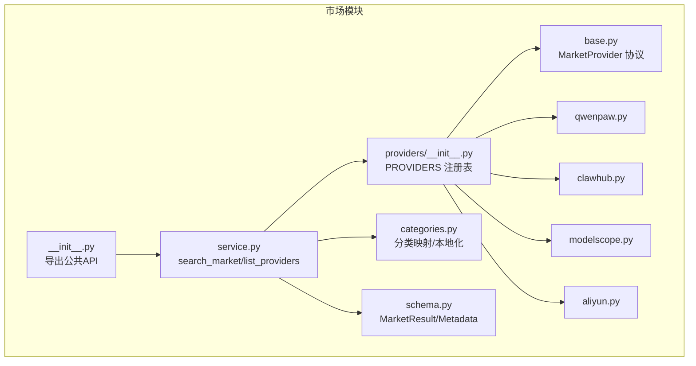
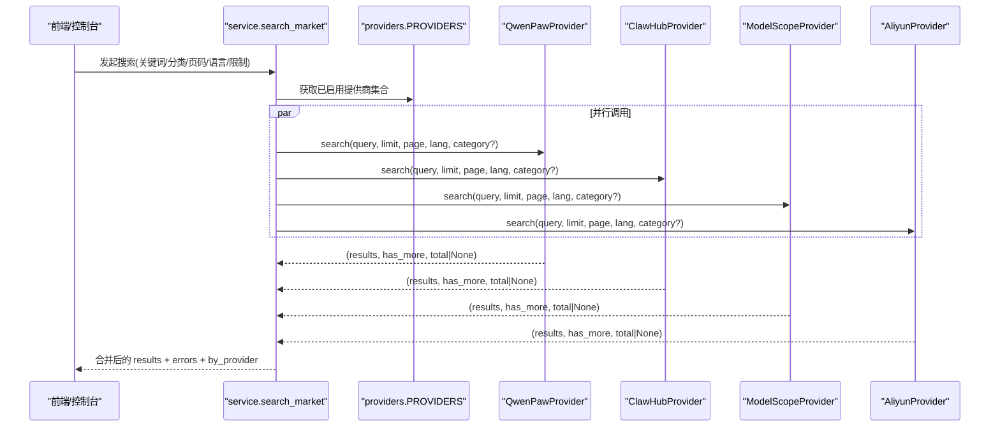
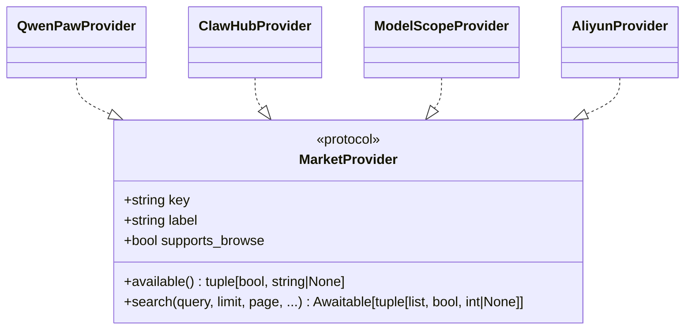
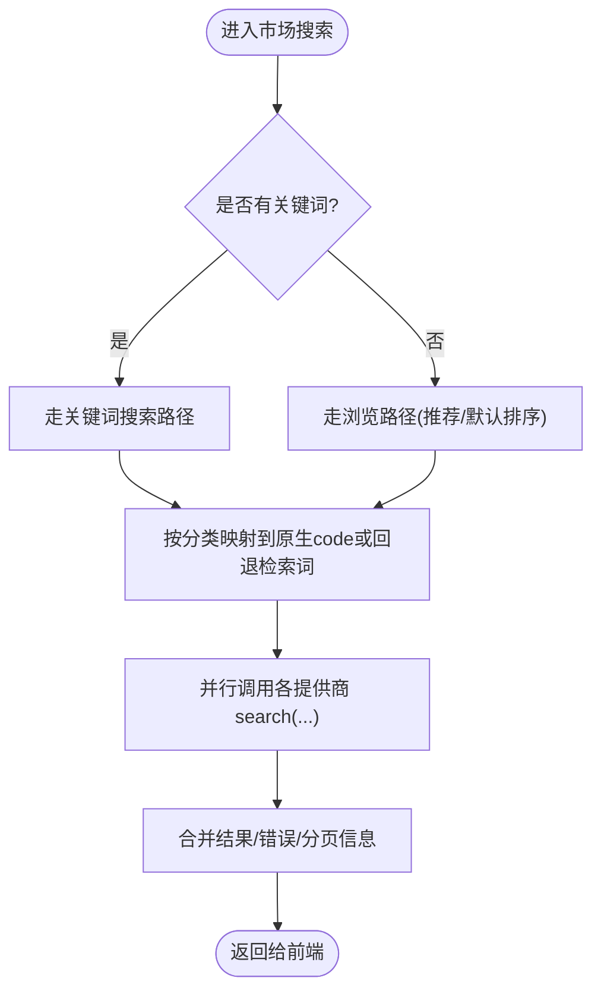
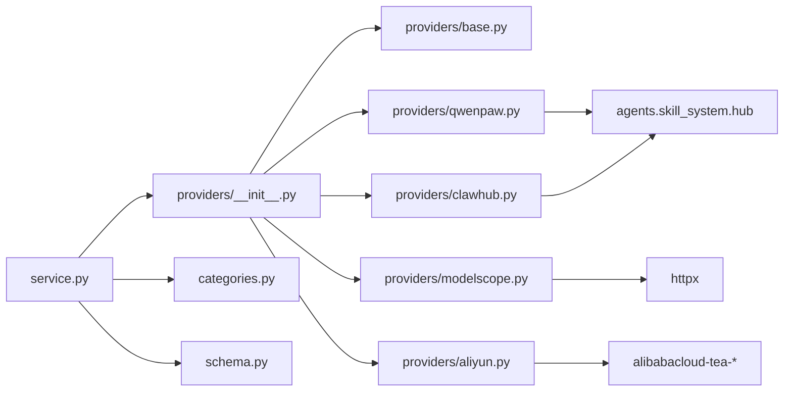

# 插件市场集成

<cite>
**本文引用的文件**
- [src/qwenpaw/market/__init__.py](file://src/qwenpaw/market/__init__.py)
- [src/qwenpaw/market/service.py](file://src/qwenpaw/market/service.py)
- [src/qwenpaw/market/schema.py](file://src/qwenpaw/market/schema.py)
- [src/qwenpaw/market/categories.py](file://src/qwenpaw/market/categories.py)
- [src/qwenpaw/market/providers/__init__.py](file://src/qwenpaw/market/providers/__init__.py)
- [src/qwenpaw/market/providers/base.py](file://src/qwenpaw/market/providers/base.py)
- [src/qwenpaw/market/providers/aliyun.py](file://src/qwenpaw/market/providers/aliyun.py)
- [src/qwenpaw/market/providers/clawhub.py](file://src/qwenpaw/market/providers/clawhub.py)
- [src/qwenpaw/market/providers/modelscope.py](file://src/qwenpaw/market/providers/modelscope.py)
- [src/qwenpaw/market/providers/qwenpaw.py](file://src/qwenpaw/market/providers/qwenpaw.py)
- [console/src/api/modules/market.test.ts](file://console/src/api/modules/market.test.ts)
- [website/public/docs/skills.zh.md](file://website/public/docs/skills.zh.md)
</cite>

## 目录
1. [简介](#简介)
2. [项目结构](#项目结构)
3. [核心组件](#核心组件)
4. [架构总览](#架构总览)
5. [详细组件分析](#详细组件分析)
6. [依赖关系分析](#依赖关系分析)
7. [性能与可用性](#性能与可用性)
8. [故障排查指南](#故障排查指南)
9. [结论](#结论)
10. [附录](#附录)

## 简介
本文件面向 QwenPaw 的“插件市场集成系统”，系统性阐述其架构设计、提供商抽象层与协议规范，覆盖官方市场与第三方市场的接入方式、API 接口与数据格式；并给出市场配置示例、搜索过滤排序机制、详情与统计展示、同步与缓存策略、离线模式建议，以及企业私有市场的搭建要点（认证授权、权限控制、审计日志）。内容兼顾初学者友好与资深开发者的技术深度。

## 项目结构
市场子系统位于 src/qwenpaw/market，采用“服务 + 提供商抽象 + 多实现”的分层组织：
- 公共 API 与导出：market/__init__.py
- 统一数据模型：schema.py
- 分类映射与本地化：categories.py
- 编排服务（并发聚合、错误汇总）：service.py
- 提供商注册表：providers/__init__.py
- 提供商协议与常量：providers/base.py
- 具体提供商实现：qwenpaw.py、clawhub.py、modelscope.py、aliyun.py

图表来源
- [src/qwenpaw/market/__init__.py:1-21](file://src/qwenpaw/market/__init__.py#L1-L21)
- [src/qwenpaw/market/service.py:1-130](file://src/qwenpaw/market/service.py#L1-L130)
- [src/qwenpaw/market/providers/__init__.py:1-29](file://src/qwenpaw/market/providers/__init__.py#L1-L29)
- [src/qwenpaw/market/providers/base.py:1-44](file://src/qwenpaw/market/providers/base.py#L1-L44)
- [src/qwenpaw/market/providers/qwenpaw.py:1-176](file://src/qwenpaw/market/providers/qwenpaw.py#L1-L176)
- [src/qwenpaw/market/providers/clawhub.py:1-168](file://src/qwenpaw/market/providers/clawhub.py#L1-L168)
- [src/qwenpaw/market/providers/modelscope.py:1-186](file://src/qwenpaw/market/providers/modelscope.py#L1-L186)
- [src/qwenpaw/market/providers/aliyun.py:1-320](file://src/qwenpaw/market/providers/aliyun.py#L1-L320)
- [src/qwenpaw/market/categories.py:1-156](file://src/qwenpaw/market/categories.py#L1-L156)
- [src/qwenpaw/market/schema.py:1-39](file://src/qwenpaw/market/schema.py#L1-L39)

章节来源
- [src/qwenpaw/market/__init__.py:1-21](file://src/qwenpaw/market/__init__.py#L1-L21)
- [src/qwenpaw/market/service.py:1-130](file://src/qwenpaw/market/service.py#L1-L130)
- [src/qwenpaw/market/providers/__init__.py:1-29](file://src/qwenpaw/market/providers/__init__.py#L1-L29)
- [src/qwenpaw/market/providers/base.py:1-44](file://src/qwenpaw/market/providers/base.py#L1-L44)
- [src/qwenpaw/market/schema.py:1-39](file://src/qwenpaw/market/schema.py#L1-L39)
- [src/qwenpaw/market/categories.py:1-156](file://src/qwenpaw/market/categories.py#L1-L156)

## 核心组件
- 统一数据模型
  - MarketResult：描述一个插件条目（来源、slug、名称、描述、详情页链接、版本、作者、图标、可选统计字段等）。
  - MarketSearchError：单个提供商搜索失败的错误记录。
  - ProviderInfo：提供商元信息（key、label、是否可用、不可用原因、是否支持浏览）。
- 提供商协议
  - MarketProvider：定义 key、label、supports_browse、available()、search(query, limit, page, ...) 异步方法。
- 分类映射
  - list_categories(lang)：返回本地化的分类标签列表。
  - resolve(category_id, provider_key, lang)：将逻辑分类解析为各提供商的原生代码或回退检索词。
- 市场服务
  - list_providers()：枚举所有已注册的提供商及其可用性。
  - search_market(query, provider_pages, limit, lang, category)：并行调用多个提供商，合并结果、汇总错误、返回分页信息。

章节来源
- [src/qwenpaw/market/schema.py:1-39](file://src/qwenpaw/market/schema.py#L1-L39)
- [src/qwenpaw/market/providers/base.py:1-44](file://src/qwenpaw/market/providers/base.py#L1-L44)
- [src/qwenpaw/market/categories.py:1-156](file://src/qwenpaw/market/categories.py#L1-L156)
- [src/qwenpaw/market/service.py:1-130](file://src/qwenpaw/market/service.py#L1-L130)

## 架构总览
市场搜索流程由 service.search_market 驱动，按请求选择若干提供商与其页码，并行执行各自 search，再聚合结果与错误，同时返回每个提供商的 has_more/total 以支撑“加载更多”。

图表来源
- [src/qwenpaw/market/service.py:38-76](file://src/qwenpaw/market/service.py#L38-L76)
- [src/qwenpaw/market/providers/qwenpaw.py:34-90](file://src/qwenpaw/market/providers/qwenpaw.py#L34-L90)
- [src/qwenpaw/market/providers/clawhub.py:36-79](file://src/qwenpaw/market/providers/clawhub.py#L36-L79)
- [src/qwenpaw/market/providers/modelscope.py:37-93](file://src/qwenpaw/market/providers/modelscope.py#L37-L93)
- [src/qwenpaw/market/providers/aliyun.py:192-245](file://src/qwenpaw/market/providers/aliyun.py#L192-L245)

## 详细组件分析

### 提供商抽象层与协议
- 协议约束
  - available(): 返回可用性布尔值与不可用原因（用于 UI 提示）。
  - search(): 异步方法，返回 (结果列表, 是否有更多, 总数或未知)。
  - supports_browse: 标记是否支持“浏览”模式（无关键词时按推荐/默认排序拉取）。
- 超时预算
  - MARKET_SEARCH_TIMEOUT_S：对单次搜索调用的超时上限，确保整体响应可控。

图表来源
- [src/qwenpaw/market/providers/base.py:17-44](file://src/qwenpaw/market/providers/base.py#L17-L44)
- [src/qwenpaw/market/providers/qwenpaw.py:26-90](file://src/qwenpaw/market/providers/qwenpaw.py#L26-L90)
- [src/qwenpaw/market/providers/clawhub.py:28-79](file://src/qwenpaw/market/providers/clawhub.py#L28-L79)
- [src/qwenpaw/market/providers/modelscope.py:29-93](file://src/qwenpaw/market/providers/modelscope.py#L29-L93)
- [src/qwenpaw/market/providers/aliyun.py:165-245](file://src/qwenpaw/market/providers/aliyun.py#L165-L245)

章节来源
- [src/qwenpaw/market/providers/base.py:1-44](file://src/qwenpaw/market/providers/base.py#L1-L44)

### 官方市场与第三方市场接入

- 官方市场（QwenPaw）
  - 公开 OpenAPI，无需鉴权。
  - 支持分页参数 page_size/page_number、可选 search 与 category。
  - 返回 data.skills 列表与 data.total，用于计算 has_more。
  - 详情链接使用稳定 id（@owner/name），便于安装器反解析。
- 第三方市场
  - ClawHub：提供 /api/v1/search（关键词）与 /api/v1/skills（浏览，带 stats）。
  - ModelScope：公开 OpenAPI，支持 filter.category 与 locales 本地化。
  - Aliyun：需 AK/SK 签名，通过 tea_openapi SDK 调用 SearchSkills，游标分页。

图表来源
- [src/qwenpaw/market/service.py:79-116](file://src/qwenpaw/market/service.py#L79-L116)
- [src/qwenpaw/market/categories.py:133-156](file://src/qwenpaw/market/categories.py#L133-L156)
- [src/qwenpaw/market/providers/qwenpaw.py:34-90](file://src/qwenpaw/market/providers/qwenpaw.py#L34-L90)
- [src/qwenpaw/market/providers/clawhub.py:36-79](file://src/qwenpaw/market/providers/clawhub.py#L36-L79)
- [src/qwenpaw/market/providers/modelscope.py:37-93](file://src/qwenpaw/market/providers/modelscope.py#L37-L93)
- [src/qwenpaw/market/providers/aliyun.py:192-245](file://src/qwenpaw/market/providers/aliyun.py#L192-L245)

章节来源
- [src/qwenpaw/market/providers/qwenpaw.py:1-176](file://src/qwenpaw/market/providers/qwenpaw.py#L1-L176)
- [src/qwenpaw/market/providers/clawhub.py:1-168](file://src/qwenpaw/market/providers/clawhub.py#L1-L168)
- [src/qwenpaw/market/providers/modelscope.py:1-186](file://src/qwenpaw/market/providers/modelscope.py#L1-L186)
- [src/qwenpaw/market/providers/aliyun.py:1-320](file://src/qwenpaw/market/providers/aliyun.py#L1-L320)

### 分类浏览与本地化
- 分类定义包含 id、中/英文标签、各提供商原生 code 与回退检索词。
- resolve(category_id, provider_key, lang) 优先使用原生 code，否则使用本地化回退词作为搜索词。
- list_categories(lang) 根据语言返回标签。

章节来源
- [src/qwenpaw/market/categories.py:28-113](file://src/qwenpaw/market/categories.py#L28-L113)
- [src/qwenpaw/market/categories.py:122-156](file://src/qwenpaw/market/categories.py#L122-L156)

### 数据模型与字段说明
- MarketResult
  - source：来源标识（如 qwenpaw、clawhub、modelscope、aliyun）。
  - slug：唯一标识（通常对应 @owner/name 或平台 slug）。
  - name/description/source_url/version/author/icon_url：基础信息与资源地址。
  - stats：可选统计字典（downloads/views/likes/installs/category/updated_at 等）。
- MarketSearchError：provider + message。
- ProviderInfo：key/label/available/reason/supports_browse。

章节来源
- [src/qwenpaw/market/schema.py:1-39](file://src/qwenpaw/market/schema.py#L1-L39)

### 搜索、过滤与排序算法
- 关键词匹配
  - 若 query 非空，直接透传给上游搜索接口（如 ModelScope/QwenPaw 的 search 参数）。
  - ClawHub 在关键词模式下使用专用 /search 接口，并在内存中进行分页裁剪。
- 分类过滤
  - 通过 categories.resolve 将逻辑分类映射为上游原生 code 或回退检索词。
- 排序
  - ClawHub 浏览模式使用 sort=recommended。
  - ModelScope/QwenPaw 由上游服务端排序，客户端仅传递分页与筛选参数。
- 分页
  - 统一契约：(results, has_more, total|None)。
  - 上游差异：
    - ModelScope/QwenPaw：page_number/page_size + total。
    - ClawHub：cursor 游标（浏览）或内存分页（搜索）。
    - Aliyun：nextToken 游标，最多向前遍历 _MAX_PAGE_WALK 步。

章节来源
- [src/qwenpaw/market/providers/modelscope.py:37-93](file://src/qwenpaw/market/providers/modelscope.py#L37-L93)
- [src/qwenpaw/market/providers/qwenpaw.py:34-90](file://src/qwenpaw/market/providers/qwenpaw.py#L34-L90)
- [src/qwenpaw/market/providers/clawhub.py:47-126](file://src/qwenpaw/market/providers/clawhub.py#L47-L126)
- [src/qwenpaw/market/providers/aliyun.py:192-245](file://src/qwenpaw/market/providers/aliyun.py#L192-L245)

### 插件详情页面、用户评价与下载统计
- 详情入口
  - 各提供商均提供 source_url，指向其详情页。
- 统计字段
  - downloads/views/likes/installs/category/updated_at 等通过 MarketResult.stats 透出，由前端渲染。
- 数据来源
  - ClawHub 浏览接口自带 stats；ModelScope/QwenPaw 返回 downloads/view_count；Aliyun 返回 installCount/likeCount 等。

章节来源
- [src/qwenpaw/market/providers/clawhub.py:129-158](file://src/qwenpaw/market/providers/clawhub.py#L129-L158)
- [src/qwenpaw/market/providers/modelscope.py:96-137](file://src/qwenpaw/market/providers/modelscope.py#L96-L137)
- [src/qwenpaw/market/providers/qwenpaw.py:93-131](file://src/qwenpaw/market/providers/qwenpaw.py#L93-L131)
- [src/qwenpaw/market/providers/aliyun.py:254-287](file://src/qwenpaw/market/providers/aliyun.py#L254-L287)

### 市场同步机制、缓存策略与离线模式
- 同步机制
  - 当前实现为“按需实时查询”，未内置定时同步任务。
- 缓存策略
  - 未在 market 层实现缓存；可在上层（网关/代理/前端）增加缓存与重试。
- 离线模式
  - 当网络不可用时，可降级为本地索引或最近一次成功结果（需在上层实现）。
- 超时与限流
  - 单提供商搜索超时受 MARKET_SEARCH_TIMEOUT_S 约束；可按需在上层设置并发度与熔断。

章节来源
- [src/qwenpaw/market/providers/base.py:12-14](file://src/qwenpaw/market/providers/base.py#L12-L14)
- [src/qwenpaw/market/service.py:38-76](file://src/qwenpaw/market/service.py#L38-L76)

### 企业私有市场搭建指南
- 认证授权
  - 参考 AliyunProvider 的鉴权思路：通过环境变量注入密钥，使用 SDK 完成签名请求。
  - 企业私有市场可实现类似签名/令牌校验，并通过 available() 暴露可用性检查与原因。
- 权限控制
  - 在提供商层进行访问控制（白名单、租户隔离、能力开关）。
- 审计日志
  - 在提供商实现中对关键操作（搜索、详情、安装跳转）打点记录，结合后端审计系统归档。
- 接入步骤（通用）
  - 实现 MarketProvider 协议（available/search）。
  - 在 providers/__init__.py 的 PROVIDERS 注册表中新增实例。
  - 如需分类映射，更新 categories.py 的 CATEGORIES 映射。
  - 通过 list_providers 与 search_market 即可被前端发现与使用。

章节来源
- [src/qwenpaw/market/providers/aliyun.py:165-190](file://src/qwenpaw/market/providers/aliyun.py#L165-L190)
- [src/qwenpaw/market/providers/__init__.py:17-22](file://src/qwenpaw/market/providers/__init__.py#L17-L22)
- [src/qwenpaw/market/categories.py:28-113](file://src/qwenpaw/market/categories.py#L28-L113)

### 插件推荐算法、个性化推送与社区生态
- 推荐算法
  - 当前基于上游排序（如 ClawHub recommended）与分类映射；可在上层引入点击/下载热度、协同过滤等策略。
- 个性化推送
  - 结合用户画像与历史安装行为，在服务端生成个性化排序或预取候选集。
- 社区生态
  - 鼓励发布高质量插件，完善描述、图标、统计指标；建立审核与评分体系，提升发现效率。

[本节为概念性内容，不直接分析具体文件]

## 依赖关系分析
- 内部依赖
  - service 依赖 providers 注册表与 categories 映射。
  - 各 provider 依赖统一的 schema 与 base 协议。
- 外部依赖
  - httpx：HTTP 客户端（ModelScope/QwenPaw）。
  - alibabacloud-tea-*：Aliyun SDK 与签名。
  - agents.skill_system.hub：共享 HTTP 工具与搜索封装（ClawHub）。

图表来源
- [src/qwenpaw/market/service.py:1-130](file://src/qwenpaw/market/service.py#L1-L130)
- [src/qwenpaw/market/providers/__init__.py:1-29](file://src/qwenpaw/market/providers/__init__.py#L1-L29)
- [src/qwenpaw/market/providers/base.py:1-44](file://src/qwenpaw/market/providers/base.py#L1-L44)
- [src/qwenpaw/market/providers/qwenpaw.py:1-176](file://src/qwenpaw/market/providers/qwenpaw.py#L1-L176)
- [src/qwenpaw/market/providers/clawhub.py:1-168](file://src/qwenpaw/market/providers/clawhub.py#L1-L168)
- [src/qwenpaw/market/providers/modelscope.py:1-186](file://src/qwenpaw/market/providers/modelscope.py#L1-L186)
- [src/qwenpaw/market/providers/aliyun.py:1-320](file://src/qwenpaw/market/providers/aliyun.py#L1-L320)

章节来源
- [src/qwenpaw/market/providers/__init__.py:1-29](file://src/qwenpaw/market/providers/__init__.py#L1-L29)

## 性能与可用性
- 并发与超时
  - 使用 asyncio.gather 并行调用各提供商；单提供商搜索超时受 MARKET_SEARCH_TIMEOUT_S 限制。
- 分页成本
  - ClawHub/Aliyun 的浏览/游标翻页存在多次上游往返，已设置最大翻页步数保护。
- 结果裁剪
  - 统一 limit 上限，避免过大响应；ClawHub 关键词搜索先拉取较大窗口再内存分页。
- 错误隔离
  - 单个提供商失败不影响其他结果，错误汇总至 errors 列表。

章节来源
- [src/qwenpaw/market/service.py:38-76](file://src/qwenpaw/market/service.py#L38-L76)
- [src/qwenpaw/market/providers/clawhub.py:24-26](file://src/qwenpaw/market/providers/clawhub.py#L24-L26)
- [src/qwenpaw/market/providers/aliyun.py:35-41](file://src/qwenpaw/market/providers/aliyun.py#L35-L41)
- [src/qwenpaw/market/providers/base.py:12-14](file://src/qwenpaw/market/providers/base.py#L12-L14)

## 故障排查指南
- 常见问题
  - 某提供商不可用：查看 ProviderInfo.reason；Aliyun 需配置 AK/SK 且安装 SDK。
  - 搜索结果为空：确认关键词/分类映射是否正确；上游可能无匹配或分页越界。
  - 分页异常：注意上游游标/页码限制与最大翻页步数。
- 定位手段
  - 使用 list_providers 检查可用性。
  - 观察 service 层日志中的 provider 失败警告。
  - 对照各 provider 的错误抛出位置与消息。

章节来源
- [src/qwenpaw/market/service.py:106-116](file://src/qwenpaw/market/service.py#L106-L116)
- [src/qwenpaw/market/providers/aliyun.py:170-190](file://src/qwenpaw/market/providers/aliyun.py#L170-L190)
- [src/qwenpaw/market/providers/modelscope.py:63-73](file://src/qwenpaw/market/providers/modelscope.py#L63-L73)

## 结论
QwenPaw 插件市场通过清晰的提供商抽象与统一数据模型，实现了跨源搜索、分类映射与结果聚合。现有实现覆盖了官方与多家第三方市场，具备可扩展性与容错能力。在企业场景下，可通过自定义提供商实现私有市场接入，并结合上层缓存、推荐与审计增强体验与安全合规。

## 附录

### API 与数据格式约定
- 提供商枚举
  - 接口：list_providers()
  - 返回：ProviderInfo[]（key、label、available、reason、supports_browse）
- 分类列表
  - 接口：list_categories(lang)
  - 返回：[{id, label}]
- 搜索
  - 接口：search_market(query, provider_pages, limit, lang, category)
  - 返回：{results, errors, by_provider}
  - results：MarketResult[]
  - errors：MarketSearchError[]
  - by_provider：{provider_key: {has_more, total}}

章节来源
- [src/qwenpaw/market/service.py:23-76](file://src/qwenpaw/market/service.py#L23-L76)
- [src/qwenpaw/market/schema.py:1-39](file://src/qwenpaw/market/schema.py#L1-L39)

### 前端契约验证
- 前端测试用例验证了以下契约：
  - listMarketProviders 返回 MarketProviderInfo[]。
  - listMarketCategories 返回 MarketCategory[]。
  - searchMarket 返回 {results, errors, by_provider}，且能容忍空结果。

章节来源
- [console/src/api/modules/market.test.ts:27-103](file://console/src/api/modules/market.test.ts#L27-L103)

### 使用说明与内置数据源
- 内置四个数据源：QwenPaw、ClawHub、ModelScope、Aliyun。
- 工作机制：支持来源/分类/关键词筛选；分类自动映射；并行搜索；保存目标由入口决定；安装串行队列。

章节来源
- [website/public/docs/skills.zh.md:339-365](file://website/public/docs/skills.zh.md#L339-L365)