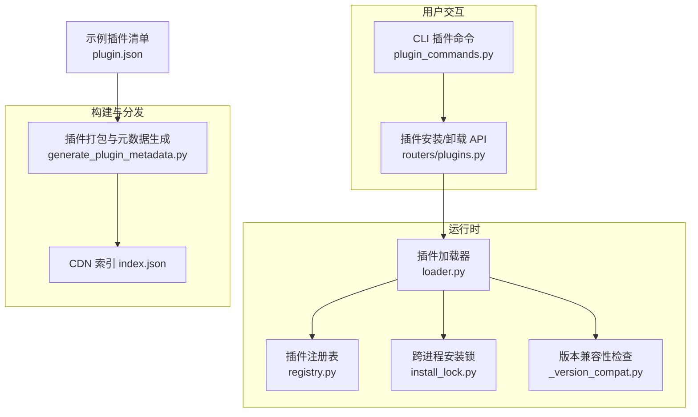
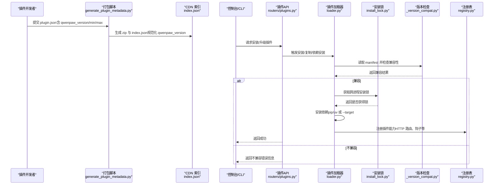
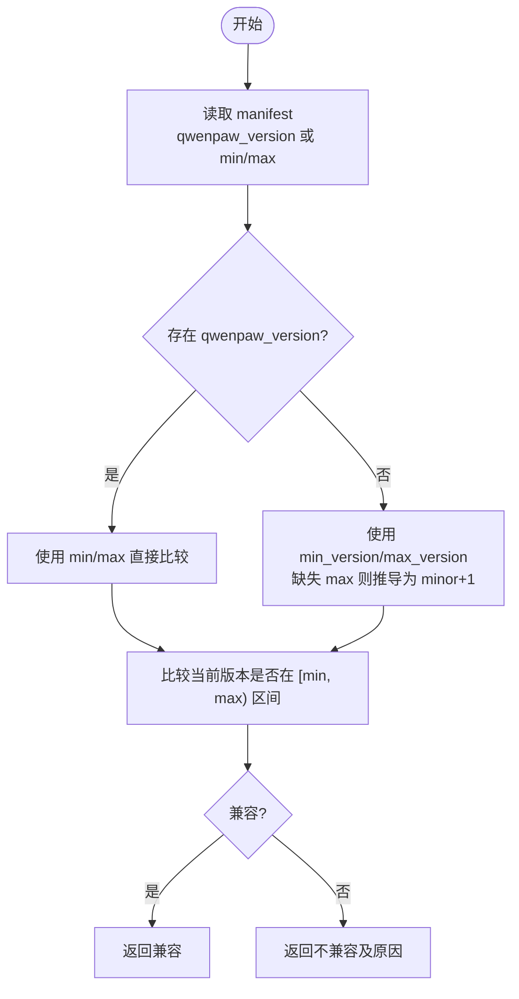
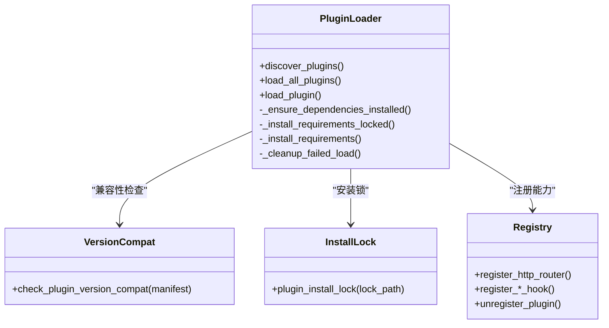
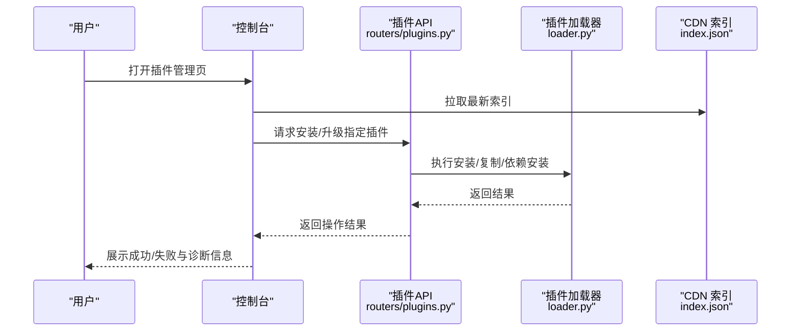

# 版本控制与更新

<cite>
**本文引用的文件**   
- [src/qwenpaw/_version_compat.py](file://src/qwenpaw/_version_compat.py)
- [src/qwenpaw/plugins/loader.py](file://src/qwenpaw/plugins/loader.py)
- [src/qwenpaw/plugins/registry.py](file://src/qwenpaw/plugins/registry.py)
- [src/qwenpaw/plugins/install_lock.py](file://src/qwenpaw/plugins/install_lock.py)
- [scripts/pack/generate_plugin_metadata.py](file://scripts/pack/generate_plugin_metadata.py)
- [plugins/bundle/qwenpaw-pet/plugin.json](file://plugins/bundle/qwenpaw-pet/plugin.json)
- [plugins/tool/gpt-image2/plugin.json](file://plugins/tool/gpt-image2/plugin.json)
- [src/qwenpaw/app/routers/plugins.py](file://src/qwenpaw/app/routers/plugins.py)
- [src/qwenpaw/cli/plugin_commands.py](file://src/qwenpaw/cli/plugin_commands.py)
</cite>

## 目录
1. [简介](#简介)
2. [项目结构](#项目结构)
3. [核心组件](#核心组件)
4. [架构总览](#架构总览)
5. [详细组件分析](#详细组件分析)
6. [依赖关系分析](#依赖关系分析)
7. [性能考量](#性能考量)
8. [故障排查指南](#故障排查指南)
9. [结论](#结论)
10. [附录](#附录)

## 简介
本章节聚焦 QwenPaw 插件的版本控制与更新体系，覆盖以下关键主题：
- 插件版本兼容性检查机制：qwenpaw_version 字段解析、语义化版本比较与兼容区间策略。
- 插件自动更新检测、增量与全量更新策略（基于 CDN 索引与打包脚本）。
- 版本锁定机制、依赖版本管理与冲突解决算法。
- 更新失败的回滚策略、备份恢复与状态一致性保证。
- 多进程并发更新控制与锁机制。
- 版本查询、升级检查与手动更新的完整操作流程。

## 项目结构
围绕“版本控制与更新”的核心代码分布在如下模块：
- 版本兼容性检查：_version_compat.py
- 插件加载与依赖安装：plugins/loader.py
- 插件注册表与 HTTP 路由挂载：plugins/registry.py
- 跨进程安装锁：plugins/install_lock.py
- 插件打包与元数据生成（含 qwenpaw_version 规范化）：scripts/pack/generate_plugin_metadata.py
- 示例插件清单（展示 qwenpaw_version 声明格式）：plugins/*/plugin.json
- 插件安装/卸载 API 与 CLI 入口：app/routers/plugins.py、cli/plugin_commands.py



图表来源
- [src/qwenpaw/plugins/loader.py](file://src/qwenpaw/plugins/loader.py)
- [src/qwenpaw/plugins/registry.py](file://src/qwenpaw/plugins/registry.py)
- [src/qwenpaw/plugins/install_lock.py](file://src/qwenpaw/plugins/install_lock.py)
- [src/qwenpaw/_version_compat.py](file://src/qwenpaw/_version_compat.py)
- [scripts/pack/generate_plugin_metadata.py](file://scripts/pack/generate_plugin_metadata.py)
- [src/qwenpaw/app/routers/plugins.py](file://src/qwenpaw/app/routers/plugins.py)
- [src/qwenpaw/cli/plugin_commands.py](file://src/qwenpaw/cli/plugin_commands.py)

章节来源
- [src/qwenpaw/plugins/loader.py](file://src/qwenpaw/plugins/loader.py)
- [src/qwenpaw/plugins/registry.py](file://src/qwenpaw/plugins/registry.py)
- [src/qwenpaw/plugins/install_lock.py](file://src/qwenpaw/plugins/install_lock.py)
- [src/qwenpaw/_version_compat.py](file://src/qwenpaw/_version_compat.py)
- [scripts/pack/generate_plugin_metadata.py](file://scripts/pack/generate_plugin_metadata.py)
- [src/qwenpaw/app/routers/plugins.py](file://src/qwenpaw/app/routers/plugins.py)
- [src/qwenpaw/cli/plugin_commands.py](file://src/qwenpaw/cli/plugin_commands.py)

## 核心组件
- 版本兼容性检查器
  - 负责解析 manifest 中的 qwenpaw_version 或兼容的 min/max 字段，采用左闭右开区间 >=min, <max 进行判断；当 max 缺失时，按 minor+1 推导上限。
- 插件加载器
  - 负责发现、校验、安装依赖、动态加载后端模块、注册到注册表；在加载前执行版本兼容性检查。
- 插件注册表
  - 集中管理插件能力（HTTP 路由、钩子、渠道等），并支持卸载清理。
- 跨进程安装锁
  - 使用 OS 级文件锁避免多进程并发 pip install 导致资源耗尽与 .dist-info 损坏。
- 打包与元数据生成
  - 扫描本地插件、生成 zip 包与 index.json，并将 qwenpaw_version 规范化写入元数据。
- 插件安装/卸载 API 与 CLI
  - 提供安装、卸载、强制替换等操作接口，驱动加载器完成实际工作。

章节来源
- [src/qwenpaw/_version_compat.py](file://src/qwenpaw/_version_compat.py)
- [src/qwenpaw/plugins/loader.py](file://src/qwenpaw/plugins/loader.py)
- [src/qwenpaw/plugins/registry.py](file://src/qwenpaw/plugins/registry.py)
- [src/qwenpaw/plugins/install_lock.py](file://src/qwenpaw/plugins/install_lock.py)
- [scripts/pack/generate_plugin_metadata.py](file://scripts/pack/generate_plugin_metadata.py)
- [src/qwenpaw/app/routers/plugins.py](file://src/qwenpaw/app/routers/plugins.py)
- [src/qwenpaw/cli/plugin_commands.py](file://src/qwenpaw/cli/plugin_commands.py)

## 架构总览
下图展示了从“插件清单与元数据”到“运行时加载与安装”的整体流程，以及版本兼容性检查的关键位置。



图表来源
- [scripts/pack/generate_plugin_metadata.py](file://scripts/pack/generate_plugin_metadata.py)
- [src/qwenpaw/app/routers/plugins.py](file://src/qwenpaw/app/routers/plugins.py)
- [src/qwenpaw/plugins/loader.py](file://src/qwenpaw/plugins/loader.py)
- [src/qwenpaw/plugins/install_lock.py](file://src/qwenpaw/plugins/install_lock.py)
- [src/qwenpaw/_version_compat.py](file://src/qwenpaw/_version_compat.py)
- [src/qwenpaw/plugins/registry.py](file://src/qwenpaw/plugins/registry.py)

## 详细组件分析

### 版本兼容性检查机制
- 字段优先级与解析
  - 优先读取 structured 字段 qwenpaw_version.min / qwenpaw_version.max。
  - 若不存在，则回退到顶层 min_version / max_version，并在缺少 max 时按 minor+1 推导上限。
- 比较策略
  - 采用左闭右开区间：>=min 且 <max。
  - 预发布版本（如 2.0.0b2）在比较时视为对应基础版本，便于开发期加载目标版本插件。
- 典型场景
  - 仅声明 min：自动推导 max = major.(minor+1).0。
  - 同时声明 min 与 max：严格落在区间内。
  - 未声明任何版本约束：视为无限制（由调用方决定行为）。



图表来源
- [src/qwenpaw/_version_compat.py](file://src/qwenpaw/_version_compat.py)

章节来源
- [src/qwenpaw/_version_compat.py](file://src/qwenpaw/_version_compat.py)

### 插件清单与元数据规范（qwenpaw_version 声明）
- 推荐声明方式
  - 结构化字段：qwenpaw_version.min / qwenpaw_version.max
  - 兼容旧式字段：min_version / max_version（打包脚本会将其规范化为结构化形式）
- 示例路径
  - 结构化声明示例：[plugins/bundle/qwenpaw-pet/plugin.json](file://plugins/bundle/qwenpaw-pet/plugin.json)
  - 工具类插件示例：[plugins/tool/gpt-image2/plugin.json](file://plugins/tool/gpt-image2/plugin.json)
- 打包脚本对 qwenpaw_version 的处理
  - 若已存在结构化字段，直接保留并清洗前后空白与 v 前缀。
  - 若仅有 min_version/max_version，合成结构化 qwenpaw_version 输出至 index.json。

章节来源
- [plugins/bundle/qwenpaw-pet/plugin.json](file://plugins/bundle/qwenpaw-pet/plugin.json)
- [plugins/tool/gpt-image2/plugin.json](file://plugins/tool/gpt-image2/plugin.json)
- [scripts/pack/generate_plugin_metadata.py](file://scripts/pack/generate_plugin_metadata.py)

### 插件加载流程与依赖安装
- 加载顺序
  - 发现插件 -> 解析 manifest -> 版本兼容性检查 -> 依赖安装 -> 动态加载后端模块 -> 注册到注册表。
- 依赖安装策略
  - 双探针判定依赖是否满足：importlib.metadata + importlib.util.find_spec，避免冻结构建误报。
  - 优先 python -m pip；若不可用则回退 uv pip install。
  - 桌面冻结构建下通过 --target 安装到用户可写 site 目录，并通过环境变量注入 sys.path。
- 失败清理
  - 加载失败时回滚注册表、sys.modules、sys.path，确保不影响其他插件或后续重试。



图表来源
- [src/qwenpaw/plugins/loader.py](file://src/qwenpaw/plugins/loader.py)
- [src/qwenpaw/plugins/install_lock.py](file://src/qwenpaw/plugins/install_lock.py)
- [src/qwenpaw/_version_compat.py](file://src/qwenpaw/_version_compat.py)
- [src/qwenpaw/plugins/registry.py](file://src/qwenpaw/plugins/registry.py)

章节来源
- [src/qwenpaw/plugins/loader.py](file://src/qwenpaw/plugins/loader.py)
- [src/qwenpaw/plugins/registry.py](file://src/qwenpaw/plugins/registry.py)

### 多进程并发更新控制与锁机制
- 问题背景
  - 桌面冻结构建可能同时运行多个后端进程，并发 pip install 会导致内存峰值飙升与 .dist-info 损坏。
- 解决方案
  - 基于 OS 级文件锁（fcntl/msvcrt）实现跨进程互斥，按插件粒度加锁。
  - 等待超时后仍允许继续安装（避免死锁），但会在进入临界区前再次探测依赖是否已由其他进程安装，从而跳过重复安装。
- 锁文件路径
  - 位于 WORKING_DIR/plugin_runtime/install-locks/<safe_id>.lock，按插件 id 安全化命名。

章节来源
- [src/qwenpaw/plugins/install_lock.py](file://src/qwenpaw/plugins/install_lock.py)
- [src/qwenpaw/plugins/loader.py](file://src/qwenpaw/plugins/loader.py)

### 自动更新检测、增量与全量更新策略
- 元数据来源
  - 打包脚本 generate_plugin_metadata.py 扫描 plugins 目录，生成 dist/plugins/index.json，包含每个插件的 zip 地址、大小、sha256 与 qwenpaw_version。
- 更新策略
  - 全量重建：每次打包都会清空 dist 中已有产物，确保删除的文件能正确传播。
  - 增量感知：前端/控制台可通过 index.json 对比本地已安装版本，选择下载差异包或全量包（具体 UI 逻辑不在本仓库范围，但元数据结构已完备）。
- 兼容性过滤
  - 控制台在安装前会依据 index.json 中的 qwenpaw_version 与当前宿主版本进行过滤，仅显示兼容版本。

章节来源
- [scripts/pack/generate_plugin_metadata.py](file://scripts/pack/generate_plugin_metadata.py)

### 版本锁定机制、依赖版本管理与冲突解决
- 依赖版本管理
  - 以 requirements.txt 为准，结合 importlib.metadata 与 find_spec 双重探测，确保在冻结构建与非冻结环境均准确识别已安装版本。
- 冲突解决
  - 同一插件的依赖安装串行化（按插件 id 加锁），不同插件可并行安装。
  - 安装完成后刷新 importlib 缓存，避免后续导入命中旧缓存。
- 平台隔离
  - 依赖安装目录按 Python 主副版本与平台/架构 bucket 隔离，避免 ABI 冲突。

章节来源
- [src/qwenpaw/plugins/loader.py](file://src/qwenpaw/plugins/loader.py)
- [src/qwenpaw/plugins/install_lock.py](file://src/qwenpaw/plugins/install_lock.py)

### 更新失败的回滚策略、备份恢复与状态一致性
- 加载失败回滚
  - 卸载注册表条目、清理 sys.modules（按模块名前缀与 __file__ 路径）、移除 sys.path 插入项，确保失败加载不留脏状态。
- 卸载钩子
  - 注册表支持 uninstall hooks，用于在卸载时清理插件创建的资源（例如 workspace skills、全局注册项等）。
- 状态一致性
  - 安装过程先拷贝/解压到目标目录，再安装依赖，最后才注册到运行时；任一阶段失败都不会污染运行态。

章节来源
- [src/qwenpaw/plugins/loader.py](file://src/qwenpaw/plugins/loader.py)
- [src/qwenpaw/plugins/registry.py](file://src/qwenpaw/plugins/registry.py)

### 版本查询、升级检查与手动更新操作流程
- 版本查询
  - 通过注册表暴露的插件清单与 manifest 信息，可查询各插件的 qwenpaw_version 约束与当前版本。
- 升级检查
  - 控制台拉取 index.json，比对本地已安装插件版本与远程可用版本，并结合 qwenpaw_version 过滤出兼容升级项。
- 手动更新
  - 通过 API 或 CLI 触发安装/卸载：
    - API：POST /api/plugins/install（安装）、DELETE /api/plugins/{id}（卸载）
    - CLI：plugin_commands.py 封装了上述 API 调用，支持本地目录安装与强制替换。



图表来源
- [src/qwenpaw/app/routers/plugins.py](file://src/qwenpaw/app/routers/plugins.py)
- [src/qwenpaw/plugins/loader.py](file://src/qwenpaw/plugins/loader.py)
- [scripts/pack/generate_plugin_metadata.py](file://scripts/pack/generate_plugin_metadata.py)

章节来源
- [src/qwenpaw/app/routers/plugins.py](file://src/qwenpaw/app/routers/plugins.py)
- [src/qwenpaw/cli/plugin_commands.py](file://src/qwenpaw/cli/plugin_commands.py)

## 依赖关系分析
- 组件耦合
  - loader.py 强依赖 _version_compat.py（版本检查）、install_lock.py（并发控制）、registry.py（能力注册）。
  - routers/plugins.py 作为外部入口，调用 loader.py 完成安装/卸载。
  - generate_plugin_metadata.py 独立于运行时，仅产出 index.json 供控制台消费。
- 潜在循环依赖
  - 运行时模块之间通过明确职责边界避免循环：loader 只读 manifest 与写注册表，不反向依赖上层路由。
- 外部依赖
  - packaging.version 用于语义化版本比较。
  - importlib.metadata/find_spec 用于依赖探测。
  - OS 文件锁（fcntl/msvcrt）用于跨进程互斥。

```mermaid
graph LR
V["_version_compat.py"] --> L["loader.py"]
IL["install_lock.py"] --> L
R["registry.py"] <- --> L
P["routers/plugins.py"] --> L
M["generate_plugin_metadata.py"] --> IDX["index.json"]
```

图表来源
- [src/qwenpaw/_version_compat.py](file://src/qwenpaw/_version_compat.py)
- [src/qwenpaw/plugins/loader.py](file://src/qwenpaw/plugins/loader.py)
- [src/qwenpaw/plugins/install_lock.py](file://src/qwenpaw/plugins/install_lock.py)
- [src/qwenpaw/plugins/registry.py](file://src/qwenpaw/plugins/registry.py)
- [src/qwenpaw/app/routers/plugins.py](file://src/qwenpaw/app/routers/plugins.py)
- [scripts/pack/generate_plugin_metadata.py](file://scripts/pack/generate_plugin_metadata.py)

章节来源
- [src/qwenpaw/plugins/loader.py](file://src/qwenpaw/plugins/loader.py)
- [src/qwenpaw/plugins/registry.py](file://src/qwenpaw/plugins/registry.py)
- [src/qwenpaw/plugins/install_lock.py](file://src/qwenpaw/plugins/install_lock.py)
- [src/qwenpaw/_version_compat.py](file://src/qwenpaw/_version_compat.py)
- [src/qwenpaw/app/routers/plugins.py](file://src/qwenpaw/app/routers/plugins.py)
- [scripts/pack/generate_plugin_metadata.py](file://scripts/pack/generate_plugin_metadata.py)

## 性能考量
- 依赖安装耗时
  - 默认超时 300s，避免长时间阻塞事件循环；日志流式输出便于定位慢源。
- 并发控制
  - 按插件粒度加锁，避免重复安装风暴；等待期间定期重探依赖状态，减少不必要安装。
- 冻结构建优化
  - 通过 --target 安装到独立 site 目录，避免影响宿主解释器；安装后刷新 importlib 缓存，降低二次开销。

## 故障排查指南
- 常见症状与定位
  - 插件不加载：查看兼容性诊断信息（loader 记录的不兼容消息）。
  - 依赖安装失败：检查 pip/uv 可用性、网络与镜像源；关注超时与 stderr 输出。
  - 多进程并发异常：确认安装锁目录可写，观察是否有锁等待超时告警。
- 快速自检步骤
  - 验证 plugin.json 的 qwenpaw_version 或 min/max 是否符合预期。
  - 在目标环境中执行依赖安装命令（pip/uv）复现问题。
  - 查看 WORKING_DIR/plugin_runtime 下的安装日志与锁文件。

章节来源
- [src/qwenpaw/plugins/loader.py](file://src/qwenpaw/plugins/loader.py)
- [src/qwenpaw/plugins/install_lock.py](file://src/qwenpaw/plugins/install_lock.py)

## 结论
QwenPaw 的插件版本控制与更新系统以“结构化版本约束 + 严格兼容性检查 + 跨进程锁 + 幂等安装”为核心，既保证了多进程环境下的稳定性，也为控制台提供了完善的元数据支撑以实现自动更新检测与增量/全量更新策略。通过清晰的失败回滚与卸载钩子，系统在变更过程中维持了良好的状态一致性。

## 附录
- 版本声明格式要点
  - 推荐：qwenpaw_version.min / qwenpaw_version.max
  - 兼容：min_version / max_version（将被规范化）
  - 未声明：视为无约束（由调用方决定）
- 相关示例清单
  - [plugins/bundle/qwenpaw-pet/plugin.json](file://plugins/bundle/qwenpaw-pet/plugin.json)
  - [plugins/tool/gpt-image2/plugin.json](file://plugins/tool/gpt-image2/plugin.json)