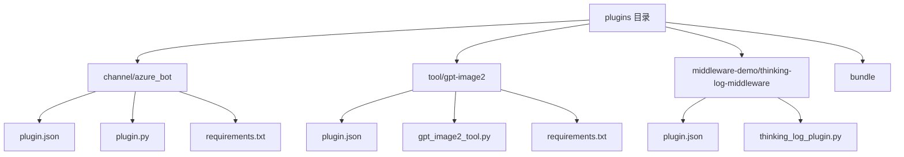
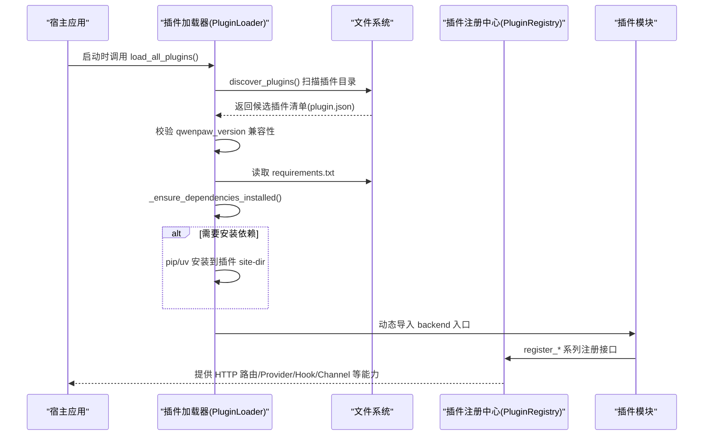
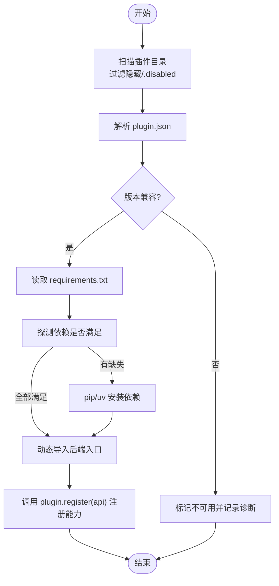

# 开发环境搭建

<cite>
**本文引用的文件**
- [README.md](file://README.md)
- [pyproject.toml](file://pyproject.toml)
- [.gitignore](file://.gitignore)
- [.flake8](file://.flake8)
- [Makefile](file://Makefile)
- [src/qwenpaw/plugins/loader.py](file://src/qwenpaw/plugins/loader.py)
- [src/qwenpaw/plugins/registry.py](file://src/qwenpaw/plugins/registry.py)
- [plugins/channel/azure_bot/plugin.json](file://plugins/channel/azure_bot/plugin.json)
- [plugins/tool/gpt-image2/plugin.json](file://plugins/tool/gpt-image2/plugin.json)
- [plugins/middleware-demo/thinking-log-middleware/plugin.json](file://plugins/middleware-demo/thinking-log-middleware/plugin.json)
- [plugins/channel/azure_bot/plugin.py](file://plugins/channel/azure_bot/plugin.py)
- [plugins/tool/gpt-image2/gpt_image2_tool.py](file://plugins/tool/gpt-image2/gpt_image2_tool.py)
- [plugins/middleware-demo/thinking-log-middleware/thinking_log_plugin.py](file://plugins/middleware-demo/thinking-log-middleware/thinking_log_plugin.py)
- [src/qwenpaw/config/config.py](file://src/qwenpaw/config/config.py)
</cite>

## 更新摘要
**变更内容**
- 更新了 IDE 配置支持，移除了 Qoder IDE 配置，专注于 VS Code 和 Cursor IDE 支持
- 增强了开发工具链配置说明
- 完善了代码质量检查和格式化规则

## 目录
1. [简介](#简介)
2. [项目结构](#项目结构)
3. [核心组件](#核心组件)
4. [架构总览](#架构总览)
5. [详细组件分析](#详细组件分析)
6. [依赖分析](#依赖分析)
7. [性能考虑](#性能考虑)
8. [故障排查指南](#故障排查指南)
9. [结论](#结论)
10. [附录](#附录)

## 简介
本指南面向 QwenPaw 插件开发者，聚焦于在本地搭建 Python 开发环境、安装必要依赖与工具链、理解插件目录结构与清单规范、完成插件初始化流程，并提供 IDE/调试/格式化等开发工具配置建议。同时涵盖环境变量与开发模式注意事项，以及常见问题排查方法。

## 项目结构
QwenPaw 的插件位于仓库根目录下的 plugins 目录，按功能域分门别类组织：
- channel：频道接入插件（如 Azure Bot）
- tool：工具插件（如 GPT Image 2）
- middleware-demo：中间件示例（用于演示如何注册运行时中间件）
- bundle：打包产物目录（构建阶段使用）

每个插件是一个独立子目录，包含：
- plugin.json：插件清单（元数据、入口、依赖、版本兼容范围等）
- requirements.txt：可选，声明该插件的 Python 依赖
- 后端入口文件（由 entry.backend 指定）
- 前端入口文件（可选，由 entry.frontend 指定）

图表来源
- [plugins/channel/azure_bot/plugin.json:1-25](file://plugins/channel/azure_bot/plugin.json#L1-L25)
- [plugins/tool/gpt-image2/plugin.json:1-96](file://plugins/tool/gpt-image2/plugin.json#L1-L96)
- [plugins/middleware-demo/thinking-log-middleware/plugin.json:1-18](file://plugins/middleware-demo/thinking-log-middleware/plugin.json#L1-L18)

章节来源
- [README.md:469-488](file://README.md#L469-L488)
- [pyproject.toml:104-106](file://pyproject.toml#L104-L106)

## 核心组件
- 插件加载器（PluginLoader）：负责发现、校验、安装依赖、动态导入并注册插件模块。
- 插件注册中心（PluginRegistry）：集中管理插件能力（HTTP 路由、Provider、Hook、Channel、中间件、提示词片段等）。
- 清单解析与兼容性检查：基于 plugin.json 的字段进行版本兼容性与依赖完整性校验。
- 依赖安装策略：优先 pip，缺失时回退 uv；支持冻结桌面构建场景下的专用 Python 运行时。

章节来源
- [src/qwenpaw/plugins/loader.py:119-173](file://src/qwenpaw/plugins/loader.py#L119-L173)
- [src/qwenpaw/plugins/loader.py:270-334](file://src/qwenpaw/plugins/loader.py#L270-L334)
- [src/qwenpaw/plugins/loader.py:721-800](file://src/qwenpaw/plugins/loader.py#L721-L800)
- [src/qwenpaw/plugins/registry.py:129-169](file://src/qwenpaw/plugins/registry.py#L129-L169)

## 架构总览
下图展示了插件从发现到加载、再到注册能力的整体流程，以及与宿主应用的关系。

图表来源
- [src/qwenpaw/plugins/loader.py:609-639](file://src/qwenpaw/plugins/loader.py#L609-639)
- [src/qwenpaw/plugins/loader.py:132-173](file://src/qwenpaw/plugins/loader.py#L132-L173)
- [src/qwenpaw/plugins/loader.py:270-334](file://src/qwenpaw/plugins/loader.py#L270-L334)
- [src/qwenpaw/plugins/registry.py:220-292](file://src/qwenpaw/plugins/registry.py#L220-L292)

## 详细组件分析

### 插件清单与目录规范
- 清单关键字段
  - id/name/version/type/description/author：基础元信息
  - entry.backend/entry.frontend：后端/前端入口文件路径
  - dependencies：Python 包依赖列表（也可用 requirements.txt）
  - qwenpaw_version.min/max：宿主版本兼容范围（左闭右开）
  - meta.tools：工具插件的工具描述与配置字段定义
- 目录组织
  - 每个插件一个目录，包含 plugin.json 与对应入口文件
  - 若存在 requirements.txt，将在加载前自动检测并安装缺失依赖

章节来源
- [plugins/channel/azure_bot/plugin.json:1-25](file://plugins/channel/azure_bot/plugin.json#L1-L25)
- [plugins/tool/gpt-image2/plugin.json:1-96](file://plugins/tool/gpt-image2/plugin.json#L1-L96)
- [plugins/middleware-demo/thinking-log-middleware/plugin.json:1-18](file://plugins/middleware-demo/thinking-log-middleware/plugin.json#L1-L18)

### 插件加载与依赖安装流程
- 发现与校验
  - 遍历插件目录，跳过隐藏或 .disabled 后缀目录
  - 解析 plugin.json 并校验宿主版本兼容性
- 依赖安装
  - 读取 requirements.txt，逐行解析 Requirement
  - 通过 importlib.metadata 与 find_spec 双重探测是否满足
  - 未满足则执行安装：优先 python -m pip，失败且缺 pip 时回退 uv
  - 安装目标：非冻结环境为当前环境；冻结桌面构建写入用户可写 site-dir
- 动态加载
  - 将插件目录加入 sys.path，以唯一命名空间导入模块
  - 要求模块导出 plugin 对象并实现 register(api)

图表来源
- [src/qwenpaw/plugins/loader.py:132-173](file://src/qwenpaw/plugins/loader.py#L132-L173)
- [src/qwenpaw/plugins/loader.py:248-334](file://src/qwenpaw/plugins/loader.py#L248-L334)
- [src/qwenpaw/plugins/loader.py:721-800](file://src/qwenpaw/plugins/loader.py#L721-L800)
- [src/qwenpaw/plugins/loader.py:376-458](file://src/qwenpaw/plugins/loader.py#L376-L458)

章节来源
- [src/qwenpaw/plugins/loader.py:119-173](file://src/qwenpaw/plugins/loader.py#L119-L173)
- [src/qwenpaw/plugins/loader.py:270-334](file://src/qwenpaw/plugins/loader.py#L270-L334)
- [src/qwenpaw/plugins/loader.py:376-458](file://src/qwenpaw/plugins/loader.py#L376-L458)

### 插件注册中心能力
- HTTP 路由挂载：在 /api 下按前缀挂载 APIRouter，确保匹配顺序优于控制台 SPA 捕获路由
- Provider 注册：扩展模型提供方
- Hook 机制：启动/关闭/卸载/工作区创建钩子
- Channel 注册：新增消息渠道
- 中间件工厂：注册运行时中间件
- 提示词片段：注入系统提示词段落

章节来源
- [src/qwenpaw/plugins/registry.py:220-292](file://src/qwenpaw/plugins/registry.py#L220-L292)
- [src/qwenpaw/plugins/registry.py:328-367](file://src/qwenpaw/plugins/registry.py#L328-L367)
- [src/qwenpaw/plugins/registry.py:472-528](file://src/qwenpaw/plugins/registry.py#L472-L528)
- [src/qwenpaw/plugins/registry.py:749-800](file://src/qwenpaw/plugins/registry.py#L749-L800)
- [src/qwenpaw/plugins/registry.py:171-207](file://src/qwenpaw/plugins/registry.py#L171-L207)
- [src/qwenpaw/plugins/registry.py:663-711](file://src/qwenpaw/plugins/registry.py#L663-L711)

### 示例插件：Azure Bot 频道
- 清单要点
  - type=channel，entry.backend=plugin.py，dependencies 声明网络与认证库
  - qwenpaw_version 限定兼容范围
- 注册方式
  - 在 plugin.py 中通过 api.register_channel(...) 注册频道类与表单字段

章节来源
- [plugins/channel/azure_bot/plugin.json:1-25](file://plugins/channel/azure_bot/plugin.json#L1-L25)
- [plugins/channel/azure_bot/plugin.py:14-308](file://plugins/channel/azure_bot/plugin.py#L14-L308)

### 示例插件：GPT Image 2 工具
- 清单要点
  - type=tool，entry.backend=gpt_image2.py，meta.tools 定义两个工具及其配置字段
- 工具实现
  - 读取工具配置（API Key、Endpoint、Timeout），调用 OpenAI 图像生成/编辑接口
  - 结果保存至媒体目录并以 DataBlock 返回

章节来源
- [plugins/tool/gpt-image2/plugin.json:1-96](file://plugins/tool/gpt-image2/plugin.json#L1-L96)
- [plugins/tool/gpt-image2/gpt_image2_tool.py:22-256](file://plugins/tool/gpt-image2/gpt_image2_tool.py#L22-L256)
- [plugins/tool/gpt-image2/gpt_image2_tool.py:259-554](file://plugins/tool/gpt-image2/gpt_image2_tool.py#L259-L554)

### 示例插件：思考日志中间件
- 清单要点
  - type=general，entry.backend=thinking_log_plugin.py
- 中间件注册
  - 通过 api.register_middleware(factory, priority) 注册，始终启用

章节来源
- [plugins/middleware-demo/thinking-log-middleware/plugin.json:1-18](file://plugins/middleware-demo/thinking-log-middleware/plugin.json#L1-L18)
- [plugins/middleware-demo/thinking-log-middleware/thinking_log_plugin.py:59-66](file://plugins/middleware-demo/thinking-log-middleware/thinking_log_plugin.py#L59-L66)

## 依赖分析
- 宿主 Python 版本约束：>=3.11,<3.14
- 关键依赖类别
  - Web 与服务：uvicorn、httpx、fastapi（通过插件注册中心使用）
  - 浏览器自动化：playwright
  - 终端 UI：textual
  - LSP 与代码分析：python-lsp-server[all]、ast-grep-cli
  - 其他：apscheduler、openai、anyio 等
- 插件依赖隔离
  - 插件依赖安装到按 Python 版本与平台 bucketed 的 site-dir
  - 冻结桌面构建下通过 QWENPAW_DESKTOP_PY_RUNTIME 指定内置 Python 运行环境

章节来源
- [pyproject.toml:6-71](file://pyproject.toml#L6-L71)
- [src/qwenpaw/plugins/loader.py:44-49](file://src/qwenpaw/plugins/loader.py#L44-L49)
- [src/qwenpaw/plugins/loader.py:51-66](file://src/qwenpaw/plugins/loader.py#L51-L66)

## 性能考虑
- 依赖安装串行化：同一插件的安装操作通过进程锁串行，避免并发重复安装导致资源耗尽
- 双重探测减少误判：importlib.metadata + find_spec 组合，降低"已安装但未识别"导致的重复安装
- 冻结构建优化：将插件依赖安装到用户可写 site-dir，避免对宿主环境造成污染
- 路由插入顺序：插件 HTTP 路由在控制台 SPA 捕获路由之前插入，避免请求被错误消费

章节来源
- [src/qwenpaw/plugins/loader.py:306-334](file://src/qwenpaw/plugins/loader.py#L306-L334)
- [src/qwenpaw/plugins/loader.py:208-247](file://src/qwenpaw/plugins/loader.py#L208-L247)
- [src/qwenpaw/plugins/registry.py:29-52](file://src/qwenpaw/plugins/registry.py#L29-L52)

## 故障排查指南
- 插件未被发现
  - 确认插件目录名不以 "." 开头且不含 ".disabled" 后缀
  - 确认目录下存在 plugin.json 且 JSON 合法
- 版本不兼容
  - 检查 qwenpaw_version.min/max 是否与宿主版本匹配
- 依赖安装失败
  - 查看日志输出，确认是否为网络问题或权限不足
  - 若提示缺少 pip，请确保 PATH 中存在 uv，或手动安装 pip
  - 在冻结桌面构建下，确认 QWENPAW_DESKTOP_PY_RUNTIME 指向有效的 Python 解释器
- 入口文件缺失
  - 确认 entry.backend/frontend 指定的文件存在且可导入
  - 模块需导出 plugin 对象并实现 register(api)
- HTTP 路由冲突
  - 不同插件不得注册相同的前缀；注册中心会拒绝重复前缀
- 工具未配置
  - 对于需要 API Key 的工具，请在控制台设置中配置相应字段

章节来源
- [src/qwenpaw/plugins/loader.py:81-91](file://src/qwenpaw/plugins/loader.py#L81-L91)
- [src/qwenpaw/plugins/loader.py:191-206](file://src/qwenpaw/plugins/loader.py#L191-L206)
- [src/qwenpaw/plugins/loader.py:721-800](file://src/qwenpaw/plugins/loader.py#L721-L800)
- [src/qwenpaw/plugins/loader.py:336-374](file://src/qwenpaw/plugins/loader.py#L336-L374)
- [src/qwenpaw/plugins/registry.py:249-264](file://src/qwenpaw/plugins/registry.py#L249-L264)
- [plugins/tool/gpt-image2/gpt_image2_tool.py:56-86](file://plugins/tool/gpt-image2/gpt_image2_tool.py#L56-L86)

## 结论
通过遵循本指南的目录规范、清单约定与加载流程，你可以快速搭建稳定的 QwenPaw 插件开发环境，并在宿主的统一注册中心中安全地扩展能力。依赖管理与兼容性检查机制确保了插件在不同环境下的可移植性与稳定性。

## 附录

### 一、Python 开发环境与工具链
- Python 版本：>=3.11,<3.14
- 推荐安装方式
  - 源码安装：参考 README 中的"Install From Source"，先构建前端再安装 Python 包
  - 脚本安装：一键安装脚本会自动处理 uv、虚拟环境与依赖
- 常用命令
  - 初始化默认配置：qwenpaw init --defaults
  - 启动应用：qwenpaw app
  - 打开 TUI：qwenpaw

章节来源
- [README.md:104-116](file://README.md#L104-L116)
- [README.md:469-488](file://README.md#L469-L488)

### 二、插件项目初始化流程与示例结构
- 初始化步骤
  - 在 plugins 下新建插件目录（例如 my-tool）
  - 编写 plugin.json，填写 id/name/version/type/entry.dependencies/qwenpaw_version/meta
  - 编写后端入口文件（如 my_tool.py），导出 plugin 对象并实现 register(api)
  - 如有外部依赖，添加 requirements.txt
- 示例结构
  - my-tool/
    - plugin.json
    - my_tool.py
    - requirements.txt（可选）

章节来源
- [plugins/tool/gpt-image2/plugin.json:1-96](file://plugins/tool/gpt-image2/plugin.json#L1-L96)
- [plugins/channel/azure_bot/plugin.py:14-308](file://plugins/channel/azure_bot/plugin.py#L14-L308)

### 三、IDE 与调试配置建议

**更新** 根据最新的 .gitignore 配置，项目现在专注于 VS Code 和 Cursor IDE 支持，移除了 Qoder IDE 配置。

#### 支持的 IDE
- **VS Code**：推荐使用 Pylance 语言服务器和 Python 扩展
- **Cursor IDE**：原生支持 Python 开发和 AI 辅助编程
- **其他编辑器**：支持标准 Python 开发工具链

#### 开发工具配置
- 语言服务器与类型检查
  - 使用 Pylance/Pyright 进行类型检查与补全
  - 开启 linting（flake8/ruff）与格式化（black/isort）
- 调试
  - 使用 VS Code 的 Python 调试器，附加到 qwenpaw app 进程
  - 在插件入口处设置断点，观察 register 调用与能力注册过程
- 代码风格
  - 遵循 black 格式；保持 import 排序一致
  - 在提交前运行 pre-commit 钩子（若已配置）

#### 忽略的文件配置
项目 .gitignore 文件配置了以下 IDE 相关文件的忽略规则：
- `.vscode/`：VS Code 工作区配置
- `.cursor/`：Cursor IDE 配置文件
- `.kiro/`：Kiro IDE 配置
- `.codex/`：Codex IDE 配置

章节来源
- [.gitignore:66-129](file://.gitignore#L66-L129)
- [pyproject.toml:122-124](file://pyproject.toml#L122-L124)

### 四、代码质量与格式化规则

**更新** 项目使用 flake8 进行代码质量检查，配置如下：

#### Flake8 配置
- 最大行长度：79 字符
- 引号风格：双引号
- 忽略的规则：F401（未使用的导入）、F403（星号导入）、W503（换行符位置）、E731（lambda 赋值）
- 排除的目录：scripts/*、src/agentscope/rpc/*

#### 测试与覆盖率
- 单元测试：`make test-unit`
- 集成测试：`make test-integration`
- 完整覆盖率：`make coverage-full`
- 快速检查：`make quick`

章节来源
- [.flake8:1-12](file://.flake8#L1-L12)
- [Makefile:1-57](file://Makefile#L1-L57)

### 五、环境变量与开发模式
- 插件依赖安装目标
  - 非冻结环境：安装到当前 Python 环境
  - 冻结桌面构建：写入用户可写 site-dir，并通过 QWENPAW_PLUGIN_SITE 暴露给子进程
- 桌面构建专用 Python 运行时
  - 通过 QWENPAW_DESKTOP_PY_RUNTIME 指定内置 Python 解释器路径
- 插件站点目录
  - 位于 WORKING_DIR/plugin_runtime/py{major}.{minor}-{os}-{arch}/site

章节来源
- [src/qwenpaw/plugins/loader.py:44-49](file://src/qwenpaw/plugins/loader.py#L44-L49)
- [src/qwenpaw/plugins/loader.py:51-66](file://src/qwenpaw/plugins/loader.py#L51-L66)
- [src/qwenpaw/plugins/loader.py:93-116](file://src/qwenpaw/plugins/loader.py#L93-L116)

### 六、常见环境问题与解决方案
- 无法找到 uv
  - 将 uv 所在目录加入 PATH，或在当前环境中安装 pip
- 插件依赖安装超时
  - 检查网络与代理设置；必要时增大超时时间或离线预装依赖
- 端口冲突或服务未启动
  - 确认 8088 端口未被占用；首次启动需等待前端资源就绪
- 工具未配置导致报错
  - 在控制台设置中补齐 API Key、Endpoint、Timeout 等字段
- IDE 配置问题
  - 确保使用 VS Code 或 Cursor IDE，并安装推荐的 Python 扩展
  - 清理 IDE 缓存并重新加载项目

章节来源
- [src/qwenpaw/plugins/loader.py:721-800](file://src/qwenpaw/plugins/loader.py#L721-L800)
- [plugins/tool/gpt-image2/gpt_image2_tool.py:56-86](file://plugins/tool/gpt-image2/gpt_image2_tool.py#L56-L86)
- [README.md:104-116](file://README.md#L104-L116)
- [.gitignore:66-129](file://.gitignore#L66-L129)