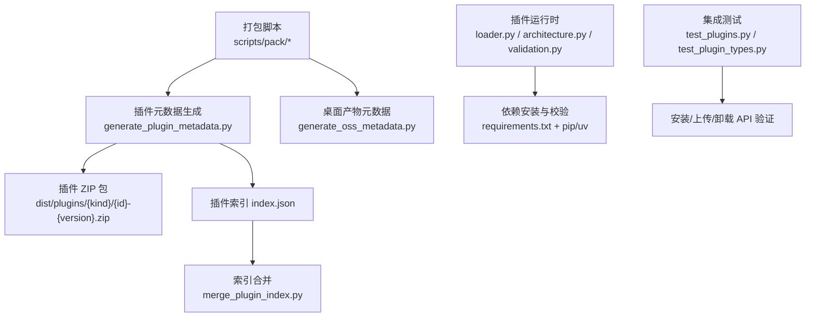
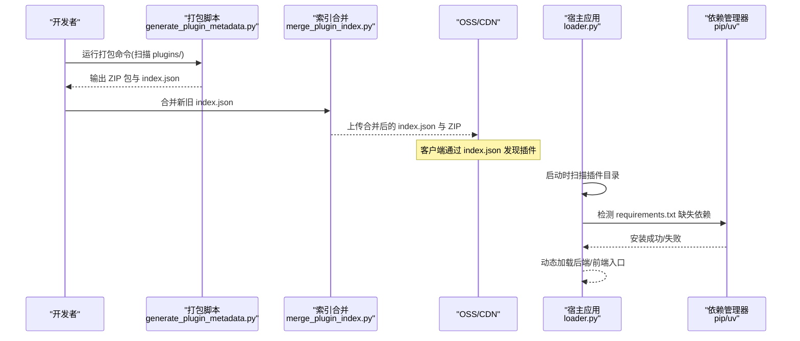
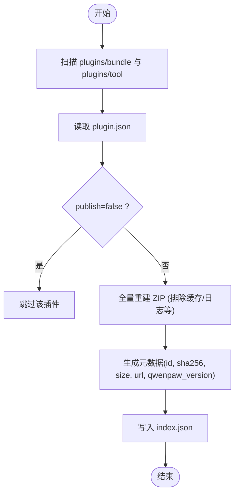
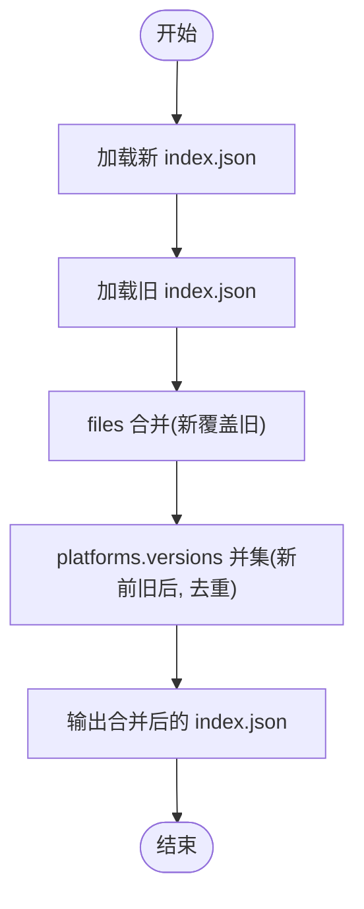
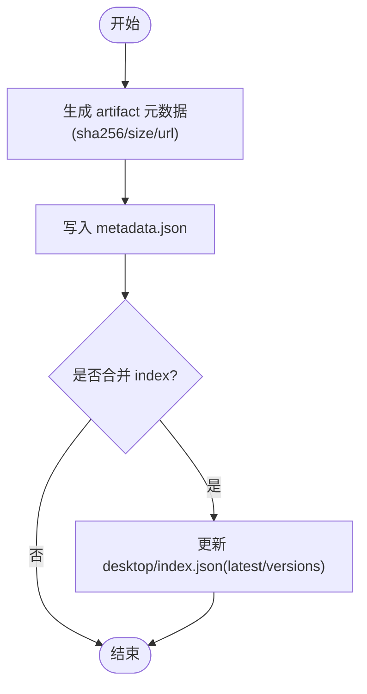
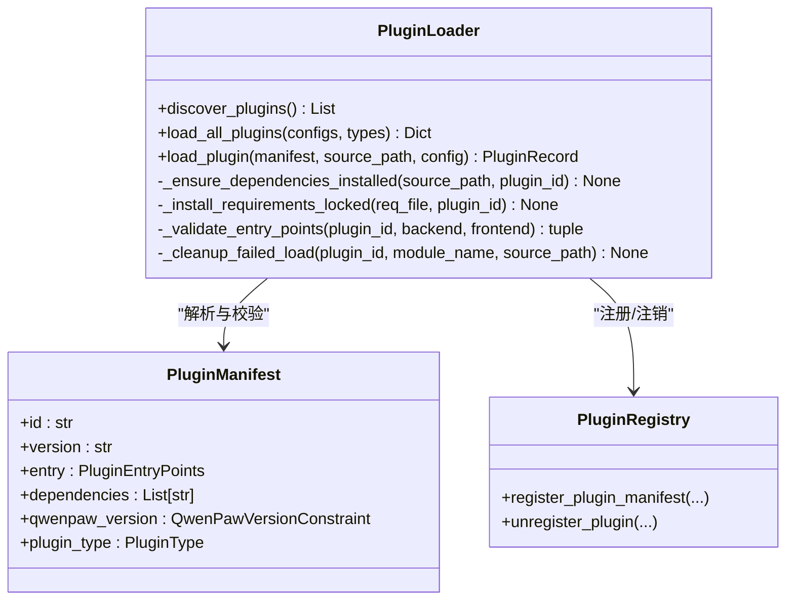
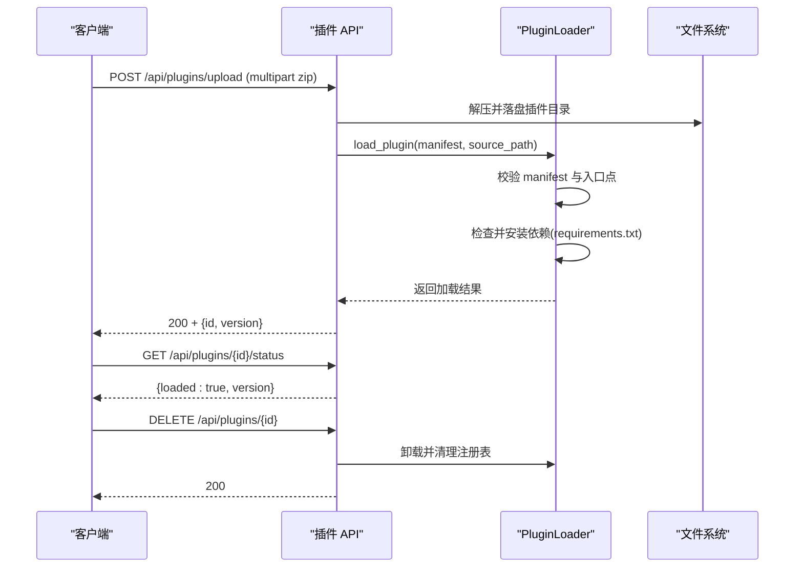
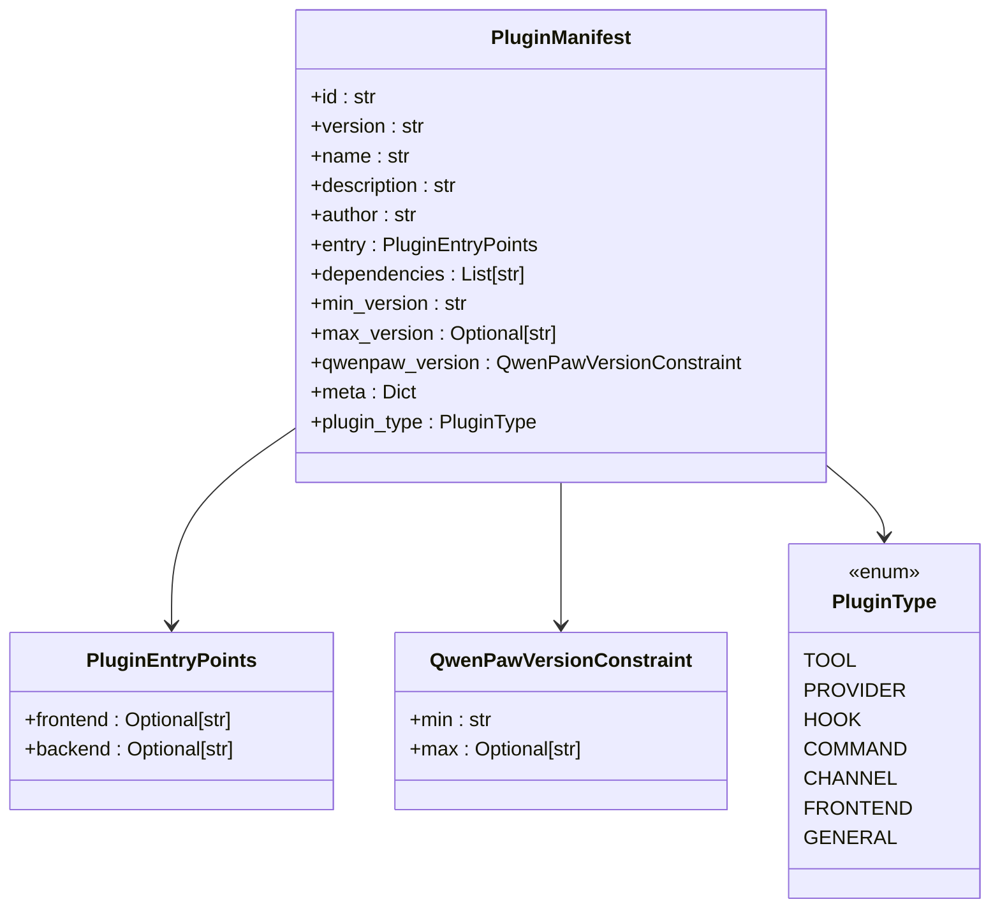
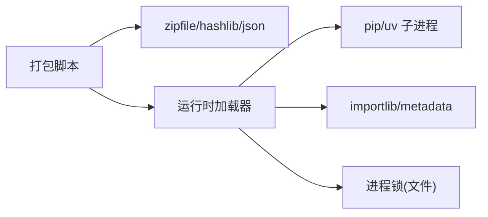

# 打包与发布

<cite>
**本文引用的文件**   
- [scripts/pack/README.md](file://scripts/pack/README.md)
- [scripts/pack/build_common.py](file://scripts/pack/build_common.py)
- [scripts/pack/generate_plugin_metadata.py](file://scripts/pack/generate_plugin_metadata.py)
- [scripts/pack/merge_plugin_index.py](file://scripts/pack/merge_plugin_index.py)
- [scripts/pack/generate_oss_metadata.py](file://scripts/pack/generate_oss_metadata.py)
- [src/qwenpaw/plugins/loader.py](file://src/qwenpaw/plugins/loader.py)
- [src/qwenpaw/plugins/architecture.py](file://src/qwenpaw/plugins/architecture.py)
- [src/qwenpaw/plugins/validation.py](file://src/qwenpaw/plugins/validation.py)
- [tests/integration/test_plugins.py](file://tests/integration/test_plugins.py)
- [tests/integration/test_plugin_types.py](file://tests/integration/test_plugin_types.py)
</cite>

## 目录
1. [简介](#简介)
2. [项目结构](#项目结构)
3. [核心组件](#核心组件)
4. [架构总览](#架构总览)
5. [详细组件分析](#详细组件分析)
6. [依赖分析](#依赖分析)
7. [性能考虑](#性能考虑)
8. [故障排查指南](#故障排查指南)
9. [结论](#结论)
10. [附录](#附录)

## 简介
本文件面向 QwenPaw 插件的打包、签名与安全扫描、版本与兼容性检查、市场发布流程、安装卸载生命周期、依赖解析与冲突解决、批量打包工具与自动化脚本，以及分发渠道与部署策略。内容基于仓库中现有脚本与运行时实现进行系统化梳理，帮助开发者完成从本地构建到云端发布的完整闭环。

## 项目结构
与“打包与发布”直接相关的代码与脚本主要分布在以下位置：
- 桌面端打包（历史 conda-pack 方案）：scripts/pack/*
- 插件元数据生成与索引合并：scripts/pack/generate_plugin_metadata.py、scripts/pack/merge_plugin_index.py
- 应用产物元数据生成：scripts/pack/generate_oss_metadata.py
- 插件加载与依赖管理：src/qwenpaw/plugins/loader.py、src/qwenpaw/plugins/architecture.py、src/qwenpaw/plugins/validation.py
- 插件安装/上传/卸载集成测试：tests/integration/test_plugins.py、tests/integration/test_plugin_types.py

图表来源
- [scripts/pack/README.md:1-99](file://scripts/pack/README.md#L1-L99)
- [scripts/pack/generate_plugin_metadata.py:1-383](file://scripts/pack/generate_plugin_metadata.py#L1-L383)
- [scripts/pack/merge_plugin_index.py:1-96](file://scripts/pack/merge_plugin_index.py#L1-L96)
- [scripts/pack/generate_oss_metadata.py:1-219](file://scripts/pack/generate_oss_metadata.py#L1-L219)
- [src/qwenpaw/plugins/loader.py:1-800](file://src/qwenpaw/plugins/loader.py#L1-L800)
- [src/qwenpaw/plugins/architecture.py:1-221](file://src/qwenpaw/plugins/architecture.py#L1-L221)
- [src/qwenpaw/plugins/validation.py:1-78](file://src/qwenpaw/plugins/validation.py#L1-L78)
- [tests/integration/test_plugins.py:1-39](file://tests/integration/test_plugins.py#L1-L39)
- [tests/integration/test_plugin_types.py:1-977](file://tests/integration/test_plugin_types.py#L1-L977)

章节来源
- [scripts/pack/README.md:1-99](file://scripts/pack/README.md#L1-L99)

## 核心组件
- 插件打包与元数据生成
  - 扫描 plugins/bundle 与 plugins/tool 下的插件目录，读取 plugin.json，按 kind 输出 ZIP 包并生成 dist/plugins/index.json。
  - 支持 publish=false 跳过发布；支持 qwenpaw_version 兼容范围声明；支持描述与名称的多语言字段。
- 桌面端产物元数据生成
  - 为桌面安装包生成 metadata.json，包含 SHA256、大小、平台、产品名等，并可合并入 desktop/index.json。
- 插件索引合并
  - 将新构建的插件索引与历史索引合并，保留旧版本，去重并按新版本优先排序。
- 插件加载与依赖管理
  - 启动时扫描插件目录，校验 manifest，按需安装 requirements.txt 中的依赖，支持 uv 回退路径，提供进程级安装锁避免并发冲突。
- 插件类型与清单模型
  - 定义 PluginType、PluginManifest、QwenPawVersionConstraint 等数据结构，支持 legacy 字段兼容与类型推断。
- 插件模块加载校验
  - 提供 validate_plugin_module 用于 CLI 校验，模拟真实加载语义，确保相对导入与导出对象正确。

章节来源
- [scripts/pack/generate_plugin_metadata.py:1-383](file://scripts/pack/generate_plugin_metadata.py#L1-L383)
- [scripts/pack/merge_plugin_index.py:1-96](file://scripts/pack/merge_plugin_index.py#L1-L96)
- [scripts/pack/generate_oss_metadata.py:1-219](file://scripts/pack/generate_oss_metadata.py#L1-L219)
- [src/qwenpaw/plugins/loader.py:1-800](file://src/qwenpaw/plugins/loader.py#L1-L800)
- [src/qwenpaw/plugins/architecture.py:1-221](file://src/qwenpaw/plugins/architecture.py#L1-L221)
- [src/qwenpaw/plugins/validation.py:1-78](file://src/qwenpaw/plugins/validation.py#L1-L78)

## 架构总览
下图展示了插件打包、元数据生成、索引合并、运行时加载与依赖管理的整体流程。

图表来源
- [scripts/pack/generate_plugin_metadata.py:1-383](file://scripts/pack/generate_plugin_metadata.py#L1-L383)
- [scripts/pack/merge_plugin_index.py:1-96](file://scripts/pack/merge_plugin_index.py#L1-L96)
- [src/qwenpaw/plugins/loader.py:1-800](file://src/qwenpaw/plugins/loader.py#L1-L800)

## 详细组件分析

### 插件打包与元数据生成
- 输入
  - 插件根目录：plugins/bundle 与 plugins/tool
  - 每个插件目录含 plugin.json（可含 publish、qwenpaw_version、name/description 多语言等）
- 处理逻辑
  - 遍历插件目录，读取 manifest，过滤 publish=false 的插件
  - 对每个插件执行全量重建 ZIP，文件名 id-version.zip，存放于 dist/plugins/{kind}/{plugin_id}/
  - 计算 SHA256、文件大小、时间戳，生成 index.json，包含 files 与 platforms.versions
- 输出
  - dist/plugins/index.json
  - 各插件 ZIP 包

图表来源
- [scripts/pack/generate_plugin_metadata.py:1-383](file://scripts/pack/generate_plugin_metadata.py#L1-L383)

章节来源
- [scripts/pack/generate_plugin_metadata.py:1-383](file://scripts/pack/generate_plugin_metadata.py#L1-L383)

### 插件索引合并
- 目的
  - 在 CI 或发布流水线中，将新构建的 index.json 与历史 index.json 合并，保留旧版本，避免覆盖导致的历史版本丢失。
- 规则
  - files：以 file_id 为键，新覆盖旧，不同 id 保留
  - platforms.{kind}.versions：取并集，新版本在前，旧版本去重追加

图表来源
- [scripts/pack/merge_plugin_index.py:1-96](file://scripts/pack/merge_plugin_index.py#L1-L96)

章节来源
- [scripts/pack/merge_plugin_index.py:1-96](file://scripts/pack/merge_plugin_index.py#L1-L96)

### 桌面端产物元数据生成
- 功能
  - 为桌面安装包生成 metadata.json，包含 id、name、description、product、platform、version、filename、url、size、sha256、updated_at、type
  - 可选合并至 desktop/index.json，维护 latest 与 versions 列表
- 适用场景
  - 桌面端发布流水线，统一产物元数据格式，便于下载页与更新器消费

图表来源
- [scripts/pack/generate_oss_metadata.py:1-219](file://scripts/pack/generate_oss_metadata.py#L1-L219)

章节来源
- [scripts/pack/generate_oss_metadata.py:1-219](file://scripts/pack/generate_oss_metadata.py#L1-L219)

### 插件运行时加载与依赖管理
- 关键能力
  - 插件发现：扫描 plugin_dirs，忽略隐藏与 .disabled 后缀目录
  - Manifest 校验：使用 Pydantic 模型，兼容 legacy 字段与类型推断
  - 版本兼容性：支持 qwenpaw_version(min/max)，左闭右开区间
  - 依赖解析：读取 requirements.txt，双探针满足性检查（importlib.metadata + importlib.util.find_spec），支持 uv 回退
  - 并发安全：按插件 ID 加进程级安装锁，避免重复安装
  - 清理机制：加载失败时回滚 sys.modules、sys.path 与注册表
- 入口点校验：要求至少存在 backend 或 frontend 之一，且文件必须存在

图表来源
- [src/qwenpaw/plugins/loader.py:1-800](file://src/qwenpaw/plugins/loader.py#L1-L800)
- [src/qwenpaw/plugins/architecture.py:1-221](file://src/qwenpaw/plugins/architecture.py#L1-L221)

章节来源
- [src/qwenpaw/plugins/loader.py:1-800](file://src/qwenpaw/plugins/loader.py#L1-L800)
- [src/qwenpaw/plugins/architecture.py:1-221](file://src/qwenpaw/plugins/architecture.py#L1-L221)

### 插件安装/上传/卸载生命周期（API）
- 安装路径
  - 本地源路径安装：POST /api/plugins/install
  - 内存 ZIP 上传：POST /api/plugins/upload
- 状态查询：GET /api/plugins/{plugin_id}/status
- 卸载：DELETE /api/plugins/{plugin_id}
- 强制替换：POST /api/plugins/upload?force=true（同 id 冲突时返回 409，带 force 则替换）
- 热加载：上传成功后立即触发加载，钩子与路由即时生效

图表来源
- [tests/integration/test_plugins.py:466-611](file://tests/integration/test_plugins.py#L466-L611)
- [tests/integration/test_plugin_types.py:256-632](file://tests/integration/test_plugin_types.py#L256-L632)
- [src/qwenpaw/plugins/loader.py:514-640](file://src/qwenpaw/plugins/loader.py#L514-L640)

章节来源
- [tests/integration/test_plugins.py:466-611](file://tests/integration/test_plugins.py#L466-L611)
- [tests/integration/test_plugin_types.py:256-632](file://tests/integration/test_plugin_types.py#L256-L632)

### 插件类型与清单模型
- 支持的插件类型：tool、provider、hook、command、channel、frontend、general
- 清单字段
  - id、version、name、description、author、entry.backend/frontend、dependencies、min_version/max_version、qwenpaw_version、meta、plugin_type
  - 兼容 legacy：name/description/author 可为多语言映射；entry_point 合并为 entry.backend；type 缺失时根据 meta 推断
- 版本约束
  - qwenpaw_version：{min, max}，左闭右开；max 省略时按 minor+1 推导

图表来源
- [src/qwenpaw/plugins/architecture.py:1-221](file://src/qwenpaw/plugins/architecture.py#L1-L221)

章节来源
- [src/qwenpaw/plugins/architecture.py:1-221](file://src/qwenpaw/plugins/architecture.py#L1-L221)

### 插件模块加载校验（CLI）
- 目标
  - 在 CLI 中快速验证插件能否被正确导入，模拟真实加载语义（命名空间、__path__、相对导入、导出对象）
- 行为
  - 若缺少后端入口抛出 FileNotFoundError
  - 若未导出 plugin 实例抛出 AttributeError
  - 校验完成后清理临时模块，避免污染进程

章节来源
- [src/qwenpaw/plugins/validation.py:1-78](file://src/qwenpaw/plugins/validation.py#L1-L78)

## 依赖分析
- 打包阶段
  - generate_plugin_metadata.py 依赖 zipfile、hashlib、json、datetime、fnmatch、shutil
  - merge_plugin_index.py 依赖 json
  - generate_oss_metadata.py 依赖 hashlib、json、datetime、pathlib
- 运行时阶段
  - loader.py 依赖 importlib、subprocess、asyncio、packaging.requirements、logging、threading
  - architecture.py 依赖 pydantic、dataclasses、enum、typing
  - validation.py 依赖 importlib、sys、pathlib
- 外部交互
  - 插件依赖安装通过 pip 或 uv 执行，可能涉及网络访问
  - 桌面端打包脚本 build_common.py 使用 conda/conda-pack 创建隔离环境并打包

图表来源
- [scripts/pack/generate_plugin_metadata.py:1-383](file://scripts/pack/generate_plugin_metadata.py#L1-L383)
- [scripts/pack/merge_plugin_index.py:1-96](file://scripts/pack/merge_plugin_index.py#L1-L96)
- [scripts/pack/generate_oss_metadata.py:1-219](file://scripts/pack/generate_oss_metadata.py#L1-L219)
- [src/qwenpaw/plugins/loader.py:1-800](file://src/qwenpaw/plugins/loader.py#L1-L800)

章节来源
- [scripts/pack/generate_plugin_metadata.py:1-383](file://scripts/pack/generate_plugin_metadata.py#L1-L383)
- [scripts/pack/merge_plugin_index.py:1-96](file://scripts/pack/merge_plugin_index.py#L1-L96)
- [scripts/pack/generate_oss_metadata.py:1-219](file://scripts/pack/generate_oss_metadata.py#L1-L219)
- [src/qwenpaw/plugins/loader.py:1-800](file://src/qwenpaw/plugins/loader.py#L1-L800)

## 性能考虑
- 插件打包
  - 全量重建 ZIP 保证一致性，但会随插件规模增大而变慢；建议仅变更插件时增量构建，或在 CI 中缓存依赖与中间产物
- 依赖安装
  - 双探针减少误判导致的重复安装；进程级安装锁避免并发风暴；uv 回退提升在无 pip 环境的可用性
- 索引合并
  - 合并操作为 O(n) 级别，通常开销较小；注意保持版本号有序与去重

[本节为通用指导，不直接分析具体文件]

## 故障排查指南
- 插件无法加载
  - 检查 plugin.json 是否包含必要字段与正确的 entry 路径
  - 查看后端入口是否存在，是否导出 plugin 实例
  - 确认 qwenpaw_version 是否与当前宿主版本兼容
- 依赖安装失败
  - 确认 requirements.txt 语法正确
  - 检查 pip/uv 是否可用，网络是否可达
  - 观察日志中是否有超时或权限问题
- 并发安装冲突
  - 确认安装锁文件是否被其他进程占用
  - 等待锁释放后重试，或清理残留锁文件
- 桌面端打包异常
  - 参考 README 中的调试方法，从终端运行 .app 查看完整错误栈
  - 检查 OpenSSL 版本限制与 conda-unpack 已知问题

章节来源
- [src/qwenpaw/plugins/loader.py:322-354](file://src/qwenpaw/plugins/loader.py#L322-L354)
- [scripts/pack/README.md:51-79](file://scripts/pack/README.md#L51-L79)

## 结论
QwenPaw 的插件体系提供了完善的打包、元数据生成、索引合并与运行时加载能力。通过严格的清单校验、版本兼容性检查与依赖解析，结合进程级安装锁与 uv 回退，确保了插件生态的稳定与安全。配合集成测试覆盖安装/上传/卸载全流程，开发者可以高效地构建、发布与维护插件。

[本节为总结，不直接分析具体文件]

## 附录

### 打包流程与文件格式要求
- 插件目录结构
  - 每个插件一个目录，包含 plugin.json 与后端/前端入口文件
  - 可选 requirements.txt 声明 Python 依赖
- 元数据字段
  - id、version、name、description、author、entry.backend/frontend、dependencies、qwenpaw_version、meta、plugin_type
  - 支持 publish=false 跳过发布
- 输出产物
  - dist/plugins/{kind}/{plugin_id}/{plugin_id}-{version}.zip
  - dist/plugins/index.json（files 与 platforms.versions）

章节来源
- [scripts/pack/generate_plugin_metadata.py:1-383](file://scripts/pack/generate_plugin_metadata.py#L1-L383)

### 插件签名与安全扫描机制
- 安全扫描
  - 仓库文档提及 Skill Scanner 与 Tool Guard 等安全能力，用于静态分析与运行时防护
- 签名
  - 仓库未提供插件签名相关脚本或配置；如需引入签名，可在打包阶段增加签名步骤并在加载阶段进行校验

章节来源
- [website/public/release-notes/v0.1.0.md:8-12](file://website/public/release-notes/v0.1.0.md#L8-L12)

### 版本管理与兼容性检查
- 插件侧
  - 使用 qwenpaw_version 声明兼容范围（min/max），支持 legacy min_version/max_version 自动合成
- 宿主侧
  - 加载时调用兼容性检查函数，不兼容则标记 disabled 并记录诊断信息

章节来源
- [src/qwenpaw/plugins/architecture.py:100-188](file://src/qwenpaw/plugins/architecture.py#L100-L188)
- [src/qwenpaw/plugins/loader.py:192-207](file://src/qwenpaw/plugins/loader.py#L192-L207)

### 插件市场发布流程
- 本地构建
  - 运行 generate_plugin_metadata.py 生成 ZIP 与 index.json
- 合并历史
  - 使用 merge_plugin_index.py 合并历史 index.json，保留旧版本
- 上传 CDN/OSS
  - 将 ZIP 与 index.json 上传至指定路径（由 --cdn-prefix 控制 URL 前缀）
- 审核与分发
  - 仓库未提供审核流程脚本；建议在 CI 中加入自动化校验与人工审核环节

章节来源
- [scripts/pack/generate_plugin_metadata.py:226-287](file://scripts/pack/generate_plugin_metadata.py#L226-L287)
- [scripts/pack/merge_plugin_index.py:28-56](file://scripts/pack/merge_plugin_index.py#L28-L56)

### 插件安装与卸载的生命周期管理
- 安装
  - 支持本地路径安装与 ZIP 上传两种路径
  - 安装后热加载，注册路由、钩子、工具等
- 卸载
  - 删除已加载插件的注册信息与模块引用，清理 sys.path 与 sys.modules
- 状态查询
  - 提供 /api/plugins/{id}/status 接口查询 loaded 与 version

章节来源
- [tests/integration/test_plugins.py:466-611](file://tests/integration/test_plugins.py#L466-L611)
- [src/qwenpaw/plugins/loader.py:460-513](file://src/qwenpaw/plugins/loader.py#L460-L513)

### 插件依赖解析与冲突解决机制
- 依赖解析
  - 读取 requirements.txt，使用 importlib.metadata 与 find_spec 双重探测
  - 支持 uv 作为 pip 不可用时的回退
- 冲突解决
  - 进程级安装锁避免同一插件并发安装
  - 获取锁后再次探测，避免重复安装

章节来源
- [src/qwenpaw/plugins/loader.py:209-268](file://src/qwenpaw/plugins/loader.py#L209-L268)
- [src/qwenpaw/plugins/loader.py:306-334](file://src/qwenpaw/plugins/loader.py#L306-L334)

### 批量打包工具与自动化脚本使用方法
- 一键打包（桌面端，历史方案）
  - macOS：bash scripts/pack/build_macos.sh
  - Windows：./scripts/pack/build_win.ps1
  - 内部流程：构建 wheel → 临时 conda 环境 → conda-pack → 产出 .app 或 NSIS 安装包
- 插件打包
  - python scripts/pack/generate_plugin_metadata.py --plugins-root plugins --dist dist/plugins
  - python scripts/pack/merge_plugin_index.py --new dist/plugins/index.json --old existing-index.json --out dist/plugins/index.json
- 桌面产物元数据
  - python scripts/pack/generate_oss_metadata.py --file <artifact> --product desktop --platform win --version <ver> --output metadata.json

章节来源
- [scripts/pack/README.md:29-99](file://scripts/pack/README.md#L29-L99)
- [scripts/pack/build_common.py:75-252](file://scripts/pack/build_common.py#L75-L252)
- [scripts/pack/generate_plugin_metadata.py:290-383](file://scripts/pack/generate_plugin_metadata.py#L290-L383)
- [scripts/pack/merge_plugin_index.py:59-96](file://scripts/pack/merge_plugin_index.py#L59-L96)
- [scripts/pack/generate_oss_metadata.py:157-219](file://scripts/pack/generate_oss_metadata.py#L157-L219)

### 插件分发渠道与部署策略
- 分发渠道
  - 插件 ZIP 与 index.json 上传至 CDN/OSS，客户端通过 index.json 拉取
  - 桌面端安装包元数据生成并合并至 desktop/index.json，供下载页与更新器消费
- 部署策略
  - 建议使用 CI 流水线进行构建、合并、上传与发布
  - 保留历史版本，支持回滚与灰度发布

章节来源
- [scripts/pack/generate_oss_metadata.py:117-154](file://scripts/pack/generate_oss_metadata.py#L117-L154)
- [scripts/pack/generate_plugin_metadata.py:226-287](file://scripts/pack/generate_plugin_metadata.py#L226-L287)