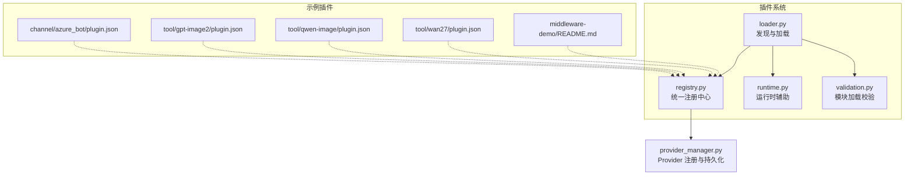
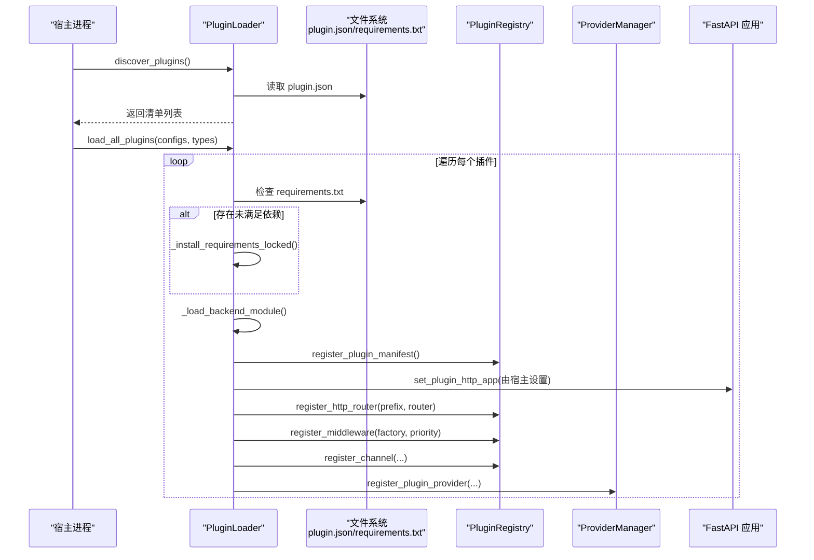
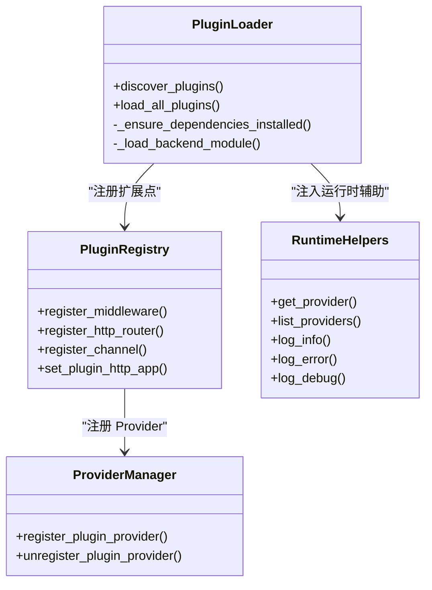

# 插件开发指南

<cite>
**本文引用的文件**   
- [src/qwenpaw/plugins/__init__.py](file://src/qwenpaw/plugins/__init__.py)
- [src/qwenpaw/plugins/loader.py](file://src/qwenpaw/plugins/loader.py)
- [src/qwenpaw/plugins/registry.py](file://src/qwenpaw/plugins/registry.py)
- [src/qwenpaw/plugins/runtime.py](file://src/qwenpaw/plugins/runtime.py)
- [src/qwenpaw/plugins/validation.py](file://src/qwenpaw/plugins/validation.py)
- [plugins/channel/azure_bot/plugin.json](file://plugins/channel/azure_bot/plugin.json)
- [plugins/tool/gpt-image2/plugin.json](file://plugins/tool/gpt-image2/plugin.json)
- [plugins/tool/qwen-image/plugin.json](file://plugins/tool/qwen-image/plugin.json)
- [plugins/tool/wan27/plugin.json](file://plugins/tool/wan27/plugin.json)
- [plugins/middleware-demo/README.md](file://plugins/middleware-demo/README.md)
- [src/qwenpaw/providers/provider_manager.py](file://src/qwenpaw/providers/provider_manager.py)
</cite>

## 目录
1. [简介](#简介)
2. [项目结构](#项目结构)
3. [核心组件](#核心组件)
4. [架构总览](#架构总览)
5. [详细组件分析](#详细组件分析)
6. [依赖关系分析](#依赖关系分析)
7. [性能考虑](#性能考虑)
8. [故障排查指南](#故障排查指南)
9. [结论](#结论)
10. [附录](#附录)

## 简介
本指南面向希望在 QwenPaw 中开发插件的开发者，覆盖从项目初始化、清单与依赖管理、目录规范到实现工具、渠道适配器、中间件等扩展点的全流程。文档同时提供调试技巧、日志记录、错误处理与性能优化建议，并说明插件注册、安全扫描与发布相关要点，帮助初学者快速上手，也为有经验的开发者提供深入的技术细节。

## 项目结构
QwenPaw 插件系统位于 src/qwenpaw/plugins 下，包含加载器、注册表、运行时辅助与校验工具；示例插件位于 plugins 目录（如 channel、tool、middleware-demo）。

图表来源
- [src/qwenpaw/plugins/loader.py:119-640](file://src/qwenpaw/plugins/loader.py#L119-L640)
- [src/qwenpaw/plugins/registry.py:129-300](file://src/qwenpaw/plugins/registry.py#L129-L300)
- [src/qwenpaw/plugins/runtime.py:10-68](file://src/qwenpaw/plugins/runtime.py#L10-L68)
- [src/qwenpaw/plugins/validation.py:15-78](file://src/qwenpaw/plugins/validation.py#L15-L78)
- [plugins/channel/azure_bot/plugin.json:1-25](file://plugins/channel/azure_bot/plugin.json#L1-L25)
- [plugins/tool/gpt-image2/plugin.json:1-96](file://plugins/tool/gpt-image2/plugin.json#L1-L96)
- [plugins/tool/qwen-image/plugin.json:1-136](file://plugins/tool/qwen-image/plugin.json#L1-L136)
- [plugins/tool/wan27/plugin.json:1-129](file://plugins/tool/wan27/plugin.json#L1-L129)
- [plugins/middleware-demo/README.md:1-58](file://plugins/middleware-demo/README.md#L1-L58)
- [src/qwenpaw/providers/provider_manager.py:2363-2482](file://src/qwenpaw/providers/provider_manager.py#L2363-L2482)

章节来源
- [src/qwenpaw/plugins/__init__.py:1-17](file://src/qwenpaw/plugins/__init__.py#L1-L17)
- [src/qwenpaw/plugins/loader.py:119-640](file://src/qwenpaw/plugins/loader.py#L119-L640)
- [src/qwenpaw/plugins/registry.py:129-300](file://src/qwenpaw/plugins/registry.py#L129-L300)
- [src/qwenpaw/plugins/runtime.py:10-68](file://src/qwenpaw/plugins/runtime.py#L10-L68)
- [src/qwenpaw/plugins/validation.py:15-78](file://src/qwenpaw/plugins/validation.py#L15-L78)
- [plugins/channel/azure_bot/plugin.json:1-25](file://plugins/channel/azure_bot/plugin.json#L1-L25)
- [plugins/tool/gpt-image2/plugin.json:1-96](file://plugins/tool/gpt-image2/plugin.json#L1-L96)
- [plugins/tool/qwen-image/plugin.json:1-136](file://plugins/tool/qwen-image/plugin.json#L1-L136)
- [plugins/tool/wan27/plugin.json:1-129](file://plugins/tool/wan27/plugin.json#L1-L129)
- [plugins/middleware-demo/README.md:1-58](file://plugins/middleware-demo/README.md#L1-L58)
- [src/qwenpaw/providers/provider_manager.py:2363-2482](file://src/qwenpaw/providers/provider_manager.py#L2363-L2482)

## 核心组件
- 插件加载器（PluginLoader）：负责发现 plugin.json、解析清单、检查版本兼容、安装依赖、动态导入后端入口并调用 register(api)。
- 插件注册表（PluginRegistry）：集中管理 Provider、Hook、HTTP 路由、中间件工厂、渠道、提示词片段与控制命令等扩展点。
- 运行时辅助（RuntimeHelpers）：为插件提供获取 Provider、列出 Provider、日志输出等能力。
- 模块校验（validate_plugin_module）：在 CLI 安装/校验时以与运行期一致的语义尝试导入插件模块，确保相对导入与命名空间正确。

章节来源
- [src/qwenpaw/plugins/loader.py:119-640](file://src/qwenpaw/plugins/loader.py#L119-L640)
- [src/qwenpaw/plugins/registry.py:129-300](file://src/qwenpaw/plugins/registry.py#L129-L300)
- [src/qwenpaw/plugins/runtime.py:10-68](file://src/qwenpaw/plugins/runtime.py#L10-L68)
- [src/qwenpaw/plugins/validation.py:15-78](file://src/qwenpaw/plugins/validation.py#L15-L78)

## 架构总览
下图展示了插件从发现到注册的端到端流程，以及插件如何向宿主暴露能力（Provider、HTTP 路由、中间件、渠道等）。

图表来源
- [src/qwenpaw/plugins/loader.py:132-640](file://src/qwenpaw/plugins/loader.py#L132-L640)
- [src/qwenpaw/plugins/registry.py:209-300](file://src/qwenpaw/plugins/registry.py#L209-L300)
- [src/qwenpaw/providers/provider_manager.py:2363-2482](file://src/qwenpaw/providers/provider_manager.py#L2363-L2482)

## 详细组件分析

### 清单文件 plugin.json 字段说明
以下字段来自仓库内多个真实插件清单，可作为权威参考：
- id: 插件唯一标识（例如 azure-bot、gpt-image2-tool、qwen-image-tool、wan27-tool）
- name: 显示名称
- version: 插件版本
- type: 插件类型（如 channel、tool）
- description / description_i18n: 描述与多语言描述
- author: 作者
- entry.backend: 后端入口文件（Python 模块）
- dependencies: Python 依赖列表（requirements.txt 风格）
- qwenpaw_version.min/max: 宿主版本兼容范围
- meta.tools[].config_fields: 工具配置字段定义（name、label、type、required、placeholder、help、min/max、options 等）
- meta.api_key_url / api_key_hint / model_url: 引导用户获取密钥或查看模型文档的链接

章节来源
- [plugins/channel/azure_bot/plugin.json:1-25](file://plugins/channel/azure_bot/plugin.json#L1-L25)
- [plugins/tool/gpt-image2/plugin.json:1-96](file://plugins/tool/gpt-image2/plugin.json#L1-L96)
- [plugins/tool/qwen-image/plugin.json:1-136](file://plugins/tool/qwen-image/plugin.json#L1-L136)
- [plugins/tool/wan27/plugin.json:1-129](file://plugins/tool/wan27/plugin.json#L1-L129)

### 依赖管理 requirements.txt
- 加载器会在加载插件前扫描插件目录下的 requirements.txt，检测缺失或不满足版本的依赖，并通过 pip 或 uv 安装到隔离 site-dir（桌面构建）或当前环境。
- 支持并发安装保护（按插件 ID 加锁），避免重复安装导致资源耗尽。
- 安装过程会流式打印日志，便于定位问题。

章节来源
- [src/qwenpaw/plugins/loader.py:270-335](file://src/qwenpaw/plugins/loader.py#L270-L335)
- [src/qwenpaw/plugins/loader.py:721-800](file://src/qwenpaw/plugins/loader.py#L721-L800)

### 目录结构与入口约定
- 插件根目录需包含 plugin.json。
- 若声明 entry.backend，则对应 Python 模块必须导出一个名为 plugin 的对象，且该对象需提供 register(api) 方法。
- 前端-only 插件可仅声明 entry.frontend。

章节来源
- [src/qwenpaw/plugins/loader.py:336-458](file://src/qwenpaw/plugins/loader.py#L336-L458)

### 自定义工具（Tool）插件
- 通过 meta.tools 声明工具元数据（名称、图标、是否要求配置、配置字段等），宿主据此渲染 UI 与表单。
- 实际工具逻辑通常在后端入口文件中实现，并在 register(api) 中完成注册。
- 示例清单展示了图像生成/编辑类工具的典型配置字段与提示文案。

章节来源
- [plugins/tool/gpt-image2/plugin.json:20-96](file://plugins/tool/gpt-image2/plugin.json#L20-L96)
- [plugins/tool/qwen-image/plugin.json:19-136](file://plugins/tool/qwen-image/plugin.json#L19-L136)
- [plugins/tool/wan27/plugin.json:19-129](file://plugins/tool/wan27/plugin.json#L19-L129)

### 渠道适配器（Channel）插件
- 通过 PluginRegistry.register_channel 注册自定义渠道，提供 channel_key、channel_class、label、description、config_fields、icon、doc_url 等。
- 示例 Azure Bot 插件清单展示了渠道型插件的典型清单结构。

章节来源
- [src/qwenpaw/plugins/registry.py:749-800](file://src/qwenpaw/plugins/registry.py#L749-L800)
- [plugins/channel/azure_bot/plugin.json:1-25](file://plugins/channel/azure_bot/plugin.json#L1-L25)

### 中间件（Middleware）插件
- 使用 PluginApi.register_middleware 注册中间件工厂，工厂在每个请求组装阶段被调用，返回 MiddlewareBase 实例或 None。
- 优先级越小越外层执行（洋葱模型）。
- middleware-demo 提供了 tracing-middleware 与 thinking-log-middleware 两个示例，分别演示 on_acting 与 on_reasoning 钩子。

章节来源
- [src/qwenpaw/plugins/registry.py:171-207](file://src/qwenpaw/plugins/registry.py#L171-L207)
- [plugins/middleware-demo/README.md:1-58](file://plugins/middleware-demo/README.md#L1-L58)

### HTTP 路由挂载
- 插件可通过 register_http_router 将 APIRouter 挂载到 /api/<prefix>，并确保在控制台 SPA 捕获路由之前匹配。
- 注册时会进行前缀合法性与冲突检查，并自动更新 OpenAPI schema。

章节来源
- [src/qwenpaw/plugins/registry.py:209-300](file://src/qwenpaw/plugins/registry.py#L209-L300)

### Provider 注册与持久化
- 插件可将 Provider 注册到宿主，宿主将其信息合并到 ProviderInfo 并持久化到 plugin_path/{provider_id}.json，敏感字段加密存储。
- 卸载时仅从内存移除，保留磁盘配置以便重装后恢复。

章节来源
- [src/qwenpaw/providers/provider_manager.py:2363-2482](file://src/qwenpaw/providers/provider_manager.py#L2363-L2482)

### 运行时辅助 RuntimeHelpers
- 提供 get_provider、list_providers、log_info/log_error/log_debug 等方法，供插件在运行期访问宿主能力与日志。

章节来源
- [src/qwenpaw/plugins/runtime.py:10-68](file://src/qwenpaw/plugins/runtime.py#L10-L68)

### 模块加载校验 validate_plugin_module
- 在 CLI 安装/校验时，以与运行期一致的语义尝试导入插件模块，确保相对导入与命名空间正确，失败时清理临时模块。

章节来源
- [src/qwenpaw/plugins/validation.py:15-78](file://src/qwenpaw/plugins/validation.py#L15-L78)

## 依赖关系分析
- loader.py 依赖 registry.py、architecture.py、api.py 与 packaging.requirements，负责发现、校验与加载。
- registry.py 作为单例集中管理所有扩展点，并与 FastAPI 应用集成挂载路由。
- provider_manager.py 负责 Provider 的注册、持久化与合并，插件通过注册表间接与之交互。

图表来源
- [src/qwenpaw/plugins/loader.py:119-640](file://src/qwenpaw/plugins/loader.py#L119-L640)
- [src/qwenpaw/plugins/registry.py:129-300](file://src/qwenpaw/plugins/registry.py#L129-L300)
- [src/qwenpaw/plugins/runtime.py:10-68](file://src/qwenpaw/plugins/runtime.py#L10-L68)
- [src/qwenpaw/providers/provider_manager.py:2363-2482](file://src/qwenpaw/providers/provider_manager.py#L2363-L2482)

章节来源
- [src/qwenpaw/plugins/loader.py:119-640](file://src/qwenpaw/plugins/loader.py#L119-L640)
- [src/qwenpaw/plugins/registry.py:129-300](file://src/qwenpaw/plugins/registry.py#L129-L300)
- [src/qwenpaw/plugins/runtime.py:10-68](file://src/qwenpaw/plugins/runtime.py#L10-L68)
- [src/qwenpaw/providers/provider_manager.py:2363-2482](file://src/qwenpaw/providers/provider_manager.py#L2363-L2482)

## 性能考虑
- 依赖安装采用 per-plugin 锁与二次探测，避免并发重复安装导致的内存风暴。
- 安装过程异步线程执行，不阻塞事件循环。
- 插件路由插入在 SPA 捕获路由之前，减少不必要的匹配开销。
- 中间件工厂按需创建，结合优先级控制洋葱模型层数，避免过度嵌套。

章节来源
- [src/qwenpaw/plugins/loader.py:306-335](file://src/qwenpaw/plugins/loader.py#L306-L335)
- [src/qwenpaw/plugins/loader.py:721-800](file://src/qwenpaw/plugins/loader.py#L721-L800)
- [src/qwenpaw/plugins/registry.py:29-52](file://src/qwenpaw/plugins/registry.py#L29-L52)
- [src/qwenpaw/plugins/registry.py:171-207](file://src/qwenpaw/plugins/registry.py#L171-L207)

## 故障排查指南
- 清单无效或缺少必要字段：检查 plugin.json 必填项与版本兼容范围。
- 入口文件不存在或未导出 plugin.register：确认 entry.backend 指向的文件存在，且模块导出 plugin 对象并提供 register(api)。
- 依赖安装失败或超时：查看安装日志，确认网络与镜像源；必要时手动安装依赖或使用 uv。
- 路由冲突或前缀非法：确保 prefix 合法且不与其他插件冲突。
- Provider 配置丢失：确认 plugin_path 下配置文件权限与加密字段读写正常。

章节来源
- [src/qwenpaw/plugins/loader.py:336-458](file://src/qwenpaw/plugins/loader.py#L336-L458)
- [src/qwenpaw/plugins/loader.py:721-800](file://src/qwenpaw/plugins/loader.py#L721-L800)
- [src/qwenpaw/plugins/registry.py:209-300](file://src/qwenpaw/plugins/registry.py#L209-L300)
- [src/qwenpaw/providers/provider_manager.py:2363-2482](file://src/qwenpaw/providers/provider_manager.py#L2363-L2482)

## 结论
QwenPaw 插件体系通过清晰的清单与注册机制，将工具、渠道、中间件、Provider 与 HTTP 路由等扩展点统一管理。借助严格的依赖管理与并发安全策略，插件可在不同环境中稳定运行。遵循本文档的规范与实践，可高效完成插件开发与部署。

## 附录

### 插件开发工作流程（从零到部署）
- 初始化插件目录，编写 plugin.json 清单，声明 id、name、version、type、entry.backend、dependencies、qwenpaw_version 等。
- 如需工具，补充 meta.tools 与 config_fields，用于 UI 配置表单。
- 编写后端入口模块，导出 plugin 对象并实现 register(api)，在其中注册工具、中间件、渠道、HTTP 路由或 Provider。
- 在插件目录下添加 requirements.txt，声明第三方依赖。
- 使用 CLI 安装与验证插件（如 qwenpaw plugin install/validate），观察日志定位问题。
- 本地测试通过后，打包并发布至内部市场或分发渠道。

章节来源
- [plugins/channel/azure_bot/plugin.json:1-25](file://plugins/channel/azure_bot/plugin.json#L1-L25)
- [plugins/tool/gpt-image2/plugin.json:1-96](file://plugins/tool/gpt-image2/plugin.json#L1-L96)
- [plugins/tool/qwen-image/plugin.json:1-136](file://plugins/tool/qwen-image/plugin.json#L1-L136)
- [plugins/tool/wan27/plugin.json:1-129](file://plugins/tool/wan27/plugin.json#L1-L129)
- [src/qwenpaw/plugins/loader.py:132-640](file://src/qwenpaw/plugins/loader.py#L132-L640)
- [src/qwenpaw/plugins/validation.py:15-78](file://src/qwenpaw/plugins/validation.py#L15-L78)

### 调试技巧与日志记录
- 使用 RuntimeHelpers.log_info/log_error/log_debug 输出结构化日志。
- 安装依赖时查看流式日志，定位网络或包名问题。
- 对中间件与路由注册增加关键路径日志，便于追踪请求链路。

章节来源
- [src/qwenpaw/plugins/runtime.py:44-68](file://src/qwenpaw/plugins/runtime.py#L44-L68)
- [src/qwenpaw/plugins/loader.py:672-719](file://src/qwenpaw/plugins/loader.py#L672-L719)

### 错误处理与回滚
- 插件加载失败时，加载器会清理已注册的 manifest、sys.modules 与 sys.path，保证后续重试不受影响。
- 卸载 Provider 时仅从内存移除，保留磁盘配置，避免用户配置丢失。

章节来源
- [src/qwenpaw/plugins/loader.py:460-513](file://src/qwenpaw/plugins/loader.py#L460-L513)
- [src/qwenpaw/providers/provider_manager.py:2457-2482](file://src/qwenpaw/providers/provider_manager.py#L2457-L2482)

### 安全与签名
- 插件清单与依赖声明是安全基线；建议在 CI 中校验清单字段与依赖来源。
- Provider 配置中的敏感字段会被加密存储，注意权限控制与备份安全。
- 签名与发布流程请参考仓库内的打包脚本与发布工作流（不在本文直接分析范围内）。

章节来源
- [src/qwenpaw/providers/provider_manager.py:1855-1894](file://src/qwenpaw/providers/provider_manager.py#L1855-L1894)