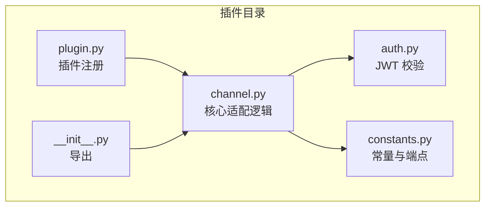
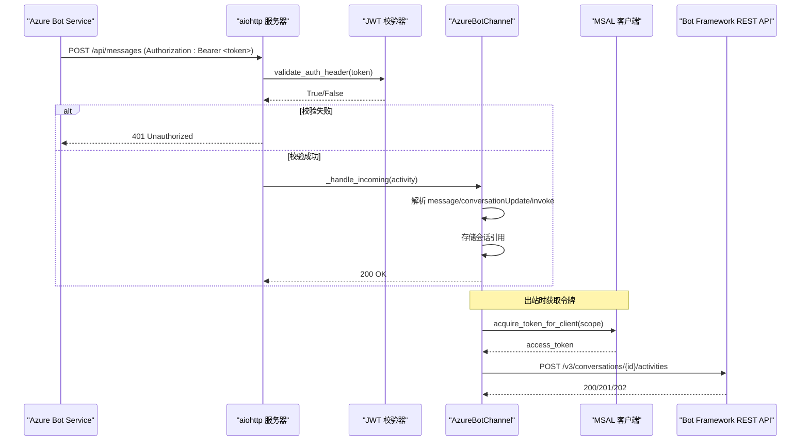
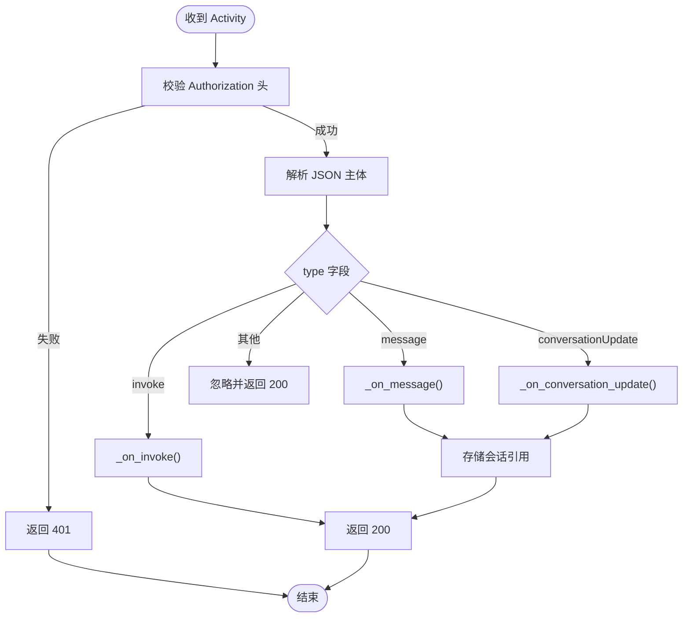
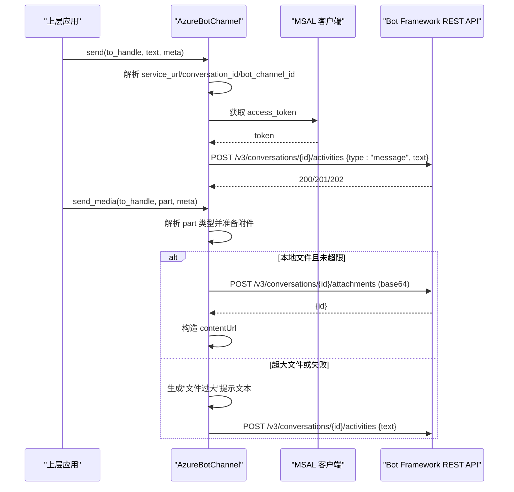
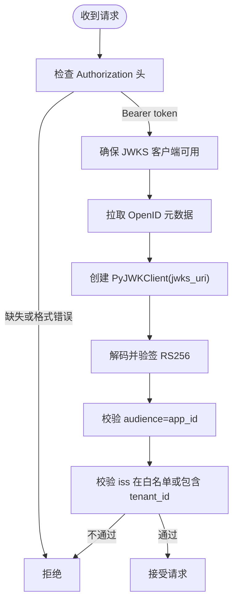
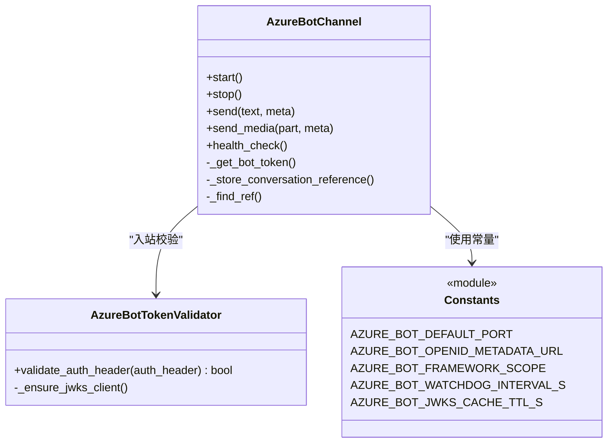

# Azure Bot 渠道适配器

<cite>
**本文引用的文件**   
- [channel.py](file://plugins/channel/azure_bot/channel.py)
- [auth.py](file://plugins/channel/azure_bot/auth.py)
- [constants.py](file://plugins/channel/azure_bot/constants.py)
- [plugin.py](file://plugins/channel/azure_bot/plugin.py)
- [__init__.py](file://plugins/channel/azure_bot/__init__.py)
</cite>

## 目录
1. [简介](#简介)
2. [项目结构](#项目结构)
3. [核心组件](#核心组件)
4. [架构总览](#架构总览)
5. [详细组件分析](#详细组件分析)
6. [依赖关系分析](#依赖关系分析)
7. [性能与连接池](#性能与连接池)
8. [部署与环境配置](#部署与环境配置)
9. [错误处理与排障](#错误处理与排障)
10. [扩展指南](#扩展指南)
11. [结论](#结论)

## 简介
本技术文档面向“Azure Bot 渠道适配器”插件，系统性解析多渠道接入系统的实现细节。重点覆盖：
- Azure Bot Service 的认证流程（入站 JWT 校验、出站 MSAL 令牌获取）
- 消息收发协议（Bot Framework Activity 模型、REST API 调用）
- 状态管理机制（会话引用持久化、群聊共享上下文策略）
- channel.py 中的核心适配逻辑（消息格式转换、事件分发、附件上传/下载）
- auth.py 中的 OAuth/JWT 验证实现（JWKS 缓存、签发者校验）
- constants.py 的配置常量与协议端点
- 部署配置、环境变量、调试方法
- 错误处理策略、连接池管理与性能优化建议
- 如何扩展支持更多 Azure Bot 特性与自定义消息类型

## 项目结构
该插件位于 plugins/channel/azure_bot 目录下，采用“按功能模块拆分”的组织方式：
- channel.py：核心通道适配类，负责 HTTP 服务、消息收发、会话管理、媒体处理、令牌管理等
- auth.py：入站请求的 JWT 校验器，基于 OpenID 元数据动态拉取 JWKS
- constants.py：端口、OpenID 元数据地址、API scope、健康检查间隔等常量
- plugin.py：插件注册入口，定义 UI 表单字段与说明
- __init__.py：对外导出主类

图表来源
- [channel.py:1-120](file://plugins/channel/azure_bot/channel.py#L1-L120)
- [auth.py:1-60](file://plugins/channel/azure_bot/auth.py#L1-L60)
- [constants.py:1-20](file://plugins/channel/azure_bot/constants.py#L1-L20)
- [plugin.py:1-60](file://plugins/channel/azure_bot/plugin.py#L1-L60)
- [__init__.py:1-7](file://plugins/channel/azure_bot/__init__.py#L1-L7)

章节来源
- [channel.py:1-120](file://plugins/channel/azure_bot/channel.py#L1-L120)
- [auth.py:1-60](file://plugins/channel/azure_bot/auth.py#L1-L60)
- [constants.py:1-20](file://plugins/channel/azure_bot/constants.py#L1-L20)
- [plugin.py:1-60](file://plugins/channel/azure_bot/plugin.py#L1-L60)
- [__init__.py:1-7](file://plugins/channel/azure_bot/__init__.py#L1-L7)

## 核心组件
- AzureBotChannel：继承自基础通道基类，提供完整的 Azure Bot Service 集成能力，包括：
  - 独立 aiohttp HTTP 服务监听 /api/messages
  - 入站 Activity 解析与分发（message、conversationUpdate、invoke）
  - 出站文本与媒体发送（通过 Bot Framework REST API）
  - 会话引用存储与持久化（JSON 文件），支持群聊共享上下文
  - 入站 JWT 校验与出站 MSAL 客户端凭据令牌获取
  - 附件下载与上传（含大小限制与回退策略）
  - 健康检查与看门狗自动重启机制
- AzureBotTokenValidator：入站 JWT 校验器，基于 OpenID 元数据动态获取 JWKS，校验签名、过期时间、受众与签发者
- 常量集：默认端口、OpenID 元数据 URL、API scope、健康检查间隔、JWKS 缓存 TTL
- 插件注册：向系统注册渠道类、UI 表单字段、帮助文案与图标

章节来源
- [channel.py:45-192](file://plugins/channel/azure_bot/channel.py#L45-L192)
- [auth.py:22-96](file://plugins/channel/azure_bot/auth.py#L22-L96)
- [constants.py:1-20](file://plugins/channel/azure_bot/constants.py#L1-L20)
- [plugin.py:11-314](file://plugins/channel/azure_bot/plugin.py#L11-L314)

## 架构总览
整体交互流程如下：
- 入站：Azure Bot Service 将 Activity 推送至 /api/messages；插件先进行 Authorization 头 JWT 校验，再解析并路由到对应处理器
- 出站：通过 Bot Framework REST API 发送文本或媒体；媒体优先使用 Upload API，失败则回退为 base64 inline
- 令牌：入站使用 JWKS 校验；出站使用 MSAL 客户端凭据模式获取 access_token，带本地缓存与过期刷新
- 会话：维护 service_url、conversation_id、bot_channel_id 等引用，支持群聊共享上下文与 DM 隔离

图表来源
- [channel.py:497-558](file://plugins/channel/azure_bot/channel.py#L497-L558)
- [auth.py:97-168](file://plugins/channel/azure_bot/auth.py#L97-L168)
- [channel.py:1311-1362](file://plugins/channel/azure_bot/channel.py#L1311-L1362)
- [channel.py:878-969](file://plugins/channel/azure_bot/channel.py#L878-L969)

## 详细组件分析

### 入站消息处理与事件分发
- 入口：POST /api/messages
- 安全前置：在读取请求体之前仅校验 Authorization 头，避免大负载缓冲
- 活动类型分发：
  - message：构建内容片段（文本、图片、音频、视频、文件），识别群组/私聊，必要时要求 @提及
  - conversationUpdate：当前为空实现，可扩展用于机器人加入聊天等场景
  - invoke：返回 200，可用于自适应卡片动作等
- 会话引用：根据 channelId、conversationId、serviceUrl、recipient.id 等信息建立引用键，区分群聊共享与 DM 隔离

图表来源
- [channel.py:497-558](file://plugins/channel/azure_bot/channel.py#L497-L558)
- [channel.py:572-692](file://plugins/channel/azure_bot/channel.py#L572-L692)
- [channel.py:813-825](file://plugins/channel/azure_bot/channel.py#L813-L825)

章节来源
- [channel.py:497-558](file://plugins/channel/azure_bot/channel.py#L497-L558)
- [channel.py:572-692](file://plugins/channel/azure_bot/channel.py#L572-L692)
- [channel.py:813-825](file://plugins/channel/azure_bot/channel.py#L813-L825)

### 附件解析与下载
- 入站附件：根据 contentType 分类为 image/video/audio/file
- 语音识别前缀：audio/ogg、audio/wav、audio/webm、audio/amr 视为语音
- 下载策略：使用 Bearer token 访问 contentUrl，保存到 media_dir；失败则回退为原始 URL
- 大小限制：入站无显式限制，但出站有严格限制（见下文）

章节来源
- [channel.py:748-811](file://plugins/channel/azure_bot/channel.py#L748-L811)
- [channel.py:693-746](file://plugins/channel/azure_bot/channel.py#L693-L746)

### 出站文本与媒体发送
- 文本发送：构造 message activity，设置 from.id（bot_channel_id）、text，携带 Authorization 头
- 媒体发送：
  - 优先调用 Upload API（/v3/conversations/{id}/attachments），成功后以 contentUrl 引用
  - 若失败或过大，回退为 base64 inline（data URI）
  - 超过阈值（约 180KB）直接发送提示文本而非附件
- 会话定位：优先从 meta 中获取 service_url、conversation_id、bot_channel_id，否则查找已保存的会话引用

图表来源
- [channel.py:878-969](file://plugins/channel/azure_bot/channel.py#L878-L969)
- [channel.py:1030-1146](file://plugins/channel/azure_bot/channel.py#L1030-L1146)
- [channel.py:1189-1305](file://plugins/channel/azure_bot/channel.py#L1189-L1305)
- [channel.py:1311-1362](file://plugins/channel/azure_bot/channel.py#L1311-L1362)

章节来源
- [channel.py:878-969](file://plugins/channel/azure_bot/channel.py#L878-L969)
- [channel.py:1030-1146](file://plugins/channel/azure_bot/channel.py#L1030-L1146)
- [channel.py:1189-1305](file://plugins/channel/azure_bot/channel.py#L1189-L1305)

### 令牌管理（出站）
- 使用 MSAL ConfidentialClientApplication 以客户端凭据模式获取 access_token
- 本地缓存 token 与过期时间，提前 60s 刷新
- 失败时记录 error_code 与 debug 级别 error_description，便于排查

章节来源
- [channel.py:1311-1362](file://plugins/channel/azure_bot/channel.py#L1311-L1362)
- [constants.py:12-13](file://plugins/channel/azure_bot/constants.py#L12-L13)

### 入站 JWT 校验（OAuth/JWT）
- 从 OpenID 元数据动态获取 jwks_uri，创建 PyJWKClient
- 校验签名（RS256）、过期时间、受众（app_id）
- 签发者白名单包含 Bot Framework 官方与租户特定 issuer，支持 tenant_id 匹配
- JWKS 缓存 TTL 降低频繁网络开销

图表来源
- [auth.py:51-96](file://plugins/channel/azure_bot/auth.py#L51-L96)
- [auth.py:97-168](file://plugins/channel/azure_bot/auth.py#L97-L168)
- [constants.py:7-10](file://plugins/channel/azure_bot/constants.py#L7-L10)

章节来源
- [auth.py:22-96](file://plugins/channel/azure_bot/auth.py#L22-L96)
- [auth.py:97-168](file://plugins/channel/azure_bot/auth.py#L97-L168)
- [constants.py:7-10](file://plugins/channel/azure_bot/constants.py#L7-L10)

### 会话管理与引用持久化
- 会话键规则：
  - 群聊：session_id（共享）
  - 私聊：session_id:user_id（隔离）
- 存储路径：workspace_dir/azure_bot_refs.json 或工作目录下的同名文件
- 写入策略：非阻塞异步任务 + 串行锁，避免并发写损坏 JSON；停止时等待未完成的任务（带超时保护）
- 恢复策略：启动时加载 refs，恢复 bot_channel_id

章节来源
- [channel.py:1424-1512](file://plugins/channel/azure_bot/channel.py#L1424-L1512)
- [channel.py:1514-1588](file://plugins/channel/azure_bot/channel.py#L1514-L1588)
- [channel.py:346-391](file://plugins/channel/azure_bot/channel.py#L346-L391)

### HTTP 服务与健康检查
- 独立 aiohttp 服务监听 http_host:http_port，默认 3978
- 看门狗循环定期探测端口连通性，异常时自动重启服务
- health_check 接口返回健康状态与详情

章节来源
- [channel.py:397-492](file://plugins/channel/azure_bot/channel.py#L397-L492)
- [channel.py:1651-1663](file://plugins/channel/azure_bot/channel.py#L1651-L1663)
- [constants.py:4-6](file://plugins/channel/azure_bot/constants.py#L4-L6)
- [constants.py:15-16](file://plugins/channel/azure_bot/constants.py#L15-L16)

### 插件注册与 UI 表单
- 注册渠道类、标签、描述、图标与文档链接
- 配置字段包括 app_id、app_password、tenant_id、http_host、http_port、media_dir、share_session_in_group、访问控制开关、@提及要求等
- 多语言帮助文案提升易用性

章节来源
- [plugin.py:11-314](file://plugins/channel/azure_bot/plugin.py#L11-L314)

## 依赖关系分析
- 外部库
  - aiohttp：HTTP 服务端与客户端
  - jwt + PyJWKClient：入站 JWT 校验与 JWKS 客户端
  - msal：出站令牌获取（客户端凭据模式）
- 内部依赖
  - BaseChannel：基础通道抽象（消息队列、会话 ID 解析、通用参数）
  - constants：端口、OpenID 元数据、scope、健康检查间隔、JWKS 缓存 TTL

图表来源
- [channel.py:45-192](file://plugins/channel/azure_bot/channel.py#L45-L192)
- [auth.py:22-96](file://plugins/channel/azure_bot/auth.py#L22-L96)
- [constants.py:1-20](file://plugins/channel/azure_bot/constants.py#L1-L20)

章节来源
- [channel.py:45-192](file://plugins/channel/azure_bot/channel.py#L45-L192)
- [auth.py:22-96](file://plugins/channel/azure_bot/auth.py#L22-L96)
- [constants.py:1-20](file://plugins/channel/azure_bot/constants.py#L1-L20)

## 性能与连接池
- HTTP 客户端复用：aiohttp.ClientSession 作为实例级单例，减少握手开销
- 令牌缓存：本地缓存 access_token 与过期时间，避免频繁网络请求
- JWKS 缓存：TTL 控制，降低 OpenID 元数据拉取频率
- 磁盘 I/O 非阻塞：refs 持久化通过线程池执行，事件循环不被阻塞
- 看门狗：周期性健康检查，异常自动重启，提高可用性
- 附件大小限制：出站附件上限约 180KB，避免大负载导致超时或失败

[本节为通用性能讨论，无需具体文件分析]

## 部署与环境配置
- 环境变量（来自 from_env 工厂方法）
  - AZURE_BOT_CHANNEL_ENABLED：是否启用（"1"/"0"）
  - AZURE_BOT_APP_ID：应用标识
  - AZURE_BOT_APP_PASSWORD：应用密钥（客户端密码）
  - AZURE_BOT_TENANT_ID：租户标识
  - AZURE_BOT_HTTP_HOST：监听主机（默认 0.0.0.0）
  - AZURE_BOT_HTTP_PORT：监听端口（默认 3978）
  - AZURE_BOT_DM_POLICY：私聊策略（open 等）
  - AZURE_BOT_GROUP_POLICY：群聊策略（open 等）
  - AZURE_BOT_ALLOW_FROM：允许列表（逗号分隔）
  - AZURE_BOT_DENY_MESSAGE：拒绝消息
  - AZURE_BOT_REQUIRE_MENTION：是否需要 @提及
  - AZURE_BOT_SHARE_SESSION_IN_GROUP：群聊共享上下文
- 配置文件（来自 from_config 工厂方法）
  - enabled、app_id、app_password、tenant_id、http_host、http_port、media_dir、dm_policy、group_policy、allow_from、deny_message、require_mention、share_session_in_group、access_control_dm、access_control_group
- 插件 UI 表单字段与帮助文案由 plugin.py 定义，支持多语言

章节来源
- [channel.py:197-330](file://plugins/channel/azure_bot/channel.py#L197-L330)
- [plugin.py:42-307](file://plugins/channel/azure_bot/plugin.py#L42-L307)

## 错误处理与排障
- 入站安全
  - Authorization 头缺失或格式错误：返回 401
  - JWT 校验失败：记录警告日志并拒绝
  - JSON 解析失败：返回 400
- 出站通信
  - 无法获取令牌：记录警告并跳过发送
  - HTTP 响应码非 2xx：记录状态与响应体摘要
  - 附件上传失败：回退为 base64 inline；超大文件发送提示文本
- 健康检查
  - 端口不可达：看门狗尝试重启服务
  - health_check 返回 unhealthy 与端口信息
- 调试建议
  - 开启 DEBUG 日志查看 MSAL 错误详情（error_description）
  - 确认 OpenID 元数据可访问（login.botframework.com）
  - 检查防火墙与端口占用（默认 3978）
  - 核对 app_id、app_password、tenant_id 与 Bot Framework 应用配置一致

章节来源
- [channel.py:497-558](file://plugins/channel/azure_bot/channel.py#L497-L558)
- [channel.py:949-969](file://plugins/channel/azure_bot/channel.py#L949-L969)
- [channel.py:1127-1146](file://plugins/channel/azure_bot/channel.py#L1127-L1146)
- [channel.py:1311-1362](file://plugins/channel/azure_bot/channel.py#L1311-L1362)
- [channel.py:448-492](file://plugins/channel/azure_bot/channel.py#L448-L492)
- [channel.py:1651-1663](file://plugins/channel/azure_bot/channel.py#L1651-L1663)

## 扩展指南
- 新增消息类型
  - 在 _parse_attachment_async 中增加新的 contentType 分支，映射到合适的 ContentPart 类型
  - 在 _resolve_attachment_for_part 中增加对应 part_type 的处理逻辑
- 支持更多 Azure Bot 特性
  - 在 _on_invoke 中实现 Adaptive Cards 动作、Teams 特定操作等
  - 在 _on_conversation_update 中处理机器人加入/移除、成员变更等事件
- 自定义消息格式
  - 在 _on_message 中扩展 entities 解析，如富文本、卡片、命令等
  - 在 build_agent_request_from_native 中注入自定义 channel_meta 字段
- 安全与访问控制
  - 在 _is_bot_mentioned 与 require_mention 策略基础上，扩展更细粒度的权限控制
  - 结合 allow_from/deny_message 与 access_control_dm/group 开关实现精细化管控

章节来源
- [channel.py:748-811](file://plugins/channel/azure_bot/channel.py#L748-L811)
- [channel.py:970-1024](file://plugins/channel/azure_bot/channel.py#L970-L1024)
- [channel.py:813-825](file://plugins/channel/azure_bot/channel.py#L813-L825)
- [channel.py:1590-1631](file://plugins/channel/azure_bot/channel.py#L1590-L1631)

## 结论
Azure Bot 渠道适配器通过独立的 aiohttp 服务与 Bot Framework REST API 完成双向通信，具备完善的入站 JWT 校验与出站令牌管理能力。其会话引用持久化、群聊共享上下文、附件上传回退与健康检查机制，使其在生产环境中具备高可用性与易维护性。借助插件注册与多语言 UI 表单，部署与配置便捷。未来可在事件处理、消息类型与访问控制方面进一步扩展，以满足更丰富的业务需求。