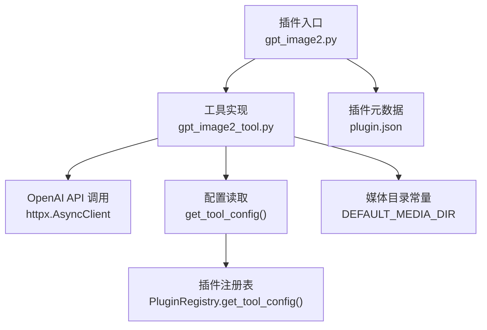
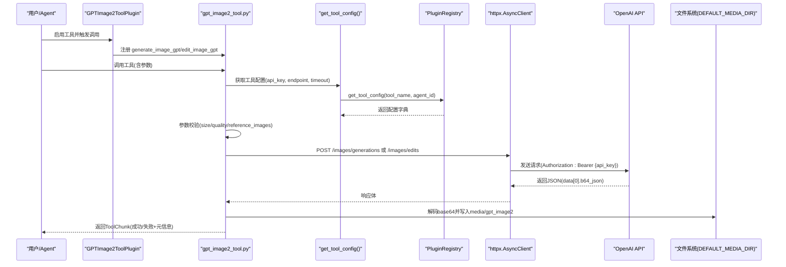
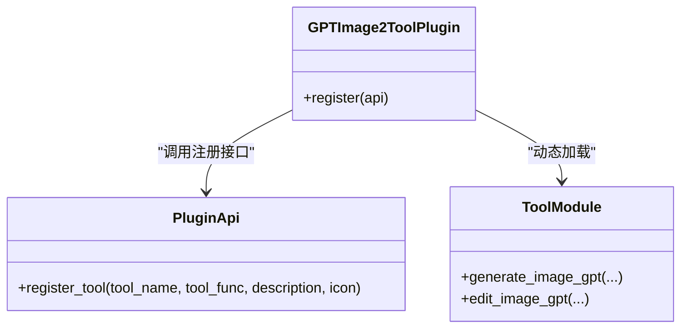
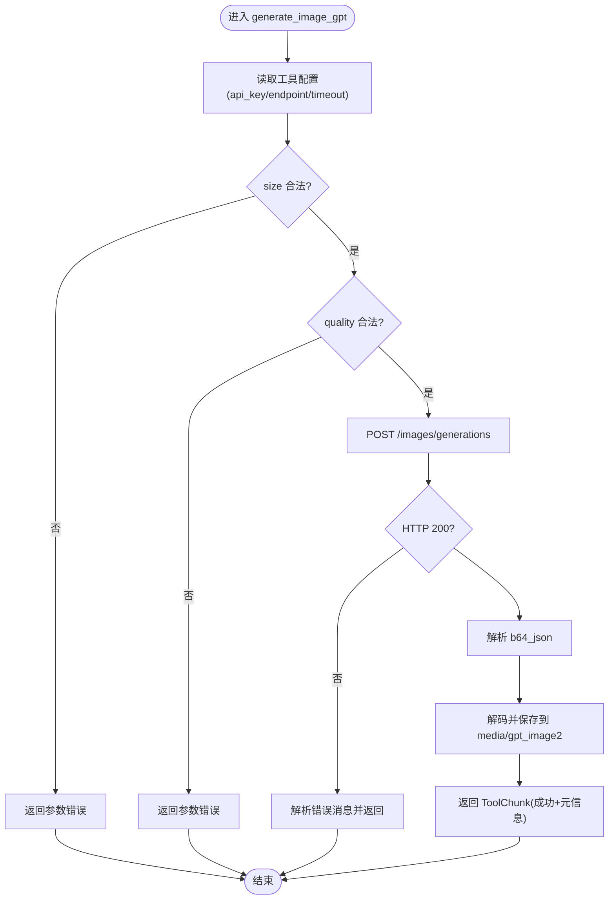
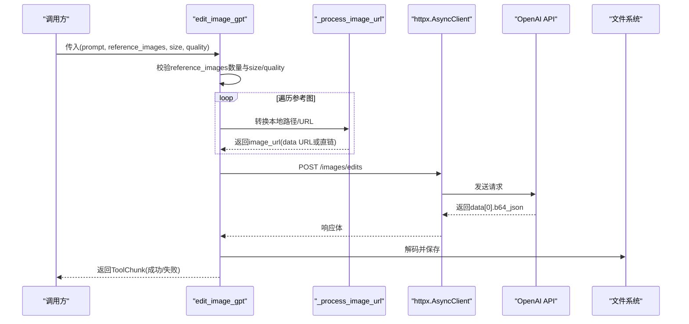
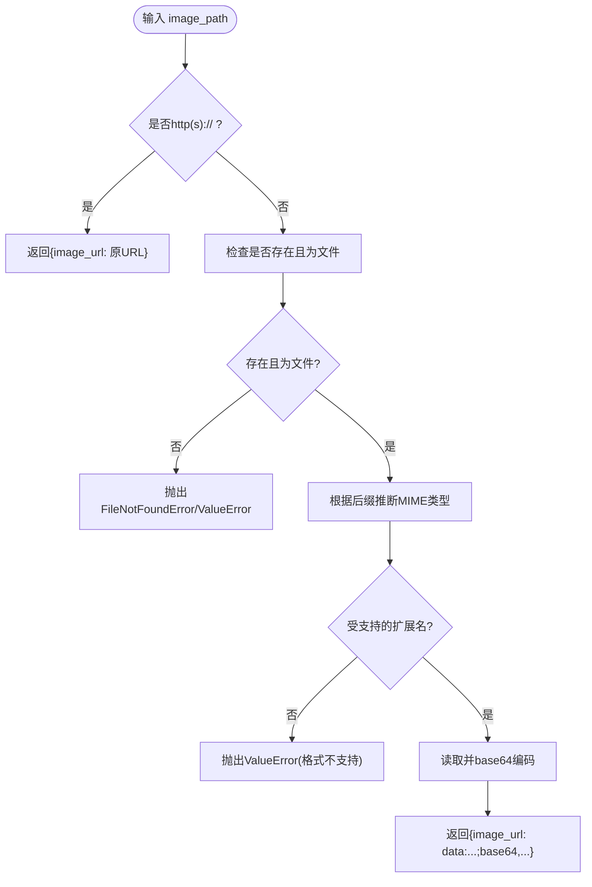
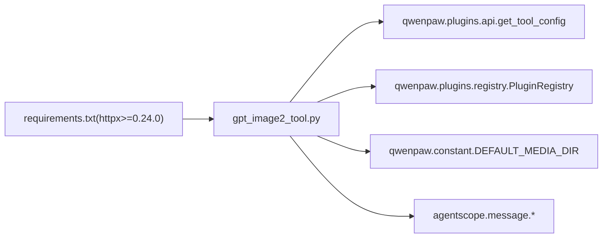

# GPT Image 2 工具插件

<cite>
**本文引用的文件列表**
- [gpt_image2.py](file://plugins/tool/gpt-image2/gpt_image2.py)
- [gpt_image2_tool.py](file://plugins/tool/gpt-image2/gpt_image2_tool.py)
- [plugin.json](file://plugins/tool/gpt-image2/plugin.json)
- [README.md](file://plugins/tool/gpt-image2/README.md)
- [requirements.txt](file://plugins/tool/gpt-image2/requirements.txt)
- [api.py](file://src/qwenpaw/plugins/api.py)
- [registry.py](file://src/qwenpaw/plugins/registry.py)
- [constant.py](file://src/qwenpaw/constant.py)
</cite>

## 目录
1. [简介](#简介)
2. [项目结构](#项目结构)
3. [核心组件](#核心组件)
4. [架构总览](#架构总览)
5. [详细组件分析](#详细组件分析)
6. [依赖关系分析](#依赖关系分析)
7. [性能与可靠性](#性能与可靠性)
8. [故障排查指南](#故障排查指南)
9. [结论](#结论)
10. [附录：配置与使用示例](#附录配置与使用示例)

## 简介
本插件为 QwenPaw 提供基于 OpenAI GPT Image 2 的图像生成与编辑能力，包含两个工具：
- generate_image_gpt：文本到图像的生成
- edit_image_gpt：基于参考图片的图像编辑或生成（支持本地文件与网络 URL）

插件采用纯后端实现，无需前端代码。通过插件注册机制将工具暴露给 Agent 调用，并在运行时读取用户配置（API Key、自定义端点、超时等），完成对 OpenAI API 的封装调用、参数校验、错误处理与结果落盘。

## 项目结构
该插件位于 plugins/tool/gpt-image2 目录下，核心文件如下：
- gpt_image2.py：插件入口，负责动态加载工具模块并注册工具
- gpt_image2_tool.py：工具函数实现（generate_image_gpt、edit_image_gpt、_process_image_url）
- plugin.json：插件元数据与工具配置字段定义
- requirements.txt：运行依赖声明
- README.md：安装、配置与使用说明

图表来源
- [gpt_image2.py:27-63](file://plugins/tool/gpt-image2/gpt_image2.py#L27-L63)
- [gpt_image2_tool.py:22-256](file://plugins/tool/gpt-image2/gpt_image2_tool.py#L22-L256)
- [gpt_image2_tool.py:259-554](file://plugins/tool/gpt-image2/gpt_image2_tool.py#L259-L554)
- [gpt_image2_tool.py:557-605](file://plugins/tool/gpt-image2/gpt_image2_tool.py#L557-L605)
- [plugin.json:1-96](file://plugins/tool/gpt-image2/plugin.json#L1-L96)
- [api.py:11-46](file://src/qwenpaw/plugins/api.py#L11-L46)
- [registry.py:1019-1087](file://src/qwenpaw/plugins/registry.py#L1019-L1087)
- [constant.py:158-159](file://src/qwenpaw/constant.py#L158-L159)

章节来源
- [gpt_image2.py:1-64](file://plugins/tool/gpt-image2/gpt_image2.py#L1-L64)
- [gpt_image2_tool.py:1-605](file://plugins/tool/gpt-image2/gpt_image2_tool.py#L1-L605)
- [plugin.json:1-96](file://plugins/tool/gpt-image2/plugin.json#L1-L96)
- [README.md:1-149](file://plugins/tool/gpt-image2/README.md#L1-L149)
- [requirements.txt:1-2](file://plugins/tool/gpt-image2/requirements.txt#L1-L2)
- [api.py:11-46](file://src/qwenpaw/plugins/api.py#L11-L46)
- [registry.py:1019-1087](file://src/qwenpaw/plugins/registry.py#L1019-L1087)
- [constant.py:158-159](file://src/qwenpaw/constant.py#L158-L159)

## 核心组件
- 插件入口类 GPTImage2ToolPlugin：在 register 中动态加载工具模块，并将 generate_image_gpt 与 edit_image_gpt 注册到 Agent 工具集。
- 工具函数：
  - generate_image_gpt：文本到图像生成，支持 size 与 quality 参数校验，调用 OpenAI /images/generations，返回 base64 解码后的图片并保存到默认媒体目录。
  - edit_image_gpt：基于参考图片的编辑/生成，支持 1-16 张参考图，支持本地路径与网络 URL，调用 OpenAI /images/edits，返回 base64 解码后的图片并保存。
- 辅助函数 _process_image_url：将输入统一转换为 API 所需的 image_url 格式；本地文件转为 data URL（base64），网络 URL 直接使用。

章节来源
- [gpt_image2.py:27-63](file://plugins/tool/gpt-image2/gpt_image2.py#L27-L63)
- [gpt_image2_tool.py:22-256](file://plugins/tool/gpt-image2/gpt_image2_tool.py#L22-L256)
- [gpt_image2_tool.py:259-554](file://plugins/tool/gpt-image2/gpt_image2_tool.py#L259-L554)
- [gpt_image2_tool.py:557-605](file://plugins/tool/gpt-image2/gpt_image2_tool.py#L557-L605)

## 架构总览
下图展示了从插件注册到工具执行的关键流程，包括配置读取、参数校验、HTTP 请求、响应解析与本地落盘。

图表来源
- [gpt_image2.py:34-57](file://plugins/tool/gpt-image2/gpt_image2.py#L34-L57)
- [gpt_image2_tool.py:57-99](file://plugins/tool/gpt-image2/gpt_image2_tool.py#L57-L99)
- [gpt_image2_tool.py:140-173](file://plugins/tool/gpt-image2/gpt_image2_tool.py#L140-L173)
- [gpt_image2_tool.py:182-230](file://plugins/tool/gpt-image2/gpt_image2_tool.py#L182-L230)
- [gpt_image2_tool.py:329-370](file://plugins/tool/gpt-image2/gpt_image2_tool.py#L329-L370)
- [gpt_image2_tool.py:442-476](file://plugins/tool/gpt-image2/gpt_image2_tool.py#L442-L476)
- [gpt_image2_tool.py:484-531](file://plugins/tool/gpt-image2/gpt_image2_tool.py#L484-L531)
- [api.py:11-46](file://src/qwenpaw/plugins/api.py#L11-L46)
- [registry.py:1019-1087](file://src/qwenpaw/plugins/registry.py#L1019-L1087)
- [constant.py:158-159](file://src/qwenpaw/constant.py#L158-L159)

## 详细组件分析

### 插件入口与工具注册
- 插件入口通过 importlib 动态加载同目录下的工具模块，避免硬编码导入带来的耦合。
- 注册两个工具：
  - generate_image_gpt：描述“使用 OpenAI GPT Image 2 生成图像”，图标 🎨
  - edit_image_gpt：描述“使用参考图像进行编辑/生成”，图标 🖼️

图表来源
- [gpt_image2.py:15-24](file://plugins/tool/gpt-image2/gpt_image2.py#L15-L24)
- [gpt_image2.py:34-57](file://plugins/tool/gpt-image2/gpt_image2.py#L34-L57)

章节来源
- [gpt_image2.py:1-64](file://plugins/tool/gpt-image2/gpt_image2.py#L1-L64)

### generate_image_gpt：文本到图像生成
- 配置读取：通过 get_tool_config("generate_image_gpt") 获取 api_key、endpoint、timeout。未配置时返回明确的错误提示。
- 参数校验：
  - size 必须属于 {"1024x1024", "1024x1792", "1792x1024"}
  - quality 必须属于 {"low", "medium", "high", "auto"}
- HTTP 调用：使用 httpx.AsyncClient 以 JSON 方式调用 /images/generations，模型固定为 gpt-image-2，n=1。
- 响应处理：期望返回 data[0].b64_json，解码后保存到 DEFAULT_MEDIA_DIR/gpt_image2，并以 file:// URL 形式返回 DataBlock，附带 TextBlock 元信息。
- 错误处理：
  - 非 2xx 状态码：尝试解析 error.message 并返回错误
  - 超时异常：捕获 httpx.TimeoutException 并返回友好提示
  - 其他异常：记录堆栈并返回错误

图表来源
- [gpt_image2_tool.py:57-99](file://plugins/tool/gpt-image2/gpt_image2_tool.py#L57-L99)
- [gpt_image2_tool.py:100-132](file://plugins/tool/gpt-image2/gpt_image2_tool.py#L100-L132)
- [gpt_image2_tool.py:140-173](file://plugins/tool/gpt-image2/gpt_image2_tool.py#L140-L173)
- [gpt_image2_tool.py:175-230](file://plugins/tool/gpt-image2/gpt_image2_tool.py#L175-L230)
- [gpt_image2_tool.py:232-256](file://plugins/tool/gpt-image2/gpt_image2_tool.py#L232-L256)

章节来源
- [gpt_image2_tool.py:22-256](file://plugins/tool/gpt-image2/gpt_image2_tool.py#L22-L256)

### edit_image_gpt：基于参考图的图像编辑/生成
- 前置校验：
  - reference_images 必填且数量 1-16
  - size 必须属于 {"auto", "1024x1024", "1024x1536", "1536x1024"}
  - quality 必须属于 {"low", "medium", "high", "auto"}
- 参考图处理：遍历 reference_images，调用 _process_image_url 统一为 API 所需格式。
- HTTP 调用：使用 httpx.AsyncClient 以 JSON 方式调用 /images/edits，模型固定为 gpt-image-2，n=1。注意：gpt-image-2 不支持 input_fidelity，始终高保真处理。
- 响应处理：与生成一致，解析 b64_json 并保存到 media/gpt_image2，返回 DataBlock 与 TextBlock。
- 错误处理：与生成一致，覆盖文件不存在、格式不支持、网络超时等情况。

图表来源
- [gpt_image2_tool.py:299-402](file://plugins/tool/gpt-image2/gpt_image2_tool.py#L299-L402)
- [gpt_image2_tool.py:404-432](file://plugins/tool/gpt-image2/gpt_image2_tool.py#L404-L432)
- [gpt_image2_tool.py:442-476](file://plugins/tool/gpt-image2/gpt_image2_tool.py#L442-L476)
- [gpt_image2_tool.py:478-531](file://plugins/tool/gpt-image2/gpt_image2_tool.py#L478-L531)
- [gpt_image2_tool.py:557-605](file://plugins/tool/gpt-image2/gpt_image2_tool.py#L557-L605)

章节来源
- [gpt_image2_tool.py:259-554](file://plugins/tool/gpt-image2/gpt_image2_tool.py#L259-L554)

### _process_image_url：本地文件与网络 URL 的统一处理
- 若输入以 http:// 或 https:// 开头，则直接作为 image_url 返回。
- 否则视为本地文件路径：
  - 检查存在性与是否为文件
  - 根据后缀映射 MIME 类型（png/jpg/jpeg/webp）
  - 读取二进制内容并 base64 编码，构造 data URL
- 异常：
  - FileNotFoundError：文件不存在
  - ValueError：不是文件或格式不受支持

图表来源
- [gpt_image2_tool.py:557-605](file://plugins/tool/gpt-image2/gpt_image2_tool.py#L557-L605)

章节来源
- [gpt_image2_tool.py:557-605](file://plugins/tool/gpt-image2/gpt_image2_tool.py#L557-L605)

## 依赖关系分析
- 外部依赖：
  - httpx>=0.24.0：异步 HTTP 客户端，用于调用 OpenAI API
- 内部依赖：
  - qwenpaw.plugins.get_tool_config：读取当前 Agent 的工具配置
  - qwenpaw.constant.DEFAULT_MEDIA_DIR：默认媒体目录，用于保存生成的图片
  - agentscope.message.ToolChunk/DataBlock/TextBlock/URLSource：工具返回的数据结构

图表来源
- [requirements.txt:1-2](file://plugins/tool/gpt-image2/requirements.txt#L1-L2)
- [api.py:11-46](file://src/qwenpaw/plugins/api.py#L11-L46)
- [registry.py:1019-1087](file://src/qwenpaw/plugins/registry.py#L1019-L1087)
- [constant.py:158-159](file://src/qwenpaw/constant.py#L158-L159)
- [gpt_image2_tool.py:12-18](file://plugins/tool/gpt-image2/gpt_image2_tool.py#L12-L18)

章节来源
- [requirements.txt:1-2](file://plugins/tool/gpt-image2/requirements.txt#L1-L2)
- [api.py:11-46](file://src/qwenpaw/plugins/api.py#L11-L46)
- [registry.py:1019-1087](file://src/qwenpaw/plugins/registry.py#L1019-L1087)
- [constant.py:158-159](file://src/qwenpaw/constant.py#L158-L159)
- [gpt_image2_tool.py:12-18](file://plugins/tool/gpt-image2/gpt_image2_tool.py#L12-L18)

## 性能与可靠性
- 超时控制：每个工具均支持通过配置项 timeout 设置 httpx.AsyncClient 的超时时间，默认 60 秒。建议在批量或大尺寸生成场景适当增大。
- 错误恢复：
  - 网络超时：捕获 httpx.TimeoutException 并返回明确错误
  - API 错误：解析响应中的 error.message，便于定位问题
  - 本地 IO 错误：解码或写入失败时返回错误并记录日志
- 并发与限流：
  - 插件本身未内置重试与并发控制逻辑，建议在上层（如 Agent 调度或网关）结合全局 LLM 限流策略进行保护
  - 如需重试，可在上层封装 httpx 客户端或使用中间件实现指数退避
- 资源占用：
  - 所有图片均以 base64 解码后落盘，避免内存中长时间持有大对象
  - 文件名使用时间戳保证唯一性，避免覆盖

[本节为通用指导，不直接分析具体文件]

## 故障排查指南
- 工具未显示或未生效
  - 确认插件已安装并启用
  - 查看 QwenPaw 日志，确认插件注册成功
- API 错误
  - 检查 api_key 是否正确配置
  - 确认账户具备 GPT Image 2 访问权限与余额
  - 查看返回的错误消息，定位具体原因
- 配置未保存
  - 检查 ~/.qwenpaw/plugins/ 目录权限
  - 查看日志是否有写入失败的错误
- 参考图片无法处理
  - 本地路径需存在且为文件
  - 仅支持 png/jpg/jpeg/webp
  - 网络 URL 需可访问

章节来源
- [README.md:114-149](file://plugins/tool/gpt-image2/README.md#L114-L149)
- [gpt_image2_tool.py:232-256](file://plugins/tool/gpt-image2/gpt_image2_tool.py#L232-L256)
- [gpt_image2_tool.py:533-554](file://plugins/tool/gpt-image2/gpt_image2_tool.py#L533-L554)
- [gpt_image2_tool.py:410-432](file://plugins/tool/gpt-image2/gpt_image2_tool.py#L410-L432)

## 结论
GPT Image 2 工具插件提供了简洁而强大的图像生成与编辑能力，通过清晰的参数校验、完善的错误处理与统一的媒体落盘策略，确保在多种使用场景下稳定可用。配合插件配置系统，用户可以灵活管理 API Key、自定义端点与超时，满足生产环境的多样化需求。

[本节为总结性内容，不直接分析具体文件]

## 附录：配置与使用示例

### 配置项说明
- generate_image_gpt
  - api_key：OpenAI API Key（必填）
  - endpoint：自定义端点（可选，默认 /images/generations）
  - timeout：请求超时秒数（可选，默认 60）
- edit_image_gpt
  - api_key：OpenAI API Key（必填）
  - endpoint：自定义端点（可选，默认 /images/edits）
  - timeout：请求超时秒数（可选，默认 60）

章节来源
- [plugin.json:21-89](file://plugins/tool/gpt-image2/plugin.json#L21-L89)

### 使用示例
- 文本生成图像
  - 调用 generate_image_gpt，传入 prompt、size、quality，返回包含图片与元信息的 ToolChunk
- 基于参考图编辑/生成
  - 调用 edit_image_gpt，传入 prompt、reference_images（支持本地路径与网络 URL）、size、quality，返回包含图片与元信息的 ToolChunk
- 批量操作
  - 可通过多次调用 edit_image_gpt 实现批量处理；也可在上层封装循环与并发控制

章节来源
- [README.md:38-97](file://plugins/tool/gpt-image2/README.md#L38-L97)
- [gpt_image2_tool.py:22-55](file://plugins/tool/gpt-image2/gpt_image2_tool.py#L22-L55)
- [gpt_image2_tool.py:292-298](file://plugins/tool/gpt-image2/gpt_image2_tool.py#L292-L298)

### 最佳实践建议
- 合理设置 timeout：对于高分辨率或复杂提示词，建议适当增加超时
- 限制参考图数量：遵循 1-16 的限制，避免单次请求过大
- 选择合适 size 与 quality：在质量与速度之间权衡
- 监控与日志：关注错误日志，及时定位 API 与本地 IO 问题
- 安全存储 API Key：通过插件配置界面或环境变量管理密钥，避免明文泄露

[本节为通用指导，不直接分析具体文件]