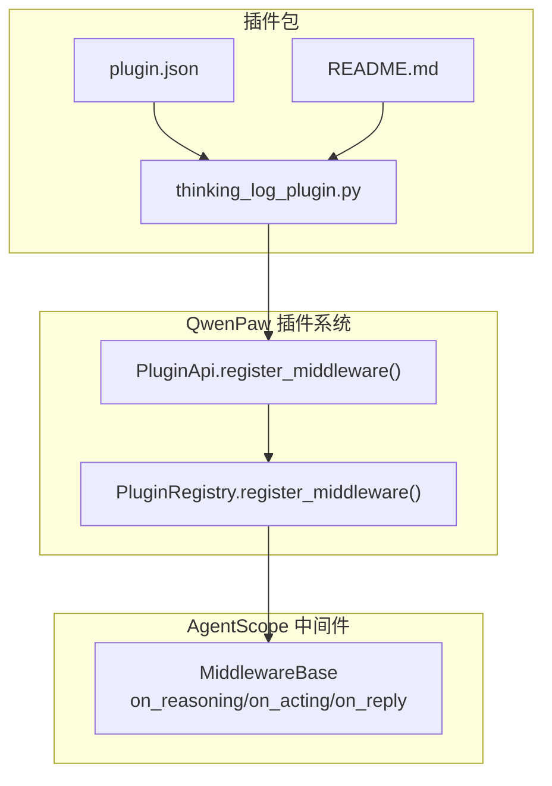
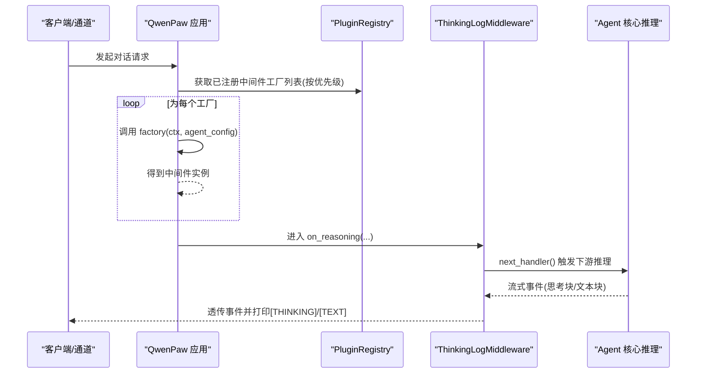
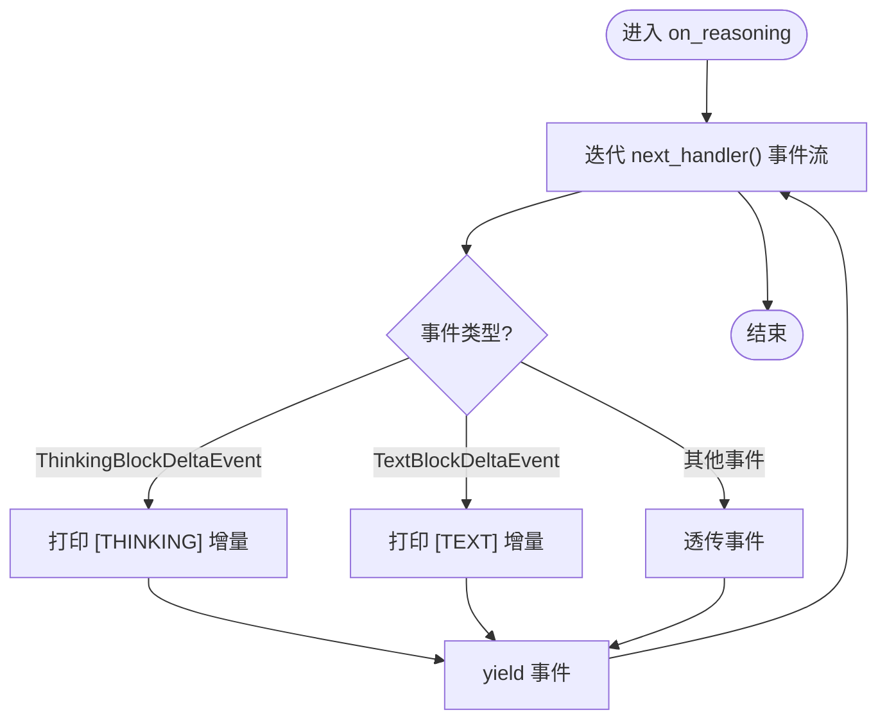
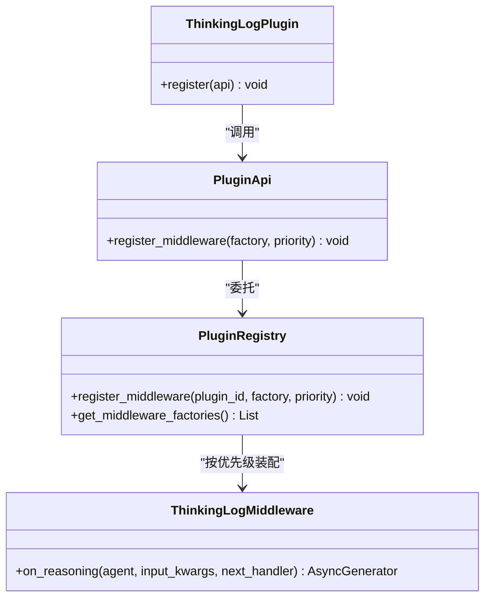
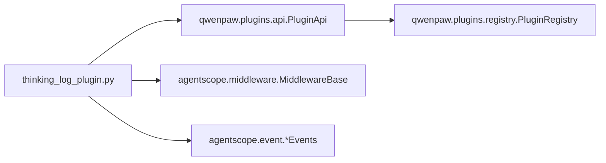

# 思考日志中间件

<cite>
**本文引用的文件**   
- [thinking_log_plugin.py](file://plugins/middleware-demo/thinking-log-middleware/thinking_log_plugin.py)
- [plugin.json](file://plugins/middleware-demo/thinking-log-middleware/plugin.json)
- [README.md](file://plugins/middleware-demo/README.md)
- [api.py](file://src/qwenpaw/plugins/api.py)
- [registry.py](file://src/qwenpaw/plugins/registry.py)
- [middlewares.py](file://src/qwenpaw/agents/middlewares.py)
</cite>

## 目录
1. [简介](#简介)
2. [项目结构](#项目结构)
3. [核心组件](#核心组件)
4. [架构总览](#架构总览)
5. [详细组件分析](#详细组件分析)
6. [依赖关系分析](#依赖关系分析)
7. [性能考虑](#性能考虑)
8. [故障排除指南](#故障排除指南)
9. [结论](#结论)
10. [附录](#附录)

## 简介
本技术文档围绕“思考日志中间件”插件，系统性解析其架构设计与实现原理，重点覆盖：
- 请求拦截机制与中间件洋葱模型
- 日志收集策略（推理流事件捕获）
- 响应修改流程（透传与可选增强）
- thinking_log_plugin.py 的核心逻辑与在 Agent 执行过程中的捕获点
- 中间件的注册机制、生命周期管理与配置选项
- 日志格式定义、存储策略与查询接口（基于示例插件的 stdout 输出）
- 部署配置、性能优化建议与故障排除
- 扩展能力：自定义日志分析与监控集成

该插件通过 QwenPaw 插件体系注册一个 AgentScope 中间件工厂，在每次 Agent 推理时以 on_reasoning 钩子捕获并打印模型的“思考过程”与文本回复片段。

## 项目结构
与思考日志中间件直接相关的代码位于演示插件目录中，并通过 QwenPaw 插件 API 注册到运行时。

图表来源
- [thinking_log_plugin.py:1-67](file://plugins/middleware-demo/thinking-log-middleware/thinking_log_plugin.py#L1-L67)
- [plugin.json:1-18](file://plugins/middleware-demo/thinking-log-middleware/plugin.json#L1-L18)
- [README.md:1-51](file://plugins/middleware-demo/README.md#L1-L51)
- [api.py:448-481](file://src/qwenpaw/plugins/api.py#L448-L481)
- [registry.py:171-207](file://src/qwenpaw/plugins/registry.py#L171-L207)

章节来源
- [thinking_log_plugin.py:1-67](file://plugins/middleware-demo/thinking-log-middleware/thinking_log_plugin.py#L1-L67)
- [plugin.json:1-18](file://plugins/middleware-demo/thinking-log-middleware/plugin.json#L1-L18)
- [README.md:1-51](file://plugins/middleware-demo/README.md#L1-L51)
- [api.py:448-481](file://src/qwenpaw/plugins/api.py#L448-L481)
- [registry.py:171-207](file://src/qwenpaw/plugins/registry.py#L171-L207)

## 核心组件
- 插件入口类 ThinkingLogPlugin：提供 register(api) 方法，调用 PluginApi.register_middleware 注册中间件工厂。
- 中间件工厂 _thinking_log_factory：按请求创建 ThinkingLogMiddleware 实例（无条件激活）。
- 中间件 ThinkingLogMiddleware：继承 MiddlewareBase，实现 on_reasoning 钩子，遍历下游事件流，识别并打印思考块与文本块增量。
- 插件清单 plugin.json：声明插件元数据、后端入口模块、版本约束等。
- 插件 API 与注册中心：
  - PluginApi.register_middleware：将工厂记录写入注册表。
  - PluginRegistry.register_middleware：持久化并按优先级排序。

章节来源
- [thinking_log_plugin.py:23-66](file://plugins/middleware-demo/thinking-log-middleware/thinking_log_plugin.py#L23-L66)
- [plugin.json:1-18](file://plugins/middleware-demo/thinking-log-middleware/plugin.json#L1-L18)
- [api.py:448-481](file://src/qwenpaw/plugins/api.py#L448-L481)
- [registry.py:171-207](file://src/qwenpaw/plugins/registry.py#L171-L207)

## 架构总览
思考日志中间件遵循 AgentScope 2.0 的“洋葱模型”，中间件按优先级从外到内包裹 Agent 内部推理循环。每个请求组装阶段会调用各插件注册的工厂函数，返回的中间件实例依次串联。

图表来源
- [api.py:448-481](file://src/qwenpaw/plugins/api.py#L448-L481)
- [registry.py:171-207](file://src/qwenpaw/plugins/registry.py#L171-L207)
- [thinking_log_plugin.py:23-66](file://plugins/middleware-demo/thinking-log-middleware/thinking_log_plugin.py#L23-L66)

## 详细组件分析

### 思考日志中间件类 ThinkingLogMiddleware
- 职责：在 on_reasoning 钩子中消费下游事件流，对特定事件类型进行标注输出，同时透传事件给下游。
- 关键行为：
  - 使用 isinstance 判断事件是否为 ThinkingBlockDeltaEvent 或 TextBlockDeltaEvent。
  - 分别以 [THINKING] 和 [TEXT] 前缀向标准输出打印 delta 内容，并立即 flush。
  - 最终 yield 原始事件，保证下游链路不受影响。

图表来源
- [thinking_log_plugin.py:26-47](file://plugins/middleware-demo/thinking-log-middleware/thinking_log_plugin.py#L26-L47)

章节来源
- [thinking_log_plugin.py:23-47](file://plugins/middleware-demo/thinking-log-middleware/thinking_log_plugin.py#L23-L47)

### 插件注册与工厂模式
- 插件入口 ThinkingLogPlugin.register：调用 api.register_middleware(_thinking_log_factory, priority=80)。
- 工厂 _thinking_log_factory：忽略 ctx 与 agent_config，始终返回 ThinkingLogMiddleware 实例（无条件激活）。
- PluginApi.register_middleware：将工厂与优先级记录到注册表。
- PluginRegistry.register_middleware：追加记录并排序（priority 越小越外层）。

图表来源
- [thinking_log_plugin.py:59-66](file://plugins/middleware-demo/thinking-log-middleware/thinking_log_plugin.py#L59-L66)
- [api.py:448-481](file://src/qwenpaw/plugins/api.py#L448-L481)
- [registry.py:171-207](file://src/qwenpaw/plugins/registry.py#L171-L207)

章节来源
- [thinking_log_plugin.py:50-66](file://plugins/middleware-demo/thinking-log-middleware/thinking_log_plugin.py#L50-L66)
- [api.py:448-481](file://src/qwenpaw/plugins/api.py#L448-L481)
- [registry.py:171-207](file://src/qwenpaw/plugins/registry.py#L171-L207)

### 插件清单与安装说明
- plugin.json 定义了插件 id、名称、版本、描述、后端入口模块、依赖与版本约束。
- README.md 提供了安装/卸载命令与工作原理说明，强调中间件工厂在每次请求组装时被调用一次。

章节来源
- [plugin.json:1-18](file://plugins/middleware-demo/thinking-log-middleware/plugin.json#L1-L18)
- [README.md:1-51](file://plugins/middleware-demo/README.md#L1-L51)

### 对比参考：Tracing 中间件（on_acting）
作为对照，tracing-middleware 展示了 on_acting 钩子在工具调用阶段的拦截与计时落盘，便于理解不同钩子的适用场景。

章节来源
- [tracing_plugin.py:1-80](file://plugins/middleware-demo/tracing-middleware/tracing_plugin.py#L1-L80)

### 原生中间件参考：ToolResultPruningMiddleware
展示如何在 on_acting 中对 ToolResponse 进行裁剪与历史上下文回溯修剪，体现中间件对响应流的修改能力。

章节来源
- [middlewares.py:331-653](file://src/qwenpaw/agents/middlewares.py#L331-L653)

## 依赖关系分析
- 外部依赖
  - agentscope.middleware.MiddlewareBase：中间件基类，提供 on_reasoning/on_acting/on_reply 等钩子。
  - agentscope.event.ThinkingBlockDeltaEvent / TextBlockDeltaEvent：用于识别思考块与文本块的增量事件。
- 内部依赖
  - qwenpaw.plugins.api.PluginApi：插件对外暴露的注册接口。
  - qwenpaw.plugins.registry.PluginRegistry：集中管理中间件工厂注册与排序。

图表来源
- [thinking_log_plugin.py:15-18](file://plugins/middleware-demo/thinking-log-middleware/thinking_log_plugin.py#L15-L18)
- [api.py:448-481](file://src/qwenpaw/plugins/api.py#L448-L481)
- [registry.py:171-207](file://src/qwenpaw/plugins/registry.py#L171-L207)

章节来源
- [thinking_log_plugin.py:15-18](file://plugins/middleware-demo/thinking-log-middleware/thinking_log_plugin.py#L15-L18)
- [api.py:448-481](file://src/qwenpaw/plugins/api.py#L448-L481)
- [registry.py:171-207](file://src/qwenpaw/plugins/registry.py#L171-L207)

## 性能考虑
- I/O 开销：当前实现直接向 stdout 打印并 flush，频繁 flush 可能带来一定 I/O 压力。生产环境建议改为异步缓冲写入或接入结构化日志系统。
- 事件过滤：仅对两类事件进行处理，其余事件透传，避免额外处理成本。
- 中间件顺序：priority=80 相对靠内，若需更前置的统计或采样，可降低优先级使其处于更外层。
- 内存占用：不缓存事件，逐条处理，内存友好；如需聚合统计，应控制缓冲区大小。

## 故障排除指南
- 未看到输出
  - 确认插件已安装且加载成功（参考 README 的安装命令）。
  - 检查运行时的标准输出是否被重定向或捕获。
- 输出格式不符合预期
  - 确认下游事件流确实包含 ThinkingBlockDeltaEvent 与 TextBlockDeltaEvent。
  - 如需要更多字段，可在中间件中扩展对事件对象的访问。
- 条件激活需求
  - 可参考 tracing-middleware 的工厂写法，根据环境变量或上下文动态返回 None 跳过中间件。

章节来源
- [README.md:14-33](file://plugins/middleware-demo/README.md#L14-L33)
- [tracing_plugin.py:58-69](file://plugins/middleware-demo/tracing-middleware/tracing_plugin.py#L58-L69)

## 结论
思考日志中间件以最小实现展示了如何通过插件机制注入 AgentScope 中间件，并在 on_reasoning 钩子中捕获模型推理过程的流式事件。借助 QwenPaw 的注册与生命周期管理，开发者可以灵活地扩展日志采集、指标上报与可视化能力。

## 附录

### 日志格式定义
- 思考块增量：前缀 “[THINKING]”，后接 delta 内容，不换行，实时刷新。
- 文本块增量：前缀 “[TEXT]”，后接 delta 内容，不换行，实时刷新。
- 输出目标：标准输出（stdout），可通过进程管理器或日志采集器统一收集。

章节来源
- [thinking_log_plugin.py:33-46](file://plugins/middleware-demo/thinking-log-middleware/thinking_log_plugin.py#L33-L46)

### 存储策略与查询接口
- 存储策略：示例插件采用 stdout 输出，适合由外部日志系统（如 journald、Filebeat、Fluent Bit、云厂商日志服务）采集与索引。
- 查询接口：无内置 HTTP 查询端点。建议结合日志平台提供的检索能力，按前缀 [THINKING]/[TEXT] 或会话/工作区标识进行筛选。

章节来源
- [thinking_log_plugin.py:33-46](file://plugins/middleware-demo/thinking-log-middleware/thinking_log_plugin.py#L33-L46)

### 部署配置
- 安装插件：
  - 在线热加载：qwenpaw plugin install plugins/middleware-demo/thinking-log-middleware
  - 离线安装：同上命令（停止服务后安装，下次启动加载）
- 卸载插件：
  - qwenpaw plugin uninstall middleware-demo-thinking-log
- 插件清单要点：
  - id、name、version、description、author、type、entry.backend、dependencies、qwenpaw_version.min/max、meta

章节来源
- [README.md:14-33](file://plugins/middleware-demo/README.md#L14-L33)
- [plugin.json:1-18](file://plugins/middleware-demo/thinking-log-middleware/plugin.json#L1-L18)

### 扩展与监控集成
- 自定义分析：
  - 在 on_reasoning 中增加对事件类型的分支处理，提取所需字段（如 session_id、agent_id、token 用量等）并写入结构化日志或指标系统。
- 监控集成：
  - 可参考 LangfuseToolSpanMiddleware 的模式，在 on_acting 中记录工具调用观测；同理，在 on_reasoning 中记录推理步骤观测。
- 条件激活：
  - 参考 tracing-middleware 的工厂模式，依据环境变量、用户开关或租户策略决定是否启用中间件。

章节来源
- [middlewares.py:655-699](file://src/qwenpaw/agents/middlewares.py#L655-L699)
- [tracing_plugin.py:58-69](file://plugins/middleware-demo/tracing-middleware/tracing_plugin.py#L58-L69)