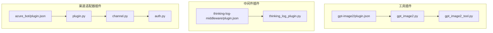
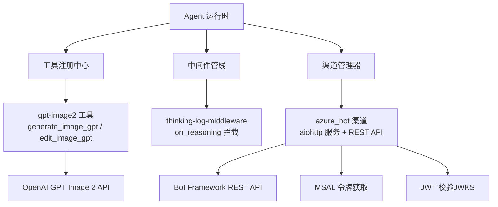
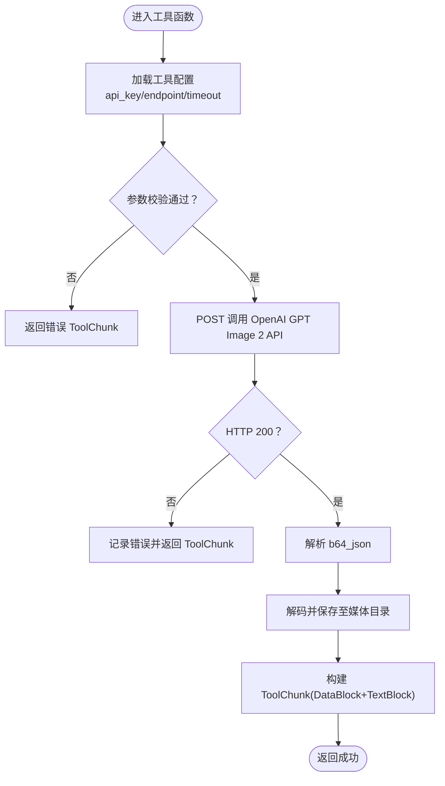
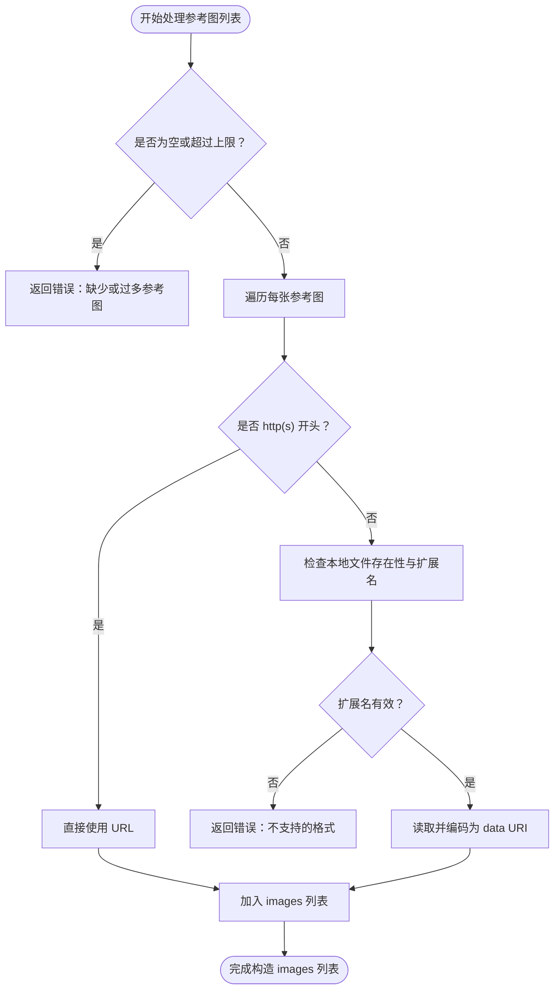
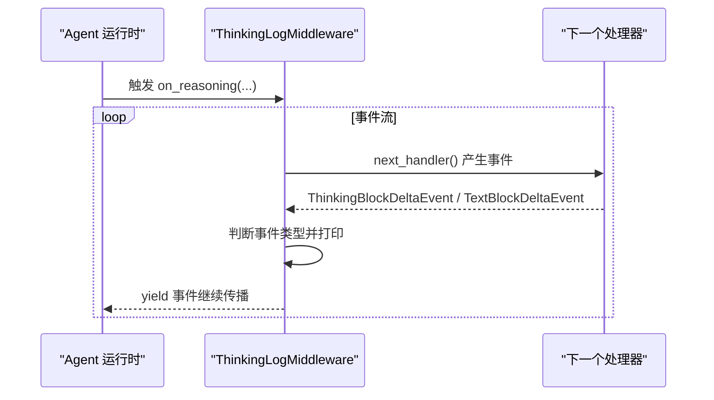
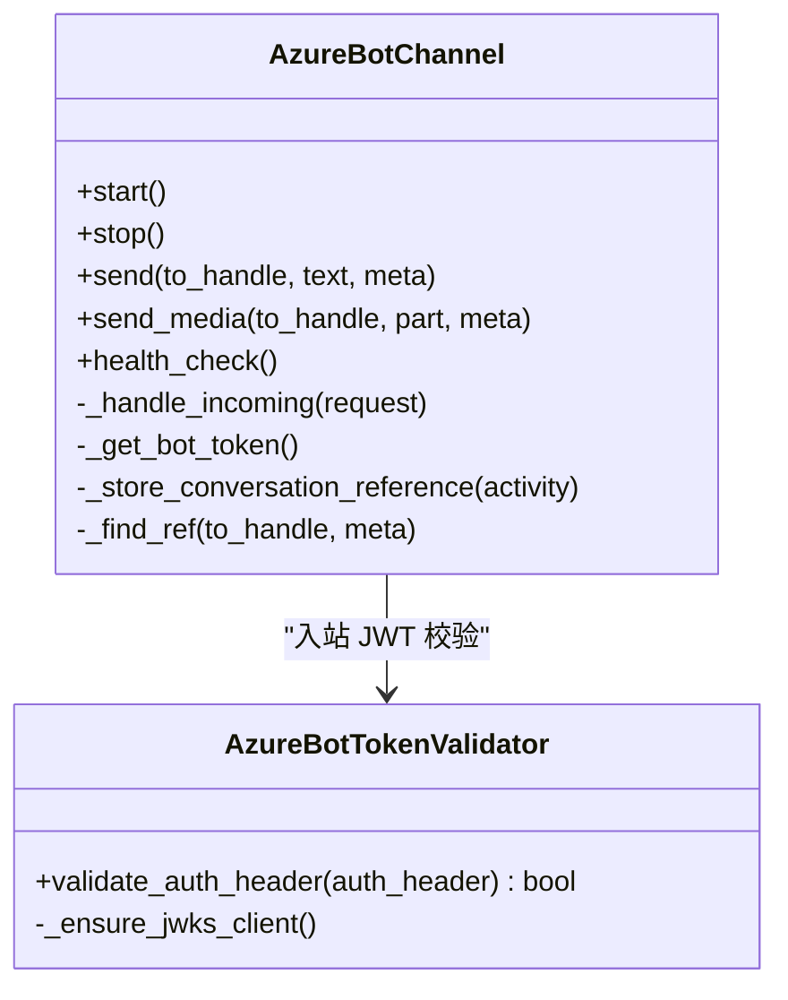
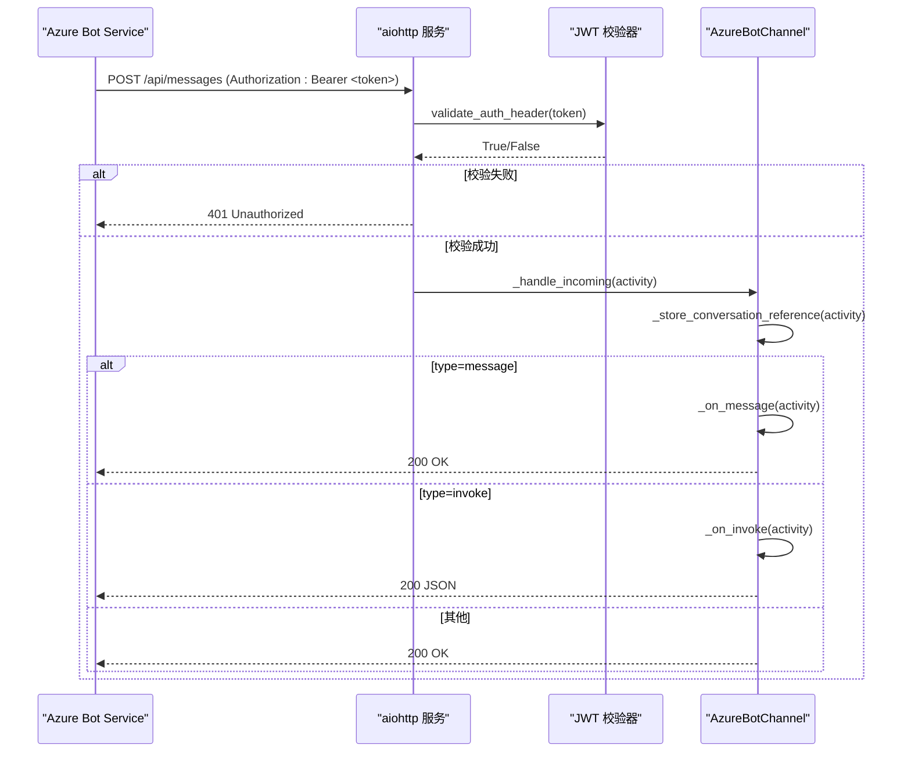
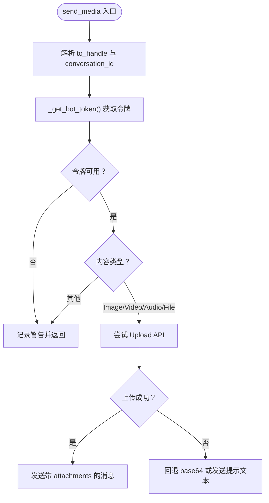
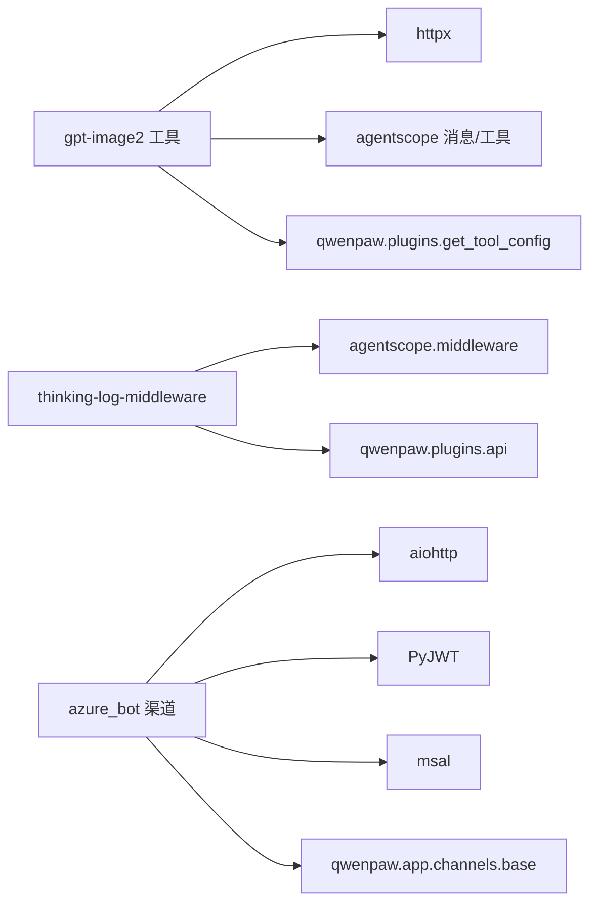

# 插件开发示例

<cite>
**本文引用的文件**   
- [gpt-image2/plugin.json](file://plugins/tool/gpt-image2/plugin.json)
- [gpt-image2/gpt_image2.py](file://plugins/tool/gpt-image2/gpt_image2.py)
- [gpt-image2/gpt_image2_tool.py](file://plugins/tool/gpt-image2/gpt_image2_tool.py)
- [thinking-log-middleware/plugin.json](file://plugins/middleware-demo/thinking-log-middleware/plugin.json)
- [thinking-log-middleware/thinking_log_plugin.py](file://plugins/middleware-demo/thinking-log-middleware/thinking_log_plugin.py)
- [azure_bot/plugin.json](file://plugins/channel/azure_bot/plugin.json)
- [azure_bot/plugin.py](file://plugins/channel/azure_bot/plugin.py)
- [azure_bot/channel.py](file://plugins/channel/azure_bot/channel.py)
- [azure_bot/auth.py](file://plugins/channel/azure_bot/auth.py)
</cite>

## 目录
1. [简介](#简介)
2. [项目结构](#项目结构)
3. [核心组件](#核心组件)
4. [架构总览](#架构总览)
5. [详细组件分析](#详细组件分析)
6. [依赖关系分析](#依赖关系分析)
7. [性能与可靠性考虑](#性能与可靠性考虑)
8. [故障排查指南](#故障排查指南)
9. [结论](#结论)
10. [附录：可复用模板与最佳实践](#附录可复用模板与最佳实践)

## 简介
本文件面向 QwenPaw 插件开发者，提供从“工具插件”到“中间件插件”再到“渠道适配器”的完整实战案例。重点覆盖：
- gpt-image2 工具插件：API 调用封装、参数校验、错误处理、本地落盘与返回格式
- thinking-log-middleware 中间件：请求拦截、推理流事件捕获、输出增强
- azure_bot 渠道适配器：认证流程（JWT 入站验证 + MSAL 出站令牌）、消息收发、会话引用持久化、健康检查与看门狗

每个示例均包含配置说明、使用方法与测试用例指引，并给出可复用的代码模板与最佳实践模式。

## 项目结构
QwenPaw 插件位于 plugins 目录下，按类型组织为 tool、middleware-demo、channel 等子目录。本次文档聚焦以下三个插件：
- 工具插件：gpt-image2（OpenAI GPT Image 2 图像生成与编辑）
- 通用中间件插件：thinking-log-middleware（打印模型推理步骤）
- 渠道适配器插件：azure_bot（Azure Bot Service / Bot Framework 集成）

图表来源
- [gpt-image2/plugin.json:1-96](file://plugins/tool/gpt-image2/plugin.json#L1-L96)
- [gpt-image2/gpt_image2.py:1-64](file://plugins/tool/gpt-image2/gpt_image2.py#L1-L64)
- [gpt-image2/gpt_image2_tool.py:1-605](file://plugins/tool/gpt-image2/gpt_image2_tool.py#L1-L605)
- [thinking-log-middleware/plugin.json:1-18](file://plugins/middleware-demo/thinking-log-middleware/plugin.json#L1-L18)
- [thinking-log-middleware/thinking_log_plugin.py:1-67](file://plugins/middleware-demo/thinking-log-middleware/thinking_log_plugin.py#L1-L67)
- [azure_bot/plugin.json:1-25](file://plugins/channel/azure_bot/plugin.json#L1-L25)
- [azure_bot/plugin.py:1-314](file://plugins/channel/azure_bot/plugin.py#L1-L314)
- [azure_bot/channel.py:1-1663](file://plugins/channel/azure_bot/channel.py#L1-L1663)
- [azure_bot/auth.py:1-168](file://plugins/channel/azure_bot/auth.py#L1-L168)

章节来源
- [gpt-image2/plugin.json:1-96](file://plugins/tool/gpt-image2/plugin.json#L1-L96)
- [gpt-image2/gpt_image2.py:1-64](file://plugins/tool/gpt-image2/gpt_image2.py#L1-L64)
- [gpt-image2/gpt_image2_tool.py:1-605](file://plugins/tool/gpt-image2/gpt_image2_tool.py#L1-L605)
- [thinking-log-middleware/plugin.json:1-18](file://plugins/middleware-demo/thinking-log-middleware/plugin.json#L1-L18)
- [thinking-log-middleware/thinking_log_plugin.py:1-67](file://plugins/middleware-demo/thinking-log-middleware/thinking_log_plugin.py#L1-L67)
- [azure_bot/plugin.json:1-25](file://plugins/channel/azure_bot/plugin.json#L1-L25)
- [azure_bot/plugin.py:1-314](file://plugins/channel/azure_bot/plugin.py#L1-L314)
- [azure_bot/channel.py:1-1663](file://plugins/channel/azure_bot/channel.py#L1-L1663)
- [azure_bot/auth.py:1-168](file://plugins/channel/azure_bot/auth.py#L1-L168)

## 核心组件
本节对三类插件的核心职责进行概览，便于读者快速建立整体认知。

- 工具插件（gpt-image2）
  - 注册两个工具：generate_image_gpt、edit_image_gpt
  - 通过 httpx 异步调用 OpenAI GPT Image 2 API
  - 参数校验（尺寸、质量、参考图数量与格式）
  - 错误处理（网络超时、HTTP 非 200、解析异常、IO 异常）
  - 将 base64 结果解码并保存到媒体目录，返回 DataBlock + TextBlock

- 中间件插件（thinking-log-middleware）
  - 继承 MiddlewareBase，实现 on_reasoning 钩子
  - 捕获 ThinkingBlockDeltaEvent 与 TextBlockDeltaEvent 并打印
  - 以高优先级注册，确保在推理链中尽早生效

- 渠道适配器（azure_bot）
  - 启动独立 aiohttp HTTP 服务接收 Bot Framework Activity
  - 入站 JWT 校验（JWKS 动态获取与缓存）
  - 出站使用 MSAL 客户端凭据获取访问令牌
  - 会话引用持久化（JSON），支持群聊共享上下文与私聊隔离
  - 附件上传（Upload API）与回退策略（base64 inline）
  - 健康检查与看门狗自动重启 HTTP 服务

章节来源
- [gpt-image2/gpt_image2.py:27-64](file://plugins/tool/gpt-image2/gpt_image2.py#L27-L64)
- [gpt-image2/gpt_image2_tool.py:22-256](file://plugins/tool/gpt-image2/gpt_image2_tool.py#L22-L256)
- [gpt-image2/gpt_image2_tool.py:259-554](file://plugins/tool/gpt-image2/gpt_image2_tool.py#L259-L554)
- [thinking-log-middleware/thinking_log_plugin.py:23-67](file://plugins/middleware-demo/thinking-log-middleware/thinking_log_plugin.py#L23-L67)
- [azure_bot/channel.py:45-188](file://plugins/channel/azure_bot/channel.py#L45-L188)
- [azure_bot/auth.py:22-168](file://plugins/channel/azure_bot/auth.py#L22-L168)

## 架构总览
下图展示了三类插件在 QwenPaw 中的角色与交互关系。

图表来源
- [gpt-image2/gpt_image2.py:34-59](file://plugins/tool/gpt-image2/gpt_image2.py#L34-L59)
- [gpt-image2/gpt_image2_tool.py:134-173](file://plugins/tool/gpt-image2/gpt_image2_tool.py#L134-L173)
- [thinking-log-middleware/thinking_log_plugin.py:62-63](file://plugins/middleware-demo/thinking-log-middleware/thinking_log_plugin.py#L62-L63)
- [azure_bot/channel.py:397-431](file://plugins/channel/azure_bot/channel.py#L397-L431)
- [azure_bot/channel.py:1311-1362](file://plugins/channel/azure_bot/channel.py#L1311-L1362)
- [azure_bot/auth.py:97-168](file://plugins/channel/azure_bot/auth.py#L97-L168)

## 详细组件分析

### 工具插件：gpt-image2
该插件提供两个工具函数，分别用于文本生成图像与基于参考图的图像编辑。

#### 关键实现要点
- 配置读取与默认值
  - 通过 get_tool_config 读取 api_key、endpoint、timeout；未设置时使用默认端点与超时
- 参数校验
  - generate_image_gpt：size 必须在 {1024x1024, 1024x1792, 1792x1024}；quality 必须在 {low, medium, high, auto}
  - edit_image_gpt：reference_images 必填且不超过 16 张；size 支持 auto 与多档分辨率；quality 同上
- 外部 API 调用
  - 使用 httpx.AsyncClient 发起 POST 请求，携带 Authorization 头与 JSON body
  - 统一错误处理：超时、HTTP 状态码非 200、响应体解析失败
- 结果处理与落盘
  - 解析 b64_json，写入 DEFAULT_MEDIA_DIR/gpt_image2 下唯一命名文件
  - 返回 ToolChunk，包含 DataBlock（URLSource file://...）与描述性 TextBlock

图表来源
- [gpt-image2/gpt_image2_tool.py:56-133](file://plugins/tool/gpt-image2/gpt_image2_tool.py#L56-L133)
- [gpt-image2/gpt_image2_tool.py:134-173](file://plugins/tool/gpt-image2/gpt_image2_tool.py#L134-L173)
- [gpt-image2/gpt_image2_tool.py:175-230](file://plugins/tool/gpt-image2/gpt_image2_tool.py#L175-L230)

#### 参考图片处理（edit_image_gpt）
- 支持 Web URL 与本地文件路径
- 本地文件需存在且为受支持的扩展名（png/jpg/jpeg/webp）
- 本地文件转为 data URI（base64）后作为 images 数组的一部分提交

图表来源
- [gpt-image2/gpt_image2_tool.py:299-432](file://plugins/tool/gpt-image2/gpt_image2_tool.py#L299-L432)
- [gpt-image2/gpt_image2_tool.py:557-605](file://plugins/tool/gpt-image2/gpt_image2_tool.py#L557-L605)

#### 配置与元信息
- plugin.json 定义了两个工具的元数据与配置字段（api_key、endpoint、timeout）
- 提供 i18n 描述、图标、依赖声明与版本约束

章节来源
- [gpt-image2/plugin.json:20-94](file://plugins/tool/gpt-image2/plugin.json#L20-L94)
- [gpt-image2/gpt_image2.py:27-64](file://plugins/tool/gpt-image2/gpt_image2.py#L27-L64)
- [gpt-image2/gpt_image2_tool.py:22-256](file://plugins/tool/gpt-image2/gpt_image2_tool.py#L22-L256)
- [gpt-image2/gpt_image2_tool.py:259-554](file://plugins/tool/gpt-image2/gpt_image2_tool.py#L259-L554)
- [gpt-image2/gpt_image2_tool.py:557-605](file://plugins/tool/gpt-image2/gpt_image2_tool.py#L557-L605)

### 中间件插件：thinking-log-middleware
该中间件演示如何接入 Agent 推理链路，捕获并输出模型的思考过程与文本增量。

#### 关键实现要点
- 继承 MiddlewareBase，实现 on_reasoning 协程
- 遍历 next_handler() 产生的事件流：
  - ThinkingBlockDeltaEvent：打印推理片段
  - TextBlockDeltaEvent：打印文本片段
- 工厂函数无条件返回实例，表示中间件始终启用
- 通过 register_middleware 注册，priority=80 保证较高执行优先级

图表来源
- [thinking-log-middleware/thinking_log_plugin.py:23-47](file://plugins/middleware-demo/thinking-log-middleware/thinking_log_plugin.py#L23-L47)
- [thinking-log-middleware/thinking_log_plugin.py:50-63](file://plugins/middleware-demo/thinking-log-middleware/thinking_log_plugin.py#L50-L63)

章节来源
- [thinking-log-middleware/plugin.json:1-18](file://plugins/middleware-demo/thinking-log-middleware/plugin.json#L1-L18)
- [thinking-log-middleware/thinking_log_plugin.py:1-67](file://plugins/middleware-demo/thinking-log-middleware/thinking_log_plugin.py#L1-L67)

### 渠道适配器：azure_bot
该适配器实现了 Azure Bot Service（Bot Framework）的完整集成，包括入站鉴权、消息收发、会话引用持久化、附件上传与健康监控。

#### 类与模块关系

图表来源
- [azure_bot/channel.py:45-188](file://plugins/channel/azure_bot/channel.py#L45-L188)
- [azure_bot/auth.py:22-168](file://plugins/channel/azure_bot/auth.py#L22-L168)

#### 入站请求处理序列

图表来源
- [azure_bot/channel.py:497-557](file://plugins/channel/azure_bot/channel.py#L497-L557)
- [azure_bot/auth.py:97-168](file://plugins/channel/azure_bot/auth.py#L97-L168)

#### 出站消息与附件发送
- send：构造 message activity，通过 Bot Framework REST API 发送
- send_media：根据内容类型选择上传策略
  - 优先调用 Upload API（限制约 180KB），成功后获得 contentUrl
  - 失败或过大时回退为 base64 inline 或发送提示文本

图表来源
- [azure_bot/channel.py:1030-1146](file://plugins/channel/azure_bot/channel.py#L1030-L1146)
- [azure_bot/channel.py:1189-1305](file://plugins/channel/azure_bot/channel.py#L1189-L1305)

#### 令牌管理与 JWKS 缓存
- 入站：动态拉取 OpenID 元数据，缓存 JWKS 客户端，校验签名、过期时间与签发者
- 出站：使用 MSAL ConfidentialClientApplication 获取 Bot Framework 作用域令牌，带过期时间缓存

章节来源
- [azure_bot/channel.py:397-431](file://plugins/channel/azure_bot/channel.py#L397-L431)
- [azure_bot/channel.py:497-557](file://plugins/channel/azure_bot/channel.py#L497-L557)
- [azure_bot/channel.py:1030-1146](file://plugins/channel/azure_bot/channel.py#L1030-L1146)
- [azure_bot/channel.py:1189-1305](file://plugins/channel/azure_bot/channel.py#L1189-L1305)
- [azure_bot/channel.py:1311-1362](file://plugins/channel/azure_bot/channel.py#L1311-L1362)
- [azure_bot/auth.py:51-96](file://plugins/channel/azure_bot/auth.py#L51-L96)
- [azure_bot/auth.py:97-168](file://plugins/channel/azure_bot/auth.py#L97-L168)

## 依赖关系分析
- gpt-image2 工具插件
  - 依赖 httpx>=0.24.0（用于异步 HTTP 调用）
  - 依赖 agentscope 消息与工具类型（ToolChunk、DataBlock、TextBlock、URLSource）
  - 依赖 qwenpaw.plugins.get_tool_config 读取工具配置

- thinking-log-middleware 中间件插件
  - 依赖 agentscope.middleware.MiddlewareBase 与事件类型
  - 依赖 qwenpaw.plugins.api.PluginApi.register_middleware

- azure_bot 渠道适配器插件
  - 依赖 aiohttp>=3.8.0（HTTP 服务与客户端）
  - 依赖 PyJWT>=2.0.0（JWT 解码与 JWKS 校验）
  - 依赖 msal>=1.20.0（MSAL 客户端凭据授权）
  - 依赖 qwenpaw.app.channels.base.BaseChannel 及内容类型

图表来源
- [gpt-image2/plugin.json:15-19](file://plugins/tool/gpt-image2/plugin.json#L15-L19)
- [gpt-image2/gpt_image2_tool.py:12-17](file://plugins/tool/gpt-image2/gpt_image2_tool.py#L12-L17)
- [thinking-log-middleware/plugin.json:11-17](file://plugins/middleware-demo/thinking-log-middleware/plugin.json#L11-L17)
- [azure_bot/plugin.json:15-23](file://plugins/channel/azure_bot/plugin.json#L15-L23)
- [azure_bot/channel.py:18-37](file://plugins/channel/azure_bot/channel.py#L18-L37)

章节来源
- [gpt-image2/plugin.json:15-19](file://plugins/tool/gpt-image2/plugin.json#L15-L19)
- [gpt-image2/gpt_image2_tool.py:12-17](file://plugins/tool/gpt-image2/gpt_image2_tool.py#L12-L17)
- [thinking-log-middleware/plugin.json:11-17](file://plugins/middleware-demo/thinking-log-middleware/plugin.json#L11-L17)
- [azure_bot/plugin.json:15-23](file://plugins/channel/azure_bot/plugin.json#L15-L23)
- [azure_bot/channel.py:18-37](file://plugins/channel/azure_bot/channel.py#L18-L37)

## 性能与可靠性考虑
- 工具插件（gpt-image2）
  - 使用 httpx.AsyncClient 提升并发能力；合理设置 timeout 避免长时间阻塞
  - 大体积 base64 解码与落盘建议放在线程池执行，避免阻塞事件循环（当前实现已尽量简化）
  - 错误分类明确：参数校验、网络超时、HTTP 错误、IO 异常，便于上层重试与告警

- 中间件插件（thinking-log-middleware）
  - 仅做轻量打印，不引入额外 IO；如需持久化建议采用异步队列与批量落盘

- 渠道适配器（azure_bot）
  - JWKS 客户端缓存与 TTL 控制，减少频繁网络请求
  - MSAL 令牌缓存与提前刷新窗口，降低令牌获取开销
  - 附件上传失败回退策略，保障消息可达性
  - 会话引用持久化采用异步串行写锁，避免并发写损坏 JSON
  - 看门狗定时检测端口连通性，必要时重启 HTTP 服务

[本节为通用指导，无需具体文件来源]

## 故障排查指南
- gpt-image2 工具
  - 现象：返回错误提示“未配置 API Key”
    - 检查工具配置是否填写 api_key
  - 现象：HTTP 非 200 或超时
    - 检查 endpoint 与网络连通性；适当增大 timeout
  - 现象：保存失败
    - 检查媒体目录权限与磁盘空间

- thinking-log-middleware
  - 现象：无输出
    - 确认中间件已注册且优先级足够；检查 stdout 输出是否被重定向

- azure_bot 渠道
  - 现象：入站请求 401
    - 检查 Authorization 头是否正确；确认 JWKS 可拉取与 app_id 匹配
  - 现象：出站失败
    - 检查 MSAL 配置（app_id、app_password、tenant_id）；查看错误码与描述
  - 现象：附件无法发送
    - 检查文件大小是否超过限制；观察回退逻辑是否生效

章节来源
- [gpt-image2/gpt_image2_tool.py:56-133](file://plugins/tool/gpt-image2/gpt_image2_tool.py#L56-L133)
- [gpt-image2/gpt_image2_tool.py:134-173](file://plugins/tool/gpt-image2/gpt_image2_tool.py#L134-L173)
- [gpt-image2/gpt_image2_tool.py:193-207](file://plugins/tool/gpt-image2/gpt_image2_tool.py#L193-L207)
- [azure_bot/auth.py:97-168](file://plugins/channel/azure_bot/auth.py#L97-L168)
- [azure_bot/channel.py:1311-1362](file://plugins/channel/azure_bot/channel.py#L1311-L1362)
- [azure_bot/channel.py:1189-1305](file://plugins/channel/azure_bot/channel.py#L1189-L1305)

## 结论
通过对 gpt-image2 工具插件、thinking-log-middleware 中间件与 azure_bot 渠道适配器的深入分析，可以清晰看到 QwenPaw 插件体系在不同维度上的设计一致性：
- 统一的插件注册接口（register_tool/register_middleware/register_channel）
- 明确的配置与元数据管理（plugin.json）
- 健壮的错误处理与回退策略
- 良好的可扩展性与可观测性（日志、健康检查、中间件）

这些模式可作为后续插件开发的模板与最佳实践。

[本节为总结，无需具体文件来源]

## 附录：可复用模板与最佳实践
- 工具插件模板
  - 入口文件：定义 Plugin 类，实现 register(api)，使用 importlib 动态加载工具模块
  - 工具函数：异步函数，返回 ToolChunk；严格参数校验；统一错误处理；结果落盘与结构化返回
  - 配置字段：在 plugin.json 中声明 config_fields，支持密码、文本、数字等类型

- 中间件插件模板
  - 继承 MiddlewareBase，实现 on_reasoning/on_request/on_response 等钩子
  - 工厂函数按需创建实例，并通过 register_middleware 注册，合理设置 priority

- 渠道适配器模板
  - 继承 BaseChannel，实现 start/stop/send/send_media/health_check
  - 入站鉴权：JWT/JWKS 校验；出站认证：OAuth/MSAL 等
  - 会话引用持久化：JSON 文件，异步串行写锁
  - 健康检查与看门狗：定期探测端口，必要时重启服务

章节来源
- [gpt-image2/gpt_image2.py:27-64](file://plugins/tool/gpt-image2/gpt_image2.py#L27-L64)
- [gpt-image2/plugin.json:20-94](file://plugins/tool/gpt-image2/plugin.json#L20-L94)
- [thinking-log-middleware/thinking_log_plugin.py:50-67](file://plugins/middleware-demo/thinking-log-middleware/thinking_log_plugin.py#L50-L67)
- [azure_bot/channel.py:336-391](file://plugins/channel/azure_bot/channel.py#L336-L391)
- [azure_bot/channel.py:1514-1588](file://plugins/channel/azure_bot/channel.py#L1514-L1588)
- [azure_bot/channel.py:1651-1663](file://plugins/channel/azure_bot/channel.py#L1651-L1663)