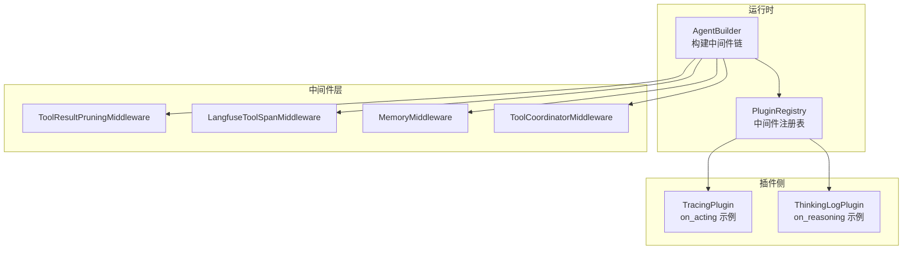
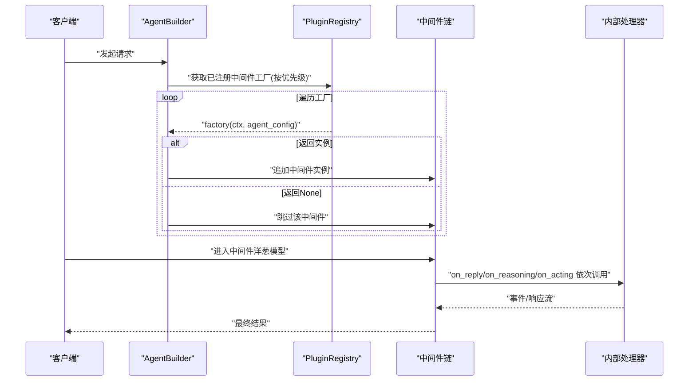
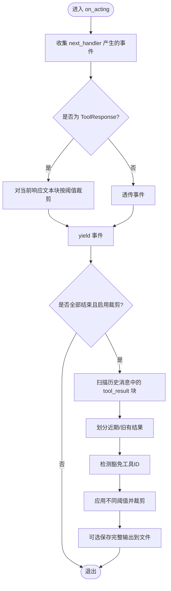
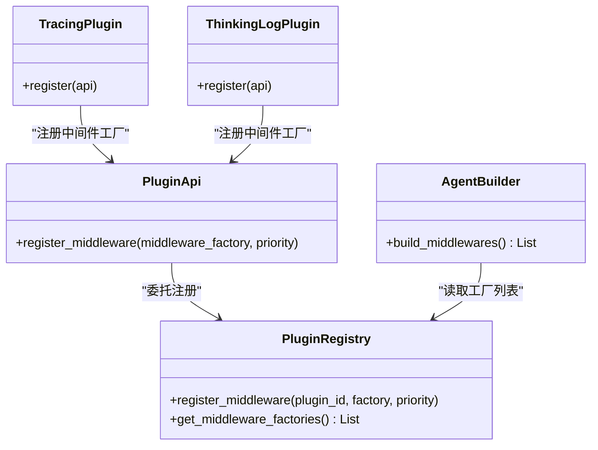
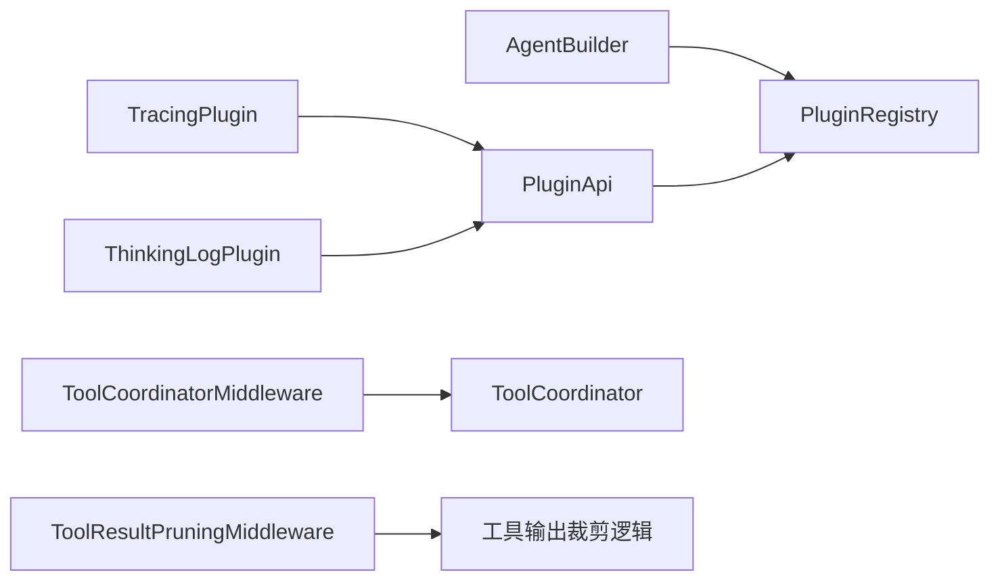

# 中间件插件

<cite>
**本文引用的文件**   
- [src/qwenpaw/agents/middlewares.py](file://src/qwenpaw/agents/middlewares.py)
- [src/qwenpaw/tool_calls/_middleware.py](file://src/qwenpaw/tool_calls/_middleware.py)
- [src/qwenpaw/runtime/builder.py](file://src/qwenpaw/runtime/builder.py)
- [src/qwenpaw/plugins/api.py](file://src/qwenpaw/plugins/api.py)
- [src/qwenpaw/plugins/registry.py](file://src/qwenpaw/plugins/registry.py)
- [plugins/middleware-demo/tracing-middleware/tracing_plugin.py](file://plugins/middleware-demo/tracing-middleware/tracing_plugin.py)
- [plugins/middleware-demo/thinking-log-middleware/thinking_log_plugin.py](file://plugins/middleware-demo/thinking-log-middleware/thinking_log_plugin.py)
- [plugins/middleware-demo/README.md](file://plugins/middleware-demo/README.md)
</cite>

## 目录
1. [简介](#简介)
2. [项目结构](#项目结构)
3. [核心组件](#核心组件)
4. [架构总览](#架构总览)
5. [详细组件分析](#详细组件分析)
6. [依赖关系分析](#依赖关系分析)
7. [性能考虑](#性能考虑)
8. [故障排查指南](#故障排查指南)
9. [结论](#结论)
10. [附录](#附录)

## 简介
本章节面向 QwenPaw 的“中间件插件”能力，系统性说明：
- 中间件基类与钩子（on_reply、on_reasoning、on_acting）
- 请求拦截、响应处理、异常捕获
- 执行顺序与链式调用机制、上下文传递
- 配置管理、依赖注入、生命周期钩子
- 自定义中间件插件实现示例（日志记录、性能监控、安全校验、数据转换）
- 错误处理、事务管理、资源清理机制
- 测试方法与性能调优技巧

## 项目结构
QwenPaw 的中间件体系由“运行时装配 + 内置中间件 + 工具协调中间件 + 插件注册中心 + 示例插件”组成。关键位置如下：
- 运行时装配器负责组装中间件链并调用插件注册的工厂函数
- 内置中间件提供内存增强、工具结果裁剪、可观测性记录等能力
- 工具协调中间件将 on_acting 委派给 ToolCoordinator
- 插件 API 与注册中心提供 register_middleware 接口与优先级排序
- 示例插件演示 on_acting/on_reasoning 的实现方式

图示来源
- [src/qwenpaw/runtime/builder.py:930-975](file://src/qwenpaw/runtime/builder.py#L930-L975)
- [src/qwenpaw/plugins/registry.py:170-207](file://src/qwenpaw/plugins/registry.py#L170-L207)
- [src/qwenpaw/agents/middlewares.py:331-699](file://src/qwenpaw/agents/middlewares.py#L331-L699)
- [src/qwenpaw/tool_calls/_middleware.py:19-57](file://src/qwenpaw/tool_calls/_middleware.py#L19-L57)
- [plugins/middleware-demo/tracing-middleware/tracing_plugin.py:24-79](file://plugins/middleware-demo/tracing-middleware/tracing_plugin.py#L24-L79)
- [plugins/middleware-demo/thinking-log-middleware/thinking_log_plugin.py:23-66](file://plugins/middleware-demo/thinking-log-middleware/thinking_log_plugin.py#L23-L66)

章节来源
- [src/qwenpaw/runtime/builder.py:930-975](file://src/qwenpaw/runtime/builder.py#L930-L975)
- [src/qwenpaw/plugins/registry.py:170-207](file://src/qwenpaw/plugins/registry.py#L170-L207)
- [src/qwenpaw/agents/middlewares.py:331-699](file://src/qwenpaw/agents/middlewares.py#L331-L699)
- [src/qwenpaw/tool_calls/_middleware.py:19-57](file://src/qwenpaw/tool_calls/_middleware.py#L19-L57)
- [plugins/middleware-demo/tracing-middleware/tracing_plugin.py:24-79](file://plugins/middleware-demo/tracing-middleware/tracing_plugin.py#L24-L79)
- [plugins/middleware-demo/thinking-log-middleware/thinking_log_plugin.py:23-66](file://plugins/middleware-demo/thinking-log-middleware/thinking_log_plugin.py#L23-L66)

## 核心组件
- 中间件基类与钩子
  - 基于 AgentScope 的 MiddlewareBase，支持 on_reply、on_reasoning、on_acting 等钩子，用于在模型回复流、推理流、工具执行流中插入横切逻辑。
- 内置中间件
  - MemoryMiddleware：系统提示注入、自动记忆检索与压缩期触发。
  - ToolResultPruningMiddleware：对工具输出进行按字节阈值裁剪，避免上下文溢出。
  - LangfuseToolSpanMiddleware：将工具执行作为可观测性 span 上报。
- 工具协调中间件
  - ToolCoordinatorMiddleware：将 on_acting 委派给 ToolCoordinator，统一执行与副作用。
- 插件注册与装配
  - PluginApi.register_middleware：插件通过工厂函数注册中间件实例或返回 None 跳过。
  - PluginRegistry：维护中间件注册表并按 priority 升序排列（越小越外层）。
  - AgentBuilder.build_middlewares：组装中间件链，依次调用各工厂函数生成实例。

章节来源
- [src/qwenpaw/agents/middlewares.py:46-329](file://src/qwenpaw/agents/middlewares.py#L46-L329)
- [src/qwenpaw/agents/middlewares.py:331-699](file://src/qwenpaw/agents/middlewares.py#L331-L699)
- [src/qwenpaw/tool_calls/_middleware.py:19-57](file://src/qwenpaw/tool_calls/_middleware.py#L19-L57)
- [src/qwenpaw/plugins/api.py:448-481](file://src/qwenpaw/plugins/api.py#L448-L481)
- [src/qwenpaw/plugins/registry.py:170-207](file://src/qwenpaw/plugins/registry.py#L170-L207)
- [src/qwenpaw/runtime/builder.py:930-975](file://src/qwenpaw/runtime/builder.py#L930-L975)

## 架构总览
下图展示一次请求从装配到执行的完整链路，包括插件中间件的注册与调用时机。

图示来源
- [src/qwenpaw/runtime/builder.py:930-975](file://src/qwenpaw/runtime/builder.py#L930-L975)
- [src/qwenpaw/plugins/registry.py:170-207](file://src/qwenpaw/plugins/registry.py#L170-L207)
- [src/qwenpaw/agents/middlewares.py:331-699](file://src/qwenpaw/agents/middlewares.py#L331-L699)
- [src/qwenpaw/tool_calls/_middleware.py:19-57](file://src/qwenpaw/tool_calls/_middleware.py#L19-L57)

## 详细组件分析

### 中间件基类与钩子
- 基类：继承自 agentscope.middleware.MiddlewareBase
- 主要钩子
  - on_reply：包裹模型回复流，适合统计、缓存、后处理
  - on_reasoning：包裹推理流，适合打印思考过程、审计
  - on_acting：包裹工具执行流，适合计时、埋点、权限校验、结果裁剪
- 上下文传递
  - 通过 input_kwargs 与 next_handler 透传；部分中间件读取 agent._request_context 中的 session_id/agent_id/root_session_id 等字段

章节来源
- [src/qwenpaw/agents/middlewares.py:46-329](file://src/qwenpaw/agents/middlewares.py#L46-L329)
- [src/qwenpaw/tool_calls/_middleware.py:35-57](file://src/qwenpaw/tool_calls/_middleware.py#L35-L57)

### 内置中间件详解

#### MemoryMiddleware
- 职责
  - 注入系统提示中的记忆引导
  - 在模型调用前根据用户轮次标记检索相关记忆并注入消息
  - 在回复完成后累积待持久化的用户轮次，达到间隔或压缩时触发自动记忆写入
- 关键点
  - 自动化来源（如 cron、heartbeat）会跳过记忆写入
  - 压缩上下文时可按策略提前 flush 待持久化内容

章节来源
- [src/qwenpaw/agents/middlewares.py:46-329](file://src/qwenpaw/agents/middlewares.py#L46-L329)

#### ToolResultPruningMiddleware
- 职责
  - 对当前工具响应与历史 tool_result 块进行按字节阈值裁剪
  - 区分“近期”和“旧有”结果，使用不同上限
  - 支持豁免工具名与文件扩展名，保留更大上限
  - 将完整输出保存到工作区文件以便恢复
- 算法要点
  - 识别最近 N 条包含 tool_result 的消息为“近期”
  - 检测豁免工具 ID（基于工具名与 read_file 输入匹配）
  - 对文本块逐块截断并更新元数据

图示来源
- [src/qwenpaw/agents/middlewares.py:331-699](file://src/qwenpaw/agents/middlewares.py#L331-L699)

章节来源
- [src/qwenpaw/agents/middlewares.py:331-699](file://src/qwenpaw/agents/middlewares.py#L331-L699)

#### LangfuseToolSpanMiddleware
- 职责
  - 在 on_acting 中将每次工具执行包装为 Langfuse 的 tool_span
  - 当未启用或未连接时优雅降级
- 行为
  - 记录工具名称、输入、tool_call_id
  - 在收到最终 ToolResponse 后更新 span 的输出摘要

章节来源
- [src/qwenpaw/agents/middlewares.py:655-699](file://src/qwenpaw/agents/middlewares.py#L655-L699)

#### ToolCoordinatorMiddleware
- 职责
  - 薄封装 on_acting，将工具执行委派给 ToolCoordinator
  - 透传 session_id、agent_id、root_session_id 等上下文信息
- 优势
  - 直接访问 agent.request_context，无需 ContextVar 间接层
  - 与 _execute_tool_call 副作用天然协同

章节来源
- [src/qwenpaw/tool_calls/_middleware.py:19-57](file://src/qwenpaw/tool_calls/_middleware.py#L19-L57)

### 插件注册与装配流程

#### 插件 API 与注册中心
- PluginApi.register_middleware
  - 接收工厂函数与优先级，内部委托至注册中心
- PluginRegistry.register_middleware
  - 以 dataclass 记录 plugin_id/factory/priority，并维护有序列表
  - get_middleware_factories 返回按优先级排序的副本

图示来源
- [src/qwenpaw/plugins/api.py:448-481](file://src/qwenpaw/plugins/api.py#L448-L481)
- [src/qwenpaw/plugins/registry.py:170-207](file://src/qwenpaw/plugins/registry.py#L170-L207)
- [src/qwenpaw/runtime/builder.py:930-975](file://src/qwenpaw/runtime/builder.py#L930-L975)
- [plugins/middleware-demo/tracing-middleware/tracing_plugin.py:72-79](file://plugins/middleware-demo/tracing-middleware/tracing_plugin.py#L72-L79)
- [plugins/middleware-demo/thinking-log-middleware/thinking_log_plugin.py:59-66](file://plugins/middleware-demo/thinking-log-middleware/thinking_log_plugin.py#L59-L66)

章节来源
- [src/qwenpaw/plugins/api.py:448-481](file://src/qwenpaw/plugins/api.py#L448-L481)
- [src/qwenpaw/plugins/registry.py:170-207](file://src/qwenpaw/plugins/registry.py#L170-L207)
- [src/qwenpaw/runtime/builder.py:930-975](file://src/qwenpaw/runtime/builder.py#L930-L975)

#### 执行顺序与链式调用
- 顺序规则
  - 优先级数值越小，越靠近洋葱模型外层（先入后出）
  - 内置中间件与插件中间件共同构成完整链条
- 链式调用
  - 每个中间件通过 next_handler 调用下一个，形成异步生成器链
  - 可在 before/after 两侧分别执行前置与后置逻辑

章节来源
- [src/qwenpaw/plugins/registry.py:170-207](file://src/qwenpaw/plugins/registry.py#L170-L207)
- [src/qwenpaw/agents/middlewares.py:331-699](file://src/qwenpaw/agents/middlewares.py#L331-L699)

#### 上下文传递
- 常见上下文键
  - session_id、agent_id、root_session_id 等可从 agent._request_context 获取
- 用途
  - 工具执行追踪、日志关联、权限校验、资源隔离

章节来源
- [src/qwenpaw/tool_calls/_middleware.py:35-57](file://src/qwenpaw/tool_calls/_middleware.py#L35-L57)

### 配置管理、依赖注入与生命周期钩子
- 配置管理
  - 插件可通过 PluginApi 提供的工具配置查询/设置接口访问当前 agent 的工具配置
- 依赖注入
  - 中间件工厂在装配阶段被调用，可依据 ctx 与 agent_config 动态创建实例
- 生命周期钩子
  - 插件可使用 register_startup_hook/register_shutdown_hook/register_uninstall_hook 等完成初始化与清理
  - 中间件自身不持有全局状态，建议将资源绑定于中间件实例并在 finally 中释放

章节来源
- [src/qwenpaw/plugins/api.py:448-481](file://src/qwenpaw/plugins/api.py#L448-L481)
- [src/qwenpaw/plugins/api.py:251-356](file://src/qwenpaw/plugins/api.py#L251-L356)

### 自定义中间件插件示例

#### 场景一：日志记录（on_acting）
- 参考示例：tracing-middleware
- 要点
  - 在 on_acting 前后记录工具名称、输入与耗时
  - 条件激活：仅在环境变量存在时启用
  - 工厂函数根据 workspace_dir 定位 trace 文件路径

章节来源
- [plugins/middleware-demo/tracing-middleware/tracing_plugin.py:24-79](file://plugins/middleware-demo/tracing-middleware/tracing_plugin.py#L24-L79)
- [plugins/middleware-demo/README.md:1-58](file://plugins/middleware-demo/README.md#L1-L58)

#### 场景二：性能监控（on_reasoning）
- 参考示例：thinking-log-middleware
- 要点
  - 在 on_reasoning 中捕获 ThinkingBlockDeltaEvent 与 TextBlockDeltaEvent
  - 实时打印到 stdout，便于调试与观察推理过程

章节来源
- [plugins/middleware-demo/thinking-log-middleware/thinking_log_plugin.py:23-66](file://plugins/middleware-demo/thinking-log-middleware/thinking_log_plugin.py#L23-L66)
- [plugins/middleware-demo/README.md:1-58](file://plugins/middleware-demo/README.md#L1-L58)

#### 场景三：安全校验（on_acting）
- 思路
  - 在 on_acting 中读取 tool_call 的名称与输入，结合 session_id/agent_id 做白名单/配额检查
  - 失败时抛出异常或返回受限响应，阻断后续执行
- 注意
  - 确保异常能被上层捕获并转化为友好错误码

章节来源
- [src/qwenpaw/tool_calls/_middleware.py:35-57](file://src/qwenpaw/tool_calls/_middleware.py#L35-L57)

#### 场景四：数据转换（on_reply/on_reasoning）
- 思路
  - 在 on_reply 中对最终响应进行格式标准化、脱敏或富文本转换
  - 在 on_reasoning 中对推理片段进行清洗、翻译或结构化提取

章节来源
- [src/qwenpaw/agents/middlewares.py:46-329](file://src/qwenpaw/agents/middlewares.py#L46-L329)

### 错误处理、事务管理与资源清理
- 错误处理
  - 中间件应在 try/finally 中包裹 next_handler 调用，确保异常传播的同时完成清理
  - 对于 I/O 操作（如写日志、保存文件），需捕获 OSError 并降级处理
- 事务管理
  - 中间件本身不引入数据库事务，但可在 on_acting 中协调外部事务边界（例如在工具执行前后开启/提交）
- 资源清理
  - 使用 finally 确保文件句柄关闭、临时目录清理、计数器复位

章节来源
- [plugins/middleware-demo/tracing-middleware/tracing_plugin.py:31-56](file://plugins/middleware-demo/tracing-middleware/tracing_plugin.py#L31-L56)
- [src/qwenpaw/agents/middlewares.py:331-699](file://src/qwenpaw/agents/middlewares.py#L331-L699)

## 依赖关系分析
- 运行时装配器依赖注册中心获取工厂列表
- 插件通过 API 向注册中心登记中间件工厂
- 中间件之间通过洋葱模型串联，彼此解耦
- 工具协调中间件与 ToolCoordinator 协作，屏蔽底层执行细节

图示来源
- [src/qwenpaw/runtime/builder.py:930-975](file://src/qwenpaw/runtime/builder.py#L930-L975)
- [src/qwenpaw/plugins/api.py:448-481](file://src/qwenpaw/plugins/api.py#L448-L481)
- [src/qwenpaw/plugins/registry.py:170-207](file://src/qwenpaw/plugins/registry.py#L170-L207)
- [src/qwenpaw/tool_calls/_middleware.py:19-57](file://src/qwenpaw/tool_calls/_middleware.py#L19-L57)
- [src/qwenpaw/agents/middlewares.py:331-699](file://src/qwenpaw/agents/middlewares.py#L331-L699)

章节来源
- [src/qwenpaw/runtime/builder.py:930-975](file://src/qwenpaw/runtime/builder.py#L930-L975)
- [src/qwenpaw/plugins/api.py:448-481](file://src/qwenpaw/plugins/api.py#L448-L481)
- [src/qwenpaw/plugins/registry.py:170-207](file://src/qwenpaw/plugins/registry.py#L170-L207)
- [src/qwenpaw/tool_calls/_middleware.py:19-57](file://src/qwenpaw/tool_calls/_middleware.py#L19-L57)
- [src/qwenpaw/agents/middlewares.py:331-699](file://src/qwenpaw/agents/middlewares.py#L331-L699)

## 性能考虑
- 减少阻塞 I/O
  - 将耗时裁剪/序列化任务放入线程池（如 asyncio.to_thread）以避免阻塞事件循环
- 控制日志与埋点开销
  - 条件启用（环境变量开关）、采样率控制、批量落盘
- 合理设置裁剪阈值
  - 根据业务场景调整 recent_n、old_max_bytes、recent_max_bytes，平衡上下文预算与可读性
- 避免重复计算
  - 复用检测结果（如豁免工具 ID 集合），减少全量扫描次数

章节来源
- [src/qwenpaw/agents/middlewares.py:418-424](file://src/qwenpaw/agents/middlewares.py#L418-L424)
- [src/qwenpaw/agents/middlewares.py:490-534](file://src/qwenpaw/agents/middlewares.py#L490-L534)

## 故障排查指南
- 常见问题
  - 插件中间件未生效：确认 register_middleware 是否被调用、priority 是否正确、工厂是否返回 None
  - 工具执行无日志：检查环境变量开关与文件写入权限
  - 上下文缺失：确认 agent._request_context 是否包含必要键
- 诊断步骤
  - 查看运行时装配日志，确认中间件工厂是否成功创建实例
  - 在 on_acting 中打印 tool_call 名称与输入，验证链路是否到达目标中间件
  - 对裁剪中间件，检查工作区目录是否存在完整输出备份文件

章节来源
- [src/qwenpaw/runtime/builder.py:955-970](file://src/qwenpaw/runtime/builder.py#L955-L970)
- [plugins/middleware-demo/tracing-middleware/tracing_plugin.py:58-69](file://plugins/middleware-demo/tracing-middleware/tracing_plugin.py#L58-L69)
- [src/qwenpaw/tool_calls/_middleware.py:41-57](file://src/qwenpaw/tool_calls/_middleware.py#L41-L57)

## 结论
QwenPaw 的中间件插件体系以“工厂注册 + 洋葱模型 + 优先级排序”为核心，提供了高内聚、低耦合的横切能力扩展点。通过内置中间件与示例插件，开发者可以快速实现日志、监控、安全、数据转换等需求，并结合生命周期钩子与上下文传递完成更复杂的编排。

## 附录
- 安装与卸载示例插件
  - 安装：qwenpaw plugin install plugins/middleware-demo/tracing-middleware
  - 卸载：qwenpaw plugin uninstall middleware-demo-tracing

章节来源
- [plugins/middleware-demo/README.md:14-33](file://plugins/middleware-demo/README.md#L14-L33)