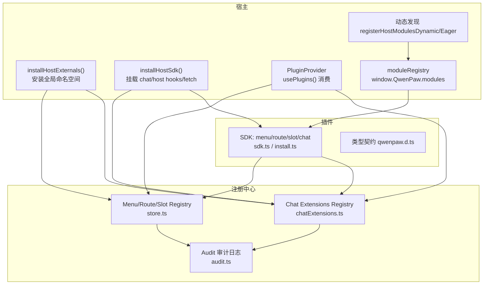
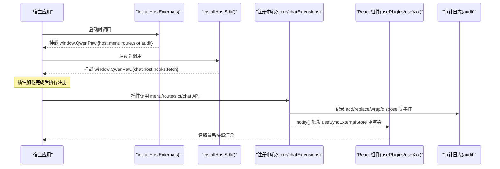
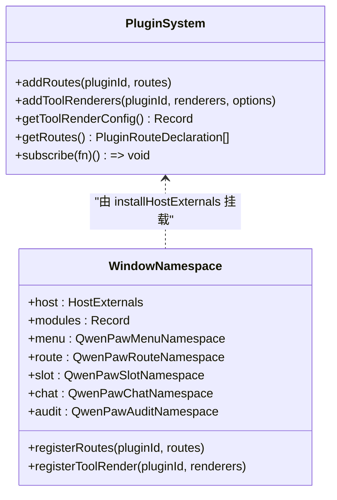
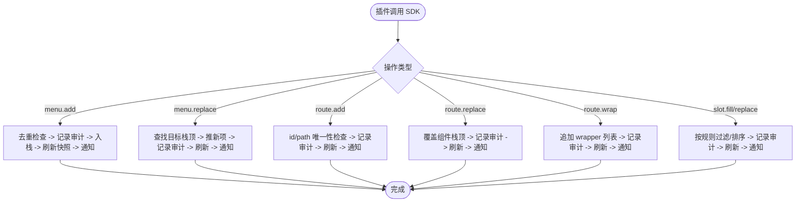
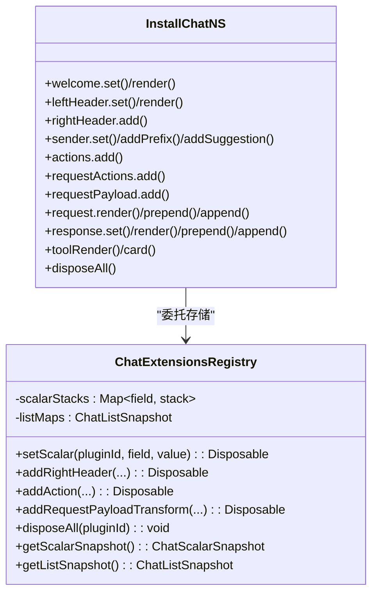
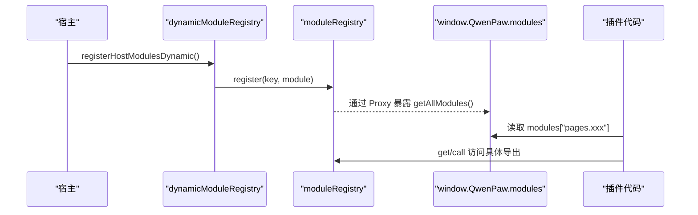
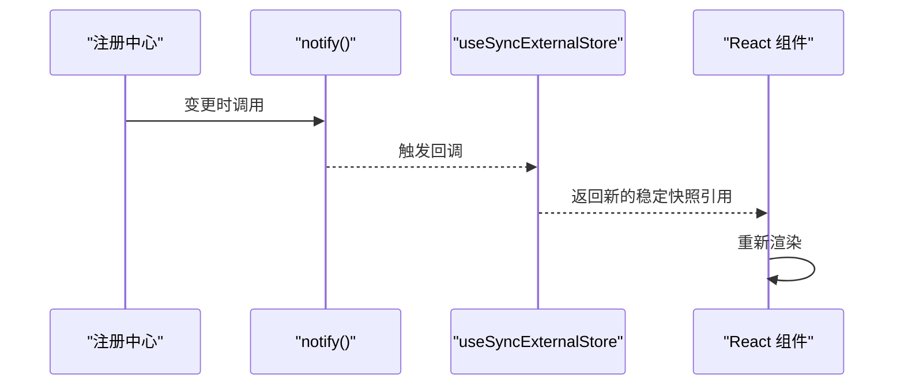
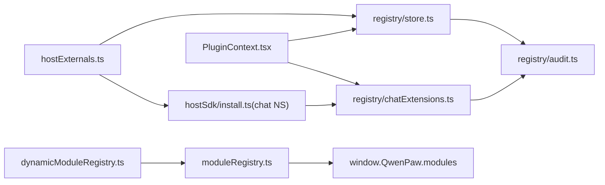

# 前端插件

<cite>
**本文引用的文件**   
- [console/src/plugins/PluginContext.tsx](file://console/src/plugins/PluginContext.tsx)
- [console/src/plugins/hostExternals.ts](file://console/src/plugins/hostExternals.ts)
- [console/src/plugins/moduleRegistry.ts](file://console/src/plugins/moduleRegistry.ts)
- [console/src/plugins/dynamicModuleRegistry.ts](file://console/src/plugins/dynamicModuleRegistry.ts)
- [console/src/plugins/registry/sdk.ts](file://console/src/plugins/registry/sdk.ts)
- [console/src/plugins/registry/store.ts](file://console/src/plugins/registry/store.ts)
- [console/src/plugins/registry/types.ts](file://console/src/plugins/registry/types.ts)
- [console/src/plugins/registry/chatExtensions.ts](file://console/src/plugins/registry/chatExtensions.ts)
- [console/src/plugins/registry/slotKeys.ts](file://console/src/plugins/registry/slotKeys.ts)
- [console/src/plugins/registry/hooks.ts](file://console/src/plugins/registry/hooks.ts)
- [console/src/plugins/registry/audit.ts](file://console/src/plugins/registry/audit.ts)
- [console/src/plugins/hostSdk/install.ts](file://console/src/plugins/hostSdk/install.ts)
- [console/src/plugins/hostSdk/hooks.ts](file://console/src/plugins/hostSdk/hooks.ts)
- [console/src/plugins/hostSdk/fetch.ts](file://console/src/plugins/hostSdk/fetch.ts)
- [console/src/plugins/types/qwenpaw.d.ts](file://console/src/plugins/types/qwenpaw.d.ts)
</cite>

## 目录
1. [简介](#简介)
2. [项目结构](#项目结构)
3. [核心组件](#核心组件)
4. [架构总览](#架构总览)
5. [详细组件分析](#详细组件分析)
6. [依赖关系分析](#依赖关系分析)
7. [性能与隔离](#性能与隔离)
8. [安全与限制](#安全与限制)
9. [打包发布与版本管理](#打包发布与版本管理)
10. [调试与排障](#调试与排障)
11. [结论](#结论)
12. [附录：示例路径索引](#附录示例路径索引)

## 简介
本文件面向 QwenPaw 前端插件开发者，系统化说明前端插件的 SDK、宿主 API、插槽机制、加载与模块隔离、样式作用域、事件总线与状态同步、以及前后端通信方式。文档同时提供实现自定义插件（UI 扩展、页面定制、交互增强）的路径指引，并给出打包发布、版本管理与兼容性处理建议，以及安全限制、性能优化和调试工具使用指南。

## 项目结构
QwenPaw 的前端插件体系位于 console/src/plugins 下，围绕“注册中心 + 命名空间暴露 + React 上下文”的模式组织：
- 宿主对外暴露 window.QwenPaw.* 命名空间（host、chat、menu/route/slot、audit、modules）。
- 插件通过 SDK 调用注册菜单、路由、插槽、聊天界面扩展等能力。
- 宿主侧维护集中式 Store（Menu/Route/Slot/Chat），并通过 useSyncExternalStore 驱动 UI 更新。
- 模块注入通过 moduleRegistry 与动态发现机制完成，支持运行时 monkey-patch。

图表来源
- [console/src/plugins/hostExternals.ts:225-301](file://console/src/plugins/hostExternals.ts#L225-L301)
- [console/src/plugins/hostSdk/install.ts:369-397](file://console/src/plugins/hostSdk/install.ts#L369-L397)
- [console/src/plugins/PluginContext.tsx:66-122](file://console/src/plugins/PluginContext.tsx#L66-L122)
- [console/src/plugins/moduleRegistry.ts:120-138](file://console/src/plugins/moduleRegistry.ts#L120-L138)
- [console/src/plugins/dynamicModuleRegistry.ts:22-73](file://console/src/plugins/dynamicModuleRegistry.ts#L22-L73)
- [console/src/plugins/registry/store.ts:1-16](file://console/src/plugins/registry/store.ts#L1-L16)
- [console/src/plugins/registry/chatExtensions.ts:1-20](file://console/src/plugins/registry/chatExtensions.ts#L1-L20)
- [console/src/plugins/registry/audit.ts:1-12](file://console/src/plugins/registry/audit.ts#L1-L12)

章节来源
- [console/src/plugins/hostExternals.ts:225-301](file://console/src/plugins/hostExternals.ts#L225-L301)
- [console/src/plugins/hostSdk/install.ts:369-397](file://console/src/plugins/hostSdk/install.ts#L369-L397)
- [console/src/plugins/PluginContext.tsx:66-122](file://console/src/plugins/PluginContext.tsx#L66-L122)
- [console/src/plugins/moduleRegistry.ts:120-138](file://console/src/plugins/moduleRegistry.ts#L120-L138)
- [console/src/plugins/dynamicModuleRegistry.ts:22-73](file://console/src/plugins/dynamicModuleRegistry.ts#L22-L73)
- [console/src/plugins/registry/store.ts:1-16](file://console/src/plugins/registry/store.ts#L1-L16)
- [console/src/plugins/registry/chatExtensions.ts:1-20](file://console/src/plugins/registry/chatExtensions.ts#L1-L20)
- [console/src/plugins/registry/audit.ts:1-12](file://console/src/plugins/registry/audit.ts#L1-L12)

## 核心组件
- 宿主外部依赖与全局命名空间
  - hostExternals.ts：在启动时安装 window.QwenPaw.host、menu/route/slot/audit 命名空间，并提供兼容层 registerRoutes/registerToolRender。
  - hostSdk/install.ts：安装 window.QwenPaw.chat 与 host hooks/fetch，将 chat 扩展映射到 chatExtensions 注册表。
- 注册中心
  - store.ts：Menu/Route/Slot 三大注册表，统一 notify 总线，快照稳定引用，冲突策略与 LIFO 覆盖。
  - chatExtensions.ts：聊天界面标量与列表扩展注册表，last-writer-wins 与追加列表模型。
  - audit.ts：统一的审计日志环形缓冲，记录所有覆盖/冲突事件。
- 插件 SDK
  - registry/sdk.ts：构建 menu/route/slot/audit 命名空间的工厂方法。
  - hostSdk/install.ts：构建 chat 命名空间，封装 set/render/add 三类动词。
- 模块注入
  - moduleRegistry.ts：运行时模块注册表，暴露 window.QwenPaw.modules 供插件访问/修改宿主导出。
  - dynamicModuleRegistry.ts：基于 import.meta.glob 的动态发现与并行注册。
- 类型契约
  - types/qwenpaw.d.ts：插件作者使用的稳定公共契约（Window.QwenPaw 类型声明）。

章节来源
- [console/src/plugins/hostExternals.ts:40-196](file://console/src/plugins/hostExternals.ts#L40-L196)
- [console/src/plugins/hostSdk/install.ts:79-168](file://console/src/plugins/hostSdk/install.ts#L79-L168)
- [console/src/plugins/registry/store.ts:60-309](file://console/src/plugins/registry/store.ts#L60-L309)
- [console/src/plugins/registry/chatExtensions.ts:138-166](file://console/src/plugins/registry/chatExtensions.ts#L138-L166)
- [console/src/plugins/registry/audit.ts:21-66](file://console/src/plugins/registry/audit.ts#L21-L66)
- [console/src/plugins/registry/sdk.ts:82-126](file://console/src/plugins/registry/sdk.ts#L82-L126)
- [console/src/plugins/moduleRegistry.ts:12-37](file://console/src/plugins/moduleRegistry.ts#L12-L37)
- [console/src/plugins/dynamicModuleRegistry.ts:22-73](file://console/src/plugins/dynamicModuleRegistry.ts#L22-L73)
- [console/src/plugins/types/qwenpaw.d.ts:273-295](file://console/src/plugins/types/qwenpaw.d.ts#L273-L295)

## 架构总览
下图展示插件从安装到渲染的关键流程：宿主初始化 → 暴露命名空间 → 插件注册 → 注册中心通知 → UI 订阅更新。

图表来源
- [console/src/plugins/hostExternals.ts:225-301](file://console/src/plugins/hostExternals.ts#L225-L301)
- [console/src/plugins/hostSdk/install.ts:369-397](file://console/src/plugins/hostSdk/install.ts#L369-L397)
- [console/src/plugins/registry/store.ts:35-51](file://console/src/plugins/registry/store.ts#L35-L51)
- [console/src/plugins/registry/chatExtensions.ts:476-484](file://console/src/plugins/registry/chatExtensions.ts#L476-L484)
- [console/src/plugins/registry/audit.ts:29-53](file://console/src/plugins/registry/audit.ts#L29-L53)

## 详细组件分析

### 宿主外部依赖与全局命名空间
- 功能要点
  - 暴露 React、ReactDOM、antd、@ant-design/icons、API 基础地址与鉴权辅助函数给插件。
  - 提供 legacy 兼容层：registerRoutes 自动创建 plugins-group 菜单项并写入 route/menu 注册表；registerToolRender 写入 tool renderers。
  - 提供 window.QwenPaw.menu/route/slot/audit 命名空间入口。
- 关键接口
  - HostExternals：React/ReactDOM/antd/antdIcons/apiBaseUrl/getApiUrl/getApiToken 及后续挂载的 hooks/fetch。
  - WindowNamespace：host、modules、registerRoutes、registerToolRender、menu、route、slot、chat、audit。
- 行为细节
  - ensurePluginsGroup 保证首次 legacy 注册时存在 plugins-group 分组。
  - pluginSystem 单例聚合各插件注册的 routes 与 toolRenderers，供 usePlugins 消费。

图表来源
- [console/src/plugins/hostExternals.ts:85-158](file://console/src/plugins/hostExternals.ts#L85-L158)
- [console/src/plugins/hostExternals.ts:164-196](file://console/src/plugins/hostExternals.ts#L164-L196)
- [console/src/plugins/hostExternals.ts:209-288](file://console/src/plugins/hostExternals.ts#L209-L288)

章节来源
- [console/src/plugins/hostExternals.ts:40-196](file://console/src/plugins/hostExternals.ts#L40-L196)
- [console/src/plugins/hostExternals.ts:209-301](file://console/src/plugins/hostExternals.ts#L209-L301)

### 插件 SDK：菜单/路由/插槽/审计
- 功能要点
  - buildMenuNamespace/buildRouteNamespace/buildSlotNamespace/buildAuditNamespace 为插件提供统一 API。
  - 所有写操作均返回 Disposable，支持 dispose 撤销最近一次注册或替换。
- 冲突与覆盖策略
  - Menu：重复 id 直接忽略并记录 conflict；replace 采用 LIFO 栈，dispose 回退到上一个赢家。
  - Route：id/path 唯一性校验；replace 覆盖组件；wrap 以洋葱模式组合，最后注册的在最外层。
  - Slot：fill 可排序/定位；replace 会屏蔽同 slot 的所有 fill，仅保留最后一个 replace。
- 审计
  - 所有变更写入 auditStore，包含 kind/targetId/pluginId/supersededPluginId/detail/timestamp。

图表来源
- [console/src/plugins/registry/store.ts:85-200](file://console/src/plugins/registry/store.ts#L85-L200)
- [console/src/plugins/registry/store.ts:357-448](file://console/src/plugins/registry/store.ts#L357-L448)
- [console/src/plugins/registry/store.ts:585-685](file://console/src/plugins/registry/store.ts#L585-L685)
- [console/src/plugins/registry/audit.ts:29-53](file://console/src/plugins/registry/audit.ts#L29-L53)

章节来源
- [console/src/plugins/registry/sdk.ts:82-126](file://console/src/plugins/registry/sdk.ts#L82-L126)
- [console/src/plugins/registry/store.ts:60-309](file://console/src/plugins/registry/store.ts#L60-L309)
- [console/src/plugins/registry/store.ts:342-564](file://console/src/plugins/registry/store.ts#L342-L564)
- [console/src/plugins/registry/store.ts:581-698](file://console/src/plugins/registry/store.ts#L581-L698)
- [console/src/plugins/registry/audit.ts:21-66](file://console/src/plugins/registry/audit.ts#L21-L66)

### 插件 SDK：聊天界面扩展（chat）
- 功能要点
  - 三类动词：set（局部字段合并）、render（整块替换）、add（追加列表）。
  - 标量字段 last-writer-wins；列表字段按 order 与注册顺序稳定排序。
  - 提供 toolRender/card 注册，用于工具结果与卡片渲染。
- 字段键与类型
  - slotKeys.ts 定义 ChatScalar/ChatList 常量，作为单一事实来源。
  - types.ts 定义 ChatScalarValues/ChatListSnapshot 等类型约束。
- 生命周期
  - 每个 set/add 返回 Disposable，支持精确撤销；disposeAll 可按 pluginId 批量清理。

图表来源
- [console/src/plugins/registry/chatExtensions.ts:138-166](file://console/src/plugins/registry/chatExtensions.ts#L138-L166)
- [console/src/plugins/registry/chatExtensions.ts:170-229](file://console/src/plugins/registry/chatExtensions.ts#L170-L229)
- [console/src/plugins/registry/chatExtensions.ts:372-401](file://console/src/plugins/registry/chatExtensions.ts#L372-L401)
- [console/src/plugins/hostSdk/install.ts:218-363](file://console/src/plugins/hostSdk/install.ts#L218-L363)

章节来源
- [console/src/plugins/registry/chatExtensions.ts:1-511](file://console/src/plugins/registry/chatExtensions.ts#L1-L511)
- [console/src/plugins/registry/slotKeys.ts:22-59](file://console/src/plugins/registry/slotKeys.ts#L22-L59)
- [console/src/plugins/registry/types.ts:249-321](file://console/src/plugins/registry/types.ts#L249-L321)
- [console/src/plugins/hostSdk/install.ts:79-168](file://console/src/plugins/hostSdk/install.ts#L79-L168)
- [console/src/plugins/hostSdk/install.ts:218-363](file://console/src/plugins/hostSdk/install.ts#L218-L363)

### 模块注入与动态发现
- 功能要点
  - moduleRegistry 提供 register/get/call/keys/getModule 等接口，并以 Proxy 形式暴露 window.QwenPaw.modules，使插件可访问/修改宿主导出。
  - dynamicModuleRegistry 使用 import.meta.glob 动态扫描 pages 下的模块，支持 eager 与 lazy 两种模式，并在开发模式下并行注册以提升性能。
- 典型用法
  - 宿主启动时调用 registerHostModulesDynamic/Eager 完成模块注册。
  - 插件通过 window.QwenPaw.modules["pages.xxx"].someExport 访问宿主导出。

图表来源
- [console/src/plugins/dynamicModuleRegistry.ts:22-73](file://console/src/plugins/dynamicModuleRegistry.ts#L22-L73)
- [console/src/plugins/moduleRegistry.ts:120-138](file://console/src/plugins/moduleRegistry.ts#L120-L138)
- [console/src/plugins/moduleRegistry.ts:42-78](file://console/src/plugins/moduleRegistry.ts#L42-L78)

章节来源
- [console/src/plugins/moduleRegistry.ts:12-37](file://console/src/plugins/moduleRegistry.ts#L12-L37)
- [console/src/plugins/moduleRegistry.ts:120-138](file://console/src/plugins/moduleRegistry.ts#L120-L138)
- [console/src/plugins/dynamicModuleRegistry.ts:22-73](file://console/src/plugins/dynamicModuleRegistry.ts#L22-L73)

### 事件总线与状态同步
- 共享通知总线
  - store.ts 中 listeners 集合与 subscribe/notify 为 Menu/Route/Slot 共用，任何注册变更都会触发回调。
  - chatExtensions.ts 独立维护 listeners，变更时重建快照并通知。
- React 集成
  - registry/hooks.ts 提供 useMenuItems/useRoutes/useSlotEntries 等 hook，基于 useSyncExternalStore 订阅共享总线。
  - PluginContext.tsx 通过 pluginSystem.subscribe 与 registrySubscribe 同步 toolRenderConfig 与 pluginRoutes。

图表来源
- [console/src/plugins/registry/store.ts:35-51](file://console/src/plugins/registry/store.ts#L35-L51)
- [console/src/plugins/registry/hooks.ts:11-26](file://console/src/plugins/registry/hooks.ts#L11-L26)
- [console/src/plugins/PluginContext.tsx:76-97](file://console/src/plugins/PluginContext.tsx#L76-L97)

章节来源
- [console/src/plugins/registry/store.ts:35-51](file://console/src/plugins/registry/store.ts#L35-L51)
- [console/src/plugins/registry/hooks.ts:11-26](file://console/src/plugins/registry/hooks.ts#L11-L26)
- [console/src/plugins/PluginContext.tsx:66-122](file://console/src/plugins/PluginContext.tsx#L66-L122)

### 前后端通信协议
- 插件侧
  - host.fetch：自动注入 Authorization 与 X-Agent-Id 头，复用 getApiUrl 拼接后端地址。
  - host.getApiUrl/getApiToken：获取后端基础地址与当前 token。
- 宿主侧
  - api/config.ts 提供 getApiUrl/getApiToken 的实现（由宿主环境配置决定）。
- 说明
  - 插件无需自行处理鉴权头，直接使用 host.fetch(path, init) 即可。

章节来源
- [console/src/plugins/hostSdk/fetch.ts:11-21](file://console/src/plugins/hostSdk/fetch.ts#L11-L21)
- [console/src/plugins/hostExternals.ts:40-57](file://console/src/plugins/hostExternals.ts#L40-L57)

## 依赖关系分析
- 耦合与内聚
  - hostExternals.ts 与 hostSdk/install.ts 共同负责 window.QwenPaw 命名空间装配，职责清晰。
  - registry/store.ts 与 registry/chatExtensions.ts 分别承载控制台与聊天界面的扩展点，彼此解耦但共享 audit.ts。
  - PluginContext.tsx 作为上层消费者，聚合 pluginSystem 与 registry 的状态，向业务组件暴露 usePlugins。
- 外部依赖
  - React、antd、@ant-design/icons 通过 hostExternals 共享，避免插件重复打包。
  - i18n、主题、会话状态通过 hostSdk/hooks 暴露给插件组件。

图表来源
- [console/src/plugins/hostExternals.ts:225-301](file://console/src/plugins/hostExternals.ts#L225-L301)
- [console/src/plugins/hostSdk/install.ts:369-397](file://console/src/plugins/hostSdk/install.ts#L369-L397)
- [console/src/plugins/registry/store.ts:1-16](file://console/src/plugins/registry/store.ts#L1-L16)
- [console/src/plugins/registry/chatExtensions.ts:1-20](file://console/src/plugins/registry/chatExtensions.ts#L1-L20)
- [console/src/plugins/registry/audit.ts:1-12](file://console/src/plugins/registry/audit.ts#L1-L12)
- [console/src/plugins/PluginContext.tsx:66-122](file://console/src/plugins/PluginContext.tsx#L66-L122)
- [console/src/plugins/moduleRegistry.ts:120-138](file://console/src/plugins/moduleRegistry.ts#L120-L138)
- [console/src/plugins/dynamicModuleRegistry.ts:22-73](file://console/src/plugins/dynamicModuleRegistry.ts#L22-L73)

章节来源
- [console/src/plugins/hostExternals.ts:225-301](file://console/src/plugins/hostExternals.ts#L225-L301)
- [console/src/plugins/hostSdk/install.ts:369-397](file://console/src/plugins/hostSdk/install.ts#L369-L397)
- [console/src/plugins/registry/store.ts:1-16](file://console/src/plugins/registry/store.ts#L1-L16)
- [console/src/plugins/registry/chatExtensions.ts:1-20](file://console/src/plugins/registry/chatExtensions.ts#L1-L20)
- [console/src/plugins/registry/audit.ts:1-12](file://console/src/plugins/registry/audit.ts#L1-L12)
- [console/src/plugins/PluginContext.tsx:66-122](file://console/src/plugins/PluginContext.tsx#L66-L122)
- [console/src/plugins/moduleRegistry.ts:120-138](file://console/src/plugins/moduleRegistry.ts#L120-L138)
- [console/src/plugins/dynamicModuleRegistry.ts:22-73](file://console/src/plugins/dynamicModuleRegistry.ts#L22-L73)

## 性能与隔离
- 性能
  - 注册中心使用 memoized 快照与稳定引用，减少不必要的重渲染。
  - 动态模块发现使用 Promise.allSettled 并行注册，降低串行阻塞。
  - 使用 useSyncExternalStore 确保最小化更新范围。
- 模块隔离
  - 通过 moduleRegistry 暴露宿主导出，插件只能访问已注册模块，避免直接侵入宿主内部实现。
  - 插件使用宿主提供的 React/antd 实例，避免多份库导致的状态不一致。
- 样式作用域
  - 插件应优先使用 CSS Modules 或 scoped 样式方案，避免污染全局样式。
  - 如需覆盖主题色，可通过 chat.theme.set 或 antd ConfigProvider 在插件组件树内局部生效。

[本节为通用指导，不直接分析具体文件]

## 安全与限制
- 安全
  - 插件通过 host.fetch 发起请求，自动注入鉴权头，禁止插件自行拼接敏感 URL。
  - 模块注入仅限宿主显式注册的模块，防止任意访问宿主内部。
  - 所有覆盖/冲突事件均记录至 auditStore，便于审计与回溯。
- 限制
  - 路由 path 唯一性、菜单 id 唯一性受注册中心保护，重复注册将被忽略并告警。
  - Slot replace 会屏蔽同 slot 的 fill，需明确优先级与生命周期。

章节来源
- [console/src/plugins/hostSdk/fetch.ts:11-21](file://console/src/plugins/hostSdk/fetch.ts#L11-L21)
- [console/src/plugins/registry/store.ts:140-151](file://console/src/plugins/registry/store.ts#L140-L151)
- [console/src/plugins/registry/store.ts:478-500](file://console/src/plugins/registry/store.ts#L478-L500)
- [console/src/plugins/registry/store.ts:687-698](file://console/src/plugins/registry/store.ts#L687-L698)
- [console/src/plugins/registry/audit.ts:29-53](file://console/src/plugins/registry/audit.ts#L29-L53)

## 打包发布与版本管理
- 打包
  - 插件工程应与宿主保持 React/antd 版本一致，避免运行时冲突。
  - 建议使用 Vite/Rollup 将宿主依赖标记为 external，减小包体。
- 发布
  - 通过 npm/pnpm 私有仓库分发，或在宿主侧通过动态模块发现机制加载本地产物。
- 版本与兼容
  - 遵循 qwenpaw.d.ts 公开契约进行升级，避免破坏性变更。
  - 对旧版 registerRoutes/registerToolRender 提供兼容层，逐步迁移到新 SDK。

[本节为通用指导，不直接分析具体文件]

## 调试与排障
- 审计日志
  - 通过 window.QwenPaw.audit.overrides() 查看最近的覆盖/冲突事件，快速定位问题来源。
- 注册快照
  - 使用 menu/route/slot 的 snapshot 方法查看当前最终生效的配置。
- 常见错误
  - 重复 id/path：注册被忽略并记录 conflict，改用 replace 或调整 id。
  - Slot replace 未生效：确认是否存在其他 replace 条目，遵循 LIFO 原则。
  - 模块未找到：检查 dynamicModuleRegistry 是否成功注册对应 key。

章节来源
- [console/src/plugins/registry/audit.ts:55-66](file://console/src/plugins/registry/audit.ts#L55-L66)
- [console/src/plugins/registry/store.ts:117-126](file://console/src/plugins/registry/store.ts#L117-L126)
- [console/src/plugins/registry/store.ts:461-463](file://console/src/plugins/registry/store.ts#L461-L463)
- [console/src/plugins/registry/store.ts:612-626](file://console/src/plugins/registry/store.ts#L612-L626)

## 结论
QwenPaw 前端插件体系通过清晰的命名空间暴露、集中式注册中心与稳定的 React 订阅机制，实现了可扩展、可观测、可治理的前端插件生态。插件开发者只需遵循公开契约，即可在不侵入宿主的前提下完成 UI 扩展、页面定制与交互增强。配合审计日志与快照查询，可有效保障系统的稳定性与可维护性。

[本节为总结，不直接分析具体文件]

## 附录：示例路径索引
- 安装宿主外部依赖与命名空间
  - [console/src/plugins/hostExternals.ts:225-301](file://console/src/plugins/hostExternals.ts#L225-L301)
- 安装聊天扩展与 host hooks/fetch
  - [console/src/plugins/hostSdk/install.ts:369-397](file://console/src/plugins/hostSdk/install.ts#L369-L397)
- 插件消费 usePlugins 上下文
  - [console/src/plugins/PluginContext.tsx:119-122](file://console/src/plugins/PluginContext.tsx#L119-L122)
- 注册菜单/路由/插槽（SDK）
  - [console/src/plugins/registry/sdk.ts:82-126](file://console/src/plugins/registry/sdk.ts#L82-L126)
- 注册中心实现（冲突策略/快照/通知）
  - [console/src/plugins/registry/store.ts:60-309](file://console/src/plugins/registry/store.ts#L60-L309)
  - [console/src/plugins/registry/store.ts:342-564](file://console/src/plugins/registry/store.ts#L342-L564)
  - [console/src/plugins/registry/store.ts:581-698](file://console/src/plugins/registry/store.ts#L581-L698)
- 聊天扩展注册表（标量/列表/生命周期）
  - [console/src/plugins/registry/chatExtensions.ts:138-166](file://console/src/plugins/registry/chatExtensions.ts#L138-L166)
  - [console/src/plugins/registry/chatExtensions.ts:170-229](file://console/src/plugins/registry/chatExtensions.ts#L170-L229)
  - [console/src/plugins/registry/chatExtensions.ts:372-401](file://console/src/plugins/registry/chatExtensions.ts#L372-L401)
- 模块注入与动态发现
  - [console/src/plugins/moduleRegistry.ts:120-138](file://console/src/plugins/moduleRegistry.ts#L120-L138)
  - [console/src/plugins/dynamicModuleRegistry.ts:22-73](file://console/src/plugins/dynamicModuleRegistry.ts#L22-L73)
- 类型契约（插件作者参考）
  - [console/src/plugins/types/qwenpaw.d.ts:273-295](file://console/src/plugins/types/qwenpaw.d.ts#L273-L295)
- 审计日志
  - [console/src/plugins/registry/audit.ts:29-53](file://console/src/plugins/registry/audit.ts#L29-L53)
- 宿主 hooks 与 fetch
  - [console/src/plugins/hostSdk/hooks.ts:24-53](file://console/src/plugins/hostSdk/hooks.ts#L24-L53)
  - [console/src/plugins/hostSdk/fetch.ts:11-21](file://console/src/plugins/hostSdk/fetch.ts#L11-L21)