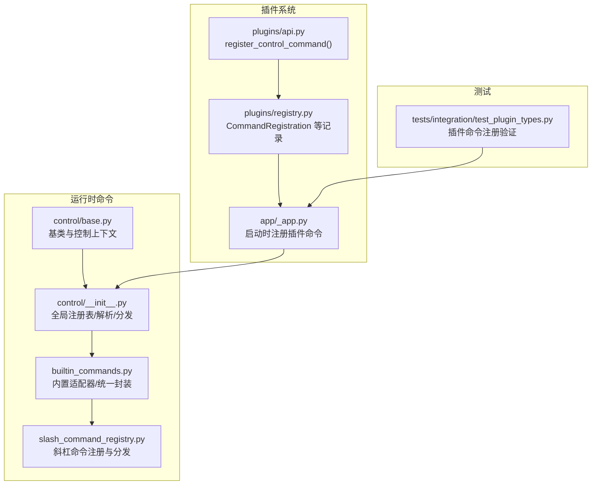
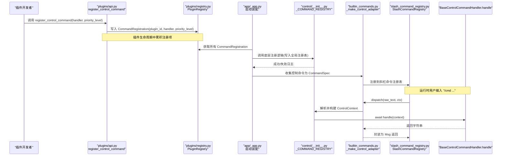
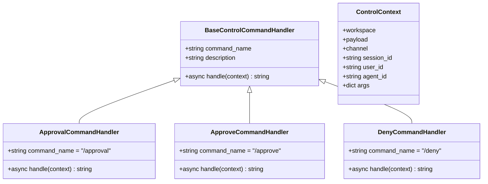
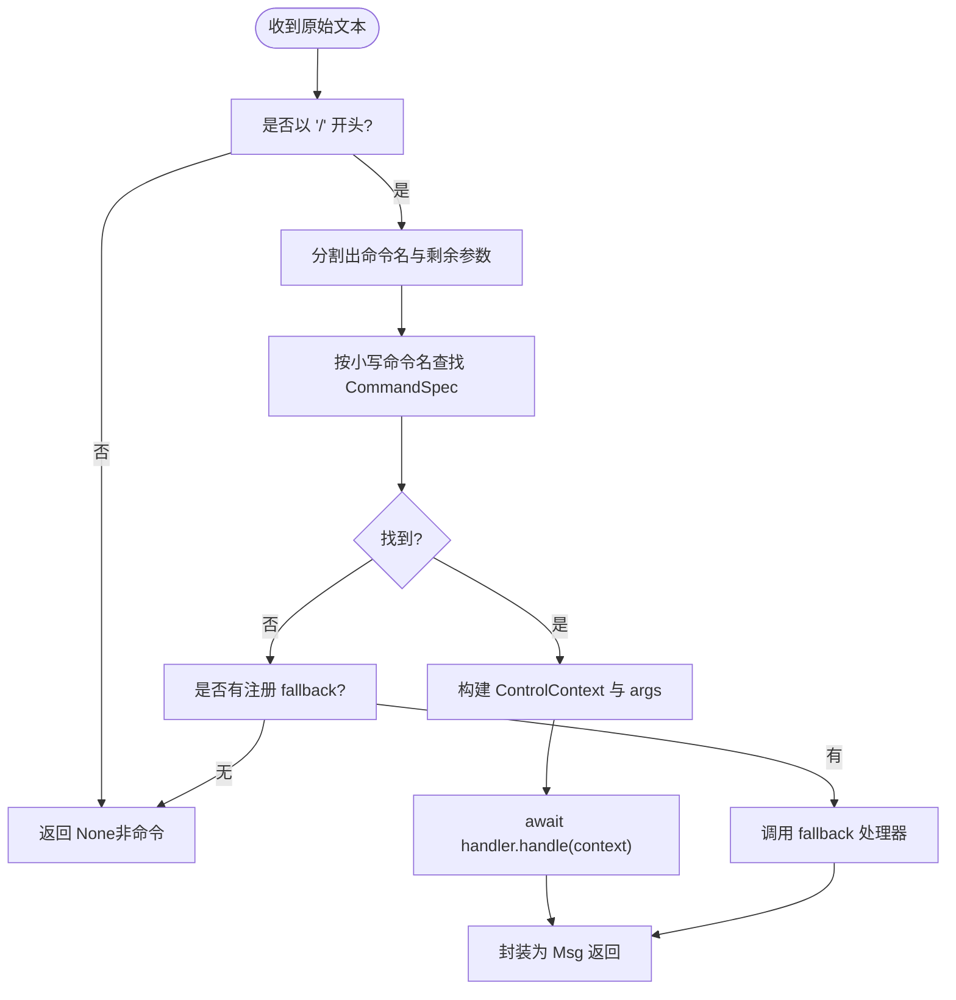
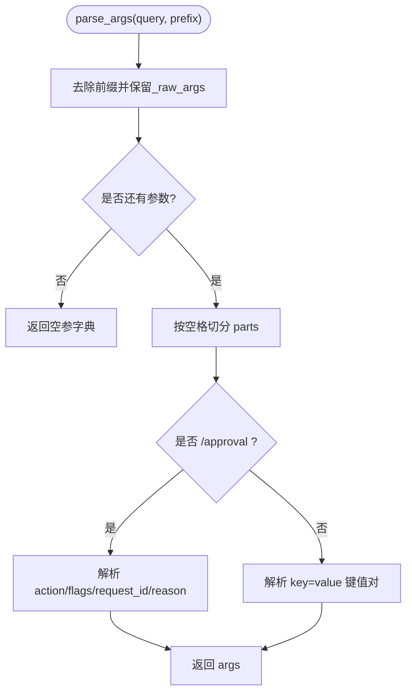
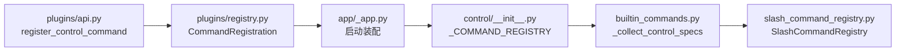

# 命令插件

<cite>
**本文引用的文件**   
- [src/qwenpaw/runtime/commands/control/base.py](file://src/qwenpaw/runtime/commands/control/base.py)
- [src/qwenpaw/runtime/commands/control/__init__.py](file://src/qwenpaw/runtime/commands/control/__init__.py)
- [src/qwenpaw/runtime/commands/control/approval_handler.py](file://src/qwenpaw/runtime/commands/control/approval_handler.py)
- [src/qwenpaw/runtime/builtin_commands.py](file://src/qwenpaw/runtime/builtin_commands.py)
- [src/qwenpaw/runtime/slash_command_registry.py](file://src/qwenpaw/runtime/slash_command_registry.py)
- [src/qwenpaw/plugins/api.py](file://src/qwenpaw/plugins/api.py)
- [src/qwenpaw/plugins/registry.py](file://src/qwenpaw/plugins/registry.py)
- [src/qwenpaw/app/_app.py](file://src/qwenpaw/app/_app.py)
- [tests/integration/test_plugin_types.py](file://tests/integration/test_plugin_types.py)
</cite>

## 目录
1. [简介](#简介)
2. [项目结构](#项目结构)
3. [核心组件](#核心组件)
4. [架构总览](#架构总览)
5. [详细组件分析](#详细组件分析)
6. [依赖关系分析](#依赖关系分析)
7. [性能与并发特性](#性能与并发特性)
8. [故障排查指南](#故障排查指南)
9. [结论](#结论)
10. [附录：自定义命令插件示例](#附录自定义命令插件示例)

## 简介
本章节面向 QwenPaw 命令插件开发者，系统化说明命令插件的核心接口、注册机制、路由匹配、参数解析与绑定、返回值格式化、权限控制、会话上下文、异步执行机制以及帮助文档生成与错误提示。内容覆盖三类命令场景：
- /slash 控制命令（高优先级）
- 快捷指令（如 /approve、/deny）
- 批量操作（通过统一适配器或子命令实现）

## 项目结构
命令插件相关代码主要分布在运行时命令子系统与插件系统之间：
- 控制命令基类与全局注册表：runtime/commands/control
- 内置命令适配与统一分发：runtime/builtin_commands
- 斜杠命令注册与分发：runtime/slash_command_registry
- 插件 API 与注册中心：plugins/api、plugins/registry
- 应用启动时加载并注册插件命令：app/_app
- 集成测试验证插件命令实际注册：tests/integration/test_plugin_types

图表来源
- [src/qwenpaw/runtime/commands/control/base.py:1-76](file://src/qwenpaw/runtime/commands/control/base.py#L1-L76)
- [src/qwenpaw/runtime/commands/control/__init__.py:1-264](file://src/qwenpaw/runtime/commands/control/__init__.py#L1-L264)
- [src/qwenpaw/runtime/builtin_commands.py:131-279](file://src/qwenpaw/runtime/builtin_commands.py#L131-L279)
- [src/qwenpaw/runtime/slash_command_registry.py:1-133](file://src/qwenpaw/runtime/slash_command_registry.py#L1-L133)
- [src/qwenpaw/plugins/api.py:413-457](file://src/qwenpaw/plugins/api.py#L413-L457)
- [src/qwenpaw/plugins/registry.py:81-142](file://src/qwenpaw/plugins/registry.py#L81-L142)
- [src/qwenpaw/app/_app.py:587-616](file://src/qwenpaw/app/_app.py#L587-L616)
- [tests/integration/test_plugin_types.py:143-178](file://tests/integration/test_plugin_types.py#L143-L178)

章节来源
- [src/qwenpaw/runtime/commands/control/base.py:1-76](file://src/qwenpaw/runtime/commands/control/base.py#L1-L76)
- [src/qwenpaw/runtime/commands/control/__init__.py:1-264](file://src/qwenpaw/runtime/commands/control/__init__.py#L1-L264)
- [src/qwenpaw/runtime/builtin_commands.py:131-279](file://src/qwenpaw/runtime/builtin_commands.py#L131-L279)
- [src/qwenpaw/runtime/slash_command_registry.py:1-133](file://src/qwenpaw/runtime/slash_command_registry.py#L1-L133)
- [src/qwenpaw/plugins/api.py:413-457](file://src/qwenpaw/plugins/api.py#L413-L457)
- [src/qwenpaw/plugins/registry.py:81-142](file://src/qwenpaw/plugins/registry.py#L81-L142)
- [src/qwenpaw/app/_app.py:587-616](file://src/qwenpaw/app/_app.py#L587-L616)
- [tests/integration/test_plugin_types.py:143-178](file://tests/integration/test_plugin_types.py#L143-L178)

## 核心组件
- 控制命令基类与控制上下文
  - BaseControlCommandHandler：定义 command_name、description 与抽象方法 handle(context)。
  - ControlContext：包含 workspace、payload、channel、session_id、user_id、agent_id、args 等上下文信息。
- 控制命令注册与分发
  - 全局 _COMMAND_REGISTRY：command_name -> handler 实例映射。
  - register_command/unregister_command：注册/注销命令。
  - is_control_command/handle_control_command：判断是否为控制命令并分发到具体处理器。
  - parse_args：将查询文本解析为键值对字典，并对特定命令（如 /approval）做特殊处理。
- 内置命令适配器
  - _make_control_adapter：将 BaseControlCommandHandler 包装为 CommandSpec，负责构造 ControlContext、调用 handle、异常捕获与 Msg 返回。
  - _collect_control_specs：从全局注册表收集所有控制命令，供统一斜杠命令分发使用。
- 斜杠命令注册与分发
  - SlashCommandRegistry：维护 name->CommandSpec 的映射，支持别名、分类、help_text、元数据；提供 resolve/dispatch。
  - CommandSpec：声明式描述一个斜杠命令（名称、处理器、别名、分类、帮助文本、元数据）。
- 插件侧注册入口
  - plugins/api.register_control_command：插件通过此 API 注册控制命令，内部写入 PluginRegistry 的 CommandRegistration。
  - app/_app：在应用启动阶段遍历插件注册项，调用底层注册逻辑完成最终注册。

章节来源
- [src/qwenpaw/runtime/commands/control/base.py:1-76](file://src/qwenpaw/runtime/commands/control/base.py#L1-L76)
- [src/qwenpaw/runtime/commands/control/__init__.py:36-140](file://src/qwenpaw/runtime/commands/control/__init__.py#L36-L140)
- [src/qwenpaw/runtime/commands/control/__init__.py:141-242](file://src/qwenpaw/runtime/commands/control/__init__.py#L141-L242)
- [src/qwenpaw/runtime/builtin_commands.py:164-241](file://src/qwenpaw/runtime/builtin_commands.py#L164-L241)
- [src/qwenpaw/runtime/builtin_commands.py:244-256](file://src/qwenpaw/runtime/builtin_commands.py#L244-L256)
- [src/qwenpaw/runtime/slash_command_registry.py:27-133](file://src/qwenpaw/runtime/slash_command_registry.py#L27-L133)
- [src/qwenpaw/plugins/api.py:425-446](file://src/qwenpaw/plugins/api.py#L425-L446)
- [src/qwenpaw/plugins/registry.py:81-142](file://src/qwenpaw/plugins/registry.py#L81-L142)
- [src/qwenpaw/app/_app.py:587-616](file://src/qwenpaw/app/_app.py#L587-L616)

## 架构总览
下图展示“插件注册 → 应用启动装配 → 运行时分发”的完整链路。

图表来源
- [src/qwenpaw/plugins/api.py:425-446](file://src/qwenpaw/plugins/api.py#L425-L446)
- [src/qwenpaw/plugins/registry.py:81-142](file://src/qwenpaw/plugins/registry.py#L81-L142)
- [src/qwenpaw/app/_app.py:587-616](file://src/qwenpaw/app/_app.py#L587-L616)
- [src/qwenpaw/runtime/commands/control/__init__.py:36-140](file://src/qwenpaw/runtime/commands/control/__init__.py#L36-L140)
- [src/qwenpaw/runtime/builtin_commands.py:164-241](file://src/qwenpaw/runtime/builtin_commands.py#L164-L241)
- [src/qwenpaw/runtime/slash_command_registry.py:108-124](file://src/qwenpaw/runtime/slash_command_registry.py#L108-L124)

## 详细组件分析

### 控制命令基类与上下文
- BaseControlCommandHandler
  - 属性：command_name（必须以 “/” 开头）、description（对外可见的帮助摘要）。
  - 方法：handle(context) -> str（异步），由框架统一捕获异常并格式化为错误消息。
- ControlContext
  - 字段：workspace、payload、channel、session_id、user_id、agent_id、args。
  - 用途：为命令处理器提供运行期上下文，包括工作空间、通道、会话与用户标识、已解析的参数。

图表来源
- [src/qwenpaw/runtime/commands/control/base.py:19-76](file://src/qwenpaw/runtime/commands/control/base.py#L19-L76)
- [src/qwenpaw/runtime/commands/control/approval_handler.py:21-38](file://src/qwenpaw/runtime/commands/control/approval_handler.py#L21-L38)
- [src/qwenpaw/runtime/commands/control/approval_handler.py:301-341](file://src/qwenpaw/runtime/commands/control/approval_handler.py#L301-L341)
- [src/qwenpaw/runtime/commands/control/approval_handler.py:343-383](file://src/qwenpaw/runtime/commands/control/approval_handler.py#L343-L383)

章节来源
- [src/qwenpaw/runtime/commands/control/base.py:19-76](file://src/qwenpaw/runtime/commands/control/base.py#L19-L76)
- [src/qwenpaw/runtime/commands/control/approval_handler.py:21-38](file://src/qwenpaw/runtime/commands/control/approval_handler.py#L21-L38)
- [src/qwenpaw/runtime/commands/control/approval_handler.py:301-341](file://src/qwenpaw/runtime/commands/control/approval_handler.py#L301-L341)
- [src/qwenpaw/runtime/commands/control/approval_handler.py:343-383](file://src/qwenpaw/runtime/commands/control/approval_handler.py#L343-L383)

### 命令注册与路由匹配
- 控制命令注册
  - control/__init__.py 中的 _COMMAND_REGISTRY 保存所有控制命令。
  - register_command 校验 command_name 非空且可覆盖已有条目（带警告）。
  - unregister_command 仅用于插件卸载时移除插件命令。
- 路由匹配与分发
  - is_control_command 基于首词匹配是否属于控制命令。
  - handle_control_command 提取 token、查找 handler、解析参数、调用 handle 并统一异常处理。
- 内置适配器与斜杠命令注册
  - builtin_commands._make_control_adapter 将控制命令包装为 CommandSpec，负责：
    - 从 HookContext 中提取 workspace/request/channel/session/user/agent 等信息，构造 ControlContext。
    - 调用 parse_args 解析参数。
    - 调用 handler.handle 并捕获异常，返回 Msg。
  - builtin_commands._collect_control_specs 扫描全局注册表，生成 CommandSpec 列表。
  - slash_command_registry.SlashCommandRegistry 提供 resolve/dispatch，支持别名、分类、help_text 与 fallback。

图表来源
- [src/qwenpaw/runtime/slash_command_registry.py:84-124](file://src/qwenpaw/runtime/slash_command_registry.py#L84-L124)
- [src/qwenpaw/runtime/builtin_commands.py:164-241](file://src/qwenpaw/runtime/builtin_commands.py#L164-L241)
- [src/qwenpaw/runtime/commands/control/__init__.py:103-140](file://src/qwenpaw/runtime/commands/control/__init__.py#L103-L140)
- [src/qwenpaw/runtime/commands/control/__init__.py:204-242](file://src/qwenpaw/runtime/commands/control/__init__.py#L204-L242)

章节来源
- [src/qwenpaw/runtime/commands/control/__init__.py:36-140](file://src/qwenpaw/runtime/commands/control/__init__.py#L36-L140)
- [src/qwenpaw/runtime/commands/control/__init__.py:204-242](file://src/qwenpaw/runtime/commands/control/__init__.py#L204-L242)
- [src/qwenpaw/runtime/builtin_commands.py:164-241](file://src/qwenpaw/runtime/builtin_commands.py#L164-L241)
- [src/qwenpaw/runtime/slash_command_registry.py:84-124](file://src/qwenpaw/runtime/slash_command_registry.py#L84-L124)

### 参数解析与绑定
- 通用解析
  - control/__init__.py.parse_args 默认按空格分词，识别 key=value 形式，并将原始参数保留在 _raw_args。
- 特殊命令解析
  - /approval：自动识别 action（approve/deny/list/cancel），支持 --exact/--pattern 等标志位，request_id 与 reason 的位置语义明确。
  - /approve 与 /deny：作为快捷指令，内部将原始参数转换为 /approval 的子命令参数后委托给 ApprovalCommandHandler。

图表来源
- [src/qwenpaw/runtime/commands/control/__init__.py:141-202](file://src/qwenpaw/runtime/commands/control/__init__.py#L141-L202)
- [src/qwenpaw/runtime/commands/control/approval_handler.py:301-341](file://src/qwenpaw/runtime/commands/control/approval_handler.py#L301-L341)
- [src/qwenpaw/runtime/commands/control/approval_handler.py:343-383](file://src/qwenpaw/runtime/commands/control/approval_handler.py#L343-L383)

章节来源
- [src/qwenpaw/runtime/commands/control/__init__.py:141-202](file://src/qwenpaw/runtime/commands/control/__init__.py#L141-L202)
- [src/qwenpaw/runtime/commands/control/approval_handler.py:301-341](file://src/qwenpaw/runtime/commands/control/approval_handler.py#L301-L341)
- [src/qwenpaw/runtime/commands/control/approval_handler.py:343-383](file://src/qwenpaw/runtime/commands/control/approval_handler.py#L343-L383)

### 返回值格式化与用户反馈
- 统一封装
  - builtin_commands._make_control_adapter 将处理器返回的字符串封装为 Msg（assistant 角色，TextBlock 类型），确保前端一致渲染。
- 错误提示
  - 若处理器抛出异常，适配器会捕获并返回“命令失败”的友好提示，同时记录异常堆栈。
- 帮助文本
  - CommandSpec.help_text 可用于客户端自动补全与帮助展示；部分命令提供 _usage_hint 静态方法生成使用说明。

章节来源
- [src/qwenpaw/runtime/builtin_commands.py:164-241](file://src/qwenpaw/runtime/builtin_commands.py#L164-L241)
- [src/qwenpaw/runtime/slash_command_registry.py:27-43](file://src/qwenpaw/runtime/slash_command_registry.py#L27-L43)
- [src/qwenpaw/runtime/commands/control/approval_handler.py:279-298](file://src/qwenpaw/runtime/commands/control/approval_handler.py#L279-L298)

### 权限检查与会话上下文
- 会话上下文
  - ControlContext 携带 session_id、user_id、agent_id，便于命令处理器进行权限判定与审计。
- 权限策略
  - 平台提供治理策略与工具守卫能力（例如审批流），命令可通过访问这些服务实现细粒度控制。
  - 快捷指令 /approve 与 /deny 直接对接审批服务，体现“命令即策略执行入口”的设计。

章节来源
- [src/qwenpaw/runtime/commands/control/base.py:19-40](file://src/qwenpaw/runtime/commands/control/base.py#L19-L40)
- [src/qwenpaw/runtime/commands/control/approval_handler.py:21-38](file://src/qwenpaw/runtime/commands/control/approval_handler.py#L21-L38)

### 异步执行机制
- 处理器均为异步函数（async def handle），由框架通过 await 调度执行，天然支持并发与超时控制。
- 适配器层统一异常捕获与结果封装，保证上层稳定。

章节来源
- [src/qwenpaw/runtime/commands/control/base.py:62-76](file://src/qwenpaw/runtime/commands/control/base.py#L62-L76)
- [src/qwenpaw/runtime/builtin_commands.py:164-241](file://src/qwenpaw/runtime/builtin_commands.py#L164-L241)

## 依赖关系分析
- 插件 API 与注册中心
  - plugins/api.register_control_command 将命令注册为 CommandRegistration，附带 plugin_id、handler、priority_level。
  - plugins/registry.PluginRegistry 集中管理各类注册项。
- 应用启动装配
  - app/_app 在启动阶段遍历插件注册项，调用底层注册逻辑，输出“Registered plugin control command”日志。
- 运行时分发
  - runtime/builtin_commands 将控制命令转为 CommandSpec，注入到 SlashCommandRegistry。
  - runtime/slash_command_registry 负责解析与分发。

图表来源
- [src/qwenpaw/plugins/api.py:425-446](file://src/qwenpaw/plugins/api.py#L425-L446)
- [src/qwenpaw/plugins/registry.py:81-142](file://src/qwenpaw/plugins/registry.py#L81-L142)
- [src/qwenpaw/app/_app.py:587-616](file://src/qwenpaw/app/_app.py#L587-L616)
- [src/qwenpaw/runtime/builtin_commands.py:244-256](file://src/qwenpaw/runtime/builtin_commands.py#L244-L256)
- [src/qwenpaw/runtime/slash_command_registry.py:108-124](file://src/qwenpaw/runtime/slash_command_registry.py#L108-L124)

章节来源
- [src/qwenpaw/plugins/api.py:425-446](file://src/qwenpaw/plugins/api.py#L425-L446)
- [src/qwenpaw/plugins/registry.py:81-142](file://src/qwenpaw/plugins/registry.py#L81-L142)
- [src/qwenpaw/app/_app.py:587-616](file://src/qwenpaw/app/_app.py#L587-L616)
- [src/qwenpaw/runtime/builtin_commands.py:244-256](file://src/qwenpaw/runtime/builtin_commands.py#L244-L256)
- [src/qwenpaw/runtime/slash_command_registry.py:108-124](file://src/qwenpaw/runtime/slash_command_registry.py#L108-L124)

## 性能与并发特性
- 解析与匹配
  - 命令名匹配为 O(1) 哈希查找；参数解析为线性扫描，整体开销低。
- 异步执行
  - 处理器异步执行，避免阻塞事件循环；适配器层异常捕获不影响其他请求。
- 扩展建议
  - 复杂命令建议拆分子命令或使用批处理模式，减少单次处理的复杂度。
  - 对 I/O 密集操作应使用异步库，避免同步阻塞。

[本节为通用指导，不直接分析具体文件]

## 故障排查指南
- 插件命令未生效
  - 检查插件是否正确调用 register_control_command，确认日志中出现“Registered plugin control command”。
  - 参考集成测试用例，验证上传插件后服务器日志包含预期命令名。
- 命令重复注册
  - 同名命令会被覆盖并打印警告；请确保插件间命名唯一。
- 参数解析异常
  - 对于 /approval 系列命令，注意 action、flags 与 request_id 的顺序；必要时使用 _raw_args 自行解析。
- 异常与错误提示
  - 处理器抛出的异常会被统一捕获并以“命令失败”的形式返回；请在处理器内尽量细化错误信息以便定位问题。

章节来源
- [src/qwenpaw/app/_app.py:587-616](file://src/qwenpaw/app/_app.py#L587-L616)
- [src/qwenpaw/runtime/commands/control/__init__.py:50-76](file://src/qwenpaw/runtime/commands/control/__init__.py#L50-L76)
- [src/qwenpaw/runtime/builtin_commands.py:222-241](file://src/qwenpaw/runtime/builtin_commands.py#L222-L241)
- [tests/integration/test_plugin_types.py:715-748](file://tests/integration/test_plugin_types.py#L715-L748)

## 结论
QwenPaw 的命令插件体系通过“基类 + 全局注册 + 统一适配器 + 斜杠命令分发”的分层设计，实现了高内聚、低耦合的命令扩展能力。插件仅需关注业务逻辑（handle），其余解析、上下文、权限、异常与格式化均由框架承担。结合审批流与治理策略，命令可作为安全可控的执行入口，满足 /slash、快捷指令与批量操作等多类场景。

[本节为总结性内容，不直接分析具体文件]

## 附录：自定义命令插件示例
以下示例演示如何编写一个命令插件，并在安装后被系统正确注册与执行。

- 插件后端（plugin.py）
  - 继承 BaseControlCommandHandler，定义 command_name 与 description。
  - 实现 async def handle(self, context): 返回字符串。
  - 在插件入口类的 register(api) 中调用 api.register_control_command(handler=..., priority_level=...)。
- 插件清单（manifest）
  - 指定 plugin_type="command"、entry.backend="plugin.py"、meta.command_name 等元信息。
- 验证
  - 上传插件后，查看服务器日志是否包含“Registered plugin control command: /<your-command>”。
  - 在控制台发送 /<your-command> 触发执行。

章节来源
- [tests/integration/test_plugin_types.py:143-178](file://tests/integration/test_plugin_types.py#L143-L178)
- [tests/integration/test_plugin_types.py:693-712](file://tests/integration/test_plugin_types.py#L693-L712)
- [tests/integration/test_plugin_types.py:715-748](file://tests/integration/test_plugin_types.py#L715-L748)
- [src/qwenpaw/plugins/api.py:425-446](file://src/qwenpaw/plugins/api.py#L425-L446)
- [src/qwenpaw/runtime/commands/control/base.py:42-76](file://src/qwenpaw/runtime/commands/control/base.py#L42-L76)