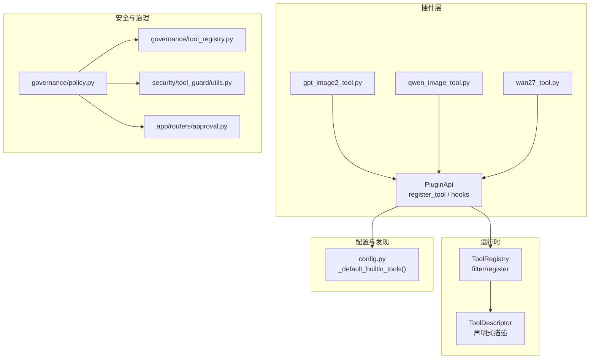
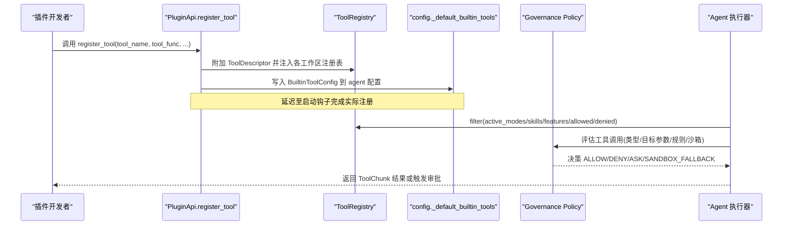
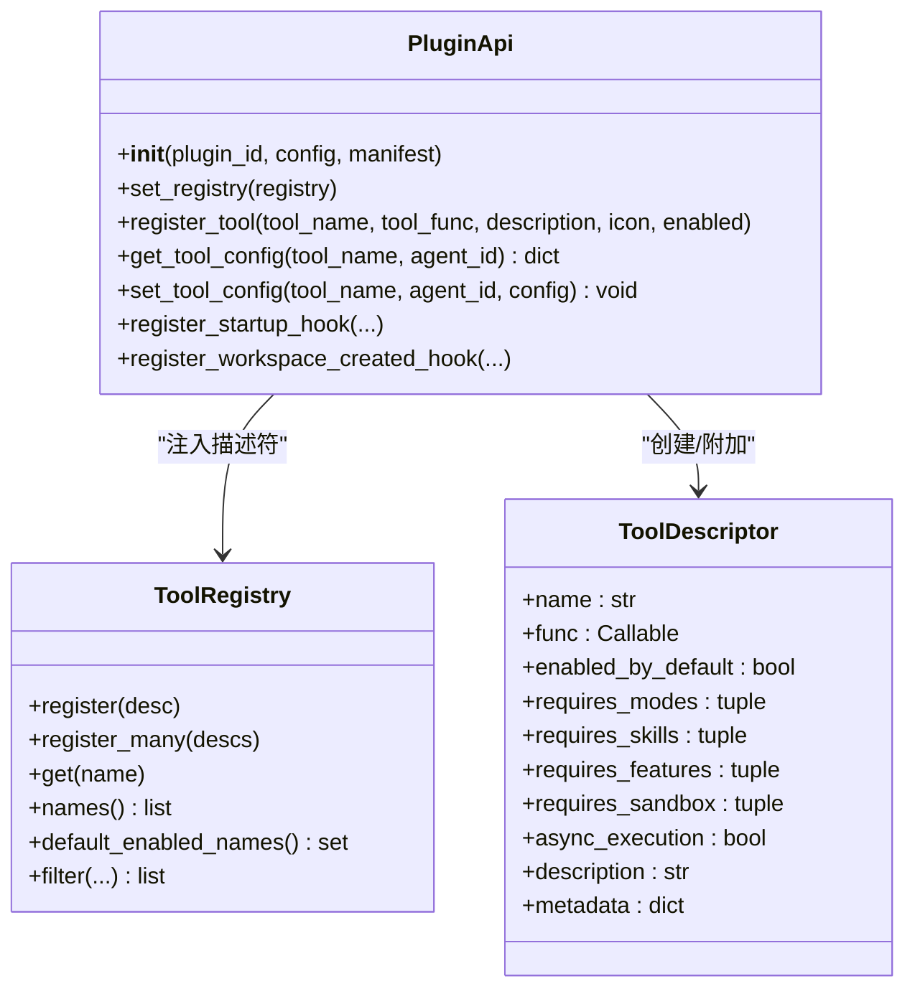
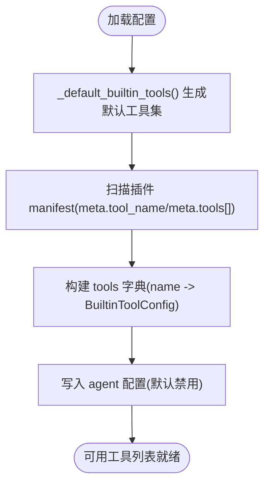
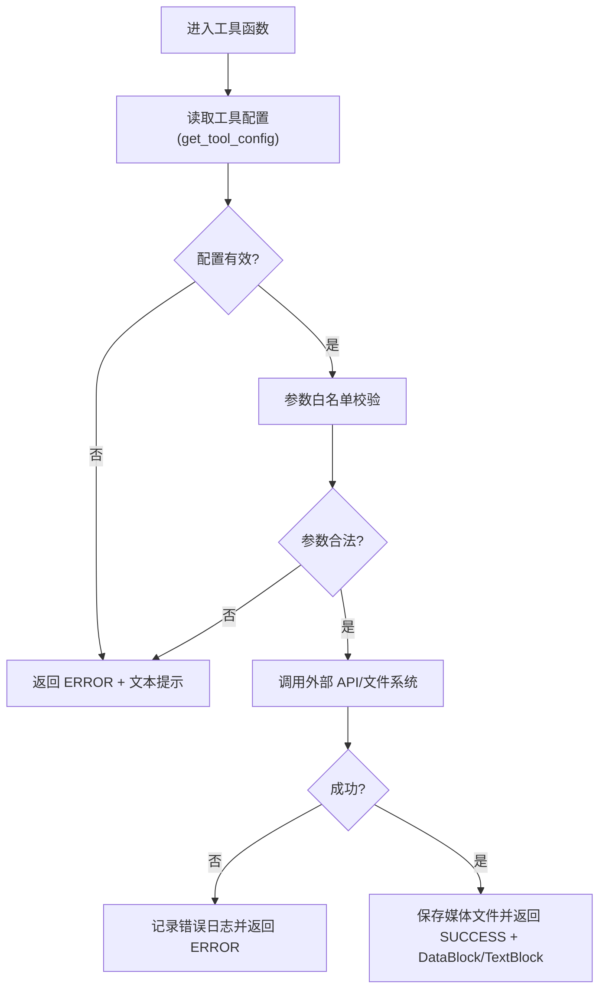
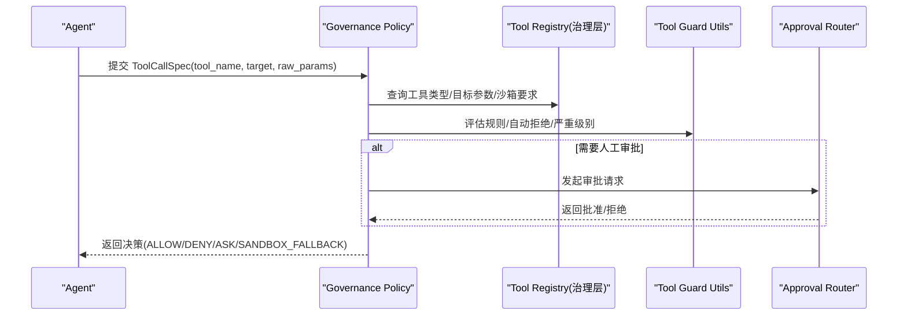
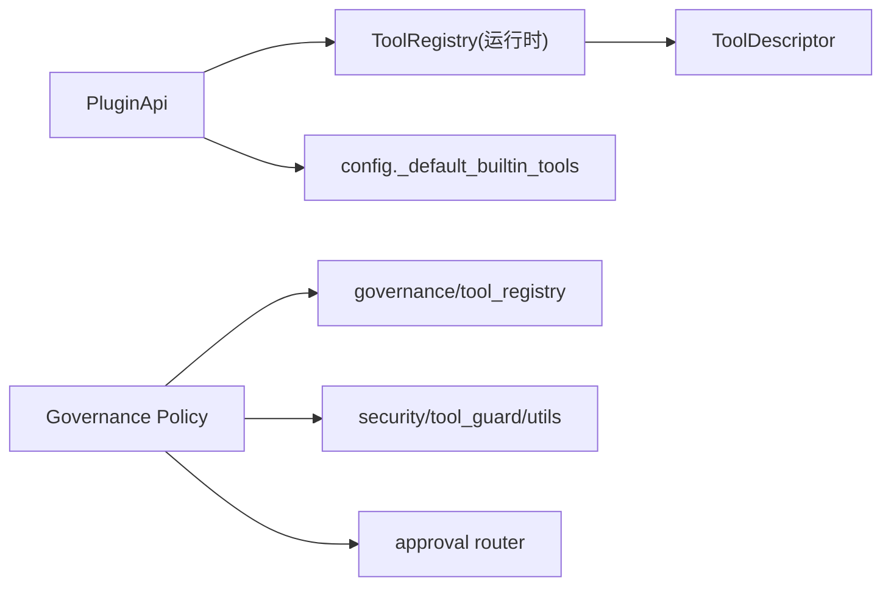

# 工具插件

<cite>
**本文引用的文件**   
- [src/qwenpaw/plugins/api.py](file://src/qwenpaw/plugins/api.py)
- [src/qwenpaw/runtime/tool_registry.py](file://src/qwenpaw/runtime/tool_registry.py)
- [src/qwenpaw/config/config.py](file://src/qwenpaw/config/config.py)
- [plugins/tool/gpt-image2/gpt_image2_tool.py](file://plugins/tool/gpt-image2/gpt_image2_tool.py)
- [plugins/tool/qwen-image/qwen_image_tool.py](file://plugins/tool/qwen-image/qwen_image_tool.py)
- [plugins/tool/wan27/wan27_tool.py](file://plugins/tool/wan27/wan27_tool.py)
- [src/qwenpaw/security/tool_guard/utils.py](file://src/qwenpaw/security/tool_guard/utils.py)
- [src/qwenpaw/app/routers/approval.py](file://src/qwenpaw/app/routers/approval.py)
- [src/qwenpaw/governance/policy.py](file://src/qwenpaw/governance/policy.py)
- [src/qwenpaw/governance/tool_registry.py](file://src/qwenpaw/governance/tool_registry.py)
- [tests/integration/test_tools.py](file://tests/integration/test_tools.py)
- [tests/integration/test_tool_config.py](file://tests/integration/test_tool_config.py)
</cite>

## 目录
1. [简介](#简介)
2. [项目结构](#项目结构)
3. [核心组件](#核心组件)
4. [架构总览](#架构总览)
5. [详细组件分析](#详细组件分析)
6. [依赖关系分析](#依赖关系分析)
7. [性能与执行特性](#性能与执行特性)
8. [故障排查指南](#故障排查指南)
9. [结论](#结论)
10. [附录：示例与最佳实践](#附录示例与最佳实践)

## 简介
本章节面向 QwenPaw 工具插件开发者，系统性说明“工具插件”的接口定义、注册机制、参数校验、错误处理、生命周期方法（如 __init__、execute、validate_params）、元数据与权限控制、沙箱执行环境、配置管理、依赖注入、日志记录、测试与调试技巧。文档同时提供完整代码示例路径，帮助快速上手创建自定义工具插件，覆盖文件操作、API 调用、数据处理等常见场景。

## 项目结构
围绕工具插件的关键目录与文件：
- 插件 API 与注册入口：src/qwenpaw/plugins/api.py
- 运行时工具描述与注册表：src/qwenpaw/runtime/tool_registry.py
- 内置工具清单与合并策略：src/qwenpaw/config/config.py
- 安全治理与沙箱：src/qwenpaw/governance/policy.py、src/qwenpaw/governance/tool_registry.py、src/qwenpaw/security/tool_guard/utils.py
- 审批流接口：src/qwenpaw/app/routers/approval.py
- 示例工具插件：plugins/tool/gpt-image2、qwen-image、wan27
- 集成测试：tests/integration/test_tools.py、tests/integration/test_tool_config.py

图表来源
- [src/qwenpaw/plugins/api.py:54-112](file://src/qwenpaw/plugins/api.py#L54-L112)
- [src/qwenpaw/runtime/tool_registry.py:17-45](file://src/qwenpaw/runtime/tool_registry.py#L17-L45)
- [src/qwenpaw/config/config.py:1706-1895](file://src/qwenpaw/config/config.py#L1706-L1895)
- [src/qwenpaw/governance/policy.py:74-115](file://src/qwenpaw/governance/policy.py#L74-L115)
- [src/qwenpaw/governance/tool_registry.py:47-68](file://src/qwenpaw/governance/tool_registry.py#L47-L68)
- [src/qwenpaw/security/tool_guard/utils.py:159-193](file://src/qwenpaw/security/tool_guard/utils.py#L159-L193)
- [src/qwenpaw/app/routers/approval.py:1-50](file://src/qwenpaw/app/routers/approval.py#L1-L50)

章节来源
- [src/qwenpaw/plugins/api.py:54-112](file://src/qwenpaw/plugins/api.py#L54-L112)
- [src/qwenpaw/runtime/tool_registry.py:17-45](file://src/qwenpaw/runtime/tool_registry.py#L17-L45)
- [src/qwenpaw/config/config.py:1706-1895](file://src/qwenpaw/config/config.py#L1706-L1895)

## 核心组件
- PluginApi：插件对外暴露的统一接口，负责注册工具、HTTP 路由、中间件、启动/关闭钩子、工作区事件等。其中 register_tool 是工具插件的核心入口。
- ToolDescriptor + ToolRegistry：运行时对工具的声明式描述与按请求过滤的注册表，支持模式/技能/特性/沙箱需求等多维筛选。
- 配置与发现：config.py 中的 _default_builtin_tools 聚合内置与插件声明的工具元数据；ToolsConfig 负责持久化与合并。
- 安全治理：policy.py 与 governance/tool_registry.py 定义工具类型、目标参数、匹配规则与沙箱要求；tool_guard/utils.py 输出结构化日志与严重级别汇总。
- 审批流：approval.py 提供审批动作的 HTTP 端点，用于高严重性发现的交互式批准。

章节来源
- [src/qwenpaw/plugins/api.py:172-204](file://src/qwenpaw/plugins/api.py#L172-L204)
- [src/qwenpaw/runtime/tool_registry.py:47-83](file://src/qwenpaw/runtime/tool_registry.py#L47-L83)
- [src/qwenpaw/config/config.py:1900-1926](file://src/qwenpaw/config/config.py#L1900-L1926)
- [src/qwenpaw/governance/policy.py:74-115](file://src/qwenpaw/governance/policy.py#L74-L115)
- [src/qwenpaw/governance/tool_registry.py:47-68](file://src/qwenpaw/governance/tool_registry.py#L47-L68)
- [src/qwenpaw/security/tool_guard/utils.py:159-193](file://src/qwenpaw/security/tool_guard/utils.py#L159-L193)
- [src/qwenpaw/app/routers/approval.py:1-50](file://src/qwenpaw/app/routers/approval.py#L1-L50)

## 架构总览
下图展示从插件注册到运行时选择、再到安全治理与执行的端到端流程。

图表来源
- [src/qwenpaw/plugins/api.py:54-112](file://src/qwenpaw/plugins/api.py#L54-L112)
- [src/qwenpaw/runtime/tool_registry.py:91-134](file://src/qwenpaw/runtime/tool_registry.py#L91-L134)
- [src/qwenpaw/config/config.py:1706-1895](file://src/qwenpaw/config/config.py#L1706-L1895)
- [src/qwenpaw/governance/policy.py:74-115](file://src/qwenpaw/governance/policy.py#L74-L115)

## 详细组件分析

### 插件 API 与工具注册
- PluginApi.__init__：初始化插件上下文（plugin_id、config、manifest），持有 registry 引用。
- PluginApi.register_tool：推荐方式注册工具函数。内部会：
  - 将函数挂入 qwenpaw.agents.tools 模块并加入 __all__
  - 通过 _bridge_to_runtime 为函数附加 ToolDescriptor 并注入工作区 ToolRegistry
  - 通过 _write_tool_config 在 agent 配置中写入 BuiltinToolConfig（默认禁用，用户可显式启用）
  - 使用启动钩子确保应用与 Agent 上下文完全初始化后再执行注册
- get_tool_config：工具函数内便捷获取当前 Agent 的工具配置（如 api_key、endpoint、timeout）。

图表来源
- [src/qwenpaw/plugins/api.py:172-204](file://src/qwenpaw/plugins/api.py#L172-L204)
- [src/qwenpaw/plugins/api.py:614-698](file://src/qwenpaw/plugins/api.py#L614-L698)
- [src/qwenpaw/runtime/tool_registry.py:17-45](file://src/qwenpaw/runtime/tool_registry.py#L17-L45)
- [src/qwenpaw/runtime/tool_registry.py:47-83](file://src/qwenpaw/runtime/tool_registry.py#L47-L83)

章节来源
- [src/qwenpaw/plugins/api.py:172-204](file://src/qwenpaw/plugins/api.py#L172-L204)
- [src/qwenpaw/plugins/api.py:54-112](file://src/qwenpaw/plugins/api.py#L54-L112)
- [src/qwenpaw/plugins/api.py:614-698](file://src/qwenpaw/plugins/api.py#L614-L698)
- [src/qwenpaw/runtime/tool_registry.py:17-45](file://src/qwenpaw/runtime/tool_registry.py#L17-L45)
- [src/qwenpaw/runtime/tool_registry.py:47-83](file://src/qwenpaw/runtime/tool_registry.py#L47-L83)

### 工具元数据与配置管理
- 元数据来源：
  - 内置工具由 config.py 的 _default_builtin_tools 提供，包含 name、enabled、description、icon 等字段。
  - 插件可通过 plugin.json 的 meta.tool_name 或 meta.tools[] 声明工具，系统将其合并为 BuiltinToolConfig。
- 配置读写：
  - ToolsConfig 负责合并默认项与持久化配置，并对历史兼容字段进行归一化。
  - _write_tool_config 在注册时向当前 Agent 的配置写入条目（默认 disabled，需用户显式启用）。

图表来源
- [src/qwenpaw/config/config.py:1706-1895](file://src/qwenpaw/config/config.py#L1706-L1895)
- [src/qwenpaw/config/config.py:1900-1926](file://src/qwenpaw/config/config.py#L1900-L1926)
- [src/qwenpaw/plugins/api.py:114-167](file://src/qwenpaw/plugins/api.py#L114-L167)

章节来源
- [src/qwenpaw/config/config.py:1706-1895](file://src/qwenpaw/config/config.py#L1706-L1895)
- [src/qwenpaw/config/config.py:1900-1926](file://src/qwenpaw/config/config.py#L1900-L1926)
- [src/qwenpaw/plugins/api.py:114-167](file://src/qwenpaw/plugins/api.py#L114-L167)

### 参数验证与错误处理
- 参数验证：示例工具普遍采用白名单校验（如 size、quality、resolution、ratio、duration 等），不合法直接返回错误状态的 ToolChunk。
- 错误处理：统一以 ToolResultState.ERROR 返回，附带 TextBlock 文本提示；网络超时、IO 异常、API 非 200 均捕获并记录日志。
- 配置缺失：优先通过 get_tool_config 读取配置，未配置或缺少必要密钥时返回明确错误信息。

图表来源
- [plugins/tool/gpt-image2/gpt_image2_tool.py:22-256](file://plugins/tool/gpt-image2/gpt_image2_tool.py#L22-L256)
- [plugins/tool/qwen-image/qwen_image_tool.py:243-483](file://plugins/tool/qwen-image/qwen_image_tool.py#L243-L483)
- [plugins/tool/wan27/wan27_tool.py:180-387](file://plugins/tool/wan27/wan27_tool.py#L180-L387)

章节来源
- [plugins/tool/gpt-image2/gpt_image2_tool.py:22-256](file://plugins/tool/gpt-image2/gpt_image2_tool.py#L22-L256)
- [plugins/tool/qwen-image/qwen_image_tool.py:243-483](file://plugins/tool/qwen-image/qwen_image_tool.py#L243-L483)
- [plugins/tool/wan27/wan27_tool.py:180-387](file://plugins/tool/wan27/wan27_tool.py#L180-L387)

### 权限控制与安全治理
- 工具类型与目标参数：governance/tool_registry.py 维护工具类型（file/network/shell/internal）、目标参数名（如 file_path/command/url）、是否组合 pattern 参数、是否强制沙箱等元数据。
- 治理决策：policy.py 定义 GovernanceDecision/GovernanceRule，根据匹配模式决定 ALLOW/DENY/ASK/SANDBOX_FALLBACK，并结合 sandbox_enabled 全局开关影响 shell 类工具的执行路径。
- 自动拒绝规则：security/tool_guard/utils.py 支持环境变量或配置项 auto_denied_rules，命中后直接拒绝。
- 审批流：approval.py 暴露审批动作端点，供高严重性发现进入交互审批。

图表来源
- [src/qwenpaw/governance/tool_registry.py:47-68](file://src/qwenpaw/governance/tool_registry.py#L47-L68)
- [src/qwenpaw/governance/policy.py:74-115](file://src/qwenpaw/governance/policy.py#L74-L115)
- [src/qwenpaw/security/tool_guard/utils.py:159-193](file://src/qwenpaw/security/tool_guard/utils.py#L159-L193)
- [src/qwenpaw/app/routers/approval.py:1-50](file://src/qwenpaw/app/routers/approval.py#L1-L50)

章节来源
- [src/qwenpaw/governance/tool_registry.py:47-68](file://src/qwenpaw/governance/tool_registry.py#L47-L68)
- [src/qwenpaw/governance/policy.py:74-115](file://src/qwenpaw/governance/policy.py#L74-L115)
- [src/qwenpaw/security/tool_guard/utils.py:159-193](file://src/qwenpaw/security/tool_guard/utils.py#L159-L193)
- [src/qwenpaw/app/routers/approval.py:1-50](file://src/qwenpaw/app/routers/approval.py#L1-L50)

### 沙箱执行环境
- 当治理层判定为 SANDBOX_FALLBACK 或规则要求沙箱时，命令将在受限的文件系统与资源视图下执行，仅允许显式挂载的路径访问。
- sandbox_enabled 全局开关控制无匹配规则的 shell 工具是否默认走沙箱路径。
- 典型沙箱能力包括：只读/写挂载、敏感路径 deny、网络策略、超时控制、环境变量注入等。

章节来源
- [src/qwenpaw/governance/policy.py:74-115](file://src/qwenpaw/governance/policy.py#L74-L115)
- [src/qwenpaw/config/config.py:2073-2106](file://src/qwenpaw/config/config.py#L2073-L2106)

### 生命周期方法与约定
- __init__：PluginApi 初始化，接收 plugin_id、config、manifest，并保留 registry 引用。
- execute：工具函数本身即“执行体”，示例工具均为异步函数，返回 ToolChunk（包含状态与内容块）。
- validate_params：未在框架层强制抽象，建议在工具函数入口处自行实现参数白名单与格式校验。
- 注册时机：register_tool 通过启动钩子延迟注册，确保应用与 Agent 上下文就绪。

章节来源
- [src/qwenpaw/plugins/api.py:172-204](file://src/qwenpaw/plugins/api.py#L172-L204)
- [src/qwenpaw/plugins/api.py:614-698](file://src/qwenpaw/plugins/api.py#L614-L698)
- [plugins/tool/gpt-image2/gpt_image2_tool.py:22-256](file://plugins/tool/gpt-image2/gpt_image2_tool.py#L22-L256)

## 依赖关系分析
- 插件层依赖运行时注册表与配置层：
  - PluginApi 通过 _bridge_to_runtime 注入 ToolDescriptor 到各工作区的 ToolRegistry。
  - 配置层 _default_builtin_tools 合并内置与插件声明的工具元数据。
- 治理层依赖工具元数据与规则：
  - governance/tool_registry.py 提供工具类型与目标参数映射。
  - policy.py 基于匹配模式与严重级别做出决策。
  - security/tool_guard/utils.py 输出结构化日志与严重级别汇总。

图表来源
- [src/qwenpaw/plugins/api.py:54-112](file://src/qwenpaw/plugins/api.py#L54-L112)
- [src/qwenpaw/config/config.py:1706-1895](file://src/qwenpaw/config/config.py#L1706-L1895)
- [src/qwenpaw/governance/policy.py:74-115](file://src/qwenpaw/governance/policy.py#L74-L115)
- [src/qwenpaw/governance/tool_registry.py:47-68](file://src/qwenpaw/governance/tool_registry.py#L47-L68)
- [src/qwenpaw/security/tool_guard/utils.py:159-193](file://src/qwenpaw/security/tool_guard/utils.py#L159-L193)
- [src/qwenpaw/app/routers/approval.py:1-50](file://src/qwenpaw/app/routers/approval.py#L1-L50)

章节来源
- [src/qwenpaw/plugins/api.py:54-112](file://src/qwenpaw/plugins/api.py#L54-L112)
- [src/qwenpaw/config/config.py:1706-1895](file://src/qwenpaw/config/config.py#L1706-L1895)
- [src/qwenpaw/governance/policy.py:74-115](file://src/qwenpaw/governance/policy.py#L74-L115)

## 性能与执行特性
- 异步执行：示例工具多为 async 函数，结合 httpx.AsyncClient 与 asyncio.to_thread 避免阻塞事件循环。
- 流式下载：图片/视频下载采用分块流式读取，降低内存峰值。
- 线程锁保护：DashScope SDK 的全局 base_http_api_url 设置使用线程锁保护，避免并发冲突。
- 过滤器开销：ToolRegistry.filter 基于集合运算进行多维筛选，复杂度与工具数量线性相关，适合大规模工具集。

章节来源
- [plugins/tool/gpt-image2/gpt_image2_tool.py:140-154](file://plugins/tool/gpt-image2/gpt_image2_tool.py#L140-L154)
- [plugins/tool/qwen-image/qwen_image_tool.py:136-170](file://plugins/tool/qwen-image/qwen_image_tool.py#L136-L170)
- [plugins/tool/wan27/wan27_tool.py:109-143](file://plugins/tool/wan27/wan27_tool.py#L109-L143)
- [src/qwenpaw/runtime/tool_registry.py:91-134](file://src/qwenpaw/runtime/tool_registry.py#L91-L134)

## 故障排查指南
- 工具未生效：
  - 检查是否在启动钩子阶段完成注册；确认 _bridge_to_runtime 已注入到工作区 ToolRegistry。
  - 查看 agent 配置中是否已写入 BuiltinToolConfig 且未被覆盖。
- 参数校验失败：
  - 对照工具函数的白名单与范围限制，定位非法输入。
- 外部 API 错误：
  - 检查 endpoint、api_key、timeout 配置；关注响应码与错误消息。
- 安全治理拦截：
  - 查看 tool_guard 日志输出，定位命中规则与严重级别；必要时调整 denied_tools 或 custom_rules。
- 审批卡住：
  - 确认 approval 端点可达，审批请求 ID 与 session_id 正确。

章节来源
- [src/qwenpaw/plugins/api.py:54-112](file://src/qwenpaw/plugins/api.py#L54-L112)
- [src/qwenpaw/plugins/api.py:114-167](file://src/qwenpaw/plugins/api.py#L114-L167)
- [plugins/tool/gpt-image2/gpt_image2_tool.py:156-173](file://plugins/tool/gpt-image2/gpt_image2_tool.py#L156-L173)
- [src/qwenpaw/security/tool_guard/utils.py:159-193](file://src/qwenpaw/security/tool_guard/utils.py#L159-L193)
- [src/qwenpaw/app/routers/approval.py:1-50](file://src/qwenpaw/app/routers/approval.py#L1-L50)

## 结论
QwenPaw 工具插件体系通过 PluginApi 提供统一的注册与生命周期管理能力，借助 ToolDescriptor/ToolRegistry 实现声明式工具描述与灵活筛选，配合治理层的安全策略与沙箱执行，形成“可插拔、可治理、可审计”的工具生态。示例工具展示了常见的 API 调用、参数校验、错误处理与媒体落盘流程，可作为开发自定义工具插件的参考模板。

## 附录：示例与最佳实践

### 如何创建自定义工具插件（步骤概览）
- 在插件包中定义工具函数（建议 async），并在函数内：
  - 使用 get_tool_config 读取配置（api_key、endpoint、timeout 等）
  - 进行参数白名单与范围校验
  - 调用外部 API 或本地文件操作
  - 统一返回 ToolChunk（SUCCESS/ERROR），包含 DataBlock/TextBlock
- 在插件的 register 方法中调用 PluginApi.register_tool 完成注册（描述、图标、默认启用策略）
- 如需暴露 REST 接口，可使用 register_http_router 注册 FastAPI 路由
- 如需监听工作区创建，使用 register_workspace_created_hook 进行初始化

章节来源
- [src/qwenpaw/plugins/api.py:614-698](file://src/qwenpaw/plugins/api.py#L614-L698)
- [src/qwenpaw/plugins/api.py:394-424](file://src/qwenpaw/plugins/api.py#L394-L424)
- [src/qwenpaw/plugins/api.py:358-392](file://src/qwenpaw/plugins/api.py#L358-L392)

### 示例：图像生成（OpenAI GPT Image 2）
- 功能要点：
  - 读取工具配置（api_key、endpoint、timeout）
  - 校验 size/quality 白名单
  - 调用 OpenAI images/generations 接口，解析 b64_json
  - 保存到 DEFAULT_MEDIA_DIR，并以 file:// URL 返回
- 参考路径：[plugins/tool/gpt-image2/gpt_image2_tool.py](file://plugins/tool/gpt-image2/gpt_image2_tool.py)

章节来源
- [plugins/tool/gpt-image2/gpt_image2_tool.py:22-256](file://plugins/tool/gpt-image2/gpt_image2_tool.py#L22-L256)

### 示例：图像生成与编辑（阿里云 DashScope Qwen-Image）
- 功能要点：
  - 使用 _extract_config 提取 api_key、endpoint、timeout、model
  - 调用 MultiModalConversation，解析 output.choices[].message.content 中的 image 字段
  - 下载图片到本地并返回 file:// URL
- 参考路径：[plugins/tool/qwen-image/qwen_image_tool.py](file://plugins/tool/qwen-image/qwen_image_tool.py)

章节来源
- [plugins/tool/qwen-image/qwen_image_tool.py:243-483](file://plugins/tool/qwen-image/qwen_image_tool.py#L243-L483)
- [plugins/tool/qwen-image/qwen_image_tool.py:486-763](file://plugins/tool/qwen-image/qwen_image_tool.py#L486-L763)

### 示例：视频生成（Wan 2.7）
- 功能要点：
  - 支持 text-to-video、image-to-video、reference-to-video 多种模式
  - 校验 resolution/ratio/duration 白名单
  - 调用 VideoSynthesis，下载视频到本地并返回 file:// URL
- 参考路径：[plugins/tool/wan27/wan27_tool.py](file://plugins/tool/wan27/wan27_tool.py)

章节来源
- [plugins/tool/wan27/wan27_tool.py:180-387](file://plugins/tool/wan27/wan27_tool.py#L180-L387)
- [plugins/tool/wan27/wan27_tool.py:390-691](file://plugins/tool/wan27/wan27_tool.py#L390-L691)

### 测试与调试技巧
- 集成测试：
  - 工具列表与切换：验证 GET /tools 包含预期工具，PATCH toggle 能更新 enabled 状态。
  - 工具配置 API：验证 GET /tools/{name}/config 与 PATCH 行为。
- 调试建议：
  - 开启 tool_guard 日志，观察命中规则与严重级别。
  - 在工具函数内增加关键路径日志，便于定位参数校验与网络调用问题。
  - 使用审批端点模拟审批流程，验证 ASK 分支。

章节来源
- [tests/integration/test_tools.py:1-42](file://tests/integration/test_tools.py#L1-L42)
- [tests/integration/test_tool_config.py:1-87](file://tests/integration/test_tool_config.py#L1-L87)
- [src/qwenpaw/security/tool_guard/utils.py:159-193](file://src/qwenpaw/security/tool_guard/utils.py#L159-L193)
- [src/qwenpaw/app/routers/approval.py:1-50](file://src/qwenpaw/app/routers/approval.py#L1-L50)