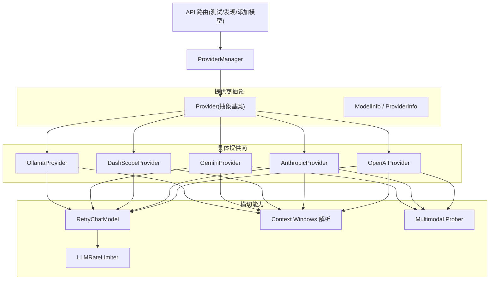
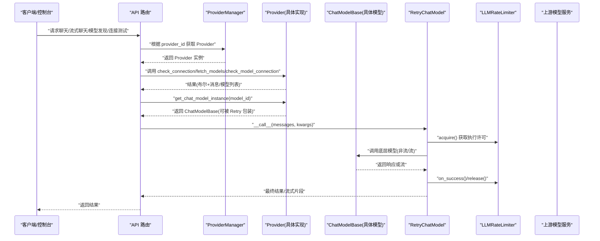
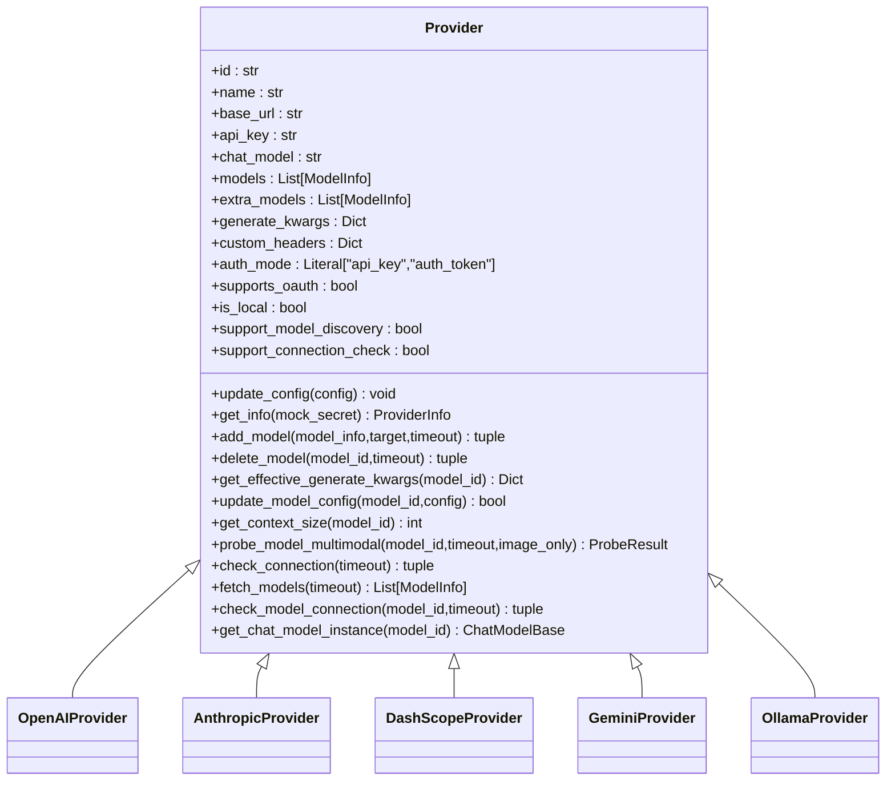
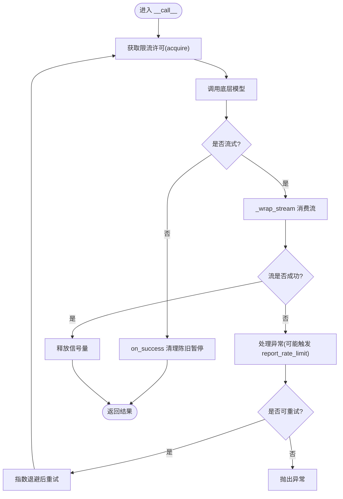
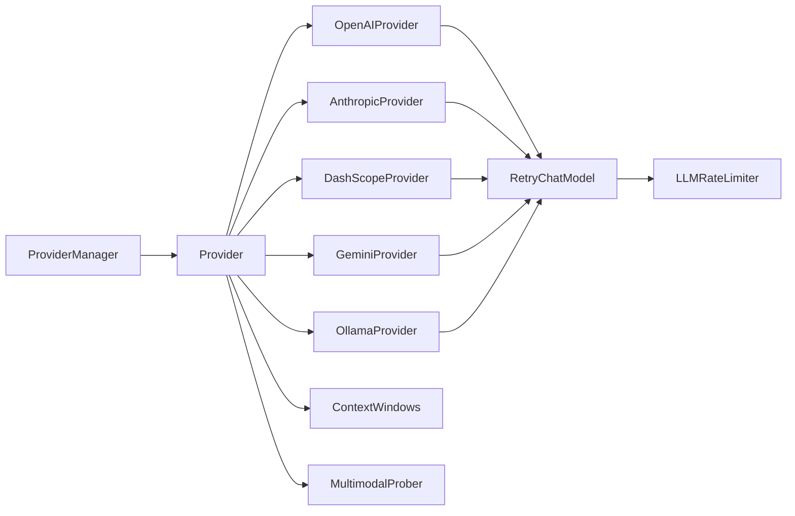

# 提供商插件

<cite>
**本文引用的文件**   
- [provider.py](file://src/qwenpaw/providers/provider.py)
- [provider_manager.py](file://src/qwenpaw/providers/provider_manager.py)
- [openai_provider.py](file://src/qwenpaw/providers/openai_provider.py)
- [anthropic_provider.py](file://src/qwenpaw/providers/anthropic_provider.py)
- [dashscope_provider.py](file://src/qwenpaw/providers/dashscope_provider.py)
- [gemini_provider.py](file://src/qwenpaw/providers/gemini_provider.py)
- [ollama_provider.py](file://src/qwenpaw/providers/ollama_provider.py)
- [rate_limiter.py](file://src/qwenpaw/providers/rate_limiter.py)
- [retry_chat_model.py](file://src/qwenpaw/providers/retry_chat_model.py)
- [context_windows.py](file://src/qwenpaw/providers/context_windows.py)
- [multimodal_prober.py](file://src/qwenpaw/providers/multimodal_prober.py)
- [providers.py](file://src/qwenpaw/app/routers/providers.py)
</cite>

## 目录
1. [简介](#简介)
2. [项目结构](#项目结构)
3. [核心组件](#核心组件)
4. [架构总览](#架构总览)
5. [详细组件分析](#详细组件分析)
6. [依赖关系分析](#依赖关系分析)
7. [性能与优化](#性能与优化)
8. [故障排查指南](#故障排查指南)
9. [结论](#结论)
10. [附录：实现自定义提供商插件示例](#附录实现自定义提供商插件示例)

## 简介
本文件面向 QwenPaw 的“提供商插件”体系，系统性说明提供商抽象、模型调用接口、流式响应处理、生命周期方法（如连接检查、模型发现、模型连通性检测等）、配置管理、认证机制、限流控制、重试策略、能力探测、上下文窗口管理与多模态支持，并给出性能优化、缓存策略、错误处理与监控指标建议。文档同时提供基于现有实现的参考路径，帮助开发者快速构建自定义 AI 模型提供商插件。

## 项目结构
QwenPaw 的提供商子系统位于 providers 包内，采用“抽象基类 + 具体提供商实现 + 管理器 + 横切能力（重试/限流/上下文窗口/多模态探测）”的分层组织方式。

图表来源
- [provider.py:274-659](file://src/qwenpaw/providers/provider.py#L274-L659)
- [provider_manager.py:1334-1466](file://src/qwenpaw/providers/provider_manager.py#L1334-L1466)
- [openai_provider.py:67-247](file://src/qwenpaw/providers/openai_provider.py#L67-L247)
- [anthropic_provider.py:72-302](file://src/qwenpaw/providers/anthropic_provider.py#L72-L302)
- [dashscope_provider.py:34-223](file://src/qwenpaw/providers/dashscope_provider.py#L34-L223)
- [gemini_provider.py:161-334](file://src/qwenpaw/providers/gemini_provider.py#L161-L334)
- [ollama_provider.py:14-105](file://src/qwenpaw/providers/ollama_provider.py#L14-L105)
- [rate_limiter.py:39-356](file://src/qwenpaw/providers/rate_limiter.py#L39-L356)
- [retry_chat_model.py:318-671](file://src/qwenpaw/providers/retry_chat_model.py#L318-L671)
- [context_windows.py:117-140](file://src/qwenpaw/providers/context_windows.py#L117-L140)
- [multimodal_prober.py:75-162](file://src/qwenpaw/providers/multimodal_prober.py#L75-L162)
- [providers.py:88-334](file://src/qwenpaw/app/routers/providers.py#L88-L334)

章节来源
- [provider.py:274-659](file://src/qwenpaw/providers/provider.py#L274-L659)
- [provider_manager.py:1334-1466](file://src/qwenpaw/providers/provider_manager.py#L1334-L1466)

## 核心组件
- Provider 抽象基类：定义提供商元数据、模型列表、生成参数合并、上下文窗口解析、多模态探测、实例化 ChatModel 等统一接口。
- ModelInfo/ProviderInfo：描述模型与提供商的配置与元信息。
- 具体提供商：OpenAI、Anthropic、DashScope、Gemini、Ollama 等，均继承 Provider 并实现各自协议细节。
- ProviderManager：集中注册、加载、持久化内置/自定义/插件提供商，并提供统一的查询与管理接口。
- 横切能力：
  - RetryChatModel：对任意 ChatModelBase 进行透明重试包装，结合 LLMRateLimiter 做并发与速率限制。
  - LLMRateLimiter：按 provider_id:model_name 维度维护滑动窗口 QPM、全局暂停与并发信号量。
  - Context Windows：静态目录 + 用户覆盖 + 默认值，统一解析输入上下文窗口大小。
  - Multimodal Prober：图像/视频能力探测工具与判定逻辑。

章节来源
- [provider.py:20-162](file://src/qwenpaw/providers/provider.py#L20-L162)
- [provider.py:274-659](file://src/qwenpaw/providers/provider.py#L274-L659)
- [provider_manager.py:1334-1466](file://src/qwenpaw/providers/provider_manager.py#L1334-L1466)
- [retry_chat_model.py:318-671](file://src/qwenpaw/providers/retry_chat_model.py#L318-L671)
- [rate_limiter.py:39-356](file://src/qwenpaw/providers/rate_limiter.py#L39-L356)
- [context_windows.py:117-140](file://src/qwenpaw/providers/context_windows.py#L117-L140)
- [multimodal_prober.py:75-162](file://src/qwenpaw/providers/multimodal_prober.py#L75-L162)

## 架构总览
下图展示了从上层 API 到具体提供商与横切能力的调用链路，以及重试与限流的协作方式。

图表来源
- [providers.py:88-334](file://src/qwenpaw/app/routers/providers.py#L88-L334)
- [provider_manager.py:1446-1466](file://src/qwenpaw/providers/provider_manager.py#L1446-L1466)
- [provider.py:274-659](file://src/qwenpaw/providers/provider.py#L274-L659)
- [retry_chat_model.py:318-671](file://src/qwenpaw/providers/retry_chat_model.py#L318-L671)
- [rate_limiter.py:39-356](file://src/qwenpaw/providers/rate_limiter.py#L39-L356)

## 详细组件分析

### Provider 抽象与生命周期
- 关键职责
  - 配置更新与序列化：update_config/get_info
  - 模型管理：add_model/delete_model/has_model/get_model_info/update_model_config
  - 生成参数合并：get_effective_generate_kwargs（含 deep merge 与 max_tokens 注入）
  - 上下文窗口：get_context_size/_context_catalog_enabled
  - 多模态探测：probe_model_multimodal（默认返回不支持，子类可覆盖）
  - 实例化 ChatModel：get_chat_model_instance（必须实现）
  - 连接与模型可用性：check_connection/fetch_models/check_model_connection（必须实现）
- 思考模式与推理透传
  - thinking_enabled/thinking_budget/reasoning_effort 等字段由 Provider 聚合到 effective generate_kwargs，并由各提供商在 get_chat_model_instance 中映射为具体 SDK 参数。
  - relay_reasoning 控制是否将 reasoning_content 回传给后续轮次。

图表来源
- [provider.py:274-659](file://src/qwenpaw/providers/provider.py#L274-L659)
- [openai_provider.py:67-247](file://src/qwenpaw/providers/openai_provider.py#L67-L247)
- [anthropic_provider.py:72-302](file://src/qwenpaw/providers/anthropic_provider.py#L72-L302)
- [dashscope_provider.py:34-223](file://src/qwenpaw/providers/dashscope_provider.py#L34-L223)
- [gemini_provider.py:161-334](file://src/qwenpaw/providers/gemini_provider.py#L161-L334)
- [ollama_provider.py:14-105](file://src/qwenpaw/providers/ollama_provider.py#L14-L105)

章节来源
- [provider.py:274-659](file://src/qwenpaw/providers/provider.py#L274-L659)

### OpenAI 兼容提供商
- 特性
  - 通过 AsyncOpenAI 访问 OpenAI 及兼容端点；支持 GitHub Models、Kilo、OpenCode 等变体。
  - 自动选择 max_tokens 或 max_completion_tokens（针对 gpt-5/o* 系列）。
  - 注入平台特定头部（如 DashScope 兼容模式）。
  - 多模态探测：图像语义校验 + 视频 URL/base64 回退策略。
- 关键流程
  - check_connection：尝试 models.list 或 chat.completions.create（GitHub Models 无 /models 时降级）。
  - fetch_models：标准化返回并去重。
  - check_model_connection：发送最小 ping 并消费流以确认可用。
  - get_chat_model_instance：构造 OpenAIChatModelCompat，携带 context_size、formatter、extra_generate_kwargs。

章节来源
- [openai_provider.py:67-247](file://src/qwenpaw/providers/openai_provider.py#L67-L247)
- [openai_provider.py:118-190](file://src/qwenpaw/providers/openai_provider.py#L118-L190)
- [openai_provider.py:249-586](file://src/qwenpaw/providers/openai_provider.py#L249-L586)

### Anthropic 提供商
- 特性
  - 支持 api_key 与 auth_token 两种认证模式；当使用 auth_token 时，通过自定义传输剥离 x-api-key 以避免冲突。
  - 连接检查优先 models.list，若代理未实现则回退 messages.create。
  - 多模态：仅图像探测（Anthropic 不支持视频），采用 base64 image source。
- 关键流程
  - _client：根据 auth_mode 选择构造参数与 http_client。
  - get_chat_model_instance：构造 AnthropicChatModelCompat，处理 thinking 参数映射与系统消息位置。

章节来源
- [anthropic_provider.py:72-302](file://src/qwenpaw/providers/anthropic_provider.py#L72-L302)
- [anthropic_provider.py:149-200](file://src/qwenpaw/providers/anthropic_provider.py#L149-L200)
- [anthropic_provider.py:304-406](file://src/qwenpaw/providers/anthropic_provider.py#L304-L406)

### DashScope 原生提供商
- 特性
  - 复用 OpenAIProvider 的连接/发现/探测能力，但 get_chat_model_instance 使用原生 DashScopeChatModel。
  - 思考模式：支持 effort/budget 两种风格，按模型级别覆盖 provider 默认。
  - 默认 relay_reasoning=False（可通过 ModelInfo 覆盖）。
- 关键流程
  - _apply_thinking_config：将 thinking_enable/thinking_budget/reasoning_effort 映射到 extra_body 或直接参数。
  - get_chat_model_instance：兼容旧 extra_body 键名，向上游传递剩余参数。

章节来源
- [dashscope_provider.py:34-223](file://src/qwenpaw/providers/dashscope_provider.py#L34-L223)
- [dashscope_provider.py:74-127](file://src/qwenpaw/providers/dashscope_provider.py#L74-L127)

### Gemini 提供商
- 特性
  - 使用 google-genai SDK；适配 max_output_tokens 命名差异。
  - 工具 JSON Schema 兼容：扁平化 $ref/$defs、移除 additionalProperties、重写 const 为 enum 等。
  - 多模态：图像 inline_data 与视频 file_data 探测。
- 关键流程
  - get_chat_model_instance：构造 GeminiChatModelCompat，注入 default_headers 与 extra_config_kwargs。
  - probe_model_multimodal：分别探测图像与视频。

章节来源
- [gemini_provider.py:161-334](file://src/qwenpaw/providers/gemini_provider.py#L161-L334)
- [gemini_provider.py:336-510](file://src/qwenpaw/providers/gemini_provider.py#L336-L510)

### Ollama 本地提供商
- 特性
  - 基于 OpenAI 兼容端点，自动拼接 /v1；支持环境变量 OLLAMA_HOST。
  - 禁用静态上下文窗口目录（_context_catalog_enabled=False），避免误用云端窗口导致截断。
- 关键流程
  - model_post_init/update_config：规范化 base_url。
  - check_model_connection：通过 fetch_models 判断模型是否存在。

章节来源
- [ollama_provider.py:14-105](file://src/qwenpaw/providers/ollama_provider.py#L14-L105)

### 重试与限流
- RetryChatModel
  - 对任意 ChatModelBase 透明包装，支持非流与流式重试。
  - 识别可重试异常（包括 SDK 类型与 HTTP 状态码），指数退避。
  - 特殊处理：缺失 reasoning_content 的 400 错误会注入空占位并重试一次。
- LLMRateLimiter
  - 按 provider_id:model_name 维度隔离限流。
  - 三阶段：429 冷却期 → QPM 滑动窗口 → 并发信号量。
  - 成功回调 on_success 清理陈旧暂停，避免后台任务影响前台交互。

图表来源
- [retry_chat_model.py:318-671](file://src/qwenpaw/providers/retry_chat_model.py#L318-L671)
- [rate_limiter.py:39-356](file://src/qwenpaw/providers/rate_limiter.py#L39-L356)

章节来源
- [retry_chat_model.py:318-671](file://src/qwenpaw/providers/retry_chat_model.py#L318-L671)
- [rate_limiter.py:39-356](file://src/qwenpaw/providers/rate_limiter.py#L39-L356)

### 上下文窗口管理
- resolve_context_window 优先级：
  1) 用户显式配置的 max_input_length（不等于默认值即视为显式设置）
  2) 静态目录匹配（本地提供商可禁用）
  3) 默认 128k
- 各 Provider.get_context_size 统一走该入口，确保 UI 显示与压缩触发一致。

章节来源
- [context_windows.py:117-140](file://src/qwenpaw/providers/context_windows.py#L117-L140)
- [provider.py:548-571](file://src/qwenpaw/providers/provider.py#L548-L571)

### 多模态能力探测
- 共享常量与判定：ProbeResult、图像颜色探针、媒体关键词错误识别。
- 各提供商实现差异化探测：
  - OpenAI：image_url + 语义校验；video_url/base64 回退。
  - Anthropic：仅图像（base64 image source）。
  - Gemini：inline_data 图像与 file_data 视频。
  - Ollama/DashScope：复用 OpenAI 或原生能力。

章节来源
- [multimodal_prober.py:75-162](file://src/qwenpaw/providers/multimodal_prober.py#L75-L162)
- [openai_provider.py:249-586](file://src/qwenpaw/providers/openai_provider.py#L249-L586)
- [anthropic_provider.py:304-406](file://src/qwenpaw/providers/anthropic_provider.py#L304-L406)
- [gemini_provider.py:336-510](file://src/qwenpaw/providers/gemini_provider.py#L336-L510)

### 提供商配置管理与认证
- Provider.update_config：支持 name/base_url/api_key/chat_model/api_key_prefix/auth_mode/custom_headers/generate_kwargs/extra_models 等字段更新。
- 认证模式：
  - api_key：通用 x-api-key 或 SDK 默认方式。
  - auth_token：Anthropic 专用，通过 Authorization: Bearer 发送，并剥离 x-api-key 避免冲突。
- ProviderManager：
  - 内置/自定义/插件提供商的统一注册与实例化。
  - 保存/迁移配置（含敏感字段加解密）。
  - 提供 add_model_to_provider 等便捷方法。

章节来源
- [provider.py:328-385](file://src/qwenpaw/providers/provider.py#L328-L385)
- [anthropic_provider.py:92-118](file://src/qwenpaw/providers/anthropic_provider.py#L92-L118)
- [provider_manager.py:1334-1466](file://src/qwenpaw/providers/provider_manager.py#L1334-L1466)
- [provider_manager.py:1677-1709](file://src/qwenpaw/providers/provider_manager.py#L1677-L1709)

### API 路由与外部集成
- 路由提供：
  - 测试提供商连接/模型连通性（TestProviderRequest/TestModelRequest）
  - 模型发现（DiscoverModelsRequest/Response）
  - 创建自定义提供商/添加模型（CreateCustomProviderRequest/AddModelRequest）
- 这些路由直接调用 ProviderManager 与 Provider 的对应方法。

章节来源
- [providers.py:88-334](file://src/qwenpaw/app/routers/providers.py#L88-L334)

## 依赖关系分析
- Provider 是所有具体实现的根，ProviderManager 负责装配与调度。
- RetryChatModel 作为装饰器包裹底层 ChatModelBase，内部依赖 LLMRateLimiter。
- 各 Provider 在 get_chat_model_instance 中注入 context_size、formatter、extra_generate_kwargs 等。
- 多模态探测与上下文窗口解析为跨提供商的公共能力。

图表来源
- [provider.py:274-659](file://src/qwenpaw/providers/provider.py#L274-L659)
- [provider_manager.py:1334-1466](file://src/qwenpaw/providers/provider_manager.py#L1334-L1466)
- [retry_chat_model.py:318-671](file://src/qwenpaw/providers/retry_chat_model.py#L318-L671)
- [rate_limiter.py:39-356](file://src/qwenpaw/providers/rate_limiter.py#L39-L356)
- [context_windows.py:117-140](file://src/qwenpaw/providers/context_windows.py#L117-L140)
- [multimodal_prober.py:75-162](file://src/qwenpaw/providers/multimodal_prober.py#L75-L162)

## 性能与优化
- 并发与限流
  - 使用 LLMRateLimiter 控制并发与 QPM，避免雪崩与雷击羊群效应。
  - 流式场景在首个分片到达后立即释放信号量，减少占用时间。
- 重试策略
  - 指数退避 + 最大重试次数；对 429 读取 Retry-After 并设置全局暂停。
  - 对缺失 reasoning_content 的错误自动注入并只重试一次，避免无限循环。
- 上下文窗口
  - 保守的静态目录 + 用户覆盖，避免过大窗口导致截断失败。
- 缓存策略
  - 能力探测结果可在上层缓存（例如多模态探测结果），避免重复探测。
  - 模型清单发现结果可按 provider 维度缓存，降低网络开销。
- 监控指标
  - 使用 LLMRateLimiter.stats 输出当前并发、QPM、暂停状态、累计统计等。
  - 记录重试次数、延迟分布、错误码分布，便于定位瓶颈。

章节来源
- [retry_chat_model.py:318-671](file://src/qwenpaw/providers/retry_chat_model.py#L318-L671)
- [rate_limiter.py:242-263](file://src/qwenpaw/providers/rate_limiter.py#L242-L263)
- [context_windows.py:117-140](file://src/qwenpaw/providers/context_windows.py#L117-L140)

## 故障排查指南
- 连接问题
  - 使用 TestProviderRequest/TestModelRequest 验证基础连通性与模型可用性。
  - 关注不同提供商的连接回退策略（如 Anthropic 的 messages 回退）。
- 限流与超时
  - 观察 LLMRateLimiter.stats 中的 is_paused/pause_remaining_s/total_rate_limited。
  - 调整 acquire_timeout 与 pause_seconds/jitter_range 以平衡吞吐与稳定性。
- 多模态误判
  - 某些模型接受媒体但不实际处理（如部分文本模型），需依赖语义校验结果。
- 思考模式与推理内容
  - 注意 relay_reasoning 与 thinking 参数映射，必要时在 ModelInfo 上覆盖。

章节来源
- [providers.py:279-334](file://src/qwenpaw/app/routers/providers.py#L279-L334)
- [rate_limiter.py:242-263](file://src/qwenpaw/providers/rate_limiter.py#L242-L263)
- [openai_provider.py:249-586](file://src/qwenpaw/providers/openai_provider.py#L249-L586)

## 结论
QwenPaw 的提供商插件体系以 Provider 抽象为核心，结合 ProviderManager 统一管理，并通过 RetryChatModel 与 LLMRateLimiter 提供健壮的重试与限流保障。上下文窗口与多模态探测能力贯穿各提供商，确保一致的用户体验。通过合理的配置、缓存与监控，可实现高可用、高性能的多提供商接入。

## 附录：实现自定义提供商插件示例
以下示例展示如何基于现有实现快速构建自定义提供商插件（包含 OpenAI 兼容、Anthropic 兼容、本地模型等类型）。为避免泄露源码，本节仅提供实现要点与参考路径。

- 步骤概览
  1) 新建一个 Python 模块，导入目标 Provider 基类或具体实现。
     - 参考：[openai_provider.py:67-247](file://src/qwenpaw/providers/openai_provider.py#L67-L247)、[anthropic_provider.py:72-302](file://src/qwenpaw/providers/anthropic_provider.py#L72-L302)
  2) 定义 Provider 实例，填写 id/name/base_url/api_key_prefix/models 等元信息。
     - 参考：[provider_manager.py:886-1206](file://src/qwenpaw/providers/provider_manager.py#L886-L1206)
  3) 如需自定义行为，继承 Provider 或具体 Provider，覆写：
     - get_chat_model_instance：构造并返回 ChatModelBase 实例（注入 context_size、formatter、extra_generate_kwargs）。
       - 参考：[openai_provider.py:192-247](file://src/qwenpaw/providers/openai_provider.py#L192-L247)、[anthropic_provider.py:249-302](file://src/qwenpaw/providers/anthropic_provider.py#L249-L302)、[dashscope_provider.py:128-223](file://src/qwenpaw/providers/dashscope_provider.py#L128-L223)、[gemini_provider.py:302-334](file://src/qwenpaw/providers/gemini_provider.py#L302-L334)
     - probe_model_multimodal：实现图像/视频探测（可选）。
       - 参考：[openai_provider.py:249-586](file://src/qwenpaw/providers/openai_provider.py#L249-L586)、[anthropic_provider.py:304-406](file://src/qwenpaw/providers/anthropic_provider.py#L304-L406)、[gemini_provider.py:336-510](file://src/qwenpaw/providers/gemini_provider.py#L336-L510)
     - update_config/get_info：按需扩展配置项。
       - 参考：[provider.py:328-385](file://src/qwenpaw/providers/provider.py#L328-L385)、[provider.py:601-659](file://src/qwenpaw/providers/provider.py#L601-L659)
  4) 通过 ProviderManager 注册（或在插件中调用 register_provider）。
     - 参考：[provider_manager.py:1446-1466](file://src/qwenpaw/providers/provider_manager.py#L1446-L1466)
  5) 使用 API 路由进行测试与发现：
     - 参考：[providers.py:88-334](file://src/qwenpaw/app/routers/providers.py#L88-L334)

- 不同类型示例要点
  - OpenAI 兼容型：直接使用 OpenAIProvider，设置 base_url 与 models；必要时覆写 check_connection（如 GitHub Models）。
    - 参考：[openai_provider.py:655-707](file://src/qwenpaw/providers/openai_provider.py#L655-L707)
  - Anthropic 兼容型：使用 AnthropicProvider，配置 auth_mode 与 headers；注意图片探测格式。
    - 参考：[anthropic_provider.py:72-118](file://src/qwenpaw/providers/anthropic_provider.py#L72-L118)
  - 本地模型（Ollama）：使用 OllamaProvider，自动拼接 /v1，禁用静态上下文目录。
    - 参考：[ollama_provider.py:14-105](file://src/qwenpaw/providers/ollama_provider.py#L14-L105)

- 能力检测与上下文窗口
  - 多模态探测：参考各 Provider 的 probe_model_multimodal 实现。
    - 参考：[multimodal_prober.py:75-162](file://src/qwenpaw/providers/multimodal_prober.py#L75-L162)
  - 上下文窗口：通过 ModelInfo.max_input_length 或 Provider._context_catalog_enabled 控制。
    - 参考：[context_windows.py:117-140](file://src/qwenpaw/providers/context_windows.py#L117-L140)

- 限流与重试
  - 所有 ChatModelBase 均可被 RetryChatModel 包装，自动获得重试与限流能力。
    - 参考：[retry_chat_model.py:318-671](file://src/qwenpaw/providers/retry_chat_model.py#L318-L671)
    - 参考：[rate_limiter.py:39-356](file://src/qwenpaw/providers/rate_limiter.py#L39-L356)