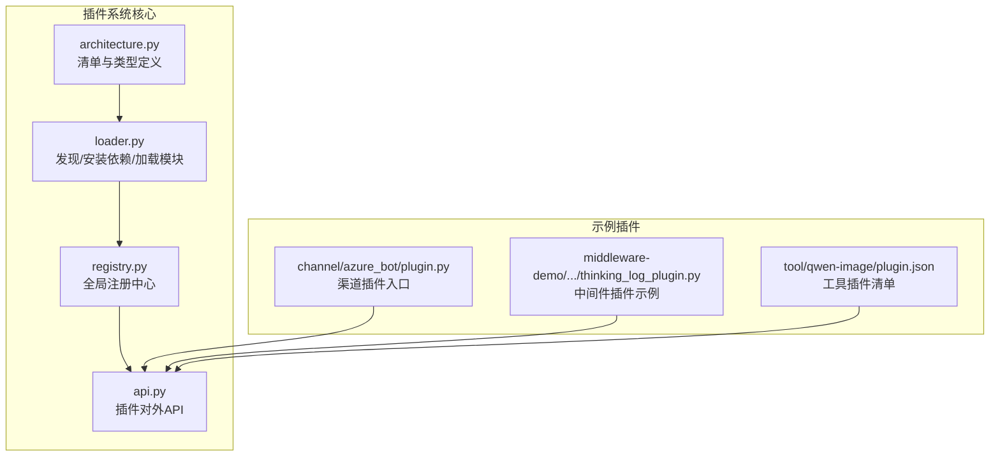
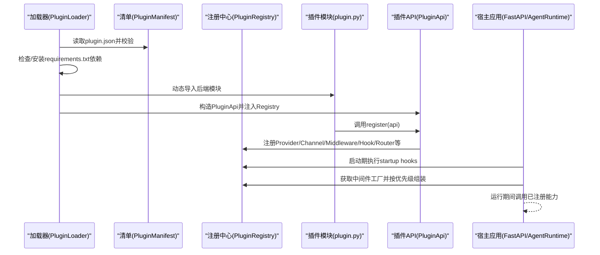
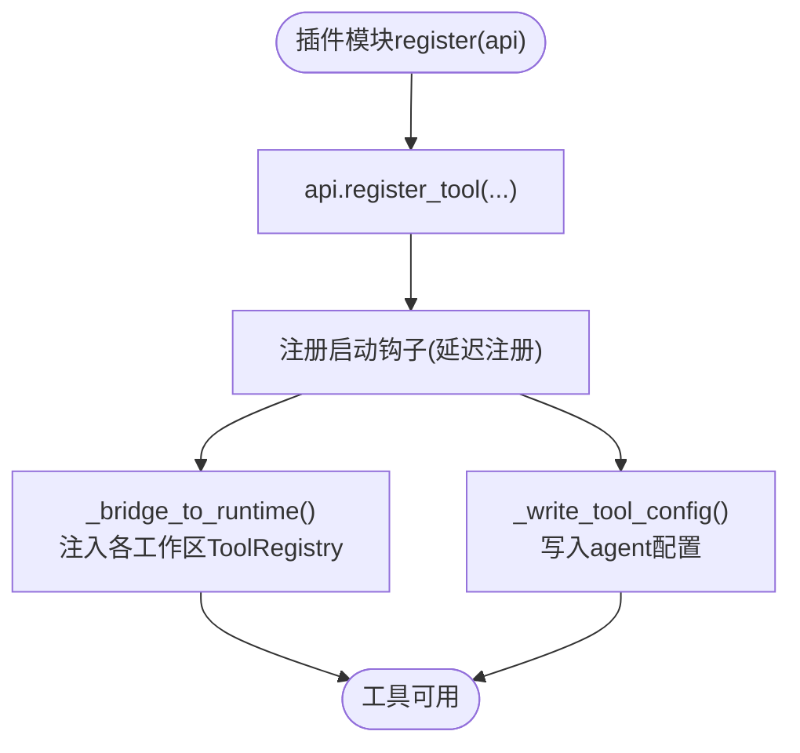
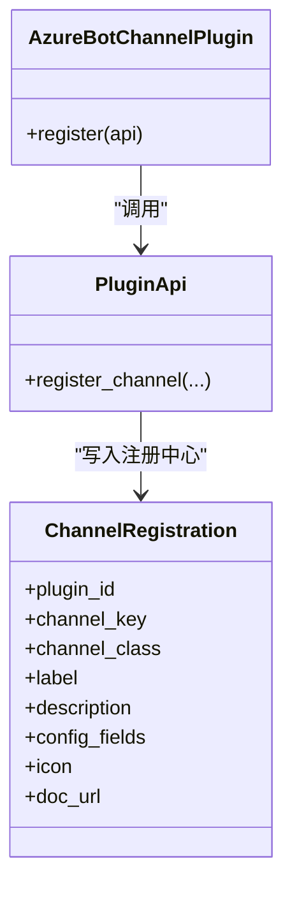
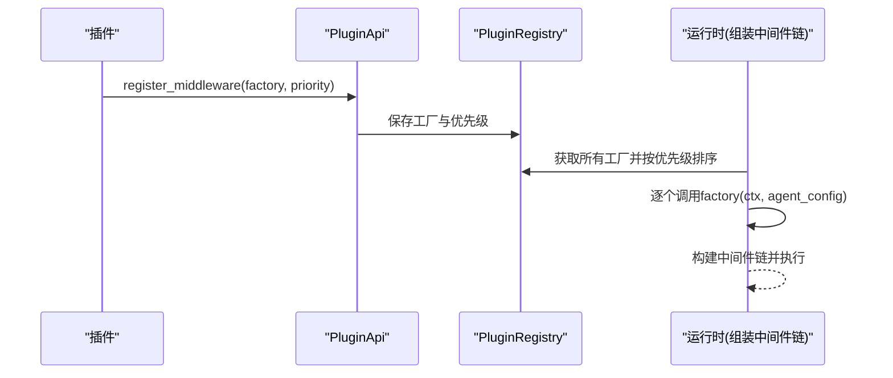
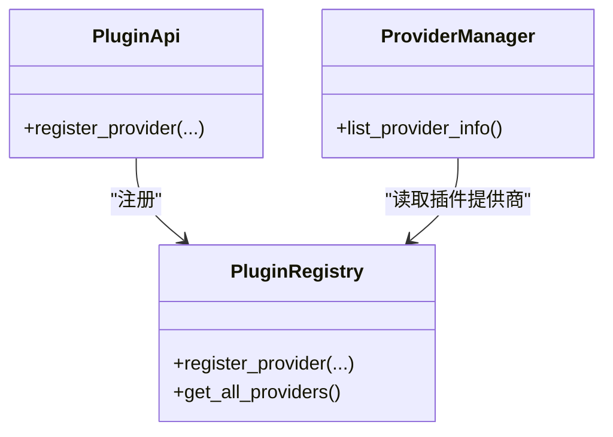
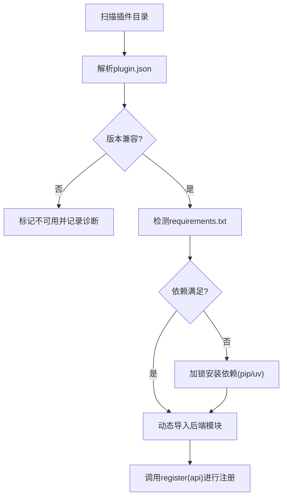

# 插件类型与API

<cite>
**本文引用的文件**   
- [src/qwenpaw/plugins/__init__.py](file://src/qwenpaw/plugins/__init__.py)
- [src/qwenpaw/plugins/api.py](file://src/qwenpaw/plugins/api.py)
- [src/qwenpaw/plugins/architecture.py](file://src/qwenpaw/plugins/architecture.py)
- [src/qwenpaw/plugins/registry.py](file://src/qwenpaw/plugins/registry.py)
- [src/qwenpaw/plugins/loader.py](file://src/qwenpaw/plugins/loader.py)
- [plugins/channel/azure_bot/plugin.py](file://plugins/channel/azure_bot/plugin.py)
- [plugins/middleware-demo/thinking-log-middleware/thinking_log_plugin.py](file://plugins/middleware-demo/thinking-log-middleware/thinking_log_plugin.py)
- [plugins/tool/qwen-image/plugin.json](file://plugins/tool/qwen-image/plugin.json)
- [src/qwenpaw/config/config.py](file://src/qwenpaw/config/config.py)
- [src/qwenpaw/providers/provider_manager.py](file://src/qwenpaw/providers/provider_manager.py)
</cite>

## 目录
1. [简介](#简介)
2. [项目结构](#项目结构)
3. [核心组件](#核心组件)
4. [架构总览](#架构总览)
5. [详细组件分析](#详细组件分析)
6. [依赖关系分析](#依赖关系分析)
7. [性能考虑](#性能考虑)
8. [故障排查指南](#故障排查指南)
9. [结论](#结论)
10. [附录：API参考](#附录api参考)

## 简介
本文件面向 QwenPaw 插件开发者，系统化说明支持的插件类型、注册机制、生命周期与事件回调、配置管理、插件间通信与安全边界，并提供完整的 API 参考。QwenPaw 的插件体系通过统一的清单（manifest）、加载器、注册表与运行时钩子，将工具、渠道、中间件、提供商等扩展能力以可插拔方式接入系统。

## 项目结构
围绕插件系统的核心代码位于 src/qwenpaw/plugins 目录，配合示例插件（channel、middleware、tool）展示不同插件类型的实现模式。

图表来源
- [src/qwenpaw/plugins/architecture.py:1-221](file://src/qwenpaw/plugins/architecture.py#L1-L221)
- [src/qwenpaw/plugins/loader.py:120-640](file://src/qwenpaw/plugins/loader.py#L120-L640)
- [src/qwenpaw/plugins/registry.py:129-800](file://src/qwenpaw/plugins/registry.py#L129-L800)
- [src/qwenpaw/plugins/api.py:172-800](file://src/qwenpaw/plugins/api.py#L172-L800)
- [plugins/channel/azure_bot/plugin.py:1-314](file://plugins/channel/azure_bot/plugin.py#L1-L314)
- [plugins/middleware-demo/thinking-log-middleware/thinking_log_plugin.py:1-67](file://plugins/middleware-demo/thinking-log-middleware/thinking_log_plugin.py#L1-L67)
- [plugins/tool/qwen-image/plugin.json:1-136](file://plugins/tool/qwen-image/plugin.json#L1-L136)

章节来源
- [src/qwenpaw/plugins/__init__.py:1-17](file://src/qwenpaw/plugins/__init__.py#L1-L17)

## 核心组件
- 清单与类型（PluginManifest、PluginType、PluginRecord）：描述插件元数据、版本约束、入口点、类型推断与加载记录。
- 加载器（PluginLoader）：扫描插件目录、解析清单、校验兼容性与依赖、动态导入后端模块并调用 register(api)。
- 注册中心（PluginRegistry）：集中管理 Provider、Hook、HTTP路由、中间件、渠道、控制命令、提示词片段等注册项。
- 插件API（PluginApi）：插件开发者的统一接口，用于注册工具、渠道、中间件、启动/关闭/卸载钩子、HTTP路由、斜杠命令、模式等。

章节来源
- [src/qwenpaw/plugins/architecture.py:12-221](file://src/qwenpaw/plugins/architecture.py#L12-L221)
- [src/qwenpaw/plugins/loader.py:120-640](file://src/qwenpaw/plugins/loader.py#L120-L640)
- [src/qwenpaw/plugins/registry.py:129-800](file://src/qwenpaw/plugins/registry.py#L129-L800)
- [src/qwenpaw/plugins/api.py:172-800](file://src/qwenpaw/plugins/api.py#L172-L800)

## 架构总览
下图展示了从“插件清单”到“运行时能力”的关键路径：加载器解析清单并执行依赖安装，随后动态导入后端模块，构造 PluginApi 并调用其 register；插件通过 API 向注册中心登记能力；系统在启动时按优先级执行钩子，并在请求组装阶段实例化中间件链。

图表来源
- [src/qwenpaw/plugins/loader.py:514-640](file://src/qwenpaw/plugins/loader.py#L514-L640)
- [src/qwenpaw/plugins/api.py:172-800](file://src/qwenpaw/plugins/api.py#L172-L800)
- [src/qwenpaw/plugins/registry.py:129-800](file://src/qwenpaw/plugins/registry.py#L129-L800)

## 详细组件分析

### 插件类型与清单模型
- 支持类型（PluginType）：tool、provider、hook、command、channel、frontend、general。
- 清单字段（PluginManifest）：id、version、name/description/i18n、entry.backend/frontend、dependencies、qwenpaw_version（或兼容的min/max）、meta、type。
- 类型推断：当未显式声明 type 时，根据 meta 与 entry 推断最佳匹配类型，保证旧插件仍可加载。

章节来源
- [src/qwenpaw/plugins/architecture.py:12-98](file://src/qwenpaw/plugins/architecture.py#L12-L98)
- [src/qwenpaw/plugins/architecture.py:114-210](file://src/qwenpaw/plugins/architecture.py#L114-L210)

### 工具插件（Tool）
- 注册方式：在插件模块中通过 api.register_tool(tool_name, tool_func, description, icon, enabled) 注册。
- 自动行为：
  - 将函数挂入 qwenpaw.agents.tools 模块并加入 __all__。
  - 为当前 agent 写入内置工具配置（默认禁用，用户可启用）。
  - 桥接到运行时 ToolRegistry，使 Agent 可在推理过程中调用。
- 配置访问：提供 get_tool_config(tool_name) 便捷方法，在当前 agent 上下文中读取用户配置。
- 清单约定：meta.tools 数组声明工具元信息（名称、图标、是否需配置、配置字段等），便于 UI 渲染与权限提示。

图表来源
- [src/qwenpaw/plugins/api.py:614-698](file://src/qwenpaw/plugins/api.py#L614-L698)
- [src/qwenpaw/plugins/api.py:54-166](file://src/qwenpaw/plugins/api.py#L54-L166)
- [plugins/tool/qwen-image/plugin.json:19-134](file://plugins/tool/qwen-image/plugin.json#L19-L134)

章节来源
- [src/qwenpaw/plugins/api.py:11-46](file://src/qwenpaw/plugins/api.py#L11-L46)
- [src/qwenpaw/plugins/api.py:614-698](file://src/qwenpaw/plugins/api.py#L614-L698)
- [plugins/tool/qwen-image/plugin.json:1-136](file://plugins/tool/qwen-image/plugin.json#L1-L136)

### 渠道插件（Channel）
- 注册方式：api.register_channel(channel_class, label, description, config_fields, icon, doc_url)。
- 要求：channel_class 必须继承 BaseChannel 且具备 channel 类属性作为唯一键。
- 配置字段：config_fields 列表驱动前端设置表单，支持 text/password/number/switch/select 等类型及 i18n 文案。
- 示例：Azure Bot 渠道插件通过 plugin.py 暴露 register(api)，完成渠道注册与表单字段声明。

图表来源
- [plugins/channel/azure_bot/plugin.py:14-308](file://plugins/channel/azure_bot/plugin.py#L14-L308)
- [src/qwenpaw/plugins/api.py:483-570](file://src/qwenpaw/plugins/api.py#L483-L570)
- [src/qwenpaw/plugins/registry.py:96-107](file://src/qwenpaw/plugins/registry.py#L96-L107)

章节来源
- [plugins/channel/azure_bot/plugin.py:1-314](file://plugins/channel/azure_bot/plugin.py#L1-L314)
- [src/qwenpaw/plugins/api.py:483-570](file://src/qwenpaw/plugins/api.py#L483-L570)
- [src/qwenpaw/plugins/registry.py:749-800](file://src/qwenpaw/plugins/registry.py#L749-L800)

### 中间件插件（Middleware）
- 注册方式：api.register_middleware(factory, priority=100)。
- 工厂签名：factory(ctx, agent_config) -> MiddlewareBase | None。返回 None 表示该请求跳过此中间件。
- 执行顺序：priority 越小越外层（洋葱模型）。
- 示例：Thinking Log 中间件插件注册一个始终激活的中间件，捕获 on_reasoning 流事件并打印。

图表来源
- [src/qwenpaw/plugins/api.py:448-481](file://src/qwenpaw/plugins/api.py#L448-L481)
- [src/qwenpaw/plugins/registry.py:171-207](file://src/qwenpaw/plugins/registry.py#L171-L207)
- [plugins/middleware-demo/thinking-log-middleware/thinking_log_plugin.py:59-66](file://plugins/middleware-demo/thinking-log-middleware/thinking_log_plugin.py#L59-L66)

章节来源
- [plugins/middleware-demo/thinking-log-middleware/thinking_log_plugin.py:1-67](file://plugins/middleware-demo/thinking-log-middleware/thinking_log_plugin.py#L1-L67)
- [src/qwenpaw/plugins/api.py:448-481](file://src/qwenpaw/plugins/api.py#L448-L481)
- [src/qwenpaw/plugins/registry.py:171-207](file://src/qwenpaw/plugins/registry.py#L171-L207)

### 提供商插件（Provider）
- 注册方式：api.register_provider(provider_id, provider_class, label, base_url, **metadata)。
- 集成点：注册中心维护 ProviderRegistration；ProviderManager 在列举 ProviderInfo 时会合并插件提供的 ProviderInfo。
- 用途：扩展新的 LLM 提供商/模型端点，供 Agent 选择使用。

图表来源
- [src/qwenpaw/plugins/api.py:205-249](file://src/qwenpaw/plugins/api.py#L205-L249)
- [src/qwenpaw/plugins/registry.py:328-386](file://src/qwenpaw/plugins/registry.py#L328-L386)
- [src/qwenpaw/providers/provider_manager.py:1409-1444](file://src/qwenpaw/providers/provider_manager.py#L1409-L1444)

章节来源
- [src/qwenpaw/plugins/api.py:205-249](file://src/qwenpaw/plugins/api.py#L205-L249)
- [src/qwenpaw/plugins/registry.py:328-386](file://src/qwenpaw/plugins/registry.py#L328-L386)
- [src/qwenpaw/providers/provider_manager.py:1409-1444](file://src/qwenpaw/providers/provider_manager.py#L1409-L1444)

### 其他插件能力
- 启动/关闭/卸载钩子：register_startup_hook / register_shutdown_hook / register_uninstall_hook，支持优先级与异步回调。
- 工作区创建钩子：register_workspace_created_hook，在新工作区初始化后触发。
- HTTP 路由：register_http_router(router, prefix="/xxx", tags)，挂载至 /api 下，优先于控制台 SPA 捕获路由。
- 控制命令：register_control_command(handler, priority_level)。
- 斜杠命令：register_slash_command(name, handler, aliases, category, help_text, metadata)，在工作区级注册。
- 模式（Mode）：register_mode(mode_cls)，为每个工作区注册自定义 AgentMode。
- 提示词片段：register_prompt_section(name, after, agent_id, provider)，在宿主提示词锚点后插入内容。

章节来源
- [src/qwenpaw/plugins/api.py:251-356](file://src/qwenpaw/plugins/api.py#L251-L356)
- [src/qwenpaw/plugins/api.py:358-446](file://src/qwenpaw/plugins/api.py#L358-L446)
- [src/qwenpaw/plugins/api.py:394-423](file://src/qwenpaw/plugins/api.py#L394-L423)
- [src/qwenpaw/plugins/api.py:700-796](file://src/qwenpaw/plugins/api.py#L700-L796)
- [src/qwenpaw/plugins/registry.py:472-715](file://src/qwenpaw/plugins/registry.py#L472-L715)

## 依赖关系分析
- 加载流程：PluginLoader.discover_plugins → load_all_plugins → load_plugin → _load_backend_module → register(api)。
- 依赖安装：基于 requirements.txt，优先 pip，缺失则尝试 uv；冻结桌面环境使用独立 Python 运行时安装。
- 并发安全：同一插件的安装操作通过进程锁串行化，避免重复安装导致内存耗尽。
- 兼容性：qwenpaw_version 采用左闭右开区间；若未声明则回退到 min_version/max_version。

图表来源
- [src/qwenpaw/plugins/loader.py:132-172](file://src/qwenpaw/plugins/loader.py#L132-L172)
- [src/qwenpaw/plugins/loader.py:270-334](file://src/qwenpaw/plugins/loader.py#L270-L334)
- [src/qwenpaw/plugins/loader.py:376-458](file://src/qwenpaw/plugins/loader.py#L376-L458)
- [src/qwenpaw/plugins/loader.py:514-640](file://src/qwenpaw/plugins/loader.py#L514-L640)

章节来源
- [src/qwenpaw/plugins/loader.py:120-800](file://src/qwenpaw/plugins/loader.py#L120-L800)

## 性能考虑
- 中间件工厂按需实例化，返回 None 可跳过，减少开销。
- HTTP 路由注册会刷新 OpenAPI 缓存，避免频繁注册大路由块。
- 依赖安装走线程池，不阻塞事件循环；锁定安装避免重复下载。
- 工具注册延迟到启动钩子，确保上下文就绪后再注入工作区。

[本节为通用指导，无需源码引用]

## 故障排查指南
- 插件无法加载：
  - 检查 plugin.json 的 id/version/entry 必填字段与类型推断结果。
  - 查看加载日志中的依赖安装失败与超时信息。
  - 确认后端模块导出 plugin 对象并实现 register(api)。
- 工具未出现在 Agent 工具列表：
  - 确认 register_tool 已调用且启动钩子执行成功。
  - 检查当前 agent 的工具配置是否被写入。
- 渠道未显示：
  - 确认 channel_class 包含 channel 类属性且未被内置键冲突。
  - 检查 config_fields 是否正确传递到注册中心。
- HTTP 路由冲突：
  - 确保 prefix 不以 "/" 单独存在且不与其他插件重复。
  - 确认 FastAPI app 已通过 set_plugin_http_app 注入。

章节来源
- [src/qwenpaw/plugins/loader.py:460-513](file://src/qwenpaw/plugins/loader.py#L460-L513)
- [src/qwenpaw/plugins/registry.py:220-296](file://src/qwenpaw/plugins/registry.py#L220-L296)
- [src/qwenpaw/plugins/api.py:614-698](file://src/qwenpaw/plugins/api.py#L614-L698)

## 结论
QwenPaw 插件体系通过清晰的清单模型、健壮的加载与依赖管理、统一的注册中心与丰富的 API，实现了工具、渠道、中间件、提供商等多维扩展能力的热插拔接入。借助钩子与中间件机制，插件可在生命周期关键节点参与系统行为；通过配置与权限模型，插件能力可按工作区粒度精细控制。

[本节为总结性内容，无需源码引用]

## 附录：API参考

### 清单与类型（architecture）
- PluginType：tool、provider、hook、command、channel、frontend、general。
- PluginManifest：id、version、name/description/author、entry.backend/frontend、dependencies、qwenpaw_version（或兼容的min/max）、meta、plugin_type。
- PluginRecord：manifest、source_path、enabled、instance、diagnostics。

章节来源
- [src/qwenpaw/plugins/architecture.py:12-221](file://src/qwenpaw/plugins/architecture.py#L12-L221)

### 插件API（api.PluginApi）
- 注册工具
  - register_tool(tool_name, tool_func, description="", icon="🔧", enabled=False)
  - 作用：将工具函数注册到 agents.tools 模块、写入 agent 配置、桥接运行时 ToolRegistry。
- 注册提供商
  - register_provider(provider_id, provider_class, label="", base_url="", **metadata)
- 注册中间件
  - register_middleware(middleware_factory, priority=100)
- 注册渠道
  - register_channel(channel_class, label="", description="", config_fields=None, icon="", doc_url="")
- 注册HTTP路由
  - register_http_router(router, *, prefix, tags=None)
- 注册控制命令
  - register_control_command(handler, priority_level=10)
- 注册斜杠命令
  - register_slash_command(name, handler, aliases=(), category="plugin", help_text="", metadata=None)
- 注册模式
  - register_mode(mode_cls)
- 注册钩子
  - register_startup_hook(hook_name, callback, priority=100)
  - register_shutdown_hook(hook_name, callback, priority=100)
  - register_uninstall_hook(hook_name, callback, priority=100)
  - register_workspace_created_hook(hook_name, callback, priority=100)
- 工具配置辅助
  - get_tool_config(tool_name)
  - get_tool_config(tool_name, agent_id)
  - set_tool_config(tool_name, agent_id, config)

章节来源
- [src/qwenpaw/plugins/api.py:172-800](file://src/qwenpaw/plugins/api.py#L172-L800)
- [src/qwenpaw/plugins/api.py:11-46](file://src/qwenpaw/plugins/api.py#L11-L46)

### 注册中心（registry.PluginRegistry）
- 提供者
  - register_provider(plugin_id, provider_id, provider_class, label, base_url, metadata)
  - get_provider(provider_id)
  - get_all_providers()
- 钩子
  - register_startup_hook / register_shutdown_hook / register_uninstall_hook / register_workspace_created_hook
  - get_*_hooks()
  - remove_hooks_by_name(plugin_id, hook_names)
- HTTP路由
  - set_plugin_http_app(app)
  - register_http_router(plugin_id, router, *, prefix, tags=None)
  - get_http_router_registrations()
  - _unregister_plugin_http_routes(plugin_id)
- 中间件
  - register_middleware(plugin_id, factory, priority=100)
  - get_middleware_factories()
- 渠道
  - register_channel(plugin_id, channel_key, channel_class, label="", description="", config_fields=None, icon="", doc_url="")
- 控制命令
  - register_control_command(plugin_id, handler, priority_level=10)
  - get_control_commands()
- 提示词片段
  - register_prompt_section(plugin_id, name, after, agent_id, provider)
  - get_prompt_sections()
- 工作区管理器
  - set_workspace_manager(manager)
  - get_workspace_manager()
  - get_stop_handlers(agent_id=None)

章节来源
- [src/qwenpaw/plugins/registry.py:129-800](file://src/qwenpaw/plugins/registry.py#L129-L800)

### 加载器（loader.PluginLoader）
- discover_plugins()
- load_all_plugins(configs=None, types=None)
- load_plugin(manifest, source_path, config=None)
- _ensure_dependencies_installed(source_path, plugin_id)
- _install_requirements(requirements_file, plugin_id)
- _cleanup_failed_load(plugin_id, module_name, source_path)

章节来源
- [src/qwenpaw/plugins/loader.py:120-800](file://src/qwenpaw/plugins/loader.py#L120-L800)

### 示例插件要点
- 渠道插件（Azure Bot）
  - 入口：plugins/channel/azure_bot/plugin.py 的 register(api) 调用 api.register_channel(...)
  - 清单：plugins/channel/azure_bot/plugin.json 声明 type="channel" 与依赖
- 中间件插件（Thinking Log）
  - 入口：plugins/middleware-demo/.../thinking_log_plugin.py 的 register(api) 调用 api.register_middleware(...)
- 工具插件（Qwen Image）
  - 清单：plugins/tool/qwen-image/plugin.json 的 meta.tools 声明工具元信息与配置字段

章节来源
- [plugins/channel/azure_bot/plugin.py:14-308](file://plugins/channel/azure_bot/plugin.py#L14-L308)
- [plugins/channel/azure_bot/plugin.json:1-25](file://plugins/channel/azure_bot/plugin.json#L1-L25)
- [plugins/middleware-demo/thinking-log-middleware/thinking_log_plugin.py:59-66](file://plugins/middleware-demo/thinking-log-middleware/thinking_log_plugin.py#L59-L66)
- [plugins/tool/qwen-image/plugin.json:19-134](file://plugins/tool/qwen-image/plugin.json#L19-L134)

### 配置管理与工具可见性
- 工具配置写入：register_tool 会在当前 agent 配置中写入 BuiltinToolConfig（默认禁用）。
- 工具清单聚合：config.py 在构建内置工具集合时，会从注册中心读取插件清单 meta.tools 并合并。
- 提供商信息聚合：ProviderManager.list_provider_info 会将插件注册的 ProviderInfo 一并返回。

章节来源
- [src/qwenpaw/plugins/api.py:114-166](file://src/qwenpaw/plugins/api.py#L114-L166)
- [src/qwenpaw/config/config.py:1706-1883](file://src/qwenpaw/config/config.py#L1706-L1883)
- [src/qwenpaw/providers/provider_manager.py:1409-1444](file://src/qwenpaw/providers/provider_manager.py#L1409-L1444)