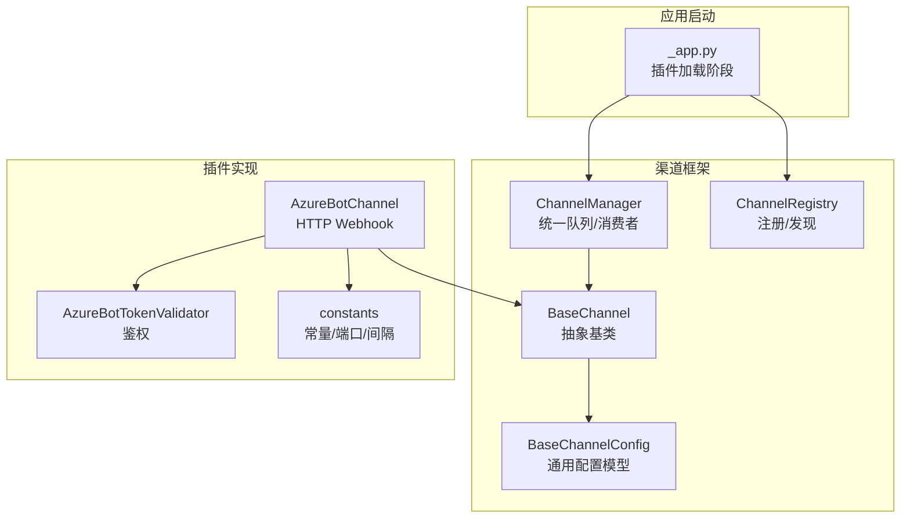
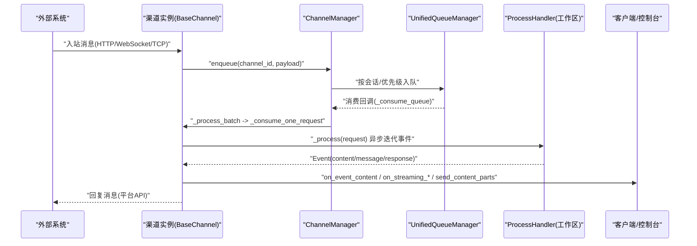
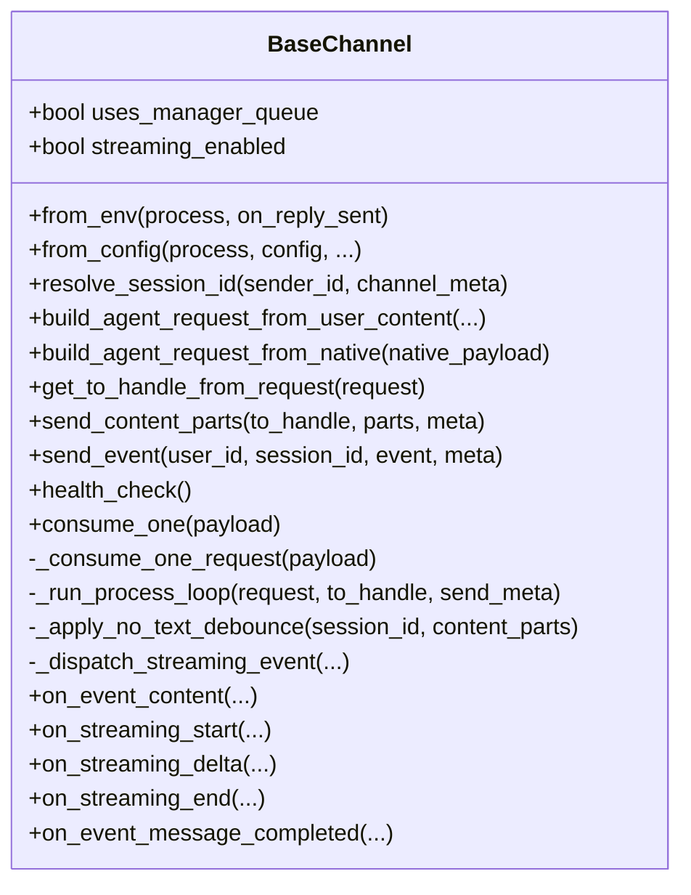
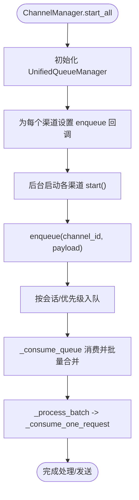
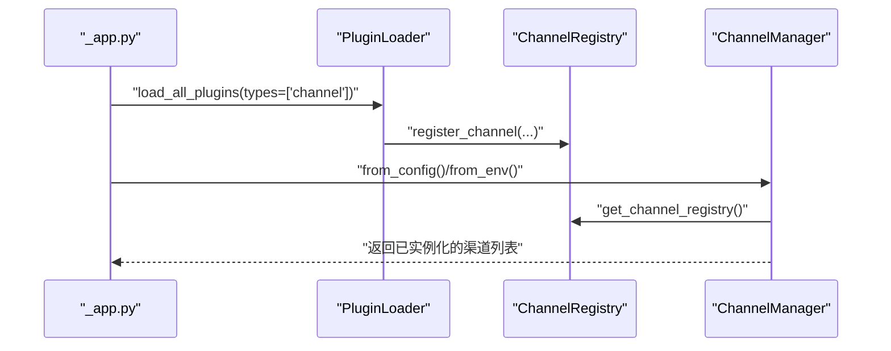
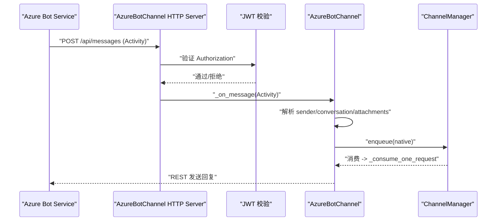
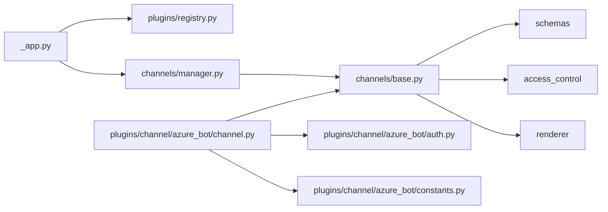

# 渠道插件

<cite>
**本文引用的文件**   
- [base.py](file://src/qwenpaw/app/channels/base.py)
- [manager.py](file://src/qwenpaw/app/channels/manager.py)
- [registry.py](file://src/qwenpaw/plugins/registry.py)
- [config.py](file://src/qwenpaw/config/config.py)
- [_app.py](file://src/qwenpaw/app/_app.py)
- [channel.py](file://plugins/channel/azure_bot/channel.py)
- [auth.py](file://plugins/channel/azure_bot/auth.py)
- [constants.py](file://plugins/channel/azure_bot/constants.py)
</cite>

## 目录
1. [简介](#简介)
2. [项目结构](#项目结构)
3. [核心组件](#核心组件)
4. [架构总览](#架构总览)
5. [详细组件分析](#详细组件分析)
6. [依赖关系分析](#依赖关系分析)
7. [性能与并发](#性能与并发)
8. [故障排查指南](#故障排查指南)
9. [结论](#结论)
10. [附录：自定义渠道插件实现示例](#附录自定义渠道插件实现示例)

## 简介
本章节面向 QwenPaw 渠道插件开发者，系统性阐述渠道插件的核心接口、生命周期、配置管理、消息格式转换、状态同步机制，以及事件处理、错误重试、连接池管理等工程实践。文档同时给出多渠道并发、负载均衡与故障转移策略建议，并提供基于 HTTP Webhook、WebSocket、TCP 的完整实现路径参考。

## 项目结构
QwenPaw 的渠道子系统位于 src/qwenpaw/app/channels 下，核心由基类 BaseChannel、统一队列管理器 ChannelManager、注册表 registry 组成；插件侧通过 plugins/channel/* 提供具体渠道实现（如 Azure Bot）。

图示来源
- [base.py:80-170](file://src/qwenpaw/app/channels/base.py#L80-L170)
- [manager.py:68-111](file://src/qwenpaw/app/channels/manager.py#L68-L111)
- [registry.py:749-854](file://src/qwenpaw/plugins/registry.py#L749-L854)
- [config.py:197-216](file://src/qwenpaw/config/config.py#L197-L216)
- [_app.py:497-550](file://src/qwenpaw/app/_app.py#L497-L550)
- [channel.py:45-188](file://plugins/channel/azure_bot/channel.py#L45-L188)
- [auth.py:1-200](file://plugins/channel/azure_bot/auth.py#L1-L200)
- [constants.py:1-120](file://plugins/channel/azure_bot/constants.py#L1-L120)

章节来源
- [base.py:80-170](file://src/qwenpaw/app/channels/base.py#L80-L170)
- [manager.py:68-111](file://src/qwenpaw/app/channels/manager.py#L68-L111)
- [registry.py:749-854](file://src/qwenpaw/plugins/registry.py#L749-L854)
- [config.py:197-216](file://src/qwenpaw/config/config.py#L197-L216)
- [_app.py:497-550](file://src/qwenpaw/app/_app.py#L497-L550)

## 核心组件
- BaseChannel：所有渠道的抽象基类，定义消息收发、流式回调、去抖合并、访问控制、SSE 序列化等通用能力。
- ChannelManager：统一管理各渠道实例、队列、消费者循环、健康检查、重启与替换、发送 API。
- ChannelRegistry：插件注册渠道类型、校验参数、生成前端表单字段描述。
- BaseChannelConfig：渠道通用配置项（启用、白名单、去抖、访问控制等）的 Pydantic 模型。
- 插件入口：_app.py 在启动时优先加载 channel 类型插件，随后构建 ChannelManager 并启动各渠道。

章节来源
- [base.py:80-170](file://src/qwenpaw/app/channels/base.py#L80-L170)
- [manager.py:68-111](file://src/qwenpaw/app/channels/manager.py#L68-L111)
- [registry.py:749-854](file://src/qwenpaw/plugins/registry.py#L749-L854)
- [config.py:197-216](file://src/qwenpaw/config/config.py#L197-L216)
- [_app.py:497-550](file://src/qwenpaw/app/_app.py#L497-L550)

## 架构总览
下图展示从外部消息进入、到内部处理、再到回复发送的整体流程，以及插件注册与启动时序。

图示来源
- [manager.py:377-473](file://src/qwenpaw/app/channels/manager.py#L377-L473)
- [base.py:1315-1443](file://src/qwenpaw/app/channels/base.py#L1315-L1443)
- [base.py:864-983](file://src/qwenpaw/app/channels/base.py#L864-L983)

## 详细组件分析

### BaseChannel 基类
- 职责
  - 统一消息处理：将渠道原生负载转换为 AgentRequest，执行 _process 事件流，调用发送钩子。
  - 流式支持：on_streaming_start/delta/end 钩子，支持 reasoning/message 两类流式文本。
  - 去抖与合并：无文本内容缓冲、时间窗口合并、多请求合并。
  - 访问控制：白名单/黑名单/待审批，支持 DM/群组差异化策略。
  - SSE 序列化：对事件进行安全转义与 headline 清理。
- 关键方法
  - consume_one：带时间去抖的统一入口。
  - _consume_one_request：去抖、ACL、任务追踪、运行 _run_process_loop。
  - _run_process_loop：遍历事件，分发 content/message/response。
  - build_agent_request_from_native：子类需实现“原生负载 -> content_parts + session_id”。
  - get_to_handle_from_request：决定发送目标（user_id 或 session_id）。
  - send_content_parts / send_event：由子类实现具体发送逻辑。
  - resolve_session_id：默认以 channel:user_id 形式构造会话键。
  - health_check：健康检查（部分渠道覆盖）。
- 重要属性
  - uses_manager_queue：是否使用统一队列（默认 True）。
  - streaming_enabled：是否启用流式增量推送。
  - no_text_debounce：是否开启“无文本内容延迟合并”策略。

图示来源
- [base.py:80-170](file://src/qwenpaw/app/channels/base.py#L80-L170)
- [base.py:1215-1314](file://src/qwenpaw/app/channels/base.py#L1215-L1314)
- [base.py:1315-1443](file://src/qwenpaw/app/channels/base.py#L1315-L1443)
- [base.py:1471-1593](file://src/qwenpaw/app/channels/base.py#L1471-L1593)
- [base.py:1112-1194](file://src/qwenpaw/app/channels/base.py#L1112-L1194)

章节来源
- [base.py:80-170](file://src/qwenpaw/app/channels/base.py#L80-L170)
- [base.py:1215-1314](file://src/qwenpaw/app/channels/base.py#L1215-L1314)
- [base.py:1315-1443](file://src/qwenpaw/app/channels/base.py#L1315-L1443)
- [base.py:1471-1593](file://src/qwenpaw/app/channels/base.py#L1471-L1593)
- [base.py:1112-1194](file://src/qwenpaw/app/channels/base.py#L1112-L1194)

### ChannelManager 管理器
- 职责
  - 创建与生命周期管理：start_all/stop_all、replace_channel、restart_channel。
  - 统一队列：按 (channel_id, session_id, priority_level) 路由，批量合并与消费。
  - 线程安全入队：enqueue 通过 call_soon_threadsafe 投递。
  - 发送 API：send_event/send_text 封装到具体渠道。
- 关键流程
  - from_config/from_env：根据可用渠道与配置实例化各渠道。
  - _consume_queue：拉取队列、批量合并、调用 _process_batch。
  - replace_channel：先启新再替换旧，保证零停机切换。

图示来源
- [manager.py:474-513](file://src/qwenpaw/app/channels/manager.py#L474-L513)
- [manager.py:377-473](file://src/qwenpaw/app/channels/manager.py#L377-L473)
- [manager.py:734-792](file://src/qwenpaw/app/channels/manager.py#L734-L792)
- [manager.py:822-874](file://src/qwenpaw/app/channels/manager.py#L822-L874)

章节来源
- [manager.py:68-111](file://src/qwenpaw/app/channels/manager.py#L68-L111)
- [manager.py:377-473](file://src/qwenpaw/app/channels/manager.py#L377-L473)
- [manager.py:734-792](file://src/qwenpaw/app/channels/manager.py#L734-L792)
- [manager.py:822-874](file://src/qwenpaw/app/channels/manager.py#L822-L874)

### 插件注册与配置
- 插件注册
  - register_channel：校验 key、类型、重复性，记录 label/description/icon/doc_url 与 config_fields。
  - 禁止覆盖内置渠道 key。
- 配置模型
  - BaseChannelConfig：enabled、bot_prefix、filter_tool_messages、filter_thinking、dm/group_policy、allow_from、deny_message、require_mention、no_text_debounce、access_control_dm/group、dm_disabled/group_disabled。
- 启动顺序
  - _app.py 分两阶段加载插件：Phase 1 仅加载 channel 类型，确保 ChannelManager 可发现；Phase 2 加载其余插件。

图示来源
- [registry.py:749-854](file://src/qwenpaw/plugins/registry.py#L749-L854)
- [config.py:197-216](file://src/qwenpaw/config/config.py#L197-L216)
- [_app.py:497-550](file://src/qwenpaw/app/_app.py#L497-L550)

章节来源
- [registry.py:749-854](file://src/qwenpaw/plugins/registry.py#L749-L854)
- [config.py:197-216](file://src/qwenpaw/config/config.py#L197-L216)
- [_app.py:497-550](file://src/qwenpaw/app/_app.py#L497-L550)

### 示例渠道：Azure Bot（HTTP Webhook）
- 通信协议
  - 独立 aiohttp HTTP 服务监听 /api/messages，接收 Azure Bot Service Activity。
  - 出站通过 Bot Framework REST API 发送回复。
- 认证机制
  - 入站 JWT 校验（Authorization header），未通过直接拒绝。
  - 出站 MSAL 获取 Bearer token，用于附件下载等受保护资源。
- 生命周期
  - start：创建 ClientSession、加载持久化 conversation refs、启动 HTTP Server、启动看门狗。
  - stop：停止看门狗、关闭 HTTP Server、关闭 ClientSession、等待后台保存任务完成。
- 消息处理
  - _handle_incoming：鉴权 -> 解析 Activity -> 存储引用 -> 分发 message/conversationUpdate/invoke。
  - _on_message：提取 sender/conversation/is_group/@mention -> 组装 content_parts（文本/图片/视频/音频/文件）-> 写入 native 负载 -> enqueue。
  - 附件处理：按 content_type 分类，语音走 AudioContent，其他走 Image/Video/FileContent。
- 健壮性
  - watchdog_loop：周期性探测端口健康，异常自动重启 HTTP 服务。
  - 持久化：conversation references 落盘，后台非阻塞写入，shutdown 前等待完成。

图示来源
- [channel.py:336-392](file://plugins/channel/azure_bot/channel.py#L336-L392)
- [channel.py:397-492](file://plugins/channel/azure_bot/channel.py#L397-L492)
- [channel.py:497-558](file://plugins/channel/azure_bot/channel.py#L497-L558)
- [channel.py:572-692](file://plugins/channel/azure_bot/channel.py#L572-L692)
- [channel.py:693-800](file://plugins/channel/azure_bot/channel.py#L693-L800)
- [auth.py:1-200](file://plugins/channel/azure_bot/auth.py#L1-L200)
- [constants.py:1-120](file://plugins/channel/azure_bot/constants.py#L1-L120)

章节来源
- [channel.py:336-392](file://plugins/channel/azure_bot/channel.py#L336-L392)
- [channel.py:397-492](file://plugins/channel/azure_bot/channel.py#L397-L492)
- [channel.py:497-558](file://plugins/channel/azure_bot/channel.py#L497-L558)
- [channel.py:572-692](file://plugins/channel/azure_bot/channel.py#L572-L692)
- [channel.py:693-800](file://plugins/channel/azure_bot/channel.py#L693-L800)
- [auth.py:1-200](file://plugins/channel/azure_bot/auth.py#L1-L200)
- [constants.py:1-120](file://plugins/channel/azure_bot/constants.py#L1-L120)

## 依赖关系分析
- 组件耦合
  - ChannelManager 强依赖 BaseChannel 契约（consume_one、merge_native_items、_is_native_payload 等）。
  - BaseChannel 依赖 schemas（AgentRequest/Event/ContentType）、MessageRenderer、AccessControlStore。
  - 插件通过 register_channel 注入到全局注册表，被 ChannelManager 发现与实例化。
- 外部依赖
  - aiohttp（HTTP 服务器/客户端）、MSAL（OAuth）、aiofiles（磁盘 IO）等由具体渠道引入。
- 潜在循环
  - 当前设计避免循环：_app 加载插件 -> 注册表 -> ChannelManager -> 渠道实例。

图示来源
- [_app.py:497-550](file://src/qwenpaw/app/_app.py#L497-L550)
- [registry.py:749-854](file://src/qwenpaw/plugins/registry.py#L749-L854)
- [manager.py:68-111](file://src/qwenpaw/app/channels/manager.py#L68-L111)
- [base.py:80-170](file://src/qwenpaw/app/channels/base.py#L80-L170)
- [channel.py:45-188](file://plugins/channel/azure_bot/channel.py#L45-L188)

章节来源
- [_app.py:497-550](file://src/qwenpaw/app/_app.py#L497-L550)
- [registry.py:749-854](file://src/qwenpaw/plugins/registry.py#L749-L854)
- [manager.py:68-111](file://src/qwenpaw/app/channels/manager.py#L68-L111)
- [base.py:80-170](file://src/qwenpaw/app/channels/base.py#L80-L170)
- [channel.py:45-188](file://plugins/channel/azure_bot/channel.py#L45-L188)

## 性能与并发
- 统一队列与批处理
  - ChannelManager 按 (channel_id, session_id, priority_level) 路由，消费端批量拉取并合并，降低频繁 I/O 与网络开销。
- 去抖与合并
  - 无文本内容缓冲（no_text_debounce）+ 时间窗口合并（_debounce_seconds），适合图片/媒体快速到达场景。
- 流式优化
  - 非阻塞 flush 与最小间隔控制，避免高频更新导致下游拥塞。
- 并发与隔离
  - TaskTracker 绑定 chat_id，防止同一会话并发冲突；不同会话并行处理。
- 负载均衡与故障转移
  - 建议：多实例部署 + 反向代理轮询；通道级健康检查 + 自动重启（如 Azure Bot watchdog）；失败重试与退避（结合上层 Provider 重试策略）。

[本节为通用指导，不直接分析具体文件]

## 故障排查指南
- 常见问题
  - 入站鉴权失败：检查 Authorization 头与密钥配置。
  - 端口占用：HTTP 服务启动失败，查看日志并调整 http_port。
  - 附件过大：超出平台限制，触发 i18n 提示。
  - 队列堆积：检查消费者异常与上游速率。
- 定位手段
  - 健康检查：ChannelManager.get_channel_health 返回 channel/status/detail。
  - 重启通道：ChannelManager.restart_channel 热替换实例。
  - 清理队列：ChannelManager.clear_queue 指定 channel/session/priority。
  - 日志关键字：consumer failed、watchdog detected server not healthy、enqueued、streaming delta failed。

章节来源
- [manager.py:579-608](file://src/qwenpaw/app/channels/manager.py#L579-L608)
- [manager.py:610-695](file://src/qwenpaw/app/channels/manager.py#L610-L695)
- [manager.py:710-733](file://src/qwenpaw/app/channels/manager.py#L710-L733)
- [channel.py:448-492](file://plugins/channel/azure_bot/channel.py#L448-L492)
- [channel.py:78-94](file://plugins/channel/azure_bot/channel.py#L78-L94)

## 结论
QwenPaw 渠道插件体系以 BaseChannel 为核心契约，配合 ChannelManager 的统一队列与生命周期管理，实现了高内聚、低耦合的可插拔架构。插件仅需关注“原生负载解析 -> content_parts 构建 -> 发送实现”，即可接入多种通信协议。统一的去抖、流式、访问控制与 SSE 序列化能力，显著降低了跨渠道差异带来的复杂度。

[本节为总结，不直接分析具体文件]

## 附录：自定义渠道插件实现示例
以下给出三类协议的实现要点与步骤，便于快速落地。

- HTTP Webhook（参考 Azure Bot）
  - 继承 BaseChannel，实现 from_config/from_env、start/stop、consume_one 或 _consume_one_request 的定制。
  - 在 start 中启动 aiohttp 服务，注册路由，解析入站 JSON，构建 native 负载并 enqueue。
  - 实现 send_content_parts，调用平台 REST API 发送文本/多媒体。
  - 可选：鉴权中间件、看门狗、持久化上下文。
  - 参考路径
    - [channel.py:336-392](file://plugins/channel/azure_bot/channel.py#L336-L392)
    - [channel.py:397-492](file://plugins/channel/azure_bot/channel.py#L397-L492)
    - [channel.py:497-558](file://plugins/channel/azure_bot/channel.py#L497-L558)
    - [channel.py:572-692](file://plugins/channel/azure_bot/channel.py#L572-L692)
    - [channel.py:693-800](file://plugins/channel/azure_bot/channel.py#L693-L800)

- WebSocket（长连接）
  - 在 start 中建立 WS 连接，维护心跳与重连（指数退避）。
  - 收到消息后解析为 content_parts，构造 native 负载并 enqueue。
  - 实现 send_content_parts，通过 WS 发送文本/富文本/附件。
  - 注意：session_webhook 透传、去抖与合并策略复用 BaseChannel。
  - 参考路径
    - [base.py:1215-1314](file://src/qwenpaw/app/channels/base.py#L1215-L1314)
    - [base.py:1315-1443](file://src/qwenpaw/app/channels/base.py#L1315-L1443)

- TCP（字节流/帧协议）
  - 在 start 中监听端口，读取帧并解码为结构化消息。
  - 将结构化消息映射为 content_parts，构造 native 负载并 enqueue。
  - 实现 send_content_parts，按帧协议编码发送。
  - 注意：粘包/半包处理、超时与重试、流量控制。
  - 参考路径
    - [base.py:1112-1194](file://src/qwenpaw/app/channels/base.py#L1112-L1194)
    - [base.py:1471-1593](file://src/qwenpaw/app/channels/base.py#L1471-L1593)

- 插件注册与配置
  - 在插件中调用 register_channel，声明 channel_key、label、description、icon、doc_url、config_fields。
  - 在 BaseChannelConfig 基础上扩展渠道特有字段（如 bot_token、media_dir、proxy 等）。
  - 参考路径
    - [registry.py:749-854](file://src/qwenpaw/plugins/registry.py#L749-L854)
    - [config.py:197-216](file://src/qwenpaw/config/config.py#L197-L216)

- 事件处理与错误重试
  - 利用 on_event_content/on_streaming_* 钩子实现实时输出。
  - 结合 Provider 层重试策略（指数退避、最大尝试次数）提升稳定性。
  - 参考路径
    - [base.py:1471-1593](file://src/qwenpaw/app/channels/base.py#L1471-L1593)
    - [provider retry 参考:657-670](file://src/qwenpaw/providers/retry_chat_model.py#L657-L670)

- 连接池与资源管理
  - 复用 aiohttp.ClientSession 作为 HTTP 连接池。
  - 后台持久化任务使用 asyncio.gather 与超时保护，避免 shutdown 阻塞。
  - 参考路径
    - [channel.py:336-392](file://plugins/channel/azure_bot/channel.py#L336-L392)
    - [channel.py:360-392](file://plugins/channel/azure_bot/channel.py#L360-L392)