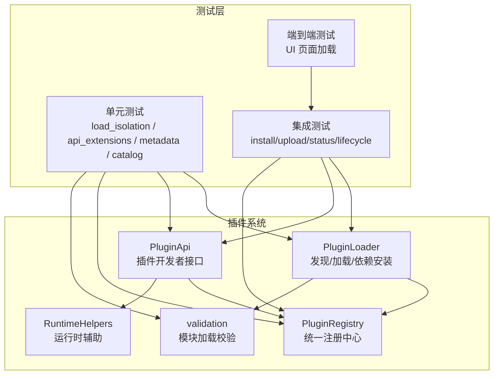
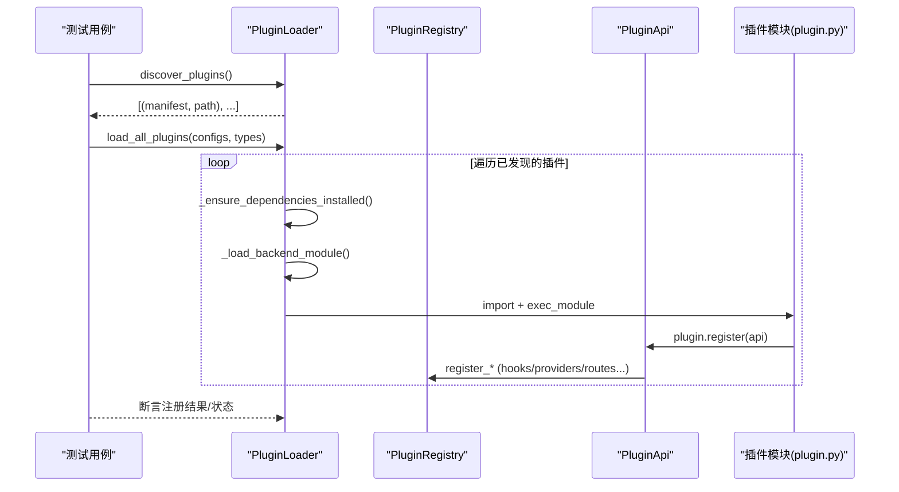
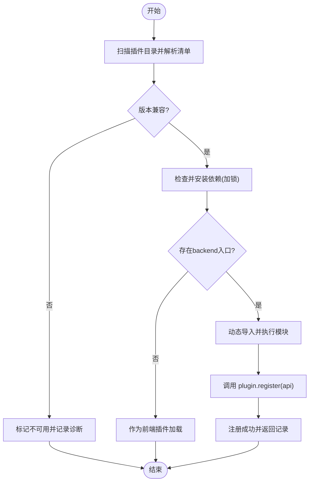
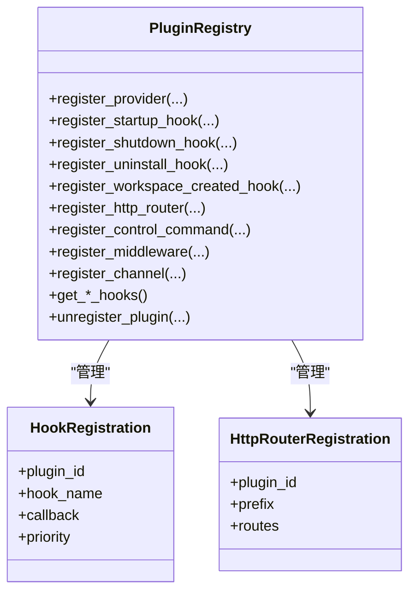
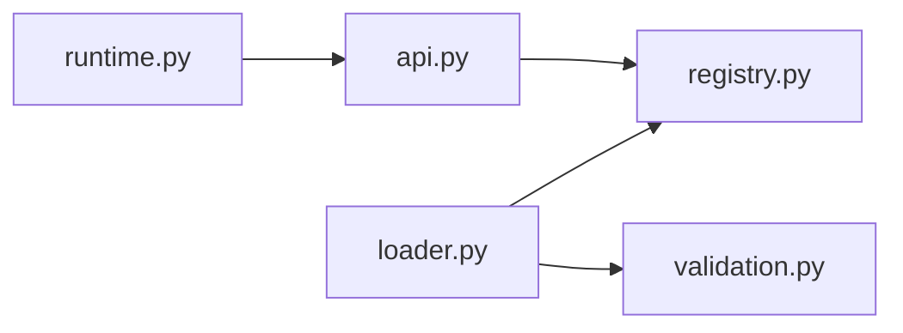

# 测试与调试

<cite>
**本文引用的文件**
- [src/qwenpaw/plugins/__init__.py](file://src/qwenpaw/plugins/__init__.py)
- [src/qwenpaw/plugins/loader.py](file://src/qwenpaw/plugins/loader.py)
- [src/qwenpaw/plugins/registry.py](file://src/qwenpaw/plugins/registry.py)
- [src/qwenpaw/plugins/api.py](file://src/qwenpaw/plugins/api.py)
- [src/qwenpaw/plugins/runtime.py](file://src/qwenpaw/plugins/runtime.py)
- [src/qwenpaw/plugins/validation.py](file://src/qwenpaw/plugins/validation.py)
- [tests/unit/plugins/test_plugin_load_isolation.py](file://tests/unit/plugins/test_plugin_load_isolation.py)
- [tests/unit/plugins/test_download_catalog.py](file://tests/unit/plugins/test_download_catalog.py)
- [tests/unit/plugins/test_generate_plugin_metadata.py](file://tests/unit/plugins/test_generate_plugin_metadata.py)
- [tests/unit/plugins/test_plugin_api_extensions.py](file://tests/unit/plugins/test_plugin_api_extensions.py)
- [tests/integration/test_plugins.py](file://tests/integration/test_plugins.py)
- [tests/integration/test_plugin_types.py](file://tests/integration/test_plugin_types.py)
- [e2e/tests/test_plugins.py](file://e2e/tests/test_plugins.py)
- [plugins/middleware-demo/thinking-log-middleware/thinking_log_plugin.py](file://plugins/middleware-demo/thinking-log-middleware/thinking_log_plugin.py)
</cite>

## 目录
1. [简介](#简介)
2. [项目结构](#项目结构)
3. [核心组件](#核心组件)
4. [架构总览](#架构总览)
5. [详细组件分析](#详细组件分析)
6. [依赖关系分析](#依赖关系分析)
7. [性能考量](#性能考量)
8. [故障排查指南](#故障排查指南)
9. [结论](#结论)
10. [附录](#附录)

## 简介
本文件面向 QwenPaw 插件的测试与调试，覆盖单元测试、集成测试、端到端测试的设计与实践；提供模拟对象、测试夹具、断言技巧；记录插件加载流程的调试方法、日志输出、断点调试与性能分析；解释配置热重载与动态更新；总结常见问题诊断（依赖冲突、内存泄漏、异步异常）；并给出自动化测试框架集成方案、持续集成建议以及覆盖率要求与质量保证流程。

## 项目结构
QwenPaw 插件体系围绕“发现—校验—安装依赖—动态导入—注册能力—生命周期钩子”展开。测试分为三层：
- 单元测试：聚焦加载隔离、API 扩展、元数据生成、兼容性判断等纯逻辑。
- 集成测试：通过 HTTP API 驱动真实插件安装/卸载、类型验证、状态查询。
- 端到端测试：基于 Playwright 对控制台页面进行 UI 级验证。

图表来源
- [src/qwenpaw/plugins/loader.py](file://src/qwenpaw/plugins/loader.py)
- [src/qwenpaw/plugins/registry.py](file://src/qwenpaw/plugins/registry.py)
- [src/qwenpaw/plugins/api.py](file://src/qwenpaw/plugins/api.py)
- [src/qwenpaw/plugins/validation.py](file://src/qwenpaw/plugins/validation.py)
- [src/qwenpaw/plugins/runtime.py](file://src/qwenpaw/plugins/runtime.py)
- [tests/unit/plugins/test_plugin_load_isolation.py](file://tests/unit/plugins/test_plugin_load_isolation.py)
- [tests/unit/plugins/test_plugin_api_extensions.py](file://tests/unit/plugins/test_plugin_api_extensions.py)
- [tests/integration/test_plugins.py](file://tests/integration/test_plugins.py)
- [e2e/tests/test_plugins.py](file://e2e/tests/test_plugins.py)

章节来源
- [src/qwenpaw/plugins/__init__.py:1-17](file://src/qwenpaw/plugins/__init__.py#L1-L17)

## 核心组件
- PluginLoader：负责插件发现、清单解析、版本兼容检查、依赖安装、动态模块加载、失败清理与卸载。
- PluginRegistry：单例式注册中心，管理 Provider、Hook、HTTP Router、Channel、PromptSection、控制命令、中间件等。
- PluginApi：插件开发者入口，暴露 register_* 系列方法，内部委托 Registry 完成注册。
- RuntimeHelpers：为插件提供运行时辅助（如获取 Provider、日志）。
- validation：在 CLI 安装/校验路径中复用与 Loader 一致的模块加载语义，确保相对导入可用且无残留。

章节来源
- [src/qwenpaw/plugins/loader.py:119-640](file://src/qwenpaw/plugins/loader.py#L119-L640)
- [src/qwenpaw/plugins/registry.py:129-800](file://src/qwenpaw/plugins/registry.py#L129-L800)
- [src/qwenpaw/plugins/api.py:172-800](file://src/qwenpaw/plugins/api.py#L172-L800)
- [src/qwenpaw/plugins/runtime.py:10-68](file://src/qwenpaw/plugins/runtime.py#L10-L68)
- [src/qwenpaw/plugins/validation.py:15-78](file://src/qwenpaw/plugins/validation.py#L15-L78)

## 架构总览
下图展示插件从发现到注册的完整调用链，以及测试如何介入关键路径。

图表来源
- [src/qwenpaw/plugins/loader.py:514-640](file://src/qwenpaw/plugins/loader.py#L514-L640)
- [src/qwenpaw/plugins/api.py:251-482](file://src/qwenpaw/plugins/api.py#L251-L482)
- [src/qwenpaw/plugins/registry.py:171-296](file://src/qwenpaw/plugins/registry.py#L171-L296)

## 详细组件分析

### 插件加载器（PluginLoader）
- 功能要点
  - 扫描插件目录，解析 plugin.json，执行版本兼容检查。
  - 按需安装 Python 依赖（支持 pip/uv），并发安全（按插件 ID 加锁）。
  - 动态导入后端模块，注入 sys.path/sys.modules，调用 plugin.register(api)。
  - 失败清理：回滚 registry、sys.modules、sys.path，避免污染后续插件。
  - 支持前端-only 插件（无 backend entry）。
- 测试关注点
  - 加载失败隔离：exec_module 失败、缺少 plugin 属性、register 抛错均能彻底清理。
  - 多插件并行加载时互不影响。
  - 依赖安装超时与回退策略。

图表来源
- [src/qwenpaw/plugins/loader.py:132-207](file://src/qwenpaw/plugins/loader.py#L132-L207)
- [src/qwenpaw/plugins/loader.py:270-335](file://src/qwenpaw/plugins/loader.py#L270-L335)
- [src/qwenpaw/plugins/loader.py:376-458](file://src/qwenpaw/plugins/loader.py#L376-L458)
- [src/qwenpaw/plugins/loader.py:514-607](file://src/qwenpaw/plugins/loader.py#L514-L607)

章节来源
- [src/qwenpaw/plugins/loader.py:119-800](file://src/qwenpaw/plugins/loader.py#L119-L800)
- [tests/unit/plugins/test_plugin_load_isolation.py:90-450](file://tests/unit/plugins/test_plugin_load_isolation.py#L90-L450)

### 插件注册中心（PluginRegistry）
- 功能要点
  - 单例管理所有注册项：Provider、Hook（启动/关闭/卸载/工作区创建）、HTTP Router、Channel、PromptSection、控制命令、中间件。
  - 支持按优先级排序执行 Hook。
  - 支持卸载时清理对应注册项。
- 测试关注点
  - 卸载钩子注册与执行（同步/异步、错误隔离）。
  - 工作区创建钩子的分发与错误隔离。
  - HTTP 路由挂载顺序与 OpenAPI 缓存失效。

图表来源
- [src/qwenpaw/plugins/registry.py:129-800](file://src/qwenpaw/plugins/registry.py#L129-L800)

章节来源
- [src/qwenpaw/plugins/registry.py:129-800](file://src/qwenpaw/plugins/registry.py#L129-L800)
- [tests/unit/plugins/test_plugin_api_extensions.py:79-264](file://tests/unit/plugins/test_plugin_api_extensions.py#L79-L264)
- [tests/unit/plugins/test_plugin_api_extensions.py:547-781](file://tests/unit/plugins/test_plugin_api_extensions.py#L547-L781)

### 插件 API（PluginApi）
- 功能要点
  - 对外暴露 register_tool/register_slash_command/register_mode/register_runtime_hook 等便捷方法。
  - 内部通过注册中心完成持久化与运行时桥接（例如工具注册会写入 Agent 配置并注入 ToolRegistry）。
- 测试关注点
  - 工具注册延迟到启动钩子，确保上下文就绪。
  - SlashCommand 与 Mode 的“全工作区注册 + 新工作区注册”双路径。
  - 中间件工厂注册与优先级。

章节来源
- [src/qwenpaw/plugins/api.py:172-800](file://src/qwenpaw/plugins/api.py#L172-L800)
- [tests/unit/plugins/test_plugin_api_extensions.py:454-540](file://tests/unit/plugins/test_plugin_api_extensions.py#L454-L540)

### 运行时辅助（RuntimeHelpers）
- 功能要点
  - 提供 get_provider/list_providers/log_info/log_error/log_debug 等能力。
- 测试关注点
  - 在插件中通过 api.runtime 访问，便于断言行为或注入 mock。

章节来源
- [src/qwenpaw/plugins/runtime.py:10-68](file://src/qwenpaw/plugins/runtime.py#L10-L68)

### 模块加载校验（validation）
- 功能要点
  - 使用与 Loader 一致的 spec_from_file_location + submodule_search_locations，确保相对导入正确。
  - 在 finally 中清理 sys.modules，避免重复安装时的残留。
- 测试关注点
  - 相对导入成功与失败场景。
  - 异常路径下的清理保证。

章节来源
- [src/qwenpaw/plugins/validation.py:15-78](file://src/qwenpaw/plugins/validation.py#L15-L78)
- [tests/unit/plugins/test_plugin_api_extensions.py:271-447](file://tests/unit/plugins/test_plugin_api_extensions.py#L271-L447)

### 示例插件：思考日志中间件
- 用途
  - 演示如何通过 register_middleware 注册中间件，捕获模型推理流事件并打印。
- 测试关注点
  - 中间件工厂注册与优先级。
  - 事件流处理是否正确转发。

章节来源
- [plugins/middleware-demo/thinking-log-middleware/thinking_log_plugin.py:1-66](file://plugins/middleware-demo/thinking-log-middleware/thinking_log_plugin.py#L1-L66)

## 依赖关系分析
- 组件耦合
  - PluginLoader 强依赖 PluginRegistry 与 PluginApi；失败清理需与注册中心保持一致。
  - PluginApi 仅依赖 PluginRegistry，保持对插件开发者的稳定契约。
  - validation 独立于运行期，仅在 CLI 安装/校验路径使用。
- 外部依赖
  - 依赖安装：pip/uv 子进程；冻结桌面构建下使用打包的 Python 运行时。
  - FastAPI：用于插件 HTTP 路由挂载与 OpenAPI 刷新。
- 潜在循环依赖
  - 通过延迟导入与运行时注入规避（如工具注册在启动钩子中执行）。

图表来源
- [src/qwenpaw/plugins/loader.py:119-207](file://src/qwenpaw/plugins/loader.py#L119-L207)
- [src/qwenpaw/plugins/api.py:172-250](file://src/qwenpaw/plugins/api.py#L172-L250)
- [src/qwenpaw/plugins/validation.py:15-78](file://src/qwenpaw/plugins/validation.py#L15-L78)

章节来源
- [src/qwenpaw/plugins/loader.py:119-207](file://src/qwenpaw/plugins/loader.py#L119-L207)
- [src/qwenpaw/plugins/api.py:172-250](file://src/qwenpaw/plugins/api.py#L172-L250)

## 性能考量
- 依赖安装
  - 使用 uv 优先（若可用），否则回退 pip；安装过程走线程池以避免阻塞事件循环。
  - 并发安装保护：按插件 ID 加锁，避免重复安装导致内存耗尽。
- 模块加载
  - 失败清理及时释放 sys.modules/sys.path，减少内存泄漏风险。
- HTTP 路由
  - 插件路由插入 SPA catch-all 之前，避免被吞掉；OpenAPI 缓存失效保证文档一致性。

章节来源
- [src/qwenpaw/plugins/loader.py:270-335](file://src/qwenpaw/plugins/loader.py#L270-L335)
- [src/qwenpaw/plugins/loader.py:641-800](file://src/qwenpaw/plugins/loader.py#L641-L800)
- [src/qwenpaw/plugins/registry.py:29-52](file://src/qwenpaw/plugins/registry.py#L29-L52)

## 故障排查指南
- 常见症状与定位
  - 插件加载失败但残留注册项：检查 _cleanup_failed_load 是否触发，确认 sys.modules/sys.path 清理。
  - 依赖安装卡住或失败：查看子进程日志输出与超时设置；确认 uv/pip 可用性。
  - 相对导入报错：确认 spec_from_file_location 设置了 submodule_search_locations。
  - 卸载后资源未释放：检查 uninstall hook 是否注册并执行。
- 调试技巧
  - 日志：启用 DEBUG 级别，观察插件安装命令输出与 Hook 执行轨迹。
  - 断点：在 loader 的 _load_backend_module、_install_requirements、registry 的 register_* 处打断点。
  - 性能分析：对依赖安装与模块加载路径做耗时统计，识别热点。
- 异步异常
  - Hook 回调可能为 async/sync，确保调用方 await 或 to_thread 包装，避免阻塞事件循环。
- 配置热重载与动态更新
  - 通过 upload/install 接口触发后台重新加载；注意 503 重试与幂等性。
  - 强制替换：upload ?force=true 可卸载旧版本并安装新版本。

章节来源
- [src/qwenpaw/plugins/loader.py:460-513](file://src/qwenpaw/plugins/loader.py#L460-L513)
- [src/qwenpaw/plugins/loader.py:672-719](file://src/qwenpaw/plugins/loader.py#L672-L719)
- [tests/integration/test_plugins.py:114-208](file://tests/integration/test_plugins.py#L114-L208)

## 结论
QwenPaw 插件体系提供了完善的加载、注册与生命周期管理能力，并通过严格的失败清理与并发保护保障稳定性。测试分层清晰：单元聚焦隔离与契约，集成覆盖真实安装/卸载与类型路径，端到端验证 UI 体验。遵循本文的测试与调试实践，可有效提升插件质量与可维护性。

## 附录

### 单元测试编写指南
- 模拟对象
  - 使用 unittest.mock.MagicMock 构造回调与依赖，避免真实 IO。
  - 针对单例（如 PluginRegistry），通过临时重置 _instance 实现隔离。
- 测试夹具
  - fresh_registry：每次测试前重置注册中心实例。
  - tmp_path：为每个测试提供独立插件目录与 manifest。
- 断言技巧
  - 断言 sys.modules/sys.path 无残留。
  - 断言注册中心集合（hooks、providers、http routes）为空或包含预期条目。
  - 断言响应结构与字段类型（集成测试）。

章节来源
- [tests/unit/plugins/test_plugin_load_isolation.py:45-83](file://tests/unit/plugins/test_plugin_load_isolation.py#L45-L83)
- [tests/unit/plugins/test_plugin_api_extensions.py:44-71](file://tests/unit/plugins/test_plugin_api_extensions.py#L44-L71)

### 集成测试策略
- 目标
  - 覆盖 install/upload/catalog/status/delete 等 API 契约。
  - 使用官方内置插件（cloudpaw、gpt-image2-tool）验证真实加载/卸载路径。
  - 构造最小 zip 包验证上传路径与 force 替换。
- 关键模式
  - 等待加载器就绪（503 重试）。
  - 断言列表/状态/版本字段。
  - finally 中尽力删除以清理环境。

章节来源
- [tests/integration/test_plugins.py:1-612](file://tests/integration/test_plugins.py#L1-L612)
- [tests/integration/test_plugin_types.py:1-55](file://tests/integration/test_plugin_types.py#L1-L55)

### 端到端测试（Playwright）
- 目标
  - 验证控制台插件管理页面加载与基本交互元素可见性。
- 关键点
  - 使用 Page Object 封装页面操作。
  - 结合日志记录步骤与结果。

章节来源
- [e2e/tests/test_plugins.py:1-49](file://e2e/tests/test_plugins.py#L1-L49)

### 元数据与兼容性测试
- 目标
  - 验证 qwenpaw_version 与 legacy min/max 兼容逻辑。
  - 验证脚本 generate_plugin_metadata 的版本提取与清洗。
- 关键点
  - 空字典/非 dict 的降级处理。
  - 前导 v 与空白字符清洗。

章节来源
- [tests/unit/plugins/test_download_catalog.py:1-128](file://tests/unit/plugins/test_download_catalog.py#L1-L128)
- [tests/unit/plugins/test_generate_plugin_metadata.py:1-106](file://tests/unit/plugins/test_generate_plugin_metadata.py#L1-L106)

### 自动化测试框架集成与 CI 建议
- 框架
  - pytest：单元测试与集成测试统一编排。
  - Playwright：端到端 UI 测试。
- 建议
  - 将插件相关测试标记为 @pytest.mark.integration/@pytest.mark.p0-p2，便于选择性执行。
  - 在 CI 中并行执行单元测试，串行执行集成/端到端测试。
  - 安装 uv 以提升依赖安装速度；离线环境准备缓存。
  - 收集测试报告与覆盖率（见下节）。

[本节为通用建议，不直接分析具体文件]

### 测试覆盖率与质量保证
- 覆盖率目标
  - 插件加载与卸载路径：≥90%。
  - 注册中心各注册项：≥85%。
  - API 扩展（工具/斜杠命令/模式/中间件）：≥85%。
- 质量门禁
  - 单元测试全部通过方可合并。
  - 集成测试在预发环境执行，关键路径必须通过。
  - 代码风格与静态检查（linting）通过。

[本节为通用建议，不直接分析具体文件]