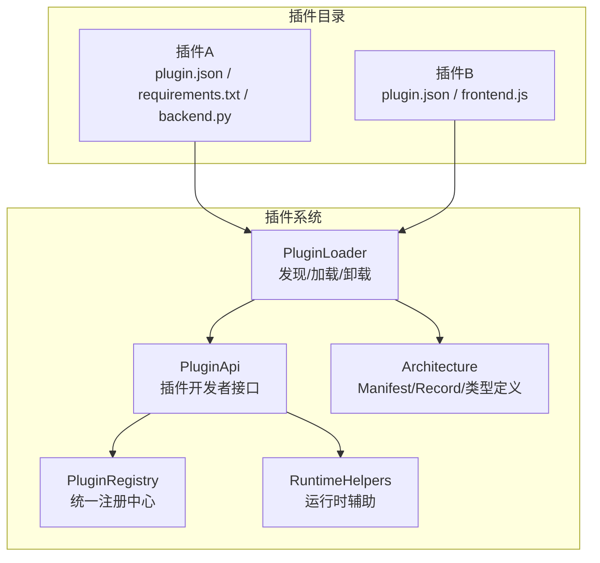
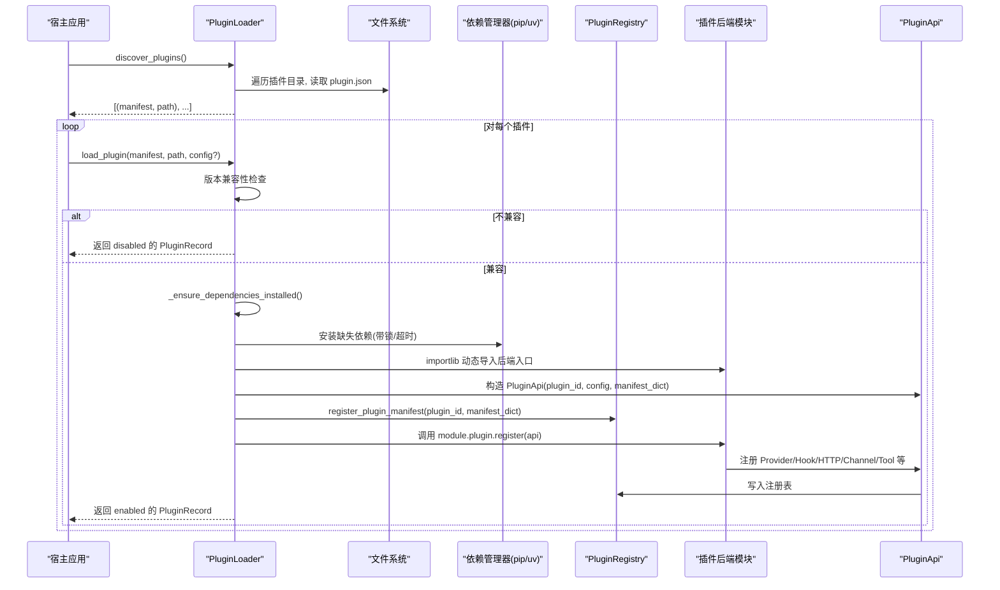
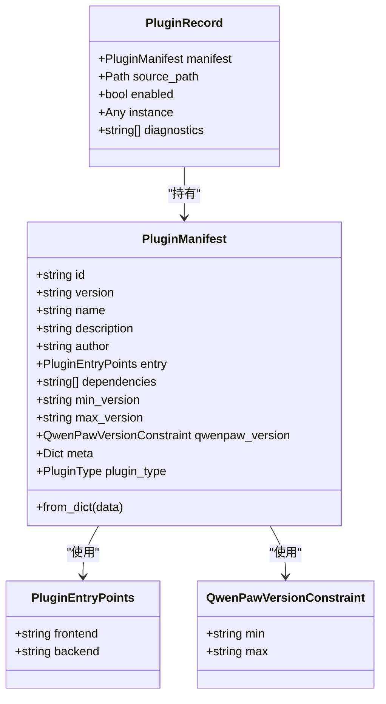
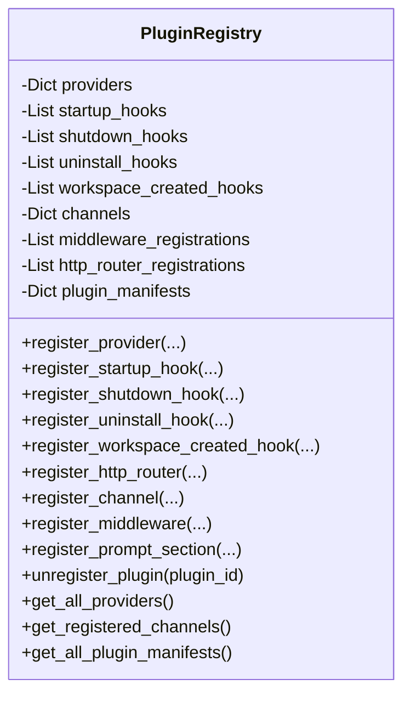
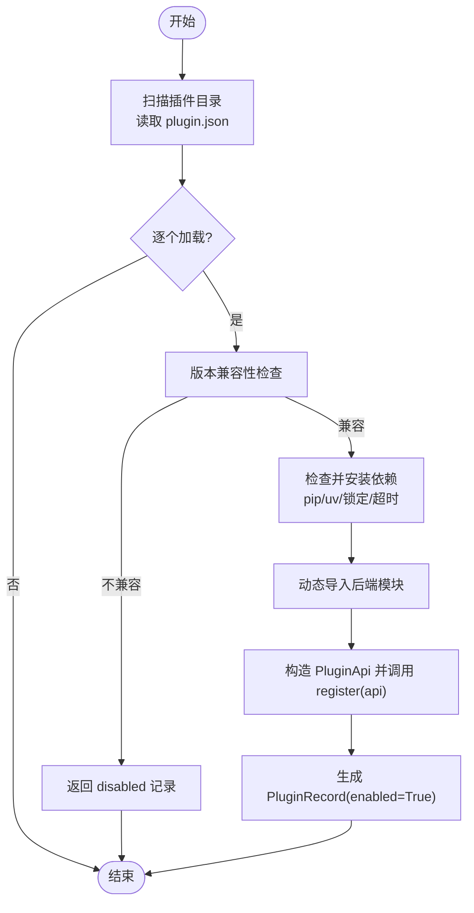
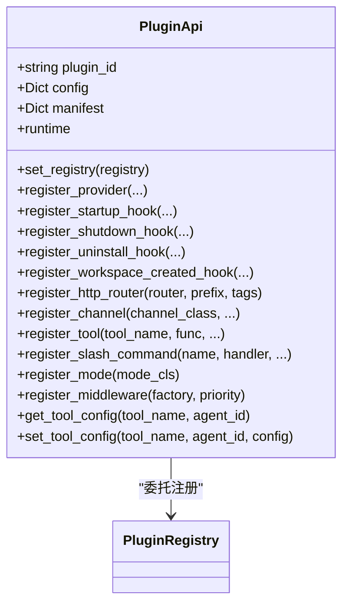
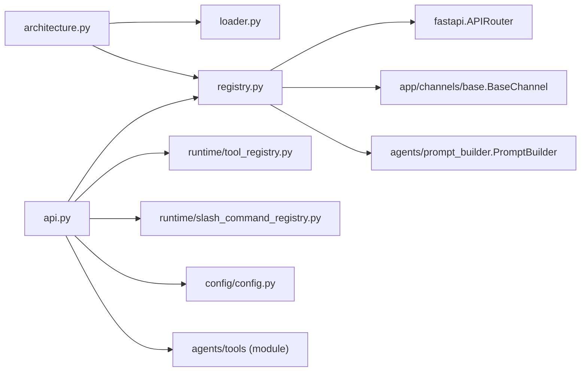

# 插件架构原理

<cite>
**本文引用的文件**   
- [src/qwenpaw/plugins/__init__.py](file://src/qwenpaw/plugins/__init__.py)
- [src/qwenpaw/plugins/architecture.py](file://src/qwenpaw/plugins/architecture.py)
- [src/qwenpaw/plugins/loader.py](file://src/qwenpaw/plugins/loader.py)
- [src/qwenpaw/plugins/registry.py](file://src/qwenpaw/plugins/registry.py)
- [src/qwenpaw/plugins/api.py](file://src/qwenpaw/plugins/api.py)
- [src/qwenpaw/plugins/runtime.py](file://src/qwenpaw/plugins/runtime.py)
</cite>

## 目录
1. [引言](#引言)
2. [项目结构](#项目结构)
3. [核心组件](#核心组件)
4. [架构总览](#架构总览)
5. [详细组件分析](#详细组件分析)
6. [依赖关系分析](#依赖关系分析)
7. [性能与并发特性](#性能与并发特性)
8. [安全、隔离与沙箱](#安全隔离与沙箱)
9. [故障排查指南](#故障排查指南)
10. [结论](#结论)

## 引言
本文件系统性阐述 QwenPaw 的插件架构，覆盖整体设计、核心类（PluginManifest、PluginRecord、PluginRegistry、PluginLoader、PluginApi）的职责与交互、数据流与生命周期管理，以及插件发现、加载、注册、卸载的完整流程。同时说明插件与主系统的隔离机制、依赖管理与版本兼容性检查，并给出安全沙箱与资源限制的设计要点。文档兼顾初学者理解与资深开发者的技术深度。

## 项目结构
QwenPaw 插件系统位于 src/qwenpaw/plugins 目录下，采用“声明式清单 + 动态加载 + 集中注册”的模式：
- 插件以目录形式存在，包含 plugin.json 描述元信息，可选 requirements.txt 声明 Python 依赖，后端入口模块导出 register(api) 函数。
- 启动时由 PluginLoader 扫描插件目录，解析 manifest，校验兼容性与依赖，动态导入后端模块并调用其 register(api)。
- 插件通过 PluginApi 向 PluginRegistry 注册能力（Provider、Hook、HTTP 路由、Channel、工具等）。
- 运行时通过 RuntimeHelpers 提供宿主能力访问。

图表来源
- [src/qwenpaw/plugins/loader.py:119-172](file://src/qwenpaw/plugins/loader.py#L119-L172)
- [src/qwenpaw/plugins/registry.py:129-169](file://src/qwenpaw/plugins/registry.py#L129-L169)
- [src/qwenpaw/plugins/api.py:172-204](file://src/qwenpaw/plugins/api.py#L172-L204)
- [src/qwenpaw/plugins/architecture.py:114-221](file://src/qwenpaw/plugins/architecture.py#L114-L221)
- [src/qwenpaw/plugins/runtime.py:10-68](file://src/qwenpaw/plugins/runtime.py#L10-L68)

章节来源
- [src/qwenpaw/plugins/__init__.py:1-17](file://src/qwenpaw/plugins/__init__.py#L1-L17)

## 核心组件
- PluginManifest：插件清单模型，负责解析和规范化 plugin.json，支持多语言文本、旧版字段兼容、类型推断与版本约束。
- PluginRecord：已加载插件的运行期记录，包含清单、源路径、启用状态、实例对象与诊断信息。
- PluginRegistry：单例注册中心，维护 Provider、Hook、HTTP 路由、Channel、控制命令、中间件、提示词片段等所有注册项，并提供卸载清理。
- PluginLoader：插件发现、依赖安装、动态导入、生命周期管理（加载/卸载），以及与注册中心的协作。
- PluginApi：插件开发者面向的 API，用于注册 Provider、Hook、HTTP 路由、Channel、工具、斜杠命令、模式等。
- RuntimeHelpers：插件在运行期可访问的宿主能力（如获取 Provider、日志等）。

章节来源
- [src/qwenpaw/plugins/architecture.py:114-221](file://src/qwenpaw/plugins/architecture.py#L114-L221)
- [src/qwenpaw/plugins/registry.py:129-169](file://src/qwenpaw/plugins/registry.py#L129-L169)
- [src/qwenpaw/plugins/loader.py:119-172](file://src/qwenpaw/plugins/loader.py#L119-L172)
- [src/qwenpaw/plugins/api.py:172-204](file://src/qwenpaw/plugins/api.py#L172-L204)
- [src/qwenpaw/plugins/runtime.py:10-68](file://src/qwenpaw/plugins/runtime.py#L10-L68)

## 架构总览
插件系统遵循“声明—发现—校验—安装—加载—注册—运行—卸载”的闭环。

图表来源
- [src/qwenpaw/plugins/loader.py:132-172](file://src/qwenpaw/plugins/loader.py#L132-L172)
- [src/qwenpaw/plugins/loader.py:514-607](file://src/qwenpaw/plugins/loader.py#L514-L607)
- [src/qwenpaw/plugins/loader.py:270-334](file://src/qwenpaw/plugins/loader.py#L270-L334)
- [src/qwenpaw/plugins/loader.py:376-458](file://src/qwenpaw/plugins/loader.py#L376-L458)
- [src/qwenpaw/plugins/registry.py:898-918](file://src/qwenpaw/plugins/registry.py#L898-L918)
- [src/qwenpaw/plugins/api.py:205-250](file://src/qwenpaw/plugins/api.py#L205-L250)

## 详细组件分析

### 清单与记录：PluginManifest 与 PluginRecord
- PluginManifest
  - 字段包括 id、version、name/description/author、entry(frontend/backend)、dependencies、min_version/max_version、qwenpaw_version、meta、plugin_type。
  - 具备输入归一化：本地化文本转字符串、兼容旧 entry_point、从 meta 推断 type。
  - 版本约束支持 qwenpaw_version(min,max)，兼容旧 min_version/max_version。
- PluginRecord
  - 保存 manifest、source_path、enabled、instance、diagnostics，用于加载结果与诊断。

图表来源
- [src/qwenpaw/plugins/architecture.py:41-98](file://src/qwenpaw/plugins/architecture.py#L41-L98)
- [src/qwenpaw/plugins/architecture.py:100-143](file://src/qwenpaw/plugins/architecture.py#L100-L143)
- [src/qwenpaw/plugins/architecture.py:114-221](file://src/qwenpaw/plugins/architecture.py#L114-L221)

章节来源
- [src/qwenpaw/plugins/architecture.py:114-221](file://src/qwenpaw/plugins/architecture.py#L114-L221)

### 注册中心：PluginRegistry
- 单例，维护以下注册项：
  - Providers（LLM 提供者）、Hooks（启动/关闭/卸载/工作区创建）、HTTP 路由（FastAPI Router）、Channels（消息通道）、Control Commands、Middleware Factories、Prompt Sections、插件 Manifests。
- 关键职责：
  - 注册与查询各能力；按优先级排序执行 Hook；将 HTTP 路由插入到 SPA catch-all 之前；卸载时清理所有条目。
- 重要方法：
  - register_provider、register_startup_hook、register_shutdown_hook、register_uninstall_hook、register_workspace_created_hook、register_http_router、register_channel、register_middleware、register_prompt_section、unregister_plugin、get_* 系列。

图表来源
- [src/qwenpaw/plugins/registry.py:129-169](file://src/qwenpaw/plugins/registry.py#L129-L169)
- [src/qwenpaw/plugins/registry.py:328-367](file://src/qwenpaw/plugins/registry.py#L328-L367)
- [src/qwenpaw/plugins/registry.py:472-528](file://src/qwenpaw/plugins/registry.py#L472-L528)
- [src/qwenpaw/plugins/registry.py:546-588](file://src/qwenpaw/plugins/registry.py#L546-L588)
- [src/qwenpaw/plugins/registry.py:590-628](file://src/qwenpaw/plugins/registry.py#L590-L628)
- [src/qwenpaw/plugins/registry.py:220-292](file://src/qwenpaw/plugins/registry.py#L220-L292)
- [src/qwenpaw/plugins/registry.py:749-854](file://src/qwenpaw/plugins/registry.py#L749-L854)
- [src/qwenpaw/plugins/registry.py:934-992](file://src/qwenpaw/plugins/registry.py#L934-L992)

章节来源
- [src/qwenpaw/plugins/registry.py:129-169](file://src/qwenpaw/plugins/registry.py#L129-L169)
- [src/qwenpaw/plugins/registry.py:934-992](file://src/qwenpaw/plugins/registry.py#L934-L992)

### 加载器：PluginLoader
- 发现：遍历插件目录，跳过隐藏或 .disabled 目录，读取 plugin.json 并构建 Manifest。
- 依赖：检测 requirements.txt，优先 pip，若不可用则回退 uv；冻结桌面环境使用打包 Python 安装到用户可写 site-dir；跨进程安装加锁避免重复安装风暴。
- 加载：动态导入后端模块，构造 PluginApi，注入 registry 引用，调用 module.plugin.register(api)。
- 卸载：执行 shutdown/uninstall hooks，清理 sys.modules、sys.path、注册表、tools 暴露，可选删除磁盘文件。

图表来源
- [src/qwenpaw/plugins/loader.py:132-172](file://src/qwenpaw/plugins/loader.py#L132-L172)
- [src/qwenpaw/plugins/loader.py:192-206](file://src/qwenpaw/plugins/loader.py#L192-L206)
- [src/qwenpaw/plugins/loader.py:270-334](file://src/qwenpaw/plugins/loader.py#L270-L334)
- [src/qwenpaw/plugins/loader.py:376-458](file://src/qwenpaw/plugins/loader.py#L376-L458)
- [src/qwenpaw/plugins/loader.py:975-1096](file://src/qwenpaw/plugins/loader.py#L975-L1096)

章节来源
- [src/qwenpaw/plugins/loader.py:119-172](file://src/qwenpaw/plugins/loader.py#L119-L172)
- [src/qwenpaw/plugins/loader.py:514-607](file://src/qwenpaw/plugins/loader.py#L514-L607)
- [src/qwenpaw/plugins/loader.py:894-973](file://src/qwenpaw/plugins/loader.py#L894-L973)
- [src/qwenpaw/plugins/loader.py:975-1096](file://src/qwenpaw/plugins/loader.py#L975-L1096)

### 插件 API：PluginApi
- 提供注册能力：
  - register_provider：注册自定义 LLM Provider。
  - register_startup_hook/register_shutdown_hook/register_uninstall_hook/register_workspace_created_hook：生命周期钩子。
  - register_http_router：挂载 FastAPI Router 到 /api/<prefix>，确保在控制台 SPA catch-all 前匹配。
  - register_channel：注册自定义 Channel，含配置字段描述与图标/文档链接。
  - register_tool：注册工具函数，自动桥接到运行时 ToolRegistry 并持久化 BuiltinToolConfig。
  - register_slash_command：注册斜杠命令，延迟到工作区初始化后注册。
  - register_mode：注册 AgentMode，延迟到工作区初始化后注册。
  - register_middleware：注册中间件工厂，按优先级组装。
  - get/set tool_config：读写当前 Agent 的工具配置。
- 内部通过 Registry 完成实际注册，并在需要时访问 WorkspaceManager 与运行时辅助。

图表来源
- [src/qwenpaw/plugins/api.py:172-204](file://src/qwenpaw/plugins/api.py#L172-L204)
- [src/qwenpaw/plugins/api.py:205-250](file://src/qwenpaw/plugins/api.py#L205-L250)
- [src/qwenpaw/plugins/api.py:394-424](file://src/qwenpaw/plugins/api.py#L394-L424)
- [src/qwenpaw/plugins/api.py:483-570](file://src/qwenpaw/plugins/api.py#L483-L570)
- [src/qwenpaw/plugins/api.py:614-698](file://src/qwenpaw/plugins/api.py#L614-L698)
- [src/qwenpaw/plugins/api.py:700-756](file://src/qwenpaw/plugins/api.py#L700-L756)
- [src/qwenpaw/plugins/api.py:758-796](file://src/qwenpaw/plugins/api.py#L758-L796)
- [src/qwenpaw/plugins/api.py:448-481](file://src/qwenpaw/plugins/api.py#L448-L481)
- [src/qwenpaw/plugins/api.py:583-613](file://src/qwenpaw/plugins/api.py#L583-L613)

章节来源
- [src/qwenpaw/plugins/api.py:172-204](file://src/qwenpaw/plugins/api.py#L172-L204)
- [src/qwenpaw/plugins/api.py:614-698](file://src/qwenpaw/plugins/api.py#L614-L698)

### 运行时辅助：RuntimeHelpers
- 提供 provider_manager 访问、列出可用 Provider、日志输出等基础能力，供插件在运行期使用。

章节来源
- [src/qwenpaw/plugins/runtime.py:10-68](file://src/qwenpaw/plugins/runtime.py#L10-L68)

## 依赖关系分析
- 模块耦合
  - loader 依赖 architecture（Manifest/Record）、api（PluginApi）、registry（注册中心）。
  - api 依赖 registry（注册）、config（工具配置持久化）、agents.tools（工具注入）、runtime.slash_command_registry（斜杠命令）、runtime.tool_registry（工具描述符）。
  - registry 依赖 fastapi.APIRouter（HTTP 路由）、app.channels.base.BaseChannel（通道基类）、agents.prompt_builder.PromptBuilder（提示词锚点）。
- 外部依赖
  - packaging.requirements（requirements.txt 解析）、importlib.metadata（包元数据探测）、subprocess（pip/uv 安装）、os/sys/path（模块与路径操作）。

图表来源
- [src/qwenpaw/plugins/loader.py:22-26](file://src/qwenpaw/plugins/loader.py#L22-L26)
- [src/qwenpaw/plugins/api.py:614-698](file://src/qwenpaw/plugins/api.py#L614-L698)
- [src/qwenpaw/plugins/registry.py:9-11](file://src/qwenpaw/plugins/registry.py#L9-L11)
- [src/qwenpaw/plugins/registry.py:784-800](file://src/qwenpaw/plugins/registry.py#L784-L800)
- [src/qwenpaw/plugins/registry.py:692-711](file://src/qwenpaw/plugins/registry.py#L692-L711)

章节来源
- [src/qwenpaw/plugins/loader.py:22-26](file://src/qwenpaw/plugins/loader.py#L22-L26)
- [src/qwenpaw/plugins/api.py:614-698](file://src/qwenpaw/plugins/api.py#L614-L698)
- [src/qwenpaw/plugins/registry.py:9-11](file://src/qwenpaw/plugins/registry.py#L9-L11)

## 性能与并发特性
- 依赖安装
  - 使用 importlib.metadata 与 find_spec 双重探测，避免误报缺失导致重复安装。
  - 跨进程安装锁（按插件 ID 分片）防止并发安装风暴；等待后再二次探测，减少不必要安装。
  - 超时保护（默认 300 秒），失败抛出明确异常。
- 动态导入与清理
  - 加载时按插件命名空间设置 __package__/__path__，失败时清理 sys.modules 与 sys.path，避免污染后续加载。
  - 卸载时彻底清理模块引用与路径，保证热重载与重新安装的正确性。
- HTTP 路由插入
  - 将插件路由插入到控制台 SPA catch-all 之前，避免被错误捕获；更新 OpenAPI schema 缓存。

章节来源
- [src/qwenpaw/plugins/loader.py:209-246](file://src/qwenpaw/plugins/loader.py#L209-L246)
- [src/qwenpaw/plugins/loader.py:306-334](file://src/qwenpaw/plugins/loader.py#L306-L334)
- [src/qwenpaw/plugins/loader.py:460-513](file://src/qwenpaw/plugins/loader.py#L460-L513)
- [src/qwenpaw/plugins/loader.py:975-1096](file://src/qwenpaw/plugins/loader.py#L975-L1096)
- [src/qwenpaw/plugins/registry.py:29-52](file://src/qwenpaw/plugins/registry.py#L29-L52)

## 安全、隔离与沙箱
- 插件目录隔离
  - 忽略隐藏目录与 .disabled 后缀目录，避免意外加载。
  - 动态导入时使用独立模块命名空间，失败/卸载时清理 sys.modules 与 sys.path，降低相互影响。
- 依赖安装隔离
  - 冻结桌面环境使用打包 Python 安装到用户可写的 ABI-bucketed site-dir，并通过环境变量与 site.addsitedir 暴露给子进程。
  - 非冻结环境使用当前解释器的 pip/uv，避免修改全局环境。
- 版本兼容性
  - 基于 qwenpaw_version(min,max) 或 legacy min_version/max_version 进行左闭右开区间检查，不兼容则标记为 disabled 并记录诊断。
- 安全策略与沙箱
  - 插件本身不直接执行沙箱逻辑，但可通过注册工具与中间件参与治理；系统侧的资源治理与沙箱策略在工具调用链中生效（例如 Bash 命令的 SANDBOX_FALLBACK 与 ASK/DENY 决策）。
  - 插件应遵循最小权限原则，避免在注册阶段引入危险行为；卸载钩子可用于撤销副作用。

章节来源
- [src/qwenpaw/plugins/loader.py:81-91](file://src/qwenpaw/plugins/loader.py#L81-L91)
- [src/qwenpaw/plugins/loader.py:93-117](file://src/qwenpaw/plugins/loader.py#L93-L117)
- [src/qwenpaw/plugins/loader.py:192-206](file://src/qwenpaw/plugins/loader.py#L192-L206)
- [src/qwenpaw/plugins/loader.py:836-892](file://src/qwenpaw/plugins/loader.py#L836-L892)

## 故障排查指南
- 插件未加载
  - 检查 plugin.json 是否存在且有效；确认插件目录未被隐藏或 .disabled。
  - 查看兼容性诊断信息（PluginRecord.diagnostics）。
- 依赖安装失败
  - 确认网络与镜像源；查看安装日志（超时/失败信息）；在非冻结环境中尝试手动安装 requirements.txt。
- 模块导入错误
  - 确认后端入口模块导出了 plugin 对象并实现 register(api)；检查模块命名冲突与路径问题。
- HTTP 路由不生效
  - 确认注册了 FastAPI app 且 prefix 合法且不重复；检查是否被 SPA catch-all 拦截。
- 卸载残留
  - 确认卸载钩子执行成功；检查 sys.modules 与 sys.path 清理；必要时重启进程。

章节来源
- [src/qwenpaw/plugins/loader.py:132-172](file://src/qwenpaw/plugins/loader.py#L132-L172)
- [src/qwenpaw/plugins/loader.py:514-607](file://src/qwenpaw/plugins/loader.py#L514-L607)
- [src/qwenpaw/plugins/loader.py:975-1096](file://src/qwenpaw/plugins/loader.py#L975-L1096)
- [src/qwenpaw/plugins/registry.py:220-292](file://src/qwenpaw/plugins/registry.py#L220-L292)

## 结论
QwenPaw 插件系统通过清晰的清单模型、严格的依赖与版本管理、完善的注册中心与生命周期钩子，实现了高内聚、低耦合的扩展能力。加载器负责发现与装载，注册中心统一管理能力，API 提供友好接口，运行时辅助简化宿主访问。系统在安全与隔离方面采取多项措施，结合资源治理与沙箱策略，保障插件生态的稳定与安全。对于开发者而言，遵循最佳实践（显式声明依赖、谨慎注册能力、完善卸载清理）可获得良好的可维护性与可观测性。