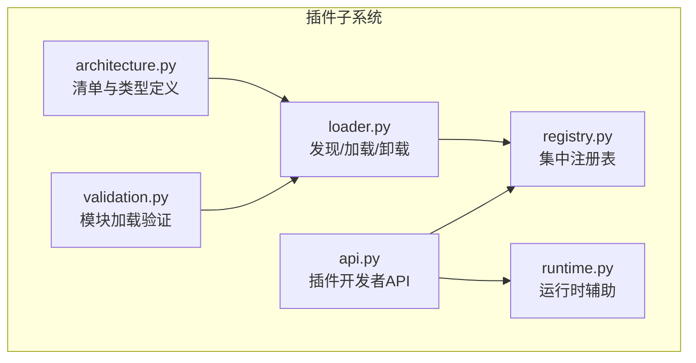
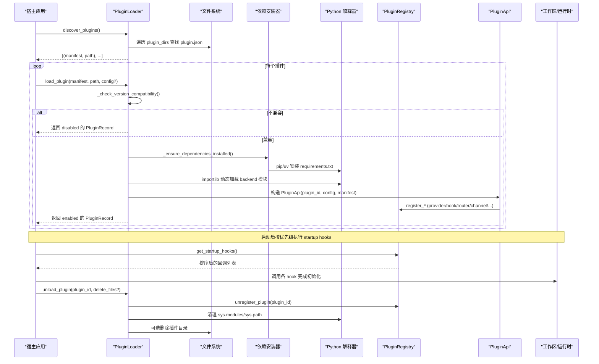
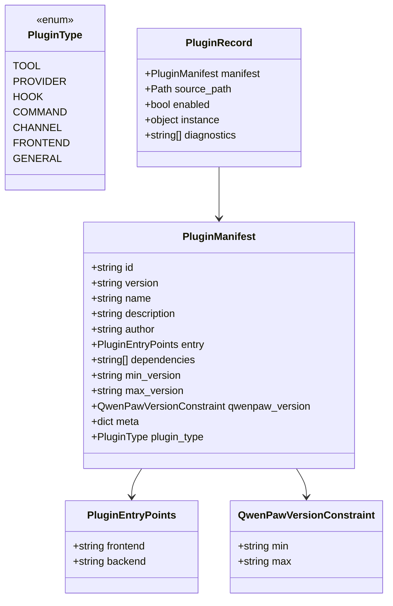
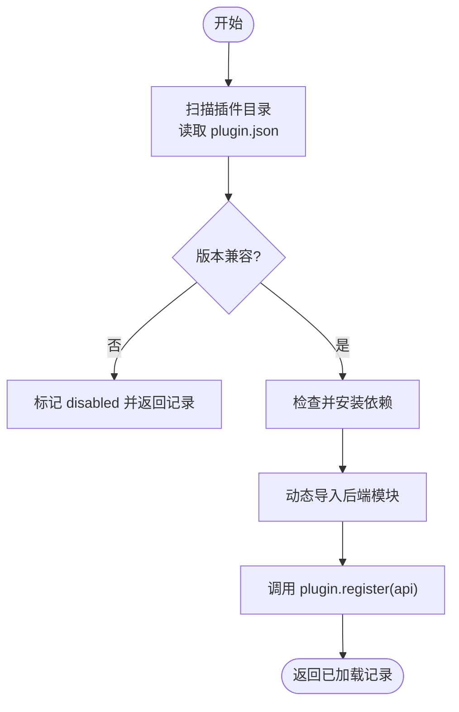
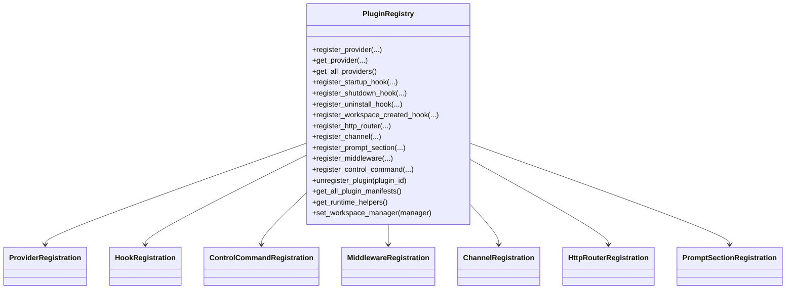
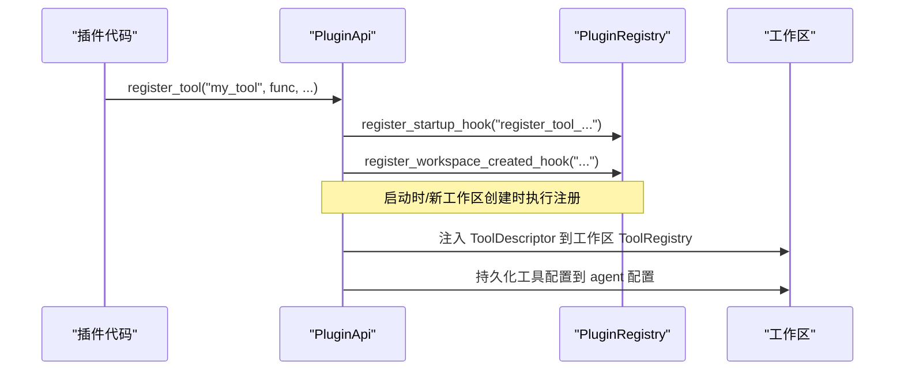
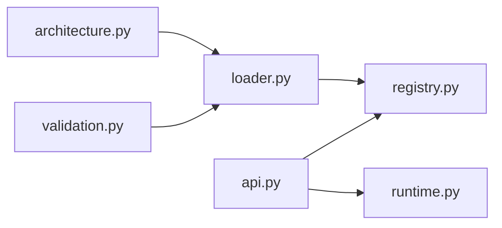

# 插件注册表机制

<cite>
**本文引用的文件**   
- [src/qwenpaw/plugins/registry.py](file://src/qwenpaw/plugins/registry.py)
- [src/qwenpaw/plugins/loader.py](file://src/qwenpaw/plugins/loader.py)
- [src/qwenpaw/plugins/api.py](file://src/qwenpaw/plugins/api.py)
- [src/qwenpaw/plugins/runtime.py](file://src/qwenpaw/plugins/runtime.py)
- [src/qwenpaw/plugins/validation.py](file://src/qwenpaw/plugins/validation.py)
- [src/qwenpaw/plugins/architecture.py](file://src/qwenpaw/plugins/architecture.py)
</cite>

## 目录
1. [简介](#简介)
2. [项目结构](#项目结构)
3. [核心组件](#核心组件)
4. [架构总览](#架构总览)
5. [详细组件分析](#详细组件分析)
6. [依赖关系分析](#依赖关系分析)
7. [性能与并发特性](#性能与并发特性)
8. [故障排查指南](#故障排查指南)
9. [结论](#结论)
10. [附录：API 与使用模式](#附录api-与使用模式)

## 简介
本文件系统性阐述 QwenPaw 的插件注册表机制，围绕 PluginRegistry 的实现原理，完整覆盖插件发现、加载、注册与管理流程；记录插件生命周期（扫描→依赖安装→模块导入→注册→运行→卸载）；解释依赖解析与版本兼容性检查；提供查询已注册插件、获取实例与处理状态的实践示例；说明隔离机制、命名空间管理与冲突解决策略；并讨论热重载与动态更新的支持方式。文档兼顾初学者友好与系统架构师所需的技术深度。

## 项目结构
QwenPaw 插件子系统由以下关键模块组成：
- 架构与清单模型：定义插件类型、入口点、版本约束与清单校验
- 加载器：负责发现、依赖安装、模块导入与生命周期管理
- 注册表：集中维护所有注册项（Provider、Hook、HTTP 路由、Channel、Prompt 片段等）
- 插件 API：面向插件开发者的统一注册接口
- 运行时辅助：为插件提供运行时能力访问
- 验证工具：在 CLI 中复用加载语义进行模块级校验

图示来源
- [src/qwenpaw/plugins/architecture.py:1-221](file://src/qwenpaw/plugins/architecture.py#L1-L221)
- [src/qwenpaw/plugins/loader.py:120-173](file://src/qwenpaw/plugins/loader.py#L120-L173)
- [src/qwenpaw/plugins/registry.py:129-169](file://src/qwenpaw/plugins/registry.py#L129-L169)
- [src/qwenpaw/plugins/api.py:172-204](file://src/qwenpaw/plugins/api.py#L172-L204)
- [src/qwenpaw/plugins/runtime.py:10-68](file://src/qwenpaw/plugins/runtime.py#L10-L68)
- [src/qwenpaw/plugins/validation.py:15-78](file://src/qwenpaw/plugins/validation.py#L15-L78)

章节来源
- [src/qwenpaw/plugins/architecture.py:1-221](file://src/qwenpaw/plugins/architecture.py#L1-L221)
- [src/qwenpaw/plugins/loader.py:120-173](file://src/qwenpaw/plugins/loader.py#L120-L173)
- [src/qwenpaw/plugins/registry.py:129-169](file://src/qwenpaw/plugins/registry.py#L129-L169)
- [src/qwenpaw/plugins/api.py:172-204](file://src/qwenpaw/plugins/api.py#L172-L204)
- [src/qwenpaw/plugins/runtime.py:10-68](file://src/qwenpaw/plugins/runtime.py#L10-L68)
- [src/qwenpaw/plugins/validation.py:15-78](file://src/qwenpaw/plugins/validation.py#L15-L78)

## 核心组件
- 清单与类型（PluginManifest、PluginType、QwenPawVersionConstraint、PluginRecord）
  - 负责描述插件元数据、入口点、依赖、兼容范围与加载结果
- 加载器（PluginLoader）
  - 扫描插件目录、解析清单、校验兼容性、安装依赖、动态导入后端模块、注册到注册表、管理已加载集合
- 注册表（PluginRegistry）
  - 单例式集中注册中心，维护 Provider、Hook、HTTP 路由、Channel、Prompt 片段、控制命令、中间件工厂等
- 插件 API（PluginApi）
  - 插件侧统一注册入口，内部委托至注册表或工作区子注册器
- 运行时辅助（RuntimeHelpers）
  - 暴露 provider 列表与日志等运行时能力
- 验证工具（validate_plugin_module）
  - 以与加载器一致的语义执行模块导入，用于 CLI 校验

章节来源
- [src/qwenpaw/plugins/architecture.py:100-221](file://src/qwenpaw/plugins/architecture.py#L100-L221)
- [src/qwenpaw/plugins/loader.py:119-173](file://src/qwenpaw/plugins/loader.py#L119-L173)
- [src/qwenpaw/plugins/registry.py:129-169](file://src/qwenpaw/plugins/registry.py#L129-L169)
- [src/qwenpaw/plugins/api.py:172-204](file://src/qwenpaw/plugins/api.py#L172-L204)
- [src/qwenpaw/plugins/runtime.py:10-68](file://src/qwenpaw/plugins/runtime.py#L10-L68)
- [src/qwenpaw/plugins/validation.py:15-78](file://src/qwenpaw/plugins/validation.py#L15-L78)

## 架构总览
下图展示从“发现”到“运行”的关键路径，以及卸载时的清理路径。

图示来源
- [src/qwenpaw/plugins/loader.py:132-173](file://src/qwenpaw/plugins/loader.py#L132-L173)
- [src/qwenpaw/plugins/loader.py:514-607](file://src/qwenpaw/plugins/loader.py#L514-L607)
- [src/qwenpaw/plugins/loader.py:270-335](file://src/qwenpaw/plugins/loader.py#L270-L335)
- [src/qwenpaw/plugins/loader.py:376-458](file://src/qwenpaw/plugins/loader.py#L376-L458)
- [src/qwenpaw/plugins/registry.py:472-544](file://src/qwenpaw/plugins/registry.py#L472-L544)
- [src/qwenpaw/plugins/registry.py:934-992](file://src/qwenpaw/plugins/registry.py#L934-L992)
- [src/qwenpaw/plugins/loader.py:975-1096](file://src/qwenpaw/plugins/loader.py#L975-L1096)

## 详细组件分析

### 清单与类型（architecture.py）
- 插件类型枚举：tool/provider/hook/command/channel/frontend/general
- 入口点模型：frontend/backend 相对路径
- 版本约束：左闭右开区间 >=min, <max；缺失 max 时推导同小版本的下一个大版本
- 清单模型：支持多语言文本、遗留字段兼容、type 推断
- 加载记录：包含清单、源路径、启用状态、实例与诊断信息

图示来源
- [src/qwenpaw/plugins/architecture.py:12-98](file://src/qwenpaw/plugins/architecture.py#L12-L98)
- [src/qwenpaw/plugins/architecture.py:100-144](file://src/qwenpaw/plugins/architecture.py#L100-L144)
- [src/qwenpaw/plugins/architecture.py:145-210](file://src/qwenpaw/plugins/architecture.py#L145-L210)
- [src/qwenpaw/plugins/architecture.py:212-221](file://src/qwenpaw/plugins/architecture.py#L212-L221)

章节来源
- [src/qwenpaw/plugins/architecture.py:12-221](file://src/qwenpaw/plugins/architecture.py#L12-L221)

### 加载器（loader.py）
- 发现：遍历 plugin_dirs，跳过隐藏与 .disabled 目录，读取 plugin.json 并构建 Manifest
- 兼容性：基于清单中的 qwenpaw_version 或 legacy 字段进行区间判断
- 依赖安装：检测 requirements.txt，优先 pip，回退 uv；冻结桌面环境使用独立 Python 安装到用户可写 site-dir
- 模块加载：以 plugin_<id> 命名空间动态 exec_module，要求导出 plugin 对象并实现 register(api)
- 注册：通过 PluginApi 将能力写入注册表
- 卸载：执行 shutdown/uninstall hooks，清理 sys.modules/sys.path，移除注册项与 tools 映射，可选删除磁盘文件

图示来源
- [src/qwenpaw/plugins/loader.py:132-173](file://src/qwenpaw/plugins/loader.py#L132-L173)
- [src/qwenpaw/plugins/loader.py:192-207](file://src/qwenpaw/plugins/loader.py#L192-L207)
- [src/qwenpaw/plugins/loader.py:270-335](file://src/qwenpaw/plugins/loader.py#L270-L335)
- [src/qwenpaw/plugins/loader.py:376-458](file://src/qwenpaw/plugins/loader.py#L376-L458)
- [src/qwenpaw/plugins/loader.py:514-607](file://src/qwenpaw/plugins/loader.py#L514-L607)
- [src/qwenpaw/plugins/loader.py:975-1096](file://src/qwenpaw/plugins/loader.py#L975-L1096)

章节来源
- [src/qwenpaw/plugins/loader.py:119-173](file://src/qwenpaw/plugins/loader.py#L119-L173)
- [src/qwenpaw/plugins/loader.py:192-207](file://src/qwenpaw/plugins/loader.py#L192-L207)
- [src/qwenpaw/plugins/loader.py:270-335](file://src/qwenpaw/plugins/loader.py#L270-L335)
- [src/qwenpaw/plugins/loader.py:376-458](file://src/qwenpaw/plugins/loader.py#L376-L458)
- [src/qwenpaw/plugins/loader.py:514-607](file://src/qwenpaw/plugins/loader.py#L514-L607)
- [src/qwenpaw/plugins/loader.py:975-1096](file://src/qwenpaw/plugins/loader.py#L975-L1096)

### 注册表（registry.py）
- 单例设计：保证全局唯一注册中心
- 注册项类型：Provider、Hook（startup/shutdown/uninstall/workspace_created）、ControlCommand、MiddlewareFactory、Channel、HttpRouter、PromptSection
- HTTP 路由挂载：在 FastAPI 根应用中插入路由，确保在 SPA catch-all 之前匹配，并刷新 OpenAPI 缓存
- 冲突与隔离：
  - Provider ID 唯一性校验
  - Channel key 规范化与内置键保护
  - Prompt section name 唯一性与锚点合法性校验
  - HTTP prefix 唯一性校验
- 卸载清理：批量移除指定 plugin_id 的所有注册项

图示来源
- [src/qwenpaw/plugins/registry.py:55-128](file://src/qwenpaw/plugins/registry.py#L55-L128)
- [src/qwenpaw/plugins/registry.py:129-169](file://src/qwenpaw/plugins/registry.py#L129-L169)
- [src/qwenpaw/plugins/registry.py:328-386](file://src/qwenpaw/plugins/registry.py#L328-L386)
- [src/qwenpaw/plugins/registry.py:472-544](file://src/qwenpaw/plugins/registry.py#L472-L544)
- [src/qwenpaw/plugins/registry.py:220-296](file://src/qwenpaw/plugins/registry.py#L220-L296)
- [src/qwenpaw/plugins/registry.py:749-854](file://src/qwenpaw/plugins/registry.py#L749-L854)
- [src/qwenpaw/plugins/registry.py:663-715](file://src/qwenpaw/plugins/registry.py#L663-L715)
- [src/qwenpaw/plugins/registry.py:934-992](file://src/qwenpaw/plugins/registry.py#L934-L992)

章节来源
- [src/qwenpaw/plugins/registry.py:129-169](file://src/qwenpaw/plugins/registry.py#L129-L169)
- [src/qwenpaw/plugins/registry.py:220-296](file://src/qwenpaw/plugins/registry.py#L220-L296)
- [src/qwenpaw/plugins/registry.py:328-386](file://src/qwenpaw/plugins/registry.py#L328-L386)
- [src/qwenpaw/plugins/registry.py:472-544](file://src/qwenpaw/plugins/registry.py#L472-L544)
- [src/qwenpaw/plugins/registry.py:749-854](file://src/qwenpaw/plugins/registry.py#L749-L854)
- [src/qwenpaw/plugins/registry.py:663-715](file://src/qwenpaw/plugins/registry.py#L663-L715)
- [src/qwenpaw/plugins/registry.py:934-992](file://src/qwenpaw/plugins/registry.py#L934-L992)

### 插件 API（api.py）
- 统一注册入口：register_provider/register_startup_hook/register_shutdown_hook/register_uninstall_hook/register_workspace_created_hook/register_http_router/register_channel/register_middleware/register_control_command/register_tool/register_slash_command/register_mode/register_runtime_hook/register_agent_stop_handler/register_skill_provider 等
- 延迟注册：部分能力（如 tool/slash command/mode/runtime hook）通过启动钩子在工作区就绪后注入
- 工作区联动：通过注册表获取工作区管理器，向现有与新创建工作区广播注册
- 技能提供者：自动复制 skills 到工作区、更新工作区清单、卸载时清理

图示来源
- [src/qwenpaw/plugins/api.py:614-698](file://src/qwenpaw/plugins/api.py#L614-L698)
- [src/qwenpaw/plugins/api.py:700-756](file://src/qwenpaw/plugins/api.py#L700-L756)
- [src/qwenpaw/plugins/api.py:758-796](file://src/qwenpaw/plugins/api.py#L758-L796)
- [src/qwenpaw/plugins/api.py:798-835](file://src/qwenpaw/plugins/api.py#L798-L835)
- [src/qwenpaw/plugins/api.py:1098-1184](file://src/qwenpaw/plugins/api.py#L1098-L1184)

章节来源
- [src/qwenpaw/plugins/api.py:172-204](file://src/qwenpaw/plugins/api.py#L172-L204)
- [src/qwenpaw/plugins/api.py:614-698](file://src/qwenpaw/plugins/api.py#L614-L698)
- [src/qwenpaw/plugins/api.py:700-756](file://src/qwenpaw/plugins/api.py#L700-L756)
- [src/qwenpaw/plugins/api.py:758-796](file://src/qwenpaw/plugins/api.py#L758-L796)
- [src/qwenpaw/plugins/api.py:798-835](file://src/qwenpaw/plugins/api.py#L798-L835)
- [src/qwenpaw/plugins/api.py:1098-1184](file://src/qwenpaw/plugins/api.py#L1098-L1184)

### 运行时辅助（runtime.py）
- 提供 provider 查询与日志能力，供插件在运行时访问宿主能力

章节来源
- [src/qwenpaw/plugins/runtime.py:10-68](file://src/qwenpaw/plugins/runtime.py#L10-L68)

### 验证工具（validation.py）
- 以与加载器一致的语义执行模块导入，用于 CLI 校验插件模块是否可正确加载

章节来源
- [src/qwenpaw/plugins/validation.py:15-78](file://src/qwenpaw/plugins/validation.py#L15-L78)

## 依赖关系分析
- loader 依赖 architecture（清单模型）、api（构造插件 API）、registry（写入注册表）
- api 依赖 registry（注册能力）、运行时子系统（工具/斜杠命令/模式/钩子注册到工作区）
- registry 作为单例被 loader 与 api 共同消费
- runtime 仅作为能力桥接，被 api 间接使用
- validation 复用 loader 的导入语义，独立于运行时

图示来源
- [src/qwenpaw/plugins/architecture.py:1-221](file://src/qwenpaw/plugins/architecture.py#L1-L221)
- [src/qwenpaw/plugins/loader.py:1-26](file://src/qwenpaw/plugins/loader.py#L1-L26)
- [src/qwenpaw/plugins/registry.py:1-16](file://src/qwenpaw/plugins/registry.py#L1-L16)
- [src/qwenpaw/plugins/api.py:1-8](file://src/qwenpaw/plugins/api.py#L1-L8)
- [src/qwenpaw/plugins/runtime.py:1-7](file://src/qwenpaw/plugins/runtime.py#L1-L7)
- [src/qwenpaw/plugins/validation.py:1-13](file://src/qwenpaw/plugins/validation.py#L1-L13)

章节来源
- [src/qwenpaw/plugins/loader.py:1-26](file://src/qwenpaw/plugins/loader.py#L1-L26)
- [src/qwenpaw/plugins/api.py:1-8](file://src/qwenpaw/plugins/api.py#L1-L8)
- [src/qwenpaw/plugins/registry.py:1-16](file://src/qwenpaw/plugins/registry.py#L1-L16)

## 性能与并发特性
- 依赖安装串行化：同一插件的安装操作通过进程锁串行化，避免重复安装导致内存耗尽
- 双重检查：等待锁后再次探测依赖满足情况，减少不必要的安装
- 非阻塞安装：通过线程池执行 pip/uv 安装，避免阻塞事件循环
- 路由插入优化：插件路由在 SPA catch-all 前插入，避免额外匹配开销；同时刷新 OpenAPI 缓存，避免后续请求重复生成

章节来源
- [src/qwenpaw/plugins/loader.py:306-335](file://src/qwenpaw/plugins/loader.py#L306-L335)
- [src/qwenpaw/plugins/loader.py:721-834](file://src/qwenpaw/plugins/loader.py#L721-L834)
- [src/qwenpaw/plugins/registry.py:29-52](file://src/qwenpaw/plugins/registry.py#L29-L52)

## 故障排查指南
- 插件未找到入口点或缺少 plugin.json
  - 现象：加载失败，提示缺少入口文件或清单
  - 定位：检查 plugin.json 与 entry.backend/entry.frontend 指向的文件是否存在
- 版本不兼容
  - 现象：插件被标记为 disabled，附带诊断信息
  - 定位：核对清单中的 qwenpaw_version 或 legacy 字段与当前宿主版本
- 依赖安装失败或超时
  - 现象：pip/uv 安装报错或超时
  - 定位：查看安装日志；确认网络与包名；在冻结环境中确认 QWENPAW_DESKTOP_PY_RUNTIME 可用
- 模块导入失败
  - 现象：动态导入抛出 ImportError/AttributeError
  - 定位：确认模块导出 plugin 对象且实现 register(api)；使用 validate_plugin_module 复现问题
- 注册冲突
  - 现象：Provider ID/Channel Key/Prompt Section Name/HTTP Prefix 重复
  - 定位：根据错误消息修正唯一标识或命名空间

章节来源
- [src/qwenpaw/plugins/loader.py:336-374](file://src/qwenpaw/plugins/loader.py#L336-L374)
- [src/qwenpaw/plugins/loader.py:514-556](file://src/qwenpaw/plugins/loader.py#L514-L556)
- [src/qwenpaw/plugins/loader.py:721-834](file://src/qwenpaw/plugins/loader.py#L721-L834)
- [src/qwenpaw/plugins/validation.py:15-78](file://src/qwenpaw/plugins/validation.py#L15-L78)
- [src/qwenpaw/plugins/registry.py:328-386](file://src/qwenpaw/plugins/registry.py#L328-L386)
- [src/qwenpaw/plugins/registry.py:749-854](file://src/qwenpaw/plugins/registry.py#L749-L854)
- [src/qwenpaw/plugins/registry.py:663-715](file://src/qwenpaw/plugins/registry.py#L663-L715)
- [src/qwenpaw/plugins/registry.py:220-296](file://src/qwenpaw/plugins/registry.py#L220-L296)

## 结论
QwenPaw 的插件注册表机制以 PluginRegistry 为核心，配合 PluginLoader 的发现与加载流程、PluginApi 的统一注册接口，形成清晰的“声明—注册—运行—卸载”闭环。通过严格的唯一性校验、命名空间隔离、依赖安装串行化与双检策略，系统在可扩展性的同时保证了稳定性与可观测性。对于热重载与动态更新，卸载流程提供了完善的内存与文件系统清理能力，结合工作区钩子可实现平滑的动态扩展。

## 附录：API 与使用模式

### 常用查询与操作（来自实际代码库的路径参考）
- 查询已注册的 Provider
  - 参考：[src/qwenpaw/plugins/registry.py:369-386](file://src/qwenpaw/plugins/registry.py#L369-L386)
- 获取所有已加载插件记录
  - 参考：[src/qwenpaw/plugins/loader.py:1158-1165](file://src/qwenpaw/plugins/loader.py#L1158-L1165)
- 获取单个已加载插件记录
  - 参考：[src/qwenpaw/plugins/loader.py:1147-1156](file://src/qwenpaw/plugins/loader.py#L1147-L1156)
- 获取插件清单
  - 参考：[src/qwenpaw/plugins/registry.py:920-932](file://src/qwenpaw/plugins/registry.py#L920-L932)
- 获取所有插件清单
  - 参考：[src/qwenpaw/plugins/registry.py:912-918](file://src/qwenpaw/plugins/registry.py#L912-L918)
- 获取已注册 Channel
  - 参考：[src/qwenpaw/plugins/registry.py:856-876](file://src/qwenpaw/plugins/registry.py#L856-L876)
- 获取 HTTP 路由注册信息
  - 参考：[src/qwenpaw/plugins/registry.py:294-296](file://src/qwenpaw/plugins/registry.py#L294-L296)
- 获取中间件工厂列表
  - 参考：[src/qwenpaw/plugins/registry.py:201-207](file://src/qwenpaw/plugins/registry.py#L201-L207)
- 获取启动/关闭/卸载钩子
  - 参考：[src/qwenpaw/plugins/registry.py:530-544](file://src/qwenpaw/plugins/registry.py#L530-L544)、[src/qwenpaw/plugins/registry.py:582-588](file://src/qwenpaw/plugins/registry.py#L582-L588)
- 获取 Prompt 片段
  - 参考：[src/qwenpaw/plugins/registry.py:713-715](file://src/qwenpaw/plugins/registry.py#L713-L715)
- 获取控制命令
  - 参考：[src/qwenpaw/plugins/registry.py:741-747](file://src/qwenpaw/plugins/registry.py#L741-L747)
- 获取运行时辅助
  - 参考：[src/qwenpaw/plugins/registry.py:396-402](file://src/qwenpaw/plugins/registry.py#L396-L402)
- 卸载插件（含可选删除文件）
  - 参考：[src/qwenpaw/plugins/loader.py:975-1096](file://src/qwenpaw/plugins/loader.py#L975-L1096)

### 插件生命周期要点
- 扫描：discover_plugins → 读取 plugin.json → 构建 Manifest
- 兼容性：_check_version_compatibility → 不兼容则 disabled
- 依赖：_ensure_dependencies_installed → pip/uv 安装（带锁与双检）
- 导入：_load_backend_module → 动态 exec_module → 要求 export plugin.register(api)
- 注册：PluginApi 委托注册表写入各类能力
- 运行：按优先级执行 startup hooks、workspace_created hooks
- 卸载：shutdown/uninstall hooks → 清理 sys.modules/sys.path → 移除注册项 → 可选删除文件

章节来源
- [src/qwenpaw/plugins/loader.py:132-173](file://src/qwenpaw/plugins/loader.py#L132-L173)
- [src/qwenpaw/plugins/loader.py:192-207](file://src/qwenpaw/plugins/loader.py#L192-L207)
- [src/qwenpaw/plugins/loader.py:270-335](file://src/qwenpaw/plugins/loader.py#L270-L335)
- [src/qwenpaw/plugins/loader.py:376-458](file://src/qwenpaw/plugins/loader.py#L376-L458)
- [src/qwenpaw/plugins/loader.py:514-607](file://src/qwenpaw/plugins/loader.py#L514-L607)
- [src/qwenpaw/plugins/loader.py:975-1096](file://src/qwenpaw/plugins/loader.py#L975-L1096)
- [src/qwenpaw/plugins/registry.py:472-544](file://src/qwenpaw/plugins/registry.py#L472-L544)