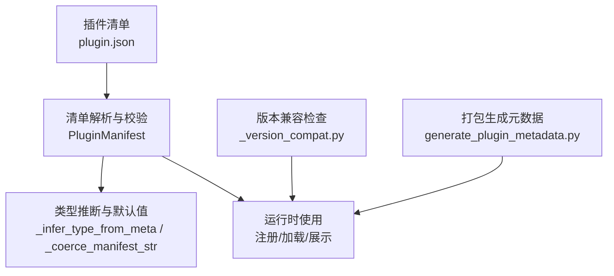
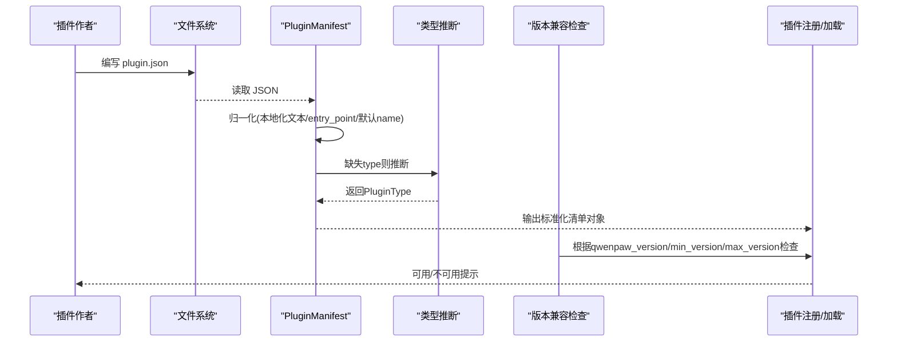
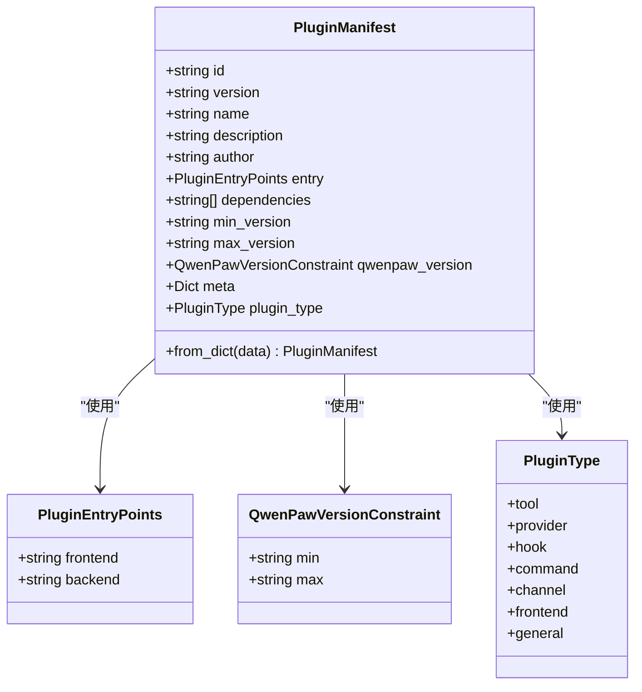
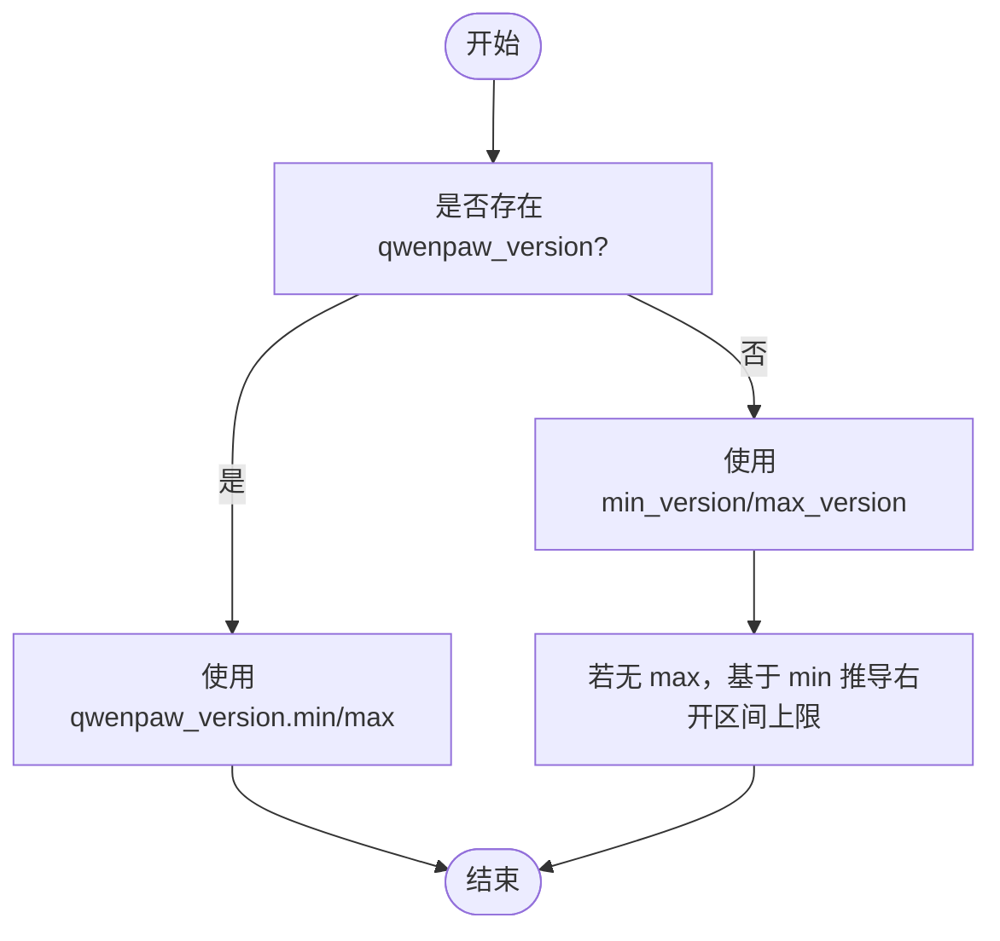
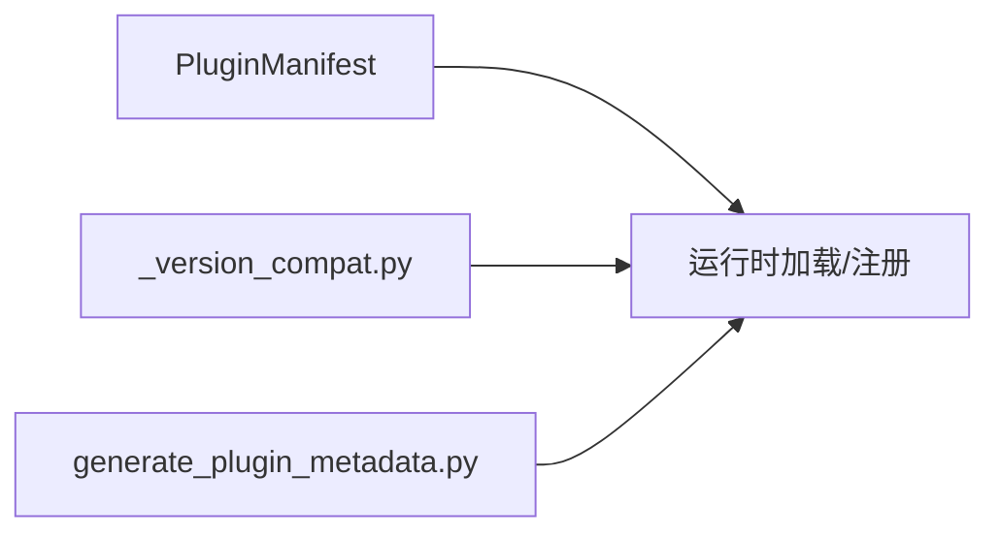

# 插件清单定义

<cite>
**本文引用的文件**
- [src/qwenpaw/plugins/architecture.py](file://src/qwenpaw/plugins/architecture.py)
- [plugins/tool/gpt-image2/plugin.json](file://plugins/tool/gpt-image2/plugin.json)
- [plugins/channel/azure_bot/plugin.json](file://plugins/channel/azure_bot/plugin.json)
- [plugins/middleware-demo/thinking-log-middleware/plugin.json](file://plugins/middleware-demo/thinking-log-middleware/plugin.json)
- [plugins/bundle/cloudpaw/plugin.json](file://plugins/bundle/cloudpaw/plugin.json)
- [plugins/bundle/qwenpaw-pet/plugin.json](file://plugins/bundle/qwenpaw-pet/plugin.json)
- [plugins/tool/qwen-image/plugin.json](file://plugins/tool/qwen-image/plugin.json)
- [plugins/tool/wan27/plugin.json](file://plugins/tool/wan27/plugin.json)
- [src/qwenpaw/_version_compat.py](file://src/qwenpaw/_version_compat.py)
- [scripts/pack/generate_plugin_metadata.py](file://scripts/pack/generate_plugin_metadata.py)
</cite>

## 目录
1. [简介](#简介)
2. [项目结构](#项目结构)
3. [核心组件](#核心组件)
4. [架构总览](#架构总览)
5. [详细组件分析](#详细组件分析)
6. [依赖关系分析](#依赖关系分析)
7. [性能与兼容性考虑](#性能与兼容性考虑)
8. [故障排查指南](#故障排查指南)
9. [结论](#结论)
10. [附录：plugin.json 字段规范与示例](#appendixpluginjson-字段规范与示例)

## 简介
本文件面向 QwenPaw 插件开发者与维护者，系统化阐述“插件清单”（plugin.json）的完整定义、验证规则与向后兼容策略。重点围绕 PluginManifest 类的设计与作用，解释所有字段的含义、校验约束、国际化文本支持、入口点配置、版本约束语法与元数据格式，并结合仓库中的真实 plugin.json 示例，帮助初学者快速上手，同时为高级用户提供权威参考。

## 项目结构
与插件清单相关的核心代码位于插件架构定义模块；实际清单样例分布于各插件目录中；版本兼容与打包脚本对清单进行规范化处理。

图表来源
- [src/qwenpaw/plugins/architecture.py:114-210](file://src/qwenpaw/plugins/architecture.py#L114-L210)
- [src/qwenpaw/_version_compat.py:50-59](file://src/qwenpaw/_version_compat.py#L50-L59)
- [scripts/pack/generate_plugin_metadata.py:151-220](file://scripts/pack/generate_plugin_metadata.py#L151-L220)

章节来源
- [src/qwenpaw/plugins/architecture.py:114-210](file://src/qwenpaw/plugins/architecture.py#L114-L210)
- [src/qwenpaw/_version_compat.py:50-59](file://src/qwenpaw/_version_compat.py#L50-L59)
- [scripts/pack/generate_plugin_metadata.py:151-220](file://scripts/pack/generate_plugin_metadata.py#L151-L220)

## 核心组件
- PluginType：枚举了插件类型，包括 tool、provider、hook、command、channel、frontend、general。用于明确插件能力边界。
- PluginEntryPoints：描述前端与后端入口点，分别对应 frontend 与 backend 字符串路径。
- QwenPawVersionConstraint：声明 QwenPaw 宿主版本的兼容区间，语义为“大于等于 min，小于 max”。当未提供 max 时，系统会基于 min 推导一个右开区间上限。
- PluginManifest：清单的核心模型，负责解析、校验、归一化与类型推断，并对外暴露 from_dict 以兼容既有调用方。

要点
- 未知顶层字段会被忽略，允许扩展显示或打包相关字段而不破坏校验。
- name/description/author 既可以是字符串，也可以是包含 zh-CN/en-US 等键的映射；解析时会优先选择非空本地化值，并以英文优先顺序回退。
- 若未显式设置 type，将根据 meta 与 entry 自动推断主要类型，保证旧清单仍可加载。
- 支持遗留字段 entry_point，会自动合并到 entry.backend。

章节来源
- [src/qwenpaw/plugins/architecture.py:12-48](file://src/qwenpaw/plugins/architecture.py#L12-L48)
- [src/qwenpaw/plugins/architecture.py:100-112](file://src/qwenpaw/plugins/architecture.py#L100-L112)
- [src/qwenpaw/plugins/architecture.py:114-210](file://src/qwenpaw/plugins/architecture.py#L114-L210)

## 架构总览
下图展示了从 plugin.json 到运行时的关键流程：解析、校验、归一化、类型推断、版本约束检查与最终注册。

图表来源
- [src/qwenpaw/plugins/architecture.py:114-210](file://src/qwenpaw/plugins/architecture.py#L114-L210)
- [src/qwenpaw/_version_compat.py:50-59](file://src/qwenpaw/_version_compat.py#L50-L59)

## 详细组件分析

### PluginManifest 类设计
- 字段与默认值
  - id：必填，长度至少为 1。
  - version：必填，长度至少为 1。
  - name：可选，默认空串；若为空则回退为 id。
  - description：可选，默认空串。
  - author：可选，默认空串。
  - entry：可选，默认空对象；支持 legacy entry_point 合并至 backend。
  - dependencies：可选，默认空列表。
  - min_version：可选，默认 "0.1.0"。
  - max_version：可选，无默认。
  - qwenpaw_version：可选，QwenPaw 版本约束对象。
  - meta：可选，任意键值对，供插件自定义元数据。
  - plugin_type：由 type 指定或从 meta/entry 推断，默认 general。
- 验证与归一化
  - 本地化文本归一化：name/description/author 支持映射形式，按 en-US → en → zh-CN → zh 的顺序取首个非空值。
  - 遗留字段兼容：将 top-level entry_point 合并到 entry.backend。
  - 类型推断：当 type 缺失或无效时，依据 meta 与 entry 推断最佳匹配类型。
  - 未知字段忽略：允许扩展字段存在但不影响校验。

图表来源
- [src/qwenpaw/plugins/architecture.py:12-48](file://src/qwenpaw/plugins/architecture.py#L12-L48)
- [src/qwenpaw/plugins/architecture.py:100-112](file://src/qwenpaw/plugins/architecture.py#L100-L112)
- [src/qwenpaw/plugins/architecture.py:114-210](file://src/qwenpaw/plugins/architecture.py#L114-L210)

章节来源
- [src/qwenpaw/plugins/architecture.py:114-210](file://src/qwenpaw/plugins/architecture.py#L114-L210)

### 国际化文本支持（zh-CN、en-US 映射）
- 支持在 name/description/author 中使用映射形式，例如 {"zh-CN": "...", "en-US": "..."}。
- 解析器会优先选择英文键（en-US 或 en），再回退中文键（zh-CN 或 zh），最后取空串。
- 该机制确保 UI 能稳定获取可读文本，同时保留多语言源。

章节来源
- [src/qwenpaw/plugins/architecture.py:50-66](file://src/qwenpaw/plugins/architecture.py#L50-L66)

### 入口点配置（frontend/backend）
- entry.frontend：前端 JS 包路径，供 UI 动态加载。
- entry.backend：后端主模块路径，供运行时加载。
- 兼容 legacy entry_point：若存在且 entry.backend 未设置，则将其赋值给 entry.backend。

章节来源
- [src/qwenpaw/plugins/architecture.py:41-48](file://src/qwenpaw/plugins/architecture.py#L41-L48)
- [src/qwenpaw/plugins/architecture.py:171-178](file://src/qwenpaw/plugins/architecture.py#L171-L178)

### 版本约束语法与兼容性
- qwenpaw_version：推荐方式，包含 min 与可选 max，语义为“>=min, <max”。
- 当仅声明 min_version/max_version 时，打包脚本会合成 qwenpaw_version 以供 CDN 元数据使用。
- 运行时版本检查会优先使用 qwenpaw_version；若缺失，则回退到 min_version/max_version 并基于 min 推导右开区间上限。

图表来源
- [src/qwenpaw/_version_compat.py:50-59](file://src/qwenpaw/_version_compat.py#L50-L59)
- [scripts/pack/generate_plugin_metadata.py:151-220](file://scripts/pack/generate_plugin_metadata.py#L151-L220)

章节来源
- [src/qwenpaw/_version_compat.py:50-59](file://src/qwenpaw/_version_compat.py#L50-L59)
- [scripts/pack/generate_plugin_metadata.py:151-220](file://scripts/pack/generate_plugin_metadata.py#L151-L220)

### 元数据格式（meta）
- meta 为任意字典，供插件自描述。常见用途：
  - 工具插件：tools 数组，描述工具名、图标、是否需要配置及配置项等。
  - 频道插件：channel 标识等。
  - 通用插件：category、features、desktop_url 等自定义键。
- 系统在构建内置工具列表时，兼容两种历史形态：
  - 旧格式：meta.tool_name（单工具）。
  - 新格式：meta.tools（多工具数组）。

章节来源
- [src/qwenpaw/config/config.py:1855-1883](file://src/qwenpaw/config/config.py#L1855-L1883)

### 类型推断机制
- 当 type 缺失或无效时，系统根据 meta 与 entry 推断：
  - 若 meta 包含 tools 或 tool_name → tool
  - 若 meta 包含 chat_model 或 provider_id → provider
  - 若 meta 包含 hook_type → hook
  - 若 meta 包含 command_name 或 commands → command
  - 若 meta 包含 channel → channel
  - 若 entry.frontend 存在 → frontend
  - 否则 → general

章节来源
- [src/qwenpaw/plugins/architecture.py:68-98](file://src/qwenpaw/plugins/architecture.py#L68-L98)

## 依赖关系分析
- 清单解析与校验：由 PluginManifest 统一完成，屏蔽外部差异，向上层提供一致对象。
- 版本兼容：运行时通过 _version_compat 检查宿主版本是否满足插件要求。
- 打包元数据：pack 脚本将 min_version/max_version 转换为 qwenpaw_version，便于分发平台消费。

图表来源
- [src/qwenpaw/plugins/architecture.py:114-210](file://src/qwenpaw/plugins/architecture.py#L114-L210)
- [src/qwenpaw/_version_compat.py:50-59](file://src/qwenpaw/_version_compat.py#L50-L59)
- [scripts/pack/generate_plugin_metadata.py:151-220](file://scripts/pack/generate_plugin_metadata.py#L151-L220)

章节来源
- [src/qwenpaw/plugins/architecture.py:114-210](file://src/qwenpaw/plugins/architecture.py#L114-L210)
- [src/qwenpaw/_version_compat.py:50-59](file://src/qwenpaw/_version_compat.py#L50-L59)
- [scripts/pack/generate_plugin_metadata.py:151-220](file://scripts/pack/generate_plugin_metadata.py#L151-L220)

## 性能与兼容性考虑
- 解析开销：清单体积通常很小，解析与校验成本可忽略不计。
- 类型推断：仅在 type 缺失时触发，避免不必要的计算。
- 兼容策略：对旧字段与旧元数据格式提供平滑迁移，降低升级成本。
- 版本约束：建议始终使用 qwenpaw_version 明确兼容范围，减少运行时判断分支。

[本节为通用指导，不直接分析具体文件]

## 故障排查指南
- 清单校验失败
  - 检查必填字段 id、version 是否为非空字符串。
  - 确认 type 值是否在合法枚举内；如缺失，请补充或在 meta 中提供足够信息以便推断。
  - 若使用 legacy entry_point，确保其指向有效的后端入口。
- 版本不兼容
  - 核对 qwenpaw_version 的 min/max 是否与宿主版本匹配。
  - 若仅使用 min_version/max_version，确认打包脚本已正确合成 qwenpaw_version。
- 国际化文本未生效
  - 确认 name/description/author 使用了正确的键（en-US/en/zh-CN/zh），并确保目标语言键存在且非空。
- 工具未出现在内置工具列表
  - 检查 meta.tools 是否正确声明，或旧版 meta.tool_name 是否存在。

章节来源
- [src/qwenpaw/plugins/architecture.py:114-210](file://src/qwenpaw/plugins/architecture.py#L114-L210)
- [src/qwenpaw/_version_compat.py:50-59](file://src/qwenpaw/_version_compat.py#L50-L59)
- [scripts/pack/generate_plugin_metadata.py:151-220](file://scripts/pack/generate_plugin_metadata.py#L151-L220)
- [src/qwenpaw/config/config.py:1855-1883](file://src/qwenpaw/config/config.py#L1855-L1883)

## 结论
PluginManifest 提供了统一的清单解析与校验能力，结合类型推断与本地化文本归一化，显著降低了插件开发者的维护成本。通过 qwenpaw_version 与 min_version/max_version 的双轨兼容，以及 pack 脚本的元数据合成，插件生态在不同宿主版本间具备良好稳定性。建议开发者遵循最新规范，逐步迁移至 qwenpaw_version 与 meta.tools 的新格式。

[本节为总结性内容，不直接分析具体文件]

## 附录：plugin.json 字段规范与示例

### 字段说明
- id：插件唯一标识，必填，非空字符串。
- version：插件自身版本号，必填，非空字符串。
- name：插件名称，可选；可为字符串或本地化映射。
- description：插件描述，可选；可为字符串或本地化映射。
- author：作者信息，可选；可为字符串或本地化映射。
- entry：入口点对象，可选；包含 frontend 与 backend 两个可选字符串路径。
- dependencies：依赖声明，可选；字符串列表。
- min_version：最低宿主版本，可选；字符串。
- max_version：最高宿主版本（不含），可选；字符串。
- qwenpaw_version：宿主版本约束对象，可选；包含 min 与可选 max。
- meta：自定义元数据，可选；任意字典。
- plugin_type：插件类型，可选；由 type 指定或由系统推断。

### 示例清单（来自仓库）
- 工具插件（图像生成）
  - 路径：[plugins/tool/gpt-image2/plugin.json](file://plugins/tool/gpt-image2/plugin.json)
  - 特点：声明 type=tool，entry.backend，dependencies，qwenpaw_version，meta.tools 含多个工具及其配置项。
- 工具插件（阿里云图像）
  - 路径：[plugins/tool/qwen-image/plugin.json](file://plugins/tool/qwen-image/plugin.json)
  - 特点：meta.tools 包含 select 类型的 model 选项与 endpoint、timeout 等配置。
- 工具插件（视频生成）
  - 路径：[plugins/tool/wan27/plugin.json](file://plugins/tool/wan27/plugin.json)
  - 特点：meta.tools 包含多种视频生成模式，配置项含较大 timeout 范围。
- 频道插件（Azure Bot）
  - 路径：[plugins/channel/azure_bot/plugin.json](file://plugins/channel/azure_bot/plugin.json)
  - 特点：type=channel，entry.backend，dependencies 包含网络与认证库。
- 通用插件（CloudPaw）
  - 路径：[plugins/bundle/cloudpaw/plugin.json](file://plugins/bundle/cloudpaw/plugin.json)
  - 特点：同时声明 frontend 与 backend 入口，meta 包含 category 与 features。
- 桌面宠物插件
  - 路径：[plugins/bundle/qwenpaw-pet/plugin.json](file://plugins/bundle/qwenpaw-pet/plugin.json)
  - 特点：同时声明 frontend 与 backend 入口，meta.desktop_url 指向桌面端服务。
- 中间件演示（通用）
  - 路径：[plugins/middleware-demo/thinking-log-middleware/plugin.json](file://plugins/middleware-demo/thinking-log-middleware/plugin.json)
  - 特点：type=general，entry.backend，meta 为空。

章节来源
- [plugins/tool/gpt-image2/plugin.json:1-96](file://plugins/tool/gpt-image2/plugin.json#L1-L96)
- [plugins/tool/qwen-image/plugin.json:1-136](file://plugins/tool/qwen-image/plugin.json#L1-L136)
- [plugins/tool/wan27/plugin.json:1-129](file://plugins/tool/wan27/plugin.json#L1-L129)
- [plugins/channel/azure_bot/plugin.json:1-25](file://plugins/channel/azure_bot/plugin.json#L1-L25)
- [plugins/bundle/cloudpaw/plugin.json:1-32](file://plugins/bundle/cloudpaw/plugin.json#L1-L32)
- [plugins/bundle/qwenpaw-pet/plugin.json:1-31](file://plugins/bundle/qwenpaw-pet/plugin.json#L1-L31)
- [plugins/middleware-demo/thinking-log-middleware/plugin.json:1-18](file://plugins/middleware-demo/thinking-log-middleware/plugin.json#L1-L18)