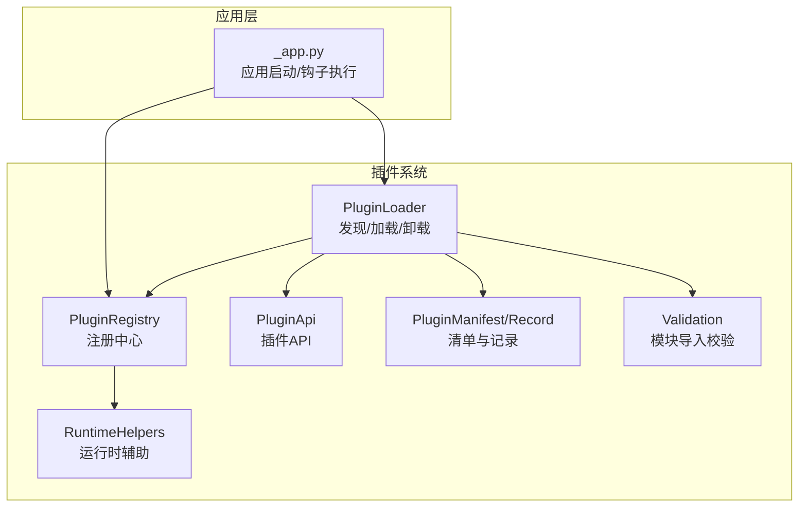
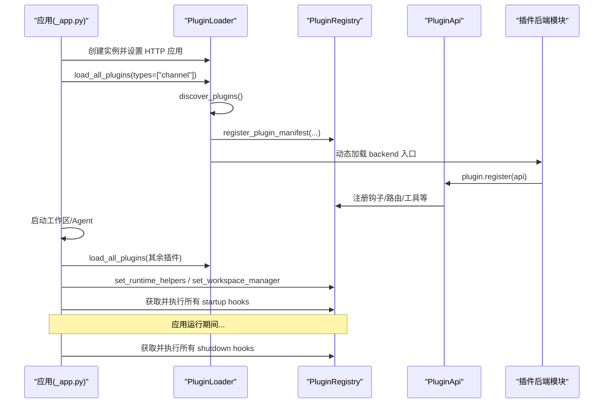
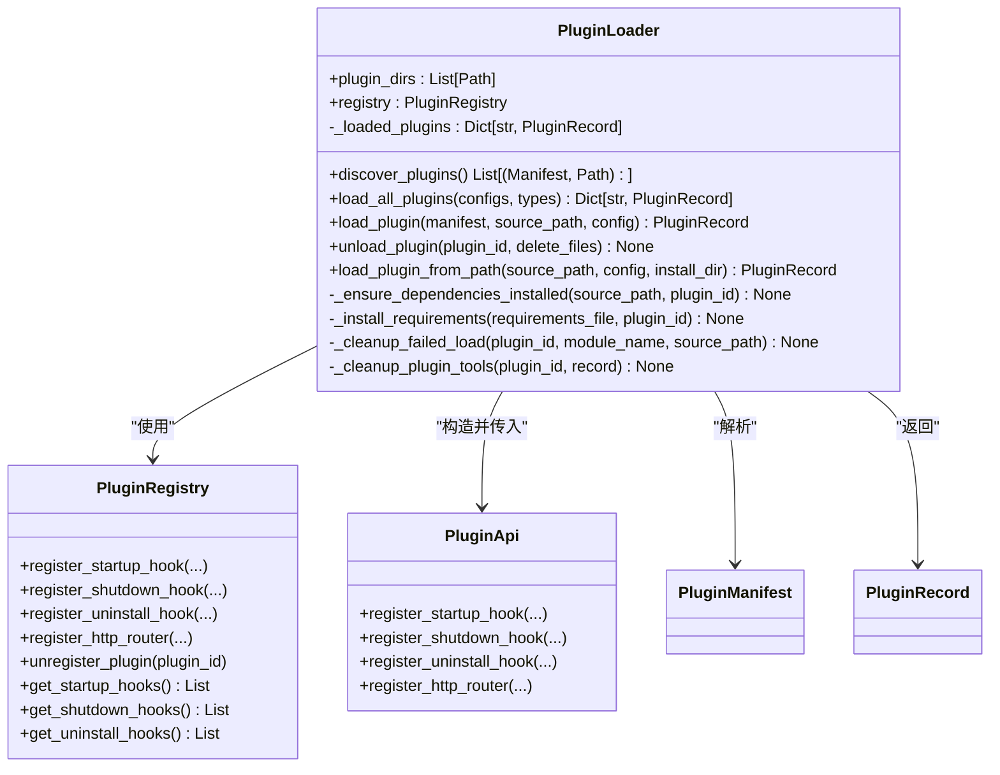
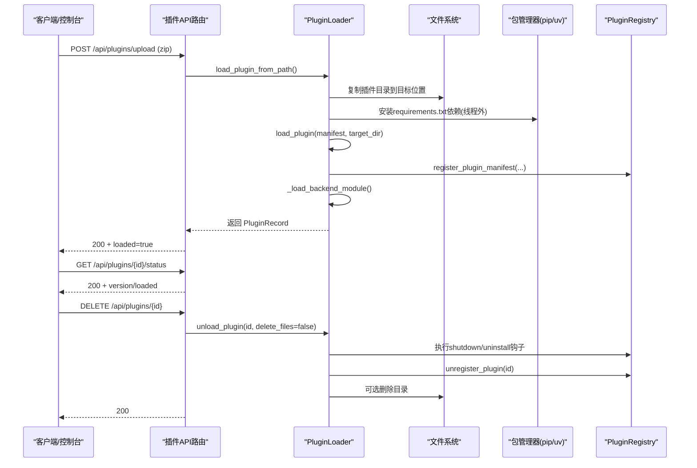
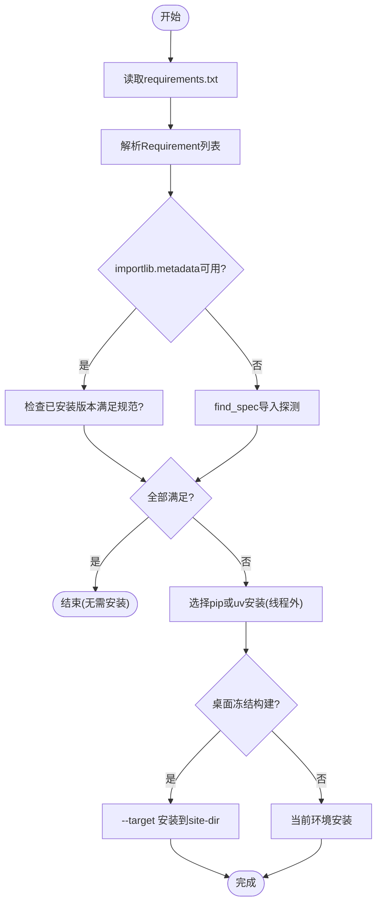
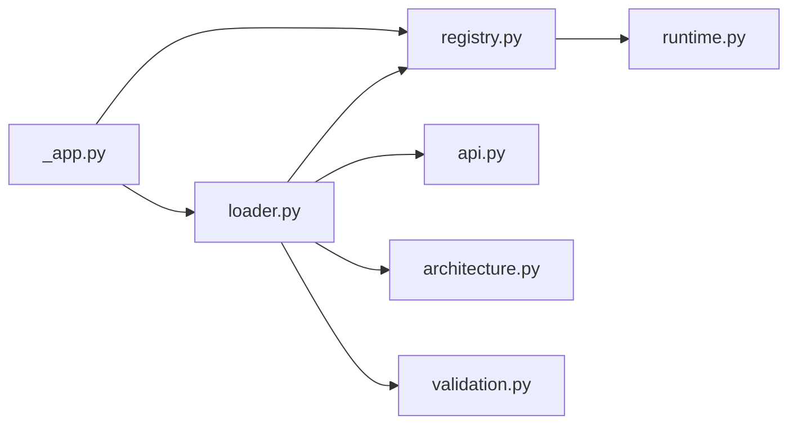

# 插件生命周期管理

<cite>
**本文引用的文件**   
- [loader.py](file://src/qwenpaw/plugins/loader.py)
- [registry.py](file://src/qwenpaw/plugins/registry.py)
- [architecture.py](file://src/qwenpaw/plugins/architecture.py)
- [api.py](file://src/qwenpaw/plugins/api.py)
- [runtime.py](file://src/qwenpaw/plugins/runtime.py)
- [validation.py](file://src/qwenpaw/plugins/validation.py)
- [_app.py](file://src/qwenpaw/app/_app.py)
- [test_plugins.py](file://tests/integration/test_plugins.py)
- [test_plugin_types.py](file://tests/integration/test_plugin_types.py)
</cite>

## 目录
1. [简介](#简介)
2. [项目结构](#项目结构)
3. [核心组件](#核心组件)
4. [架构总览](#架构总览)
5. [详细组件分析](#详细组件分析)
6. [依赖关系分析](#依赖关系分析)
7. [性能与资源管理](#性能与资源管理)
8. [故障排查指南](#故障排查指南)
9. [结论](#结论)
10. [附录：开发示例与最佳实践](#附录开发示例与最佳实践)

## 简介
本文件系统性阐述 QwenPaw 插件从安装到卸载的完整生命周期，覆盖插件发现、验证、加载、初始化、运行与清理各阶段；深入解析 PluginLoader 的实现细节（目录扫描、manifest 解析、依赖检查与错误处理）；说明启动钩子与关闭钩子的执行时机；给出来自实际代码库的示例路径，帮助开发者理解回调函数在不同阶段的实现方式；并总结资源管理、内存隔离、异常恢复机制、热更新与回滚策略，以及调试与诊断工具的使用方法。

## 项目结构
QwenPaw 插件系统位于 src/qwenpaw/plugins 下，核心由以下模块组成：
- loader.py：插件发现、依赖安装、动态加载、卸载与清理
- registry.py：插件注册中心（提供者、路由、钩子、中间件、频道等）
- architecture.py：插件清单模型与记录结构
- api.py：插件对外暴露的 API（注册钩子、HTTP 路由、工具等）
- runtime.py：运行时辅助能力（日志、Provider 访问等）
- validation.py：模块导入校验（用于 CLI 校验与安装前验证）

图表来源
- [loader.py:119-172](file://src/qwenpaw/plugins/loader.py#L119-L172)
- [registry.py:129-169](file://src/qwenpaw/plugins/registry.py#L129-L169)
- [architecture.py:114-221](file://src/qwenpaw/plugins/architecture.py#L114-L221)
- [api.py:250-346](file://src/qwenpaw/plugins/api.py#L250-L346)
- [runtime.py:10-68](file://src/qwenpaw/plugins/runtime.py#L10-L68)
- [validation.py:15-78](file://src/qwenpaw/plugins/validation.py#L15-L78)
- [_app.py:513-550](file://src/qwenpaw/app/_app.py#L513-L550)

章节来源
- [loader.py:119-172](file://src/qwenpaw/plugins/loader.py#L119-L172)
- [registry.py:129-169](file://src/qwenpaw/plugins/registry.py#L129-L169)
- [architecture.py:114-221](file://src/qwenpaw/plugins/architecture.py#L114-L221)
- [api.py:250-346](file://src/qwenpaw/plugins/api.py#L250-L346)
- [runtime.py:10-68](file://src/qwenpaw/plugins/runtime.py#L10-L68)
- [validation.py:15-78](file://src/qwenpaw/plugins/validation.py#L15-L78)
- [_app.py:513-550](file://src/qwenpaw/app/_app.py#L513-L550)

## 核心组件
- PluginLoader
  - 负责插件目录扫描、manifest 解析、版本兼容性检查、依赖安装、动态模块加载、注册与卸载清理。
  - 关键方法：discover_plugins、load_all_plugins、load_plugin、unload_plugin、load_plugin_from_path。
- PluginRegistry
  - 单例注册中心，维护 Provider、Hook、HTTP Router、Channel、PromptSection、Middleware 等注册项。
  - 提供按优先级排序的钩子管理与卸载时批量清理。
- PluginApi
  - 插件侧入口对象，提供 register_* 系列方法（如注册启动/关闭/卸载钩子、HTTP 路由、工具等）。
- PluginManifest / PluginRecord
  - Manifest 描述插件元数据与入口点；Record 表示已加载插件的运行期快照。
- RuntimeHelpers
  - 为插件提供日志、Provider 查询等运行时能力。
- Validation
  - 在 CLI 或安装流程中模拟真实加载语义进行模块导入校验。

章节来源
- [loader.py:119-172](file://src/qwenpaw/plugins/loader.py#L119-L172)
- [registry.py:129-169](file://src/qwenpaw/plugins/registry.py#L129-L169)
- [api.py:250-346](file://src/qwenpaw/plugins/api.py#L250-L346)
- [architecture.py:114-221](file://src/qwenpaw/plugins/architecture.py#L114-L221)
- [runtime.py:10-68](file://src/qwenpaw/plugins/runtime.py#L10-L68)
- [validation.py:15-78](file://src/qwenpaw/plugins/validation.py#L15-L78)

## 架构总览
下图展示应用启动时插件系统的装配顺序与钩子执行时序。

图表来源
- [_app.py:513-550](file://src/qwenpaw/app/_app.py#L513-L550)
- [_app.py:688-717](file://src/qwenpaw/app/_app.py#L688-L717)
- [loader.py:609-639](file://src/qwenpaw/plugins/loader.py#L609-L639)
- [loader.py:514-607](file://src/qwenpaw/plugins/loader.py#L514-L607)
- [registry.py:471-544](file://src/qwenpaw/plugins/registry.py#L471-L544)

## 详细组件分析

### PluginLoader 类详解
- 插件发现
  - 遍历配置的插件目录，跳过隐藏或 .disabled 后缀目录，读取每个子目录下的 plugin.json，解析为 PluginManifest。
- 版本兼容性与类型推断
  - 使用 qwenpaw_version 约束（>=min, <max），缺失时回退至 min_version/max_version；type 缺失时根据 meta 与 entry 推断。
- 依赖检查与安装
  - 基于 requirements.txt 解析 Requirement，结合 importlib.metadata 与 find_spec 双重探测是否满足；未满足则通过 pip 或 uv 安装；桌面冻结构建使用独立 Python 安装到用户可写 site-dir。
- 动态加载与注册
  - 以唯一模块名加载后端入口，要求导出 plugin 对象并实现 register(api)；将 manifest 信息注入 PluginApi 并注册到 Registry。
- 卸载与清理
  - 执行该插件的 shutdown/uninstall 钩子；清理 sys.modules 与 sys.path；从 Registry 移除所有条目；清理 agents.tools 中的工具引用；可选删除磁盘文件。

图表来源
- [loader.py:119-172](file://src/qwenpaw/plugins/loader.py#L119-L172)
- [loader.py:514-607](file://src/qwenpaw/plugins/loader.py#L514-L607)
- [loader.py:975-1096](file://src/qwenpaw/plugins/loader.py#L975-L1096)
- [loader.py:894-973](file://src/qwenpaw/plugins/loader.py#L894-L973)
- [registry.py:129-169](file://src/qwenpaw/plugins/registry.py#L129-L169)
- [api.py:250-346](file://src/qwenpaw/plugins/api.py#L250-L346)
- [architecture.py:114-221](file://src/qwenpaw/plugins/architecture.py#L114-L221)

章节来源
- [loader.py:119-172](file://src/qwenpaw/plugins/loader.py#L119-L172)
- [loader.py:514-607](file://src/qwenpaw/plugins/loader.py#L514-L607)
- [loader.py:975-1096](file://src/qwenpaw/plugins/loader.py#L975-L1096)
- [loader.py:894-973](file://src/qwenpaw/plugins/loader.py#L894-L973)
- [registry.py:129-169](file://src/qwenpaw/plugins/registry.py#L129-L169)
- [api.py:250-346](file://src/qwenpaw/plugins/api.py#L250-L346)
- [architecture.py:114-221](file://src/qwenpaw/plugins/architecture.py#L114-L221)

### 插件清单与记录模型
- PluginManifest
  - 字段包括 id、version、name、description、author、entry、dependencies、qwenpaw_version/min_version/max_version、meta、plugin_type。
  - 支持本地化文本与 legacy 字段兼容；type 缺失时自动推断。
- PluginRecord
  - 保存已加载插件的 manifest、source_path、enabled 状态、instance 引用与诊断信息。

章节来源
- [architecture.py:114-221](file://src/qwenpaw/plugins/architecture.py#L114-L221)

### 插件 API 与钩子注册
- 插件通过 PluginApi 注册：
  - 启动钩子：register_startup_hook
  - 关闭钩子：register_shutdown_hook
  - 卸载钩子：register_uninstall_hook
  - HTTP 路由：register_http_router
  - 其他：工具、频道、控制命令、提示词片段等
- 钩子回调支持同步与异步，按 priority 升序执行。

章节来源
- [api.py:250-346](file://src/qwenpaw/plugins/api.py#L250-L346)
- [registry.py:471-544](file://src/qwenpaw/plugins/registry.py#L471-L544)

### 插件生命周期序列图（安装→运行→卸载）

图表来源
- [loader.py:894-973](file://src/qwenpaw/plugins/loader.py#L894-L973)
- [loader.py:514-607](file://src/qwenpaw/plugins/loader.py#L514-L607)
- [loader.py:975-1096](file://src/qwenpaw/plugins/loader.py#L975-L1096)
- [registry.py:934-992](file://src/qwenpaw/plugins/registry.py#L934-L992)

章节来源
- [loader.py:894-973](file://src/qwenpaw/plugins/loader.py#L894-L973)
- [loader.py:514-607](file://src/qwenpaw/plugins/loader.py#L514-L607)
- [loader.py:975-1096](file://src/qwenpaw/plugins/loader.py#L975-L1096)
- [registry.py:934-992](file://src/qwenpaw/plugins/registry.py#L934-L992)

### 依赖安装流程图

图表来源
- [loader.py:248-304](file://src/qwenpaw/plugins/loader.py#L248-L304)
- [loader.py:721-834](file://src/qwenpaw/plugins/loader.py#L721-L834)
- [loader.py:836-892](file://src/qwenpaw/plugins/loader.py#L836-L892)

章节来源
- [loader.py:248-304](file://src/qwenpaw/plugins/loader.py#L248-L304)
- [loader.py:721-834](file://src/qwenpaw/plugins/loader.py#L721-L834)
- [loader.py:836-892](file://src/qwenpaw/plugins/loader.py#L836-L892)

### 启动与关闭钩子执行时机
- 启动钩子
  - 应用启动后，在插件加载完成后统一执行所有注册的 startup hooks（按优先级）。
- 关闭钩子
  - 应用退出时，统一执行所有 shutdown hooks（按优先级）。
- 卸载钩子
  - 仅在显式卸载/移除插件时触发，适合一次性清理（如撤销 monkey-patch、清理 workspace skills 等）。

章节来源
- [_app.py:688-717](file://src/qwenpaw/app/_app.py#L688-L717)
- [registry.py:471-544](file://src/qwenpaw/plugins/registry.py#L471-L544)
- [registry.py:545-588](file://src/qwenpaw/plugins/registry.py#L545-L588)
- [loader.py:1000-1040](file://src/qwenpaw/plugins/loader.py#L1000-L1040)

### 插件热更新与回滚策略
- 热更新
  - 通过 upload/install 接口安装新版本；若存在同名插件且未传 force，返回冲突；传 force=true 会先卸载旧版本再安装新版本，随后重新加载并触发新插件的 startup hooks。
- 回滚
  - 可通过再次上传旧版本并传 force=true 实现回滚；也可直接删除插件（DELETE）以完全移除。
- 并发安全
  - 依赖安装使用进程级锁，避免多进程同时安装同一插件导致重复安装与内存耗尽。

章节来源
- [test_plugins.py:562-611](file://tests/integration/test_plugins.py#L562-L611)
- [loader.py:306-334](file://src/qwenpaw/plugins/loader.py#L306-L334)
- [loader.py:894-973](file://src/qwenpaw/plugins/loader.py#L894-L973)

### 插件调试与诊断工具
- 模块导入校验
  - 使用 validation.validate_plugin_module 模拟真实加载语义，确保相对导入、sys.modules 注册与清理一致。
- 日志与诊断
  - RuntimeHelpers 提供 log_info/log_error/log_debug；加载过程有详细日志输出；失败加载会清理残留状态。
- 集成测试用例
  - 通过标记文件验证 hook 是否真正触发（startup/shutdown/uninstall），便于定位问题。

章节来源
- [validation.py:15-78](file://src/qwenpaw/plugins/validation.py#L15-L78)
- [runtime.py:44-68](file://src/qwenpaw/plugins/runtime.py#L44-L68)
- [loader.py:460-513](file://src/qwenpaw/plugins/loader.py#L460-L513)
- [test_plugin_types.py:91-130](file://tests/integration/test_plugin_types.py#L91-L130)
- [test_plugin_types.py:613-645](file://tests/integration/test_plugin_types.py#L613-L645)
- [test_plugin_types.py:650-667](file://tests/integration/test_plugin_types.py#L650-L667)

## 依赖关系分析
- 组件耦合
  - PluginLoader 强依赖 PluginRegistry 与 PluginApi；对文件系统与包管理器有外部依赖。
  - PluginRegistry 作为单例被多处共享，需保证线程安全的读操作与有序清理。
- 外部依赖
  - pip/uv 用于依赖安装；桌面冻结构建使用独立 Python 二进制。
- 潜在循环依赖
  - 无直接循环；但需注意插件代码不应反向依赖宿主内部不稳定接口。

图表来源
- [loader.py:119-172](file://src/qwenpaw/plugins/loader.py#L119-L172)
- [registry.py:129-169](file://src/qwenpaw/plugins/registry.py#L129-L169)
- [api.py:250-346](file://src/qwenpaw/plugins/api.py#L250-L346)
- [architecture.py:114-221](file://src/qwenpaw/plugins/architecture.py#L114-L221)
- [validation.py:15-78](file://src/qwenpaw/plugins/validation.py#L15-L78)
- [runtime.py:10-68](file://src/qwenpaw/plugins/runtime.py#L10-L68)
- [_app.py:513-550](file://src/qwenpaw/app/_app.py#L513-L550)

章节来源
- [loader.py:119-172](file://src/qwenpaw/plugins/loader.py#L119-L172)
- [registry.py:129-169](file://src/qwenpaw/plugins/registry.py#L129-L169)
- [api.py:250-346](file://src/qwenpaw/plugins/api.py#L250-L346)
- [architecture.py:114-221](file://src/qwenpaw/plugins/architecture.py#L114-L221)
- [validation.py:15-78](file://src/qwenpaw/plugins/validation.py#L15-L78)
- [runtime.py:10-68](file://src/qwenpaw/plugins/runtime.py#L10-L68)
- [_app.py:513-550](file://src/qwenpaw/app/_app.py#L513-L550)

## 性能与资源管理
- 依赖安装非阻塞
  - 通过 asyncio.to_thread 将 pip/uv 安装放入线程池，避免阻塞事件循环。
- 并发安装保护
  - 使用 per-plugin 进程级锁，避免重复安装导致的内存风暴。
- 冻结构建优化
  - 桌面端使用独立 Python 安装到 site-dir，并通过 sys.path/site 注入，避免误用冻结后端二进制。
- 内存隔离与清理
  - 卸载时清理 sys.modules 与 sys.path，防止模块缓存污染；清理 agents.tools 属性与 __all__，避免引用泄漏。

章节来源
- [loader.py:270-304](file://src/qwenpaw/plugins/loader.py#L270-L304)
- [loader.py:306-334](file://src/qwenpaw/plugins/loader.py#L306-L334)
- [loader.py:836-892](file://src/qwenpaw/plugins/loader.py#L836-L892)
- [loader.py:1042-1096](file://src/qwenpaw/plugins/loader.py#L1042-L1096)

## 故障排查指南
- 常见问题
  - 插件未找到入口：检查 plugin.json 的 entry.backend/entry.frontend 是否存在。
  - 依赖安装失败：查看日志中 pip/uv 输出；确认网络与镜像源；必要时手动安装。
  - 版本不兼容：核对 qwenpaw_version 约束或 min/max_version。
  - 热更新冲突：上传同版本未带 force 会返回 409，需加 force=true。
- 诊断步骤
  - 使用 validation.validate_plugin_module 快速验证模块导入。
  - 检查插件日志（RuntimeHelpers.log_*）与加载日志。
  - 通过集成测试用例模式，写入标记文件验证 hook 是否触发。

章节来源
- [loader.py:336-374](file://src/qwenpaw/plugins/loader.py#L336-L374)
- [loader.py:721-834](file://src/qwenpaw/plugins/loader.py#L721-L834)
- [loader.py:836-892](file://src/qwenpaw/plugins/loader.py#L836-L892)
- [validation.py:15-78](file://src/qwenpaw/plugins/validation.py#L15-L78)
- [test_plugins.py:562-611](file://tests/integration/test_plugins.py#L562-L611)
- [test_plugin_types.py:613-645](file://tests/integration/test_plugin_types.py#L613-L645)

## 结论
QwenPaw 插件系统提供了完善的生命周期管理能力：从发现、验证、依赖安装、动态加载到运行与清理，均具备健壮的错误处理与资源回收机制。通过统一的注册中心与 API，插件可以灵活扩展系统能力。热更新与回滚策略保障了在线升级的安全性，而丰富的调试与诊断手段有助于快速定位问题。建议插件开发者遵循清单规范、合理使用钩子与 API，并在依赖管理中明确版本约束，以获得稳定可靠的运行体验。

## 附录：开发示例与最佳实践
- 示例路径（仅列出路径，不含代码内容）
  - 插件注册启动/关闭/卸载钩子：
    - [test_plugin_types.py:91-130](file://tests/integration/test_plugin_types.py#L91-L130)
    - [test_plugin_types.py:613-645](file://tests/integration/test_plugin_types.py#L613-L645)
    - [test_plugin_types.py:650-667](file://tests/integration/test_plugin_types.py#L650-L667)
  - 插件安装/卸载端到端流程：
    - [test_plugins.py:392-441](file://tests/integration/test_plugins.py#L392-L441)
    - [test_plugins.py:505-541](file://tests/integration/test_plugins.py#L505-L541)
    - [test_plugins.py:562-611](file://tests/integration/test_plugins.py#L562-L611)
- 最佳实践
  - 在 plugin.json 中明确 qwenpaw_version 约束与 plugin_type。
  - 使用 register_startup_hook 做轻量初始化，避免阻塞；耗时任务应异步或后台化。
  - 在 register_uninstall_hook 中清理一次性资源（如临时文件、全局补丁）。
  - 依赖尽量声明在 requirements.txt，并使用最小必要版本范围。
  - 使用 RuntimeHelpers 进行结构化日志输出，便于追踪问题。

章节来源
- [test_plugin_types.py:91-130](file://tests/integration/test_plugin_types.py#L91-L130)
- [test_plugin_types.py:613-645](file://tests/integration/test_plugin_types.py#L613-L645)
- [test_plugin_types.py:650-667](file://tests/integration/test_plugin_types.py#L650-L667)
- [test_plugins.py:392-441](file://tests/integration/test_plugins.py#L392-L441)
- [test_plugins.py:505-541](file://tests/integration/test_plugins.py#L505-L541)
- [test_plugins.py:562-611](file://tests/integration/test_plugins.py#L562-L611)