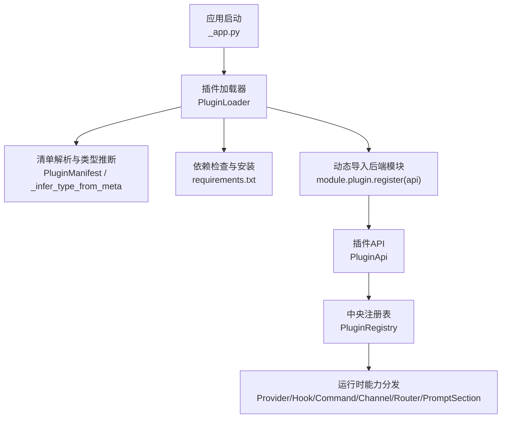
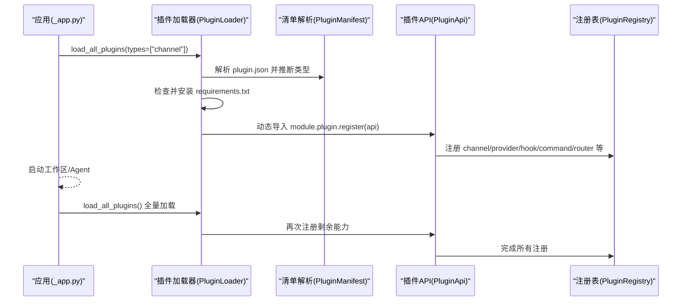
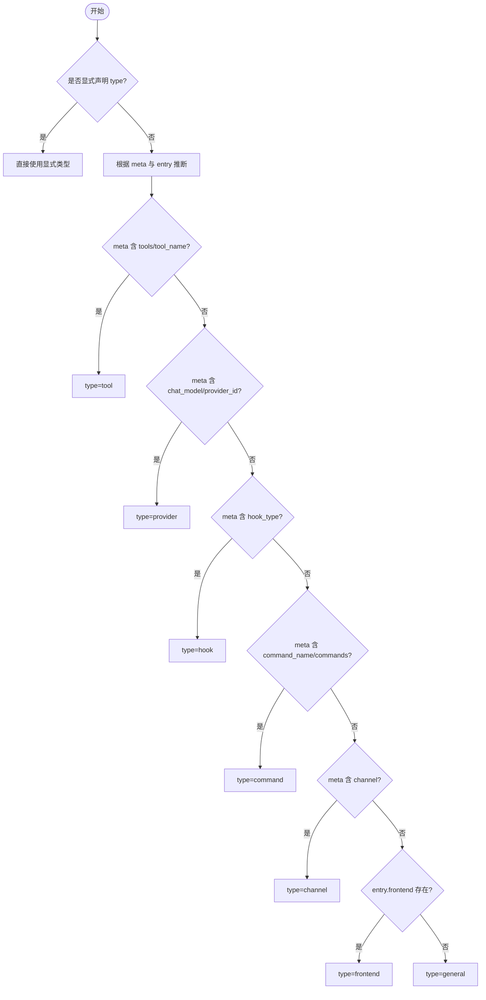
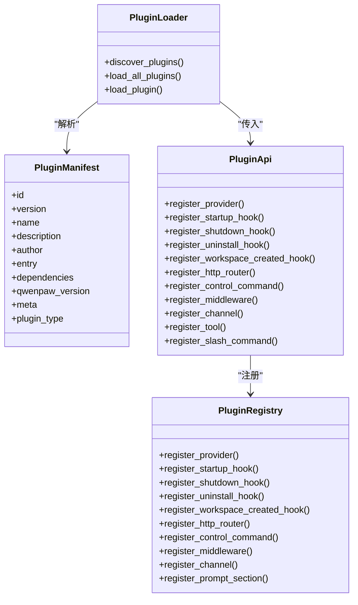

# 插件类型系统

<cite>
**本文引用的文件**   
- [src/qwenpaw/plugins/architecture.py](file://src/qwenpaw/plugins/architecture.py)
- [src/qwenpaw/plugins/registry.py](file://src/qwenpaw/plugins/registry.py)
- [src/qwenpaw/plugins/api.py](file://src/qwenpaw/plugins/api.py)
- [src/qwenpaw/plugins/loader.py](file://src/qwenpaw/plugins/loader.py)
- [src/qwenpaw/app/_app.py](file://src/qwenpaw/app/_app.py)
- [plugins/tool/qwen-image/plugin.json](file://plugins/tool/qwen-image/plugin.json)
- [plugins/channel/azure_bot/plugin.json](file://plugins/channel/azure_bot/plugin.json)
- [plugins/middleware-demo/thinking-log-middleware/plugin.json](file://plugins/middleware-demo/thinking-log-middleware/plugin.json)
- [plugins/middleware-demo/tracing-middleware/plugin.json](file://plugins/middleware-demo/tracing-middleware/plugin.json)
- [tests/integration/test_plugin_types.py](file://tests/integration/test_plugin_types.py)
</cite>

## 目录
1. [简介](#简介)
2. [项目结构](#项目结构)
3. [核心组件](#核心组件)
4. [架构总览](#架构总览)
5. [详细组件分析](#详细组件分析)
6. [依赖关系分析](#依赖关系分析)
7. [性能考量](#性能考量)
8. [故障排查指南](#故障排查指南)
9. [结论](#结论)
10. [附录](#附录)

## 简介
本文件系统性梳理 QwenPaw 的插件类型体系，围绕 PluginType 枚举的七种类型（TOOL、PROVIDER、HOOK、COMMAND、CHANNEL、FRONTEND、GENERAL）展开，说明每种类型的用途、入口点要求、元数据规范与集成方式；解释自动推断机制与向后兼容策略；给出来自仓库的真实示例与最佳实践；并补充类型间的组合使用、扩展机制、安全限制与资源访问权限等设计要点。

## 项目结构
QwenPaw 插件系统由“声明式清单 + 动态加载 + 集中注册”三部分构成：
- 清单定义：plugin.json 描述插件基本信息、入口点、依赖、版本约束与元数据。
- 动态加载：PluginLoader 负责发现、校验、安装依赖、导入模块并调用 register(api)。
- 集中注册：PluginRegistry 作为单例，统一登记 Provider/Hook/Command/Channel/HTTP Router/Prompt Section 等能力；PluginApi 为插件开发者提供注册接口。

图示来源
- [src/qwenpaw/app/_app.py:513-550](file://src/qwenpaw/app/_app.py#L513-L550)
- [src/qwenpaw/plugins/loader.py:119-173](file://src/qwenpaw/plugins/loader.py#L119-L173)
- [src/qwenpaw/plugins/architecture.py:114-190](file://src/qwenpaw/plugins/architecture.py#L114-L190)
- [src/qwenpaw/plugins/api.py:172-204](file://src/qwenpaw/plugins/api.py#L172-L204)
- [src/qwenpaw/plugins/registry.py:129-169](file://src/qwenpaw/plugins/registry.py#L129-L169)

章节来源
- [src/qwenpaw/app/_app.py:513-550](file://src/qwenpaw/app/_app.py#L513-L550)
- [src/qwenpaw/plugins/loader.py:119-173](file://src/qwenpaw/plugins/loader.py#L119-L173)
- [src/qwenpaw/plugins/architecture.py:114-190](file://src/qwenpaw/plugins/architecture.py#L114-L190)
- [src/qwenpaw/plugins/api.py:172-204](file://src/qwenpaw/plugins/api.py#L172-L204)
- [src/qwenpaw/plugins/registry.py:129-169](file://src/qwenpaw/plugins/registry.py#L129-L169)

## 核心组件
- PluginType 枚举：定义七类插件标识，值均为小写字符串，便于 JSON 序列化。
- PluginManifest：对 plugin.json 进行 Pydantic 校验与规范化，支持本地化文本、旧版 entry_point 字段合并，以及 type 缺失时的自动推断。
- PluginEntryPoints：声明前端与后端入口文件路径。
- PluginLoader：扫描插件目录、解析清单、校验兼容性、安装依赖、动态导入并调用 register(api)。
- PluginApi：插件开发者的注册 API，封装对注册表的便捷调用。
- PluginRegistry：单例注册中心，维护 Provider/Hook/Command/Channel/HTTP Router/Prompt Section/Middleware 等注册项，并提供查询与卸载清理。

章节来源
- [src/qwenpaw/plugins/architecture.py:12-98](file://src/qwenpaw/plugins/architecture.py#L12-L98)
- [src/qwenpaw/plugins/architecture.py:114-190](file://src/qwenpaw/plugins/architecture.py#L114-L190)
- [src/qwenpaw/plugins/loader.py:119-173](file://src/qwenpaw/plugins/loader.py#L119-L173)
- [src/qwenpaw/plugins/api.py:172-204](file://src/qwenpaw/plugins/api.py#L172-L204)
- [src/qwenpaw/plugins/registry.py:129-169](file://src/qwenpaw/plugins/registry.py#L129-L169)

## 架构总览
下图展示从应用启动到插件能力生效的关键流程，包括两阶段加载（先 channel，再其余）、类型过滤、依赖安装与注册。

图示来源
- [src/qwenpaw/app/_app.py:513-550](file://src/qwenpaw/app/_app.py#L513-L550)
- [src/qwenpaw/plugins/loader.py:609-639](file://src/qwenpaw/plugins/loader.py#L609-L639)
- [src/qwenpaw/plugins/architecture.py:114-190](file://src/qwenpaw/plugins/architecture.py#L114-L190)
- [src/qwenpaw/plugins/api.py:172-204](file://src/qwenpaw/plugins/api.py#L172-L204)
- [src/qwenpaw/plugins/registry.py:129-169](file://src/qwenpaw/plugins/registry.py#L129-L169)

## 详细组件分析

### 插件类型定义与自动推断
- 类型集合：tool、provider、hook、command、channel、frontend、general。
- 显式声明优先：若 plugin.json 包含 type 字段，直接映射为对应 PluginType。
- 自动推断规则（当 type 缺失或无效时）：
  - meta.tools 或 meta.tool_name → tool
  - meta.chat_model 或 meta.provider_id → provider
  - meta.hook_type → hook
  - meta.command_name 或 meta.commands → command
  - meta.channel → channel
  - entry.frontend 存在 → frontend
  - 否则 → general

图示来源
- [src/qwenpaw/plugins/architecture.py:68-98](file://src/qwenpaw/plugins/architecture.py#L68-L98)
- [src/qwenpaw/plugins/architecture.py:114-190](file://src/qwenpaw/plugins/architecture.py#L114-L190)

章节来源
- [src/qwenpaw/plugins/architecture.py:12-98](file://src/qwenpaw/plugins/architecture.py#L12-L98)
- [src/qwenpaw/plugins/architecture.py:114-190](file://src/qwenpaw/plugins/architecture.py#L114-L190)

### TOOL 插件
- 用途：向 Agent 工具集注册可被 LLM 调用的函数。
- 入口点要求：
  - 后端入口：entry.backend 指向实现 register(api) 的 Python 模块。
  - 推荐通过 api.register_tool(...) 注册，内部会延迟到启动钩子中注入运行时 ToolRegistry 并写入 Agent 配置。
- 元数据规范：
  - plugin.json 的 meta.tools 可声明工具列表（名称、描述、图标、是否需要配置及配置字段），用于 UI 渲染与提示。
- 集成方式：
  - 在 register(api) 中调用 api.register_tool(tool_name, tool_func, description, icon, enabled=False)。
  - 也可在 meta.tools 中声明配置字段，配合 get_tool_config 读取当前 Agent 的配置。
- 示例参考：
  - qwen-image 工具插件清单展示了 meta.tools 的结构与配置字段定义。

章节来源
- [src/qwenpaw/plugins/api.py:614-698](file://src/qwenpaw/plugins/api.py#L614-L698)
- [src/qwenpaw/plugins/api.py:11-46](file://src/qwenpaw/plugins/api.py#L11-L46)
- [plugins/tool/qwen-image/plugin.json:1-136](file://plugins/tool/qwen-image/plugin.json#L1-L136)

### PROVIDER 插件
- 用途：注册自定义 LLM Provider/模型端点，供系统选择与调用。
- 入口点要求：后端入口模块实现 register(api)，并在其中调用 api.register_provider(provider_id, provider_class, label, base_url, **metadata)。
- 元数据规范：
  - metadata 可包含 chat_model、require_api_key、meta 等，会被合并进注册信息。
- 集成方式：
  - 注册后，ProviderManager 会在启动时读取默认模型、持久化配置等。
- 示例参考：
  - 测试用例覆盖 provider 插件的完整生命周期（上传→加载→可见→卸载）。

章节来源
- [src/qwenpaw/plugins/api.py:205-250](file://src/qwenpaw/plugins/api.py#L205-L250)
- [src/qwenpaw/plugins/registry.py:328-386](file://src/qwenpaw/plugins/registry.py#L328-L386)
- [tests/integration/test_plugin_types.py:1-55](file://tests/integration/test_plugin_types.py#L1-L55)

### HOOK 插件
- 用途：在应用启动/关闭、卸载、新建工作区等时机执行回调。
- 入口点要求：后端入口模块实现 register(api)，并通过以下 API 注册：
  - api.register_startup_hook(hook_name, callback, priority)
  - api.register_shutdown_hook(hook_name, callback, priority)
  - api.register_uninstall_hook(hook_name, callback, priority)
  - api.register_workspace_created_hook(hook_name, callback, priority)
- 优先级：数值越小越先执行。
- 示例参考：
  - middleware-demo 中的 tracing 与 thinking-log 插件以 general 类型注册中间件工厂，体现 hook 的使用模式。

章节来源
- [src/qwenpaw/plugins/api.py:251-392](file://src/qwenpaw/plugins/api.py#L251-L392)
- [src/qwenpaw/plugins/registry.py:472-628](file://src/qwenpaw/plugins/registry.py#L472-L628)
- [plugins/middleware-demo/tracing-middleware/plugin.json:1-18](file://plugins/middleware-demo/tracing-middleware/plugin.json#L1-L18)
- [plugins/middleware-demo/thinking-log-middleware/plugin.json:1-18](file://plugins/middleware-demo/thinking-log-middleware/plugin.json#L1-L18)

### COMMAND 插件
- 用途：注册控制命令（如 /slash 命令）或控制命令处理器。
- 入口点要求：后端入口模块实现 register(api)，并通过以下 API 注册：
  - api.register_control_command(handler, priority_level)
  - api.register_slash_command(name, handler, aliases, category, help_text, metadata)
- 集成方式：
  - slash 命令注册会延迟到启动钩子与工作区创建钩子中，确保工作区已就绪。
- 示例参考：
  - 集成测试覆盖了 control command 的注册路径。

章节来源
- [src/qwenpaw/plugins/api.py:425-446](file://src/qwenpaw/plugins/api.py#L425-L446)
- [src/qwenpaw/plugins/api.py:700-756](file://src/qwenpaw/plugins/api.py#L700-L756)
- [tests/integration/test_plugin_types.py:1-55](file://tests/integration/test_plugin_types.py#L1-L55)

### CHANNEL 插件
- 用途：注册自定义消息通道（如 Azure Bot、Slack 等）。
- 入口点要求：后端入口模块实现 register(api)，并通过 api.register_channel(channel_class, label, description, config_fields, icon, doc_url) 注册。
- 元数据规范：
  - channel_class 必须为 BaseChannel 子类且具备 channel 类属性作为唯一键。
  - config_fields 用于前端表单渲染（text/password/number/switch/select 等）。
  - icon/doc_url 可选，用于控制台展示。
- 加载时序：
  - 应用启动第一阶段仅加载 channel 插件，以便在 Agent 启动前可用。
- 示例参考：
  - azure-bot 插件清单明确 type=channel，并声明依赖与入口。

章节来源
- [src/qwenpaw/plugins/api.py:483-570](file://src/qwenpaw/plugins/api.py#L483-L570)
- [src/qwenpaw/plugins/registry.py:749-800](file://src/qwenpaw/plugins/registry.py#L749-L800)
- [src/qwenpaw/app/_app.py:525-530](file://src/qwenpaw/app/_app.py#L525-L530)
- [plugins/channel/azure_bot/plugin.json:1-25](file://plugins/channel/azure_bot/plugin.json#L1-L25)

### FRONTEND 插件
- 用途：提供前端 JS 包，由控制台动态加载。
- 入口点要求：plugin.json 的 entry.frontend 指定前端打包产物路径；若无后端入口，则作为纯前端插件加载。
- 集成方式：
  - 加载器检测到无后端入口时会按前端插件处理。
- 示例参考：
  - 集成测试构造了同时包含后端路由与前端的复合插件。

章节来源
- [src/qwenpaw/plugins/loader.py:575-581](file://src/qwenpaw/plugins/loader.py#L575-L581)
- [tests/integration/test_plugin_types.py:936-977](file://tests/integration/test_plugin_types.py#L936-L977)

### GENERAL 插件
- 用途：兜底类型，适用于不匹配上述具体分类的插件。
- 典型用法：
  - 注册中间件工厂（api.register_middleware(factory, priority)），或通过其他通用能力（如 HTTP 路由、Prompt 片段）扩展系统。
- 示例参考：
  - middleware-demo 的两个插件均声明 type=general，演示中间件注册。

章节来源
- [src/qwenpaw/plugins/architecture.py:37-38](file://src/qwenpaw/plugins/architecture.py#L37-L38)
- [src/qwenpaw/plugins/api.py:448-481](file://src/qwenpaw/plugins/api.py#L448-L481)
- [plugins/middleware-demo/tracing-middleware/plugin.json:1-18](file://plugins/middleware-demo/tracing-middleware/plugin.json#L1-L18)
- [plugins/middleware-demo/thinking-log-middleware/plugin.json:1-18](file://plugins/middleware-demo/thinking-log-middleware/plugin.json#L1-L18)

### 插件类型之间的依赖与组合
- 组合模式：
  - 一个插件可同时具备后端与前端入口，既提供 HTTP 路由又提供前端包（复合插件）。
  - 通过 Hook 机制，插件可在不同生命周期注册多种能力（如启动时注册工具、命令、中间件等）。
- 加载顺序：
  - 第一阶段仅加载 channel 插件，确保后续 Agent 启动时可立即使用通道。
  - 第二阶段加载其余插件，避免重复加载已存在的 channel。
- 示例参考：
  - 集成测试中的复合插件同时注册 HTTP 路由与前端包。

章节来源
- [src/qwenpaw/app/_app.py:525-542](file://src/qwenpaw/app/_app.py#L525-L542)
- [tests/integration/test_plugin_types.py:936-977](file://tests/integration/test_plugin_types.py#L936-L977)

### 扩展机制与自定义类型开发
- 类型扩展：
  - 当前 PluginType 为固定枚举，新增类型需修改枚举与推断逻辑。
  - 对于未归类的扩展能力，建议使用 GENERAL 类型并通过 Hook/HTTP Router/Prompt Section 等方式接入。
- 自定义注册：
  - 通过 PluginApi 提供的注册方法对接 PluginRegistry，遵循命名与优先级约定。
  - 如需自定义 Prompt 片段，可使用 register_prompt_section 并遵守锚点约束。

章节来源
- [src/qwenpaw/plugins/architecture.py:12-38](file://src/qwenpaw/plugins/architecture.py#L12-L38)
- [src/qwenpaw/plugins/registry.py:663-715](file://src/qwenpaw/plugins/registry.py#L663-L715)

### 安全限制与资源访问权限
- 插件依赖隔离：
  - 插件依赖通过 requirements.txt 安装至独立 site 目录，避免污染宿主环境。
  - 冻结桌面构建下，依赖安装走专用 Python 运行时，防止误用宿主解释器。
- 进程级安装锁：
  - 同一插件的安装操作通过文件锁串行化，避免并发安装导致内存耗尽。
- 运行时安全：
  - 工具执行受 ToolGuard 与安全策略保护（沙箱、危险命令检测等），插件不应绕过这些防护。
- 网络与认证：
  - 插件可通过 HTTP 路由暴露能力，但需遵循全局认证与代理信任策略。

章节来源
- [src/qwenpaw/plugins/loader.py:270-334](file://src/qwenpaw/plugins/loader.py#L270-L334)
- [src/qwenpaw/plugins/loader.py:721-800](file://src/qwenpaw/plugins/loader.py#L721-L800)
- [src/qwenpaw/config/config.py:2073-2106](file://src/qwenpaw/config/config.py#L2073-L2106)

## 依赖关系分析
- 组件耦合：
  - PluginLoader 依赖 PluginManifest 与 PluginApi，最终将能力注册到 PluginRegistry。
  - PluginApi 是对 PluginRegistry 的薄封装，保持插件侧 API 稳定。
- 外部依赖：
  - FastAPI 用于 HTTP 路由挂载。
  - importlib.metadata/packaging 用于依赖探测与版本约束。
- 潜在循环：
  - 注册表与 API 之间为单向依赖（API→Registry），无循环引用。

图示来源
- [src/qwenpaw/plugins/architecture.py:114-190](file://src/qwenpaw/plugins/architecture.py#L114-L190)
- [src/qwenpaw/plugins/loader.py:119-173](file://src/qwenpaw/plugins/loader.py#L119-L173)
- [src/qwenpaw/plugins/api.py:172-204](file://src/qwenpaw/plugins/api.py#L172-L204)
- [src/qwenpaw/plugins/registry.py:129-169](file://src/qwenpaw/plugins/registry.py#L129-L169)

章节来源
- [src/qwenpaw/plugins/architecture.py:114-190](file://src/qwenpaw/plugins/architecture.py#L114-L190)
- [src/qwenpaw/plugins/loader.py:119-173](file://src/qwenpaw/plugins/loader.py#L119-L173)
- [src/qwenpaw/plugins/api.py:172-204](file://src/qwenpaw/plugins/api.py#L172-L204)
- [src/qwenpaw/plugins/registry.py:129-169](file://src/qwenpaw/plugins/registry.py#L129-L169)

## 性能考量
- 两阶段加载：先 channel 后其余，减少不必要的初始化开销。
- 依赖安装并行与锁：通过线程池与文件锁避免阻塞事件循环与并发冲突。
- 路由插入优化：插件 HTTP 路由在 SPA 捕获路由之前插入，避免额外匹配成本。
- 懒注册：工具与斜杠命令通过启动钩子延迟注册，确保上下文就绪后再执行。

[本节为通用指导，无需列出具体文件来源]

## 故障排查指南
- 清单校验失败：
  - 检查 plugin.json 必填字段与类型是否正确；注意 name/description/author 可能为本地化对象，会被自动转换为显示字符串。
- 入口点缺失：
  - 确认 entry.backend 或 entry.frontend 指向的文件存在；两者至少有一个。
- 依赖安装失败：
  - 查看 requirements.txt 是否存在与语法是否正确；确认 pip/uv 可用；关注超时与锁定日志。
- 类型推断异常：
  - 若未显式声明 type，请检查 meta 字段是否符合推断规则；必要时显式设置 type。
- 路由冲突：
  - 插件 HTTP 前缀不可重复且不能为根路径；注册失败会抛出 ValueError。
- 卸载清理：
  - 使用 uninstall hook 清理一次性副作用；注册表提供移除特定 hook 的方法。

章节来源
- [src/qwenpaw/plugins/architecture.py:145-190](file://src/qwenpaw/plugins/architecture.py#L145-L190)
- [src/qwenpaw/plugins/loader.py:336-374](file://src/qwenpaw/plugins/loader.py#L336-L374)
- [src/qwenpaw/plugins/loader.py:721-800](file://src/qwenpaw/plugins/loader.py#L721-L800)
- [src/qwenpaw/plugins/registry.py:220-292](file://src/qwenpaw/plugins/registry.py#L220-L292)
- [src/qwenpaw/plugins/registry.py:630-661](file://src/qwenpaw/plugins/registry.py#L630-L661)

## 结论
QwenPaw 的插件类型系统以清晰的枚举与强校验清单为基础，结合动态加载与集中注册，实现了高内聚、低耦合的扩展机制。通过显式 type 与智能推断兼顾新旧生态，两阶段加载与延迟注册保障启动效率与稳定性。GENERAL 类型与丰富的 Hook/Router/Tool/Channel 能力使插件既能专注单一职责，也能灵活组合形成复杂功能。安全与性能方面，依赖隔离、安装锁、路由插入优化与运行时防护共同构建了稳健的扩展底座。

[本节为总结性内容，无需列出具体文件来源]

## 附录
- 关键 API 速查：
  - 注册 Provider：api.register_provider(...)
  - 注册 Hook：api.register_startup_hook()/register_shutdown_hook()/register_uninstall_hook()/register_workspace_created_hook(...)
  - 注册命令：api.register_control_command(...)/register_slash_command(...)
  - 注册通道：api.register_channel(...)
  - 注册工具：api.register_tool(...)
  - 注册中间件：api.register_middleware(...)
  - 注册 HTTP 路由：api.register_http_router(...)
  - 注册 Prompt 片段：registry.register_prompt_section(...)

章节来源
- [src/qwenpaw/plugins/api.py:205-250](file://src/qwenpaw/plugins/api.py#L205-L250)
- [src/qwenpaw/plugins/api.py:251-392](file://src/qwenpaw/plugins/api.py#L251-L392)
- [src/qwenpaw/plugins/api.py:425-446](file://src/qwenpaw/plugins/api.py#L425-L446)
- [src/qwenpaw/plugins/api.py:483-570](file://src/qwenpaw/plugins/api.py#L483-L570)
- [src/qwenpaw/plugins/api.py:614-698](file://src/qwenpaw/plugins/api.py#L614-L698)
- [src/qwenpaw/plugins/api.py:448-481](file://src/qwenpaw/plugins/api.py#L448-L481)
- [src/qwenpaw/plugins/api.py:394-423](file://src/qwenpaw/plugins/api.py#L394-L423)
- [src/qwenpaw/plugins/registry.py:663-715](file://src/qwenpaw/plugins/registry.py#L663-L715)