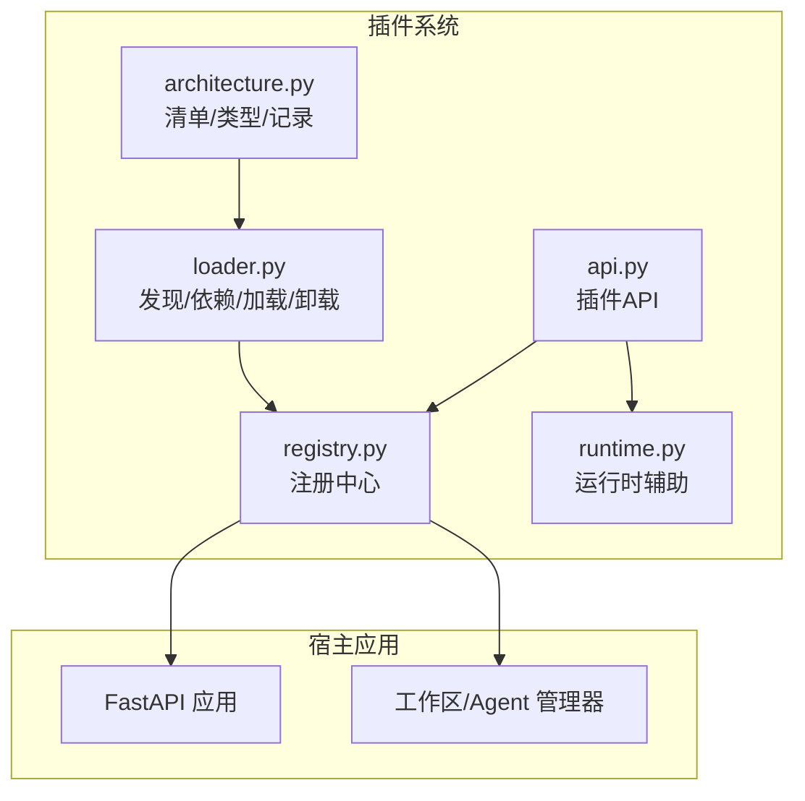
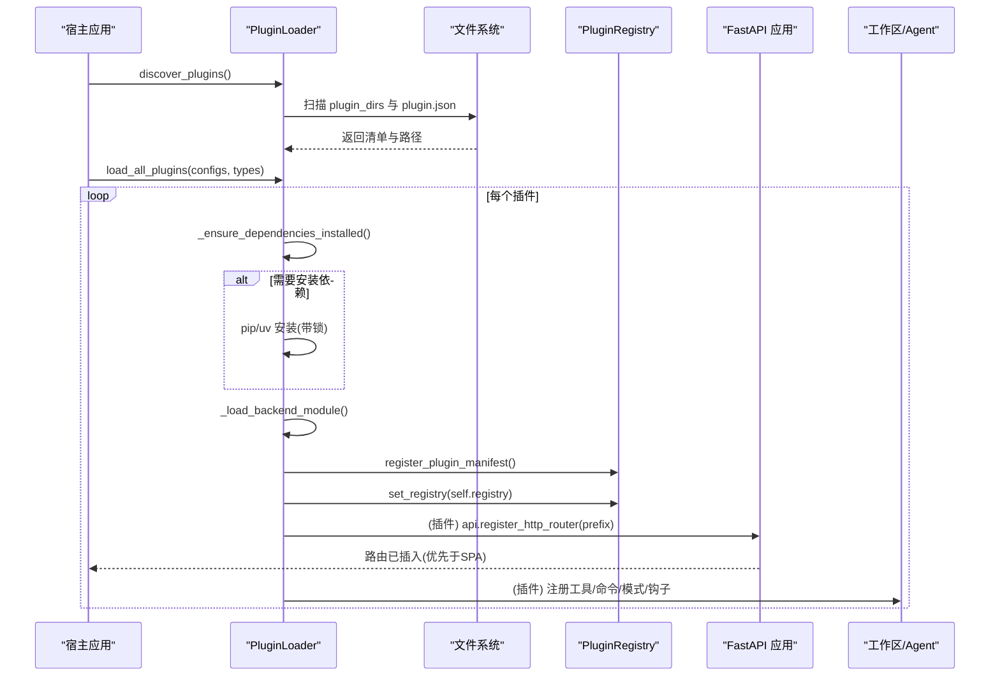
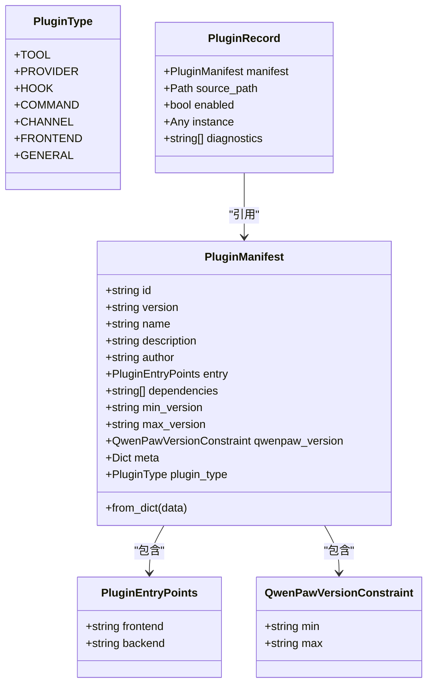
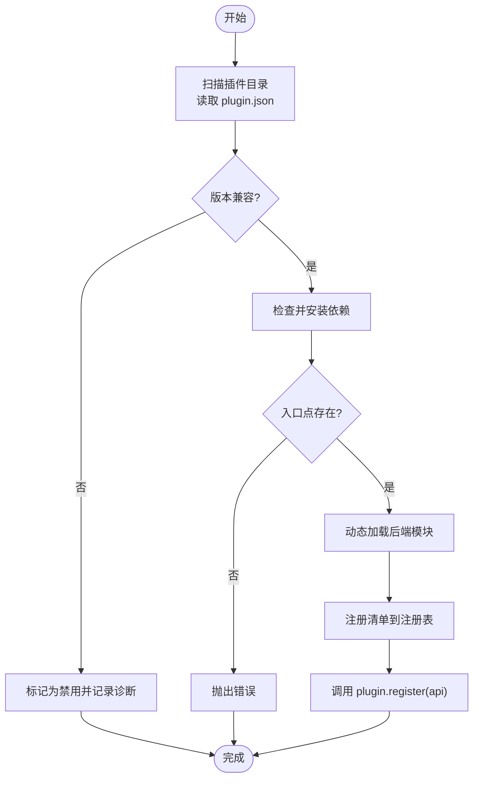
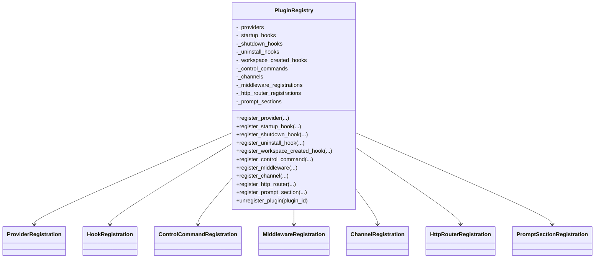
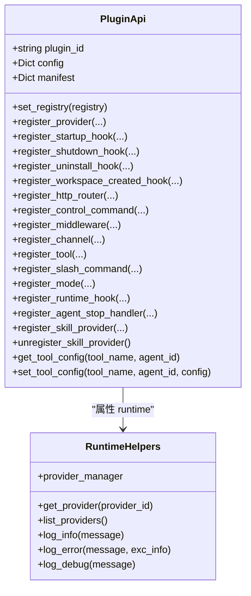
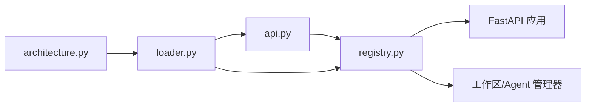

# 插件生态系统

<cite>
**本文引用的文件**   
- [src/qwenpaw/plugins/__init__.py](file://src/qwenpaw/plugins/__init__.py)
- [src/qwenpaw/plugins/architecture.py](file://src/qwenpaw/plugins/architecture.py)
- [src/qwenpaw/plugins/loader.py](file://src/qwenpaw/plugins/loader.py)
- [src/qwenpaw/plugins/registry.py](file://src/qwenpaw/plugins/registry.py)
- [src/qwenpaw/plugins/api.py](file://src/qwenpaw/plugins/api.py)
- [src/qwenpaw/plugins/runtime.py](file://src/qwenpaw/plugins/runtime.py)
- [plugins/channel/azure_bot/plugin.json](file://plugins/channel/azure_bot/plugin.json)
- [plugins/tool/gpt-image2/plugin.json](file://plugins/tool/gpt-image2/plugin.json)
</cite>

## 目录
1. [简介](#简介)
2. [项目结构](#项目结构)
3. [核心组件](#核心组件)
4. [架构总览](#架构总览)
5. [详细组件分析](#详细组件分析)
6. [依赖关系分析](#依赖关系分析)
7. [性能与并发特性](#性能与并发特性)
8. [插件开发指南](#插件开发指南)
9. [插件发布与管理](#插件发布与管理)
10. [故障排查指南](#故障排查指南)
11. [结论](#结论)

## 简介
本文件系统性阐述 QwenPaw 的插件生态，覆盖插件架构、类型与接口、加载器与注册表、运行时环境、调用关系、领域模型、配置项与返回值、与其他组件的关系，以及常见问题与解决方案。文档面向初学者提供循序渐进的理解路径，同时为有经验的开发者提供足够的实现细节与优化建议。重点聚焦：
- 插件加载器（发现、校验、依赖安装、动态导入）
- 插件注册表（统一能力注册与查询）
- 运行时环境（工具、命令、模式、钩子、HTTP 路由等注入）

## 项目结构
QwenPaw 插件系统位于后端 Python 包中，核心由以下模块组成：
- 架构定义：插件清单、记录、类型枚举
- 加载器：扫描、解析、依赖管理、动态加载与卸载
- 注册表：集中式注册中心，维护 Provider、Hook、Channel、HTTP 路由、中间件、提示词片段等
- API：插件开发者使用的注册入口
- 运行时辅助：Provider 访问、日志等

图表来源
- [src/qwenpaw/plugins/architecture.py:114-221](file://src/qwenpaw/plugins/architecture.py#L114-L221)
- [src/qwenpaw/plugins/loader.py:119-172](file://src/qwenpaw/plugins/loader.py#L119-L172)
- [src/qwenpaw/plugins/registry.py:129-169](file://src/qwenpaw/plugins/registry.py#L129-L169)
- [src/qwenpaw/plugins/api.py:172-204](file://src/qwenpaw/plugins/api.py#L172-L204)
- [src/qwenpaw/plugins/runtime.py:10-33](file://src/qwenpaw/plugins/runtime.py#L10-L33)

章节来源
- [src/qwenpaw/plugins/__init__.py:1-17](file://src/qwenpaw/plugins/__init__.py#L1-L17)
- [src/qwenpaw/plugins/architecture.py:114-221](file://src/qwenpaw/plugins/architecture.py#L114-L221)
- [src/qwenpaw/plugins/loader.py:119-172](file://src/qwenpaw/plugins/loader.py#L119-L172)
- [src/qwenpaw/plugins/registry.py:129-169](file://src/qwenpaw/plugins/registry.py#L129-L169)
- [src/qwenpaw/plugins/api.py:172-204](file://src/qwenpaw/plugins/api.py#L172-L204)
- [src/qwenpaw/plugins/runtime.py:10-33](file://src/qwenpaw/plugins/runtime.py#L10-L33)

## 核心组件
- 插件清单与类型
  - 清单字段：id、version、name、description、author、entry、dependencies、min_version/max_version、qwenpaw_version、meta、plugin_type
  - 类型枚举：tool、provider、hook、command、channel、frontend、general
  - 兼容性与向后兼容：支持旧版 name/description/author 的多语言映射；兼容 entry_point 到 entry.backend 迁移；type 缺失时基于 meta 推断
- 插件记录
  - 包含 manifest、source_path、enabled、instance、diagnostics
- 加载器
  - 发现：遍历 plugin_dirs，跳过隐藏或 .disabled 目录，读取 plugin.json
  - 依赖：requirements.txt 解析与安装（pip/uv），冻结桌面构建使用独立 Python 目标目录
  - 动态加载：按 module_name 命名空间加载 backend 模块，要求导出 plugin.register(api)
  - 卸载：清理 sys.modules、sys.path、注册表、工具列表、可选删除磁盘文件
- 注册表
  - 单例，集中管理：Provider、Hook（启动/关闭/卸载/工作区创建）、控制命令、中间件工厂、Channel、HTTP 路由、提示词片段
  - HTTP 路由挂载在 FastAPI 根应用上，确保优先于控制台 SPA 捕获路由
- API
  - 插件通过 api.register_* 系列方法注册能力，内部委托给注册表
  - 工具注册会延迟到启动钩子执行，写入 Agent 配置并桥接到运行时 ToolRegistry
  - 斜杠命令、模式、运行时钩子、停止处理器均通过工作区生命周期进行注册
- 运行时辅助
  - RuntimeHelpers 暴露 provider_manager 访问、列出 Provider、日志输出

章节来源
- [src/qwenpaw/plugins/architecture.py:12-98](file://src/qwenpaw/plugins/architecture.py#L12-L98)
- [src/qwenpaw/plugins/architecture.py:114-221](file://src/qwenpaw/plugins/architecture.py#L114-L221)
- [src/qwenpaw/plugins/loader.py:119-172](file://src/qwenpaw/plugins/loader.py#L119-L172)
- [src/qwenpaw/plugins/loader.py:514-640](file://src/qwenpaw/plugins/loader.py#L514-L640)
- [src/qwenpaw/plugins/loader.py:975-1096](file://src/qwenpaw/plugins/loader.py#L975-L1096)
- [src/qwenpaw/plugins/registry.py:129-169](file://src/qwenpaw/plugins/registry.py#L129-L169)
- [src/qwenpaw/plugins/registry.py:220-296](file://src/qwenpaw/plugins/registry.py#L220-L296)
- [src/qwenpaw/plugins/api.py:172-204](file://src/qwenpaw/plugins/api.py#L172-L204)
- [src/qwenpaw/plugins/api.py:614-698](file://src/qwenpaw/plugins/api.py#L614-L698)
- [src/qwenpaw/plugins/api.py:700-756](file://src/qwenpaw/plugins/api.py#L700-L756)
- [src/qwenpaw/plugins/api.py:758-796](file://src/qwenpaw/plugins/api.py#L758-L796)
- [src/qwenpaw/plugins/runtime.py:10-33](file://src/qwenpaw/plugins/runtime.py#L10-L33)

## 架构总览
下图展示插件从发现到运行时的关键流程与交互。

图表来源
- [src/qwenpaw/plugins/loader.py:132-172](file://src/qwenpaw/plugins/loader.py#L132-L172)
- [src/qwenpaw/plugins/loader.py:270-334](file://src/qwenpaw/plugins/loader.py#L270-L334)
- [src/qwenpaw/plugins/loader.py:376-458](file://src/qwenpaw/plugins/loader.py#L376-L458)
- [src/qwenpaw/plugins/registry.py:220-296](file://src/qwenpaw/plugins/registry.py#L220-L296)
- [src/qwenpaw/plugins/api.py:394-424](file://src/qwenpaw/plugins/api.py#L394-L424)

## 详细组件分析

### 插件清单与类型（Architecture）
- PluginType：标准化插件类型标识，便于 JSON 序列化与 UI 分类
- PluginManifest：Pydantic 模型，负责解析与规范化 plugin.json，包括：
  - 多语言文本归一化
  - 遗留字段兼容（entry_point → entry.backend）
  - type 缺失时的自动推断（基于 meta 与 entry）
- PluginRecord：加载后的插件记录，包含元数据、源路径、启用状态、实例与诊断信息

图表来源
- [src/qwenpaw/plugins/architecture.py:12-98](file://src/qwenpaw/plugins/architecture.py#L12-L98)
- [src/qwenpaw/plugins/architecture.py:114-221](file://src/qwenpaw/plugins/architecture.py#L114-L221)

章节来源
- [src/qwenpaw/plugins/architecture.py:12-98](file://src/qwenpaw/plugins/architecture.py#L12-L98)
- [src/qwenpaw/plugins/architecture.py:114-221](file://src/qwenpaw/plugins/architecture.py#L114-L221)

### 插件加载器（Loader）
- 发现与过滤：忽略隐藏目录与 .disabled 后缀目录
- 版本兼容性检查：基于 qwenpaw_version 或 min/max_version
- 依赖安装：
  - requirements.txt 解析
  - 双探针检测：importlib.metadata 与 importlib.util.find_spec
  - 进程级锁避免重复安装
  - 冻结桌面构建使用独立 Python 目标目录
- 动态加载：
  - 以 plugin_<id> 命名空间加载模块
  - 要求导出 plugin.register(api)，支持异步回调
  - 失败时回滚 sys.modules、sys.path、注册表
- 卸载：
  - 执行 shutdown/uninstall 钩子
  - 清理模块与路径
  - 移除工具条目与磁盘文件（可选）

图表来源
- [src/qwenpaw/plugins/loader.py:132-172](file://src/qwenpaw/plugins/loader.py#L132-L172)
- [src/qwenpaw/plugins/loader.py:192-206](file://src/qwenpaw/plugins/loader.py#L192-L206)
- [src/qwenpaw/plugins/loader.py:270-334](file://src/qwenpaw/plugins/loader.py#L270-L334)
- [src/qwenpaw/plugins/loader.py:376-458](file://src/qwenpaw/plugins/loader.py#L376-L458)
- [src/qwenpaw/plugins/loader.py:460-513](file://src/qwenpaw/plugins/loader.py#L460-L513)
- [src/qwenpaw/plugins/loader.py:975-1096](file://src/qwenpaw/plugins/loader.py#L975-L1096)

章节来源
- [src/qwenpaw/plugins/loader.py:119-172](file://src/qwenpaw/plugins/loader.py#L119-L172)
- [src/qwenpaw/plugins/loader.py:270-334](file://src/qwenpaw/plugins/loader.py#L270-L334)
- [src/qwenpaw/plugins/loader.py:376-458](file://src/qwenpaw/plugins/loader.py#L376-L458)
- [src/qwenpaw/plugins/loader.py:460-513](file://src/qwenpaw/plugins/loader.py#L460-L513)
- [src/qwenpaw/plugins/loader.py:514-640](file://src/qwenpaw/plugins/loader.py#L514-L640)
- [src/qwenpaw/plugins/loader.py:894-973](file://src/qwenpaw/plugins/loader.py#L894-L973)
- [src/qwenpaw/plugins/loader.py:975-1096](file://src/qwenpaw/plugins/loader.py#L975-L1096)

### 插件注册表（Registry）
- 单例设计，集中管理所有插件能力
- 注册项：
  - Provider：LLM 提供者类、标签、基础 URL、元数据
  - Hook：启动、关闭、卸载、工作区创建（支持优先级排序）
  - ControlCommand：控制命令处理器
  - Middleware：中间件工厂（每请求装配）
  - Channel：自定义消息通道（含前端配置字段描述）
  - HTTP Router：挂载到 FastAPI /api/*，优先于控制台 SPA 捕获路由
  - PromptSection：系统提示词片段（可条件注入）
- 卸载清理：移除 HTTP 路由、Channel、Provider、Hooks、Commands、Middleware、PromptSections

图表来源
- [src/qwenpaw/plugins/registry.py:129-169](file://src/qwenpaw/plugins/registry.py#L129-L169)
- [src/qwenpaw/plugins/registry.py:220-296](file://src/qwenpaw/plugins/registry.py#L220-L296)
- [src/qwenpaw/plugins/registry.py:328-367](file://src/qwenpaw/plugins/registry.py#L328-L367)
- [src/qwenpaw/plugins/registry.py:472-528](file://src/qwenpaw/plugins/registry.py#L472-L528)
- [src/qwenpaw/plugins/registry.py:546-588](file://src/qwenpaw/plugins/registry.py#L546-L588)
- [src/qwenpaw/plugins/registry.py:590-628](file://src/qwenpaw/plugins/registry.py#L590-L628)
- [src/qwenpaw/plugins/registry.py:717-747](file://src/qwenpaw/plugins/registry.py#L717-L747)
- [src/qwenpaw/plugins/registry.py:749-854](file://src/qwenpaw/plugins/registry.py#L749-L854)
- [src/qwenpaw/plugins/registry.py:934-992](file://src/qwenpaw/plugins/registry.py#L934-L992)

章节来源
- [src/qwenpaw/plugins/registry.py:129-169](file://src/qwenpaw/plugins/registry.py#L129-L169)
- [src/qwenpaw/plugins/registry.py:220-296](file://src/qwenpaw/plugins/registry.py#L220-L296)
- [src/qwenpaw/plugins/registry.py:328-367](file://src/qwenpaw/plugins/registry.py#L328-L367)
- [src/qwenpaw/plugins/registry.py:472-528](file://src/qwenpaw/plugins/registry.py#L472-L528)
- [src/qwenpaw/plugins/registry.py:546-588](file://src/qwenpaw/plugins/registry.py#L546-L588)
- [src/qwenpaw/plugins/registry.py:590-628](file://src/qwenpaw/plugins/registry.py#L590-L628)
- [src/qwenpaw/plugins/registry.py:717-747](file://src/qwenpaw/plugins/registry.py#L717-L747)
- [src/qwenpaw/plugins/registry.py:749-854](file://src/qwenpaw/plugins/registry.py#L749-L854)
- [src/qwenpaw/plugins/registry.py:934-992](file://src/qwenpaw/plugins/registry.py#L934-L992)

### 插件 API（Api）
- 注册入口：
  - register_provider：注册 LLM 提供者
  - register_startup_hook/register_shutdown_hook/register_uninstall_hook/register_workspace_created_hook：生命周期钩子
  - register_http_router：挂载 REST 路由
  - register_control_command：注册控制命令
  - register_middleware：注册中间件工厂
  - register_channel：注册消息通道（含前端配置字段）
  - register_tool：注册工具函数（延迟到启动钩子，写入 Agent 配置，桥接运行时）
  - register_slash_command：注册斜杠命令（工作区生命周期注册）
  - register_mode：注册 AgentMode（工作区生命周期注册）
  - register_runtime_hook：注册运行时阶段钩子
  - register_agent_stop_handler：注册停止处理器
  - register_skill_provider/unregister_skill_provider：技能提供者（复制、合并、清理）
- 工具配置便捷函数：get_tool_config、set_tool_config

图表来源
- [src/qwenpaw/plugins/api.py:172-204](file://src/qwenpaw/plugins/api.py#L172-L204)
- [src/qwenpaw/plugins/api.py:205-250](file://src/qwenpaw/plugins/api.py#L205-L250)
- [src/qwenpaw/plugins/api.py:251-313](file://src/qwenpaw/plugins/api.py#L251-L313)
- [src/qwenpaw/plugins/api.py:315-356](file://src/qwenpaw/plugins/api.py#L315-L356)
- [src/qwenpaw/plugins/api.py:358-392](file://src/qwenpaw/plugins/api.py#L358-L392)
- [src/qwenpaw/plugins/api.py:394-424](file://src/qwenpaw/plugins/api.py#L394-L424)
- [src/qwenpaw/plugins/api.py:425-446](file://src/qwenpaw/plugins/api.py#L425-L446)
- [src/qwenpaw/plugins/api.py:448-481](file://src/qwenpaw/plugins/api.py#L448-L481)
- [src/qwenpaw/plugins/api.py:483-570](file://src/qwenpaw/plugins/api.py#L483-L570)
- [src/qwenpaw/plugins/api.py:614-698](file://src/qwenpaw/plugins/api.py#L614-L698)
- [src/qwenpaw/plugins/api.py:700-756](file://src/qwenpaw/plugins/api.py#L700-L756)
- [src/qwenpaw/plugins/api.py:758-796](file://src/qwenpaw/plugins/api.py#L758-L796)
- [src/qwenpaw/plugins/api.py:798-835](file://src/qwenpaw/plugins/api.py#L798-L835)
- [src/qwenpaw/plugins/api.py:837-888](file://src/qwenpaw/plugins/api.py#L837-L888)
- [src/qwenpaw/plugins/api.py:890-948](file://src/qwenpaw/plugins/api.py#L890-L948)
- [src/qwenpaw/plugins/api.py:1098-1183](file://src/qwenpaw/plugins/api.py#L1098-L1183)
- [src/qwenpaw/plugins/api.py:1185-1218](file://src/qwenpaw/plugins/api.py#L1185-L1218)
- [src/qwenpaw/plugins/runtime.py:10-33](file://src/qwenpaw/plugins/runtime.py#L10-L33)

章节来源
- [src/qwenpaw/plugins/api.py:172-204](file://src/qwenpaw/plugins/api.py#L172-L204)
- [src/qwenpaw/plugins/api.py:614-698](file://src/qwenpaw/plugins/api.py#L614-L698)
- [src/qwenpaw/plugins/api.py:700-756](file://src/qwenpaw/plugins/api.py#L700-L756)
- [src/qwenpaw/plugins/api.py:758-796](file://src/qwenpaw/plugins/api.py#L758-L796)
- [src/qwenpaw/plugins/api.py:798-835](file://src/qwenpaw/plugins/api.py#L798-L835)
- [src/qwenpaw/plugins/api.py:837-888](file://src/qwenpaw/plugins/api.py#L837-L888)
- [src/qwenpaw/plugins/api.py:890-948](file://src/qwenpaw/plugins/api.py#L890-L948)
- [src/qwenpaw/plugins/api.py:1098-1183](file://src/qwenpaw/plugins/api.py#L1098-L1183)
- [src/qwenpaw/plugins/api.py:1185-1218](file://src/qwenpaw/plugins/api.py#L1185-L1218)
- [src/qwenpaw/plugins/runtime.py:10-33](file://src/qwenpaw/plugins/runtime.py#L10-L33)

### 运行时辅助（RuntimeHelpers）
- 获取 Provider 实例与列表
- 日志输出（info/error/debug）

章节来源
- [src/qwenpaw/plugins/runtime.py:10-33](file://src/qwenpaw/plugins/runtime.py#L10-L33)

## 依赖关系分析
- 模块耦合
  - loader 依赖 architecture、api、registry
  - api 依赖 registry 与运行时组件（工具、命令、模式、钩子）
  - registry 作为单例被 loader 与 api 共同使用
- 外部集成
  - FastAPI：插件 HTTP 路由挂载
  - 工作区/Agent 管理器：工具、命令、模式、钩子注入
  - 文件系统：plugin.json、requirements.txt、skills 目录
- 潜在循环依赖
  - 通过延迟导入与钩子机制避免强耦合

图表来源
- [src/qwenpaw/plugins/loader.py:119-172](file://src/qwenpaw/plugins/loader.py#L119-L172)
- [src/qwenpaw/plugins/api.py:172-204](file://src/qwenpaw/plugins/api.py#L172-L204)
- [src/qwenpaw/plugins/registry.py:129-169](file://src/qwenpaw/plugins/registry.py#L129-L169)

章节来源
- [src/qwenpaw/plugins/loader.py:119-172](file://src/qwenpaw/plugins/loader.py#L119-L172)
- [src/qwenpaw/plugins/api.py:172-204](file://src/qwenpaw/plugins/api.py#L172-L204)
- [src/qwenpaw/plugins/registry.py:129-169](file://src/qwenpaw/plugins/registry.py#L129-L169)

## 性能与并发特性
- 依赖安装并行与串行
  - 不同插件可并行安装，同一插件安装串行化（进程级锁）
  - 双重检查避免重复安装风暴
- 事件循环保护
  - 依赖安装通过线程池执行，避免阻塞主事件循环
- 路由插入策略
  - 插件路由插入在控制台 SPA 捕获路由之前，减少匹配开销
- 模块与路径清理
  - 卸载时彻底清理 sys.modules 与 sys.path，避免后续导入污染

章节来源
- [src/qwenpaw/plugins/loader.py:270-334](file://src/qwenpaw/plugins/loader.py#L270-L334)
- [src/qwenpaw/plugins/loader.py:721-834](file://src/qwenpaw/plugins/loader.py#L721-L834)
- [src/qwenpaw/plugins/registry.py:220-296](file://src/qwenpaw/plugins/registry.py#L220-L296)
- [src/qwenpaw/plugins/loader.py:975-1096](file://src/qwenpaw/plugins/loader.py#L975-L1096)

## 插件开发指南
- 基本结构
  - 每个插件是一个目录，包含 plugin.json 与后端入口（如 plugin.py）
  - 可选 requirements.txt 声明 Python 依赖
  - 可选 skills 目录用于技能提供者
- 清单字段要点
  - id/version/name/description/author：必填或常用
  - entry.backend：后端入口文件路径
  - type：推荐显式设置（tool/provider/hook/command/channel/frontend/general）
  - qwenpaw_version：兼容范围（>=min, <max）
  - meta：扩展元数据（例如工具名、渠道信息等）
- 后端入口约定
  - 必须导出 plugin.register(api)
  - 可使用 api.* 注册能力（工具、命令、模式、钩子、HTTP 路由、通道等）
- 工具注册最佳实践
  - 使用 api.register_tool 延迟注册，默认禁用，用户可选择启用
  - 工具配置可通过 get_tool_config 在当前 Agent 上下文读取
- 斜杠命令与模式
  - 在工作区生命周期内注册，确保新工作区也能获得
- 技能提供者
  - 使用 register_skill_provider 将技能复制到工作区，并在卸载时清理

章节来源
- [src/qwenpaw/plugins/architecture.py:114-221](file://src/qwenpaw/plugins/architecture.py#L114-L221)
- [src/qwenpaw/plugins/loader.py:376-458](file://src/qwenpaw/plugins/loader.py#L376-L458)
- [src/qwenpaw/plugins/api.py:614-698](file://src/qwenpaw/plugins/api.py#L614-L698)
- [src/qwenpaw/plugins/api.py:700-756](file://src/qwenpaw/plugins/api.py#L700-L756)
- [src/qwenpaw/plugins/api.py:758-796](file://src/qwenpaw/plugins/api.py#L758-L796)
- [src/qwenpaw/plugins/api.py:1098-1183](file://src/qwenpaw/plugins/api.py#L1098-L1183)

## 插件发布与管理
- 安装与加载
  - 支持从本地目录安装到插件目录，自动复制与依赖安装
  - 支持 load_all_plugins 批量加载，可按类型过滤
- 卸载与清理
  - unload_plugin 支持执行钩子、清理内存与磁盘
  - 技能提供者卸载时清理工作区中的技能与清单
- 示例清单参考
  - channel/azure_bot/plugin.json：通道插件清单示例
  - tool/gpt-image2/plugin.json：工具插件清单示例

章节来源
- [src/qwenpaw/plugins/loader.py:894-973](file://src/qwenpaw/plugins/loader.py#L894-L973)
- [src/qwenpaw/plugins/loader.py:975-1096](file://src/qwenpaw/plugins/loader.py#L975-L1096)
- [src/qwenpaw/plugins/api.py:1185-1218](file://src/qwenpaw/plugins/api.py#L1185-L1218)
- [plugins/channel/azure_bot/plugin.json](file://plugins/channel/azure_bot/plugin.json)
- [plugins/tool/gpt-image2/plugin.json](file://plugins/tool/gpt-image2/plugin.json)

## 故障排查指南
- 常见错误与定位
  - 清单无效或缺少必要字段：查看 loader 的清单加载日志与异常
  - 入口点不存在：验证 entry.backend/entry.frontend 与实际文件一致
  - 依赖安装失败：检查 pip/uv 可用性、网络与超时；冻结构建需设置 QWENPAW_DESKTOP_PY_RUNTIME
  - 路由冲突：确保 prefix 唯一且不为 "/"
  - 通道键冲突：避免与内置通道键冲突
- 调试建议
  - 启用 debug 日志观察安装与加载过程
  - 使用 get_loaded_plugin/get_all_loaded_plugins 检查加载状态
  - 通过 get_http_router_registrations 与 get_registered_channels 检查注册情况

章节来源
- [src/qwenpaw/plugins/loader.py:174-189](file://src/qwenpaw/plugins/loader.py#L174-L189)
- [src/qwenpaw/plugins/loader.py:336-374](file://src/qwenpaw/plugins/loader.py#L336-L374)
- [src/qwenpaw/plugins/loader.py:721-834](file://src/qwenpaw/plugins/loader.py#L721-L834)
- [src/qwenpaw/plugins/registry.py:220-296](file://src/qwenpaw/plugins/registry.py#L220-L296)
- [src/qwenpaw/plugins/registry.py:749-854](file://src/qwenpaw/plugins/registry.py#L749-L854)
- [src/qwenpaw/plugins/loader.py:1147-1164](file://src/qwenpaw/plugins/loader.py#L1147-L1164)

## 结论
QwenPaw 插件系统通过清晰的清单规范、健壮的加载器与统一的注册表，实现了可扩展的工具、通道、命令、模式与运行时钩子能力。其并发安全的依赖安装、严格的卸载清理与灵活的 API 设计，既保障了稳定性，也为开发者提供了丰富的扩展点。遵循本文的开发指南与最佳实践，可以快速构建高质量插件并融入宿主生态。