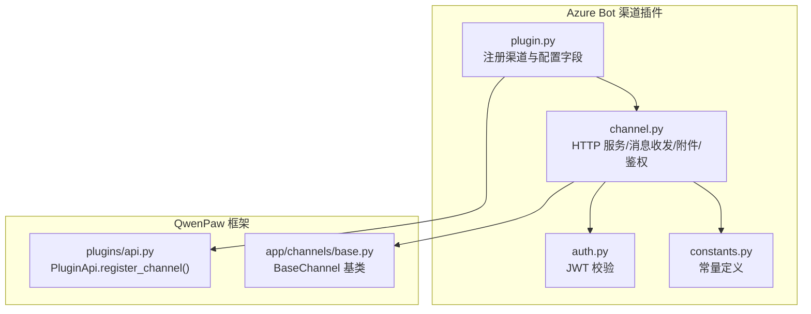
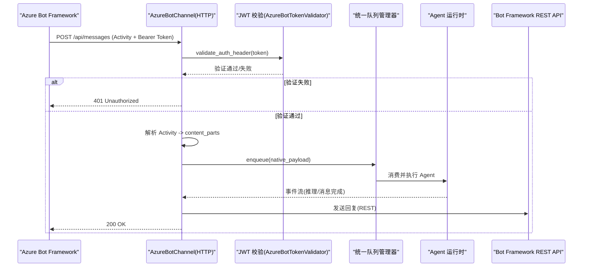
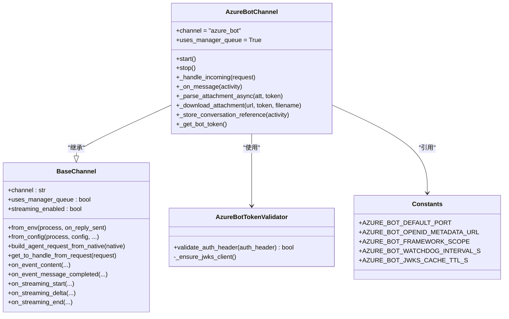
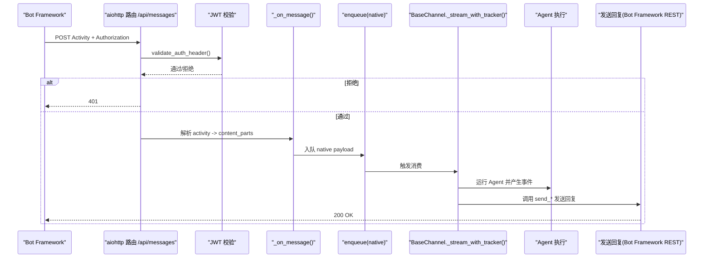
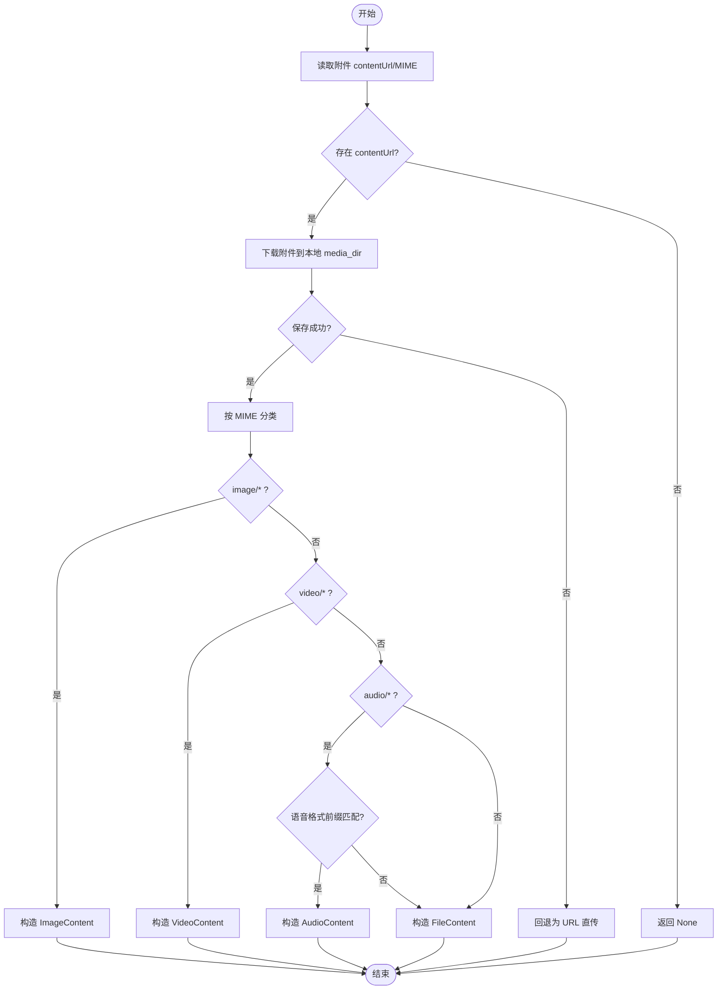
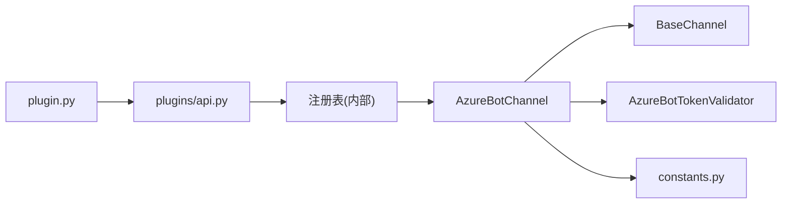

# Channel 渠道插件

<cite>
**本文引用的文件**   
- [plugins/channel/azure_bot/plugin.py](file://plugins/channel/azure_bot/plugin.py)
- [plugins/channel/azure_bot/channel.py](file://plugins/channel/azure_bot/channel.py)
- [plugins/channel/azure_bot/auth.py](file://plugins/channel/azure_bot/auth.py)
- [plugins/channel/azure_bot/constants.py](file://plugins/channel/azure_bot/constants.py)
- [src/qwenpaw/plugins/api.py](file://src/qwenpaw/plugins/api.py)
- [src/qwenpaw/app/channels/base.py](file://src/qwenpaw/app/channels/base.py)
</cite>

## 目录
1. [简介](#简介)
2. [项目结构](#项目结构)
3. [核心组件](#核心组件)
4. [架构总览](#架构总览)
5. [详细组件分析](#详细组件分析)
6. [依赖关系分析](#依赖关系分析)
7. [性能与稳定性](#性能与稳定性)
8. [故障排查指南](#故障排查指南)
9. [结论](#结论)
10. [附录：开发清单与最佳实践](#附录开发清单与最佳实践)

## 简介
本文件面向希望为 QwenPaw 开发自定义消息渠道插件的开发者，系统讲解 Channel 插件体系、BaseChannel 基类契约、register_channel() API、config_fields 前端表单规范、以及 Azure Bot 渠道插件的完整实现示例。文档同时覆盖渠道间通信机制、状态管理、生命周期管理、错误处理与性能优化建议，帮助读者快速构建高质量、可维护的渠道插件。

## 项目结构
QwenPaw 的 Channel 插件位于 plugins/channel/<channel_name>/ 目录下，以 Azure Bot 为例，包含以下关键文件：
- plugin.py：插件入口，负责通过 PluginApi.register_channel() 注册渠道类与配置字段
- channel.py：渠道实现，继承 BaseChannel，提供 HTTP 服务、消息收发、附件下载、鉴权等
- auth.py：入站请求 JWT 校验（基于 Microsoft Bot Framework OpenID/JWKS）
- constants.py：常量（默认端口、OpenID 元数据地址、JWKS 缓存 TTL 等）

图表来源
- [plugins/channel/azure_bot/plugin.py:1-314](file://plugins/channel/azure_bot/plugin.py#L1-L314)
- [plugins/channel/azure_bot/channel.py:1-800](file://plugins/channel/azure_bot/channel.py#L1-L800)
- [plugins/channel/azure_bot/auth.py:1-168](file://plugins/channel/azure_bot/auth.py#L1-L168)
- [plugins/channel/azure_bot/constants.py:1-20](file://plugins/channel/azure_bot/constants.py#L1-L20)
- [src/qwenpaw/plugins/api.py:483-570](file://src/qwenpaw/plugins/api.py#L483-L570)
- [src/qwenpaw/app/channels/base.py:80-170](file://src/qwenpaw/app/channels/base.py#L80-L170)

章节来源
- [plugins/channel/azure_bot/plugin.py:1-314](file://plugins/channel/azure_bot/plugin.py#L1-L314)
- [plugins/channel/azure_bot/channel.py:1-800](file://plugins/channel/azure_bot/channel.py#L1-L800)
- [plugins/channel/azure_bot/auth.py:1-168](file://plugins/channel/azure_bot/auth.py#L1-L168)
- [plugins/channel/azure_bot/constants.py:1-20](file://plugins/channel/azure_bot/constants.py#L1-L20)
- [src/qwenpaw/plugins/api.py:483-570](file://src/qwenpaw/plugins/api.py#L483-L570)
- [src/qwenpaw/app/channels/base.py:80-170](file://src/qwenpaw/app/channels/base.py#L80-L170)

## 核心组件
- BaseChannel 基类
  - 提供统一的渠道抽象：会话解析、去抖合并、访问控制、流式事件分发、SSE 序列化、任务追踪等
  - 子类需实现 from_env/from_config、build_agent_request_from_native、send_* 等方法
- PluginApi.register_channel()
  - 将渠道类与 UI 配置字段描述注册到平台，供控制台渲染设置表单
- AzureBotChannel 渠道实现
  - 基于 aiohttp 独立 HTTP 服务接收 Bot Framework Activity
  - 使用 MSAL/JWT 进行出站调用与入站鉴权
  - 支持文本、图片、视频、音频、文件等多模态内容
  - 支持群聊上下文共享、@提及策略、访问控制白名单等

章节来源
- [src/qwenpaw/app/channels/base.py:80-170](file://src/qwenpaw/app/channels/base.py#L80-L170)
- [src/qwenpaw/plugins/api.py:483-570](file://src/qwenpaw/plugins/api.py#L483-L570)
- [plugins/channel/azure_bot/channel.py:45-190](file://plugins/channel/azure_bot/channel.py#L45-L190)

## 架构总览
下图展示从外部 Bot Framework 到 QwenPaw Agent 的核心流程：入站鉴权、Activity 解析、内容转换、队列投递、Agent 执行、结果回写。

图表来源
- [plugins/channel/azure_bot/channel.py:497-558](file://plugins/channel/azure_bot/channel.py#L497-L558)
- [plugins/channel/azure_bot/auth.py:97-168](file://plugins/channel/azure_bot/auth.py#L97-L168)
- [src/qwenpaw/app/channels/base.py:864-983](file://src/qwenpaw/app/channels/base.py#L864-L983)

## 详细组件分析

### BaseChannel 基类契约与扩展点
- 关键属性与方法
  - channel: 渠道唯一键
  - uses_manager_queue: 是否由管理器创建队列与消费者循环
  - from_env()/from_config(): 构造器工厂方法
  - build_agent_request_from_native(): 将渠道原生消息转为 AgentRequest
  - get_to_handle_from_request(): 决定发送目标（用户 ID 或会话 ID）
  - on_event_content()/on_event_message_completed(): 非流式路径回调
  - streaming_enabled/on_streaming_start/delta/end(): 可选的流式路径
  - _access_control_gate(): 访问控制门控（DM/群组）
  - merge_requests()/merge_native_items(): 同会话合并与去抖
- 扩展建议
  - 在子类中覆写 build_agent_request_from_native()，将 native payload 转换为 content_parts 列表
  - 若需要实时推送，设置 streaming_enabled=True 并实现 on_streaming_* 钩子
  - 根据渠道特性覆写 resolve_session_id()/get_to_handle_from_request()

章节来源
- [src/qwenpaw/app/channels/base.py:80-170](file://src/qwenpaw/app/channels/base.py#L80-L170)
- [src/qwenpaw/app/channels/base.py:1092-1186](file://src/qwenpaw/app/channels/base.py#L1092-L1186)
- [src/qwenpaw/app/channels/base.py:864-983](file://src/qwenpaw/app/channels/base.py#L864-L983)

### register_channel() API 与 config_fields 规范
- 用途
  - 在插件入口中调用 api.register_channel(channel_class, label, description, config_fields, icon, doc_url)
- config_fields 字段规范
  - name: 配置项键名
  - label: 显示标签（支持多语言映射）
  - type: text | password | number | switch | select
  - required: 是否必填
  - placeholder/help/default/options: 辅助信息
- 前端集成
  - 控制台根据 config_fields 自动生成设置表单
  - icon/doc_url 用于卡片图标与文档链接

章节来源
- [src/qwenpaw/plugins/api.py:483-570](file://src/qwenpaw/plugins/api.py#L483-L570)
- [plugins/channel/azure_bot/plugin.py:24-308](file://plugins/channel/azure_bot/plugin.py#L24-L308)

### Azure Bot 渠道插件详解

#### 类图（AzureBotChannel 与相关组件）

图表来源
- [src/qwenpaw/app/channels/base.py:80-170](file://src/qwenpaw/app/channels/base.py#L80-L170)
- [plugins/channel/azure_bot/channel.py:45-190](file://plugins/channel/azure_bot/channel.py#L45-L190)
- [plugins/channel/azure_bot/auth.py:22-96](file://plugins/channel/azure_bot/auth.py#L22-L96)
- [plugins/channel/azure_bot/constants.py:1-20](file://plugins/channel/azure_bot/constants.py#L1-L20)

#### 入站消息处理序列图

图表来源
- [plugins/channel/azure_bot/channel.py:497-558](file://plugins/channel/azure_bot/channel.py#L497-L558)
- [plugins/channel/azure_bot/channel.py:572-692](file://plugins/channel/azure_bot/channel.py#L572-L692)
- [src/qwenpaw/app/channels/base.py:864-983](file://src/qwenpaw/app/channels/base.py#L864-L983)

#### 附件解析流程图

图表来源
- [plugins/channel/azure_bot/channel.py:748-800](file://plugins/channel/azure_bot/channel.py#L748-L800)
- [plugins/channel/azure_bot/channel.py:693-747](file://plugins/channel/azure_bot/channel.py#L693-L747)

#### 认证流程（入站 JWT 校验）
- 步骤
  - 从 Authorization 头提取 Bearer token
  - 拉取并缓存 OpenID 元数据与 JWKS
  - 使用公钥校验签名、过期时间，并校验 iss/aud
- 关键点
  - JWKS 缓存避免每次请求都拉取密钥
  - 支持租户级 issuer 白名单

章节来源
- [plugins/channel/azure_bot/auth.py:97-168](file://plugins/channel/azure_bot/auth.py#L97-L168)
- [plugins/channel/azure_bot/auth.py:51-96](file://plugins/channel/azure_bot/auth.py#L51-L96)
- [plugins/channel/azure_bot/constants.py:8-10](file://plugins/channel/azure_bot/constants.py#L8-L10)

#### 生命周期管理（启动/停止/看门狗）
- start()
  - 检查 enabled 与必要配置
  - 初始化 aiohttp.ClientSession
  - 加载持久化 conversation references
  - 启动 HTTP 服务与看门狗任务
- stop()
  - 取消看门狗
  - 停止 HTTP 服务并关闭客户端会话
  - 等待后台 refs 写入完成（带超时保护）
- 看门狗
  - 周期性探测 TCP 端口健康度，异常时自动重启 HTTP 服务

章节来源
- [plugins/channel/azure_bot/channel.py:336-391](file://plugins/channel/azure_bot/channel.py#L336-L391)
- [plugins/channel/azure_bot/channel.py:397-491](file://plugins/channel/azure_bot/channel.py#L397-L491)

#### 消息格式转换与发送
- 入站
  - 解析 Activity，识别 DM/群组、@提及、附件类型
  - 生成 content_parts（Text/Image/Audio/Video/File）
  - 组装 native payload 并通过 _enqueue 入队
- 出站
  - 通过 Bot Framework REST API 发送回复（含 Bearer token）
  - 支持 proactive messaging（conversation references）

章节来源
- [plugins/channel/azure_bot/channel.py:572-692](file://plugins/channel/azure_bot/channel.py#L572-L692)
- [plugins/channel/azure_bot/channel.py:693-800](file://plugins/channel/azure_bot/channel.py#L693-L800)

#### 错误处理与边界情况
- 入站鉴权失败：直接返回 401，不缓冲大请求体
- JSON 解析失败：返回 400
- 附件下载失败：记录日志并回退为 URL 直传
- 端口占用：记录警告并交由看门狗重试
- 后台 refs 写入超时：防止 shutdown 无限阻塞

章节来源
- [plugins/channel/azure_bot/channel.py:497-558](file://plugins/channel/azure_bot/channel.py#L497-L558)
- [plugins/channel/azure_bot/channel.py:693-747](file://plugins/channel/azure_bot/channel.py#L693-L747)
- [plugins/channel/azure_bot/channel.py:336-391](file://plugins/channel/azure_bot/channel.py#L336-L391)

## 依赖关系分析
- 插件层
  - plugin.py 通过 PluginApi.register_channel() 注册 AzureBotChannel 与配置字段
- 渠道层
  - AzureBotChannel 继承 BaseChannel，依赖 aiohttp/web、jwt、PyJWKClient、aiohttp.ClientSession
  - 使用 constants 中的默认端口、OpenID 元数据地址、JWKS 缓存 TTL 等
- 框架层
  - BaseChannel 提供统一的消息处理、流式分发、访问控制、SSE 序列化等能力

图表来源
- [plugins/channel/azure_bot/plugin.py:24-308](file://plugins/channel/azure_bot/plugin.py#L24-L308)
- [src/qwenpaw/plugins/api.py:483-570](file://src/qwenpaw/plugins/api.py#L483-L570)
- [plugins/channel/azure_bot/channel.py:45-190](file://plugins/channel/azure_bot/channel.py#L45-L190)
- [plugins/channel/azure_bot/auth.py:22-96](file://plugins/channel/azure_bot/auth.py#L22-L96)
- [plugins/channel/azure_bot/constants.py:1-20](file://plugins/channel/azure_bot/constants.py#L1-L20)

章节来源
- [plugins/channel/azure_bot/plugin.py:24-308](file://plugins/channel/azure_bot/plugin.py#L24-L308)
- [src/qwenpaw/plugins/api.py:483-570](file://src/qwenpaw/plugins/api.py#L483-L570)
- [plugins/channel/azure_bot/channel.py:45-190](file://plugins/channel/azure_bot/channel.py#L45-L190)
- [plugins/channel/azure_bot/auth.py:22-96](file://plugins/channel/azure_bot/auth.py#L22-L96)
- [plugins/channel/azure_bot/constants.py:1-20](file://plugins/channel/azure_bot/constants.py#L1-L20)

## 性能与稳定性
- 入站鉴权前置
  - 先验签再读体，避免大请求体内存压力
- 附件下载与存储
  - 异步下载、落盘到 media_dir，避免网络抖动影响主流程
  - 大小限制提示，防止超出 Bot Framework 附件限制
- 并发与去抖
  - BaseChannel 提供无文本去抖与会话内合并，减少重复输出
- 看门狗与健康检查
  - 周期检测端口连通性，异常自动重启 HTTP 服务
- SSE 流式优化
  - 最小间隔与超时保护，避免频繁 flush 导致拥塞
- 资源清理
  - stop() 中等待后台 refs 写入完成，带超时保护，确保优雅退出

章节来源
- [plugins/channel/azure_bot/channel.py:497-558](file://plugins/channel/azure_bot/channel.py#L497-L558)
- [plugins/channel/azure_bot/channel.py:336-391](file://plugins/channel/azure_bot/channel.py#L336-L391)
- [src/qwenpaw/app/channels/base.py:864-983](file://src/qwenpaw/app/channels/base.py#L864-L983)

## 故障排查指南
- 401 Unauthorized
  - 检查 Authorization 头是否为 "Bearer <token>"
  - 确认 app_id/tenant_id 配置正确，OpenID/JWKS 可达
- 400 Bad Request
  - 检查 Activity JSON 是否合法
- 附件无法发送
  - 检查 contentUrl 是否可用、token 是否有效
  - 关注媒体目录权限与磁盘空间
- 端口占用
  - 调整 http_port 或释放占用进程；查看看门狗日志
- 群聊未响应
  - 检查 require_mention 开关与 @提及逻辑
  - 确认 is_group 判定与 bot_prefix/@mention 剥离逻辑

章节来源
- [plugins/channel/azure_bot/channel.py:497-558](file://plugins/channel/azure_bot/channel.py#L497-L558)
- [plugins/channel/azure_bot/channel.py:572-692](file://plugins/channel/azure_bot/channel.py#L572-L692)
- [plugins/channel/azure_bot/channel.py:397-491](file://plugins/channel/azure_bot/channel.py#L397-L491)

## 结论
通过 BaseChannel 的统一抽象与 PluginApi.register_channel() 的声明式注册，QwenPaw 提供了可扩展、易集成的渠道插件体系。Azure Bot 渠道插件展示了完整的入站鉴权、消息解析、附件处理、出站发送与生命周期管理实践。遵循本文的开发规范与最佳实践，可高效构建稳定、高性能的自定义渠道插件。

## 附录：开发清单与最佳实践
- 开发清单
  - 继承 BaseChannel，实现 from_env/from_config/build_agent_request_from_native/send_*
  - 在 plugin.py 中调用 register_channel()，定义 config_fields 与文档链接
  - 实现入站鉴权（如 JWT/OAuth），保障安全
  - 实现附件下载与多模态内容转换
  - 实现生命周期管理与健康检查
- 最佳实践
  - 优先使用 BaseChannel 的去抖与合并能力，减少冗余输出
  - 对耗时 IO（下载/上传）采用异步与非阻塞策略
  - 合理设置 JWKS/令牌缓存 TTL，降低外部依赖开销
  - 完善错误日志与告警，便于定位问题
  - 针对群聊场景，明确 @提及与访问控制策略

章节来源
- [src/qwenpaw/app/channels/base.py:80-170](file://src/qwenpaw/app/channels/base.py#L80-L170)
- [src/qwenpaw/plugins/api.py:483-570](file://src/qwenpaw/plugins/api.py#L483-L570)
- [plugins/channel/azure_bot/plugin.py:24-308](file://plugins/channel/azure_bot/plugin.py#L24-L308)
- [plugins/channel/azure_bot/channel.py:336-491](file://plugins/channel/azure_bot/channel.py#L336-L491)