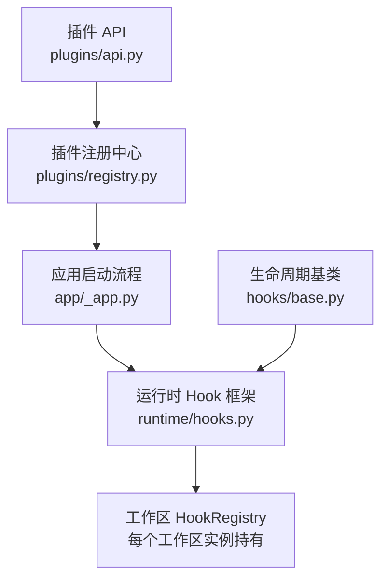
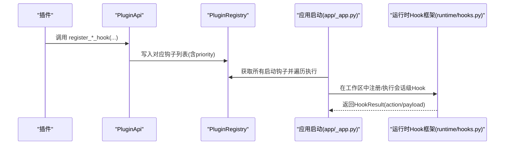
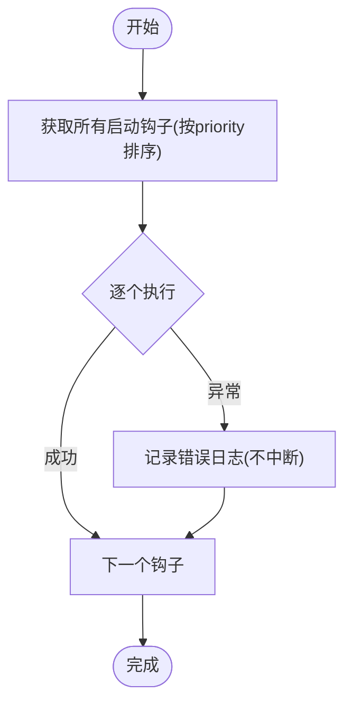
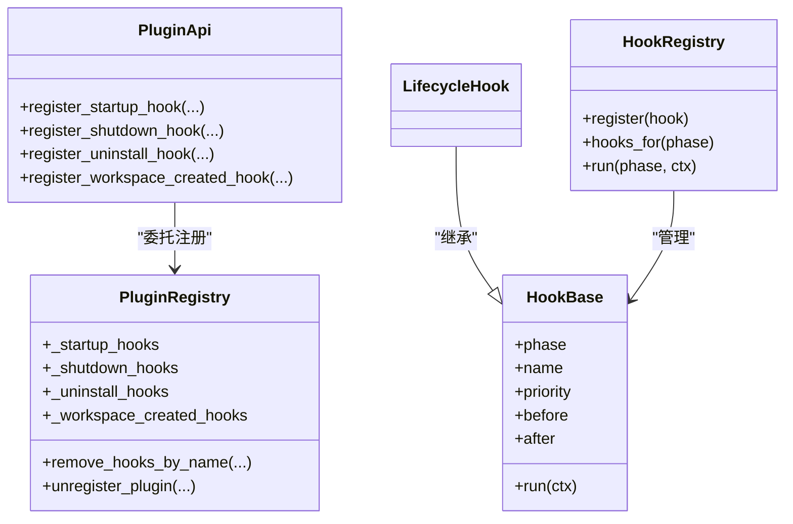

# Hook 钩子插件

<cite>
**本文引用的文件**
- [src/qwenpaw/plugins/api.py](file://src/qwenpaw/plugins/api.py)
- [src/qwenpaw/plugins/registry.py](file://src/qwenpaw/plugins/registry.py)
- [src/qwenpaw/runtime/hooks.py](file://src/qwenpaw/runtime/hooks.py)
- [src/qwenpaw/hooks/base.py](file://src/qwenpaw/hooks/base.py)
- [src/qwenpaw/app/_app.py](file://src/qwenpaw/app/_app.py)
- [tests/integration/test_plugin_types.py](file://tests/integration/test_plugin_types.py)
</cite>

## 目录
1. [简介](#简介)
2. [项目结构](#项目结构)
3. [核心组件](#核心组件)
4. [架构总览](#架构总览)
5. [详细组件分析](#详细组件分析)
6. [依赖关系分析](#依赖关系分析)
7. [性能与并发特性](#性能与并发特性)
8. [故障排除指南](#故障排除指南)
9. [结论](#结论)
10. [附录：最佳实践与示例路径](#附录最佳实践与示例路径)

## 简介
本文件面向 QwenPaw 的 Hook 钩子插件开发者，系统性说明以下能力：
- 生命周期钩子 API：register_startup_hook()、register_shutdown_hook()、register_uninstall_hook()、register_workspace_created_hook()
- 执行优先级机制与排序策略
- 异步支持（同步/异步回调均可）
- 错误处理策略（异常传播、日志记录、短路控制）
- 启动钩子与会话钩子的完整实现思路与参考路径
- 高级特性：生命周期管理、依赖注入、状态同步
- 开发最佳实践与常见问题排查

## 项目结构
围绕 Hook 体系的关键代码位置如下：
- 插件对外 API：src/qwenpaw/plugins/api.py
- 插件注册中心：src/qwenpaw/plugins/registry.py
- 运行时 Hook 抽象与调度：src/qwenpaw/runtime/hooks.py
- 生命周期基类：src/qwenpaw/hooks/base.py
- 应用启动阶段集成：src/qwenpaw/app/_app.py
- 集成测试用例（验证卸载钩子触发等）：tests/integration/test_plugin_types.py

图表来源
- [src/qwenpaw/plugins/api.py:250-393](file://src/qwenpaw/plugins/api.py#L250-L393)
- [src/qwenpaw/plugins/registry.py:472-628](file://src/qwenpaw/plugins/registry.py#L472-L628)
- [src/qwenpaw/app/_app.py:618-628](file://src/qwenpaw/app/_app.py#L618-L628)
- [src/qwenpaw/runtime/hooks.py:256-313](file://src/qwenpaw/runtime/hooks.py#L256-L313)
- [src/qwenpaw/hooks/base.py:22-26](file://src/qwenpaw/hooks/base.py#L22-L26)

章节来源
- [src/qwenpaw/plugins/api.py:250-393](file://src/qwenpaw/plugins/api.py#L250-L393)
- [src/qwenpaw/plugins/registry.py:472-628](file://src/qwenpaw/plugins/registry.py#L472-L628)
- [src/qwenpaw/app/_app.py:618-628](file://src/qwenpaw/app/_app.py#L618-L628)
- [src/qwenpaw/runtime/hooks.py:256-313](file://src/qwenpaw/runtime/hooks.py#L256-L313)
- [src/qwenpaw/hooks/base.py:22-26](file://src/qwenpaw/hooks/base.py#L22-L26)

## 核心组件
- 插件 API（PluginApi）
  - 提供 register_startup_hook/register_shutdown_hook/register_uninstall_hook/register_workspace_created_hook 等注册方法
  - 内部将注册请求转发到 PluginRegistry
- 插件注册中心（PluginRegistry）
  - 维护四类钩子列表：启动、关闭、卸载、工作区创建
  - 按 priority 升序排序（数值越小越先执行）
  - 提供 remove_hooks_by_name/unregister_plugin 等清理接口
- 运行时 Hook 框架（HookBase/HookRegistry）
  - 定义 Phase、HookContext、HookResult、HookAction
  - 支持 before/after 约束与拓扑排序，冲突时抛出 HookCycleError
  - 支持 SHORT_CIRCUIT/SKIP_AGENT 控制流
- 生命周期基类（LifecycleHook）
  - 用于“始终运行”的跨模式钩子，继承自 HookBase

章节来源
- [src/qwenpaw/plugins/api.py:250-393](file://src/qwenpaw/plugins/api.py#L250-L393)
- [src/qwenpaw/plugins/registry.py:472-628](file://src/qwenpaw/plugins/registry.py#L472-L628)
- [src/qwenpaw/runtime/hooks.py:145-313](file://src/qwenpaw/runtime/hooks.py#L145-L313)
- [src/qwenpaw/hooks/base.py:22-26](file://src/qwenpaw/hooks/base.py#L22-L26)

## 架构总览
下图展示从插件注册到应用启动执行的端到端流程。

图表来源
- [src/qwenpaw/plugins/api.py:250-393](file://src/qwenpaw/plugins/api.py#L250-L393)
- [src/qwenpaw/plugins/registry.py:472-628](file://src/qwenpaw/plugins/registry.py#L472-L628)
- [src/qwenpaw/app/_app.py:618-628](file://src/qwenpaw/app/_app.py#L618-L628)
- [src/qwenpaw/runtime/hooks.py:293-313](file://src/qwenpaw/runtime/hooks.py#L293-L313)

## 详细组件分析

### 插件 API：生命周期钩子注册
- register_startup_hook(hook_name, callback, priority=100)
  - 在应用启动时按 priority 升序执行；支持同步/异步回调
- register_shutdown_hook(hook_name, callback, priority=100)
  - 在应用关闭时按 priority 升序执行；支持同步/异步回调
- register_uninstall_hook(hook_name, callback, priority=100)
  - 仅在插件被显式卸载时触发；回调接收关键字参数 plugin_id、delete_files
- register_workspace_created_hook(hook_name, callback, priority=100)
  - 在新工作区创建时触发；回调接收 workspace_info 字典（至少包含 agent_id、workspace_dir）

注意：
- 所有钩子均支持同步或异步回调
- 同一类型钩子按 priority 升序执行（数值越小越早）
- 注册成功后会记录日志，便于追踪

章节来源
- [src/qwenpaw/plugins/api.py:250-393](file://src/qwenpaw/plugins/api.py#L250-L393)

### 插件注册中心：存储与排序
- 数据结构
  - _startup_hooks/_shutdown_hooks/_uninstall_hooks/_workspace_created_hooks：均为 HookRegistration 列表
- 排序策略
  - 每次注册后按 priority 升序重排，保证执行顺序稳定可预期
- 清理能力
  - remove_hooks_by_name(plugin_id, hook_names)：按名称移除指定钩子
  - unregister_plugin(plugin_id)：清空该插件的所有内存注册项（包括 HTTP 路由、频道、提示段等）

章节来源
- [src/qwenpaw/plugins/registry.py:472-628](file://src/qwenpaw/plugins/registry.py#L472-L628)
- [src/qwenpaw/plugins/registry.py:934-992](file://src/qwenpaw/plugins/registry.py#L934-L992)

### 运行时 Hook 框架：上下文、动作与执行
- HookContext
  - 暴露 request/session/agent/workspace 等信息，以及 input_msgs/context_injections/mode_state/extras 等扩展点
- HookResult/HookAction
  - CONTINUE：继续执行后续钩子
  - SHORT_CIRCUIT：立即结束当前阶段，但仍会执行 ON_ERROR/FINALLY 等收尾逻辑
  - SKIP_AGENT：跳过两个固定步骤（构建与执行），但其他阶段仍按序执行
- HookRegistry
  - 支持 before/after 声明式排序，内部进行拓扑排序
  - 若存在循环依赖，抛出 HookCycleError
  - run(phase, ctx) 按拓扑顺序依次 await 执行各钩子

章节来源
- [src/qwenpaw/runtime/hooks.py:46-112](file://src/qwenpaw/runtime/hooks.py#L46-L112)
- [src/qwenpaw/runtime/hooks.py:145-253](file://src/qwenpaw/runtime/hooks.py#L145-L253)
- [src/qwenpaw/runtime/hooks.py:256-313](file://src/qwenpaw/runtime/hooks.py#L256-L313)

### 生命周期基类：LifecycleHook
- 用于“始终运行”的跨模式钩子（如会话加载/保存、引导、技能环境、定时任务、上下文变量清理等）
- 与 ModeGatedHook 的区别在于是否受模式门控

章节来源
- [src/qwenpaw/hooks/base.py:22-26](file://src/qwenpaw/hooks/base.py#L22-L26)

### 应用启动集成：启动钩子执行与错误处理
- 应用启动阶段会遍历所有已注册的启动钩子并执行
- 单个钩子执行失败会被捕获并记录错误日志，不会中断其余钩子执行

图表来源
- [src/qwenpaw/app/_app.py:618-628](file://src/qwenpaw/app/_app.py#L618-L628)

章节来源
- [src/qwenpaw/app/_app.py:618-628](file://src/qwenpaw/app/_app.py#L618-L628)

### 卸载钩子触发验证（集成测试）
- 通过上传一个注册了卸载钩子的插件包，删除插件后断言卸载标记文件生成，证明卸载钩子确实被触发

章节来源
- [tests/integration/test_plugin_types.py:634-667](file://tests/integration/test_plugin_types.py#L634-L667)

## 依赖关系分析
- 插件 API 依赖注册中心进行持久化存储
- 应用启动流程依赖注册中心读取启动钩子并执行
- 运行时 Hook 框架独立于插件 API，由工作区在会话期使用
- LifecycleHook 作为运行时 Hook 的便捷基类，简化“始终运行”场景

图表来源
- [src/qwenpaw/plugins/api.py:250-393](file://src/qwenpaw/plugins/api.py#L250-L393)
- [src/qwenpaw/plugins/registry.py:472-628](file://src/qwenpaw/plugins/registry.py#L472-L628)
- [src/qwenpaw/runtime/hooks.py:145-313](file://src/qwenpaw/runtime/hooks.py#L145-L313)
- [src/qwenpaw/hooks/base.py:22-26](file://src/qwenpaw/hooks/base.py#L22-L26)

章节来源
- [src/qwenpaw/plugins/api.py:250-393](file://src/qwenpaw/plugins/api.py#L250-L393)
- [src/qwenpaw/plugins/registry.py:472-628](file://src/qwenpaw/plugins/registry.py#L472-L628)
- [src/qwenpaw/runtime/hooks.py:145-313](file://src/qwenpaw/runtime/hooks.py#L145-L313)
- [src/qwenpaw/hooks/base.py:22-26](file://src/qwenpaw/hooks/base.py#L22-L26)

## 性能与并发特性
- 优先级排序
  - 注册时即插入并按 priority 升序排序，时间复杂度 O(n log n)，n 为同类型钩子数量
- 异步支持
  - 所有回调均支持同步/异步；运行时以 await 方式执行，避免阻塞事件循环
- 拓扑排序
  - 基于 before/after 约束进行拓扑排序，检测环并快速失败，避免运行时死锁
- 短路控制
  - SHORT_CIRCUIT 可提前结束当前阶段，减少不必要的计算

[本节为通用性能讨论，无需具体文件引用]

## 故障排除指南
- 钩子未执行
  - 检查 priority 设置是否正确（数值越小越早）
  - 确认注册发生在应用启动前（例如热插拔场景需确保在路由内同步执行）
- 卸载钩子未触发
  - 确认通过卸载接口删除插件；集成测试覆盖了此行为
- 运行时 Hook 顺序异常
  - 检查 before/after 是否存在循环依赖；若有，会抛出 HookCycleError
- 异常导致中断
  - 启动钩子异常会被捕获并记录日志，不会中断其他钩子；建议在各钩子内部做好 try/except 与幂等性保护

章节来源
- [src/qwenpaw/app/_app.py:618-628](file://src/qwenpaw/app/_app.py#L618-L628)
- [tests/integration/test_plugin_types.py:634-667](file://tests/integration/test_plugin_types.py#L634-L667)
- [src/qwenpaw/runtime/hooks.py:248-253](file://src/qwenpaw/runtime/hooks.py#L248-L253)

## 结论
QwenPaw 的 Hook 体系提供了清晰的生命周期扩展点与强大的运行时编排能力。通过统一的优先级与拓扑排序机制，插件可以安全地参与系统初始化、资源清理、工作区配置与运行时增强。结合异步支持与短路控制，既能满足高性能需求，也能保持良好可观测性与可维护性。

[本节为总结性内容，无需具体文件引用]

## 附录：最佳实践与示例路径
- 启动钩子（初始化 SDK、预热缓存等）
  - 参考路径：[src/qwenpaw/plugins/api.py:250-281](file://src/qwenpaw/plugins/api.py#L250-L281)
- 关闭钩子（释放连接、持久化状态）
  - 参考路径：[src/qwenpaw/plugins/api.py:283-313](file://src/qwenpaw/plugins/api.py#L283-L313)
- 卸载钩子（一次性清理：技能、清单、猴子补丁）
  - 参考路径：[src/qwenpaw/plugins/api.py:315-356](file://src/qwenpaw/plugins/api.py#L315-L356)
- 工作区创建钩子（为新工作区预置资源）
  - 参考路径：[src/qwenpaw/plugins/api.py:358-393](file://src/qwenpaw/plugins/api.py#L358-L393)
- 运行时 Hook（会话级增强：引导、错误归一化、媒体处理等）
  - 参考路径：
    - [src/qwenpaw/runtime/hooks.py:145-313](file://src/qwenpaw/runtime/hooks.py#L145-L313)
    - [src/qwenpaw/hooks/base.py:22-26](file://src/qwenpaw/hooks/base.py#L22-L26)
- 应用启动集成与错误处理
  - 参考路径：[src/qwenpaw/app/_app.py:618-628](file://src/qwenpaw/app/_app.py#L618-L628)
- 卸载钩子触发的集成验证
  - 参考路径：[tests/integration/test_plugin_types.py:634-667](file://tests/integration/test_plugin_types.py#L634-L667)

[本节为指引性内容，无需具体文件引用]