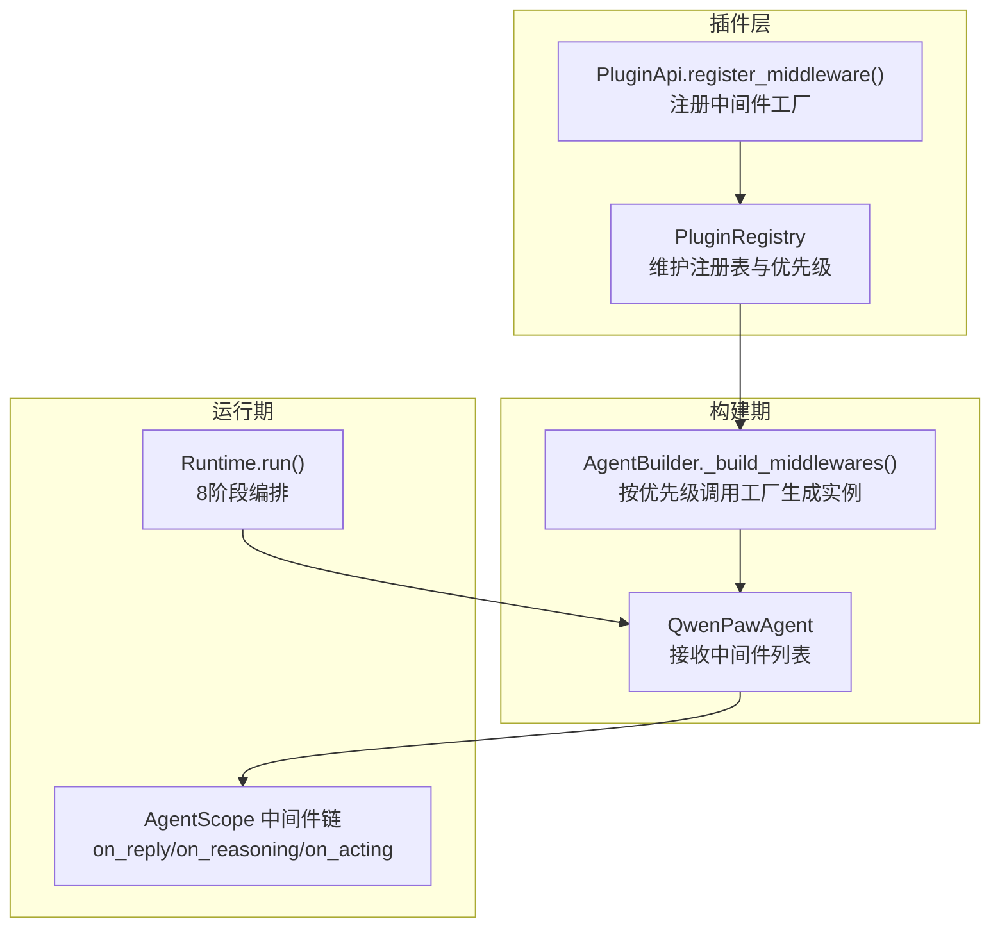
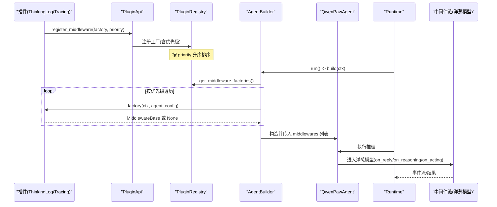
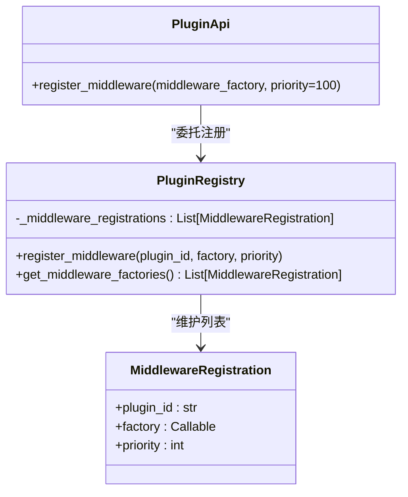
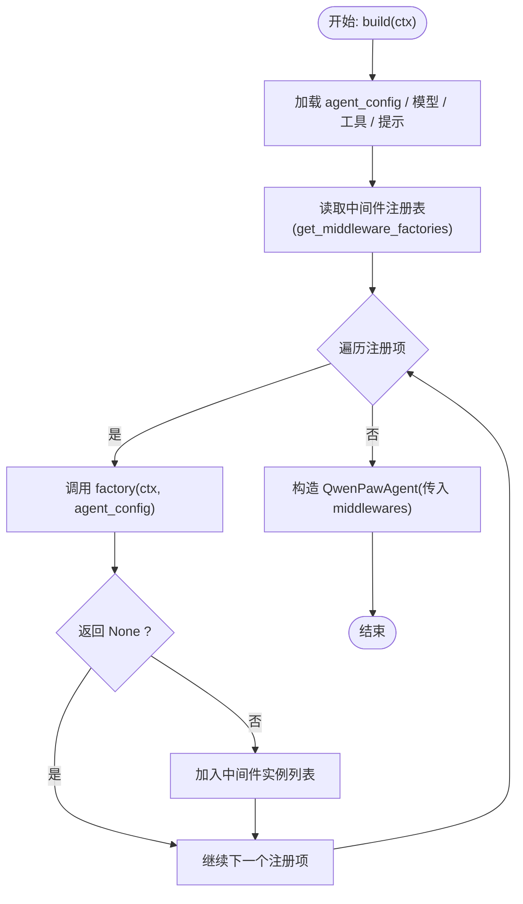
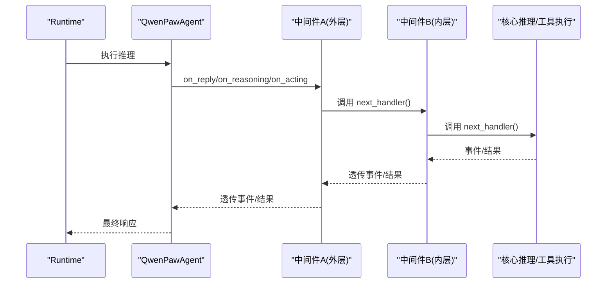
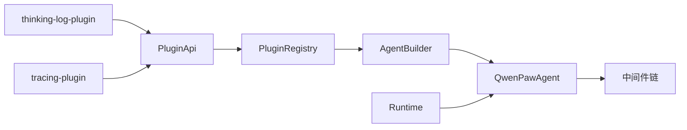

# Middleware 中间件插件

<cite>
**本文引用的文件**   
- [src/qwenpaw/plugins/api.py](file://src/qwenpaw/plugins/api.py)
- [src/qwenpaw/plugins/registry.py](file://src/qwenpaw/plugins/registry.py)
- [src/qwenpaw/runtime/builder.py](file://src/qwenpaw/runtime/builder.py)
- [src/qwenpaw/runtime/runtime.py](file://src/qwenpaw/runtime/runtime.py)
- [src/qwenpaw/agents/middlewares.py](file://src/qwenpaw/agents/middlewares.py)
- [plugins/middleware-demo/thinking-log-middleware/thinking_log_plugin.py](file://plugins/middleware-demo/thinking-log-middleware/thinking_log_plugin.py)
- [plugins/middleware-demo/tracing-middleware/tracing_plugin.py](file://plugins/middleware-demo/tracing-middleware/tracing_plugin.py)
- [plugins/middleware-demo/README.md](file://plugins/middleware-demo/README.md)
</cite>

## 目录
1. [简介](#简介)
2. [项目结构](#项目结构)
3. [核心组件](#核心组件)
4. [架构总览](#架构总览)
5. [详细组件分析](#详细组件分析)
6. [依赖关系分析](#依赖关系分析)
7. [性能考虑](#性能考虑)
8. [故障排查指南](#故障排查指南)
9. [结论](#结论)
10. [附录](#附录)

## 简介
本章节面向希望为 QwenPaw 开发 AgentScope 中间件的开发者，系统性说明如何通过插件机制注册中间件、实现洋葱模型请求处理管道、优先级排序、上下文传递、生命周期管理与错误处理策略，并给出“思考日志中间件”的完整示例路径与最佳实践。

## 项目结构
QwenPaw 的中间件体系由以下关键部分组成：
- 插件 API：提供 register_middleware() 接口，用于注册中间件工厂函数
- 插件注册中心：集中管理所有中间件注册信息并按优先级排序
- 构建器：在每次请求组装 Agent 时，按优先级调用工厂生成中间件实例，注入到 Agent 的中间件链
- 运行时：负责整体 8 阶段编排，Agent 执行期间中间件通过 on_reply/on_reasoning/on_acting 等钩子参与处理
- 内置中间件：如 MemoryMiddleware、ToolResultPruningMiddleware、LangfuseToolSpanMiddleware 等
- 示例插件：thinking-log-middleware 与 tracing-middleware，演示如何注册与使用

图表来源
- [src/qwenpaw/plugins/api.py:448-481](file://src/qwenpaw/plugins/api.py#L448-L481)
- [src/qwenpaw/plugins/registry.py:171-207](file://src/qwenpaw/plugins/registry.py#L171-L207)
- [src/qwenpaw/runtime/builder.py:277-307](file://src/qwenpaw/runtime/builder.py#L277-L307)
- [src/qwenpaw/runtime/runtime.py:49-140](file://src/qwenpaw/runtime/runtime.py#L49-L140)

章节来源
- [src/qwenpaw/plugins/api.py:448-481](file://src/qwenpaw/plugins/api.py#L448-L481)
- [src/qwenpaw/plugins/registry.py:171-207](file://src/qwenpaw/plugins/registry.py#L171-L207)
- [src/qwenpaw/runtime/builder.py:277-307](file://src/qwenpaw/runtime/builder.py#L277-L307)
- [src/qwenpaw/runtime/runtime.py:49-140](file://src/qwenpaw/runtime/runtime.py#L49-L140)

## 核心组件
- PluginApi.register_middleware(middleware_factory, priority=100)
  - 作用：将中间件工厂注册到全局注册中心，priority 越小越靠外（洋葱外层）
  - 工厂签名：factory(ctx, agent_config) -> MiddlewareBase | None
  - 返回 None 表示本次请求跳过该中间件
- PluginRegistry
  - 维护中间件注册列表，按 priority 升序排列
  - 暴露 get_middleware_factories() 供构建期消费
- AgentBuilder
  - 在 build() 中调用 _build_middlewares()，遍历注册表，依次调用工厂生成中间件实例
  - 将中间件列表注入 QwenPawAgent
- Runtime
  - 编排 PRE_DISPATCH/POST_DISPATCH/PRE_AGENT_BUILD/POST_AGENT_BUILD/PRE_EXECUTE/POST_RESPONSE/ON_ERROR/FINALLY 等阶段
  - 在固定步骤中构建并执行 Agent，中间件在 Agent 内部以洋葱模型包裹推理循环
- 内置中间件
  - MemoryMiddleware：系统提示注入、自动记忆搜索与持久化
  - ToolResultPruningMiddleware：工具输出裁剪，控制上下文大小
  - LangfuseToolSpanMiddleware：记录工具执行的观测数据

章节来源
- [src/qwenpaw/plugins/api.py:448-481](file://src/qwenpaw/plugins/api.py#L448-L481)
- [src/qwenpaw/plugins/registry.py:171-207](file://src/qwenpaw/plugins/registry.py#L171-L207)
- [src/qwenpaw/runtime/builder.py:277-307](file://src/qwenpaw/runtime/builder.py#L277-L307)
- [src/qwenpaw/agents/middlewares.py:46-329](file://src/qwenpaw/agents/middlewares.py#L46-L329)
- [src/qwenpaw/agents/middlewares.py:331-653](file://src/qwenpaw/agents/middlewares.py#L331-L653)
- [src/qwenpaw/agents/middlewares.py:655-699](file://src/qwenpaw/agents/middlewares.py#L655-L699)

## 架构总览
下图展示从插件注册到请求执行的端到端流程，包括中间件工厂的优先级排序与洋葱模型的执行顺序。

图表来源
- [src/qwenpaw/plugins/api.py:448-481](file://src/qwenpaw/plugins/api.py#L448-L481)
- [src/qwenpaw/plugins/registry.py:171-207](file://src/qwenpaw/plugins/registry.py#L171-L207)
- [src/qwenpaw/runtime/builder.py:277-307](file://src/qwenpaw/runtime/builder.py#L277-L307)
- [src/qwenpaw/runtime/runtime.py:49-140](file://src/qwenpaw/runtime/runtime.py#L49-L140)

## 详细组件分析

### 插件 API 与注册中心
- PluginApi.register_middleware
  - 透传至 PluginRegistry.register_middleware
  - 支持 priority 参数，默认 100；数值越小越外层
- PluginRegistry
  - 维护 _middleware_registrations 列表
  - 插入后按 priority 排序
  - 提供 get_middleware_factories() 给构建期使用

图表来源
- [src/qwenpaw/plugins/api.py:448-481](file://src/qwenpaw/plugins/api.py#L448-L481)
- [src/qwenpaw/plugins/registry.py:87-92](file://src/qwenpaw/plugins/registry.py#L87-L92)
- [src/qwenpaw/plugins/registry.py:171-207](file://src/qwenpaw/plugins/registry.py#L171-L207)

章节来源
- [src/qwenpaw/plugins/api.py:448-481](file://src/qwenpaw/plugins/api.py#L448-L481)
- [src/qwenpaw/plugins/registry.py:87-92](file://src/qwenpaw/plugins/registry.py#L87-L92)
- [src/qwenpaw/plugins/registry.py:171-207](file://src/qwenpaw/plugins/registry.py#L171-L207)

### 构建期：中间件装配
- AgentBuilder.build()
  - 加载 agent_config、模型、工具集、系统提示
  - 调用 _build_middlewares(ctx, agent_config) 获取中间件列表
  - 将 middlewares 注入 QwenPawAgent
- 中间件装配细节
  - 遍历注册表，按 priority 从小到大调用工厂
  - 工厂可基于 ctx/agent_config 条件返回 None 以跳过
  - 若启用 scroll 策略，会追加其 cap_middleware

图表来源
- [src/qwenpaw/runtime/builder.py:277-307](file://src/qwenpaw/runtime/builder.py#L277-L307)
- [src/qwenpaw/plugins/registry.py:201-207](file://src/qwenpaw/plugins/registry.py#L201-L207)

章节来源
- [src/qwenpaw/runtime/builder.py:277-307](file://src/qwenpaw/runtime/builder.py#L277-L307)

### 运行期：洋葱模型与钩子
- Runtime.run()
  - 统一编排 8 个阶段，包含短路与跳过逻辑
  - 在固定步骤中构建并执行 Agent
- 中间件钩子
  - on_reply：包裹回复流，适合前后置处理
  - on_reasoning：捕获模型推理流事件（如 ThinkingBlockDeltaEvent、TextBlockDeltaEvent）
  - on_acting：拦截工具调用与结果（ToolResponse），适合计时、裁剪、观测

图表来源
- [src/qwenpaw/runtime/runtime.py:49-140](file://src/qwenpaw/runtime/runtime.py#L49-L140)
- [src/qwenpaw/agents/middlewares.py:46-329](file://src/qwenpaw/agents/middlewares.py#L46-L329)
- [src/qwenpaw/agents/middlewares.py:331-653](file://src/qwenpaw/agents/middlewares.py#L331-L653)

章节来源
- [src/qwenpaw/runtime/runtime.py:49-140](file://src/qwenpaw/runtime/runtime.py#L49-L140)
- [src/qwenpaw/agents/middlewares.py:46-329](file://src/qwenpaw/agents/middlewares.py#L46-L329)
- [src/qwenpaw/agents/middlewares.py:331-653](file://src/qwenpaw/agents/middlewares.py#L331-L653)

### 思考日志中间件示例（完整实现路径）
- 插件入口
  - 定义 ThinkingLogPlugin.register(api)，调用 api.register_middleware(_thinking_log_factory, priority=80)
- 工厂函数
  - _thinking_log_factory(ctx, agent_config) -> ThinkingLogMiddleware
  - 无条件返回实例，始终激活
- 中间件类
  - 继承 MiddlewareBase
  - 实现 on_reasoning：遍历 next_handler() 的事件流，识别 ThinkingBlockDeltaEvent 与 TextBlockDeltaEvent，打印到 stdout
- 安装与卸载
  - 参考 demo README 中的安装命令

章节来源
- [plugins/middleware-demo/thinking-log-middleware/thinking_log_plugin.py:23-66](file://plugins/middleware-demo/thinking-log-middleware/thinking_log_plugin.py#L23-L66)
- [plugins/middleware-demo/README.md:1-51](file://plugins/middleware-demo/README.md#L1-L51)

### 追踪中间件示例（完整实现路径）
- 插件入口
  - TracingPlugin.register(api)，调用 api.register_middleware(_tracing_factory, priority=50)
- 工厂函数
  - _tracing_factory(ctx, agent_config) -> TracingMiddleware | None
  - 仅在环境变量 QWENPAW_TRACE 存在且 workspace_dir 可用时激活
- 中间件类
  - 实现 on_acting：记录工具名称、输入、耗时，写入工作区 trace.log
- 安装与卸载
  - 参考 demo README 中的安装命令

章节来源
- [plugins/middleware-demo/tracing-middleware/tracing_plugin.py:24-79](file://plugins/middleware-demo/tracing-middleware/tracing_plugin.py#L24-L79)
- [plugins/middleware-demo/README.md:1-51](file://plugins/middleware-demo/README.md#L1-L51)

### 内置中间件概览
- MemoryMiddleware
  - 系统提示注入、自动记忆搜索与持久化、压缩上下文时的触发
- ToolResultPruningMiddleware
  - 对工具输出进行分级裁剪，避免上下文溢出
- LangfuseToolSpanMiddleware
  - 将工具执行作为观测记录到 Langfuse

章节来源
- [src/qwenpaw/agents/middlewares.py:46-329](file://src/qwenpaw/agents/middlewares.py#L46-L329)
- [src/qwenpaw/agents/middlewares.py:331-653](file://src/qwenpaw/agents/middlewares.py#L331-L653)
- [src/qwenpaw/agents/middlewares.py:655-699](file://src/qwenpaw/agents/middlewares.py#L655-L699)

## 依赖关系分析
- 插件 API 与注册中心解耦：插件仅依赖 PluginApi，注册中心由宿主维护
- 构建期依赖注册中心：AgentBuilder 通过注册中心获取中间件工厂并按优先级装配
- 运行期依赖 Agent 与中间件链：Runtime 编排阶段，中间件通过钩子参与处理
- 示例插件依赖 PluginApi 与 AgentScope 事件类型

图表来源
- [src/qwenpaw/plugins/api.py:448-481](file://src/qwenpaw/plugins/api.py#L448-L481)
- [src/qwenpaw/plugins/registry.py:171-207](file://src/qwenpaw/plugins/registry.py#L171-L207)
- [src/qwenpaw/runtime/builder.py:277-307](file://src/qwenpaw/runtime/builder.py#L277-L307)
- [src/qwenpaw/runtime/runtime.py:49-140](file://src/qwenpaw/runtime/runtime.py#L49-L140)
- [plugins/middleware-demo/thinking-log-middleware/thinking_log_plugin.py:59-66](file://plugins/middleware-demo/thinking-log-middleware/thinking_log_plugin.py#L59-L66)
- [plugins/middleware-demo/tracing-middleware/tracing_plugin.py:72-79](file://plugins/middleware-demo/tracing-middleware/tracing_plugin.py#L72-L79)

章节来源
- [src/qwenpaw/plugins/api.py:448-481](file://src/qwenpaw/plugins/api.py#L448-L481)
- [src/qwenpaw/plugins/registry.py:171-207](file://src/qwenpaw/plugins/registry.py#L171-L207)
- [src/qwenpaw/runtime/builder.py:277-307](file://src/qwenpaw/runtime/builder.py#L277-L307)
- [src/qwenpaw/runtime/runtime.py:49-140](file://src/qwenpaw/runtime/runtime.py#L49-L140)

## 性能考虑
- 中间件应轻量：避免阻塞 I/O 或重型计算，必要时使用异步或线程池
- 裁剪与缓存：对大输出进行裁剪（如 ToolResultPruningMiddleware），减少上下文膨胀
- 条件激活：通过工厂函数与环境变量/配置判断是否启用（如 tracing-middleware）
- 批量与节流：对高频操作（如日志、统计）做节流或批处理
- 观测开销：外部观测（如 Langfuse）需检查可用性并降级

## 故障排查指南
- 中间件未生效
  - 检查插件是否正确安装与加载
  - 确认 register_middleware 的 priority 设置是否符合预期
  - 查看工厂是否返回 None（条件不满足）
- 日志无输出
  - 对于 tracing-middleware，确认环境变量 QWENPAW_TRACE 已设置
  - 检查工作区目录是否存在并可写
- 上下文过大
  - 启用或调整 ToolResultPruningMiddleware 的参数
  - 检查是否有中间件向上下文注入大量内容
- 异常与取消
  - Runtime 会在 ON_ERROR 与 FINALLY 阶段进行清理与保存
  - 确保中间件在 finally 块中释放资源

章节来源
- [src/qwenpaw/runtime/runtime.py:142-205](file://src/qwenpaw/runtime/runtime.py#L142-L205)
- [plugins/middleware-demo/tracing-middleware/tracing_plugin.py:58-69](file://plugins/middleware-demo/tracing-middleware/tracing_plugin.py#L58-L69)
- [src/qwenpaw/agents/middlewares.py:331-653](file://src/qwenpaw/agents/middlewares.py#L331-L653)

## 结论
通过 PluginApi.register_middleware 与 AgentScope 的洋葱模型，QwenPaw 提供了灵活、可扩展的中间件机制。开发者可以借助中间件完成日志、追踪、裁剪、观测等横切关注点，并通过优先级控制执行顺序。结合 Runtime 的阶段编排与错误处理，中间件可以在保证稳定性的同时提升系统的可观测性与可控性。

## 附录
- 最佳实践
  - 明确职责：每个中间件只做一件事
  - 幂等与容错：对异常进行捕获与降级
  - 可配置：通过工厂函数读取 ctx/agent_config 动态决定行为
  - 可观测：集成观测与指标收集，便于定位问题
- 调试技巧
  - 使用 thinking-log-middleware 观察推理流
  - 使用 tracing-middleware 记录工具调用耗时
  - 在工厂函数中加入条件开关，快速启停中间件