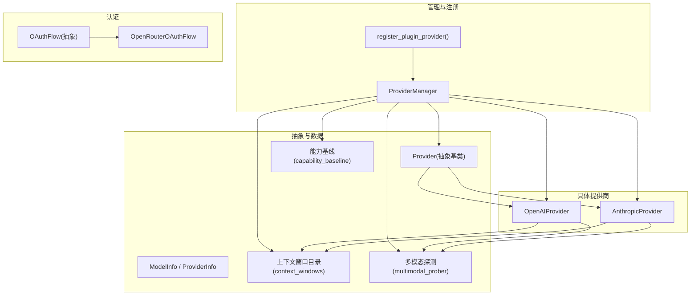
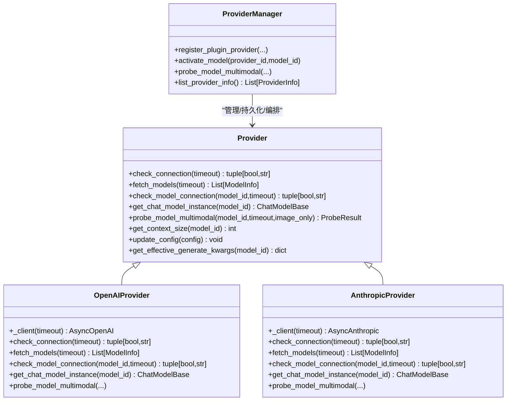
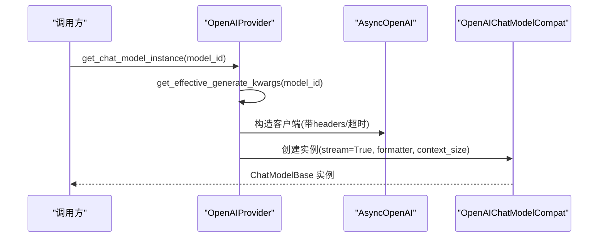
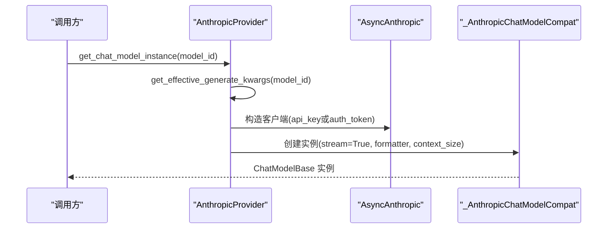
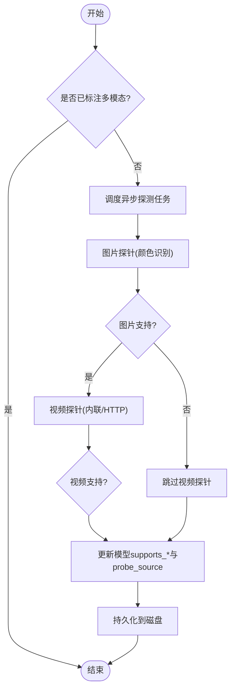
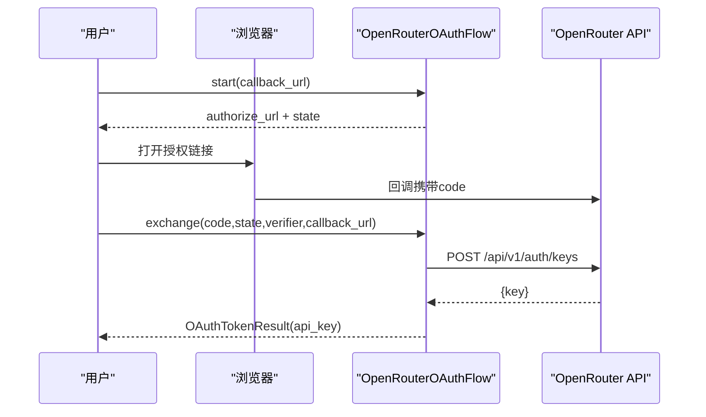
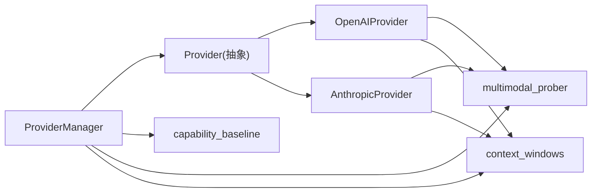

# Provider 模型提供商插件

<cite>
**本文引用的文件**   
- [provider.py](file://src/qwenpaw/providers/provider.py)
- [openai_provider.py](file://src/qwenpaw/providers/openai_provider.py)
- [anthropic_provider.py](file://src/qwenpaw/providers/anthropic_provider.py)
- [provider_manager.py](file://src/qwenpaw/providers/provider_manager.py)
- [oauth/base.py](file://src/qwenpaw/providers/oauth/base.py)
- [oauth/openrouter_flow.py](file://src/qwenpaw/providers/oauth/openrouter_flow.py)
- [multimodal_prober.py](file://src/qwenpaw/providers/multimodal_prober.py)
- [context_windows.py](file://src/qwenpaw/providers/context_windows.py)
- [capability_baseline.py](file://src/qwenpaw/providers/capability_baseline.py)
</cite>

## 目录
1. [简介](#简介)
2. [项目结构](#项目结构)
3. [核心组件](#核心组件)
4. [架构总览](#架构总览)
5. [详细组件分析](#详细组件分析)
6. [依赖关系分析](#依赖关系分析)
7. [性能与可靠性](#性能与可靠性)
8. [故障排查指南](#故障排查指南)
9. [结论](#结论)
10. [附录：最佳实践与调试技巧](#附录最佳实践与调试技巧)

## 简介
本文件面向希望扩展 QwenPaw 的“Provider 模型提供商”能力的开发者，系统性说明如何新增一个 AI 模型提供商插件。内容涵盖：
- BaseProvider 基类（Provider）的继承与抽象方法实现
- chat_model 方法与 AgentScope ChatModel 集成
- API 调用封装、流式响应处理、错误重试与速率限制
- register_provider() 注册 API 的使用方式与 metadata 元数据规范
- OAuth 认证流程（以 OpenRouter 为例）
- 模型能力检测（图像/视频）、上下文窗口管理、多模态支持
- OpenAI 与 Anthropic 提供商的完整实现示例
- 新提供商集成的最佳实践与调试技巧

## 项目结构
QwenPaw 的 Provider 体系位于 src/qwenpaw/providers 下，核心由“抽象基类 + 具体提供商 + 管理器 + 工具模块”组成：
- 抽象层：Provider 基类定义统一接口（连接检查、模型发现、实例化 ChatModel、多模态探测等）
- 具体实现：OpenAIProvider、AnthropicProvider 等
- 管理层：ProviderManager 负责内置/自定义/插件提供商的加载、持久化、激活、探测等
- 辅助能力：OAuth 基础与 OpenRouter 流程、多模态探测常量与评估、上下文窗口目录、能力基线对比

图表来源
- [provider.py:274-659](file://src/qwenpaw/providers/provider.py#L274-L659)
- [openai_provider.py:67-247](file://src/qwenpaw/providers/openai_provider.py#L67-L247)
- [anthropic_provider.py:72-302](file://src/qwenpaw/providers/anthropic_provider.py#L72-L302)
- [provider_manager.py:1334-1408](file://src/qwenpaw/providers/provider_manager.py#L1334-L1408)
- [oauth/base.py:57-95](file://src/qwenpaw/providers/oauth/base.py#L57-L95)
- [oauth/openrouter_flow.py:18-52](file://src/qwenpaw/providers/oauth/openrouter_flow.py#L18-L52)
- [multimodal_prober.py:75-162](file://src/qwenpaw/providers/multimodal_prober.py#L75-L162)
- [context_windows.py:117-140](file://src/qwenpaw/providers/context_windows.py#L117-L140)
- [capability_baseline.py:55-98](file://src/qwenpaw/providers/capability_baseline.py#L55-L98)

章节来源
- [provider.py:274-659](file://src/qwenpaw/providers/provider.py#L274-L659)
- [provider_manager.py:1334-1408](file://src/qwenpaw/providers/provider_manager.py#L1334-L1408)

## 核心组件
- Provider 抽象基类
  - 提供统一的配置与行为：连接检查、模型发现、模型连接性校验、ChatModel 实例化、上下文窗口解析、多模态探测入口、生成参数合并、思考/推理参数注入点等
  - 关键抽象方法：check_connection、fetch_models、check_model_connection、get_chat_model_instance、probe_model_multimodal
- ModelInfo / ProviderInfo
  - ModelInfo：描述单个模型的标识、名称、是否多模态、最大输出 token、输入上下文窗口、每模型生成参数覆盖、是否免费、思考/推理相关字段等
  - ProviderInfo：描述提供商元信息、API Key 前缀、是否本地、是否冻结 base_url、是否支持模型发现/连接检查、生成参数、自定义请求头、认证模式、OAuth 支持标记、分组信息等
- ProviderManager
  - 管理内置/自定义/插件提供商的注册、加载、持久化、激活、模型列表获取、多模态自动探测、能力基线对比、插件注册 API 等
- 辅助模块
  - multimodal_prober：共享的多模态探测常量与结果类型、图片/视频探测策略与答案评估
  - context_windows：已知模型上下文窗口的静态目录与解析函数
  - capability_baseline：官方文档预期的能力基线与差异报告
  - oauth：OAuth 抽象与 OpenRouter 具体流程

章节来源
- [provider.py:20-136](file://src/qwenpaw/providers/provider.py#L20-L136)
- [provider.py:137-273](file://src/qwenpaw/providers/provider.py#L137-L273)
- [provider.py:274-659](file://src/qwenpaw/providers/provider.py#L274-L659)
- [provider_manager.py:1334-1408](file://src/qwenpaw/providers/provider_manager.py#L1334-L1408)
- [multimodal_prober.py:75-162](file://src/qwenpaw/providers/multimodal_prober.py#L75-L162)
- [context_windows.py:117-140](file://src/qwenpaw/providers/context_windows.py#L117-L140)
- [capability_baseline.py:55-98](file://src/qwenpaw/providers/capability_baseline.py#L55-L98)

## 架构总览
Provider 体系通过 Provider 抽象统一对外暴露能力；ProviderManager 作为编排中心，负责生命周期与持久化；具体提供商实现各自 API 适配与特性（如 OpenAI 兼容、Anthropic 原生）。

图表来源
- [provider.py:274-659](file://src/qwenpaw/providers/provider.py#L274-L659)
- [openai_provider.py:67-247](file://src/qwenpaw/providers/openai_provider.py#L67-L247)
- [anthropic_provider.py:72-302](file://src/qwenpaw/providers/anthropic_provider.py#L72-L302)
- [provider_manager.py:1334-1408](file://src/qwenpaw/providers/provider_manager.py#L1334-L1408)

## 详细组件分析

### 抽象基类 Provider 与数据模型
- Provider 抽象方法
  - check_connection：验证当前配置可达
  - fetch_models：拉取可用模型列表
  - check_model_connection：针对特定模型进行连通性探测
  - get_chat_model_instance：返回 AgentScope ChatModel 实例（含流式、格式化器、上下文大小等）
  - probe_model_multimodal：探测图像/视频能力
- 上下文窗口解析
  - get_context_size 使用 resolve_context_window，优先级：用户显式配置 > 静态目录（可被本地服务提供者禁用）> 默认值
- 生成参数合并
  - get_effective_generate_kwargs 将 provider 级 generate_kwargs 与 model 级覆盖深度合并，并注入 max_tokens
- 思考/推理参数注入点
  - _apply_thinking_config 为子类提供注入 thinking_enabled/thinking_budget/reasoning_effort 的钩子

章节来源
- [provider.py:274-659](file://src/qwenpaw/providers/provider.py#L274-L659)
- [context_windows.py:117-140](file://src/qwenpaw/providers/context_windows.py#L117-L140)

### OpenAIProvider 实现要点
- 客户端构建
  - 基于 AsyncOpenAI，支持自定义 default_headers（例如 DashScope 平台元信息）
- 连接与模型发现
  - check_connection 调用 models.list；fetch_models 归一化为 ModelInfo 列表
- 模型连通性检查
  - check_model_connection 发送最小文本消息并消费流，确保模型真正响应
- ChatModel 实例化
  - 构造 OpenAICredential 与 OpenAIChatModelCompat，注入 stream=True、formatter（媒体裁剪）、context_size、extra_generate_kwargs
  - 根据模型名选择 max_tokens 或 max_completion_tokens
- 多模态探测
  - 图片：发送固定红色 PNG，语义判断回答颜色关键词；失败时结合错误关键字判定
  - 视频：尝试内联 base64 与外部 HTTP URL 两种格式，按颜色关键词或任意非空回答判定
- 特殊变体
  - GitHubModelsProvider 重写 check_connection，因为 /models 不可用，改用最小聊天完成请求

图表来源
- [openai_provider.py:192-247](file://src/qwenpaw/providers/openai_provider.py#L192-L247)
- [openai_provider.py:85-94](file://src/qwenpaw/providers/openai_provider.py#L85-L94)

章节来源
- [openai_provider.py:67-247](file://src/qwenpaw/providers/openai_provider.py#L67-L247)
- [openai_provider.py:118-190](file://src/qwenpaw/providers/openai_provider.py#L118-L190)
- [openai_provider.py:249-586](file://src/qwenpaw/providers/openai_provider.py#L249-L586)
- [openai_provider.py:655-706](file://src/qwenpaw/providers/openai_provider.py#L655-L706)

### AnthropicProvider 实现要点
- 客户端构建
  - 支持 api_key 与 auth_token 两种认证模式；auth_token 模式下通过自定义传输移除 x-api-key 避免冲突
- 连接与模型发现
  - check_connection 优先 models.list，若代理不支持则回退到 messages.create 轻量探测
  - fetch_models 归一化为 ModelInfo 列表
- 模型连通性检查
  - check_model_connection 发送最小文本消息并消费流
- ChatModel 实例化
  - 构造 AnthropicCredential 与 AnthropicChatModel，通过 _AnthropicChatModelCompat 注入 headers、auth_mode、strip_http_client、stream、formatter、context_size
  - 支持 thinking_enable/thinking_budget 映射
- 多模态探测
  - 仅支持图片（Anthropic 不支持视频），采用 base64 image source 与颜色关键词判定

图表来源
- [anthropic_provider.py:249-302](file://src/qwenpaw/providers/anthropic_provider.py#L249-L302)
- [anthropic_provider.py:103-118](file://src/qwenpaw/providers/anthropic_provider.py#L103-L118)

章节来源
- [anthropic_provider.py:72-302](file://src/qwenpaw/providers/anthropic_provider.py#L72-L302)
- [anthropic_provider.py:149-247](file://src/qwenpaw/providers/anthropic_provider.py#L149-L247)
- [anthropic_provider.py:304-406](file://src/qwenpaw/providers/anthropic_provider.py#L304-L406)

### 多模态能力探测流程
- 共享常量与结果
  - 使用固定尺寸的图片/视频样本与提示词，返回 ProbeResult（supports_image/supports_video/image_message/video_message）
- 评估策略
  - 图片：颜色关键词匹配（红系），必要时读取 reasoning_content
  - 视频：先尝试 base64，再尝试 HTTP URL；HTTP 场景放宽为非空即认为支持
- ProviderManager 自动探测
  - 激活模型后若 supports_multimodal 未知，后台异步执行 probe，并将结果写回模型配置与磁盘

图表来源
- [multimodal_prober.py:75-162](file://src/qwenpaw/providers/multimodal_prober.py#L75-L162)
- [provider_manager.py:1634-1676](file://src/qwenpaw/providers/provider_manager.py#L1634-L1676)
- [provider_manager.py:1769-1853](file://src/qwenpaw/providers/provider_manager.py#L1769-L1853)

章节来源
- [multimodal_prober.py:75-162](file://src/qwenpaw/providers/multimodal_prober.py#L75-L162)
- [provider_manager.py:1634-1676](file://src/qwenpaw/providers/provider_manager.py#L1634-L1676)
- [provider_manager.py:1769-1853](file://src/qwenpaw/providers/provider_manager.py#L1769-L1853)

### 上下文窗口管理
- 解析规则
  - resolve_context_window：用户显式配置 > 静态目录（可被本地服务禁用）> 默认 128k
- 目录匹配
  - 按单词边界最长匹配，覆盖多家厂商常见模型族
- Provider 集成
  - Provider.get_context_size 统一走该解析函数，保证 UI 显示与压缩触发一致

章节来源
- [context_windows.py:117-140](file://src/qwenpaw/providers/context_windows.py#L117-L140)
- [provider.py:548-571](file://src/qwenpaw/providers/provider.py#L548-L571)

### 能力基线与差异报告
- ExpectedCapabilityRegistry 维护各提供商模型的预期能力（来自官方文档）
- ProviderManager 在探测后将实际结果与期望对比，记录 false_negative/false_positive 告警

章节来源
- [capability_baseline.py:55-98](file://src/qwenpaw/providers/capability_baseline.py#L55-L98)
- [provider_manager.py:1811-1834](file://src/qwenpaw/providers/provider_manager.py#L1811-L1834)

### OAuth 认证流程（OpenRouter 示例）
- OAuthFlow 抽象
  - start：生成授权链接与 state
  - exchange：用 code 换取凭证（api_key/access_token/refresh_token）
  - refresh：可选刷新令牌
- OpenRouterOAuthFlow
  - 浏览器重定向至 openrouter.ai/auth，回调后换取永久 API Key
- Provider 元数据
  - ProviderInfo.meta.supports_oauth 标记是否支持 OAuth；ProviderManager 据此展示连接状态

图表来源
- [oauth/base.py:57-95](file://src/qwenpaw/providers/oauth/base.py#L57-L95)
- [oauth/openrouter_flow.py:18-52](file://src/qwenpaw/providers/oauth/openrouter_flow.py#L18-L52)
- [provider.py:222-233](file://src/qwenpaw/providers/provider.py#L222-L233)

章节来源
- [oauth/base.py:57-95](file://src/qwenpaw/providers/oauth/base.py#L57-L95)
- [oauth/openrouter_flow.py:18-52](file://src/qwenpaw/providers/oauth/openrouter_flow.py#L18-L52)
- [provider.py:222-233](file://src/qwenpaw/providers/provider.py#L222-L233)

### 插件注册 API：register_provider()
- 用途
  - 动态注册第三方提供商，无需修改核心代码即可接入新的 Provider 实现
- 关键参数
  - provider_id：唯一标识
  - provider_class：继承自 Provider 的具体类
  - label：显示名称
  - base_url：API 基础地址
  - metadata：附加元数据（如 chat_model、支持的模型列表、是否免费等）
- 内部行为
  - 从 provider_class 获取默认模型（若有 get_default_models）
  - 构造 ProviderInfo 并缓存到 plugin_providers
  - 后续可通过 list_provider_info/get_provider/update_provider 等统一管理

章节来源
- [provider_manager.py:2363-2482](file://src/qwenpaw/providers/provider_manager.py#L2363-L2482)

## 依赖关系分析
- Provider 与具体实现
  - OpenAIProvider、AnthropicProvider 均继承 Provider，分别对接不同 SDK 与协议
- ProviderManager 与 Provider
  - 集中管理 Provider 的生命周期、持久化、模型发现、能力探测、激活切换
- 辅助模块耦合
  - multimodal_prober：被多个 Provider 复用
  - context_windows：Provider 统一解析上下文窗口
  - capability_baseline：ProviderManager 在探测后用于对比
  - oauth：ProviderInfo.meta 控制是否启用 OAuth

图表来源
- [provider_manager.py:1334-1408](file://src/qwenpaw/providers/provider_manager.py#L1334-L1408)
- [provider.py:274-659](file://src/qwenpaw/providers/provider.py#L274-L659)
- [openai_provider.py:67-247](file://src/qwenpaw/providers/openai_provider.py#L67-L247)
- [anthropic_provider.py:72-302](file://src/qwenpaw/providers/anthropic_provider.py#L72-L302)

章节来源
- [provider_manager.py:1334-1408](file://src/qwenpaw/providers/provider_manager.py#L1334-L1408)
- [provider.py:274-659](file://src/qwenpaw/providers/provider.py#L274-L659)

## 性能与可靠性
- 流式响应
  - OpenAIProvider/AnthropicProvider 均设置 stream=True，并在 check_model_connection 中消费流以确保模型真实响应
- 错误处理
  - 捕获 APIError/异常并返回明确的状态与消息；对 400/404/405 等状态码做差异化处理
- 速率限制与重试
  - 当前 Provider 层未内置通用重试/限流逻辑；建议在上层（如应用路由或服务层）结合 rate_limiter 与重试策略
- 资源裁剪
  - 通过 formatter 限制内联媒体大小，避免超大请求导致失败或延迟

章节来源
- [openai_provider.py:118-190](file://src/qwenpaw/providers/openai_provider.py#L118-L190)
- [anthropic_provider.py:149-247](file://src/qwenpaw/providers/anthropic_provider.py#L149-L247)

## 故障排查指南
- 连接失败
  - 检查 base_url 与 api_key 是否正确；查看 check_connection 返回的错误详情
- 模型不可用
  - 使用 check_model_connection 验证目标模型；确认模型 ID 是否存在于 fetch_models 结果
- 多模态误判
  - 查看 probe 日志中的 image_message/video_message；必要时手动触发 probe_model_multimodal
- 上下文窗口不一致
  - 确认 resolve_context_window 的解析路径（用户配置/目录/默认）；本地服务需禁用目录匹配
- OAuth 问题
  - 核对 callback_url 与 state；确认 exchange 成功返回 api_key/access_token

章节来源
- [provider_manager.py:1769-1853](file://src/qwenpaw/providers/provider_manager.py#L1769-L1853)
- [provider.py:274-659](file://src/qwenpaw/providers/provider.py#L274-L659)

## 结论
通过 Provider 抽象与 ProviderManager 的统一编排，QwenPaw 实现了可扩展、可观测、可配置的模型提供商生态。新增提供商只需遵循抽象接口、实现必要方法，并通过 register_provider 注册即可无缝融入系统。同时，多模态探测、上下文窗口管理、能力基线对比与 OAuth 支持进一步提升了系统的健壮性与易用性。

## 附录：最佳实践与调试技巧
- 新增提供商步骤
  - 继承 Provider，实现 check_connection/fetch_models/check_model_connection/get_chat_model_instance/probe_model_multimodal
  - 在 get_chat_model_instance 中正确构造 ChatModel 实例（stream、formatter、context_size、extra_generate_kwargs）
  - 如需支持 OAuth，在 ProviderInfo.meta 中标记 supports_oauth，并提供 OAuthFlow 实现
  - 使用 ProviderManager.register_plugin_provider 注册，并在 UI/CLI 中配置 base_url 与密钥
- 调试建议
  - 开启详细日志，关注 probe 与 API 错误信息
  - 使用 check_model_connection 快速定位模型可用性
  - 手动触发 probe_model_multimodal(image_only=True) 加速图片能力验证
  - 检查 resolve_context_window 的结果是否与 UI 显示一致
- 注意事项
  - 本地服务提供者应重写 _context_catalog_enabled 为 False，避免云侧窗口误导
  - 谨慎设置 max_tokens/max_input_length，防止超出服务端限制
  - 对于不支持 /models 的网关，重写 check_connection 以避免误报