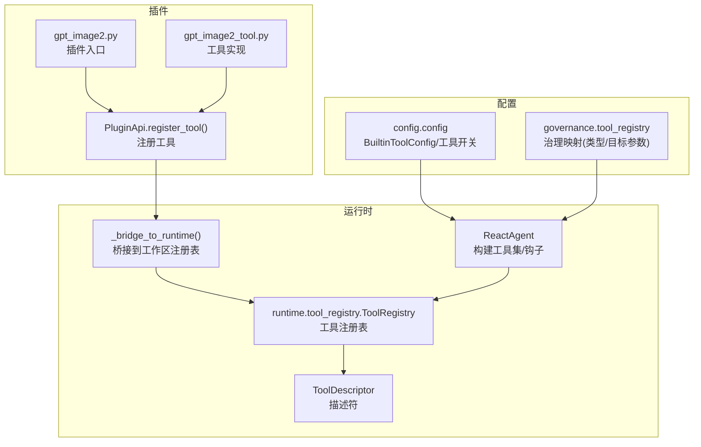
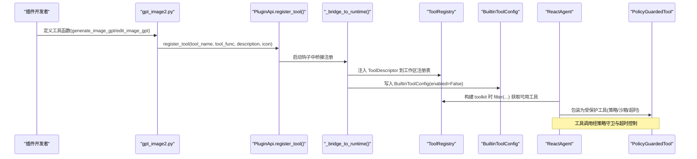
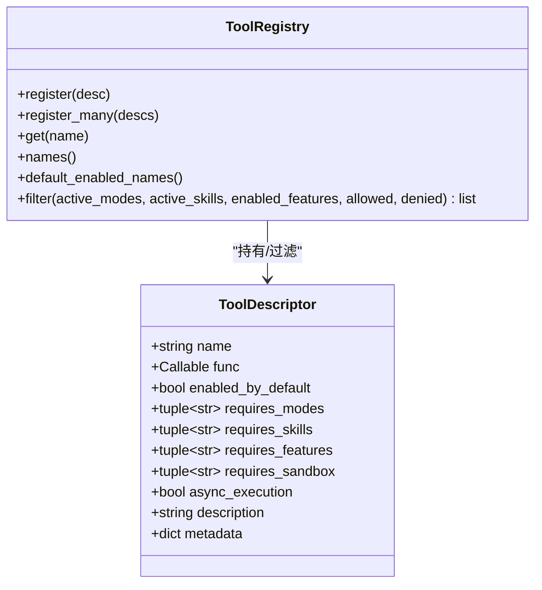
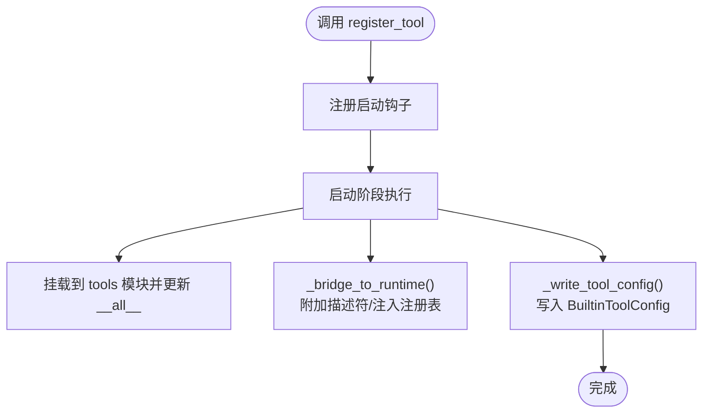
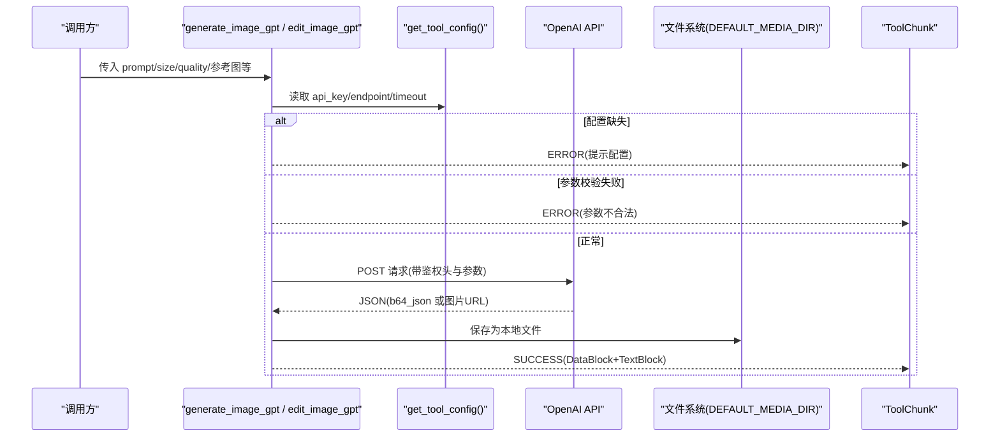
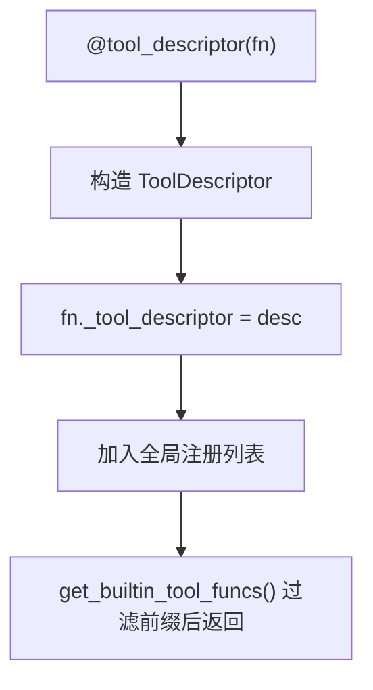
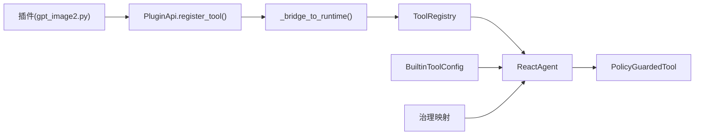

# Tool 工具插件

<cite>
**本文引用的文件**   
- [src/qwenpaw/runtime/tool_registry.py](file://src/qwenpaw/runtime/tool_registry.py)
- [src/qwenpaw/agents/tools/__init__.py](file://src/qwenpaw/agents/tools/__init__.py)
- [src/qwenpaw/plugins/api.py](file://src/qwenpaw/plugins/api.py)
- [plugins/tool/gpt-image2/gpt_image2.py](file://plugins/tool/gpt-image2/gpt_image2.py)
- [plugins/tool/gpt-image2/gpt_image2_tool.py](file://plugins/tool/gpt-image2/gpt_image2_tool.py)
- [src/qwenpaw/config/config.py](file://src/qwenpaw/config/config.py)
- [src/qwenpaw/agents/react_agent.py](file://src/qwenpaw/agents/react_agent.py)
- [src/qwenpaw/governance/tool_registry.py](file://src/qwenpaw/governance/tool_registry.py)
</cite>

## 目录
1. [简介](#简介)
2. [项目结构](#项目结构)
3. [核心组件](#核心组件)
4. [架构总览](#架构总览)
5. [详细组件分析](#详细组件分析)
6. [依赖关系分析](#依赖关系分析)
7. [性能考虑](#性能考虑)
8. [故障排查指南](#故障排查指南)
9. [结论](#结论)
10. [附录](#附录)

## 简介
本文件面向 QwenPaw 的 Tool 工具插件开发者，系统性阐述如何开发自定义工具函数、注册与运行流程、参数校验与返回值规范、异步执行支持、配置管理集成、权限控制与沙箱隔离机制，并以 GPT-Image2 工具为例给出完整实现参考。文档同时提供最佳实践、测试方法与性能优化建议，帮助你在保证安全与可维护性的前提下快速扩展 Agent 能力。

## 项目结构
QwenPaw 的工具体系围绕“描述符 + 注册表 + 运行时桥接”展开：
- 描述层：ToolDescriptor 声明式描述工具元数据（名称、默认启用、模式/技能/特性门控、沙箱需求、是否异步等）。
- 注册层：ToolRegistry 负责按工作区上下文过滤并返回可用工具集合；内置工具通过装饰器自动收集。
- 插件 API：PluginApi.register_tool() 是插件侧推荐入口，负责将工具注入到运行时与持久化配置。
- 运行时：Agent 启动时根据配置与策略生成受保护的工具调用链（含超时、治理、沙箱等）。

图表来源
- [src/qwenpaw/plugins/api.py:614-698](file://src/qwenpaw/plugins/api.py#L614-L698)
- [src/qwenpaw/runtime/tool_registry.py:170-225](file://src/qwenpaw/runtime/tool_registry.py#L170-L225)
- [src/qwenpaw/agents/react_agent.py:653-705](file://src/qwenpaw/agents/react_agent.py#L653-L705)
- [src/qwenpaw/config/config.py:1855-1883](file://src/qwenpaw/config/config.py#L1855-L1883)
- [src/qwenpaw/governance/tool_registry.py:161-204](file://src/qwenpaw/governance/tool_registry.py#L161-L204)

章节来源
- [src/qwenpaw/runtime/tool_registry.py:1-234](file://src/qwenpaw/runtime/tool_registry.py#L1-L234)
- [src/qwenpaw/agents/tools/__init__.py:1-89](file://src/qwenpaw/agents/tools/__init__.py#L1-L89)
- [src/qwenpaw/plugins/api.py:614-698](file://src/qwenpaw/plugins/api.py#L614-L698)
- [plugins/tool/gpt-image2/gpt_image2.py:1-64](file://plugins/tool/gpt-image2/gpt_image2.py#L1-L64)
- [plugins/tool/gpt-image2/gpt_image2_tool.py:1-605](file://plugins/tool/gpt-image2/gpt_image2_tool.py#L1-L605)
- [src/qwenpaw/config/config.py:1855-1883](file://src/qwenpaw/config/config.py#L1855-L1883)
- [src/qwenpaw/agents/react_agent.py:653-705](file://src/qwenpaw/agents/react_agent.py#L653-L705)
- [src/qwenpaw/governance/tool_registry.py:161-204](file://src/qwenpaw/governance/tool_registry.py#L161-L204)

## 核心组件
- ToolDescriptor：声明式工具描述，包含 name、func、enabled_by_default、requires_modes/skills/features、requires_sandbox、async_execution、description、metadata 等字段。
- ToolRegistry：维护描述符集合并提供 filter(...) 方法，依据 active_modes、active_skills、enabled_features、allowed/denied 等条件筛选。
- PluginApi.register_tool()：插件侧统一注册入口，负责：
  - 在启动阶段将工具函数挂入 qwenpaw.agents.tools 模块并追加至 __all__
  - 为函数附加 ToolDescriptor（若未显式使用 @tool_descriptor）
  - 将描述符注入各工作区的 ToolRegistry
  - 写入 BuiltinToolConfig 到当前 Agent 配置（默认禁用，用户可开启）
- ReactAgent：构建工具集时应用策略守卫、超时钩子、权限绕过（由 QwenPaw 自有 PolicyGuardedTool 接管）等。

章节来源
- [src/qwenpaw/runtime/tool_registry.py:16-45](file://src/qwenpaw/runtime/tool_registry.py#L16-L45)
- [src/qwenpaw/runtime/tool_registry.py:90-134](file://src/qwenpaw/runtime/tool_registry.py#L90-L134)
- [src/qwenpaw/plugins/api.py:614-698](file://src/qwenpaw/plugins/api.py#L614-L698)
- [src/qwenpaw/agents/react_agent.py:109-149](file://src/qwenpaw/agents/react_agent.py#L109-L149)
- [src/qwenpaw/agents/react_agent.py:653-705](file://src/qwenpaw/agents/react_agent.py#L653-L705)

## 架构总览
下图展示从插件注册到工具调用的端到端流程，包括配置持久化、运行时注入、策略守卫与超时设置。

图表来源
- [plugins/tool/gpt-image2/gpt_image2.py:27-64](file://plugins/tool/gpt-image2/gpt_image2.py#L27-L64)
- [src/qwenpaw/plugins/api.py:614-698](file://src/qwenpaw/plugins/api.py#L614-L698)
- [src/qwenpaw/runtime/tool_registry.py:170-225](file://src/qwenpaw/runtime/tool_registry.py#L170-L225)
- [src/qwenpaw/config/config.py:1855-1883](file://src/qwenpaw/config/config.py#L1855-L1883)
- [src/qwenpaw/agents/react_agent.py:653-705](file://src/qwenpaw/agents/react_agent.py#L653-L705)

## 详细组件分析

### 组件一：ToolDescriptor 与 ToolRegistry
- ToolDescriptor 关键字段
  - name/func：工具名与可调用的函数对象
  - enabled_by_default：是否默认启用（插件工具通常 False，需用户显式开启）
  - requires_modes/skills/features：按运行环境门控
  - requires_sandbox：声明资源访问需求（如 file_read/file_write/shell_exec），供策略守卫解析
  - async_execution：是否异步（可由装饰器自动检测或显式指定）
  - description/metadata：UI 显示与扩展信息
- ToolRegistry.filter(...)
  - denied 优先于 allowed
  - 非空 allowed 限制集合；允许显式加入 enabled_by_default=False 的工具
  - requires_* 门控按交集/子集判定
  - 仅返回满足条件的描述符列表

图表来源
- [src/qwenpaw/runtime/tool_registry.py:16-45](file://src/qwenpaw/runtime/tool_registry.py#L16-L45)
- [src/qwenpaw/runtime/tool_registry.py:90-134](file://src/qwenpaw/runtime/tool_registry.py#L90-L134)

章节来源
- [src/qwenpaw/runtime/tool_registry.py:1-234](file://src/qwenpaw/runtime/tool_registry.py#L1-L234)

### 组件二：插件注册 API（PluginApi.register_tool）
- 作用
  - 在启动钩子中将工具函数挂载到 qwenpaw.agents.tools 模块并更新 __all__
  - 为函数附加 ToolDescriptor（若未使用 @tool_descriptor）
  - 将描述符注入所有工作区的 ToolRegistry
  - 写入 BuiltinToolConfig 到当前 Agent 配置（默认 disabled）
- 关键行为
  - _bridge_to_runtime()：动态创建/复用 ToolDescriptor，遍历工作区注入
  - _write_tool_config()：持久化工具元数据（enabled/icon/description 等）

图表来源
- [src/qwenpaw/plugins/api.py:614-698](file://src/qwenpaw/plugins/api.py#L614-L698)
- [src/qwenpaw/plugins/api.py:54-113](file://src/qwenpaw/plugins/api.py#L54-L113)
- [src/qwenpaw/plugins/api.py:114-166](file://src/qwenpaw/plugins/api.py#L114-L166)

章节来源
- [src/qwenpaw/plugins/api.py:614-698](file://src/qwenpaw/plugins/api.py#L614-L698)
- [src/qwenpaw/plugins/api.py:54-113](file://src/qwenpaw/plugins/api.py#L54-L113)
- [src/qwenpaw/plugins/api.py:114-166](file://src/qwenpaw/plugins/api.py#L114-L166)

### 组件三：GPT-Image2 工具实现示例
- 插件入口 gpt_image2.py
  - 加载同目录工具模块
  - 调用 api.register_tool 注册 generate_image_gpt 与 edit_image_gpt
- 工具实现 gpt_image2_tool.py
  - 读取工具配置（api_key/endpoint/timeout）
  - 参数校验（size/quality 等）
  - 调用 OpenAI 图像生成/编辑接口（httpx.AsyncClient）
  - 将 base64 结果解码并保存到 DEFAULT_MEDIA_DIR/gpt_image2
  - 返回 ToolChunk（包含 DataBlock 本地文件 URL 与文本说明）
  - 错误处理：超时、HTTP 错误、IO 异常等统一返回 ERROR 状态

图表来源
- [plugins/tool/gpt-image2/gpt_image2.py:27-64](file://plugins/tool/gpt-image2/gpt_image2.py#L27-L64)
- [plugins/tool/gpt-image2/gpt_image2_tool.py:22-256](file://plugins/tool/gpt-image2/gpt_image2_tool.py#L22-L256)
- [plugins/tool/gpt-image2/gpt_image2_tool.py:259-554](file://plugins/tool/gpt-image2/gpt_image2_tool.py#L259-L554)

章节来源
- [plugins/tool/gpt-image2/gpt_image2.py:1-64](file://plugins/tool/gpt-image2/gpt_image2.py#L1-L64)
- [plugins/tool/gpt-image2/gpt_image2_tool.py:1-605](file://plugins/tool/gpt-image2/gpt_image2_tool.py#L1-L605)

### 组件四：工具描述符装饰器与自动收集
- @tool_descriptor(...)
  - 为函数附加 ToolDescriptor，支持 name/enabled_by_default/requires_* 等
  - 自动检测 async_execution（inspect.iscoroutinefunction）
  - 将函数加入全局注册列表，便于 get_builtin_tool_funcs() 发现
- 内置工具发现
  - agents/tools/__init__.py 导入各工具模块以触发装饰器
  - discover_builtin_tool_funcs() 暴露统一入口

图表来源
- [src/qwenpaw/runtime/tool_registry.py:170-225](file://src/qwenpaw/runtime/tool_registry.py#L170-L225)
- [src/qwenpaw/agents/tools/__init__.py:1-89](file://src/qwenpaw/agents/tools/__init__.py#L1-L89)

章节来源
- [src/qwenpaw/runtime/tool_registry.py:141-162](file://src/qwenpaw/runtime/tool_registry.py#L141-L162)
- [src/qwenpaw/agents/tools/__init__.py:1-89](file://src/qwenpaw/agents/tools/__init__.py#L1-L89)

### 组件五：配置管理与工具开关
- 插件注册时写入 BuiltinToolConfig（默认 enabled=False）
- 系统启动时扫描插件清单，兼容旧格式 meta.tool_name 与新格式 meta.tools[]
- Agent 侧可通过 API 切换工具开关（toggle），并在 GET /tools 中反映

章节来源
- [src/qwenpaw/plugins/api.py:114-166](file://src/qwenpaw/plugins/api.py#L114-L166)
- [src/qwenpaw/config/config.py:1855-1883](file://src/qwenpaw/config/config.py#L1855-L1883)

### 组件六：权限控制、沙箱隔离与资源访问限制
- 策略守卫
  - ReactAgent 将工具包装为 PolicyGuardedTool，接管权限检查
  - governance.tool_registry 维护工具类型与目标参数映射（如 file/network/shell/internal）
- 沙箱要求
  - ToolDescriptor.requires_sandbox 声明资源需求
  - 治理层对需要沙箱的工具进行 fail-closed 控制（无 sandbox_config 则拒绝）
- 超时控制
  - ReactAgent 为常用工具注册默认超时，并支持按 Agent 维度覆盖

章节来源
- [src/qwenpaw/agents/react_agent.py:109-149](file://src/qwenpaw/agents/react_agent.py#L109-L149)
- [src/qwenpaw/governance/tool_registry.py:161-204](file://src/qwenpaw/governance/tool_registry.py#L161-L204)
- [src/qwenpaw/agents/react_agent.py:653-705](file://src/qwenpaw/agents/react_agent.py#L653-L705)

## 依赖关系分析
- 插件 → PluginApi.register_tool → 启动钩子 → 桥接注册表 → 工作区 ToolRegistry
- 运行时 → ReactAgent 构建 toolkit → 过滤 ToolDescriptor → 包装 PolicyGuardedTool
- 配置 → BuiltinToolConfig 持久化 → 工具开关与 UI 展示
- 治理 → 工具类型/目标参数映射 → 沙箱与策略决策

图表来源
- [plugins/tool/gpt-image2/gpt_image2.py:27-64](file://plugins/tool/gpt-image2/gpt_image2.py#L27-L64)
- [src/qwenpaw/plugins/api.py:614-698](file://src/qwenpaw/plugins/api.py#L614-L698)
- [src/qwenpaw/runtime/tool_registry.py:90-134](file://src/qwenpaw/runtime/tool_registry.py#L90-L134)
- [src/qwenpaw/agents/react_agent.py:653-705](file://src/qwenpaw/agents/react_agent.py#L653-L705)
- [src/qwenpaw/config/config.py:1855-1883](file://src/qwenpaw/config/config.py#L1855-L1883)
- [src/qwenpaw/governance/tool_registry.py:161-204](file://src/qwenpaw/governance/tool_registry.py#L161-L204)

## 性能考虑
- 网络 I/O
  - 使用 httpx.AsyncClient 并发请求，合理设置 timeout
  - 大文件下载采用流式分块写入，避免内存峰值
- 线程/协程
  - 同步 SDK 调用通过 asyncio.to_thread 放入线程池，避免阻塞事件循环
- 缓存与复用
  - 媒体文件落盘后以 file:// URL 返回，减少重复传输
- 超时与限流
  - ReactAgent 为不同工具设置默认超时，可按 Agent 维度覆盖
- 日志与观测
  - 关键路径记录日志，便于定位慢调用与异常

[本节为通用指导，无需源码引用]

## 故障排查指南
- 工具未生效
  - 确认插件已安装且 manifest 正确
  - 检查 BuiltinToolConfig 中 enabled 是否为 True
  - 查看启动日志中“Registered tool function ... to tools module”
- 参数校验失败
  - 检查 size/quality/n 等枚举值是否在允许集合内
  - 参考工具函数的错误返回（ToolResultState.ERROR）
- 网络错误
  - 检查 api_key/endpoint/timeout 配置
  - 关注 HTTP 状态码与响应体中的 error.message
- 文件 IO 异常
  - 确认 DEFAULT_MEDIA_DIR 可写
  - 检查本地文件路径是否存在且格式受支持
- 超时
  - 调整工具默认超时或按 Agent 维度覆盖

章节来源
- [plugins/tool/gpt-image2/gpt_image2_tool.py:22-256](file://plugins/tool/gpt-image2/gpt_image2_tool.py#L22-L256)
- [plugins/tool/gpt-image2/gpt_image2_tool.py:259-554](file://plugins/tool/gpt-image2/gpt_image2_tool.py#L259-L554)
- [src/qwenpaw/agents/react_agent.py:653-705](file://src/qwenpaw/agents/react_agent.py#L653-L705)

## 结论
QwenPaw 的 Tool 插件体系通过描述符与注册表解耦了“工具定义”和“工具运行”，配合 PluginApi.register_tool() 提供了统一的注册与配置持久化能力。结合策略守卫、沙箱与超时控制，既保证了安全性又兼顾了可扩展性。以 GPT-Image2 为例，展示了从配置读取、参数校验、外部 API 调用、文件落盘到结构化返回的完整链路。遵循本文的最佳实践与测试建议，可高效、稳健地扩展更多领域工具。

[本节为总结，无需源码引用]

## 附录

### 工具函数签名规范与返回值格式
- 签名
  - 支持同步与异步函数；异步函数将被自动识别为 async_execution=True
  - 参数建议使用具名参数，并对可选参数提供合理默认值
- 返回值
  - 返回 ToolChunk，包含 state（SUCCESS/ERROR）与 content（DataBlock/TextBlock 列表）
  - 成功时至少包含一个 DataBlock（指向本地文件或远程 URL）与一段 TextBlock 说明
- 参数校验
  - 在函数入口处进行严格校验，尽早返回 ERROR 并附带清晰错误信息

章节来源
- [plugins/tool/gpt-image2/gpt_image2_tool.py:22-256](file://plugins/tool/gpt-image2/gpt_image2_tool.py#L22-L256)
- [plugins/tool/gpt-image2/gpt_image2_tool.py:259-554](file://plugins/tool/gpt-image2/gpt_image2_tool.py#L259-L554)

### 工具描述符 ToolDescriptor 结构要点
- 必填：name、func
- 可选：enabled_by_default、requires_modes/skills/features、requires_sandbox、async_execution、description、metadata
- 注意：requires_sandbox 用于声明资源需求，交由策略守卫与沙箱策略消费

章节来源
- [src/qwenpaw/runtime/tool_registry.py:16-45](file://src/qwenpaw/runtime/tool_registry.py#L16-L45)

### 工具权限控制与沙箱隔离
- 权限
  - ReactAgent 将工具包装为 PolicyGuardedTool，统一进行权限检查
- 沙箱
  - 治理层对 requires_sandbox 的工具进行 fail-closed 控制
- 资源访问
  - 通过 requires_sandbox 声明 file_read/file_write/shell_exec 等需求

章节来源
- [src/qwenpaw/agents/react_agent.py:109-149](file://src/qwenpaw/agents/react_agent.py#L109-L149)
- [src/qwenpaw/governance/tool_registry.py:161-204](file://src/qwenpaw/governance/tool_registry.py#L161-L204)

### 最佳实践
- 明确参数校验与错误消息，提升可观测性与用户体验
- 使用异步 I/O 与流式下载，降低内存占用与延迟
- 将敏感配置（如 api_key）纳入工具配置项，避免硬编码
- 为耗时操作设置合理的默认超时，并支持按 Agent 覆盖
- 在插件入口集中注册工具，保持结构与命名一致

[本节为通用指导，无需源码引用]

### 测试方法
- 单元测试
  - 验证参数校验分支（非法 size/quality/n 等）
  - 模拟网络错误与超时，确认返回 ERROR 状态
  - 断言 ToolChunk.content 的结构与内容
- 集成测试
  - 通过 API 切换工具开关，验证 GET /tools 与 toggle 行为
  - 验证工具在 Agent 上下文中可见并可被调用

章节来源
- [src/qwenpaw/config/config.py:1855-1883](file://src/qwenpaw/config/config.py#L1855-L1883)