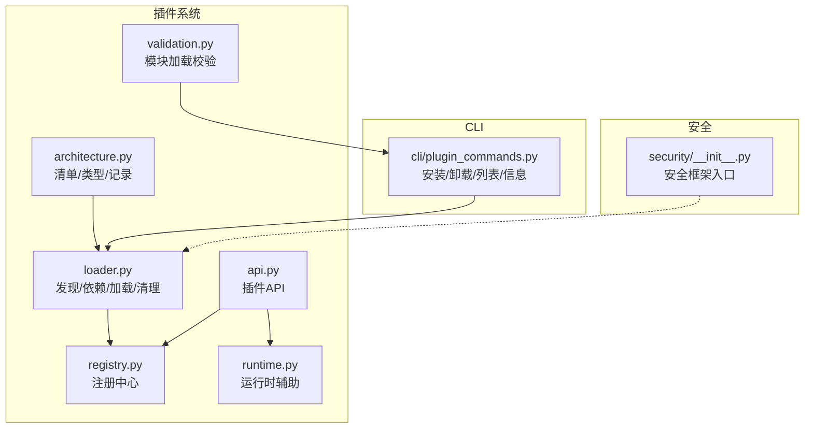
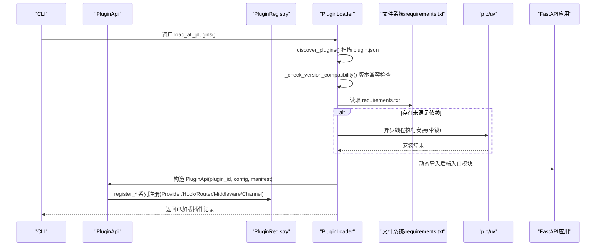
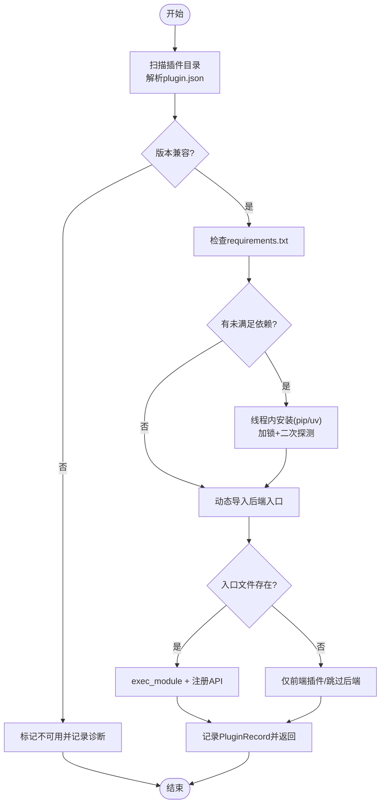
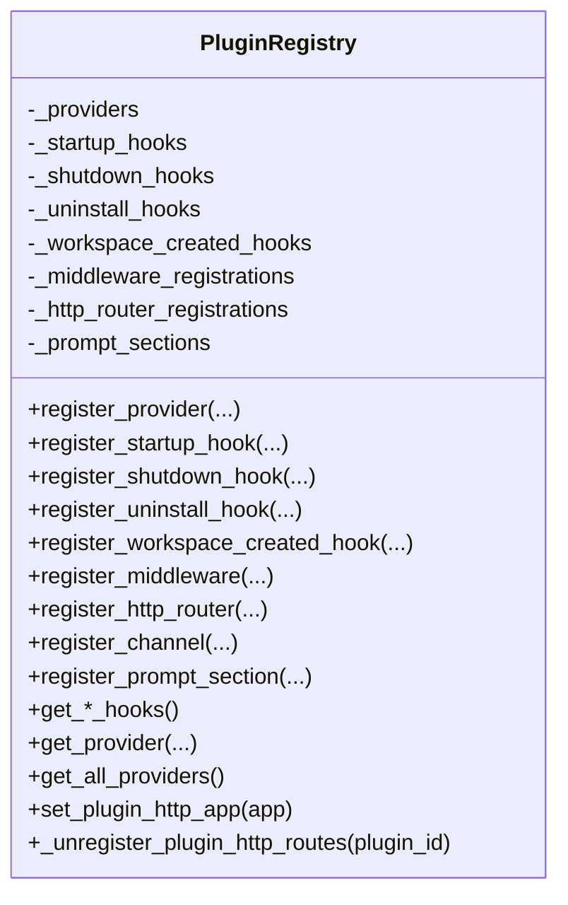
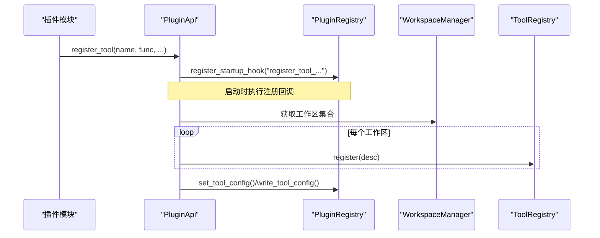
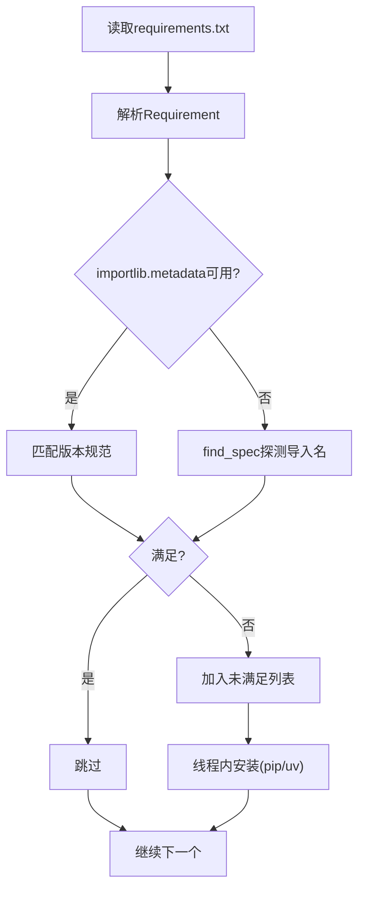
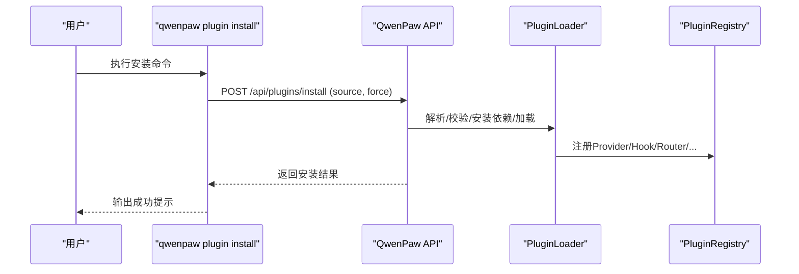

# 插件生命周期管理

<cite>
**本文引用的文件**   
- [src/qwenpaw/plugins/__init__.py](file://src/qwenpaw/plugins/__init__.py)
- [src/qwenpaw/plugins/loader.py](file://src/qwenpaw/plugins/loader.py)
- [src/qwenpaw/plugins/registry.py](file://src/qwenpaw/plugins/registry.py)
- [src/qwenpaw/plugins/api.py](file://src/qwenpaw/plugins/api.py)
- [src/qwenpaw/plugins/architecture.py](file://src/qwenpaw/plugins/architecture.py)
- [src/qwenpaw/plugins/runtime.py](file://src/qwenpaw/plugins/runtime.py)
- [src/qwenpaw/plugins/validation.py](file://src/qwenpaw/plugins/validation.py)
- [src/qwenpaw/cli/plugin_commands.py](file://src/qwenpaw/cli/plugin_commands.py)
- [src/qwenpaw/security/__init__.py](file://src/qwenpaw/security/__init__.py)
</cite>

## 目录
1. [简介](#简介)
2. [项目结构](#项目结构)
3. [核心组件](#核心组件)
4. [架构总览](#架构总览)
5. [详细组件分析](#详细组件分析)
6. [依赖关系分析](#依赖关系分析)
7. [性能与并发特性](#性能与并发特性)
8. [安全机制](#安全机制)
9. [安装、更新与删除流程](#安装更新与删除流程)
10. [故障排查指南](#故障排查指南)
11. [最佳实践与监控](#最佳实践与监控)
12. [结论](#结论)

## 简介
本文件围绕 QwenPaw 的插件生命周期管理，系统性阐述插件从发现、加载、初始化、运行到卸载的全链路处理机制。重点覆盖：
- PluginLoader 的工作原理（发现、校验、依赖安装、动态导入、注册）
- PluginRegistry 的管理逻辑（提供者、路由、钩子、中间件、通道等）
- 插件间依赖解析与版本兼容性检查
- 安装、更新、删除的完整流程示例（含热插拔与离线模式）
- 依赖冲突、回滚机制、状态恢复策略
- 安全扫描、权限验证、资源隔离
- 最佳实践与监控方法

## 项目结构
插件系统位于 src/qwenpaw/plugins 下，核心模块职责如下：
- architecture：插件清单模型、类型定义、记录结构
- loader：插件发现、依赖安装、动态加载、失败清理
- registry：全局注册中心（Provider、Hook、HTTP 路由、中间件、Channel 等）
- api：插件开发者 API（注册工具、命令、路由、钩子等）
- runtime：运行时辅助能力（日志、Provider 访问等）
- validation：模块加载语义复用的校验工具（CLI 使用）
- cli/plugin_commands.py：插件安装/卸载/列表/信息等 CLI 入口，支持在线热插拔与离线安装

图表来源
- [src/qwenpaw/plugins/architecture.py:1-221](file://src/qwenpaw/plugins/architecture.py#L1-L221)
- [src/qwenpaw/plugins/loader.py:1-800](file://src/qwenpaw/plugins/loader.py#L1-L800)
- [src/qwenpaw/plugins/registry.py:1-800](file://src/qwenpaw/plugins/registry.py#L1-L800)
- [src/qwenpaw/plugins/api.py:1-800](file://src/qwenpaw/plugins/api.py#L1-L800)
- [src/qwenpaw/plugins/runtime.py:1-68](file://src/qwenpaw/plugins/runtime.py#L1-L68)
- [src/qwenpaw/plugins/validation.py:1-78](file://src/qwenpaw/plugins/validation.py#L1-L78)
- [src/qwenpaw/cli/plugin_commands.py:1-800](file://src/qwenpaw/cli/plugin_commands.py#L1-L800)
- [src/qwenpaw/security/__init__.py:1-21](file://src/qwenpaw/security/__init__.py#L1-L21)

章节来源
- [src/qwenpaw/plugins/__init__.py:1-17](file://src/qwenpaw/plugins/__init__.py#L1-L17)

## 核心组件
- PluginManifest / PluginRecord / PluginType：描述插件元数据、类型推断、加载后记录
- PluginLoader：负责插件发现、清单校验、依赖安装、动态导入、失败清理、加载编排
- PluginRegistry：单例式注册中心，维护 Provider、Hook、HTTP 路由、中间件、Channel、PromptSection 等
- PluginApi：面向插件开发者的统一 API，封装注册行为并委托给 Registry
- RuntimeHelpers：为插件提供运行时辅助（日志、Provider 访问等）
- validation.validate_plugin_module：在 CLI 中复用与 Loader 一致的模块加载语义进行校验

章节来源
- [src/qwenpaw/plugins/architecture.py:1-221](file://src/qwenpaw/plugins/architecture.py#L1-L221)
- [src/qwenpaw/plugins/loader.py:1-800](file://src/qwenpaw/plugins/loader.py#L1-L800)
- [src/qwenpaw/plugins/registry.py:1-800](file://src/qwenpaw/plugins/registry.py#L1-L800)
- [src/qwenpaw/plugins/api.py:1-800](file://src/qwenpaw/plugins/api.py#L1-L800)
- [src/qwenpaw/plugins/runtime.py:1-68](file://src/qwenpaw/plugins/runtime.py#L1-L68)
- [src/qwenpaw/plugins/validation.py:1-78](file://src/qwenpaw/plugins/validation.py#L1-L78)

## 架构总览
下图展示插件生命周期关键阶段及核心交互：

图表来源
- [src/qwenpaw/plugins/loader.py:120-640](file://src/qwenpaw/plugins/loader.py#L120-L640)
- [src/qwenpaw/plugins/registry.py:130-300](file://src/qwenpaw/plugins/registry.py#L130-L300)
- [src/qwenpaw/plugins/api.py:170-480](file://src/qwenpaw/plugins/api.py#L170-L480)

## 详细组件分析

### 组件一：PluginLoader（加载器）
- 插件发现：遍历插件目录，跳过隐藏或 .disabled 后缀目录，解析 plugin.json 生成 Manifest
- 版本兼容：基于 qwenpaw_version 或 min/max_version 字段进行左闭右开区间检查
- 依赖安装：
  - 检测 requirements.txt 中的未满足项
  - 通过 asyncio.to_thread 在后台线程执行安装，避免阻塞事件循环
  - 使用 per-plugin 进程级锁防止重复安装风暴
  - 优先 python -m pip，缺失时回退 uv pip install；冻结桌面构建走独立 Python 运行时
- 动态加载：
  - 以唯一模块名将后端入口模块载入 sys.modules，注入 __path__ 支持相对导入
  - 要求模块导出 plugin 对象并实现 register(api)
  - 若加载失败，执行 _cleanup_failed_load 回滚注册、sys.modules、sys.path
- 加载编排：load_all_plugins 支持按类型过滤、逐插件异常隔离

图表来源
- [src/qwenpaw/plugins/loader.py:120-640](file://src/qwenpaw/plugins/loader.py#L120-L640)
- [src/qwenpaw/plugins/loader.py:336-513](file://src/qwenpaw/plugins/loader.py#L336-L513)

章节来源
- [src/qwenpaw/plugins/loader.py:120-800](file://src/qwenpaw/plugins/loader.py#L120-L800)

### 组件二：PluginRegistry（注册中心）
- 单例设计，集中管理：
  - Provider 注册与查询
  - Hook（启动/关闭/卸载/工作区创建）注册与排序
  - HTTP 路由挂载（插入到 SPA catch-all 之前，刷新 OpenAPI 缓存）
  - 中间件工厂注册（按优先级顺序）
  - Channel 注册（键规范化、UI 配置字段、图标与文档链接）
  - PromptSection 注册（锚点校验、去重）
  - 控制命令注册
- 卸载清理：_unregister_plugin_http_routes 移除对应路由并清理映射

图表来源
- [src/qwenpaw/plugins/registry.py:130-300](file://src/qwenpaw/plugins/registry.py#L130-L300)
- [src/qwenpaw/plugins/registry.py:328-420](file://src/qwenpaw/plugins/registry.py#L328-L420)
- [src/qwenpaw/plugins/registry.py:472-628](file://src/qwenpaw/plugins/registry.py#L472-L628)
- [src/qwenpaw/plugins/registry.py:663-716](file://src/qwenpaw/plugins/registry.py#L663-L716)
- [src/qwenpaw/plugins/registry.py:749-800](file://src/qwenpaw/plugins/registry.py#L749-L800)
- [src/qwenpaw/plugins/registry.py:298-327](file://src/qwenpaw/plugins/registry.py#L298-L327)

章节来源
- [src/qwenpaw/plugins/registry.py:1-800](file://src/qwenpaw/plugins/registry.py#L1-L800)

### 组件三：PluginApi（插件开发者接口）
- 暴露注册能力：provider、hook、HTTP 路由、中间件、channel、tool、slash command、mode 等
- 内部委托至 PluginRegistry，并在适当时机延迟注册（如工具注册延后至启动钩子）
- 工具注册桥接：自动写入 Agent 配置、注入运行时 ToolRegistry、追加内置函数列表

图表来源
- [src/qwenpaw/plugins/api.py:614-699](file://src/qwenpaw/plugins/api.py#L614-L699)
- [src/qwenpaw/plugins/api.py:54-113](file://src/qwenpaw/plugins/api.py#L54-L113)

章节来源
- [src/qwenpaw/plugins/api.py:1-800](file://src/qwenpaw/plugins/api.py#L1-L800)

### 组件四：运行时辅助 RuntimeHelpers
- 提供 provider 查询、列表、日志输出等基础能力，供插件在运行时使用

章节来源
- [src/qwenpaw/plugins/runtime.py:1-68](file://src/qwenpaw/plugins/runtime.py#L1-L68)

### 组件五：清单与类型 architecture
- PluginManifest：支持国际化文本、旧版 entry_point 兼容、type 推断、qwenpaw_version 约束
- PluginRecord：加载后的实例化记录，包含启用状态、诊断信息
- PluginType：工具、提供者、钩子、命令、通道、前端、通用

章节来源
- [src/qwenpaw/plugins/architecture.py:1-221](file://src/qwenpaw/plugins/architecture.py#L1-L221)

### 组件六：模块加载校验 validation
- 在 CLI 中复用与 Loader 一致的模块加载语义，确保“可导入性”和“导出约定”正确

章节来源
- [src/qwenpaw/plugins/validation.py:1-78](file://src/qwenpaw/plugins/validation.py#L1-L78)

## 依赖关系分析
- 插件依赖解析
  - 通过 requirements.txt 解析 Requirement 表达式
  - 双重探测：importlib.metadata（权威，支持版本规范）+ importlib.util.find_spec（覆盖冻结环境缺 dist-info 的情况）
  - 常见包名到导入名的映射表，避免误判
- 依赖安装
  - 线程内执行，避免阻塞事件循环
  - 每插件安装锁，避免多进程并发导致内存耗尽
  - 先尝试 python -m pip，缺失则回退 uv pip install
  - 冻结桌面构建使用打包的 Python 运行时路径

图表来源
- [src/qwenpaw/plugins/loader.py:208-305](file://src/qwenpaw/plugins/loader.py#L208-L305)
- [src/qwenpaw/plugins/loader.py:721-800](file://src/qwenpaw/plugins/loader.py#L721-L800)

章节来源
- [src/qwenpaw/plugins/loader.py:208-305](file://src/qwenpaw/plugins/loader.py#L208-L305)
- [src/qwenpaw/plugins/loader.py:721-800](file://src/qwenpaw/plugins/loader.py#L721-L800)

## 性能与并发特性
- 依赖安装非阻塞：通过 asyncio.to_thread 在后台线程执行，避免阻塞事件循环
- 安装锁：per-plugin 文件锁，保证同一插件的安装串行化，避免重复安装风暴
- 二次探测：等待锁后再刷新 import 缓存并重新探测，减少不必要的安装
- 路由插入优化：插件路由插入到 SPA catch-all 之前，避免被吞掉；同时刷新 OpenAPI 缓存

章节来源
- [src/qwenpaw/plugins/loader.py:270-335](file://src/qwenpaw/plugins/loader.py#L270-L335)
- [src/qwenpaw/plugins/registry.py:29-52](file://src/qwenpaw/plugins/registry.py#L29-L52)

## 安全机制
- 安全框架入口：集中说明 tool-guard、skill-scanner、secret-store 三大子模块的职责与边界
- 插件侧建议：
  - 对敏感配置使用 secret-store 存储
  - 工具调用前通过 tool-guard 进行参数扫描与风险拦截
  - 技能目录在安装/激活前进行静态扫描
- 资源隔离：
  - 插件依赖安装到用户可写的 site-dir（冻结构建），并通过 sys.path/site 注入，避免污染宿主环境
  - 动态导入采用命名空间隔离，失败时清理 sys.modules 与 sys.path

章节来源
- [src/qwenpaw/security/__init__.py:1-21](file://src/qwenpaw/security/__init__.py#L1-L21)
- [src/qwenpaw/plugins/loader.py:93-117](file://src/qwenpaw/plugins/loader.py#L93-L117)
- [src/qwenpaw/plugins/loader.py:460-513](file://src/qwenpaw/plugins/loader.py#L460-L513)

## 安装、更新与删除流程

### 安装流程（在线热插拔）
- CLI 检测到服务运行，直接通过本地 API 触发热安装
- 服务端接收 source（目录或 ZIP），解压/定位插件目录，校验清单与模块可导入性
- 按需安装依赖，动态加载后端模块，注册到 Registry，返回成功

图表来源
- [src/qwenpaw/cli/plugin_commands.py:47-88](file://src/qwenpaw/cli/plugin_commands.py#L47-L88)
- [src/qwenpaw/cli/plugin_commands.py:504-651](file://src/qwenpaw/cli/plugin_commands.py#L504-L651)
- [src/qwenpaw/plugins/loader.py:514-640](file://src/qwenpaw/plugins/loader.py#L514-L640)

章节来源
- [src/qwenpaw/cli/plugin_commands.py:47-88](file://src/qwenpaw/cli/plugin_commands.py#L47-L88)
- [src/qwenpaw/cli/plugin_commands.py:504-651](file://src/qwenpaw/cli/plugin_commands.py#L504-L651)

### 安装流程（离线模式）
- 下载 ZIP 到临时目录，安全解压（防 Zip Slip）
- 校验 plugin.json 与后端入口模块可导入性
- 复制插件目录到 plugins/<id>，安装依赖（pip/uv）
- 同步工具插件到所有 Agent 的配置（可选）

章节来源
- [src/qwenpaw/cli/plugin_commands.py:320-401](file://src/qwenpaw/cli/plugin_commands.py#L320-L401)
- [src/qwenpaw/cli/plugin_commands.py:460-501](file://src/qwenpaw/cli/plugin_commands.py#L460-L501)
- [src/qwenpaw/cli/plugin_commands.py:552-651](file://src/qwenpaw/cli/plugin_commands.py#L552-L651)

### 更新流程
- 支持 force 参数：若插件已加载，先卸载再安装新版本
- 在线模式：通过 /plugins/upload 上传 ZIP 或 /plugins/install 指定源
- 离线模式：强制覆盖目标目录并重新安装依赖

章节来源
- [src/qwenpaw/cli/plugin_commands.py:91-148](file://src/qwenpaw/cli/plugin_commands.py#L91-L148)
- [src/qwenpaw/cli/plugin_commands.py:602-630](file://src/qwenpaw/cli/plugin_commands.py#L602-L630)

### 删除流程
- 在线模式：DELETE /api/plugins/{plugin_id}，触发卸载钩子与路由清理
- 离线模式：删除插件目录，并从各 Agent 配置中移除工具条目（若为工具插件）

章节来源
- [src/qwenpaw/cli/plugin_commands.py:151-186](file://src/qwenpaw/cli/plugin_commands.py#L151-L186)
- [src/qwenpaw/cli/plugin_commands.py:773-800](file://src/qwenpaw/cli/plugin_commands.py#L773-L800)
- [src/qwenpaw/cli/plugin_commands.py:403-458](file://src/qwenpaw/cli/plugin_commands.py#L403-L458)

### 依赖冲突与回滚
- 依赖冲突：通过 Requirement 版本规范与双探针判定，避免误报；安装失败会抛出错误并终止当前插件加载
- 回滚机制：
  - 加载失败时执行 _cleanup_failed_load，撤销注册、清理 sys.modules 与 sys.path
  - CLI 离线安装失败时清理目标目录，避免脏状态
- 状态恢复：
  - 插件清单与配置持久化，重启后可再次加载
  - 工具插件可通过 CLI 同步/清理到各 Agent 配置

章节来源
- [src/qwenpaw/plugins/loader.py:460-513](file://src/qwenpaw/plugins/loader.py#L460-L513)
- [src/qwenpaw/cli/plugin_commands.py:221-306](file://src/qwenpaw/cli/plugin_commands.py#L221-L306)

## 故障排查指南
- 常见问题定位
  - 清单无效或缺少必要字段：查看 plugin.json 校验错误
  - 后端入口不存在或未导出 plugin.register：检查 entry.backend 与模块导出
  - 依赖安装超时或失败：检查网络、pip/uv 可用性、requirements.txt 语法
  - 路由不生效：确认 FastAPI 应用已设置且 prefix 合法、未被 SPA catch-all 吞掉
- 日志与诊断
  - 安装过程实时流式日志输出，便于定位问题
  - 插件记录中包含 diagnostics 字段，用于显示兼容性诊断信息

章节来源
- [src/qwenpaw/plugins/loader.py:174-207](file://src/qwenpaw/plugins/loader.py#L174-L207)
- [src/qwenpaw/plugins/loader.py:336-375](file://src/qwenpaw/plugins/loader.py#L336-L375)
- [src/qwenpaw/plugins/loader.py:673-719](file://src/qwenpaw/plugins/loader.py#L673-L719)
- [src/qwenpaw/plugins/architecture.py:212-221](file://src/qwenpaw/plugins/architecture.py#L212-L221)

## 最佳实践与监控
- 最佳实践
  - 明确声明 qwenpaw_version 约束，避免跨主版本不兼容
  - 使用 PluginApi 提供的注册方法，避免直接操作底层注册中心
  - 工具默认禁用，由用户显式开启，降低安全风险
  - 合理划分中间件优先级，遵循洋葱模型
  - 使用 uninstall hook 做一次性清理（如移除技能、取消补丁）
- 监控建议
  - 关注插件加载日志与诊断信息
  - 监控依赖安装耗时与失败率
  - 统计 HTTP 路由注册数量与命中情况
  - 审计工具调用与中间件执行链

[本节为通用指导，无需源码引用]

## 结论
QwenPaw 的插件生命周期管理通过清晰的职责拆分与严格的加载/注册/卸载流程，实现了高内聚、低耦合的扩展体系。PluginLoader 负责可靠加载与依赖治理，PluginRegistry 提供统一的注册与访问面，PluginApi 简化插件开发体验。配合 CLI 的热插拔与离线安装能力、完善的安全框架与回滚机制，整体具备生产可用的健壮性与可观测性。