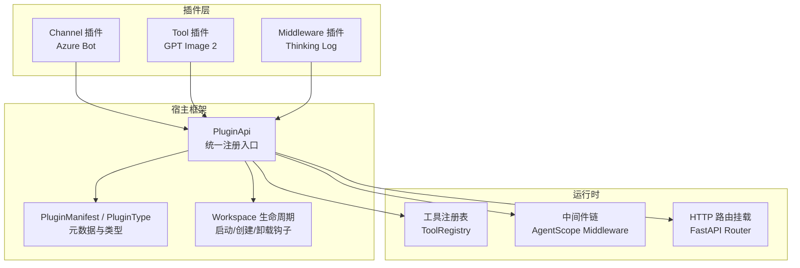
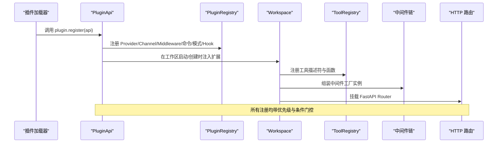
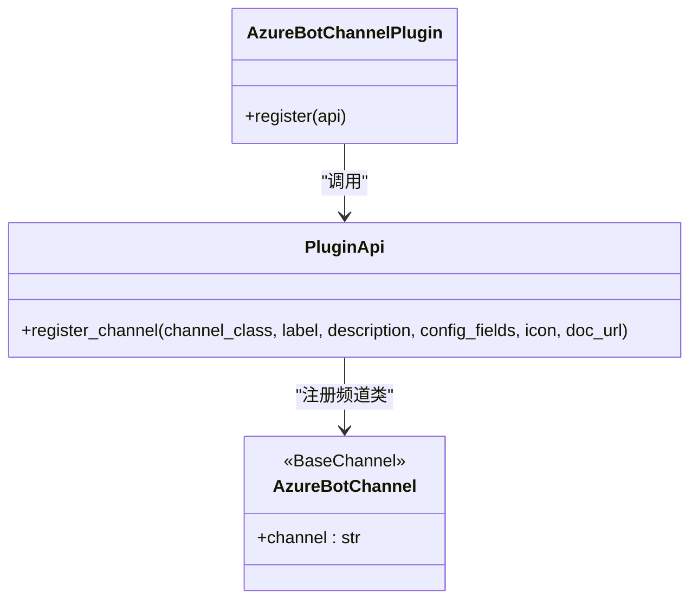
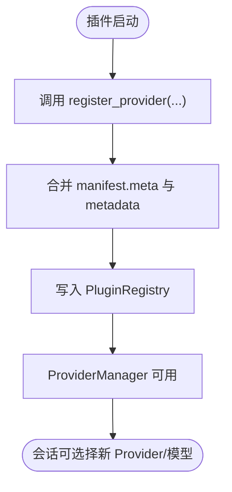
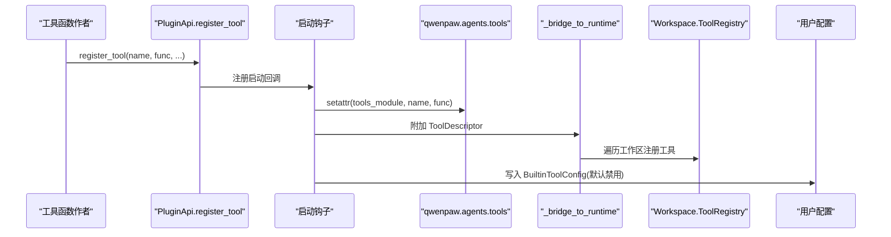
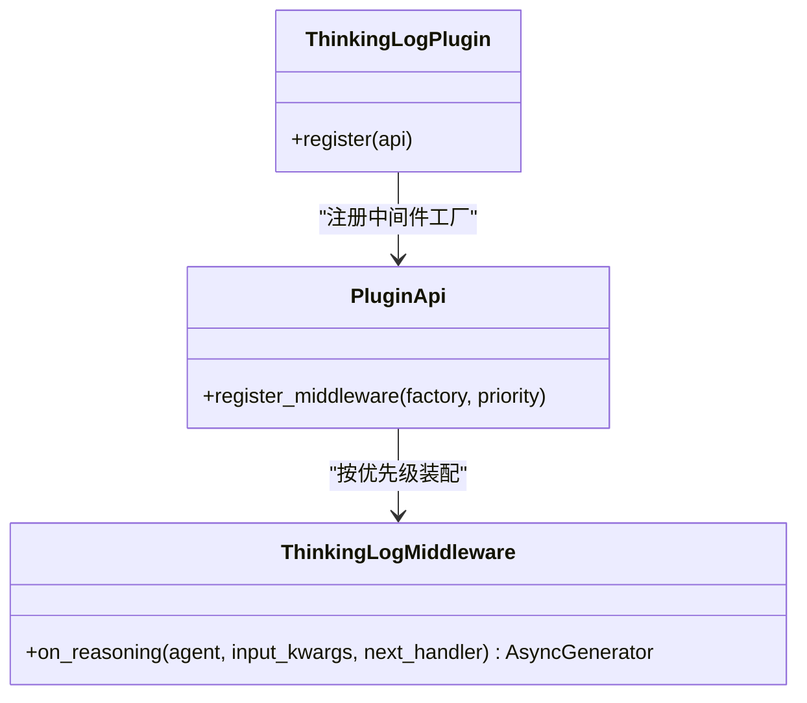
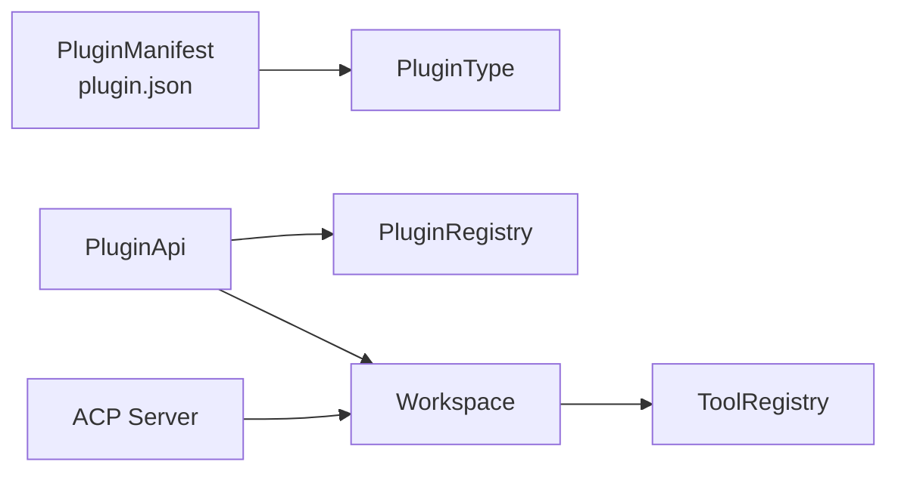

# 插件类型和接口

<cite>
**本文引用的文件**   
- [src/qwenpaw/plugins/api.py](file://src/qwenpaw/plugins/api.py)
- [src/qwenpaw/plugins/architecture.py](file://src/qwenpaw/plugins/architecture.py)
- [plugins/channel/azure_bot/plugin.py](file://plugins/channel/azure_bot/plugin.py)
- [plugins/tool/gpt-image2/gpt_image2_tool.py](file://plugins/tool/gpt-image2/gpt_image2_tool.py)
- [plugins/middleware-demo/thinking-log-middleware/thinking_log_plugin.py](file://plugins/middleware-demo/thinking-log-middleware/thinking_log_plugin.py)
- [src/qwenpaw/agents/acp/server.py](file://src/qwenpaw/agents/acp/server.py)
</cite>

## 目录
1. [简介](#简介)
2. [项目结构](#项目结构)
3. [核心组件](#核心组件)
4. [架构总览](#架构总览)
5. [详细组件分析](#详细组件分析)
6. [依赖关系分析](#依赖关系分析)
7. [性能考虑](#性能考虑)
8. [故障排查指南](#故障排查指南)
9. [结论](#结论)
10. [附录](#附录)

## 简介
本文件面向 QwenPaw 的插件开发者，系统化梳理插件类型与接口规范，覆盖 Channel、Provider、Tool、Middleware 等关键扩展点。文档从“注册入口”到“运行时行为”，给出清晰的实现要求、数据传递格式、配置与权限控制要点，并通过图示帮助初学者快速上手，同时为有经验的开发者提供足够的技术深度。

## 项目结构
QwenPaw 的插件体系围绕以下核心展开：
- 插件元数据与类型定义：用于描述插件能力、兼容性与入口点
- 插件 API：统一的 register(api) 入口，提供注册各类能力的标准化方法
- 示例插件：Channel（Azure Bot）、Tool（GPT Image 2）、Middleware（思考日志）

图表来源
- [src/qwenpaw/plugins/api.py:172-250](file://src/qwenpaw/plugins/api.py#L172-L250)
- [src/qwenpaw/plugins/architecture.py:12-98](file://src/qwenpaw/plugins/architecture.py#L12-L98)
- [plugins/channel/azure_bot/plugin.py:14-308](file://plugins/channel/azure_bot/plugin.py#L14-L308)
- [plugins/tool/gpt-image2/gpt_image2_tool.py:1-605](file://plugins/tool/gpt-image2/gpt_image2_tool.py#L1-L605)
- [plugins/middleware-demo/thinking-log-middleware/thinking_log_plugin.py:59-66](file://plugins/middleware-demo/thinking-log-middleware/thinking_log_plugin.py#L59-L66)

章节来源
- [src/qwenpaw/plugins/api.py:172-250](file://src/qwenpaw/plugins/api.py#L172-L250)
- [src/qwenpaw/plugins/architecture.py:12-98](file://src/qwenpaw/plugins/architecture.py#L12-L98)

## 核心组件
- 插件 API（PluginApi）
  - 提供 register_provider、register_channel、register_tool、register_middleware、register_http_router、register_slash_command、register_mode、register_runtime_hook、register_agent_stop_handler、register_prompt_section 等方法
  - 支持在应用启动与工作区创建时延迟注册，确保上下文就绪
- 插件元数据（PluginManifest、PluginType）
  - 声明插件 id、版本、名称、描述、入口点、依赖、版本约束、meta 信息
  - 自动推断插件类型（tool/provider/hook/command/channel/frontend/general）
- 示例插件
  - Channel：Azure Bot 通过 api.register_channel 注册频道类与表单字段
  - Tool：GPT Image 2 工具函数通过 api.register_tool 注册并桥接到运行时
  - Middleware：Thinking Log 通过 api.register_middleware 注入中间件工厂

章节来源
- [src/qwenpaw/plugins/api.py:205-250](file://src/qwenpaw/plugins/api.py#L205-L250)
- [src/qwenpaw/plugins/api.py:483-570](file://src/qwenpaw/plugins/api.py#L483-L570)
- [src/qwenpaw/plugins/api.py:614-698](file://src/qwenpaw/plugins/api.py#L614-L698)
- [src/qwenpaw/plugins/api.py:448-482](file://src/qwenpaw/plugins/api.py#L448-L482)
- [src/qwenpaw/plugins/architecture.py:114-191](file://src/qwenpaw/plugins/architecture.py#L114-L191)
- [plugins/channel/azure_bot/plugin.py:14-308](file://plugins/channel/azure_bot/plugin.py#L14-L308)
- [plugins/tool/gpt-image2/gpt_image2_tool.py:1-605](file://plugins/tool/gpt-image2/gpt_image2_tool.py#L1-L605)
- [plugins/middleware-demo/thinking-log-middleware/thinking_log_plugin.py:59-66](file://plugins/middleware-demo/thinking-log-middleware/thinking_log_plugin.py#L59-L66)

## 架构总览
下图展示插件注册到运行时的整体流程，包括启动钩子、工作区生命周期、以及各扩展点的落地位置。

图表来源
- [src/qwenpaw/plugins/api.py:251-313](file://src/qwenpaw/plugins/api.py#L251-L313)
- [src/qwenpaw/plugins/api.py:358-392](file://src/qwenpaw/plugins/api.py#L358-L392)
- [src/qwenpaw/plugins/api.py:394-424](file://src/qwenpaw/plugins/api.py#L394-L424)
- [src/qwenpaw/plugins/api.py:700-756](file://src/qwenpaw/plugins/api.py#L700-L756)
- [src/qwenpaw/plugins/api.py:758-796](file://src/qwenpaw/plugins/api.py#L758-L796)
- [src/qwenpaw/plugins/api.py:798-835](file://src/qwenpaw/plugins/api.py#L798-L835)

## 详细组件分析

### Channel 插件（消息通道）
- 目标：将外部聊天平台接入 QwenPaw，作为 Agent 的消息源与输出端
- 注册方式：api.register_channel(channel_class, label, description, config_fields, icon, doc_url)
- 关键要求：
  - channel_class 必须继承 BaseChannel 并提供 class 属性 channel 作为唯一键
  - config_fields 用于控制台生成设置表单，支持 text/password/number/switch/select 等类型
  - 可附带图标与文档链接（支持多语言映射）
- 示例：Azure Bot 插件通过 register_channel 注册 AzureBotChannel，并定义 app_id、app_password、tenant_id、http_host、http_port、media_dir、群聊共享上下文、访问控制、@提及等配置项

图表来源
- [plugins/channel/azure_bot/plugin.py:14-308](file://plugins/channel/azure_bot/plugin.py#L14-L308)
- [src/qwenpaw/plugins/api.py:483-570](file://src/qwenpaw/plugins/api.py#L483-L570)

章节来源
- [plugins/channel/azure_bot/plugin.py:14-308](file://plugins/channel/azure_bot/plugin.py#L14-L308)
- [src/qwenpaw/plugins/api.py:483-570](file://src/qwenpaw/plugins/api.py#L483-L570)

### Provider 插件（模型提供方）
- 目标：注册自定义 LLM Provider，使 Agent 能使用新的模型端点
- 注册方式：api.register_provider(provider_id, provider_class, label, base_url, **metadata)
- 关键点：
  - provider_class 需继承 BaseProvider
  - metadata 可与插件 manifest 的 meta 合并，便于 UI 渲染与校验提示
  - 注册后由 ProviderManager 管理，供会话选择与切换

图表来源
- [src/qwenpaw/plugins/api.py:205-250](file://src/qwenpaw/plugins/api.py#L205-L250)

章节来源
- [src/qwenpaw/plugins/api.py:205-250](file://src/qwenpaw/plugins/api.py#L205-L250)

### Tool 插件（工具函数）
- 目标：向 Agent 暴露可调用的工具函数，支持异步执行与参数校验
- 注册方式：api.register_tool(tool_name, tool_func, description, icon, enabled=False)
- 内部机制：
  - 启动钩子中将函数挂入 qwenpaw.agents.tools 模块，并追加到 __all__
  - 桥接 ToolDescriptor 到每个 Workspace 的 ToolRegistry
  - 持久化 BuiltinToolConfig 到当前 Agent 配置（默认禁用，用户可启用）
- 工具函数约定：
  - 返回 ToolChunk（包含状态与内容块），错误路径返回 ERROR 状态
  - 可通过 get_tool_config("tool_name") 读取用户配置（如 api_key、endpoint、timeout）
- 示例：GPT Image 2 工具函数 generate_image_gpt/edit_image_gpt 完成参数校验、网络请求、本地落盘与结果封装

图表来源
- [src/qwenpaw/plugins/api.py:614-698](file://src/qwenpaw/plugins/api.py#L614-L698)
- [src/qwenpaw/plugins/api.py:54-112](file://src/qwenpaw/plugins/api.py#L54-L112)
- [src/qwenpaw/plugins/api.py:114-166](file://src/qwenpaw/plugins/api.py#L114-L166)

章节来源
- [src/qwenpaw/plugins/api.py:614-698](file://src/qwenpaw/plugins/api.py#L614-L698)
- [src/qwenpaw/plugins/api.py:54-112](file://src/qwenpaw/plugins/api.py#L54-L112)
- [src/qwenpaw/plugins/api.py:114-166](file://src/qwenpaw/plugins/api.py#L114-L166)
- [plugins/tool/gpt-image2/gpt_image2_tool.py:1-605](file://plugins/tool/gpt-image2/gpt_image2_tool.py#L1-L605)

### Middleware 插件（中间件）
- 目标：在 Agent 推理流中插入横切逻辑（如日志、审计、限流）
- 注册方式：api.register_middleware(factory, priority=100)
- 工厂签名：factory(ctx, agent_config) -> MiddlewareBase | None
- 示例：Thinking Log 中间件捕获 ThinkingBlockDeltaEvent 与 TextBlockDeltaEvent，打印推理过程

图表来源
- [plugins/middleware-demo/thinking-log-middleware/thinking_log_plugin.py:59-66](file://plugins/middleware-demo/thinking-log-middleware/thinking_log_plugin.py#L59-L66)
- [src/qwenpaw/plugins/api.py:448-482](file://src/qwenpaw/plugins/api.py#L448-L482)

章节来源
- [plugins/middleware-demo/thinking-log-middleware/thinking_log_plugin.py:59-66](file://plugins/middleware-demo/thinking-log-middleware/thinking_log_plugin.py#L59-L66)
- [src/qwenpaw/plugins/api.py:448-482](file://src/qwenpaw/plugins/api.py#L448-L482)

### 其他扩展点概览
- HTTP 路由：api.register_http_router(router, prefix="/xxx", tags=[...])
- 斜杠命令：api.register_slash_command(name, handler, aliases, category, help_text, metadata)
- 模式（Mode）：api.register_mode(mode_cls)，在每个工作区注册
- 运行时阶段钩子：api.register_runtime_hook(hook)，按 Phase 执行
- Agent 停止处理器：api.register_agent_stop_handler(handler, priority, name)
- 系统提示片段：api.register_prompt_section(name, after, provider, priority, condition, agent_id)

章节来源
- [src/qwenpaw/plugins/api.py:394-424](file://src/qwenpaw/plugins/api.py#L394-L424)
- [src/qwenpaw/plugins/api.py:700-756](file://src/qwenpaw/plugins/api.py#L700-L756)
- [src/qwenpaw/plugins/api.py:758-796](file://src/qwenpaw/plugins/api.py#L758-L796)
- [src/qwenpaw/plugins/api.py:798-835](file://src/qwenpaw/plugins/api.py#L798-L835)
- [src/qwenpaw/plugins/api.py:837-888](file://src/qwenpaw/plugins/api.py#L837-L888)
- [src/qwenpaw/plugins/api.py:890-948](file://src/qwenpaw/plugins/api.py#L890-L948)

## 依赖关系分析
- 插件类型与元数据
  - PluginType 枚举定义了 tool/provider/hook/command/channel/frontend/general
  - PluginManifest 负责解析 plugin.json，支持国际化文本与 legacy 兼容
- 插件 API 与注册中心
  - PluginApi 持有 _registry 引用，委托给 PluginRegistry 进行实际注册
  - 针对 Tool 的注册会桥接到 Workspace.ToolRegistry，并在 Agent 配置中持久化
- 运行时集成
  - ACP Server 在启动 Workspace 时会 bootstrap_plugins，从而触发插件注册与初始化

图表来源
- [src/qwenpaw/plugins/architecture.py:12-98](file://src/qwenpaw/plugins/architecture.py#L12-L98)
- [src/qwenpaw/plugins/architecture.py:114-191](file://src/qwenpaw/plugins/architecture.py#L114-L191)
- [src/qwenpaw/plugins/api.py:172-204](file://src/qwenpaw/plugins/api.py#L172-L204)
- [src/qwenpaw/agents/acp/server.py:461-482](file://src/qwenpaw/agents/acp/server.py#L461-L482)

章节来源
- [src/qwenpaw/plugins/architecture.py:12-98](file://src/qwenpaw/plugins/architecture.py#L12-L98)
- [src/qwenpaw/plugins/architecture.py:114-191](file://src/qwenpaw/plugins/architecture.py#L114-L191)
- [src/qwenpaw/plugins/api.py:172-204](file://src/qwenpaw/plugins/api.py#L172-L204)
- [src/qwenpaw/agents/acp/server.py:461-482](file://src/qwenpaw/agents/acp/server.py#L461-L482)

## 性能考虑
- 注册时机
  - Tool、Slash Command、Mode、Runtime Hook 等采用启动钩子与工作区创建钩子，避免在插件加载期阻塞主线程
- 中间件优先级
  - 通过 priority 控制洋葱模型顺序，低数值更外层；合理设置可减少不必要的计算
- 工具执行
  - 异步工具函数被识别并标记 async_execution=True，提升并发吞吐
- 配置读写
  - 工具配置持久化到 Agent 配置文件，建议批量更新与缓存以减少频繁 IO

[本节为通用指导，不直接分析具体文件]

## 故障排查指南
- 插件未生效
  - 检查 register(api) 是否被正确调用
  - 确认注册方法是否成功（查看日志中的注册成功信息）
- 工具不可用或报错
  - 确认工具已启用（BuiltinToolConfig.enabled）
  - 检查 get_tool_config 返回值是否为空或缺少必要字段（如 api_key）
  - 验证参数校验分支是否返回了错误状态的 ToolChunk
- 中间件未触发
  - 确认 factory 返回非 None 实例
  - 检查 priority 是否导致中间件被跳过
- Channel 无法显示或配置异常
  - 确认 channel_class 具备 channel 类属性
  - 检查 config_fields 的 type、required、default 等字段是否符合预期

章节来源
- [src/qwenpaw/plugins/api.py:614-698](file://src/qwenpaw/plugins/api.py#L614-L698)
- [src/qwenpaw/plugins/api.py:483-570](file://src/qwenpaw/plugins/api.py#L483-L570)
- [plugins/tool/gpt-image2/gpt_image2_tool.py:1-605](file://plugins/tool/gpt-image2/gpt_image2_tool.py#L1-L605)
- [plugins/middleware-demo/thinking-log-middleware/thinking_log_plugin.py:59-66](file://plugins/middleware-demo/thinking-log-middleware/thinking_log_plugin.py#L59-L66)

## 结论
QwenPaw 的插件体系以 PluginApi 为核心，通过标准化的注册方法与生命周期钩子，将 Channel、Provider、Tool、Middleware 等扩展点无缝融入运行时。借助 PluginManifest 的类型推断与兼容性处理，旧版插件仍可平滑升级。遵循本文档的接口规范与最佳实践，可高效构建稳定、可维护且可扩展的插件生态。

[本节为总结性内容，不直接分析具体文件]

## 附录

### 插件间通信与事件总线
- 事件驱动
  - 中间件基于 AgentScope 的事件流（如 ThinkingBlockDeltaEvent、TextBlockDeltaEvent）进行拦截与透传
- 工具输出
  - 工具返回 ToolChunk，包含状态与内容块（文本、图片、URL 等），ACP Server 会将插件调用输出转换为标准协议消息
- 配置与权限
  - 工具配置通过 get_tool_config 读取，建议在工具函数内做最小必要校验
  - 权限控制可在中间件或网关层实现（例如审批、白名单、速率限制）

章节来源
- [plugins/middleware-demo/thinking-log-middleware/thinking_log_plugin.py:23-47](file://plugins/middleware-demo/thinking-log-middleware/thinking_log_plugin.py#L23-L47)
- [src/qwenpaw/agents/acp/server.py:220-244](file://src/qwenpaw/agents/acp/server.py#L220-L244)
- [src/qwenpaw/plugins/api.py:11-46](file://src/qwenpaw/plugins/api.py#L11-L46)