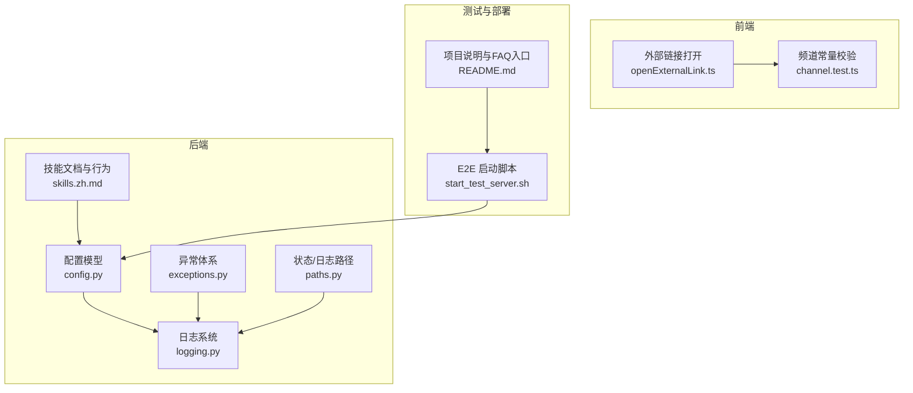
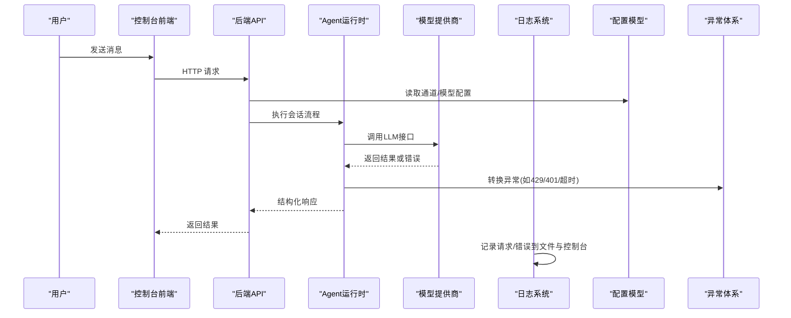
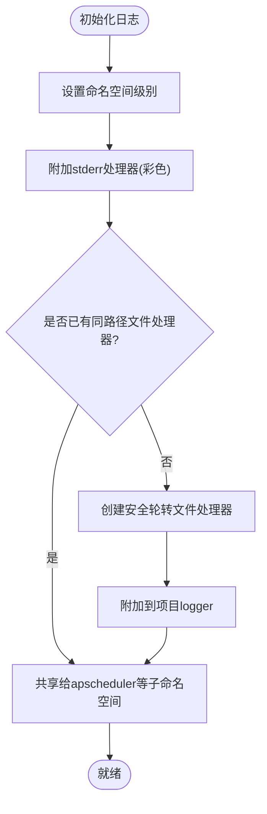
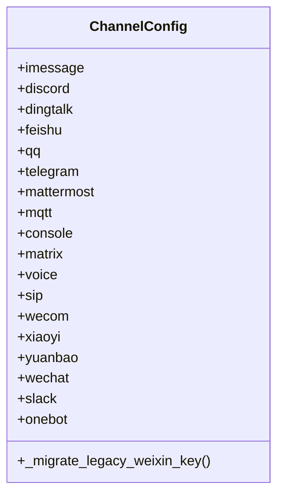
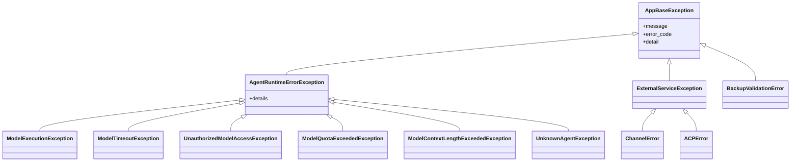
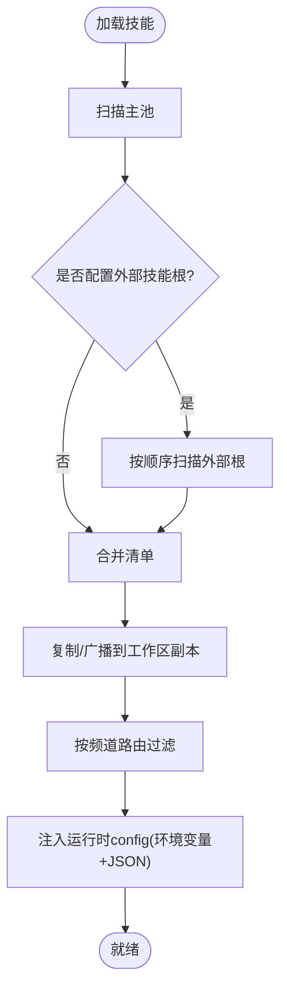
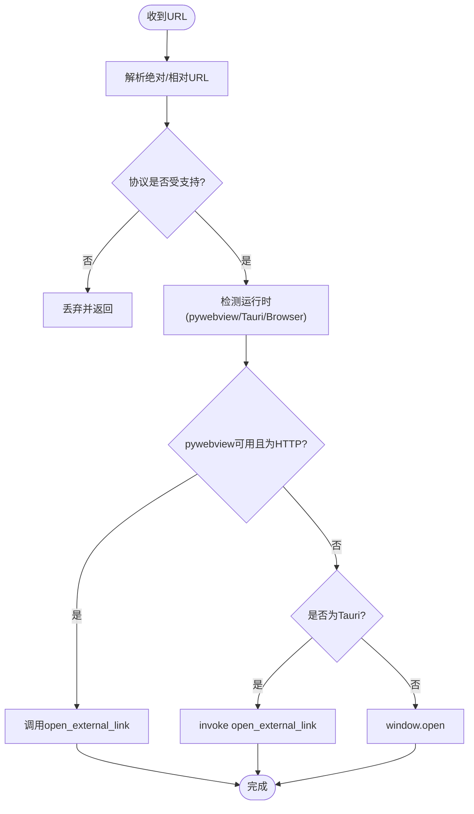
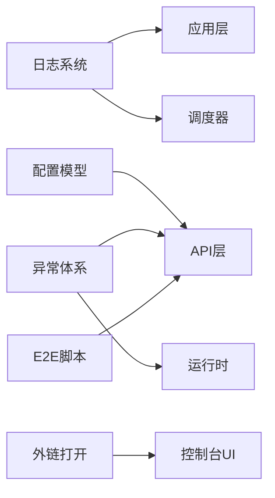

# 故障排除与FAQ

<cite>
**本文引用的文件**   
- [README.md](file://README.md)
- [logging.py](file://src/qwenpaw/utils/logging.py)
- [config.py](file://src/qwenpaw/config/config.py)
- [exceptions.py](file://src/qwenpaw/exceptions.py)
- [paths.py](file://src/qwenpaw/cli/tui/paths.py)
- [skills.zh.md](file://website/public/docs/skills.zh.md)
- [openExternalLink.ts](file://console/src/utils/openExternalLink.ts)
- [channel.test.ts](file://console/src/constants/channel.test.ts)
- [start_test_server.sh](file://e2e/scripts/start_test_server.sh)
</cite>

## 目录
1. [简介](#简介)
2. [项目结构](#项目结构)
3. [核心组件](#核心组件)
4. [架构总览](#架构总览)
5. [详细组件分析](#详细组件分析)
6. [依赖关系分析](#依赖关系分析)
7. [性能考虑](#性能考虑)
8. [故障排除指南](#故障排除指南)
9. [结论](#结论)
10. [附录](#附录)

## 简介
本指南面向 QwenPaw 的使用者与开发者，聚焦于“常见问题解答、性能调优、调试技巧与错误诊断”。内容基于仓库中的实际实现，覆盖日志体系、配置模型、异常分类、技能系统、外部链接打开策略、以及端到端测试启动脚本等关键路径。文档既适合初学者快速上手定位问题，也为有经验的工程师提供深入的技术细节与可操作建议。

## 项目结构
QwenPaw 采用多语言、多模块的混合架构：
- Python 后端（FastAPI 应用、Agent 运行时、配置与异常体系、日志与工具库）
- Tauri + React 控制台前端（跨平台桌面应用）
- 文档与示例（网站文档、E2E 测试脚本）

下图给出与本指南相关的核心模块与交互关系概览：

图表来源
- [logging.py:154-261](file://src/qwenpaw/utils/logging.py#L154-L261)
- [config.py:495-518](file://src/qwenpaw/config/config.py#L495-L518)
- [exceptions.py:10-171](file://src/qwenpaw/exceptions.py#L10-L171)
- [paths.py:15-34](file://src/qwenpaw/cli/tui/paths.py#L15-L34)
- [skills.zh.md:19-47](file://website/public/docs/skills.zh.md#L19-L47)
- [openExternalLink.ts:115-145](file://console/src/utils/openExternalLink.ts#L115-L145)
- [channel.test.ts:12-30](file://console/src/constants/channel.test.ts#L12-L30)
- [start_test_server.sh:41-46](file://e2e/scripts/start_test_server.sh#L41-L46)

章节来源
- [README.md:433-436](file://README.md#L433-L436)

## 核心组件
本节从“日志、配置、异常、路径、技能、前端外链”六个维度梳理关键能力及其在排障中的作用。

- 日志系统
  - 统一命名空间输出，避免第三方库噪音；支持彩色终端与纯文本格式；按大小轮转并兼容 Windows 文件锁定场景。
  - 关键路径：设置日志级别、附加项目级文件处理器、将调度器日志共享写入同一文件。
- 配置模型
  - 使用 Pydantic 模型承载各类通道、内存、心跳、ACP 等配置；具备迁移逻辑与默认值合并。
  - 常见排障点：字段别名、迁移键名、必填项缺失、类型不匹配。
- 异常体系
  - 分层异常：应用基础异常、运行时异常、渠道异常、备份异常、ACP 异常等；并提供 LLM API 异常转换器，自动归类为未授权、配额超限、超时、上下文超长等。
- 状态与日志路径
  - 跨平台状态目录解析，遵循环境变量与 XDG 规范；提供日志文件路径生成。
- 技能系统
  - 技能池与工作区副本双层结构；外部技能根目录、自动同步、频道路由、运行时 config 注入与优先级。
- 前端外链打开
  - 统一处理浏览器、pywebview、Tauri 三种运行时的外链打开策略，协议白名单校验与失败容错。

章节来源
- [logging.py:154-261](file://src/qwenpaw/utils/logging.py#L154-L261)
- [config.py:495-518](file://src/qwenpaw/config/config.py#L495-L518)
- [exceptions.py:10-171](file://src/qwenpaw/exceptions.py#L10-L171)
- [paths.py:15-34](file://src/qwenpaw/cli/tui/paths.py#L15-L34)
- [skills.zh.md:19-47](file://website/public/docs/skills.zh.md#L19-L47)
- [openExternalLink.ts:115-145](file://console/src/utils/openExternalLink.ts#L115-L145)

## 架构总览
下图展示一次典型“聊天请求”的调用链，突出日志、异常与配置的参与点，便于定位问题。

图表来源
- [logging.py:154-261](file://src/qwenpaw/utils/logging.py#L154-L261)
- [config.py:495-518](file://src/qwenpaw/config/config.py#L495-L518)
- [exceptions.py:673-800](file://src/qwenpaw/exceptions.py#L673-L800)

## 详细组件分析

### 日志系统（logging.py）
- 设计要点
  - 仅对应用命名空间输出，抑制第三方噪声。
  - 彩色终端格式化，非终端环境自动降级。
  - 安全轮转：Windows 下捕获权限错误，保持继续写入。
  - 统一文件处理器：将 APScheduler 等子命名空间共享写入同一文件。
- 排障要点
  - 若看不到日志：检查是否已附加项目级文件处理器、日志级别是否正确、是否被过滤器屏蔽。
  - 若日志重复：确认是否多次添加相同路径的文件处理器（幂等保护）。
  - 若轮转失败：观察 Windows 文件占用情况，确保无外部进程独占。

图表来源
- [logging.py:154-261](file://src/qwenpaw/utils/logging.py#L154-L261)

章节来源
- [logging.py:154-261](file://src/qwenpaw/utils/logging.py#L154-L261)

### 配置模型（config.py）
- 设计要点
  - 以 Pydantic 模型组织各通道配置（Discord、DingTalk、Feishu、Telegram、WeCom、Slack、OneBot 等），支持额外键扩展。
  - 包含迁移逻辑（例如 weixin -> wechat）与默认值合并。
- 排障要点
  - 旧配置键名不生效：注意迁移键名映射。
  - 字段别名差异：部分字段使用 camelCase 别名，保存时保持一致。
  - 必填项缺失：启用通道需填写对应凭据与域名等。

图表来源
- [config.py:495-518](file://src/qwenpaw/config/config.py#L495-L518)

章节来源
- [config.py:495-518](file://src/qwenpaw/config/config.py#L495-L518)

### 异常体系（exceptions.py）
- 设计要点
  - 分层异常：AppBaseException、AgentRuntimeErrorException、ChannelError、ACPError、BackupValidationError 等。
  - LLM API 异常转换器：根据状态码与关键词将原始异常转换为结构化异常（未授权、配额超限、超时、上下文超长等）。
- 排障要点
  - 401/403：检查密钥、权限、域名与网络可达性。
  - 429：降低并发、调整限流参数或等待配额恢复。
  - 超时：增大超时阈值、优化提示长度或切换模型。
  - 上下文超长：开启上下文压缩或减少输入长度。

图表来源
- [exceptions.py:10-171](file://src/qwenpaw/exceptions.py#L10-L171)
- [exceptions.py:673-800](file://src/qwenpaw/exceptions.py#L673-L800)

章节来源
- [exceptions.py:10-171](file://src/qwenpaw/exceptions.py#L10-L171)
- [exceptions.py:673-800](file://src/qwenpaw/exceptions.py#L673-L800)

### 状态与日志路径（paths.py）
- 设计要点
  - 跨平台状态目录解析：优先 PAW_STATE_DIR，其次平台默认（Windows LOCALAPPDATA、macOS Application Support、Linux XDG_STATE_HOME）。
  - 提供 log_path(name) 生成日志文件路径。
- 排障要点
  - 找不到日志：检查环境变量覆盖、目录是否存在、权限是否足够。
  - 多实例冲突：确保不同实例使用不同的状态目录。

章节来源
- [paths.py:15-34](file://src/qwenpaw/cli/tui/paths.py#L15-L34)

### 技能系统（skills.zh.md）
- 设计要点
  - 两层结构：技能池与工作区副本；外部技能根目录；自动同步；频道路由；运行时 config 注入与优先级。
- 排障要点
  - 技能未生效：检查频道路由限制、工作区副本是否安装、是否启用。
  - 配置未注入：核对 requires.env 声明与 config 键名；查看完整 JSON 变量。
  - 外部技能冲突：同名以先扫描到的为准，后者优先被遮蔽并产生警告。

图表来源
- [skills.zh.md:19-47](file://website/public/docs/skills.zh.md#L19-L47)
- [skills.zh.md:120-153](file://website/public/docs/skills.zh.md#L120-L153)
- [skills.zh.md:388-464](file://website/public/docs/skills.zh.md#L388-L464)

章节来源
- [skills.zh.md:19-47](file://website/public/docs/skills.zh.md#L19-L47)
- [skills.zh.md:120-153](file://website/public/docs/skills.zh.md#L120-L153)
- [skills.zh.md:388-464](file://website/public/docs/skills.zh.md#L388-L464)

### 前端外链打开（openExternalLink.ts）
- 设计要点
  - 统一处理浏览器、pywebview、Tauri 三种运行时的外链打开策略。
  - 协议白名单校验（http/https/mailto/tel），失败异步记录警告。
- 排障要点
  - 外链无法打开：检查当前运行时（Tauri/pywebview/browser）、协议是否在白名单、Tauri 命令是否可用。
  - 控制台托管在远端：检测 __TAURI_INTERNALS__ 以确定 Tauri 环境。

图表来源
- [openExternalLink.ts:115-145](file://console/src/utils/openExternalLink.ts#L115-L145)
- [openExternalLink.ts:76-91](file://console/src/utils/openExternalLink.ts#L76-L91)

章节来源
- [openExternalLink.ts:115-145](file://console/src/utils/openExternalLink.ts#L115-L145)
- [openExternalLink.ts:76-91](file://console/src/utils/openExternalLink.ts#L76-L91)

### 频道常量校验（channel.test.ts）
- 设计要点
  - 保证 CHANNELS 对象键值一致、颜色映射存在且有效。
- 排障要点
  - 前端显示异常：检查频道常量定义与颜色映射是否完整。

章节来源
- [channel.test.ts:12-30](file://console/src/constants/channel.test.ts#L12-L30)
- [channel.test.ts:32-45](file://console/src/constants/channel.test.ts#L32-L45)

### E2E 启动脚本（start_test_server.sh）
- 设计要点
  - 隔离工作目录与端口，导出专用环境变量，自动选择 qwenpaw 可执行。
- 排障要点
  - 端口占用：脚本会检查并提示停止旧实例。
  - 找不到 qwenpaw：通过 QWENPAW_PYTHON 指定 python 解释器或安装到 PATH。

章节来源
- [start_test_server.sh:17-46](file://e2e/scripts/start_test_server.sh#L17-L46)
- [start_test_server.sh:58-100](file://e2e/scripts/start_test_server.sh#L58-L100)
- [start_test_server.sh:105-107](file://e2e/scripts/start_test_server.sh#L105-L107)

## 依赖关系分析
- 组件耦合
  - 日志系统被多个子系统共享（应用、调度器等），通过命名空间与文件处理器解耦。
  - 配置模型为通道、内存、心跳等提供统一数据契约，变更影响面广，需谨慎维护。
  - 异常体系贯穿调用链，上层无需关心底层 SDK 异常细节。
- 外部依赖
  - 前端外链打开依赖 Tauri 内部钩子或 pywebview API。
  - E2E 脚本依赖系统命令（lsof）与 Python 环境。

图表来源
- [logging.py:154-261](file://src/qwenpaw/utils/logging.py#L154-L261)
- [config.py:495-518](file://src/qwenpaw/config/config.py#L495-L518)
- [exceptions.py:10-171](file://src/qwenpaw/exceptions.py#L10-L171)
- [openExternalLink.ts:115-145](file://console/src/utils/openExternalLink.ts#L115-L145)
- [start_test_server.sh:41-46](file://e2e/scripts/start_test_server.sh#L41-L46)

章节来源
- [logging.py:154-261](file://src/qwenpaw/utils/logging.py#L154-L261)
- [config.py:495-518](file://src/qwenpaw/config/config.py#L495-L518)
- [exceptions.py:10-171](file://src/qwenpaw/exceptions.py#L10-L171)
- [openExternalLink.ts:115-145](file://console/src/utils/openExternalLink.ts#L115-L145)
- [start_test_server.sh:41-46](file://e2e/scripts/start_test_server.sh#L41-L46)

## 性能考虑
- 日志轮转与磁盘IO
  - 合理设置最大文件大小与备份数量，避免频繁轮转造成 IO 抖动。
  - 在高并发场景下，关注 Windows 文件锁导致的轮转失败，必要时关闭外部日志查看器。
- 配置加载与迁移
  - 大型配置（多通道、多技能）首次加载可能较慢，避免在热路径中重复解析。
- 技能加载与注入
  - 外部技能根过多会增加扫描时间，按需配置并控制深度。
  - 运行时 config 注入仅在生效技能范围内进行，避免全局污染。
- 前端外链打开
  - 批量外链点击应去重与节流，避免频繁 invoke 调用。

[本节为通用指导，不直接分析具体文件]

## 故障排除指南

### 常见问题与解决方案
- 无法看到日志或日志为空
  - 检查是否已附加项目级文件处理器与日志级别；确认日志路径是否存在与可写。
  - 参考：[logging.py:154-261](file://src/qwenpaw/utils/logging.py#L154-L261)、[paths.py:15-34](file://src/qwenpaw/cli/tui/paths.py#L15-L34)
- 通道配置不生效
  - 核对字段别名与迁移键名（如 weixin -> wechat）；确认必填项与域名配置。
  - 参考：[config.py:495-518](file://src/qwenpaw/config/config.py#L495-L518)
- 模型调用报错（401/403/429/超时/上下文超长）
  - 依据异常分类定位原因：密钥/权限、配额、超时、上下文长度；调整配置或重试策略。
  - 参考：[exceptions.py:673-800](file://src/qwenpaw/exceptions.py#L673-L800)
- 外链无法打开
  - 检查协议白名单、运行时检测（Tauri/pywebview/browser）与 Tauri 命令可用性。
  - 参考：[openExternalLink.ts:115-145](file://console/src/utils/openExternalLink.ts#L115-L145)
- 技能未生效或配置未注入
  - 检查频道路由、工作区副本安装与启用状态；核对 requires.env 与 config 键名。
  - 参考：[skills.zh.md:388-464](file://website/public/docs/skills.zh.md#L388-L464)
- E2E 启动失败
  - 端口占用：停止旧实例或更换端口；找不到 qwenpaw：设置 QWENPAW_PYTHON 或安装到 PATH。
  - 参考：[start_test_server.sh:17-46](file://e2e/scripts/start_test_server.sh#L17-L46)、[start_test_server.sh:58-100](file://e2e/scripts/start_test_server.sh#L58-L100)

### 日志分析与监控
- 定位错误
  - 使用命名空间过滤与应用日志，结合 PlainFormatter 的时间戳与堆栈信息。
  - 参考：[logging.py:108-130](file://src/qwenpaw/utils/logging.py#L108-L130)
- 监控指标
  - 关注轮转次数、文件大小、异常分类统计（未授权、配额、超时、上下文超长）。
  - 参考：[exceptions.py:673-800](file://src/qwenpaw/exceptions.py#L673-L800)

### 调试技巧
- 本地隔离环境
  - 使用 E2E 脚本启动独立实例，避免干扰个人数据。
  - 参考：[start_test_server.sh:17-46](file://e2e/scripts/start_test_server.sh#L17-L46)
- 前端链路
  - 控制台托管在远端时，检测 __TAURI_INTERNALS__ 以确定 Tauri 环境。
  - 参考：[openExternalLink.ts:76-91](file://console/src/utils/openExternalLink.ts#L76-L91)

章节来源
- [logging.py:108-130](file://src/qwenpaw/utils/logging.py#L108-L130)
- [logging.py:154-261](file://src/qwenpaw/utils/logging.py#L154-L261)
- [exceptions.py:673-800](file://src/qwenpaw/exceptions.py#L673-L800)
- [openExternalLink.ts:76-91](file://console/src/utils/openExternalLink.ts#L76-L91)
- [start_test_server.sh:17-46](file://e2e/scripts/start_test_server.sh#L17-L46)

## 结论
通过统一的日志体系、严格的配置模型与清晰的异常分类，QwenPaw 提供了良好的可观测性与可维护性。配合技能系统的灵活注入与前端外链打开策略，用户可以在多种运行环境中稳定使用。针对常见问题，本文给出了基于源码的定位方法与解决步骤，帮助快速恢复服务与提升体验。

[本节为总结，不直接分析具体文件]

## 附录
- 官方 FAQ 入口
  - 参见 README 中的 FAQ 链接，获取更多常见问题与已知问题说明。
  - 参考：[README.md:433-436](file://README.md#L433-L436)

章节来源
- [README.md:433-436](file://README.md#L433-L436)