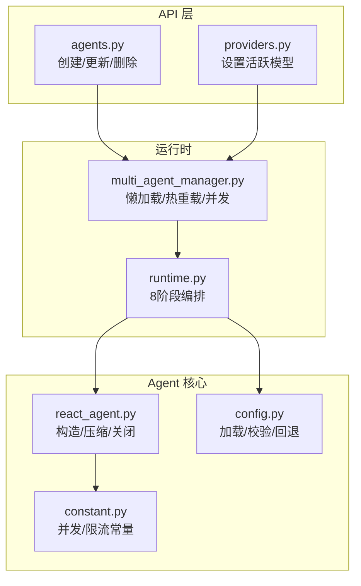
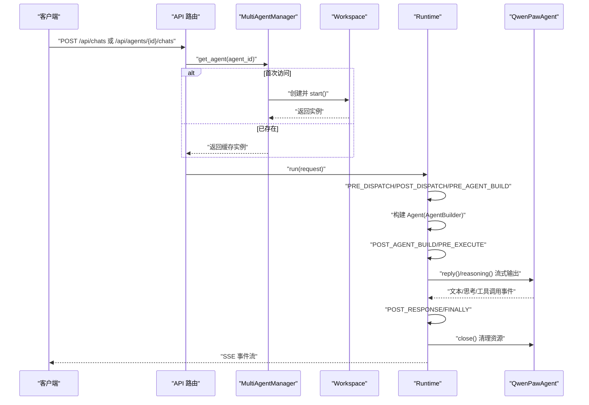
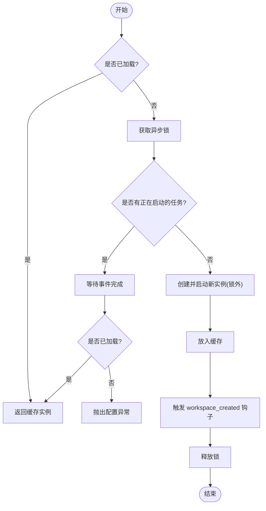
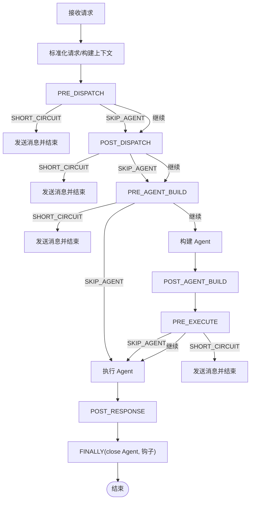
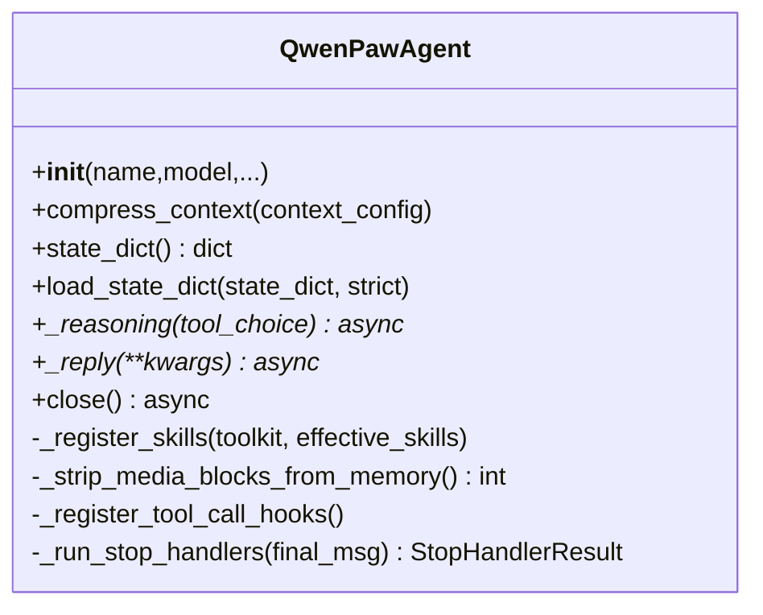
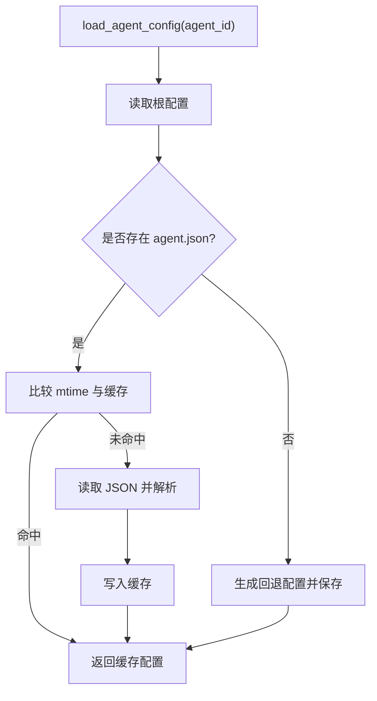
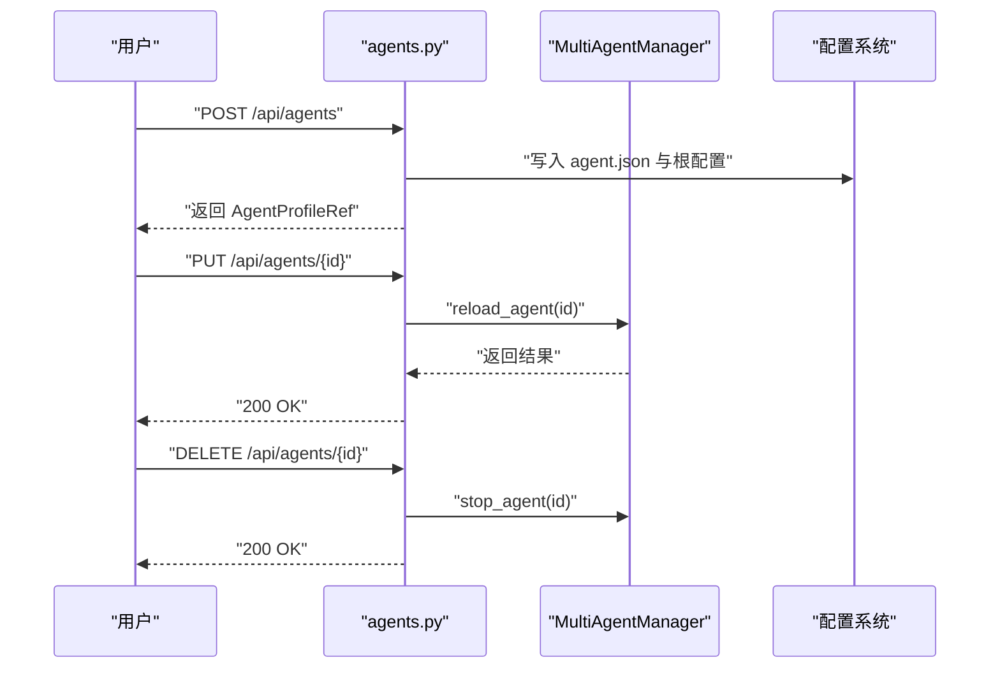
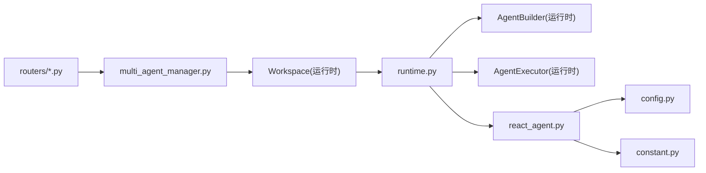

# Agent 生命周期管理

<cite>
**本文引用的文件**   
- [react_agent.py](file://src/qwenpaw/agents/react_agent.py)
- [multi_agent_manager.py](file://src/qwenpaw/app/multi_agent_manager.py)
- [runtime.py](file://src/qwenpaw/runtime/runtime.py)
- [config.py](file://src/qwenpaw/config/config.py)
- [constant.py](file://src/qwenpaw/constant.py)
- [agents.py](file://src/qwenpaw/app/routers/agents.py)
- [providers.py](file://src/qwenpaw/app/routers/providers.py)
- [test_agents_router.py](file://tests/unit/app/routers/test_agents_router.py)
- [test_multi_agent_lifecycle.py](file://tests/integration/test_multi_agent_lifecycle.py)
</cite>

## 目录
1. [简介](#简介)
2. [项目结构](#项目结构)
3. [核心组件](#核心组件)
4. [架构总览](#架构总览)
5. [详细组件分析](#详细组件分析)
6. [依赖关系分析](#依赖关系分析)
7. [性能与并发](#性能与并发)
8. [故障排查指南](#故障排查指南)
9. [结论](#结论)
10. [附录：配置参考与调优建议](#附录配置参考与调优建议)

## 简介
本文件面向 QwenPaw 的 Agent 生命周期管理，系统性阐述从创建、初始化、运行到销毁的完整流程；覆盖参数校验、依赖注入、配置加载、资源分配；详细说明状态转换（空闲、运行中、暂停、终止）及其触发条件；记录并发控制、线程安全与资源清理策略；并给出多 Agent 场景下的负载均衡、故障转移与监控告警机制。文末提供 Agent 配置文件参考与性能调优建议。

## 项目结构
围绕 Agent 生命周期的关键代码分布在以下模块：
- 运行时编排：按阶段驱动请求处理、构建与执行 Agent、异常与取消路径持久化
- 多 Agent 管理器：懒加载、热重载、并发启动与优雅停止
- Agent 实现：上下文压缩、媒体块处理、工具钩子、关闭清理
- 配置系统：Agent 配置加载、校验、回退与缓存
- API 路由：创建/更新/删除 Agent、切换模型触发热重载
- 常量与限流：并发与速率限制等全局开关

图示来源
- [agents.py:330-379](file://src/qwenpaw/app/routers/agents.py#L330-L379)
- [providers.py:693-732](file://src/qwenpaw/app/routers/providers.py#L693-L732)
- [multi_agent_manager.py:1-607](file://src/qwenpaw/app/multi_agent_manager.py#L1-L607)
- [runtime.py:1-518](file://src/qwenpaw/runtime/runtime.py#L1-L518)
- [react_agent.py:1-809](file://src/qwenpaw/agents/react_agent.py#L1-L809)
- [config.py:2302-2360](file://src/qwenpaw/config/config.py#L2302-L2360)
- [constant.py:314-355](file://src/qwenpaw/constant.py#L314-L355)

章节来源
- [agents.py:330-379](file://src/qwenpaw/app/routers/agents.py#L330-L379)
- [providers.py:693-732](file://src/qwenpaw/app/routers/providers.py#L693-L732)
- [multi_agent_manager.py:1-607](file://src/qwenpaw/app/multi_agent_manager.py#L1-L607)
- [runtime.py:1-518](file://src/qwenpaw/runtime/runtime.py#L1-L518)
- [react_agent.py:1-809](file://src/qwenpaw/agents/react_agent.py#L1-L809)
- [config.py:2302-2360](file://src/qwenpaw/config/config.py#L2302-L2360)
- [constant.py:314-355](file://src/qwenpaw/constant.py#L314-L355)

## 核心组件
- MultiAgentManager：负责多 Agent 工作空间的懒加载、并发启动、零停机热重载与优雅停止。内部使用异步锁与事件去重，避免重复初始化；在慢初始化期间释放锁，允许并行启动多个 Agent。
- Runtime：每个 Workspace 一个实例，按 8 个阶段编排请求处理，包含“构建 Agent”和“执行 Agent”两个固定步骤，并在取消或异常时进行最佳努力的状态持久化。
- QwenPawAgent：基于 ReAct 的 Agent 实现，负责上下文压缩、媒体块处理、工具钩子注册、会话状态序列化/反序列化以及关闭时的资源清理（governor、历史滚动、offloader）。
- 配置系统：load_agent_config 支持 mtime 缓存、缺失时生成回退配置、读写 agent.json；AgentsRunningConfig 定义运行期行为（最大迭代、重试、并发、QPM 等）。
- API 路由：创建/更新/删除 Agent 的 HTTP 接口，更新后触发热重载；设置活跃模型时同步写入 agent 配置并调度热重载。

章节来源
- [multi_agent_manager.py:1-607](file://src/qwenpaw/app/multi_agent_manager.py#L1-L607)
- [runtime.py:1-518](file://src/qwenpaw/runtime/runtime.py#L1-L518)
- [react_agent.py:1-809](file://src/qwenpaw/agents/react_agent.py#L1-L809)
- [config.py:1130-1180](file://src/qwenpaw/config/config.py#L1130-L1180)
- [config.py:2302-2360](file://src/qwenpaw/config/config.py#L2302-L2360)
- [agents.py:330-379](file://src/qwenpaw/app/routers/agents.py#L330-L379)
- [providers.py:693-732](file://src/qwenpaw/app/routers/providers.py#L693-L732)

## 架构总览
下图展示一次典型请求从 API 进入，经多 Agent 管理器获取/创建 Workspace，Runtime 编排构建与执行 Agent，最终完成响应与清理的全链路。

图示来源
- [multi_agent_manager.py:54-158](file://src/qwenpaw/app/multi_agent_manager.py#L54-L158)
- [runtime.py:49-206](file://src/qwenpaw/runtime/runtime.py#L49-L206)
- [react_agent.py:411-552](file://src/qwenpaw/agents/react_agent.py#L411-L552)
- [react_agent.py:288-334](file://src/qwenpaw/agents/react_agent.py#L288-L334)

## 详细组件分析

### 组件一：多 Agent 管理器（懒加载、热重载、并发）
- 懒加载与去重：get_agent 先快速命中缓存；未命中则加锁检查 pending_starts，若已有任务在启动则等待其完成；否则读取配置、创建并启动新实例，完成后置入缓存并通知等待者。
- 零停机热重载：reload_agent 先创建并启动新实例，再原子替换旧实例，最后优雅停止旧实例（有活动任务则后台延迟清理，无活动任务则立即停止）。
- 并发启动：start_all_configured_agents 对启用 Agent 并行调用 get_agent，由于 get_agent 仅在字典操作时持有锁，慢初始化不阻塞其他 Agent。
- 优雅停止：stop_all 并发停止所有实例并清空缓存；cancel_all_cleanup_tasks 取消并等待后台清理任务。

图示来源
- [multi_agent_manager.py:54-158](file://src/qwenpaw/app/multi_agent_manager.py#L54-L158)
- [multi_agent_manager.py:321-448](file://src/qwenpaw/app/multi_agent_manager.py#L321-L448)
- [multi_agent_manager.py:540-601](file://src/qwenpaw/app/multi_agent_manager.py#L540-L601)

章节来源
- [multi_agent_manager.py:1-607](file://src/qwenpaw/app/multi_agent_manager.py#L1-L607)

### 组件二：运行时编排（8 阶段、取消保护、错误处理）
- 阶段划分：PRE_DISPATCH → POST_DISPATCH → PRE_AGENT_BUILD → POST_AGENT_BUILD → PRE_EXECUTE → 构建 Agent → 执行 Agent → POST_RESPONSE → FINALLY。
- 短路与跳过：各阶段可返回 SHORT_CIRCUIT 或 SKIP_AGENT，提前产出消息或跳过 Agent 执行。
- 取消与异常：捕获 CancelledError/KeyboardInterrupt 时，将部分流式内容注入上下文并持久化中断轮次；ON_ERROR 钩子执行后发送错误信封；finally 中优先 close Agent 以刷新审计与策略，再执行 FINALLY 钩子。
- 上下文注入：将 context_injections 合并为单条 system 提示插入输入消息头部。

图示来源
- [runtime.py:49-206](file://src/qwenpaw/runtime/runtime.py#L49-L206)
- [runtime.py:478-515](file://src/qwenpaw/runtime/runtime.py#L478-L515)

章节来源
- [runtime.py:1-518](file://src/qwenpaw/runtime/runtime.py#L1-L518)

### 组件三：Agent 实现（构造、上下文、工具钩子、关闭）
- 构造与依赖注入：通过外部传入 model、system_prompt、toolkit、middlewares、agent_config 等，不自行构建依赖；注册技能元数据、记忆工具、权限模式绕过、工具调用钩子。
- 上下文压缩：优先委托给 context_manager；否则根据 running.light_context_config 决定是否走原生压缩；每次压缩前会清理孤立 tool_result 消息，防止 400 错误。
- 媒体块处理：当模型不支持或多模态被拒绝时，主动剥离媒体块或请求时强制剥离；失败后学习能力缓存并自动重试。
- 停止钩子与循环延续：每轮推理后运行 stop handlers，支持 INTERRUPT_AND_CONTINUE 以追加 continuation 消息继续循环。
- 关闭清理：停止 governor、清理滚动历史、过期 offloader 文件，确保长连接服务下 FD 不泄漏。

图示来源
- [react_agent.py:59-143](file://src/qwenpaw/agents/react_agent.py#L59-L143)
- [react_agent.py:145-183](file://src/qwenpaw/agents/react_agent.py#L145-L183)
- [react_agent.py:193-267](file://src/qwenpaw/agents/react_agent.py#L193-L267)
- [react_agent.py:288-334](file://src/qwenpaw/agents/react_agent.py#L288-L334)
- [react_agent.py:411-552](file://src/qwenpaw/agents/react_agent.py#L411-L552)
- [react_agent.py:653-706](file://src/qwenpaw/agents/react_agent.py#L653-L706)

章节来源
- [react_agent.py:1-809](file://src/qwenpaw/agents/react_agent.py#L1-L809)

### 组件四：配置加载与校验（agent.json、回退、缓存）
- load_agent_config：按 agent_id 解析根配置，定位 workspace_dir 与 agent.json；不存在则生成回退配置并落盘；使用 mtime 与内存缓存减少磁盘 IO。
- AgentsRunningConfig：定义 max_iters、loop、llm_retry_enabled、llm_max_retries、backoff 基线与上限、并发与 QPM 等运行期参数。
- 健康检查：doctor_checks 提供只读校验 agent.json 与 enabled 列表的 dry-run 加载，便于运维自检。

图示来源
- [config.py:2302-2360](file://src/qwenpaw/config/config.py#L2302-L2360)
- [config.py:1130-1180](file://src/qwenpaw/config/config.py#L1130-L1180)

章节来源
- [config.py:2302-2360](file://src/qwenpaw/config/config.py#L2302-L2360)
- [config.py:1130-1180](file://src/qwenpaw/config/config.py#L1130-L1180)

### 组件五：API 路由与热重载（创建/更新/删除/切换模型）
- 创建 Agent：校验参数、初始化工作空间、写入 agent.json 与根配置、返回引用。
- 更新 Agent：更新配置并触发热重载。
- 删除 Agent：禁止删除默认 Agent；成功则调用 manager.stop_agent 停止实例并从缓存移除。
- 切换活跃模型：若当前 Agent 未设置 active_model，则同步写入并调度热重载；否则按 scope 指定 agent_id 更新并热重载。

图示来源
- [agents.py:330-379](file://src/qwenpaw/app/routers/agents.py#L330-L379)
- [providers.py:693-732](file://src/qwenpaw/app/routers/providers.py#L693-L732)
- [test_agents_router.py:1-46](file://tests/unit/app/routers/test_agents_router.py#L1-L46)

章节来源
- [agents.py:330-379](file://src/qwenpaw/app/routers/agents.py#L330-L379)
- [providers.py:693-732](file://src/qwenpaw/app/routers/providers.py#L693-L732)
- [test_agents_router.py:104-150](file://tests/unit/app/routers/test_agents_router.py#L104-L150)

## 依赖关系分析
- 低耦合：Agent 构造完全由外部注入依赖，避免内部隐式构建；Runtime 仅负责编排，具体逻辑下沉至 Agent 与各 Hook。
- 高内聚：MultiAgentManager 集中管理实例生命周期；QwenPawAgent 聚合上下文、工具、记忆与清理逻辑。
- 外部依赖：配置系统、插件注册表、Provider 能力缓存、ToolCoordinator 等通过 request_context 或显式注入接入。

图示来源
- [runtime.py:1-518](file://src/qwenpaw/runtime/runtime.py#L1-L518)
- [multi_agent_manager.py:1-607](file://src/qwenpaw/app/multi_agent_manager.py#L1-L607)
- [react_agent.py:1-809](file://src/qwenpaw/agents/react_agent.py#L1-L809)
- [config.py:2302-2360](file://src/qwenpaw/config/config.py#L2302-L2360)
- [constant.py:314-355](file://src/qwenpaw/constant.py#L314-L355)

章节来源
- [runtime.py:1-518](file://src/qwenpaw/runtime/runtime.py#L1-L518)
- [multi_agent_manager.py:1-607](file://src/qwenpaw/app/multi_agent_manager.py#L1-L607)
- [react_agent.py:1-809](file://src/qwenpaw/agents/react_agent.py#L1-L809)
- [config.py:2302-2360](file://src/qwenpaw/config/config.py#L2302-L2360)
- [constant.py:314-355](file://src/qwenpaw/constant.py#L314-L355)

## 性能与并发
- 并发启动：MultiAgentManager.start_all_configured_agents 并行启动启用的 Agent；get_agent 仅在字典操作时持有锁，慢初始化不阻塞其他 Agent。
- 并发与限流：LLM_MAX_CONCURRENT 控制并发调用数；LLM_MAX_QPM 基于滑动窗口限制每分钟查询数；LLM_RATE_LIMIT_PAUSE/JITTER 用于 429 后的退避与抖动。
- 上下文压缩：按需启用 light_context_config.context_compact_config.enabled，避免不必要的压缩开销；scroll 策略可持久化去重与淘汰索引。
- 资源清理：Agent.close 在 finally 中统一执行，确保审计日志与策略持久化后再释放资源。

章节来源
- [multi_agent_manager.py:540-601](file://src/qwenpaw/app/multi_agent_manager.py#L540-L601)
- [constant.py:314-355](file://src/qwenpaw/constant.py#L314-L355)
- [react_agent.py:145-183](file://src/qwenpaw/agents/react_agent.py#L145-L183)
- [react_agent.py:288-334](file://src/qwenpaw/agents/react_agent.py#L288-L334)

## 故障排查指南
- 配置缺失或损坏：
  - 现象：创建/更新/热重载失败或列表降级显示 ID 作为名称。
  - 排查：确认 agent.json 存在且符合 AgentProfileConfig；使用 doctor 检查与修复。
- 默认 Agent 不可删除：
  - 现象：删除 default 返回 400。
  - 原因：内置保护，防止误删。
- 热重载失败：
  - 现象：reload_agent 返回 False，旧实例仍提供服务。
  - 排查：查看新实例启动异常日志；确认配置与依赖可用。
- 取消/中断导致状态丢失：
  - 现象：前端一直 loading。
  - 说明：Runtime 在取消路径会注入部分响应并持久化中断轮次，确保前端收到 completed 事件。
- 媒体块导致 400：
  - 现象：模型拒绝图片/音频/视频。
  - 处理：Agent 自动识别并剥离媒体块，必要时学习能力缓存并重试。

章节来源
- [test_agents_router.py:104-150](file://tests/unit/app/routers/test_agents_router.py#L104-L150)
- [runtime.py:142-206](file://src/qwenpaw/runtime/runtime.py#L142-L206)
- [react_agent.py:411-552](file://src/qwenpaw/agents/react_agent.py#L411-L552)

## 结论
QwenPaw 的 Agent 生命周期管理以 MultiAgentManager 为中心，结合 Runtime 的阶段编排与 QwenPawAgent 的健壮实现，实现了懒加载、零停机热重载、并发启动与优雅停止；配合配置系统的回退与缓存、API 路由的便捷操作，形成稳定可扩展的多 Agent 运行体系。通过合理的并发与限流配置、上下文压缩与资源清理策略，可在生产环境获得良好的性能与稳定性。

## 附录：配置参考与调优建议

### Agent 配置文件（agent.json）关键字段参考
- 顶层分组（示例键名）：channels、mcp、heartbeat、running、llm_routing、system_prompt_files、tools、plan
- 运行期配置（AgentsRunningConfig）：
  - max_iters：最大推理-行动迭代次数
  - loop：循环工程相关配置
  - llm_retry_enabled：是否启用 LLM 瞬态错误自动重试
  - llm_max_retries：最大重试次数
  - llm_backoff_base/backoff_cap：指数退避基线与上限
  - llm_max_concurrent：全局并发上限（共享）
  - llm_max_qpm：每分钟查询上限（滑动窗口）
  - light_context_config：轻量上下文策略（含 context_compact_config、scroll_config、tool_result_pruning_config 等）
- 语言与模型：
  - language：默认 zh
  - active_model：provider_id + model 槽位配置

章节来源
- [config.py:1401-1440](file://src/qwenpaw/config/config.py#L1401-L1440)
- [config.py:1130-1180](file://src/qwenpaw/config/config.py#L1130-L1180)
- [config.py:2302-2360](file://src/qwenpaw/config/config.py#L2302-L2360)

### 性能调优建议
- 合理设置 LLM_MAX_CONCURRENT 与 LLM_MAX_QPM，依据供应商配额与平均耗时估算；例如 OpenAI Tier-1 约 500 QPM，可按 3s/call 估算并发。
- 开启 light_context_config.context_compact_config.enabled 以控制上下文膨胀；根据业务调整 scroll 历史保留天数与 offloader 清理周期。
- 针对媒体敏感模型，启用媒体块剥离与能力缓存学习，避免反复 400。
- 使用零停机热重载进行在线升级与配置变更，注意旧实例后台延迟清理的超时与异常处理。

章节来源
- [constant.py:314-355](file://src/qwenpaw/constant.py#L314-L355)
- [react_agent.py:145-183](file://src/qwenpaw/agents/react_agent.py#L145-L183)
- [react_agent.py:288-334](file://src/qwenpaw/agents/react_agent.py#L288-L334)
- [multi_agent_manager.py:321-448](file://src/qwenpaw/app/multi_agent_manager.py#L321-L448)