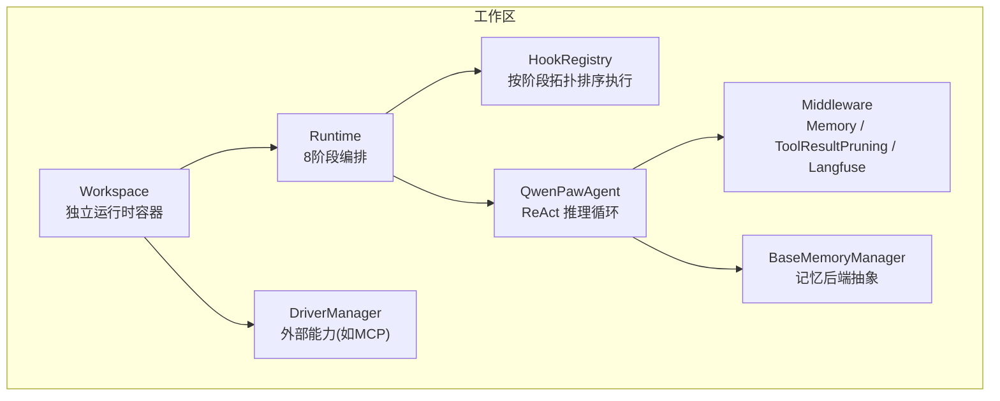
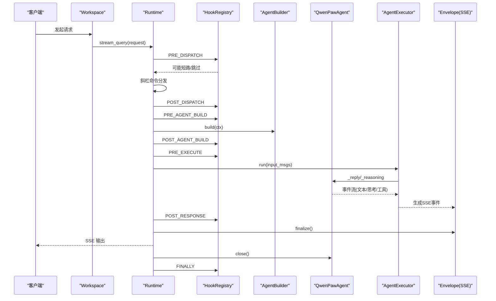
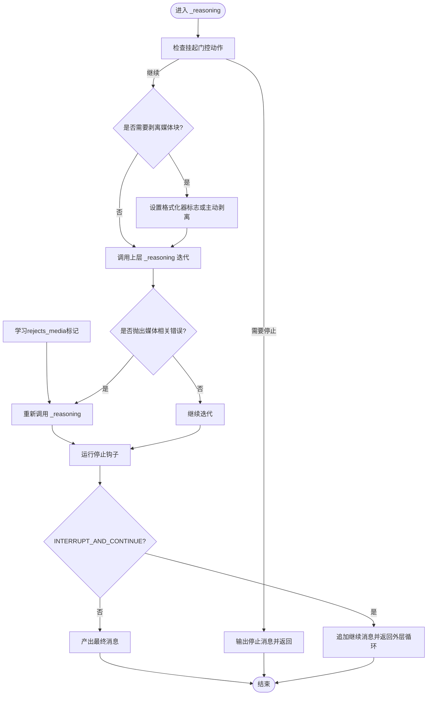
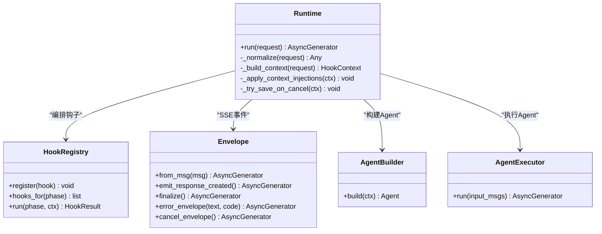
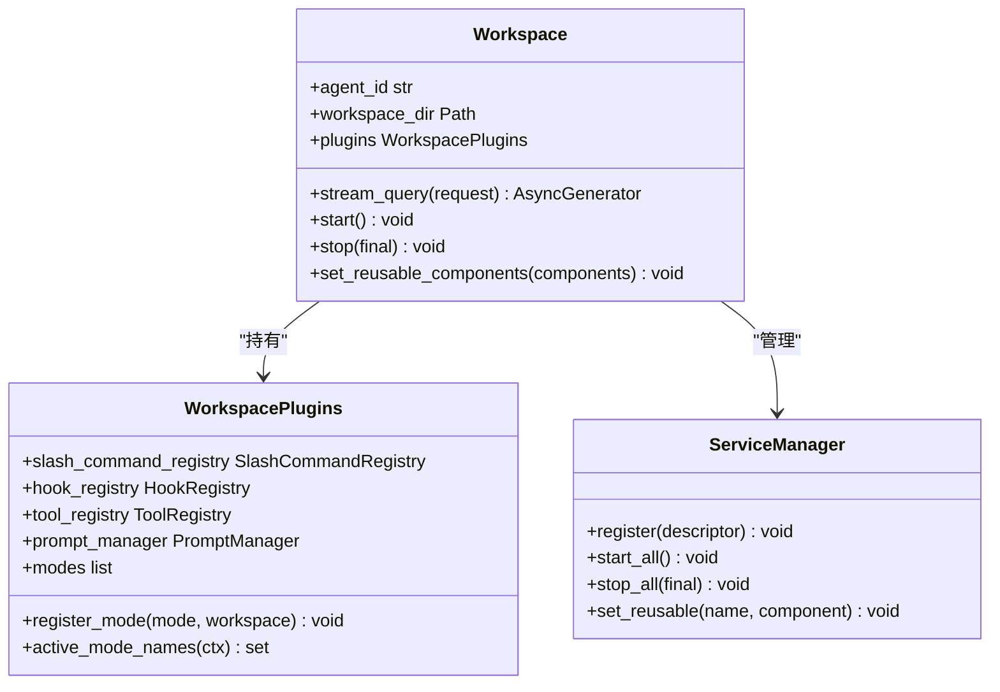
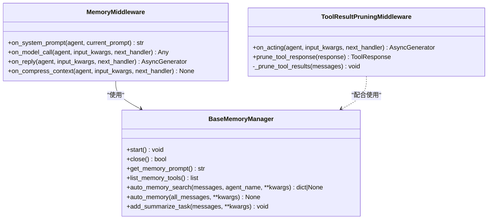
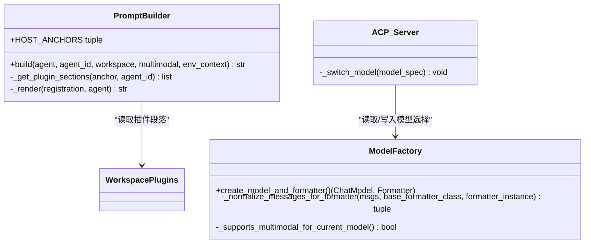
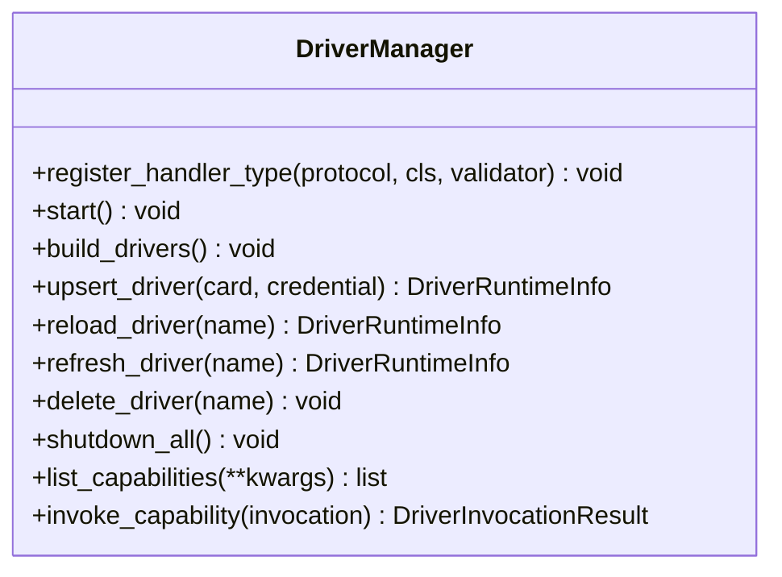
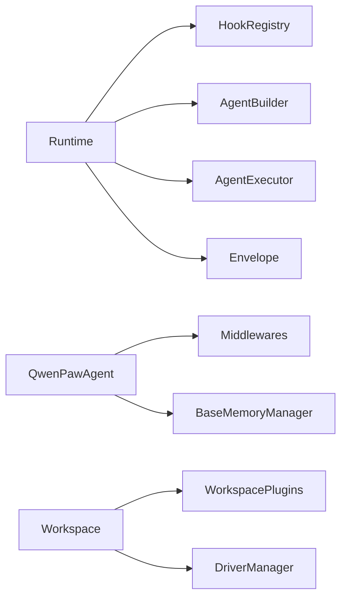

# Agent 系统架构

<cite>
**本文引用的文件**   
- [react_agent.py](file://src/qwenpaw/agents/react_agent.py)
- [runtime.py](file://src/qwenpaw/runtime/runtime.py)
- [hooks.py](file://src/qwenpaw/runtime/hooks.py)
- [workspace.py](file://src/qwenpaw/app/workspace/workspace.py)
- [workspace_plugins.py](file://src/qwenpaw/app/workspace/workspace_plugins.py)
- [model_factory.py](file://src/qwenpaw/agents/model_factory.py)
- [prompt_builder.py](file://src/qwenpaw/agents/prompt_builder.py)
- [middlewares.py](file://src/qwenpaw/agents/middlewares.py)
- [base_memory_manager.py](file://src/qwenpaw/agents/memory/base_memory_manager.py)
- [manager.py](file://src/qwenpaw/drivers/manager.py)
- [server.py](file://src/qwenpaw/agents/acp/server.py)
</cite>

## 目录
1. [简介](#简介)
2. [项目结构](#项目结构)
3. [核心组件](#核心组件)
4. [架构总览](#架构总览)
5. [详细组件分析](#详细组件分析)
6. [依赖关系分析](#依赖关系分析)
7. [性能考量](#性能考量)
8. [故障排查指南](#故障排查指南)
9. [结论](#结论)
10. [附录](#附录)

## 简介
本架构文档聚焦 QwenPaw 的 Agent 系统，围绕基于 ReAct 模式的智能代理实现展开，覆盖以下关键主题：
- Agent 生命周期管理、状态机转换、消息处理流程与错误恢复机制
- 工作空间（Workspace）的概念与作用：多 Agent 隔离、资源管理与上下文切换
- Runtime 运行时的职责：请求路由、中间件管道、钩子系统与扩展点
- Agent 配置模型、Prompt 构建器与模型工厂的设计模式
- Agent 间通信机制与多 Agent 协作的实现细节

## 项目结构
QwenPaw 后端以“工作区”为边界组织运行时环境，每个 Workspace 拥有独立的插件注册表、会话存储、记忆管理器、驱动管理器与定时任务等。请求进入后由 Runtime 编排 8 个阶段的生命周期，并在固定步骤中构建并执行 Agent。Agent 基于 AgentScope 2.0 的 ReAct 能力，结合 QwenPaw 的中间件、工具、技能与记忆系统进行增强。

图表来源
- [workspace.py:39-138](file://src/qwenpaw/app/workspace/workspace.py#L39-L138)
- [runtime.py:32-141](file://src/qwenpaw/runtime/runtime.py#L32-L141)
- [hooks.py:256-313](file://src/qwenpaw/runtime/hooks.py#L256-L313)
- [react_agent.py:47-143](file://src/qwenpaw/agents/react_agent.py#L47-L143)
- [middlewares.py:46-168](file://src/qwenpaw/agents/middlewares.py#L46-L168)
- [base_memory_manager.py:33-116](file://src/qwenpaw/agents/memory/base_memory_manager.py#L33-L116)
- [manager.py:47-125](file://src/qwenpaw/drivers/manager.py#L47-L125)

章节来源
- [workspace.py:39-138](file://src/qwenpaw/app/workspace/workspace.py#L39-L138)
- [runtime.py:32-141](file://src/qwenpaw/runtime/runtime.py#L32-L141)
- [hooks.py:256-313](file://src/qwenpaw/runtime/hooks.py#L256-L313)

## 核心组件
- QwenPawAgent：基于 AgentScope 2.0 的 ReAct Agent，集成工具、技能、记忆与编码模式；提供上下文压缩、媒体块处理、停止钩子与工具调用超时注入等增强。
- Runtime：每工作区一个实例，负责请求标准化、8 阶段钩子编排、构建 Agent、执行 Agent、错误恢复与最终清理。
- HookRegistry：按 Phase 注册与拓扑排序执行钩子，支持短路、跳过 Agent 等控制语义。
- Workspace：封装完整独立运行时，包含会话、记忆、驱动、频道、定时任务与工作区插件注册表。
- BaseMemoryManager：记忆后端抽象，提供自动记忆搜索、周期性持久化、摘要任务队列等。
- DriverManager：外部能力（当前为 MCP）的统一生命周期与调度，支持热重载与策略同步。
- PromptBuilder：将宿主锚点与插件段落组合成系统提示。
- ModelFactory：统一创建 ChatModel 与 Formatter，处理多媒体归一化、去重与大小限制。
- Middlewares：内存注入、工具结果裁剪、可观测性记录等中间件。

章节来源
- [react_agent.py:47-143](file://src/qwenpaw/agents/react_agent.py#L47-L143)
- [runtime.py:32-141](file://src/qwenpaw/runtime/runtime.py#L32-L141)
- [hooks.py:256-313](file://src/qwenpaw/runtime/hooks.py#L256-L313)
- [workspace.py:39-138](file://src/qwenpaw/app/workspace/workspace.py#L39-L138)
- [base_memory_manager.py:33-116](file://src/qwenpaw/agents/memory/base_memory_manager.py#L33-L116)
- [manager.py:47-125](file://src/qwenpaw/drivers/manager.py#L47-L125)
- [prompt_builder.py:23-85](file://src/qwenpaw/agents/prompt_builder.py#L23-L85)
- [model_factory.py:81-141](file://src/qwenpaw/agents/model_factory.py#L81-L141)
- [middlewares.py:46-168](file://src/qwenpaw/agents/middlewares.py#L46-L168)

## 架构总览
下图展示了从请求进入到 Agent 响应输出的端到端流程，包括钩子编排、中间件与错误恢复路径。

图表来源
- [runtime.py:49-206](file://src/qwenpaw/runtime/runtime.py#L49-L206)
- [hooks.py:293-313](file://src/qwenpaw/runtime/hooks.py#L293-L313)
- [react_agent.py:647-706](file://src/qwenpaw/agents/react_agent.py#L647-L706)

## 详细组件分析

### ReAct Agent 生命周期与状态机
- 构造与依赖注入：通过 AgentBuilder 传入 model、system_prompt、toolkit、middlewares、agent_config 等，避免内部构建耦合。
- 推理循环：重写 _reasoning，支持主动剥离不支持的多模态媒体块、被动重试（当检测到媒体相关错误）、以及 Stop Hook 驱动的“中断并继续”。
- 上下文压缩：优先使用注入的 context_manager（滚动策略），否则回退到 AgentScope 原生压缩；每次压缩前对上下文进行工具消息清洗，防止孤儿 tool_result 导致 400。
- 会话持久化：state_dict/load_state_dict 兼容 2.0 与 1.x 格式，加载时同样进行上下文清洗，并恢复滚动管理器状态。
- 关闭清理：停止治理器、清理历史保留窗口、过期工具结果文件等。

图表来源
- [react_agent.py:411-552](file://src/qwenpaw/agents/react_agent.py#L411-L552)
- [react_agent.py:145-184](file://src/qwenpaw/agents/react_agent.py#L145-L184)
- [react_agent.py:193-267](file://src/qwenpaw/agents/react_agent.py#L193-L267)
- [react_agent.py:288-334](file://src/qwenpaw/agents/react_agent.py#L288-L334)

章节来源
- [react_agent.py:47-143](file://src/qwenpaw/agents/react_agent.py#L47-L143)
- [react_agent.py:411-552](file://src/qwenpaw/agents/react_agent.py#L411-L552)
- [react_agent.py:145-184](file://src/qwenpaw/agents/react_agent.py#L145-L184)
- [react_agent.py:193-267](file://src/qwenpaw/agents/react_agent.py#L193-L267)
- [react_agent.py:288-334](file://src/qwenpaw/agents/react_agent.py#L288-L334)

### Runtime 运行时：请求路由、中间件管道、钩子系统与扩展点
- 请求标准化：规范化输入、分配 session_id/user_id。
- 8 阶段编排：PRE_DISPATCH → POST_DISPATCH → PRE_AGENT_BUILD → POST_AGENT_BUILD → PRE_EXECUTE → POST_RESPONSE → ON_ERROR → FINALLY。
- 固定步骤：斜杠命令分发、Agent 构建、Agent 执行。
- 上下文注入：在 PRE_EXECUTE 之前合并 context_injections 为 system 提示。
- 错误恢复：捕获异常与取消，保存部分响应与未闭合工具调用，触发 ON_ERROR 钩子，最后 FINALLY 清理。
- 扩展点：HookRegistry 支持 before/after 约束与优先级，确保稳定顺序；SHORT_CIRCUIT/SKIP_AGENT 控制流。

图表来源
- [runtime.py:32-206](file://src/qwenpaw/runtime/runtime.py#L32-L206)
- [hooks.py:256-313](file://src/qwenpaw/runtime/hooks.py#L256-L313)

章节来源
- [runtime.py:49-206](file://src/qwenpaw/runtime/runtime.py#L49-L206)
- [hooks.py:293-313](file://src/qwenpaw/runtime/hooks.py#L293-L313)

### 工作空间（Workspace）：多 Agent 隔离、资源管理与上下文切换
- 隔离边界：每个 Workspace 对应一个 agent_id，拥有独立的会话存储、记忆管理器、驱动管理器、频道管理器、定时任务与工作区插件注册表。
- 服务注册：通过 ServiceDescriptor 声明式注册服务，支持并发初始化、可选依赖、启动/停止方法。
- 启动流程：初始化技能池、迁移旧数据、启动所有服务。
- 重启与复用：set_reusable_components 允许跨实例复用某些组件（如 memory_manager、chat_manager）。
- ACP 集成：ACP Server 解析 workspace_dir，按需启动 Workspace 并注入 AppServiceManager。

图表来源
- [workspace.py:39-138](file://src/qwenpaw/app/workspace/workspace.py#L39-L138)
- [workspace_plugins.py:31-66](file://src/qwenpaw/app/workspace/workspace_plugins.py#L31-L66)
- [server.py:454-500](file://src/qwenpaw/agents/acp/server.py#L454-L500)

章节来源
- [workspace.py:269-426](file://src/qwenpaw/app/workspace/workspace.py#L269-L426)
- [workspace.py:459-500](file://src/qwenpaw/app/workspace/workspace.py#L459-L500)
- [workspace.py:546-575](file://src/qwenpaw/app/workspace/workspace.py#L546-L575)
- [workspace_plugins.py:31-66](file://src/qwenpaw/app/workspace/workspace_plugins.py#L31-L66)
- [server.py:454-500](file://src/qwenpaw/agents/acp/server.py#L454-L500)

### 中间件管道与记忆系统
- MemoryMiddleware：在 on_system_prompt 注入记忆指导，在 on_model_call 前进行自动记忆检索并临时注入上下文，在 on_reply 与 on_compress_context 触发周期性自动记忆持久化。
- ToolResultPruningMiddleware：在 on_acting 中对 ToolResponse 进行文本块级裁剪，并对历史 tool_result 按新旧阈值修剪，必要时保存到文件以便恢复。
- LangfuseToolSpanMiddleware：记录工具执行的观测，便于可观测性追踪。
- BaseMemoryManager：定义自动记忆接口、摘要任务队列、轮询状态 TTL 与估计 token 计数器等。

图表来源
- [middlewares.py:46-168](file://src/qwenpaw/agents/middlewares.py#L46-L168)
- [middlewares.py:331-653](file://src/qwenpaw/agents/middlewares.py#L331-L653)
- [base_memory_manager.py:33-116](file://src/qwenpaw/agents/memory/base_memory_manager.py#L33-L116)
- [base_memory_manager.py:270-315](file://src/qwenpaw/agents/memory/base_memory_manager.py#L270-L315)
- [base_memory_manager.py:385-413](file://src/qwenpaw/agents/memory/base_memory_manager.py#L385-L413)

章节来源
- [middlewares.py:46-168](file://src/qwenpaw/agents/middlewares.py#L46-L168)
- [middlewares.py:331-653](file://src/qwenpaw/agents/middlewares.py#L331-L653)
- [base_memory_manager.py:33-116](file://src/qwenpaw/agents/memory/base_memory_manager.py#L33-L116)
- [base_memory_manager.py:270-315](file://src/qwenpaw/agents/memory/base_memory_manager.py#L270-L315)
- [base_memory_manager.py:385-413](file://src/qwenpaw/agents/memory/base_memory_manager.py#L385-L413)

### 配置模型、Prompt 构建器与模型工厂
- 配置模型：Workspace.config 加载 agent 配置；Runtime 根据 request 与 workspace 推导 agent_id；ACP Server 支持动态切换 active_model 并写入 agent.json。
- Prompt 构建器：按 HOST_ANCHORS 顺序插入宿主锚点与插件段落，支持 per-agent 过滤。
- 模型工厂：统一创建 ChatModel 与 Formatter，处理多媒体归一化、去重、视频占位与 MIME 修正；支持按模型能力缓存决定是否剥离媒体块。

图表来源
- [prompt_builder.py:23-85](file://src/qwenpaw/agents/prompt_builder.py#L23-L85)
- [model_factory.py:81-141](file://src/qwenpaw/agents/model_factory.py#L81-L141)
- [server.py:1302-1363](file://src/qwenpaw/agents/acp/server.py#L1302-L1363)

章节来源
- [workspace.py:129-133](file://src/qwenpaw/app/workspace/workspace.py#L129-L133)
- [runtime.py:453-476](file://src/qwenpaw/runtime/runtime.py#L453-L476)
- [server.py:1302-1363](file://src/qwenpaw/agents/acp/server.py#L1302-L1363)
- [prompt_builder.py:23-85](file://src/qwenpaw/agents/prompt_builder.py#L23-L85)
- [model_factory.py:81-141](file://src/qwenpaw/agents/model_factory.py#L81-L141)

### 驱动管理器与外部能力
- 协议中立：DriverManager 维护协议处理器映射、证书存储、卡片存储与审批门控。
- 生命周期：扫描卡片、构建并初始化处理器、发布到运行时；支持 upsert/reload/refresh/delete/shutdown。
- 能力暴露：列出能力并按 capability_id 分发调用，返回结构化结果。

图表来源
- [manager.py:47-125](file://src/qwenpaw/drivers/manager.py#L47-L125)
- [manager.py:126-226](file://src/qwenpaw/drivers/manager.py#L126-L226)
- [manager.py:234-326](file://src/qwenpaw/drivers/manager.py#L234-L326)

章节来源
- [manager.py:47-125](file://src/qwenpaw/drivers/manager.py#L47-L125)
- [manager.py:126-226](file://src/qwenpaw/drivers/manager.py#L126-L226)
- [manager.py:234-326](file://src/qwenpaw/drivers/manager.py#L234-L326)

### Agent 间通信与多 Agent 协作
- 工具层协作：通过 chat_with_agent 工具与其他 Agent 双向沟通，默认超时由 Agent 注册的工具协调器设定。
- 工作区隔离：每个 Workspace 拥有独立 skills、sessions、jobs 等，避免上下文泄漏。
- 跨工作区服务：AppServiceManager 提供跨工作区的协调器（如审批协调器），但严格限定范围。

章节来源
- [react_agent.py:653-706](file://src/qwenpaw/agents/react_agent.py#L653-L706)
- [workspace.py:39-138](file://src/qwenpaw/app/workspace/workspace.py#L39-L138)

## 依赖关系分析
- 低耦合高内聚：Runtime 仅依赖 HookRegistry、AgentBuilder、AgentExecutor 与 Envelope；Agent 通过中间件与记忆管理器扩展行为。
- 插件化：WorkspacePlugins 聚合 slash_command、hook、tool、prompt 与 mode 注册表，保证工作区级隔离。
- 外部能力解耦：DriverManager 通过协议处理器类型注册与证书提供者解耦具体实现。

图表来源
- [runtime.py:32-141](file://src/qwenpaw/runtime/runtime.py#L32-L141)
- [workspace_plugins.py:31-66](file://src/qwenpaw/app/workspace/workspace_plugins.py#L31-L66)
- [manager.py:47-125](file://src/qwenpaw/drivers/manager.py#L47-L125)

章节来源
- [runtime.py:32-141](file://src/qwenpaw/runtime/runtime.py#L32-L141)
- [workspace_plugins.py:31-66](file://src/qwenpaw/app/workspace/workspace_plugins.py#L31-L66)
- [manager.py:47-125](file://src/qwenpaw/drivers/manager.py#L47-L125)

## 性能考量
- 上下文压缩与滚动策略：优先使用滚动上下文管理器，减少大上下文带来的延迟与成本；压缩前进行工具消息清洗，避免无效重试。
- 工具结果裁剪：按新旧阈值裁剪，避免历史消息膨胀；必要时落盘恢复，兼顾可读性与预算。
- 媒体块处理：根据模型能力缓存决定主动剥离或请求时格式化器剥离，降低失败率与带宽消耗。
- 异步与守护：取消场景下使用 asyncio.shield 保护持久化，确保中断转储不丢失。

[本节为通用指导，无需源码引用]

## 故障排查指南
- 400 错误（工具消息孤儿）：检查 compress_context 与 load_state_dict 中的上下文清洗逻辑，确认 tool_result 与 tool_call 配对。
- 媒体相关错误：查看 _is_bad_request_or_media_error 与 _model_rejects_media 判断，确认模型能力缓存与剥离策略。
- 取消与错误恢复：关注 Runtime 的 ON_ERROR 与 cancel-save 路径，确认 Envelope 的 partial blocks 注入与未闭合工具调用修复。
- 钩子顺序冲突：HookRegistry 的 before/after 约束若形成环会抛出 HookCycleError，需调整命名与约束。

章节来源
- [react_agent.py:145-184](file://src/qwenpaw/agents/react_agent.py#L145-L184)
- [react_agent.py:569-612](file://src/qwenpaw/agents/react_agent.py#L569-L612)
- [runtime.py:142-206](file://src/qwenpaw/runtime/runtime.py#L142-L206)
- [hooks.py:168-253](file://src/qwenpaw/runtime/hooks.py#L168-L253)

## 结论
QwenPaw 的 Agent 系统以工作区为边界，通过 Runtime 的 8 阶段编排与 HookRegistry 的拓扑排序，实现了高度可扩展的请求处理管线。QwenPawAgent 在 ReAct 基础上增强了上下文管理、媒体处理与停止钩子，结合中间件与记忆系统提升稳定性与效率。DriverManager 与 WorkspacePlugins 进一步解耦了外部能力与插件生态，使多 Agent 协作与跨工作区服务成为可能。

[本节为总结，无需源码引用]

## 附录
- 术语说明
  - ReAct：推理-行动循环，Agent 在推理与工具调用之间交替推进任务。
  - 工作区：独立运行时容器，隔离会话、记忆、驱动与插件。
  - 钩子：运行时编排阶段的扩展点，支持短路、跳过 Agent 等控制语义。
  - 中间件：包裹 Agent 推理循环的横切逻辑，如记忆注入与结果裁剪。

[本节为概念说明，无需源码引用]