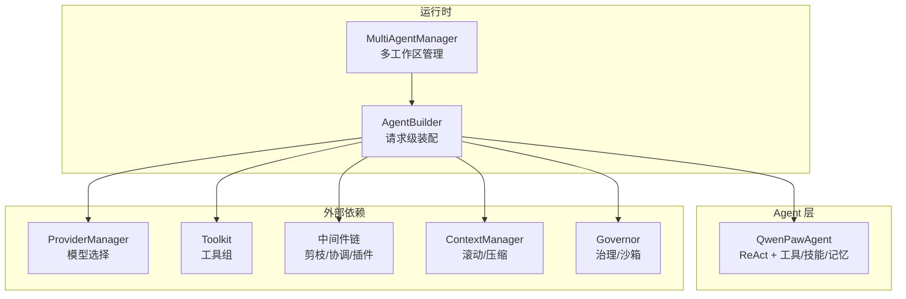
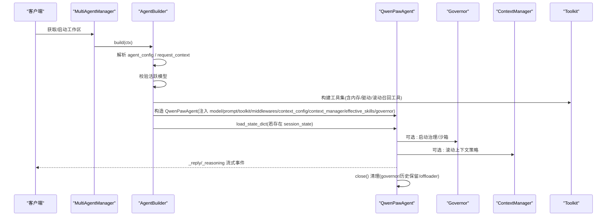
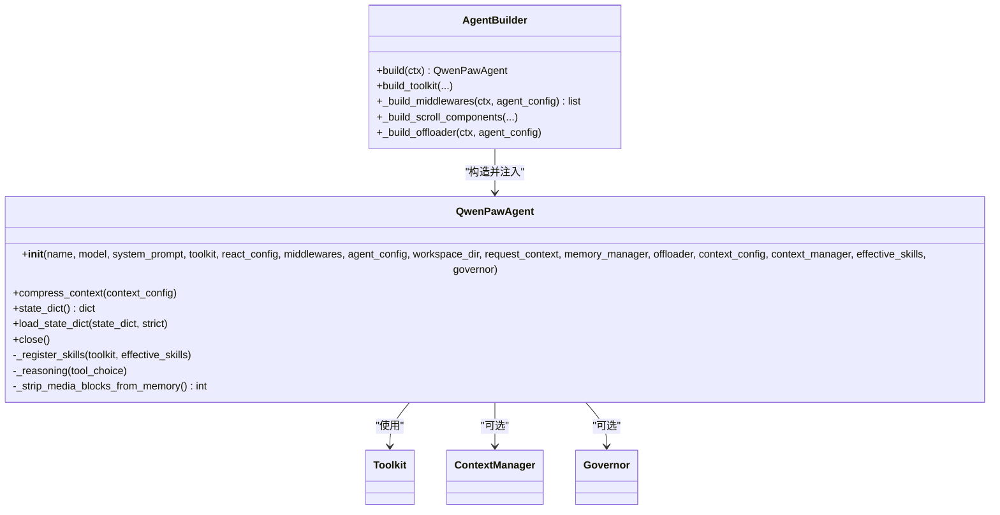
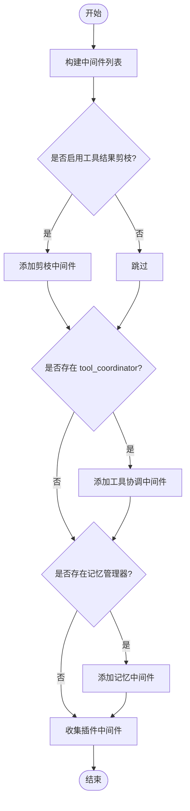
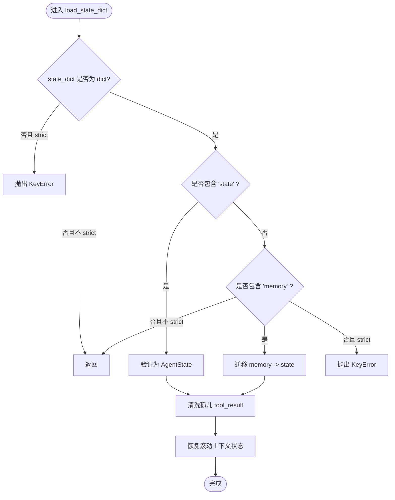
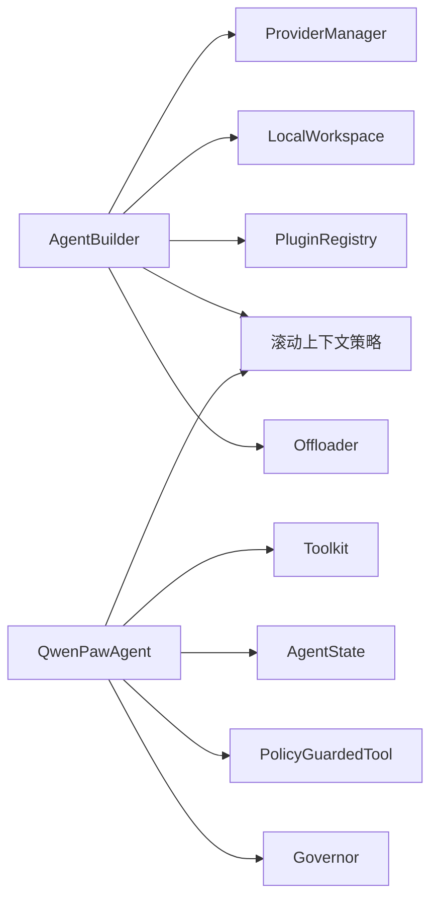

# Agent 生命周期管理

<cite>
**本文引用的文件**   
- [react_agent.py](file://src/qwenpaw/agents/react_agent.py)
- [builder.py](file://src/qwenpaw/runtime/builder.py)
- [multi_agent_manager.py](file://src/qwenpaw/app/multi_agent_manager.py)
- [constant.py](file://src/qwenpaw/constant.py)
</cite>

## 目录
1. [简介](#简介)
2. [项目结构](#项目结构)
3. [核心组件](#核心组件)
4. [架构总览](#架构总览)
5. [详细组件分析](#详细组件分析)
6. [依赖关系分析](#依赖关系分析)
7. [性能考量](#性能考量)
8. [故障排查指南](#故障排查指南)
9. [结论](#结论)
10. [附录：完整生命周期示例路径](#附录完整生命周期示例路径)

## 简介
本文件聚焦 QwenPaw Agent 的生命周期管理，围绕 QwenPawAgent 类的初始化、启动装配、中间件注册、工具组装配与权限上下文配置，以及状态持久化（state_dict/load_state_dict）进行系统化说明。文档同时给出从创建、初始化、运行到关闭清理的端到端流程，并配以架构图与时序图帮助理解。

## 项目结构
QwenPaw 的 Agent 生命周期由“运行时装配器”和“Agent 实现”两部分协同完成：
- 运行时装配器负责按请求构建模型、工具集、系统提示、中间件、滚动上下文策略等，并将所有依赖注入到 QwenPawAgent 构造函数中。
- QwenPawAgent 作为对外暴露的 Agent 实例，承载 ReAct 推理循环、工具调用增强、媒体块处理、停止钩子、会话状态序列化/反序列化与资源清理。

图表来源
- [builder.py:125-330](file://src/qwenpaw/runtime/builder.py#L125-L330)
- [multi_agent_manager.py:54-158](file://src/qwenpaw/app/multi_agent_manager.py#L54-L158)

章节来源
- [builder.py:125-330](file://src/qwenpaw/runtime/builder.py#L125-L330)
- [multi_agent_manager.py:54-158](file://src/qwenpaw/app/multi_agent_manager.py#L54-L158)

## 核心组件
- QwenPawAgent：基于 AgentScope 2.0 Agent 扩展，集成内置工具、动态技能加载、记忆管理、引导式首次设置、工具守卫安全、编码模式特性等。
- AgentBuilder：为每次请求组装一个完整的 QwenPawAgent，负责模型、工具集、系统提示、中间件、滚动上下文策略等的装配与注入。
- MultiAgentManager：管理多个 Agent 工作区的懒加载、生命周期与热重载，支持并发启动与零停机重载。

章节来源
- [react_agent.py:47-143](file://src/qwenpaw/agents/react_agent.py#L47-L143)
- [builder.py:125-330](file://src/qwenpaw/runtime/builder.py#L125-L330)
- [multi_agent_manager.py:23-158](file://src/qwenpaw/app/multi_agent_manager.py#L23-L158)

## 架构总览
下图展示一次请求从入口到 Agent 运行的关键交互：

图表来源
- [multi_agent_manager.py:54-158](file://src/qwenpaw/app/multi_agent_manager.py#L54-L158)
- [builder.py:125-330](file://src/qwenpaw/runtime/builder.py#L125-L330)
- [react_agent.py:288-334](file://src/qwenpaw/agents/react_agent.py#L288-L334)

## 详细组件分析

### QwenPawAgent 初始化与依赖注入
- 构造函数参数
  - 名称、模型、系统提示、工具集、ReAct 配置、中间件列表、Agent 配置文件、工作区路径、请求上下文、记忆管理器、offloader、上下文配置、上下文管理器、生效技能列表、治理器。
- 依赖注入机制
  - 所有外部依赖均由 AgentBuilder 提供；Agent 内部不自行构建这些对象，确保可测试性与解耦。
- 状态初始化
  - 注册技能元数据到 Toolkit；将记忆工具以 PolicyGuardedTool 包装后加入基础工具组；设置权限上下文为 BYPASS（由 QwenPaw 自有工具守卫控制）；注册工具调用钩子（默认超时）。

图表来源
- [react_agent.py:59-143](file://src/qwenpaw/agents/react_agent.py#L59-L143)
- [builder.py:125-330](file://src/qwenpaw/runtime/builder.py#L125-L330)

章节来源
- [react_agent.py:59-143](file://src/qwenpaw/agents/react_agent.py#L59-L143)
- [builder.py:125-330](file://src/qwenpaw/runtime/builder.py#L125-L330)

### 启动流程：中间件注册、工具组装配与权限上下文配置
- 中间件注册顺序（洋葱模型，外层优先）
  - 工具结果剪枝中间件（可选）
  - 工具协调中间件（可选，需 app_services.tool_coordinator）
  - 记忆管理器中间件（可选）
  - Langfuse 工具观测中间件（可选）
  - 插件注册的中间件（按优先级排序）
- 工具组装配
  - 从工作区本地工具清单收集工具；追加额外工具与记忆工具；当启用滚动上下文时，追加结构化 recall_history 与可选的 sandbox REPL 工具。
- 权限上下文配置
  - Agent 初始化时将权限上下文模式设置为 BYPASS，统一交由 PolicyGuardedTool.check_permissions 执行工具守卫。

图表来源
- [builder.py:874-971](file://src/qwenpaw/runtime/builder.py#L874-L971)
- [react_agent.py:134-143](file://src/qwenpaw/agents/react_agent.py#L134-L143)

章节来源
- [builder.py:874-971](file://src/qwenpaw/runtime/builder.py#L874-L971)
- [react_agent.py:134-143](file://src/qwenpaw/agents/react_agent.py#L134-L143)

### 状态持久化：state_dict 与 load_state_dict
- state_dict()
  - 序列化 2.0 AgentState 为 JSON 安全字典；若启用滚动上下文策略，则一并持久化其去重与淘汰索引。
- load_state_dict(state_dict, strict=True)
  - 支持两种格式：
    - 2.0 格式：包含 "state" 键，直接验证为 AgentState；随后对载入上下文做孤儿 tool_result 清洗，并恢复滚动上下文状态。
    - 1.x 遗留格式：包含 "memory" 键，通过迁移函数转换为 2.0 结构，再执行相同清洗与恢复逻辑。
  - 严格模式下，输入非 dict 或缺少必要键会抛出异常；非严格模式静默忽略。

图表来源
- [react_agent.py:193-267](file://src/qwenpaw/agents/react_agent.py#L193-L267)

章节来源
- [react_agent.py:193-267](file://src/qwenpaw/agents/react_agent.py#L193-L267)

### 运行期增强：媒体块处理与停止钩子
- 媒体块处理
  - 在推理前主动检测模型是否拒绝多媒体；必要时在格式化阶段或内存中剥离媒体块，并在失败后进行被动重试。
- 停止钩子与继续
  - 每轮推理结束后运行 StopHandler；若返回“中断并继续”，则在上下文中追加延续消息，使外层循环继续执行。

章节来源
- [react_agent.py:411-552](file://src/qwenpaw/agents/react_agent.py#L411-L552)

### 关闭与清理
- 关闭流程
  - 停止治理器；应用滚动历史保留窗口并释放上下文管理器；清理过期的工具结果文件。
- 资源释放
  - 保证在长连接服务场景下避免句柄泄漏。

章节来源
- [react_agent.py:288-334](file://src/qwenpaw/agents/react_agent.py#L288-L334)

## 依赖关系分析
- 组件耦合与内聚
  - AgentBuilder 高内聚地负责装配，QwenPawAgent 低耦合地消费依赖，二者通过明确的构造参数契约协作。
- 直接/间接依赖
  - AgentBuilder 依赖 ProviderManager（模型）、LocalWorkspace（工具）、PromptManager（系统提示）、PluginRegistry（中间件工厂）、滚动上下文策略与 offloader。
  - QwenPawAgent 依赖 Toolkit、AgentState、PolicyGuardedTool、滚动上下文管理器与治理器。
- 潜在循环依赖
  - 当前设计通过请求级装配与延迟导入避免循环依赖。
- 外部依赖与集成点
  - 模型提供商、插件系统、治理/沙箱、Langfuse 观测、记忆管理等。

图表来源
- [builder.py:125-330](file://src/qwenpaw/runtime/builder.py#L125-L330)
- [react_agent.py:59-143](file://src/qwenpaw/agents/react_agent.py#L59-L143)

章节来源
- [builder.py:125-330](file://src/qwenpaw/runtime/builder.py#L125-L330)
- [react_agent.py:59-143](file://src/qwenpaw/agents/react_agent.py#L59-L143)

## 性能考量
- 滚动上下文策略
  - 在长对话场景下显著降低上下文长度，减少模型调用成本与延迟。
- 工具结果剪枝
  - 分层裁剪旧消息与大输出，结合 offloader 持久化工具结果，平衡可用性与存储开销。
- 并发启动
  - MultiAgentManager 在锁外执行慢速初始化，提升多 Agent 并行启动效率。
- 媒体块剥离
  - 针对不支持多模态的模型提前剥离媒体块，避免多次失败重试带来的额外开销。

[本节为通用指导，无需特定文件引用]

## 故障排查指南
- 无活跃模型
  - 现象：构建阶段抛出“未配置活跃模型”错误。
  - 排查：确认 UI 或配置已选择有效 provider_id 与 model。
- 权限上下文被绕过
  - 现象：工具调用未触发预期审批。
  - 排查：确认 PolicyGuardedTool 已正确包装工具，且 governance 正常启动。
- 会话加载失败
  - 现象：load_state_dict 抛出 KeyError。
  - 排查：检查 state_dict 是否包含 "state" 或兼容的 "memory" 结构；确认严格模式开关。
- 滚动上下文不可用
  - 现象：recall 工具缺失或 REPL 不可用。
  - 排查：确认 governor 可用或显式允许 unsandboxed recall；检查平台沙箱能力。

章节来源
- [builder.py:156-163](file://src/qwenpaw/runtime/builder.py#L156-L163)
- [react_agent.py:206-267](file://src/qwenpaw/agents/react_agent.py#L206-L267)
- [builder.py:674-737](file://src/qwenpaw/runtime/builder.py#L674-L737)

## 结论
QwenPawAgent 的生命周期由 AgentBuilder 在请求级装配完成，采用依赖注入与洋葱中间件模型，兼顾可扩展性与安全性。状态持久化兼容 2.0 与 1.x 格式，滚动上下文与工具结果剪枝共同优化长对话性能。MultiAgentManager 提供多工作区懒加载与零停机重载，保障生产环境稳定性。

[本节为总结性内容，无需特定文件引用]

## 附录：完整生命周期示例路径
以下列出各阶段的代码片段路径，便于对照阅读：
- 创建工作区与懒加载
  - [multi_agent_manager.py:54-158](file://src/qwenpaw/app/multi_agent_manager.py#L54-L158)
- 构建模型、工具集、系统提示与中间件
  - [builder.py:125-330](file://src/qwenpaw/runtime/builder.py#L125-L330)
  - [builder.py:874-971](file://src/qwenpaw/runtime/builder.py#L874-L971)
- 构造 QwenPawAgent 并注入依赖
  - [builder.py:287-319](file://src/qwenpaw/runtime/builder.py#L287-L319)
  - [react_agent.py:59-143](file://src/qwenpaw/agents/react_agent.py#L59-L143)
- 加载会话状态（兼容 2.0 与 1.x）
  - [react_agent.py:193-267](file://src/qwenpaw/agents/react_agent.py#L193-L267)
- 运行期推理与媒体块处理
  - [react_agent.py:411-552](file://src/qwenpaw/agents/react_agent.py#L411-L552)
- 关闭与清理
  - [react_agent.py:288-334](file://src/qwenpaw/agents/react_agent.py#L288-L334)

章节来源
- [multi_agent_manager.py:54-158](file://src/qwenpaw/app/multi_agent_manager.py#L54-L158)
- [builder.py:125-330](file://src/qwenpaw/runtime/builder.py#L125-L330)
- [builder.py:874-971](file://src/qwenpaw/runtime/builder.py#L874-L971)
- [builder.py:287-319](file://src/qwenpaw/runtime/builder.py#L287-L319)
- [react_agent.py:59-143](file://src/qwenpaw/agents/react_agent.py#L59-L143)
- [react_agent.py:193-267](file://src/qwenpaw/agents/react_agent.py#L193-L267)
- [react_agent.py:411-552](file://src/qwenpaw/agents/react_agent.py#L411-L552)
- [react_agent.py:288-334](file://src/qwenpaw/agents/react_agent.py#L288-L334)