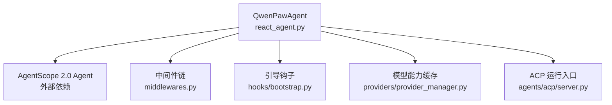
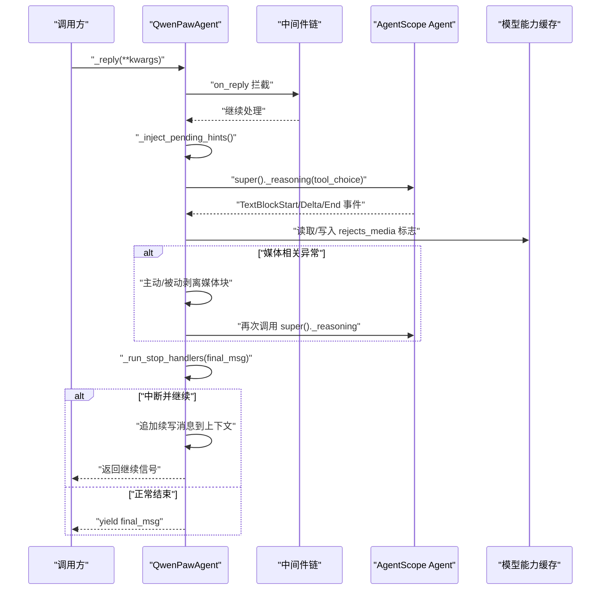
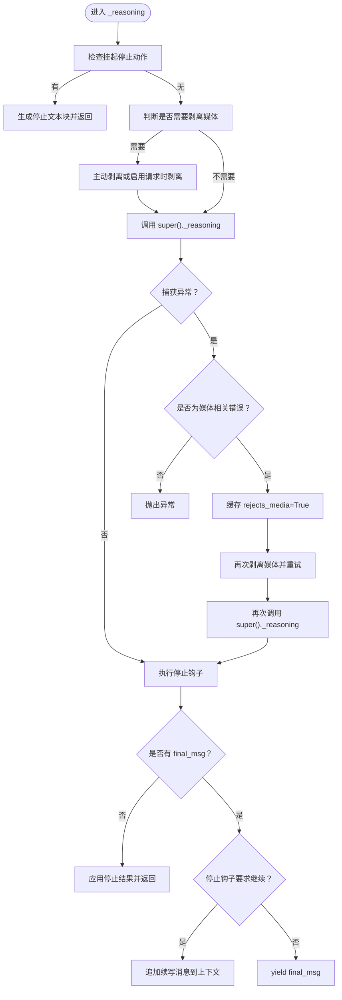
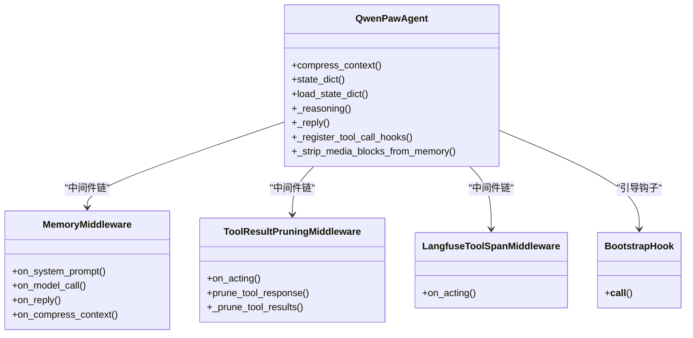
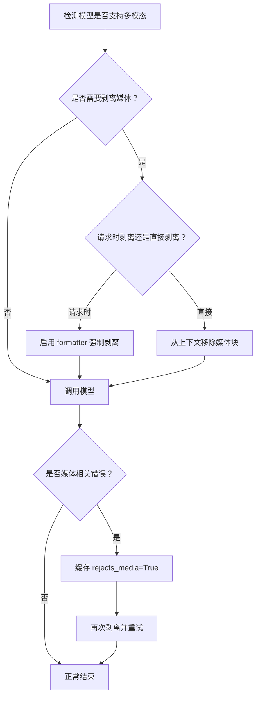
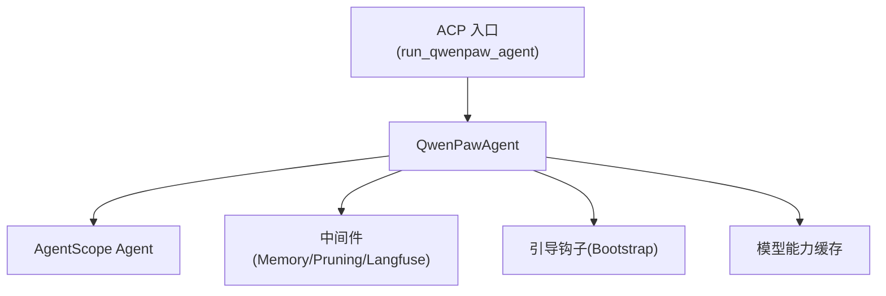

# ReAct Agent 实现

<cite>
**本文引用的文件列表**
- [react_agent.py](file://src/qwenpaw/agents/react_agent.py)
- [middlewares.py](file://src/qwenpaw/agents/middlewares.py)
- [bootstrap.py](file://src/qwenpaw/agents/hooks/bootstrap.py)
- [provider_manager.py](file://src/qwenpaw/providers/provider_manager.py)
- [server.py](file://src/qwenpaw/agents/acp/server.py)
</cite>

## 目录
1. [简介](#简介)
2. [项目结构](#项目结构)
3. [核心组件](#核心组件)
4. [架构总览](#架构总览)
5. [详细组件分析](#详细组件分析)
6. [依赖关系分析](#依赖关系分析)
7. [性能考量](#性能考量)
8. [故障排查指南](#故障排查指南)
9. [结论](#结论)
10. [附录：示例与最佳实践](#附录示例与最佳实践)

## 简介
本文件聚焦 QwenPaw 的 ReAct Agent 实现，围绕 QwenPawAgent 类展开，系统阐述其基于 AgentScope 2.0 的 ReAct 模式工作原理、推理循环（_reasoning）的执行流程、工具调用机制与错误处理策略；并深入说明媒体块处理逻辑（多模态支持检测、媒体内容自动剥离与重试）、Agent 状态管理、上下文压缩策略与会话持久化机制。最后提供生命周期管理、中间件集成与钩子系统的使用方式指引。

## 项目结构
QwenPawAgent 位于 agents 子模块中，作为 AgentScope 2.0 Agent 的扩展，整合了工具、技能、记忆、安全策略与编码模式等能力。关键文件包括：
- react_agent.py：QwenPawAgent 主实现，包含推理循环、媒体处理、会话持久化、工具钩子注册等
- middlewares.py：AgentScope 2.0 中间件实现（内存增强、工具结果裁剪、可观测性）
- hooks/bootstrap.py：首次交互引导钩子
- provider_manager.py：模型能力探测与缓存修复（用于媒体能力学习）
- server.py：ACP 入口，演示如何以完整工作区运行 QwenPawAgent

图表来源
- [react_agent.py:47-809](file://src/qwenpaw/agents/react_agent.py#L47-L809)
- [middlewares.py:1-699](file://src/qwenpaw/agents/middlewares.py#L1-L699)
- [bootstrap.py:1-104](file://src/qwenpaw/agents/hooks/bootstrap.py#L1-L104)
- [provider_manager.py:1645-1675](file://src/qwenpaw/providers/provider_manager.py#L1645-L1675)
- [server.py:1366-1380](file://src/qwenpaw/agents/acp/server.py#L1366-L1380)

章节来源
- [react_agent.py:47-809](file://src/qwenpaw/agents/react_agent.py#L47-L809)
- [middlewares.py:1-699](file://src/qwenpaw/agents/middlewares.py#L1-L699)
- [bootstrap.py:1-104](file://src/qwenpaw/agents/hooks/bootstrap.py#L1-L104)
- [provider_manager.py:1645-1675](file://src/qwenpaw/providers/provider_manager.py#L1645-L1675)
- [server.py:1366-1380](file://src/qwenpaw/agents/acp/server.py#L1366-L1380)

## 核心组件
- QwenPawAgent：继承自 AgentScope 2.0 的 Agent，封装 ReAct 推理循环、工具协调器、记忆工具注入、上下文压缩与持久化、媒体块处理、停止钩子与循环续写等。
- 中间件：MemoryMiddleware（自动记忆搜索与总结）、ToolResultPruningMiddleware（工具输出裁剪）、LangfuseToolSpanMiddleware（工具执行观测）。
- 引导钩子：BootstrapHook（首次用户交互时注入引导信息）。
- 模型能力缓存：在模型拒绝媒体或探测到支持多媒体时更新缓存，避免误判导致后续请求静默丢弃媒体。

章节来源
- [react_agent.py:47-809](file://src/qwenpaw/agents/react_agent.py#L47-L809)
- [middlewares.py:1-699](file://src/qwenpaw/agents/middlewares.py#L1-L699)
- [bootstrap.py:1-104](file://src/qwenpaw/agents/hooks/bootstrap.py#L1-L104)
- [provider_manager.py:1645-1675](file://src/qwenpaw/providers/provider_manager.py#L1645-L1675)

## 架构总览
下图展示了 QwenPawAgent 在 ReAct 模式下的整体交互：上层通过 _reply 触发推理，内部 _reasoning 负责事件流转发、媒体预处理与被动重试、停止钩子与循环续写；中间件在 on_model_call/on_acting/on_compress_context 等阶段介入；引导钩子在首次交互时注入提示；模型能力缓存影响媒体处理策略。

图表来源
- [react_agent.py:411-551](file://src/qwenpaw/agents/react_agent.py#L411-L551)
- [middlewares.py:74-108](file://src/qwenpaw/agents/middlewares.py#L74-L108)
- [provider_manager.py:1645-1675](file://src/qwenpaw/providers/provider_manager.py#L1645-L1675)

## 详细组件分析

### QwenPawAgent 类与 ReAct 推理循环
- 构造与初始化
  - 接收 model、system_prompt、toolkit、react_config、middlewares、agent_config 等依赖，不自行构建，交由外部 AgentBuilder 完成。
  - 注入 memory_manager 的工具到 toolkit，并通过 PolicyGuardedTool 进行权限守卫。
  - 绕过 AgentScope 内置权限引擎，使用 QwenPaw 自己的工具守卫。
  - 注册工具调用钩子（默认超时、按 agent_id 配置覆盖）。

- 推理循环 _reasoning
  - 前置检查：若存在上一轮挂起的“停止”动作，直接生成文本块事件并返回。
  - 媒体预处理：根据当前模型是否支持多模态或能力缓存中的 rejects_media 标记，决定是否主动剥离媒体块或通过 formatter 在请求时剥离。
  - 模型调用与被动重试：捕获异常，仅当错误明确为媒体相关时才记录缓存并尝试剥离媒体后重试；非媒体错误直接抛出。
  - 停止钩子：每轮迭代执行 stop handlers，若结果为“中断并继续”，则向上下文追加续写消息并让外层循环继续。
  - 最终消息：若无 final_msg，应用停止结果并返回；否则 yield final_msg。

- 工具调用增强
  - 在 _reply 前注入后台工具提示（pending hints），确保模型能感知异步任务进展。
  - 注册工具默认超时与按 agent 维度的覆盖，统一浏览器、LSP、shell 等工具的超时策略。

- 上下文压缩与保存
  - compress_context：优先走注入的 context_manager（如滚动策略），否则回退到 AgentScope 原生压缩；每次压缩前先清理孤立 tool_result 消息，防止跨会话泄漏导致的 400 错误。
  - _save_to_context：在父类追加后通知 context_manager 持久化。

- 会话持久化
  - state_dict：序列化 AgentState 并附带滚动管理器状态，以便恢复时去重与索引重建。
  - load_state_dict：兼容 2.0 格式与 1.x legacy memory 格式，加载后同样执行孤立 tool_result 清理与滚动状态恢复。

- 媒体块处理
  - 识别媒体块类型（image/audio/video/file 或 data 块的 media_type 前缀）。
  - 主动剥离：在模型不支持多模态或缓存标记为拒绝媒体时，提前从上下文移除媒体块。
  - 被动重试：遇到媒体相关错误时，记录缓存并再次尝试。
  - 结果保护：对 tool_result 输出中的媒体块也进行过滤，必要时插入占位文本以避免 API 畸形。

图表来源
- [react_agent.py:411-551](file://src/qwenpaw/agents/react_agent.py#L411-L551)
- [react_agent.py:553-612](file://src/qwenpaw/agents/react_agent.py#L553-L612)
- [react_agent.py:745-809](file://src/qwenpaw/agents/react_agent.py#L745-L809)

章节来源
- [react_agent.py:59-143](file://src/qwenpaw/agents/react_agent.py#L59-L143)
- [react_agent.py:145-189](file://src/qwenpaw/agents/react_agent.py#L145-L189)
- [react_agent.py:193-286](file://src/qwenpaw/agents/react_agent.py#L193-L286)
- [react_agent.py:411-551](file://src/qwenpaw/agents/react_agent.py#L411-L551)
- [react_agent.py:553-612](file://src/qwenpaw/agents/react_agent.py#L553-L612)
- [react_agent.py:631-705](file://src/qwenpaw/agents/react_agent.py#L631-L705)
- [react_agent.py:711-742](file://src/qwenpaw/agents/react_agent.py#L711-L742)
- [react_agent.py:745-809](file://src/qwenpaw/agents/react_agent.py#L745-L809)

### 中间件集成与钩子系统
- MemoryMiddleware
  - on_system_prompt：注入长期记忆提示。
  - on_model_call：在模型调用前自动检索记忆并注入临时上下文；自动化来源跳过。
  - on_reply：收集待处理的轮次标记，达到阈值后批量写入长期记忆。
  - on_compress_context：压缩前触发记忆总结（可选）。

- ToolResultPruningMiddleware
  - on_acting：对当前 ToolResponse 进行文本块级裁剪，并在历史上下文中扫描 tool_result 块，按“近期/旧”分层裁剪，保留元数据与文件路径以便恢复。

- LangfuseToolSpanMiddleware
  - on_acting：将每个工具执行记录为 Langfuse 观测，包含输入与输出摘要。

- BootstrapHook
  - 首次用户交互时检查工作目录中的 BOOTSTRAP.md，若存在则向首个用户消息前注入引导信息，并创建完成标记防止重复触发。

图表来源
- [react_agent.py:47-809](file://src/qwenpaw/agents/react_agent.py#L47-L809)
- [middlewares.py:46-329](file://src/qwenpaw/agents/middlewares.py#L46-L329)
- [middlewares.py:331-653](file://src/qwenpaw/agents/middlewares.py#L331-L653)
- [middlewares.py:655-699](file://src/qwenpaw/agents/middlewares.py#L655-L699)
- [bootstrap.py:20-104](file://src/qwenpaw/agents/hooks/bootstrap.py#L20-L104)

章节来源
- [middlewares.py:46-329](file://src/qwenpaw/agents/middlewares.py#L46-L329)
- [middlewares.py:331-653](file://src/qwenpaw/agents/middlewares.py#L331-L653)
- [middlewares.py:655-699](file://src/qwenpaw/agents/middlewares.py#L655-L699)
- [bootstrap.py:20-104](file://src/qwenpaw/agents/hooks/bootstrap.py#L20-L104)

### 媒体块处理与多模态支持检测
- 多模态支持检测
  - 通过模型能力缓存查询 rejects_media 标记；同时结合运行时探测（provider_manager 的自动探测）修复被污染的缓存，避免误判导致后续请求静默丢弃媒体。
- 媒体内容自动剥离
  - 主动剥离：在 _reasoning 前根据模型能力决定剥离策略（直接移除或请求时剥离）。
  - 被动重试：捕获媒体相关错误后，记录缓存并再次尝试。
  - 结果保护：对 tool_result 输出中的媒体块进行过滤，必要时插入占位文本。
- 重试机制
  - 仅在错误消息明确指向媒体模态（如 image/audio/video/vision/multimodal/image_url）时触发重试；内容安全或大小相关的错误不会触发媒体重试，避免污染缓存。

图表来源
- [react_agent.py:379-408](file://src/qwenpaw/agents/react_agent.py#L379-L408)
- [react_agent.py:411-551](file://src/qwenpaw/agents/react_agent.py#L411-L551)
- [react_agent.py:553-612](file://src/qwenpaw/agents/react_agent.py#L553-L612)
- [provider_manager.py:1645-1675](file://src/qwenpaw/providers/provider_manager.py#L1645-L1675)

章节来源
- [react_agent.py:379-408](file://src/qwenpaw/agents/react_agent.py#L379-L408)
- [react_agent.py:411-551](file://src/qwenpaw/agents/react_agent.py#L411-L551)
- [react_agent.py:553-612](file://src/qwenpaw/agents/react_agent.py#L553-L612)
- [provider_manager.py:1645-1675](file://src/qwenpaw/providers/provider_manager.py#L1645-L1675)

### 状态管理与上下文压缩策略
- 状态管理
  - 使用 AgentScope 2.0 的 AgentState，通过 state_dict/load_state_dict 进行 JSON 序列化与反序列化。
  - 兼容 1.x legacy memory 格式，迁移至 2.0 结构，保证升级后会话可用。
- 上下文压缩
  - 优先委托给 context_manager（如滚动策略），否则回退到 AgentScope 原生压缩。
  - 每次压缩前清理孤立的 tool_result 消息，避免跨会话泄漏导致的 400 错误。
- 会话持久化
  - 除 AgentState 外，还持久化滚动管理器的去重与驱逐索引，恢复时避免重复追加已持久化的窗口。

章节来源
- [react_agent.py:145-189](file://src/qwenpaw/agents/react_agent.py#L145-L189)
- [react_agent.py:193-286](file://src/qwenpaw/agents/react_agent.py#L193-L286)

### 工具调用机制与错误处理策略
- 工具协调器与钩子
  - 通过 request_context 获取 ToolCoordinator，注册各工具的默认超时与按 agent 维度覆盖。
  - 在 _reply 前注入后台工具提示，使模型能感知异步任务进展。
- 错误处理
  - 区分内容安全错误、大小/上下文长度错误与媒体相关错误，仅后者触发媒体剥离与重试。
  - 通过模型能力缓存学习与修复，避免误判导致后续请求静默丢弃媒体。

章节来源
- [react_agent.py:631-705](file://src/qwenpaw/agents/react_agent.py#L631-L705)
- [react_agent.py:553-612](file://src/qwenpaw/agents/react_agent.py#L553-L612)
- [provider_manager.py:1645-1675](file://src/qwenpaw/providers/provider_manager.py#L1645-L1675)

## 依赖关系分析
- QwenPawAgent 依赖 AgentScope 2.0 的 Agent、ReActConfig、Toolkit、AgentState 等基础能力。
- 中间件通过 MiddlewareBase 接入 Agent 的生命周期钩子，在不侵入核心逻辑的前提下增强行为。
- 模型能力缓存由 providers 层维护，影响媒体处理策略与重试行为。
- ACP 入口通过 run_qwenpaw_agent 启动完整工作区，复用相同的 Agent 生命周期。

图表来源
- [react_agent.py:47-809](file://src/qwenpaw/agents/react_agent.py#L47-L809)
- [middlewares.py:1-699](file://src/qwenpaw/agents/middlewares.py#L1-L699)
- [bootstrap.py:1-104](file://src/qwenpaw/agents/hooks/bootstrap.py#L1-L104)
- [provider_manager.py:1645-1675](file://src/qwenpaw/providers/provider_manager.py#L1645-L1675)
- [server.py:1366-1380](file://src/qwenpaw/agents/acp/server.py#L1366-L1380)

章节来源
- [react_agent.py:47-809](file://src/qwenpaw/agents/react_agent.py#L47-L809)
- [middlewares.py:1-699](file://src/qwenpaw/agents/middlewares.py#L1-L699)
- [bootstrap.py:1-104](file://src/qwenpaw/agents/hooks/bootstrap.py#L1-L104)
- [provider_manager.py:1645-1675](file://src/qwenpaw/providers/provider_manager.py#L1645-L1675)
- [server.py:1366-1380](file://src/qwenpaw/agents/acp/server.py#L1366-L1380)

## 性能考量
- 工具结果裁剪：通过 ToolResultPruningMiddleware 控制近期与旧结果的字节上限，减少上下文膨胀，降低 LLM 调用成本。
- 媒体剥离：在模型不支持多模态或缓存标记拒绝媒体时主动剥离，避免无效请求与重试开销。
- 上下文压缩：按需启用原生压缩或滚动策略，避免不必要的计算与 I/O。
- 资源清理：close 方法中释放 governor、关闭 context_manager、清理过期工具结果文件，防止长驻服务资源泄漏。

[本节为通用指导，无需具体文件分析]

## 故障排查指南
- 400 错误（tool 角色必须响应 preceding tool_calls）
  - 原因：孤立 tool_result 消息跨会话泄漏。
  - 解决：compress_context 与 load_state_dict 均会执行孤立 tool_result 清理；确认上下文管理器是否正确持久化与恢复。
- 媒体相关错误导致频繁重试
  - 原因：错误消息匹配媒体关键词但实际为其他问题（如大小限制）。
  - 解决：检查 _is_bad_request_or_media_error 的判断逻辑，避免误伤；利用 provider_manager 的自动探测修复缓存。
- 工具超时或阻塞
  - 原因：未设置或配置不当的默认超时。
  - 解决：在 _register_tool_call_hooks 中为工具设置合理超时，并按 agent_id 覆盖。

章节来源
- [react_agent.py:145-189](file://src/qwenpaw/agents/react_agent.py#L145-L189)
- [react_agent.py:193-286](file://src/qwenpaw/agents/react_agent.py#L193-L286)
- [react_agent.py:553-612](file://src/qwenpaw/agents/react_agent.py#L553-L612)
- [react_agent.py:631-705](file://src/qwenpaw/agents/react_agent.py#L631-L705)

## 结论
QwenPawAgent 在 AgentScope 2.0 的基础上实现了稳健的 ReAct 推理循环，具备完善的媒体处理能力、上下文压缩与持久化、工具调用增强与错误处理策略。通过中间件与钩子系统，系统在保持核心简洁的同时提供了强大的可扩展性与可观测性。建议在生产环境中启用工具结果裁剪与滚动策略，并结合模型能力缓存优化媒体处理路径。

[本节为总结，无需具体文件分析]

## 附录：示例与最佳实践
- 生命周期管理
  - 构造：通过 AgentBuilder 传入 model、system_prompt、toolkit、react_config、middlewares、agent_config 等依赖。
  - 运行：调用 _reply 触发推理，内部 _reasoning 负责事件流与重试。
  - 关闭：调用 close 释放资源与清理过期文件。
- 中间件集成
  - 注册 MemoryMiddleware 以启用自动记忆搜索与总结。
  - 注册 ToolResultPruningMiddleware 以控制工具输出大小。
  - 注册 LangfuseToolSpanMiddleware 以记录工具执行观测。
- 钩子系统
  - 使用 BootstrapHook 在首次交互时注入引导信息，提升新用户上手体验。
- 参考入口
  - ACP 入口 run_qwenpaw_agent 展示了如何在完整工作区中运行 QwenPawAgent。

章节来源
- [server.py:1366-1380](file://src/qwenpaw/agents/acp/server.py#L1366-L1380)
- [middlewares.py:46-329](file://src/qwenpaw/agents/middlewares.py#L46-L329)
- [middlewares.py:331-653](file://src/qwenpaw/agents/middlewares.py#L331-L653)
- [middlewares.py:655-699](file://src/qwenpaw/agents/middlewares.py#L655-L699)
- [bootstrap.py:20-104](file://src/qwenpaw/agents/hooks/bootstrap.py#L20-L104)