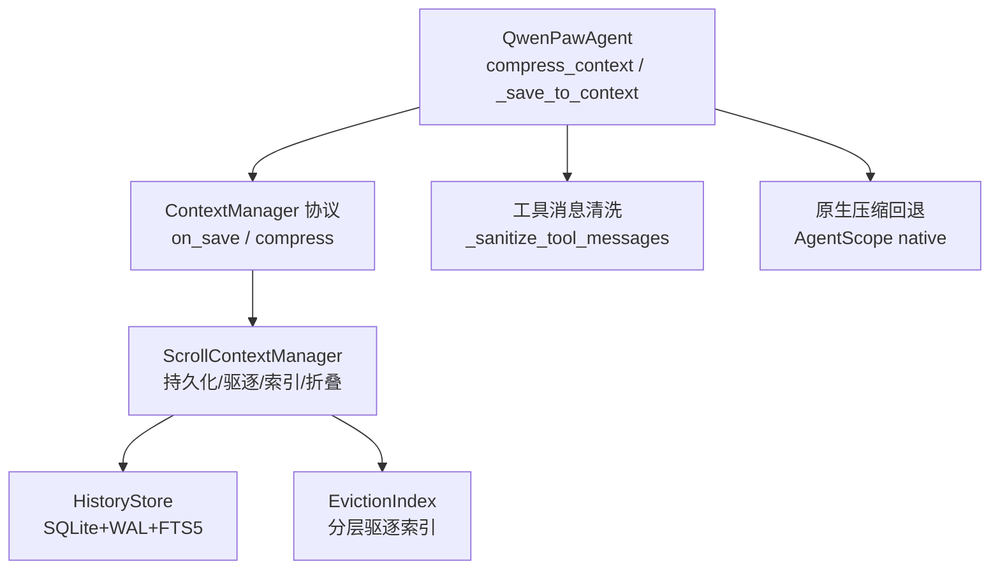
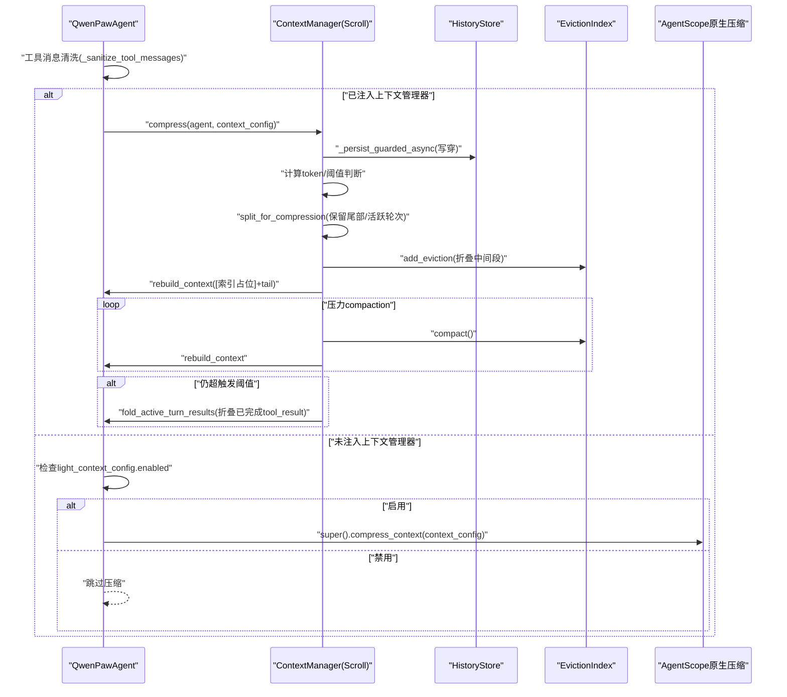
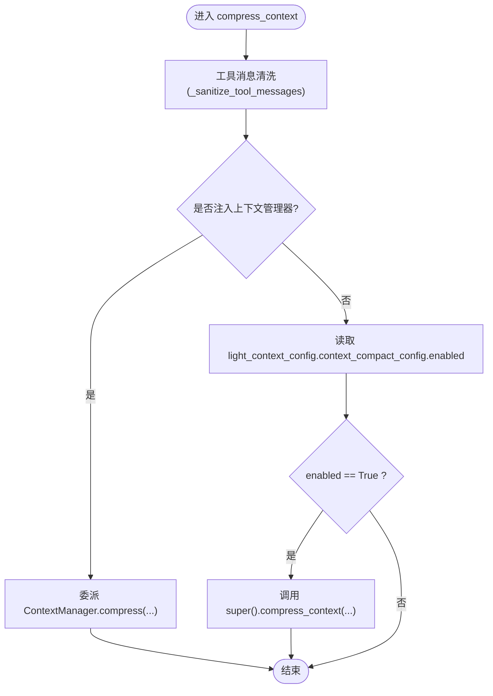
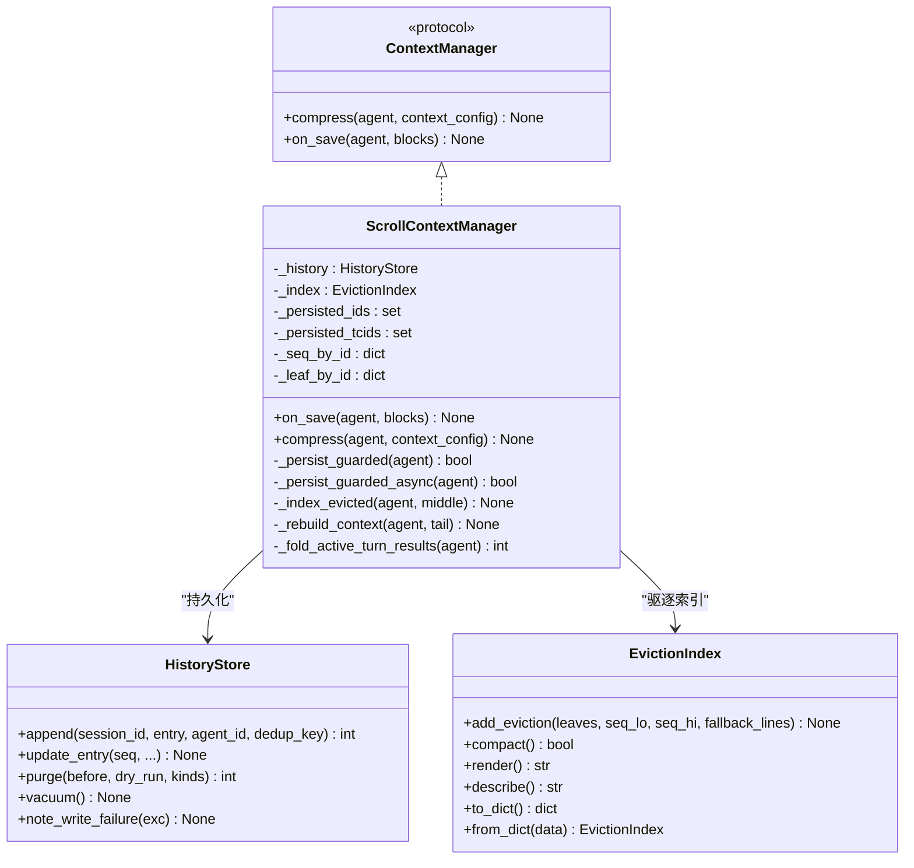
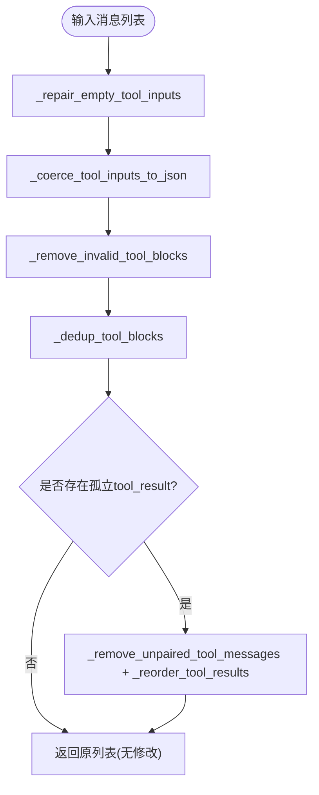
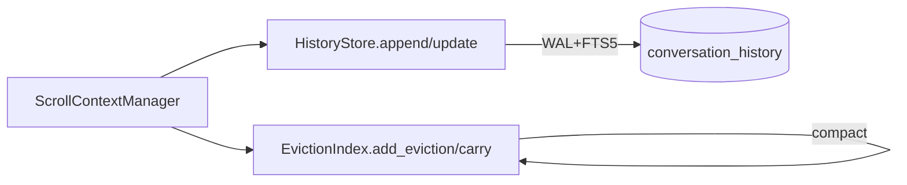
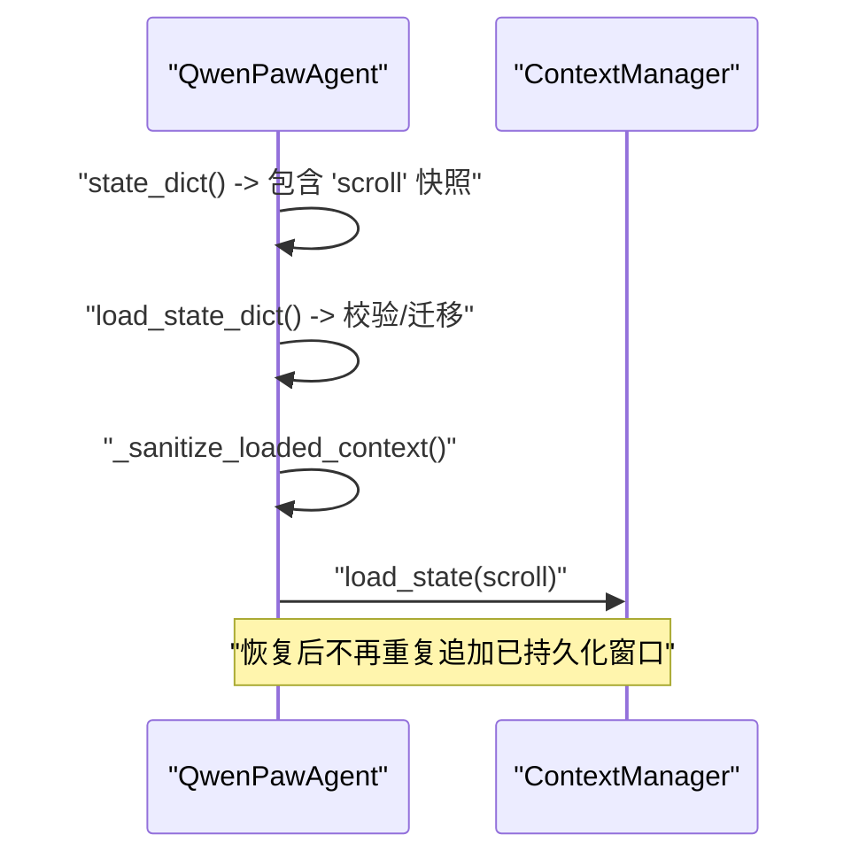
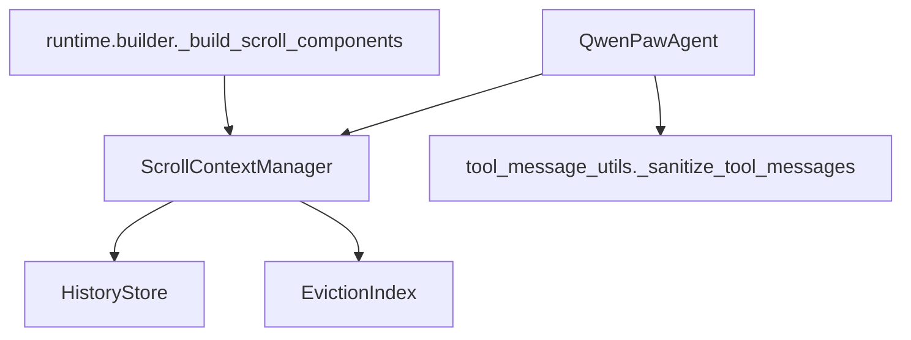

# 上下文压缩管理

<cite>
**本文引用的文件**   
- [react_agent.py](file://src/qwenpaw/agents/react_agent.py)
- [base.py](file://src/qwenpaw/agents/context/base.py)
- [manager.py](file://src/qwenpaw/agents/context/scroll/manager.py)
- [history.py](file://src/qwenpaw/agents/context/scroll/history.py)
- [eviction_index.py](file://src/qwenpaw/agents/context/scroll/eviction_index.py)
- [tool_message_utils.py](file://src/qwenpaw/agents/utils/tool_message_utils.py)
- [config.py](file://src/qwenpaw/config/config.py)
- [builder.py](file://src/qwenpaw/runtime/builder.py)
</cite>

## 目录
1. [简介](#简介)
2. [项目结构](#项目结构)
3. [核心组件](#核心组件)
4. [架构总览](#架构总览)
5. [详细组件分析](#详细组件分析)
6. [依赖关系分析](#依赖关系分析)
7. [性能考量](#性能考量)
8. [故障排查指南](#故障排查指南)
9. [结论](#结论)
10. [附录](#附录)

## 简介
本文件聚焦 QwenPaw Agent 的“上下文压缩管理”能力，围绕以下目标展开：
- 深入解释 compress_context() 的实现逻辑，包括“上下文管理器委托机制”和“原生压缩回退策略”。
- 详细说明工具消息清理机制，特别是孤立 tool_result 的检测与修复。
- 记录滚动历史（Scroll）管理的集成方式，包括去重记录与驱逐索引的持久化。
- 提供配置项、触发条件与性能优化策略的具体说明与示例路径。

## 项目结构
上下文压缩由“可插拔上下文管理器协议 + 滚动策略实现 + 原生回退”共同构成。关键位置如下：
- 代理入口与委托：QwenPawAgent.compress_context 负责在注入上下文管理器时委派压缩，否则回退到 AgentScope 原生压缩。
- 上下文管理器协议：ContextManager 定义 on_save 与 compress 两个钩子。
- 滚动策略实现：ScrollContextManager 负责写穿持久化、驱逐折叠、索引重建与最后手段折叠。
- 持久化存储：HistoryStore 基于 SQLite+WAL+FTS5，提供 append/update/purge/vacuum 等能力。
- 驱逐索引：EvictionIndex 以分层桶承载被驱逐的历史，支持 compact 压力收缩。
- 工具消息清洗：_sanitize_tool_messages 保证 tool_call/tool_result 配对与顺序正确。
- 配置模型：ContextCompactConfig、ToolResultPruningConfig、ScrollContextConfig 等。

图示来源
- [react_agent.py:145-183](file://src/qwenpaw/agents/react_agent.py#L145-L183)
- [base.py:19-36](file://src/qwenpaw/agents/context/base.py#L19-L36)
- [manager.py:256-392](file://src/qwenpaw/agents/context/scroll/manager.py#L256-L392)
- [history.py:54-112](file://src/qwenpaw/agents/context/scroll/history.py#L54-L112)
- [eviction_index.py:130-224](file://src/qwenpaw/agents/context/scroll/eviction_index.py#L130-L224)
- [tool_message_utils.py:503-544](file://src/qwenpaw/agents/utils/tool_message_utils.py#L503-L544)

章节来源
- [react_agent.py:145-183](file://src/qwenpaw/agents/react_agent.py#L145-L183)
- [base.py:19-36](file://src/qwenpaw/agents/context/base.py#L19-L36)

## 核心组件
- QwenPawAgent.compress_context
  - 每次调用前对上下文进行工具消息清洗，避免孤立 tool_result 导致 400 错误。
  - 若注入 ContextManager，则委派其 compress；否则读取 light_context_config.context_compact_config.enabled，决定是否走原生压缩。
- ScrollContextManager
  - on_save：将新写入的块写穿至 HistoryStore。
  - compress：先持久化，再按阈值拆分，将中间段折叠进 EvictionIndex，必要时执行 compaction 与 active-turn 结果折叠。
- HistoryStore
  - 提供 append/update/purge/vacuum 等接口，WAL 模式并发安全，FTS5 全文检索可选降级为 LIKE。
- EvictionIndex
  - 分层桶结构，add_eviction 新增驱逐块并触发 carry；compact 在压力下提前 carry 或整体折叠。
- 工具消息清洗
  - _sanitize_tool_messages：修复空 input/raw_input、强制 JSON 字符串、去重、无效块移除、配对与顺序修复。

章节来源
- [react_agent.py:145-183](file://src/qwenpaw/agents/react_agent.py#L145-L183)
- [manager.py:188-241](file://src/qwenpaw/agents/context/scroll/manager.py#L188-L241)
- [manager.py:256-392](file://src/qwenpaw/agents/context/scroll/manager.py#L256-L392)
- [history.py:235-356](file://src/qwenpaw/agents/context/scroll/history.py#L235-L356)
- [eviction_index.py:144-224](file://src/qwenpaw/agents/context/scroll/eviction_index.py#L144-L224)
- [tool_message_utils.py:503-544](file://src/qwenpaw/agents/utils/tool_message_utils.py#L503-L544)

## 架构总览
下图展示 compress_context 的完整流程，包括委托与回退、持久化、驱逐与索引、以及最后手段折叠。

图示来源
- [react_agent.py:145-183](file://src/qwenpaw/agents/react_agent.py#L145-L183)
- [manager.py:256-392](file://src/qwenpaw/agents/context/scroll/manager.py#L256-L392)
- [eviction_index.py:144-224](file://src/qwenpaw/agents/context/scroll/eviction_index.py#L144-L224)
- [history.py:235-356](file://src/qwenpaw/agents/context/scroll/history.py#L235-L356)

## 详细组件分析

### 组件A：QwenPawAgent 压缩入口与回退
- 职责
  - 在每次推理前对上下文进行工具消息清洗，防止孤立 tool_result 导致 API 报错。
  - 当存在上下文管理器时委派 compress；否则根据 light_context_config.context_compact_config.enabled 决定是否调用原生压缩。
- 关键点
  - 工具消息清洗是“无条件”执行的，覆盖加载会话、补丁前损坏等边界情况。
  - 原生压缩回退仅受 enabled 开关控制，便于在不启用滚动策略时保持兼容。

图示来源
- [react_agent.py:145-183](file://src/qwenpaw/agents/react_agent.py#L145-L183)

章节来源
- [react_agent.py:145-183](file://src/qwenpaw/agents/react_agent.py#L145-L183)

### 组件B：上下文管理器协议与滚动策略
- 协议 ContextManager
  - on_save：在 base 追加后回调，用于写穿持久化。
  - compress：替代原生压缩，驱动滚动策略。
- 滚动策略 ScrollContextManager
  - 写穿持久化：_persist_guarded/_persist_guarded_async 确保磁盘/SQLite失败不中断主循环。
  - 触发与拆分：基于 model.context_size 与 trigger/reserve ratio 计算阈值，使用 pairing-safe split 保留最近尾部与活跃轮次。
  - 驱逐与索引：将中间段折叠为 EvictionIndex 的新 Tier 0 块，重建上下文为“索引占位 + tail”。
  - 压力 compaction：当仍超 reserve 时，反复 compact 直到满足或仅剩单块。
  - 最后手段折叠：当仍超 trigger 时，折叠当前轮次已完成的 tool_result 为 recall 提示，保留最新一条结果。

图示来源
- [base.py:19-36](file://src/qwenpaw/agents/context/base.py#L19-L36)
- [manager.py:113-241](file://src/qwenpaw/agents/context/scroll/manager.py#L113-L241)
- [manager.py:256-392](file://src/qwenpaw/agents/context/scroll/manager.py#L256-L392)
- [history.py:54-112](file://src/qwenpaw/agents/context/scroll/history.py#L54-L112)
- [eviction_index.py:130-224](file://src/qwenpaw/agents/context/scroll/eviction_index.py#L130-L224)

章节来源
- [base.py:19-36](file://src/qwenpaw/agents/context/base.py#L19-L36)
- [manager.py:188-241](file://src/qwenpaw/agents/context/scroll/manager.py#L188-L241)
- [manager.py:256-392](file://src/qwenpaw/agents/context/scroll/manager.py#L256-L392)

### 组件C：工具消息清理机制
- 目标
  - 确保 tool_call 与 tool_result 严格配对且顺序正确，避免 400 错误。
- 步骤
  - 修复空 input 但存在 raw_input 的情况。
  - 强制所有 tool_call.input 为合法 JSON 字符串（非法则丢弃该块）。
  - 移除无效 block（缺少 id/name）。
  - 去重相同 id 的 tool_call/tool_result。
  - 检测并修复跨消息的孤立 tool_result，必要时重新排序或移除。

图示来源
- [tool_message_utils.py:303-544](file://src/qwenpaw/agents/utils/tool_message_utils.py#L303-L544)

章节来源
- [tool_message_utils.py:503-544](file://src/qwenpaw/agents/utils/tool_message_utils.py#L503-L544)

### 组件D：滚动历史的持久化与驱逐索引
- 持久化 HistoryStore
  - WAL 模式、线程锁串行访问、FTS5 全文索引（不可用时降级为 LIKE）。
  - append/update/purge/vacuum 等接口，支持 dedup_key 幂等写入。
- 驱逐索引 EvictionIndex
  - add_eviction 新增一个 Tier 0 块，触发 carry 上卷。
  - compact 在压力下提前 carry 或将全索引折叠为顶层单块。
  - render/describe 输出可读的层级地图，供模型理解归档范围与召回方式。

图示来源
- [manager.py:256-392](file://src/qwenpaw/agents/context/scroll/manager.py#L256-L392)
- [history.py:235-356](file://src/qwenpaw/agents/context/scroll/history.py#L235-L356)
- [eviction_index.py:144-224](file://src/qwenpaw/agents/context/scroll/eviction_index.py#L144-L224)

章节来源
- [history.py:54-112](file://src/qwenpaw/agents/context/scroll/history.py#L54-L112)
- [eviction_index.py:130-224](file://src/qwenpaw/agents/context/scroll/eviction_index.py#L130-L224)

### 组件E：滚动历史管理与状态持久化
- 集成点
  - state_dict/load_state_dict：序列化 AgentState，并在存在上下文管理器时额外持久化 scroll 元数据（去重记录与驱逐索引），恢复时 rehydrate。
  - close：在关闭时执行 history_retention_days 清理与 offloader 过期清理。
- 行为
  - 恢复时先清洗加载上下文中的孤立 tool_result，再加载 scroll 状态，避免重复追加已持久化的窗口。

图示来源
- [react_agent.py:193-266](file://src/qwenpaw/agents/react_agent.py#L193-L266)
- [react_agent.py:268-286](file://src/qwenpaw/agents/react_agent.py#L268-L286)

章节来源
- [react_agent.py:193-266](file://src/qwenpaw/agents/react_agent.py#L193-L266)
- [react_agent.py:268-286](file://src/qwenpaw/agents/react_agent.py#L268-L286)

## 依赖关系分析
- 运行时构建器 builder 在构造阶段决定是否需要滚动策略，并在 governor 不可用且不允许非沙箱 recall 时回退到原生上下文管理。
- 滚动策略依赖 HistoryStore 与 EvictionIndex；HistoryStore 依赖 SQLite（WAL+FTS5）。
- 工具消息清洗独立于滚动策略，但在 compress 前后均会被调用以确保一致性。

图示来源
- [builder.py:229-260](file://src/qwenpaw/runtime/builder.py#L229-L260)
- [manager.py:256-392](file://src/qwenpaw/agents/context/scroll/manager.py#L256-L392)
- [tool_message_utils.py:503-544](file://src/qwenpaw/agents/utils/tool_message_utils.py#L503-L544)

章节来源
- [builder.py:229-260](file://src/qwenpaw/runtime/builder.py#L229-L260)

## 性能考量
- 写穿持久化
  - on_save 同步写，compress 异步写（asyncio.to_thread），避免阻塞事件循环。
  - HistoryStore 内部加锁串行访问，确保多线程安全。
- 触发与阈值
  - 使用 model.count_tokens 与 context_size 计算触发阈值，减少不必要的压缩。
  - reserve_ratio 与 trigger_ratio 配合，优先保留最近尾部与活跃轮次。
- 索引结构与渲染
  - EvictionIndex 分层桶，carry 仅在满层时发生，减少频繁重组。
  - render 输出 KV-cache 友好的固定前缀，降低缓存失效概率。
- 最后手段折叠
  - 仅折叠已完成 tool_result，保留最新一条结果，避免影响下一轮推理。
- 全文检索
  - FTS5 可用时提供高效搜索；不可用时自动降级为 LIKE，不影响基本功能。

[本节为通用性能讨论，无需具体文件引用]

## 故障排查指南
- 常见错误：400 - Messages with role 'tool' must be a response to a preceding message with 'tool_calls'
  - 原因：孤立 tool_result 未被清理。
  - 处理：确保 compress_context 前执行 _sanitize_tool_messages；加载会话后也需清洗。
- 持久化降级
  - 现象：HistoryStore.degraded=True，write_failures>0。
  - 处理：检查磁盘空间与权限；必要时 VACUUM 回收空间；关注 quarantined_to 日志。
- 滚动策略不可用
  - 现象：governor 不可用且 allow_unsandboxed=off，滚动策略被禁用。
  - 处理：启用 governor 或允许非沙箱 recall；或接受原生上下文管理。

章节来源
- [tool_message_utils.py:503-544](file://src/qwenpaw/agents/utils/tool_message_utils.py#L503-L544)
- [history.py:479-506](file://src/qwenpaw/agents/context/scroll/history.py#L479-L506)
- [builder.py:229-260](file://src/qwenpaw/runtime/builder.py#L229-L260)

## 结论
QwenPaw 的上下文压缩管理通过“可插拔上下文管理器 + 滚动策略 + 原生回退”的组合，实现了高可靠、可扩展的长上下文处理能力。滚动策略在保证数据可回溯的前提下，利用分层驱逐索引与压力 compaction，有效缓解上下文膨胀；工具消息清洗则在每个推理步前兜底，避免 API 错误。结合完善的持久化与状态恢复机制，系统在可用性、一致性与性能之间取得良好平衡。

[本节为总结性内容，无需具体文件引用]

## 附录

### 配置选项与触发条件
- 轻量上下文压缩（原生回退）
  - light_context_config.context_compact_config.enabled：是否启用自动压缩。
  - compact_threshold_ratio：触发阈值比例（相对 max_input_length）。
  - reserve_threshold_ratio：压缩后保留的最近上下文比例。
- 工具结果裁剪
  - light_context_config.tool_result_pruning_config.enabled：是否启用裁剪。
  - pruning_recent_n/pruning_old_msg_max_bytes/pruning_recent_msg_max_bytes/offload_retention_days：裁剪阈值与保留天数。
- 滚动策略
  - strategy="scroll" 时启用滚动上下文管理。
  - db_filename：历史数据库文件名。
  - tool_output_token_cap：单条工具结果在上下文中的上限。
  - repl_timeout_s：recall REPL 超时。
  - history_retention_days：历史保留天数（0 表示永久保留）。

章节来源
- [config.py:729-797](file://src/qwenpaw/config/config.py#L729-L797)
- [config.py:823-865](file://src/qwenpaw/config/config.py#L823-L865)

### 代码示例路径（不含具体代码）
- 压缩入口与回退
  - [compress_context 实现:145-183](file://src/qwenpaw/agents/react_agent.py#L145-L183)
- 滚动策略压缩流程
  - [ScrollContextManager.compress:256-392](file://src/qwenpaw/agents/context/scroll/manager.py#L256-L392)
- 工具消息清洗
  - [_sanitize_tool_messages:503-544](file://src/qwenpaw/agents/utils/tool_message_utils.py#L503-L544)
- 持久化与索引
  - [HistoryStore.append/update:235-356](file://src/qwenpaw/agents/context/scroll/history.py#L235-L356)
  - [EvictionIndex.add_eviction/compact:144-224](file://src/qwenpaw/agents/context/scroll/eviction_index.py#L144-L224)
- 状态持久化与恢复
  - [state_dict/load_state_dict:193-266](file://src/qwenpaw/agents/react_agent.py#L193-L266)
  - [_sanitize_loaded_context:268-286](file://src/qwenpaw/agents/react_agent.py#L268-L286)
- 滚动策略构建与回退
  - [builder 滚动组件构建:229-260](file://src/qwenpaw/runtime/builder.py#L229-L260)